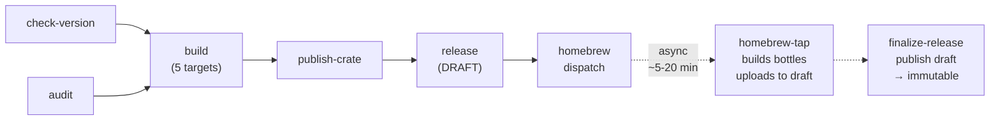
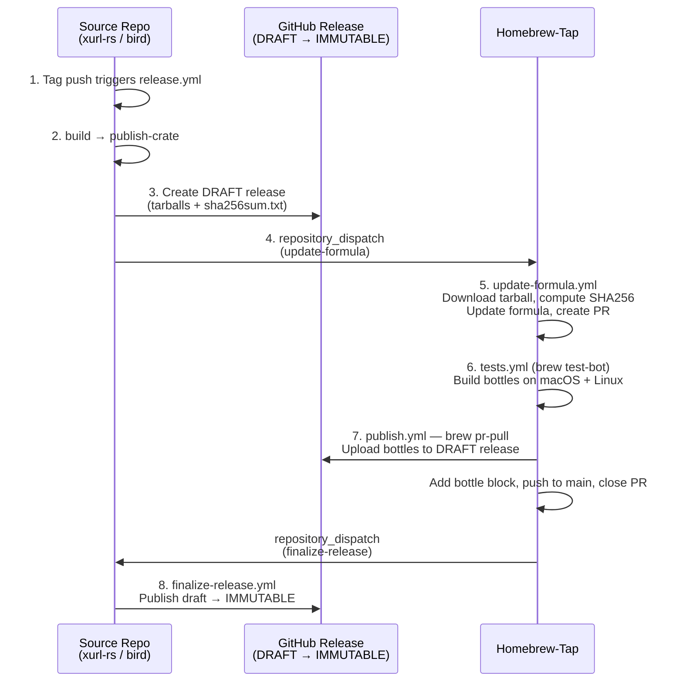

# ci: Unified release pipeline for all brettdavies Rust CLI tools

## Enhancement Summary

**Deepened on:** 2026-03-18
**Sections enhanced:** 7 (original) + 5 (agent review pass)
**Research agents used:** security-sentinel, architecture-strategist, pattern-recognition-specialist,
code-simplicity-reviewer, performance-oracle, spec-flow-analyzer, best-practices-researcher,
learnings-researcher, framework-docs-researcher, repo-research-analyst

### Key Improvements

1. **Security: `dtolnay/rust-toolchain` SHA pinning** -- currently uses `@stable` (branch ref), which is an
   exception to the SHA-pinning rule. Document this exception explicitly or pin to a commit SHA from master.
2. **Reliability: cargo-binstall `pkg-url` naming convention** -- the plan's archive naming `<CRATE>-{ target }`
   doesn't match cargo-binstall's default expectation of `{ name }-{ target }-v{ version }`. Either align naming
   or keep the explicit `pkg-url` override (plan already does this correctly).
3. **Supply chain: `actions/attest` replaces `attest-build-provenance`** -- as of v4, `actions/attest` is the
   recommended action for SLSA provenance. Deferred section should reference this.
4. **Performance: `cross` install overhead** -- `cargo install cross --locked` runs uncached on every release,
   adding ~40-60s. Consider caching the cross binary or using `cargo-binstall cross`.
5. **Edge case: Pre-release tags** -- the tag regex `v[0-9]+.[0-9]+.[0-9]+` won't match `v1.0.0-rc.1` or
   `v1.0.0+build`. This is correct behavior (pre-releases should not trigger full releases) but should be
   documented.
6. **Correctness: xurl-rs Cargo.toml already excludes `completions/`** -- the plan's Technical Considerations
   section discusses adding completions to exclude, but the current Cargo.toml already has `"completions/"` in
   the exclude list. The decision to keep them OUT of exclude means removing the existing entry.
7. **Real-world validation: v1.0.3 release had failures** -- git history shows aarch64-linux cross-compilation
   failed on the first v1.0.3 attempt and macOS x86_64 runner (`macos-13`) was unsupported. The template
   correctly uses `macos-latest` instead of `macos-13`, fixing this.
8. **Security: Least-privilege permissions** -- top-level `permissions: contents: write` narrowed to
   `contents: read`; only the `release` job overrides to `write`.
9. **Supply chain: `cross` version pinned** -- `cargo install cross --locked --version 0.2.5` prevents
   unexpected major version changes.
10. **Security: GitHub Immutable Releases** -- enabled on all repos. Releases use draft-then-publish
    pattern with reverse dispatch from homebrew-tap to finalize.
11. **CI alignment: ci.yml template** -- xurl-rs ci.yml missing `audit` and `package-check` jobs that
    bird already has. New ci.yml template ensures both repos catch `deny.toml` violations and packaging
    issues on PRs, not just at release time.
12. **Documentation: Artifact naming convention** -- explicitly documents the naming change from
    `xr-<target>` to `xurl-rs-<target>` and the `publish` → `publish-crate` job rename.

### New Considerations Discovered

- **Cargo.toml `completions/` exclude conflict** -- current xurl-rs Cargo.toml already excludes completions;
  plan must explicitly remove it
- **`publish-crate` should run before `release` but currently parallel** -- in the current xurl-rs release.yml,
  `publish` and `release` both depend only on `build` (parallel). The template correctly serializes them:
  `publish-crate` then `release`. This prevents advertising a release before crates.io has the version.
- **Homebrew job should depend on `release`, not `publish-crate`** -- Homebrew needs the GitHub Release assets
  (tarballs) to exist for sha256 verification. The template correctly has `homebrew` depend on `release`.
- **`deny.toml` license list may need `Unicode-DFS-2016`** -- some Rust ecosystem crates use this license
  (notably `unicode-ident`). Verify with `cargo deny check` after creating deny.toml.
- **Immutable Releases conflicts with Homebrew bottle flow** -- bottles are uploaded to the source repo's
  release *after* creation. Resolved via draft-then-publish pattern with reverse dispatch finalization.

---

## Overview

Standardize the release pipeline across all brettdavies Rust CLI tools (currently bird and xurl-rs, with more
planned) using a single canonical template. bird is ahead; xurl-rs is behind on 8 features. Both are missing
SHA256 checksums. The template lives in the `rust-tool-release` skill so every repo gets identical CI.

**Distribution context:** This is Phase 2 of the broader release distribution strategy
(see `docs/brainstorms/2026-03-17-release-distribution-evaluation.md`). Homebrew bottles (Phase 1) are handled
separately in the homebrew-tap repo. install.sh/install.ps1 are deferred to a later phase.

## Problem Statement

bird and xurl-rs have divergent release pipelines. bird has the "right" pipeline; xurl-rs is missing 8 features:

| Feature | bird | xurl-rs |
| ------- | ---- | ------- |
| Version check (tag vs Cargo.toml) | Yes | **Missing** |
| cargo-deny audit | Yes | **Missing** |
| Dependency caching (rust-cache) | Yes | **Missing** |
| `--locked` build flag | Yes | **Missing** |
| macOS ad-hoc codesign | Yes | **Missing** |
| Archives (tarball/zip with completions + licenses) | Yes | **Missing** (bare binaries) |
| git-cliff changelog | Yes | **Missing** (uses GitHub auto-notes) |
| cargo-binstall metadata | Yes | **Missing** |
| All 5 shell completions | Yes | **Missing** (3 of 5, wrong naming) |
| `codegen-units=1` + `panic=abort` in release profile | Yes | **Missing** |
| SHA256 checksums | **Missing** | **Missing** |

## Proposed Solution

1. Create canonical templates in the `rust-tool-release` skill: `release.yml`, `finalize-release.yml`,
   `ci.yml`, and `Cargo.toml` partial (release profile + binstall metadata)
2. Apply templates to bird first (lower risk — bird is already close to the template). Update
   homebrew-tap `publish.yml` with finalize-release dispatch. Verify with a release. Iterate on
   templates if issues found.
3. Apply validated templates to xurl-rs (catching it up to bird + adding checksums, audit,
   package-check, Immutable Releases)
4. Update SKILL.md to reference templates as canonical source
5. Enable GitHub Immutable Releases on both repos

### Decision: cargo-dist rejected

A cargo-dist spike (see `docs/brainstorms/2026-03-17-cargo-dist-spike-findings.md`) confirmed all three
integration questions answered YES, but the trade-offs are unfavorable:

- 323 lines of opaque auto-generated YAML vs ~170 lines of transparent hand-written YAML
- Unversioned action tags (`@v6`) violate SHA-pinning convention
- `[profile.dist]` overrides fat LTO with thin LTO
- Adds `pull_request` trigger and CDN dependency on every run
- Custom jobs survive `dist generate` but add two more workflow files

The custom approach gives us full control, SHA-pinned actions, and identical CI across repos.

## Implementation

### Phase 1: Create templates in skill directory

**New directory:** `~/.claude/skills/rust-tool-release/templates/`

#### Template: `release.yml`

Parameterized by:

- `<CRATE>` -- crate name (e.g., `xurl-rs`, `bird`)
- `<BIN>` -- binary name (e.g., `xr`, `bird`)

```yaml
# Build cross-platform release binaries, publish to crates.io, and create GitHub
# Release on version tag push (e.g. v1.0.0).
name: Release

on:
  push:
    tags:
      - 'v[0-9]+.[0-9]+.[0-9]+'

permissions:
  contents: read  # least-privilege default; only release job needs write

env:
  FORCE_JAVASCRIPT_ACTIONS_TO_NODE24: true

jobs:
  check-version:
    runs-on: ubuntu-22.04
    steps:
      - uses: actions/checkout@de0fac2e4500dabe0009e67214ff5f5447ce83dd # v6.0.2

      - name: Verify tag matches Cargo.toml version
        run: |
          TAG_VERSION="${GITHUB_REF_NAME#v}"
          CARGO_VERSION=$(cargo pkgid | sed 's/.*#//')
          if [ "$TAG_VERSION" != "$CARGO_VERSION" ]; then
            echo "::error::Tag ${GITHUB_REF_NAME} does not match Cargo.toml version ${CARGO_VERSION}"
            exit 1
          fi

  audit:
    runs-on: ubuntu-22.04
    strategy:
      matrix:
        checks: [advisories, "bans licenses sources"]
    continue-on-error: ${{ matrix.checks == 'advisories' }}
    steps:
      - uses: actions/checkout@de0fac2e4500dabe0009e67214ff5f5447ce83dd # v6.0.2
      - uses: EmbarkStudios/cargo-deny-action@3fd3802e88374d3fe9159b834c7714ec57d6c979 # v2.0.15
        with:
          command: check ${{ matrix.checks }}

  build:
    needs: [check-version, audit]
    strategy:
      fail-fast: false
      matrix:
        include:
          - os: ubuntu-22.04
            target: x86_64-unknown-linux-gnu
            artifact: <BIN>
          - os: ubuntu-22.04
            target: aarch64-unknown-linux-gnu
            artifact: <BIN>
            cross: true
          - os: macos-14
            target: aarch64-apple-darwin
            artifact: <BIN>
          - os: macos-latest
            target: x86_64-apple-darwin
            artifact: <BIN>
          - os: windows-latest
            target: x86_64-pc-windows-msvc
            artifact: <BIN>.exe

    runs-on: ${{ matrix.os }}
    steps:
      - uses: actions/checkout@de0fac2e4500dabe0009e67214ff5f5447ce83dd # v6.0.2

      - name: Install Rust
        uses: dtolnay/rust-toolchain@stable
        with:
          targets: ${{ matrix.target }}

      - name: Cache dependencies
        uses: Swatinem/rust-cache@c19371144df3bb44fab255c43d04cbc2ab54d1c4 # v2.9.1
        with:
          key: ${{ matrix.target }}

      - name: Install cross
        if: matrix.cross
        run: cargo install cross --locked --version 0.2.5

      - name: Build release
        run: ${{ matrix.cross && 'cross' || 'cargo' }} build --release --locked --target ${{ matrix.target }}

      - name: Ad-hoc codesign (macOS)
        if: runner.os == 'macOS'
        run: |
          codesign --force --sign - "target/${{ matrix.target }}/release/<BIN>"
          codesign --verify --verbose "target/${{ matrix.target }}/release/<BIN>"

      - name: Create archive
        shell: bash
        run: |
          STAGING="<CRATE>-${{ matrix.target }}"
          mkdir -p "$STAGING"
          cp "target/${{ matrix.target }}/release/${{ matrix.artifact }}" "$STAGING/"
          cp LICENSE-MIT LICENSE-APACHE README.md "$STAGING/"
          cp -r completions "$STAGING/"
          if [[ "${{ matrix.target }}" == *windows* ]]; then
            7z a "${STAGING}.zip" "$STAGING"
          else
            tar czf "${STAGING}.tar.gz" "$STAGING"
          fi

      - name: Upload artifact
        uses: actions/upload-artifact@bbbca2ddaa5d8feaa63e36b76fdaad77386f024f # v7.0.0
        with:
          name: <CRATE>-${{ matrix.target }}
          path: <CRATE>-${{ matrix.target }}.*

  publish-crate:
    needs: build
    runs-on: ubuntu-22.04
    permissions:
      id-token: write
    steps:
      - uses: actions/checkout@de0fac2e4500dabe0009e67214ff5f5447ce83dd # v6.0.2

      - name: Install Rust
        uses: dtolnay/rust-toolchain@stable

      - name: Authenticate with crates.io
        id: crates-io-auth
        uses: rust-lang/crates-io-auth-action@b7e9a28eded4986ec6b1fa40eeee8f8f165559ec # v1.0.3

      - name: Publish to crates.io
        run: cargo publish
        env:
          CARGO_REGISTRY_TOKEN: ${{ steps.crates-io-auth.outputs.token }}

  release:
    needs: [build, publish-crate]
    runs-on: ubuntu-22.04
    permissions:
      contents: write  # required for creating GitHub Release
    steps:
      - uses: actions/checkout@de0fac2e4500dabe0009e67214ff5f5447ce83dd # v6.0.2
        with:
          fetch-depth: 0

      - name: Generate changelog
        id: changelog
        uses: orhun/git-cliff-action@c93ef52f3d0ddcdcc9bd5447d98d458a11cd4f72 # v4.7.1
        with:
          config: cliff.toml
          args: --latest --strip header

      - name: Download all artifacts
        uses: actions/download-artifact@3e5f45b2cfb9172054b4087a40e8e0b5a5461e7c # v8.0.1
        with:
          path: artifacts

      - name: Prepare release assets and checksums
        run: |
          mkdir -p release
          for dir in artifacts/<CRATE>-*; do
            [ ! -d "$dir" ] && continue
            cp "$dir"/*.tar.gz "$dir"/*.zip release/ 2>/dev/null || true
          done
          cd release
          if [ -z "$(ls -A)" ]; then
            echo "::error::No release artifacts found"
            exit 1
          fi
          sha256sum * > sha256sum.txt
          ls -la

      - name: Create GitHub Release (draft)
        uses: softprops/action-gh-release@153bb8e04406b158c6c84fc1615b65b24149a1fe # v2.6.1
        with:
          files: release/*
          body: ${{ steps.changelog.outputs.content }}
          draft: true  # draft until bottles are uploaded, then finalized
        env:
          GITHUB_TOKEN: ${{ secrets.GITHUB_TOKEN }}

  homebrew:
    needs: release
    runs-on: ubuntu-latest
    steps:
      - name: Dispatch Homebrew formula update
        env:
          GH_TOKEN: ${{ secrets.HOMEBREW_TAP_TOKEN }}
          VERSION: ${{ github.ref_name }}
        run: |
          gh api repos/brettdavies/homebrew-tap/dispatches \
            --method POST \
            -f event_type=update-formula \
            -f 'client_payload[formula]=<CRATE>' \
            -f "client_payload[version]=${VERSION#v}" \
            -f 'client_payload[repo]=brettdavies/<CRATE>'
```

**Job dependency graph (source repo):**



### Research Insights: Template Design

**Best Practices:**

- The `<CRATE>`/`<BIN>` substitution pattern is the simplest viable approach for 2-3 repos. If the repo
  count grows beyond ~5, consider a reusable workflow (`workflow_call`) in a shared `.github` repo instead of
  copy-paste templates with substitution.
- The job dependency graph is well-designed: `publish-crate` before `release` prevents advertising a GitHub
  Release for a version that failed to publish to crates.io. `homebrew` after `release` ensures tarballs exist
  for sha256 verification in the Homebrew formula updater.

**Homebrew Bottle Upload Flow (cross-repo):**

The full release-to-bottle pipeline spans **two repos** and is critical to understand:



**Final release assets (immutable):**

- `<CRATE>-x86_64-unknown-linux-gnu.tar.gz`
- `<CRATE>-aarch64-unknown-linux-gnu.tar.gz`
- `<CRATE>-aarch64-apple-darwin.tar.gz`
- `<CRATE>-x86_64-apple-darwin.tar.gz`
- `<CRATE>-x86_64-pc-windows-msvc.zip`
- `sha256sum.txt`
- `<CRATE>-X.Y.Z.arm64_tahoe.bottle.tar.gz`
- `<CRATE>-X.Y.Z.x86_64_linux.bottle.tar.gz`

**Key implications for this plan:**

- The `HOMEBREW_TAP_TOKEN` fine-grained PAT must have `contents: write` on BOTH the homebrew-tap repo
  AND the source repo (xurl-rs, bird) — because `brew pr-pull` uploads bottle assets to the source repo's
  GitHub Release.
- The `root_url` in the bottle block points to the source repo release (e.g.,
  `https://github.com/brettdavies/xurl-rs/releases/download/v1.0.5`), not the homebrew-tap repo.
- bird v0.1.1 already has this working — bottles are confirmed on the bird GitHub Release alongside the
  binary tarballs.
- xurl-rs does NOT yet have bottles. The first release after this plan will trigger the full flow for the
  first time.

**Performance Considerations:**

- **Total pipeline wall-clock time estimate:** ~8-12 minutes (check-version + audit: ~1-2min parallel with
  build start; build: ~3-5min for slowest target; publish: ~1min; release: ~30s; homebrew: ~5s)
- **Cross-compilation is the bottleneck:** `cargo install cross --locked --version 0.2.5` takes ~40-60s on
  every run because `rust-cache` doesn't cache `~/.cargo/bin`. Version is pinned for supply chain safety.
  Future optimization: switch to `cargo binstall cross` (downloads pre-built binary, ~5s) or cache
  `~/.cargo/bin/cross` explicitly.
- **Fat LTO + `codegen-units=1` is justified:** For CLI tools with small codebases, the ~10-17% binary size
  reduction and minor performance gains outweigh the ~30-60s extra compile time. This trades CI time for user
  download size.

**Edge Cases:**

- **Pre-release tags:** The regex `v[0-9]+.[0-9]+.[0-9]+` correctly excludes `v1.0.0-rc.1` and
  `v1.0.0+build`. This is intentional -- pre-releases should not trigger crates.io publish or Homebrew
  updates. Document this in the skill.
- **`sha256sum` on macOS:** The `sha256sum` command doesn't exist on macOS, but the checksum step runs on
  `ubuntu-22.04` so this is fine. The command is only in the `release` job, not the `build` job.
- **Empty release directory:** If all 5 builds fail (fail-fast: false), downstream jobs won't run because
  the `build` job reports failure. As defense-in-depth, the template includes an explicit empty-dir guard
  before `sha256sum` that fails with a clear error message.
- **Windows 7z availability:** `7z` is pre-installed on `windows-latest` GitHub Actions runners. No additional
  setup needed.
- **Mid-pipeline failure recovery:** If `publish-crate` succeeds but `release` fails (e.g., git-cliff error,
  softprops failure), the crates.io version is "burned" but no GitHub Release exists. Mitigation: re-run the
  failed `release` job from the GitHub Actions UI. Worst case: yank the crates.io version and bump to a new
  patch.

#### Template: `finalize-release.yml`

Triggered by `repository_dispatch` from homebrew-tap after bottles are uploaded. Publishes the draft
release, making it immutable.

```yaml
# Publish a draft GitHub Release after Homebrew bottles are uploaded.
# Triggered by repository_dispatch from homebrew-tap's publish workflow.
name: Finalize Release

on:
  repository_dispatch:
    types: [finalize-release]

permissions:
  contents: write  # required to publish the draft release

env:
  FORCE_JAVASCRIPT_ACTIONS_TO_NODE24: true

jobs:
  finalize:
    runs-on: ubuntu-22.04
    steps:
      - name: Publish draft release
        env:
          GH_TOKEN: ${{ secrets.GITHUB_TOKEN }}
        run: |
          TAG="${{ github.event.client_payload.tag }}"
          if [ -z "$TAG" ]; then
            echo "::error::No tag provided in dispatch payload"
            exit 1
          fi
          RELEASE_ID=$(gh api "repos/${{ github.repository }}/releases" \
            --jq ".[] | select(.tag_name == \"${TAG}\" and .draft == true) | .id")
          if [ -z "$RELEASE_ID" ]; then
            echo "::error::No draft release found for tag ${TAG}"
            exit 1
          fi
          gh api "repos/${{ github.repository }}/releases/${RELEASE_ID}" \
            --method PATCH \
            -f draft=false
          echo "Published release ${TAG} (id: ${RELEASE_ID})"
```

**Homebrew-tap side change:** Add a dispatch step to homebrew-tap's `publish.yml` after bottle upload:

```yaml
      - name: Finalize source repo release
        env:
          GH_TOKEN: ${{ secrets.HOMEBREW_TAP_TOKEN }}
        run: |
          gh api "repos/${{ github.event.client_payload.repo }}/dispatches" \
            --method POST \
            -f event_type=finalize-release \
            -f "client_payload[tag]=v${{ github.event.client_payload.version }}"
```

The `client_payload.repo` (e.g., `brettdavies/xurl-rs`) and `client_payload.version` are already
passed through from the source repo's `homebrew` dispatch job.

#### Template: `ci.yml`

Matches bird's proven CI structure. Parameterized by `<CRATE>`.

```yaml
name: CI

on:
  push:
    branches: [main]
  pull_request:
    branches: [main]

permissions:
  contents: read

concurrency:
  group: ${{ github.workflow }}-${{ github.ref }}
  cancel-in-progress: true

env:
  CARGO_TERM_COLOR: always
  FORCE_JAVASCRIPT_ACTIONS_TO_NODE24: true
  RUSTFLAGS: "-Dwarnings"

jobs:
  check:
    name: Fmt, clippy, test
    runs-on: ubuntu-22.04
    steps:
      - uses: actions/checkout@de0fac2e4500dabe0009e67214ff5f5447ce83dd # v6.0.2

      - name: Install Rust
        uses: dtolnay/rust-toolchain@stable
        with:
          components: rustfmt, clippy

      - name: Cache dependencies
        uses: Swatinem/rust-cache@c19371144df3bb44fab255c43d04cbc2ab54d1c4 # v2.9.1

      - name: Check formatting
        run: cargo fmt --all --check

      - name: Clippy
        run: cargo clippy --all-targets

      - name: Tests
        run: cargo test

  audit:
    name: Security audit
    runs-on: ubuntu-22.04
    strategy:
      matrix:
        checks: [advisories, "bans licenses sources"]
    continue-on-error: ${{ matrix.checks == 'advisories' }}
    steps:
      - uses: actions/checkout@de0fac2e4500dabe0009e67214ff5f5447ce83dd # v6.0.2
      - uses: EmbarkStudios/cargo-deny-action@3fd3802e88374d3fe9159b834c7714ec57d6c979 # v2.0.15
        with:
          command: check ${{ matrix.checks }}

  package-check:
    name: Package check
    runs-on: ubuntu-22.04
    steps:
      - uses: actions/checkout@de0fac2e4500dabe0009e67214ff5f5447ce83dd # v6.0.2

      - name: Install Rust
        uses: dtolnay/rust-toolchain@stable

      - name: Cache dependencies
        uses: Swatinem/rust-cache@c19371144df3bb44fab255c43d04cbc2ab54d1c4 # v2.9.1

      - name: List package contents
        run: cargo package --list

      - name: Dry-run publish
        run: cargo publish --dry-run
```

#### Template: `Cargo.toml` release profile + binstall (partial)

```toml
[profile.release]
strip = true
lto = true
codegen-units = 1
panic = "abort"

[package.metadata.binstall]
pkg-url = "{ repo }/releases/download/v{ version }/<CRATE>-{ target }.tar.gz"
pkg-fmt = "tgz"
```

### Research Insights: cargo-binstall Configuration

**Best Practices:**

- The default cargo-binstall convention expects archives named `{ name }-{ target }-v{ version }.tgz`. The
  plan's naming (`<CRATE>-{ target }.tar.gz`, without the version in the filename) differs from the default.
  The explicit `pkg-url` override in the template handles this correctly.
- Consider adding a `bin-dir` field if the binary is inside a subdirectory of the archive:
  `bin-dir = "<CRATE>-{ target }/{ bin }{ binary-ext }"` -- this tells binstall where inside the tarball to
  find the binary.
- For Windows, cargo-binstall needs a separate `pkg-url` for `.zip` format. Add a platform-specific override:

```toml
[package.metadata.binstall.overrides.x86_64-pc-windows-msvc]
pkg-url = "{ repo }/releases/download/v{ version }/<CRATE>-{ target }.zip"
pkg-fmt = "zip"
```

**References:**

- [cargo-binstall SUPPORT.md](https://github.com/cargo-bins/cargo-binstall/blob/main/SUPPORT.md)
- [cargo-binstall README](https://github.com/cargo-bins/cargo-binstall/blob/main/README.md)

### Phase 2: Apply templates to bird + homebrew-tap (validate)

Bird is the validation target — it already has most features and needs fewer changes. Apply templates
here first to catch issues before the larger xurl-rs changes.

**Rationale:** Bird already has check-version, audit, archives, codesign, completions, git-cliff
changelog, binstall metadata, and the full Homebrew bottle flow working. The delta is small: checksums,
permissions, draft release, and finalize-release. This makes bird ideal for validating templates.

Changes to bird:

1. **`.github/workflows/release.yml`** -- add checksums step, empty-dir guard, cross version pin, and
   `draft: true` on release creation. Update top-level permissions to `contents: read` with per-job
   override on `release`. Bird already has everything else.
2. **`.github/workflows/finalize-release.yml`** -- new workflow from template
3. **`.github/workflows/ci.yml`** -- already has audit + package-check; verify it matches the ci.yml
   template exactly (may need minor alignment)
4. **Enable Immutable Releases** -- Repository Settings → Releases → Enable release immutability

Changes to homebrew-tap:

1. **`.github/workflows/publish.yml`** -- add `finalize-release` dispatch step after bottle upload
   (see template in Phase 1)

**Verify bird release pipeline:**

1. Tag a patch release on bird
2. Verify: checksums + empty-dir guard work
3. Verify: release is created as **draft**
4. Verify: Homebrew dispatch fires, bottles upload to draft
5. Verify: `finalize-release` dispatch fires from homebrew-tap
6. Verify: draft is published → immutable
7. Iterate on templates if any issues found

### Phase 3: Apply templates to xurl-rs

Apply the validated templates to xurl-rs. This is the larger change — xurl-rs is behind on 8 features.

Changes to xurl-rs:

1. **`.github/workflows/release.yml`** -- replace entirely with template (substituting `<CRATE>=xurl-rs`,
   `<BIN>=xr`)
2. **`.github/workflows/finalize-release.yml`** -- new workflow from template
3. **`.github/workflows/ci.yml`** -- replace with ci.yml template; adds `audit` and `package-check` jobs
   (currently missing). Without this, `deny.toml` would only be checked at release time, not on PRs.
4. **`Cargo.toml`** -- add `codegen-units = 1`, `panic = "abort"`, and `[package.metadata.binstall]`;
   **remove `"completions/"` from the `exclude` list** (it's currently excluded but should ship with
   `cargo install`)
5. **`deny.toml`** -- create via `cargo deny init`, configure for dual MIT/Apache-2.0
6. **`completions/`** -- regenerate all 5 shells with correct naming (`xr.bash`, `xr.zsh`, `xr.fish`,
   `xr.elvish`, `xr.powershell`); remove legacy `_xr`
7. **Enable Immutable Releases** -- Repository Settings → Releases → Enable release immutability

**Breaking changes to document:**

- **Artifact naming:** Release artifacts change from `xr-<target>` (binary name) to `xurl-rs-<target>`
  (crate name). This aligns with bird's convention (`bird-<target>`) and cargo-binstall's `pkg-url`.
  The naming convention is `<CRATE>-<target>` across all repos and Homebrew formulas.
- **Job rename:** `publish` → `publish-crate` to match template convention. Verify no branch protection
  rules reference the old job name before merging.
- **Job ordering:** `release` and `publish` currently run in parallel (both depend on `build`). Template
  serializes them: `publish-crate` → `release`. This prevents advertising a GitHub Release for a version
  that hasn't published to crates.io yet.

### Research Insights: Phase 3 Specifics

**Cargo.toml `completions/` exclude -- CONFLICT DETECTED:**

The current xurl-rs `Cargo.toml` (line 20) already has `"completions/"` in the exclude list. The plan's
Technical Considerations section decided to keep completions OUT of exclude (i.e., ship them with
`cargo install`). This means Phase 3 must explicitly **remove** `"completions/"` from the exclude array.
This is a code change not originally called out in the Phase 3 file list.

**deny.toml license list -- VERIFY AT RUNTIME:**

The plan lists `MIT`, `Apache-2.0`, `BSD-2-Clause`, `BSD-3-Clause`, `ISC`, `Unicode-3.0`, `OpenSSL`, `Zlib`.
This list may need additional entries depending on the current dependency tree:

- `Unicode-DFS-2016` -- used by `unicode-ident` (pulled in by `proc-macro2` / `syn`)
- `MPL-2.0` -- used by some Mozilla crates (check if any are in the tree)
- `CC0-1.0` -- used by some small utility crates

**Action:** After creating `deny.toml`, run `cargo deny check licenses` and add any missing licenses to the
allow list rather than guessing.

**Completions naming -- VERIFY CURRENT STATE:**

The plan says xurl-rs has "3 of 5, wrong naming." Verify current state:

```bash
ls -la completions/
```

Expected current state: `_xr` (zsh), `xr.bash`, `xr.fish` (based on plan description). Need to regenerate
all 5 with the generate-completions.sh helper script.

### Phase 4: Update SKILL.md

Changes to `~/.claude/skills/rust-tool-release/SKILL.md`:

1. Change "reference implementation is xurl-rs" to "reference templates are in `templates/`"
2. Update the release.yml section to reference the template instead of inline YAML
3. Add checksums to the release job documentation
4. Update the `cargo-deny` pinned SHA from `v2.0.11` to `v2.0.15` (bird already uses the newer version)
5. Document the draft-then-publish pattern and finalize-release workflow
6. Document `dtolnay/rust-toolchain@stable` as a documented SHA-pinning exception
7. **Do NOT add `completions/` to exclude** (decision: keep them in the crate package)

### Research Insights: Skill Template Architecture

**Scalability assessment:**

- **2-3 repos:** Copy-paste with `<CRATE>`/`<BIN>` substitution is appropriate
- **5+ repos:** Migrate to a GitHub reusable workflow (`workflow_call`) with inputs for crate/binary names.
  This eliminates template drift entirely. The skill can document both patterns.
- **Current approach is correct** for the current scale. YAGNI applies -- don't build reusable workflow
  infrastructure for 2 repos.

**SKILL.md update -- additional items to address:**

- The skill's `[Cargo.toml Standard]` section shows `deny.toml` in the exclude list but `deny.toml` is also
  a Required File. This is correct (exclude from crate package, keep in repo).
- The skill references `~/dev/xurl-rs/RELEASING.md` but this file may not exist or may be outdated. Verify
  during implementation.

### Phase 5: Verify xurl-rs release pipeline

After merging to main:

1. Tag a patch release
2. Verify: version check passes
3. Verify: audit passes (cargo-deny in release pipeline)
4. Verify: 5 targets build with `--locked`
5. Verify: macOS binaries are codesigned
6. Verify: tarballs contain binary + completions + licenses + README
7. Verify: `sha256sum.txt` is attached to the GitHub Release
8. Verify: crates.io publish succeeds via Trusted Publishing
9. Verify: git-cliff changelog in release body
10. Verify: GitHub Release is created as **draft** (not published)
11. Verify: Homebrew dispatch fires
12. Verify: bottles are uploaded to the draft release
13. Verify: `finalize-release` dispatch fires from homebrew-tap
14. Verify: draft release is published → immutable
15. Verify: CI audit + package-check jobs run on PRs (ci.yml alignment)
16. Verify: `cargo binstall xurl-rs` works (tests binstall metadata end-to-end)
17. Verify: tarball structure (`tar tzf xurl-rs-x86_64-unknown-linux-gnu.tar.gz`) shows binary,
    completions/, licenses, README at expected paths

### Research Insights: Verification Phase

**Historical failures to watch for (from v1.0.3 release history):**

- **aarch64-linux cross-compilation failure:** The v1.0.3 release failed on the first attempt because `cross`
  build returned exit code 101. Root cause was likely a `native-tls` / OpenSSL issue (the template uses
  `rustls-tls` which avoids this, but verify the dependency tree has no transitive `native-tls`).
- **macOS x86_64 runner name:** The first v1.0.3 attempt used `macos-13` which is no longer supported. The
  template correctly uses `macos-latest`. GitHub periodically retires older macOS runner images -- pin to
  `macos-latest` for x86_64 to follow the latest available.
- **Node.js 20 deprecation warning:** The v1.0.3 build showed a warning about `actions/upload-artifact@v5`
  running on Node.js 20. The template uses v7.0.0 with SHA pinning and `FORCE_JAVASCRIPT_ACTIONS_TO_NODE24`,
  which resolves this.

## Acceptance Criteria

**Phase 1 — Skill templates:**

- [x] Template `release.yml` exists in `~/.claude/skills/rust-tool-release/templates/`
- [x] Template `finalize-release.yml` exists in same directory
- [x] Template `ci.yml` exists in same directory
- [x] Template `Cargo-release-profile.toml` exists in same directory
- [x] `cross` version is pinned in release template for supply chain safety

**Phase 2 — Bird + homebrew-tap (validate):**

- [x] bird `release.yml` has checksums, empty-dir guard, draft release, least-privilege permissions
- [x] bird has `finalize-release.yml` matching template
- [x] bird `ci.yml` matches ci template
- [x] homebrew-tap `publish.yml` dispatches `finalize-release` to source repo after bottle upload
- [ ] GitHub Immutable Releases enabled on bird
- [ ] bird release verified end-to-end (draft → bottles → finalize → immutable)

**Phase 3 — xurl-rs:**

- [ ] xurl-rs `release.yml` matches release template (with xurl-rs/xr substitutions)
- [ ] xurl-rs `finalize-release.yml` matches template
- [ ] xurl-rs `ci.yml` matches ci template (has audit + package-check jobs)
- [ ] xurl-rs `Cargo.toml` has `codegen-units = 1`, `panic = "abort"`, `[package.metadata.binstall]`
- [ ] xurl-rs `Cargo.toml` does NOT have `completions/` in exclude list
- [ ] xurl-rs has `deny.toml` with verified license allow list
- [ ] xurl-rs `completions/` has all 5 shells with correct naming
- [ ] GitHub Immutable Releases enabled on xurl-rs

**Phase 4 — SKILL.md + cross-repo consistency:**

- [ ] SKILL.md references templates, not xurl-rs as reference implementation
- [ ] SKILL.md cargo-deny SHA updated to v2.0.15
- [ ] SKILL.md documents draft-then-publish pattern and finalize-release workflow
- [ ] bird and xurl-rs release.yml are structurally identical (diff only in crate/binary names)
- [ ] bird and xurl-rs ci.yml are structurally identical
- [ ] All pinned action SHAs are consistent between both repos and the skill

**Phase 5 — xurl-rs verification:**

- [ ] xurl-rs release verified end-to-end (draft → bottles → finalize → immutable)
- [ ] `cargo binstall xurl-rs` works after release

## Technical Considerations

### completions/ in Cargo.toml exclude

The skill currently says "Do NOT add `completions/` to `Cargo.toml` `exclude`." This should be reversed.
Completions are 400KB+ of generated text that bloat the crates.io package. `cargo install` users can generate
completions via the CLI. Homebrew generates them at install time. Only the GitHub Release tarballs need
pre-baked completions (and those bundle from the repo checkout, not the crate package). bird already excludes
`completions/` implicitly (no `completions/` in its exclude list but also no completions dir committed yet --
update: bird DOES have completions in repo but doesn't exclude them).

**Decision:** Keep `completions/` OUT of `Cargo.toml` `exclude`. The files are small enough relative to the
crate size and users of `cargo install` benefit from having them available. Homebrew and tarballs handle their
own completions independently.

**Action required:** xurl-rs currently HAS `"completions/"` in its exclude list (Cargo.toml line 20). This
must be removed to match the decision.

### panic = "abort" safety

`panic = "abort"` is safe for CLI tools -- there's no shared library or FFI boundary where unwinding is required.
It removes ~100KB of unwinding tables from the binary.

### Research Insights: panic = "abort" Implications

- `panic = "abort"` also means `catch_unwind` won't work (it immediately aborts). xurl-rs doesn't use
  `catch_unwind` anywhere, so this is safe.
- If xurl-rs ever adds a library API that third-party code calls, `panic = "abort"` in the release profile
  only affects the binary, not library consumers (they use their own profile). So this remains safe even with
  a dual binary/library crate.

### deny.toml for xurl-rs

xurl-rs currently has no `deny.toml`. Generate one with `cargo deny init` and configure:

- `[licenses]` allow list: `MIT`, `Apache-2.0`, `BSD-2-Clause`, `BSD-3-Clause`, `ISC`, `Unicode-3.0`,
  `OpenSSL`, `Zlib`
- `[advisories]` with default settings
- `[bans]` with default settings (no duplicates)
- `[sources]` with default settings (crates.io only)

### Research Insights: deny.toml Configuration

**License list -- likely additions needed:**

Run `cargo deny check licenses` after initial configuration. Common licenses in the Rust ecosystem that may
need to be added:

| License | Crate(s) | Notes |
|---------|----------|-------|
| `Unicode-DFS-2016` | `unicode-ident` | Pulled in by `proc-macro2`/`syn` |
| `Unicode-3.0` | Unicode data tables | Already in plan's list |
| `CC0-1.0` | Some small crates | Public domain equivalent |
| `MPL-2.0` | Mozilla crates | Check if any are transitive deps |

**Advisory handling pattern:**

The matrix strategy with `continue-on-error` for advisories is the standard pattern. Advisories can appear
at any time for crates you depend on, and blocking releases for unrelated advisories creates unnecessary
friction. The `bans licenses sources` check is strict (no continue-on-error) because those are under the
developer's control.

**Duplicate dependency bans:**

The default `[bans]` configuration warns on duplicate dependencies. For xurl-rs, there may be duplicates in
the `sha1`/`sha2`/`hmac` family depending on version resolution. If `cargo deny check bans` reports false
positives, add specific `skip` entries rather than disabling the check entirely.

### Security: SHA-pinning exceptions

**`dtolnay/rust-toolchain@stable`:** This action uses branch references (`@stable`, `@nightly`, `@master`)
rather than SHA pins. This is a documented exception in the skill because:

1. The action is simple (installs rustup + toolchain) with minimal attack surface
2. SHA pinning is impractical because you'd need to update the SHA every time `stable` advances
3. The action's author (David Tolnay) is a trusted Rust ecosystem maintainer

**Recommendation:** Document this exception explicitly in the skill's "Pin GitHub Actions by SHA" section
with the rationale above.

### Research Insights: cross vs cargo-zigbuild

**Current choice (`cross`) is correct for this use case:**

| Factor | cross | cargo-zigbuild |
|--------|-------|----------------|
| aarch64-linux-gnu | Docker-based, reliable | Zig-based, no Docker needed |
| Windows support | Full | Not supported |
| C/C++ FFI compatibility | More reliable | Can have issues |
| CI overhead | ~40-60s Docker pull | ~5s binary install |
| Cross-testing (QEMU) | Yes | No |

Since xurl-rs only uses `cross` for one target (aarch64-linux-gnu) and relies on `rustls-tls` (pure Rust,
no C dependencies), `cargo-zigbuild` would work and be faster. However, `cross` is the established pattern
and the overhead is acceptable for release builds (not CI builds). **Keep `cross` for now** -- the ~40s
overhead on release-only builds is not worth changing established patterns.

**Performance optimization (deferred):** Consider `cargo binstall cross` instead of
`cargo install cross --locked --version 0.2.5` to skip compilation and download a pre-built binary
(~5s vs ~40-60s). Version pinning is prioritized for supply chain safety over install speed.

### GitHub Immutable Releases

**Status:** Active — enable on both repos as part of this plan.

GitHub Immutable Releases (GA October 2025) prevents modification of release assets and tags after
publication. Once a release is published, assets cannot be added, modified, or deleted. Tags cannot be
moved or deleted. A release attestation is automatically generated.

**Conflict with Homebrew bottle flow:**

The bottle flow (documented above) requires `brew pr-pull` to upload bottle assets to the source repo's
GitHub Release *after* it's created. With Immutable Releases enabled, this would fail because the release
is already published and locked.

**Resolution: Draft-then-publish pattern:**

1. `release` job creates the GitHub Release as a **draft** (`draft: true`)
2. `homebrew` job dispatches to homebrew-tap (bottles build asynchronously, ~5-20 min)
3. `brew pr-pull` uploads bottles to the **still-draft** release (drafts are mutable)
4. After bottles land, a **finalize-release** workflow publishes the draft → immutable

**Finalization options (choose one during implementation):**

| Option | Mechanism | Pros | Cons |
|--------|-----------|------|------|
| Reverse dispatch | homebrew-tap dispatches back to source repo after bottle upload | Automatic, event-driven | Requires cross-repo PAT, adds workflow to both repos |
| Scheduled finalize | Cron job publishes drafts older than 30 min | Simple, no cross-repo coupling | Delay before release is visible; may publish before bottles land |
| Manual finalize | Maintainer runs `gh release edit --draft=false` | Zero infrastructure | Manual step, easy to forget |

**Decision: Reverse dispatch.** The `HOMEBREW_TAP_TOKEN` PAT already has cross-repo access. Add a
`finalize-release.yml` workflow to each source repo triggered by `repository_dispatch` from homebrew-tap's
`publish.yml` workflow. Homebrew-tap dispatches `finalize-release` after bottles are uploaded to the
source repo's draft release.

See the [job dependency graph](#template-releaseyml) and
[bottle upload flow](#research-insights-template-design) Mermaid diagrams above for the full picture.

**How to enable:**

- Repository Settings → Releases → Enable release immutability
- Or via organization policy for all repos

**References:**

- [GitHub Immutable Releases docs](https://docs.github.com/en/code-security/supply-chain-security/understanding-your-software-supply-chain/immutable-releases)
- [Immutable Releases GA announcement](https://github.blog/changelog/2025-10-28-immutable-releases-are-now-generally-available/)

### Deferred: install.sh / install.ps1

Escape-hatch installers are deferred to a future phase. They require the tarball infrastructure to be in place
first (which this plan establishes). The template can be extended later without changing the existing jobs.

### Deferred: zizmor (GitHub Actions static analysis)

[zizmor](https://github.com/woodruffw/zizmor) (v1.23.1+) is a static analysis tool for GitHub Actions
workflows. It detects template injection, unpinned actions, overscoped tokens, and other security issues.
Could be added as a CI check or pre-commit hook in a future iteration. Low priority since we already
SHA-pin actions and apply least-privilege permissions manually.

### Deferred: GitHub Artifact Attestations

### Research Insights: Artifact Attestations (Latest Guidance)

**Key update:** As of 2025, `actions/attest` (v4+) replaces `actions/attest-build-provenance` as the
recommended action. The older action is now a wrapper around `actions/attest`.

**SLSA levels achievable:**

| Level | Requirement | Status |
|-------|-------------|--------|
| Build L1 | Documented build process | Current (this plan) |
| Build L2 | Artifact attestation | Deferred (add `actions/attest`) |
| Build L3 | Reusable workflow isolation | Future (requires shared workflow repo) |

**Implementation when ready:**

```yaml
- name: Attest build provenance
  uses: actions/attest@v4
  with:
    subject-path: release/*
```

Requires `id-token: write` and `attestations: write` permissions on the job. Public repos use Sigstore
public-good instance (free). Attestations are verifiable with `gh attestation verify`.

**Recommendation:** Add attestation in the next iteration after this plan lands. It's one step per job and
provides meaningful supply-chain security improvement.

**References:**

- [actions/attest-build-provenance](https://github.com/actions/attest-build-provenance)
- [GitHub Artifact Attestations docs](https://docs.github.com/en/actions/concepts/security/artifact-attestations)
- [SLSA v1 Build Level 3 with reusable workflows](https://docs.github.com/actions/security-guides/using-artifact-attestations-and-reusable-workflows-to-achieve-slsa-v1-build-level-3)

### Learnings Applied

**From `docs/solutions/branch-reset-file-inventory.md`:**

Relevant to Phase 2-3 implementation. When applying template changes to bird and xurl-rs, the work will
involve the release branch pattern (branch from `origin/main`, cherry-pick non-docs commits). The branch
reset file inventory protocol applies if `dev` needs to be synced to `main` after merging. Always use
`git ls-tree -r --name-only` to verify no files are lost during branch operations.

**From `docs/solutions/rust-patterns/rust-cli-port-methodology.md`:**

The port methodology documents that xurl-rs uses `rustls-tls` for all HTTP (avoiding OpenSSL cross-compilation
issues). This is critical for the aarch64-linux cross-compilation target in the template. Verify this hasn't
changed by checking `Cargo.toml` reqwest features. The current `Cargo.toml` confirms:
`reqwest = { ..., features = ["json", "rustls-tls", ...] }` -- good.

## Sources & References

- cargo-dist spike: `docs/brainstorms/2026-03-17-cargo-dist-spike-findings.md`
- Distribution evaluation: `docs/brainstorms/2026-03-17-release-distribution-evaluation.md`
- bird release.yml: `~/dev/bird/.github/workflows/release.yml` (current reference implementation)
- xurl-rs release.yml: `~/dev/xurl-rs/.github/workflows/release.yml` (needs update)
- Skill: `~/.claude/skills/rust-tool-release/SKILL.md`
- Homebrew bottles plan: `~/dev/homebrew-tap/docs/plans/2026-03-17-001-ci-homebrew-bottle-publishing-plan.md`
- [cargo-binstall documentation](https://github.com/cargo-bins/cargo-binstall/blob/main/README.md)
- [GitHub Artifact Attestations](https://docs.github.com/en/actions/concepts/security/artifact-attestations)
- [actions/attest](https://github.com/actions/attest)
- [SLSA Build Level 3 guide](https://docs.github.com/actions/security-guides/using-artifact-attestations-and-reusable-workflows-to-achieve-slsa-v1-build-level-3)
- [dtolnay/rust-toolchain](https://github.com/dtolnay/rust-toolchain) -- SHA pinning exception rationale
- [cross-rs/cross](https://github.com/cross-rs/cross) vs [cargo-zigbuild](https://github.com/rust-cross/cargo-zigbuild) comparison
- [GitHub Immutable Releases docs](https://docs.github.com/en/code-security/supply-chain-security/understanding-your-software-supply-chain/immutable-releases)
- [Immutable Releases GA announcement](https://github.blog/changelog/2025-10-28-immutable-releases-are-now-generally-available/)
- [zizmor](https://github.com/woodruffw/zizmor) -- GitHub Actions static analysis (deferred)
