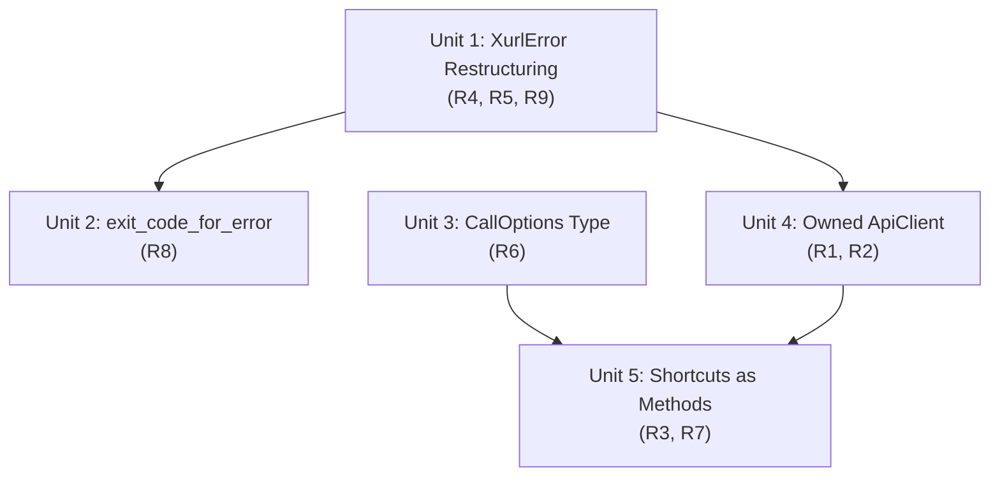

# feat: Library Ergonomics for Crate Consumers

## Overview

Replace `ApiClient<'a>` with an owned `ApiClient`, restructure `XurlError::Api` into `Api { status, body }` +
`Validation(String)`, introduce `CallOptions` for shortcut methods, convert 29 shortcut free functions to methods on
`ApiClient`, add `from_env()` constructor, and move `exit_code_for_error()` to the library. These changes make crate
embedding a first-class pattern alongside subprocess use, targeting bird as the primary consumer.

## Problem Frame

xurl-rs ships a library API with typed responses and 29 shortcut functions, but two API design choices optimized for
CLI-internal use create friction for crate consumers:

1. `ApiClient<'a>` borrows `&'a mut Auth`, preventing simple ownership in consumer structs.
2. `XurlError::Api(String)` contains raw JSON but doesn't expose the HTTP status code structurally, forcing
   string-matching to classify errors.

Additionally, shortcuts are free functions taking `&mut ApiClient` and `&RequestOptions` (which leaks internal request
structure). These are non-blocking (bird can work around all), but fixing them makes crate embedding first-class. (see
origin: `docs/brainstorms/2026-04-03-library-ergonomics-requirements.md`)

## Requirements Trace

- R1. Replace `ApiClient<'a>` with owned `ApiClient` holding `Auth` by value
- R2. `from_env()` constructor — one-liner setup returning `Result<ApiClient>`
- R3. Same API surface — all 29 shortcuts + `send_request()` supported
- R4. `XurlError::Api(String)` → `Api { status: u16, body: String }` for HTTP errors (status >= 400)
- R5. `XurlError::Validation(String)` for non-HTTP errors (~11 call sites), including errors-only 200 responses
  (previously `Api`) — changes `is_api()` semantics for these cases
- R6. `CallOptions` replaces `RequestOptions` in shortcut signatures; exposes only consumer-relevant fields
  (`auth_type`, `username`, `no_auth`, `verbose`, `trace`). `no_auth: true` skips `get_auth_header()` entirely, taking
  precedence over `auth_type`. Added to `RequestOptions` too so `send_request` can honor it.
- R7. Shortcuts become methods on `ApiClient` (`client.create_post(...)` not `api::create_post(&mut client, ...)`)
- R8. `exit_code_for_error()` moves to library, pattern-matches on `Api { status, .. }` directly
- R9. `Display` for `Api { status, body }` preserves body-only output (`#[error("{body}")]`)

## Scope Boundaries

- No changes to CLI behavior or output
- No changes to typed response structs (`ApiResponse<T>`, `Tweet`, `User`, etc.)
- No changes to shortcut return types
- No new API endpoints or shortcut functions
- No async API — blocking only (see origin: async is a future P2 requirement)
- No resolve helpers — Layer 3 composition belongs in consumers
- No schemars/JsonSchema changes
- Media upload functions (`execute_media_upload`, `execute_media_status`, `handle_media_append_request`) remain as free
  functions using `RequestOptions` internally — they are not shortcuts

## Context & Research

### Relevant Code and Patterns

- `src/api/request.rs:39-58` — `ApiClient<'a>` struct, borrows `&'a mut Auth`, stores `base_url: String` and `Client`.
  Only uses `config.api_base_url` during construction (Config not stored)
- `src/api/request.rs:14-25` — `RequestOptions` flat struct with 8 public fields. Shortcuts only use 4 consumer-relevant
  fields (`auth_type`, `username`, `verbose`, `trace`)
- `src/api/shortcuts.rs` — 29 free functions with uniform pattern: clone opts → set method/endpoint/data → call
  `client.send_request` → deserialize. Plus 2 helpers (`resolve_post_id`, `resolve_username`)
- `src/error.rs:9-38` — `XurlError` with 7 string-based variants. `Api(String)` Display is `#[error("{0}")]`
- `src/main.rs:67-80` — `exit_code_for_error()` string-matches body for "401"/"429"/"404"
- `src/output.rs:128-138` — `error_kind()` exhaustive match returning `&'static str`
- `src/cli/mod.rs:422-451` — `CommonFlags` struct with `to_request_options()` conversion
- `src/cli/commands/mod.rs` — Each command arm creates `ApiClient::new(cfg, auth)` then calls free shortcut functions
- Split `impl` blocks across modules — Rust allows this natively; reqwest and octocrab use this pattern

### Institutional Learnings

- **Module splitting: SRP over line count**
  (`docs/solutions/best-practices/rust-module-splitting-srp-not-loc-20260327.md`): shortcuts.rs was explicitly analyzed
  and determined to NOT warrant splitting. Converting to `impl ApiClient` block keeps the same file structure.
- **Structured error enums with exit codes** (`docs/solutions/security-issues/rust-cli-security-code-quality-audit.md`):
  bird already uses typed `BirdError` enum mapped to distinct exit codes. xurl's `Api { status, body }` follows this
  established pattern.
- **Error variant misuse** (`docs/solutions/code-review/v1-multi-agent-review-resolution.md`): payg had `PaymentFailed`
  used for RPC parsing errors. Same antipattern as `XurlError::Api` used for both HTTP errors and validation — splitting
  into `Api { status, body }` + `Validation(String)` prevents misclassification.
- **Library/CLI separation** (`docs/solutions/code-review/v1-multi-agent-review-resolution.md`): Library crates must not
  embed interactive behavior. `from_env()` (convenience) alongside `new(config, auth)` (power path) follows this —
  validated by the payg review.
- **Breaking changes pre-stabilization**
  (`docs/solutions/best-practices/cli-default-inversion-api-first-local-flag-20260327.md`): Clean break, no deprecation
  aliases, when there's a single coordinated consumer. The compiler catches all call sites.

## Key Technical Decisions

| Decision | Rationale |
|---|---|
| `ApiClient::new(&Config, Auth)` — config by ref, auth by value | ApiClient only uses `config.api_base_url` during construction (stores `base_url: String`). Taking Config by value would be wasteful. Auth is owned because `get_auth_header` needs `&mut self` for token refresh. (see origin: Key Decisions — "Config not stored by ApiClient") |
| `CallOptions` includes `trace` alongside `auth_type`, `username`, `no_auth`, `verbose` | Origin doc listed 4 fields but `trace` (X-B3-Flags debug header) is needed by both CLI and consumers. CommonFlags has trace today. Excluding it would require a separate mechanism. |
| `no_auth: bool` on both `CallOptions` and `RequestOptions` | New behavior: when true, skip `get_auth_header()` entirely. Current code silently ignores auth failures in `send_request`, but `no_auth` makes this explicit and avoids unnecessary token refresh attempts. Added to `RequestOptions` too so `send_request` can honor it. |
| `from_env()` validates non-empty `client_id` only | Best-effort constructor: validates `CLIENT_ID` but not `CLIENT_SECRET` because different auth flows require different env vars (OAuth2 needs both, bearer-only needs neither). Consumers whose auth flow requires `CLIENT_SECRET` will get an auth error on first request if it's missing — this is acceptable since the error is clear and the alternative (`new()`) gives full control. (see origin: Key Decisions — "from_env() convenience alongside new()") |
| `--app` override: construct Auth → mutate → pass to `ApiClient::new()` | CLI calls `auth.with_app_name()` before creating ApiClient. With owned auth, the pattern is: construct Auth, call `with_app_name()`, then move into `ApiClient::new(&cfg, auth)`. No API change needed on ApiClient. |
| `is_api()` true only for `Api { status, body }` | `Validation` errors are locally generated (not API-returned). Add `is_validation()`. Errors-only 200 responses (R5) become `Validation` — bird must update any `is_api()` checks for those cases. |
| `Validation(_)` → `EXIT_GENERAL_ERROR` in `exit_code_for_error` | All current non-HTTP `Api(String)` errors already fall through to `EXIT_GENERAL_ERROR` (body doesn't contain "401"/"429"/"404"). Making this explicit. |
| `to_request_options()` removed from CommonFlags | Only used by shortcut command arms, which all migrate to `to_call_options()`. Raw mode constructs `RequestOptions` directly from `cli` fields. |
| `pub use shortcuts::*` re-export updated | After methods migration, only `resolve_post_id` and `resolve_username` remain as free functions. Re-export changes accordingly. |

## Open Questions

### Resolved During Planning

- **trace in CallOptions?** YES — include it. Both CLI and consumers need it. See Key Technical Decisions.
- **no_auth semantics?** `true` skips `get_auth_header()` entirely. Takes precedence over `auth_type`. Added to both
  `CallOptions` and `RequestOptions`.
- **from_env() validation scope?** Validates non-empty `client_id`. Library consumers set env vars; CLI users with
  token-store credentials use `new()`.
- **How does --app override work with owned Auth?** Construct Auth, call `with_app_name()`, then move into
  `ApiClient::new()`. No API surface change.
- **is_api() after Validation split?** True only for `Api { status, body }`. Add `is_validation()`.
- **Media functions in scope?** No. Remain free functions using `RequestOptions` internally.
- **Non-JSON HTTP error at request.rs:163?** Changes from `Http` to `Api { status, body }`. The HTTP status code is
  available at this call site (`status.as_u16()`) and the error represents an API response (not a transport failure), so
  it should get structured status classification. The body is the raw non-JSON text (e.g., `"HTTP error: 502"`).
- **Validation exit code?** `EXIT_GENERAL_ERROR`. Explicit arm in the match.
- **resolve_my_user_id / resolve_user_id helpers?** Stay in `commands/mod.rs`, updated to take `&CallOptions` and call
  methods on `&mut ApiClient`.

### Deferred to Implementation

- **Exact `no_auth` guard placement in `send_request`:** Whether to guard the entire auth block or add a field check.
  Implementer decides based on code flow.
- **Whether `query_params` needs splitting from `data` in `RequestOptions`:** Origin doc mentions `query_params` as an
  internal field but current `RequestOptions` uses `data` for both. Not in scope for this plan — only affects internal
  request construction, not the consumer API.

## High-Level Technical Design

> *This illustrates the intended approach and is directional guidance for review, not implementation specification. The
> implementing agent should treat it as context, not code to reproduce.*

### Type Migration Summary

```text
BEFORE                                    AFTER
──────────────────────────────────────    ──────────────────────────────────────
ApiClient<'a> {                           ApiClient {
  base_url: String,                         base_url: String,
  client: Client,                           client: Client,
  auth: &'a mut Auth,                       auth: Auth,              // OWNED
}                                         }

XurlError::Api(String)                    XurlError::Api { status: u16, body: String }
                                          XurlError::Validation(String)  // NEW

RequestOptions (8 fields, all public)     RequestOptions (9 fields — +no_auth)
                                          CallOptions (5 fields — consumer API)

fn create_post(                           impl ApiClient {
  client: &mut ApiClient,                   fn create_post(
  text: &str,                                 &mut self,
  media_ids: &[String],                       text: &str,
  opts: &RequestOptions,                      media_ids: &[String],
) -> Result<ApiResponse<Tweet>>               opts: &CallOptions,
                                            ) -> Result<ApiResponse<Tweet>>
                                          }
```

### Dependency Graph



Units 2 and 3 are independent of each other and can be implemented in parallel. Unit 5 depends on both 3 and 4.

## Implementation Units

- [x] **Unit 1: XurlError Restructuring**

**Goal:** Replace `Api(String)` with `Api { status: u16, body: String }`, add `Validation(String)`, and update all
construction sites and consumers.

**Requirements:** R4, R5, R9

**Dependencies:** None — foundation change

**Files:**

- Modify: `src/error.rs`
- Modify: `src/output.rs`
- Modify: `src/api/request.rs`
- Modify: `src/api/response/types.rs`
- Modify: `src/api/media.rs`
- Modify: `src/cli/commands/mod.rs`
- Modify: `src/cli/commands/auth.rs`
- Modify: `src/cli/commands/schema.rs`
- Modify: `src/cli/commands/streaming.rs`
- Test: `tests/error_tests.rs`
- Test: `tests/api_tests.rs`

**Approach:**

- Change `Api(String)` to `Api { status: u16, body: String }` with `#[error("{body}")]` Display
- Add `Validation(String)` with `#[error("{0}")]` Display
- Update `api()` constructor: `fn api(status: u16, body: impl Into<String>) -> Self`
- Add `validation()` constructor: `fn validation(body: impl Into<String>) -> Self`
- `is_api()` semantics unchanged (matches `Api { .. }` only). Add `is_validation()`
- Update `error_kind()` in `output.rs`: add `Validation(_) => "validation"`, update `Api` arm pattern
- Update 5 HTTP error sites in `request.rs` (send_request:2, send_multipart_request:1, stream_request:2): pass
  `status.as_u16()` to `XurlError::api()`. This includes the non-JSON error path at request.rs:163 — change from
  `XurlError::Http(format!("HTTP error: {status}"))` to `XurlError::api(status.as_u16(), format!("HTTP error:
  {status}"))` since the HTTP status code is available and this is an API response, not a transport failure
- Update 2 HTTP error sites in `cli/commands/streaming.rs`: capture status into a local variable before `resp.text()`
  (unlike `request.rs`, streaming.rs does not currently store status in a variable)
- Update ~11 non-HTTP sites: replace `XurlError::Api(msg)` / `XurlError::api(msg)` with `XurlError::validation(msg)` /
  `XurlError::Validation(msg)` in commands/mod.rs (2), commands/auth.rs (3), commands/schema.rs (3), media.rs (2),
  response/types.rs (1 — errors-only 200)

**Patterns to follow:**

- Existing `XurlError` variant style with `thiserror` derive macros
- Existing `is_api()` pattern for adding `is_validation()`

**Test scenarios:**

- Happy path: `Api { status: 401, body: "...".into() }` Display shows body only (not "HTTP 401: ...")
- Happy path: `Validation("bad input".into())` Display shows "bad input"
- Happy path: `error_kind(&XurlError::Api { status: 500, body: "x".into() })` returns `"api"`
- Happy path: `error_kind(&XurlError::Validation("x".into()))` returns `"validation"`
- Happy path: `XurlError::api(401, "unauthorized")` constructs `Api { status: 401, body: "unauthorized" }`
- Edge case: `is_api()` returns false for `Validation`, `is_validation()` returns false for `Api`
- Integration: errors-only 200 response in `deserialize_response()` produces `Validation` (not `Api`) — update existing
  test `errors_only_response_returns_api_error` to assert `is_validation()`
- Integration: wiremock 401/429/500 responses produce `Api { status, body }` with correct status codes

**Verification:**

- `cargo clippy` passes with no warnings on new variants
- All existing error tests updated and passing
- `cargo test` green — exhaustive matches compile (output.rs error_kind, any match on XurlError)

---

- [x] **Unit 2: exit_code_for_error to Library**

**Goal:** Move `exit_code_for_error()` from `src/main.rs` to a library-exported module as a public function that
pattern-matches on structured `Api { status, .. }` instead of string-scanning the body.

**Requirements:** R8

**Dependencies:** Unit 1 (needs `Api { status, body }` and `Validation` variants)

**Files:**

- Modify: `src/error.rs` (add `exit_code_for_error()` and exit code constants)
- Modify: `src/main.rs` (remove function, import from `error`)
- Modify: `src/cli/exit_codes.rs` (re-export from `error` for binary-internal use, or remove)
- Test: `tests/wiring_tests.rs` (if exit code tests exist there)
- Test: `src/error.rs` or `tests/error_tests.rs` (inline unit tests)

**Approach:**

- Move `exit_code_for_error()` and exit code constants to `src/error.rs` (already exported as `pub mod error` from
  `lib.rs`). The `cli` module is binary-only (`mod cli` in `main.rs`) and not exported from `lib.rs`, so placing in
  `src/cli/exit_codes.rs` would make the function inaccessible to library consumers like bird
- Pattern-match `Api { status: 401, .. }` / `Api { status: 429, .. }` / `Api { status: 404, .. }` directly
- Add `Validation(_) => EXIT_GENERAL_ERROR` arm
- Keep `Http(msg)` string-matching for transport errors (no structured status available)
- Update `main.rs` to call `xurl::error::exit_code_for_error()`
- Keep thin re-exports in `src/cli/exit_codes.rs` if binary-internal imports exist, or remove the file

**Patterns to follow:**

- Existing exit code constants in `src/cli/exit_codes.rs`
- Public library API pattern with `#[allow(dead_code)]` + `// Public library API` comment

**Test scenarios:**

- Happy path: `Api { status: 401, .. }` → `EXIT_AUTH_REQUIRED`
- Happy path: `Api { status: 429, .. }` → `EXIT_RATE_LIMITED`
- Happy path: `Api { status: 404, .. }` → `EXIT_NOT_FOUND`
- Happy path: `Api { status: 500, .. }` → `EXIT_GENERAL_ERROR`
- Happy path: `Validation("anything")` → `EXIT_GENERAL_ERROR`
- Happy path: `Auth(_)` / `TokenStore(_)` → `EXIT_AUTH_REQUIRED`
- Edge case: `Http("... 401 ...")` → `EXIT_AUTH_REQUIRED` (string-match preserved for transport errors)
- Edge case: `Api { status: 403, .. }` → `EXIT_GENERAL_ERROR` (no special handling for 403)

**Verification:**

- `main.rs` no longer contains `exit_code_for_error` logic
- Unit tests in `exit_codes.rs` cover all XurlError variants
- CLI behavior unchanged — same exit codes for same error conditions

---

- [x] **Unit 3: CallOptions Type**

**Goal:** Introduce `CallOptions` struct exposing only consumer-relevant fields. Add `no_auth` field to
`RequestOptions`. Update `CommonFlags` conversion method.

**Requirements:** R6

**Dependencies:** None — purely additive

**Files:**

- Modify: `src/api/request.rs`
- Modify: `src/api/mod.rs` (re-export `CallOptions`)
- Modify: `src/cli/mod.rs` (add `to_call_options()`)

**Approach:**

- Add `CallOptions` struct in `request.rs` (adjacent to `RequestOptions`): `auth_type: String`, `username: String`,
  `no_auth: bool`, `verbose: bool`, `trace: bool`. Derive `Debug, Clone, Default`.
- Add `no_auth: bool` field to `RequestOptions` (default false via existing `Default` derive)
- Guard auth header block in `send_request`: `if !options.no_auth { ... get_auth_header ... }`. Apply same guard in
  `send_multipart_request`, `stream_request`, and `cli/commands/streaming.rs` (`stream_request_with_output` calls
  `get_auth_header_public()` directly — must also honor `no_auth`)
- Add `CallOptions` to `pub use` in `api/mod.rs`
- Add `CommonFlags::to_call_options()` returning `CallOptions`
- Keep `to_request_options()` until Unit 5 to maintain compilation between units. Remove it in Unit 5 when callers are
  migrated.

**Patterns to follow:**

- `RequestOptions` derive pattern: `#[derive(Debug, Clone, Default)]`
- `CommonFlags::to_request_options()` conversion style for the new `to_call_options()`

**Test scenarios:**

- Happy path: `CallOptions::default()` has `no_auth: false`, `verbose: false`, `trace: false`, empty strings for
  auth_type and username
- Happy path: `send_request` with `no_auth: true` skips auth header entirely (wiremock test: request arrives without
  Authorization header)
- Happy path: `send_request` with `no_auth: false` includes auth header (existing behavior preserved)

**Verification:**

- `CallOptions` is publicly accessible as `xurl::api::CallOptions`
- `no_auth: true` on `RequestOptions` prevents auth header from being sent
- `cargo test` green — no behavioral changes to existing code paths

---

- [x] **Unit 4: Owned ApiClient + from_env()**

**Goal:** Remove the lifetime parameter from `ApiClient`, hold `Auth` by value, and add `from_env()` convenience
constructor.

**Requirements:** R1, R2

**Dependencies:** Unit 1 (for `XurlError::validation()` in `from_env()` error path)

**Files:**

- Modify: `src/api/request.rs`
- Modify: `src/cli/commands/mod.rs`
- Modify: `src/cli/commands/media.rs`
- Modify: `src/cli/commands/auth.rs`
- Modify: `src/cli/commands/streaming.rs` (lifetime parameter removed from `&mut ApiClient` signature)
- Test: `tests/api_tests.rs` (test helper updates)
- Test: `tests/config_tests.rs` or inline (from_env tests)

**Approach:**

- Change `ApiClient<'a>` to `ApiClient` — remove lifetime parameter
- Change `auth: &'a mut Auth` to `auth: Auth` (owned)
- Change `ApiClient::new(config: &Config, auth: &'a mut Auth)` to `new(config: &Config, auth: Auth)` — config stays
  borrowed (only `api_base_url` extracted), auth moves
- Add `from_env() -> Result<ApiClient>`: creates `Config::new()`, validates non-empty `client_id`, creates
  `Auth::new(&cfg)`, returns `ApiClient::new(&cfg, auth)`
- Update `commands/mod.rs`:
- `run()`: change `run_subcommand(cmd, &cfg, &mut auth, ...)` → `run_subcommand(cmd, &cfg, auth, ...)`
- `run_subcommand()`: take `auth: Auth` by value. Each match arm moves `auth` into `ApiClient::new(&cfg, auth)` — match
  arms are exclusive so Rust allows this
- `run_raw_mode()`: take `auth: Auth` by value
- Auth subcommand arm: passes `auth` to `auth::run_auth_command` (update signature to take owned Auth)
- Media subcommand arm: passes `cfg` and `auth` to `media::run_media_command` (update signature)
- Update test helpers: `create_test_config` + `create_mock_auth_*` patterns now pass `Auth` by value to
  `ApiClient::new(&cfg, auth)` instead of `ApiClient::new(&cfg, &mut auth)`

**Patterns to follow:**

- Existing `Auth::new(&cfg)` + `Auth::with_token_store()` builder pattern (already demonstrates owned Auth)
- `XurlError::validation()` for from_env validation errors

**Test scenarios:**

- Happy path: `ApiClient::new(&cfg, auth)` compiles without lifetime annotation — client can be stored in a struct
- Happy path: `from_env()` with `CLIENT_ID` set → returns `Ok(ApiClient)`
- Error path: `from_env()` with empty/unset `CLIENT_ID` → returns `Err(Validation("..."))`
- Happy path: `from_env()` with `CLIENT_ID` set but `CLIENT_SECRET` empty → returns `Ok(ApiClient)` (best-effort:
  different auth flows need different env vars)
- Integration: CLI command flow works end-to-end with owned auth — `--app` override still functions
- Edge case: `from_env()` error message distinguishes "CLIENT_ID not set" clearly

**Verification:**

- `ApiClient` has no lifetime parameter — can be stored as a struct field
- `from_env()` is publicly accessible as `xurl::api::ApiClient::from_env()`
- All command handlers compile with owned auth flow
- `cargo test` green

---

- [x] **Unit 5: Shortcuts as Methods + CLI Integration**

**Goal:** Convert all 29 shortcut free functions to methods on `ApiClient`, change signatures from `&RequestOptions` to
`&CallOptions`, and update all call sites (CLI command handlers, resolve helpers, tests).

**Requirements:** R3, R7

**Dependencies:** Unit 3 (CallOptions), Unit 4 (owned ApiClient)

**Files:**

- Modify: `src/api/shortcuts.rs`
- Modify: `src/api/mod.rs` (update re-exports)
- Modify: `src/cli/commands/mod.rs`
- Modify: `src/cli/mod.rs` (remove `to_request_options()`)
- Test: `tests/api_tests.rs`

**Approach:**

- Convert `shortcuts.rs` from free functions to `impl ApiClient { ... }` block:
- Change `pub fn create_post(client: &mut ApiClient, text: &str, ..., opts: &RequestOptions)` to `pub fn
  create_post(&mut self, text: &str, ..., opts: &CallOptions)`
- Inside each method: construct `RequestOptions` from `CallOptions` fields + method/endpoint/data set by the shortcut.
  Use a `pub(crate) fn to_request_options(&self) -> RequestOptions` method on `CallOptions` that maps `auth_type`,
  `username`, `no_auth`, `verbose`, `trace` and leaves `method`/`endpoint`/`data`/`headers` at default. Each shortcut
  fills in the method-specific fields after calling this conversion
- `resolve_post_id` and `resolve_username` remain as free functions (they don't use `ApiClient`)
- Update `api/mod.rs` re-exports:
- `pub use shortcuts::*` now only exports `resolve_post_id` and `resolve_username`
- Methods are accessed via `ApiClient` — no separate re-export needed
- Update `commands/mod.rs`:
- Each command arm: `api::create_post(&mut client, ...)` → `client.create_post(...)`
- `common.to_request_options()` → `common.to_call_options()`
- `resolve_my_user_id` / `resolve_user_id` helpers: take `&CallOptions`, call `client.get_me(&opts)` /
  `client.lookup_user(username, &opts)` as methods
- Remove `CommonFlags::to_request_options()` (replaced by `to_call_options()` from Unit 3)
- Update `tests/api_tests.rs`:
- `base_opts()` → `base_call_opts()` returning `CallOptions::default()` (or similar)
- All shortcut test calls: `api::create_post(&mut client, ..., &opts)` → `client.create_post(..., &opts)`
- Test helper `create_test_*` patterns already updated in Unit 4

**Patterns to follow:**

- Split `impl` blocks across modules — `shortcuts.rs` adds methods to `ApiClient` defined in `request.rs`
- Existing shortcut signature uniformity — maintain the same `&mut self + domain args + &CallOptions` pattern

**Test scenarios:**

- Happy path: `client.create_post("hello", &[], &opts)` returns `Ok(ApiResponse<Tweet>)` — method call pattern works
- Happy path: `client.get_me(&opts)` returns `Ok(ApiResponse<User>)` — all 29 shortcuts accessible as methods
- Happy path: CLI `xr post "hello"` works end-to-end with method-based dispatch
- Integration: `resolve_my_user_id` calls `client.get_me()` as a method, extracts user ID correctly
- Integration: `resolve_user_id` calls `client.lookup_user()` as a method
- Edge case: `CallOptions` with `no_auth: true` propagated through shortcut to `send_request` — request has no
  Authorization header
- Edge case: `CallOptions` with `trace: true` propagated through shortcut — request has X-B3-Flags header

**Verification:**

- No shortcut functions remain in the `api::` namespace — only `resolve_post_id` and `resolve_username`
- All 29 shortcuts callable as `client.method_name(...)`
- `api::create_post(...)` no longer compiles (free function removed)
- `CommonFlags::to_request_options()` no longer exists
- `cargo clippy` clean, `cargo test` green

## System-Wide Impact

- **Interaction graph:** `ApiClient` is constructed in `commands/mod.rs` (all subcommand arms), `commands/media.rs`,
  `commands/auth.rs`, and test helpers. Shortcut methods are called from the same command arms. `exit_code_for_error` is
  called from `main.rs` only. `error_kind` is called from `output.rs::print_error`.
- **Error propagation:** `XurlError::Api` flows from request execution → shortcut return → command handler → `main.rs`
  `exit_code_for_error` + `print_error`. `Validation` flows from command handlers / response parsing → same path. Both
  variants reach the same error formatting and exit code logic.
- **State lifecycle risks:** Owned `Auth` inside `ApiClient` means token refresh mutations happen through `&mut self` on
  client methods. No change to persistence behavior — `TokenStore` writes to disk are unchanged. No TOCTOU regression
  since the ownership change doesn't affect file I/O patterns.
- **API surface parity:** `send_request()` still takes `&RequestOptions` (the raw power path). `stream_request()` and
  `send_multipart_request()` also take `&RequestOptions` / `&MultipartOptions` respectively. Only shortcut methods use
  `&CallOptions`. This is intentional — raw and multipart paths need the full request control.
- **Integration coverage:** The CLI is the primary integration surface. `tests/wiring_tests.rs` (assert_cmd) covers
  end-to-end flows. `tests/api_tests.rs` (wiremock) covers API layer. Both need mechanical updates but no new
  integration seams are introduced.
- **Unchanged invariants:** Typed response structs (`ApiResponse<T>`, `Tweet`, `User`, etc.) are untouched. OAuth flows,
  token refresh, token store persistence — all unchanged. CLI output format and behavior — unchanged.

## Risks & Dependencies

| Risk | Mitigation |
|---|---|
| Large number of mechanical changes (~30 command arms + ~30 test functions) | Changes follow a uniform pattern. Compiler catches every missed site via type errors. |
| `streaming.rs:80-86` must capture status before consuming response body | `request.rs` already captures status into a local variable; `streaming.rs` does not — implementer must add `let status = resp.status()` before `resp.text()`. Trivial but explicit. |
| bird breakage from `is_api()` semantics change on errors-only 200 responses | bird is a coordinated consumer — release together. Document in bird migration requirements. |
| `from_env()` may be too strict for users with token-store-only credentials | Clear error message directs to `ApiClient::new()` as the alternative. `from_env()` is documented as the env-var convenience path. |

## Security Considerations

- **`no_auth` accidental misuse:** `CallOptions::default()` sets `no_auth: false`, so the safe default is correct.
  Consumers must explicitly set `no_auth: true` — no accidental path leads to unauthenticated requests. If a consumer
  does set it, the X API rejects unauthenticated requests for most endpoints, so the failure mode is a clear 401 error,
  not silent data exposure.
- **`from_env()` credential handling:** `Config::new()` reads `CLIENT_SECRET` from env vars into a plain `String` field.
  This is pre-existing behavior unchanged by this plan. `from_env()` elevates the visibility of this path for library
  consumers but does not change the credential storage mechanism. Zeroize/`Drop` for credential fields is out of scope —
  it would require changes to `Config`, `Auth`, and `TokenStore` across the crate, not just the new API surface.
- **Error body in `Api { status, body }`:** The `Display` impl emits `body` only (`#[error("{body}")]`), which may
  contain raw API JSON with account identifiers or rate limit metadata. This matches existing behavior (`Api(String)`
  Display is `#[error("{0}")]`) — consumers who log errors already see this data. No regression.

## Sources & References

- **Origin document:**
  [docs/brainstorms/2026-04-03-library-ergonomics-requirements.md](docs/brainstorms/2026-04-03-library-ergonomics-requirements.md)
- Related code: `src/api/request.rs` (ApiClient), `src/error.rs` (XurlError), `src/api/shortcuts.rs` (29 shortcuts)
- Institutional learnings: `docs/solutions/best-practices/rust-module-splitting-srp-not-loc-20260327.md`,
  `docs/solutions/code-review/v1-multi-agent-review-resolution.md`,
  `docs/solutions/security-issues/rust-cli-security-code-quality-audit.md`
- Downstream consumer:
  [bird migration requirements](~/dev/bird/docs/brainstorms/2026-04-03-xurl-crate-import-migration-requirements.md)
