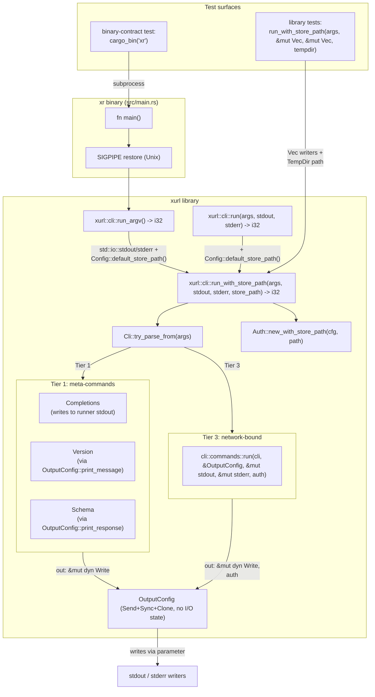

# feat: Lift CLI module to library, inject writers, inject store paths

## Summary

Lift the `cli` module from binary-private to a public library export and add a `xurl::cli::run(args, stdout, stderr) ->
i32` entrypoint so downstream CLI commands can be tested as library functions without forking `xr`. Reshape
`OutputConfig` so print methods accept `&mut dyn Write` at the call site — `OutputConfig` becomes a pure `Send + Sync +
Clone` configuration object owning no I/O handles. Thread an explicit `store_path` through `Auth::new_with_store_path`
so tests no longer need process-global env-var mutation. The binary `src/main.rs` shrinks to SIGPIPE restoration plus a
one-line call into the library. `tests/cli_tests.rs` moves to library-style calls using `tempfile::TempDir` + explicit
store paths, parallel-safe with no `#[serial]`. A small binary-contract subprocess test stays to catch drift between
`main()` and the library mapping.

---

## Problem Frame

Today, the `cli` module is binary-private (`mod cli;` declared in `src/main.rs`). The library at `src/lib.rs` re-exports
`api`, `auth`, `config`, `error`, `output`, `store` but not the CLI dispatcher. Tests in `tests/cli_tests.rs` shell out
via `Command::cargo_bin("xr")` to assert CLI behavior, which is slow, requires per-test `HOME` env mutation, and races
across test binaries when multiple files mutate env vars in parallel.

Three forces converge on this refactor:

1. **AGENTS.md states the intent**: `src/lib.rs` is the public library surface; `xr` is one consumer among potentially
   several. The current shape contradicts that intent for the CLI surface specifically.
2. **`bird` is a known downstream consumer** (per
   `docs/solutions/architecture-patterns/xurl-subprocess-transport-layer.md`) currently using `Command::new("xurl")` — a
   library entrypoint gives it an in-process alternative.
3. **Upcoming parity work** (per-app `redirect_uri`, auth reliability fixes) adds new CLI subcommands that benefit from
   library-level testing from day one. Doing this refactor first means new tests land in the new style.

A fourth force surfaced during planning: xurl-rs has a documented future async/concurrent `ApiClient` requirement.
Designs introduced now must be `Send + Sync`, must not store I/O handles inside configuration types, and must not use
`std::sync::Mutex` patterns that block under `.await`. This pushes `OutputConfig` toward call-site writer injection (not
stored writers) and `Auth`/`ApiClient` toward explicit-path injection (not implicit env-var resolution). The April 2026
library-ergonomics refactor (`docs/plans/2026-04-03-001-feat-library-ergonomics-plan.md`) established the
canonical-library + thin-binary pattern for SDK types and utility functions; this plan extends the same pattern to the
CLI dispatcher and to the I/O boundary inside `OutputConfig`.

---

## Requirements

### Library API surface

- R1. The `cli` module is publicly exported from `src/lib.rs` (`pub mod cli;`).
- R2. The library exposes `xurl::cli::run<I, S>(args: I, stdout: &mut dyn Write, stderr: &mut dyn Write) -> i32` where
  `I: IntoIterator<Item = S>, S: Into<OsString> + Clone`.
- R3. The library exposes `xurl::cli::run_argv() -> i32` that reads `std::env::args_os()` and uses `std::io::stdout()` +
  `std::io::stderr()` as the writers.
- R4. `Cli::try_parse_from(args)` is used in the library entrypoint. `Cli::parse()` and `clap::Error::exit()` are never
  called from library code.

### Binary as thin wrapper

- R5. `src/main.rs` reduces to SIGPIPE restoration plus `std::process::exit(xurl::cli::run_argv())`.
- R6. Existing exit-code contract is preserved: `EXIT_SUCCESS=0`, `EXIT_GENERAL_ERROR=1`, `EXIT_AUTH_REQUIRED=2`,
  `EXIT_RATE_LIMITED=3`, `EXIT_NOT_FOUND=4`, `EXIT_NETWORK_ERROR=5`. Clap `--help`/`--version` exit 0; clap usage errors
  exit 2.
- R7. Tier-1 commands (`Completions`, `Version`, `Schema`) execute through the library entrypoint, not from `main.rs`.

### Call-site writer injection on `OutputConfig`

- R8. `OutputConfig` remains a `Send + Sync + Clone` configuration struct (format, quiet, no_color) and owns no I/O
  handles.
- R9. Each `OutputConfig` print method (`info`, `status`, `print_response`, `print_stream_line`, `print_error`,
  `print_message`) accepts an `out: &mut dyn Write` (or two — stdout and stderr — for methods that split). Tests pass
  `Vec<u8>`; the binary passes `std::io::stdout().lock()` / `stderr().lock()`.
- R10. `Commands::Version` (currently `println!` in `src/main.rs:32`) routes through `OutputConfig::print_message` with
  the runner's stdout writer.
- R11. `cli/commands/schema.rs` direct `println!` sites route through `OutputConfig::print_response` for JSON schema
  bodies (preserving the `--output json` contract — fix for finding F8) and through `OutputConfig::print_message` for
  the human-readable command list.
- R12. `api/response/format.rs` print functions accept `out: &mut dyn Write` parameter; ~14 `print!`/`println!` macro
  sites across `format_and_print_response`, `colorize_and_print_json`, `print_colorized_value_ln`,
  `print_colorized_value` convert to `write!`/`writeln!` and propagate `io::Result<()>`. `OutputConfig::print_response`
  becomes the I/O error boundary.
- R13. `cli/commands/auth.rs:42` (OAuth2 step-1 JSON envelope) routes through `OutputConfig::print_message`.
- R14. `src/auth/oauth2.rs:180-181` browser-failure prints (`println!` to stdout) route through
  `OutputConfig::print_message` so library tests capture them rather than seeing real-process stdout pollution.
- R15. `clap_complete::generate` (Tier-1 `Completions`) receives the runner's stdout writer directly so completion
  script output is capturable in library tests.

### Explicit store-path injection (replaces env-var test isolation)

- R16. `Auth::new_with_store_path(cfg: &Config, store_path: &Path)` exists as a public constructor; existing
  `Auth::new(cfg)` becomes a shim resolving to `default_store_path()` (currently `~/.xurl`).
- R17. `TokenStore::new_with_path(path)` (already exists in the codebase) is the canonical constructor used by
  `Auth::new_with_store_path`.
- R18. `Config::default_store_path()` exists as a public helper exposing the legacy `~/.xurl` resolution.
- R19. The library's `run` entrypoint constructs `Auth` via `Auth::new_with_store_path` reading from
  `Config::default_store_path()`. The binary path is unchanged behaviorally; tests pass an explicit
  `TempDir.path().join(".xurl")`.

### Test migration

- R20. `tests/cli_tests.rs` (18 tests) is rewritten to use `xurl::cli::run(args, &mut stdout, &mut stderr)` instead of
  `Command::cargo_bin("xr")`.
- R21. Token-store isolation in tests uses `tempfile::TempDir` plus the new `Auth::new_with_store_path` constructor
  reached through a test-mode `run_with_store_path` shim or via test-only constructors. **No `HOME`/`XDG_CONFIG_HOME`
  env mutation, no `#[serial_test::serial]` annotations, parallel-safe by default.**
- R22. A new subprocess test file pins the binary's exit-code contract so `main()` cannot silently drift from the
  library mapping.

---

## Key Technical Decisions

- **KTD1. Entrypoint signature uses `impl IntoIterator<Item = impl Into<OsString> + Clone>`**, matching clap's
  `try_parse_from` shape. Works with `vec!["xr", "--help"]` (tests) and `std::env::args_os()` (binary). `&mut dyn Write`
  for writers avoids generic spread across the codebase.

- **KTD2. `OutputConfig` injects writers at the print-call site; no stored writer fields.** `OutputConfig` keeps its
  existing `#[derive(Clone, Debug)]` and adds no fields beyond `format`, `quiet`, `no_color`. Print methods take `&mut
  dyn Write` (or two, for methods that split stdout/stderr). This makes `OutputConfig` trivially `Send + Sync + Clone`
  and aligns with the multi-thread/async-first-party principle (KTD8). Rejected alternatives: (a) `Mutex<Box<dyn Write +
  Send>>` — the mutex isn't doing concurrency work and is wrong-primitive; (b) `RefCell<Box<dyn Write>>` — `!Sync`,
  blocks future async; (c) generic `OutputConfig<W1, W2>` — forces type-parameter spread.

- **KTD3. Clap error handling in library context.** Use `Cli::try_parse_from(args)`. On `Err(e)`, inspect `e.kind()`:
  `DisplayHelp` and `DisplayVersion` write `e.to_string()` to the runner's **stdout** writer and return `0`; all other
  kinds write to the **stderr** writer and return `2`. Never call `e.exit()` (it `process::exit`s — fatal in library
  tests). Clap-error output is plain-text regardless of `XURL_OUTPUT=json` because `OutputConfig` isn't constructed yet
  at parse-failure time — this is acknowledged as a known carve-out (finding F6); consumers relying on `--output json`
  must inspect exit code rather than parse stderr. Source:
  `docs/solutions/best-practices/rust-clap-try-parse-for-custom-error-handling-2026-04-20.md`.

- **KTD4. Test isolation via explicit `store_path` injection through `Auth::new_with_store_path`, not via env-var
  mutation.** Library tests construct a `TempDir`, build an `Auth` with the tempdir's `.xurl` path, and feed it to
  `xurl::cli::run_with_store_path` (a test-mode entrypoint). No env mutation, no `#[serial]`, parallel-safe. Reasoning:
  `#[serial_test::serial]` only serializes within one test binary; `cli_tests.rs`, `config_tests.rs`, `api_tests.rs`
  each run as separate processes via cargo and env mutations race across them. macOS `dirs` ignores `XDG_CONFIG_HOME`
  entirely. Edition 2024 makes `set_var` an `unsafe fn`. The cleaner fix is to remove the env dependency from library
  types entirely. This is a public-API surface expansion (R16–R19) accepted as part of the refactor's scope.

- **KTD5. SIGPIPE restoration stays in `src/main.rs`** before the call into `xurl::cli::run_argv()`. Library consumers
  (e.g., `bird`) handle their own signal masks. Library code never installs signal handlers.

- **KTD6. Scope of direct-`println!` cleanup.** Convert in this PR: `main.rs:32` Version (R10), `cli/commands/schema.rs`
  schema output (R11), `api/response/format.rs` ~14 macro sites (R12), `cli/commands/auth.rs:42` OAuth2 step-1 envelope
  (R13), `src/auth/oauth2.rs:180-181` OAuth2 browser-failure prints (R14, finding A5 — these go to stdout and would
  pollute library-test capture buffers if left), `clap_complete::generate` Tier-1 completions (R15, finding F4). Defer:
  verbose-trace prints in `src/api/request.rs` and `src/cli/commands/streaming.rs` (debug-mode paths exercised by
  `-v`/`--trace`, not main user output), `.twurlrc` migration error in `src/store/mod.rs:98` (rarely hit migration
  path), `oauth2.rs:210+` post-callback messaging if confirmed not user-output-facing during research (re-scope if found
  in scope during implementation).

- **KTD7. Tier-1 `Schema` keeps its hardcoded `EXIT_GENERAL_ERROR`** on error rather than routing through
  `exit_code_for_error(&e)`. Pre-existing behavior, out of scope. Documented for future cleanup.

- **KTD8. Multi-thread and async readiness are first-party design principles** for any new or modified public type
  introduced by this plan. Concretely: `OutputConfig` is `Send + Sync + Clone` (KTD2); `Auth`, `ApiClient`, `Config`
  accept explicit paths instead of reading env implicitly (KTD4); no `std::sync::Mutex` is held across `.await` in new
  code; `tokio::sync::Mutex` is used when an async-compatible lock is needed; `Arc<T>` (not `Rc<T>`) for shared
  ownership across tasks. See [[feedback_async_multithread_first_party]] and
  [[feedback_test_isolation_via_explicit_paths]] in user memory.

- **KTD9. Exit-code `2` is overloaded** between clap usage errors and `EXIT_AUTH_REQUIRED`. Pre-existing in the binary
  today (main.rs raw mode + clap both exit 2 on different failure modes). Acknowledged as a known limitation (finding
  F5); the binary-contract test (U6) asserts the exit code without distinguishing source. Distinguishing the two
  requires inspecting stderr content or growing the exit-code enum — out of scope here.

---

## Scope Boundaries

### In scope

- Public library surface for the CLI dispatcher (R1–R4).
- Binary-as-thin-wrapper (R5–R7).
- Call-site writer injection on `OutputConfig` and the six direct-print sites that route through it (R8–R15).
- Explicit `store_path` injection through `Auth`/`Config` (R16–R19).
- Migration of `tests/cli_tests.rs` to library style with tempdir-based isolation (R20–R21).
- Binary-contract subprocess test (R22).

### Deferred to follow-up work

- Verbose-trace direct `println!`/`eprintln!` in `src/api/request.rs` and `src/cli/commands/streaming.rs` — debug-mode
  tracing exercised only by `-v`/`--trace`, not main user output. Migration deferred to keep this PR focused.
- `.twurlrc` import error in `src/store/mod.rs:98` — rarely-hit migration path; convert when next touching the store.
- Migration of `tests/agentic_tests.rs` and `tests/wiring_tests.rs` to library style. Rationale: these test flag-wiring
  through `OutputConfig` and are good library-test candidates, but migrating them inflates this PR. Deferral is
  **PR-size-driven, not process-semantics-driven** (correction of finding SG2/A10). Follow-up PR target: same shape as
  U5 here, applied to those files.
- `tests/completion_tests.rs` and `tests/schema_tests.rs` — genuinely subprocess-shaped (byte-count assertions,
  process-boundary semantics). Stay subprocess-shaped.
- Routing Tier-1 `Schema` errors through `exit_code_for_error(&e)` (KTD7).
- `cargo public-api` snapshot or other API-stability check — no precedent in repo; capture via `/ce-compound` after this
  PR lands if useful.
- Distinguishing clap usage-error exit 2 from `EXIT_AUTH_REQUIRED=2` (KTD9).

### Outside this PR's identity

- Feature work from Groups A–H of the parity initiative (per-app `redirect_uri`, OAuth2 listener hardening, refresh
  resilience, `--username` fallback, `webhook start`, allow/deny list, docs/version bump). Those land in subsequent PRs
  on top of the shape this PR establishes.

---

## High-Level Technical Design

The refactor moves three boundaries inward:

1. **CLI dispatch boundary**: from `src/main.rs` (today) to `xurl::cli::run` (after).
2. **I/O boundary**: from `println!`/`eprintln!` macro sites scattered across modules (today) to `&mut dyn Write`
   parameters threaded from the runner (after).
3. **Token-store path boundary**: from implicit `dirs::home_dir().join(".xurl")` in `Auth::new` (today) to an explicit
   `Auth::new_with_store_path(cfg, path)` constructor (after); `Auth::new` becomes a shim.

The three entrypoints (`run_argv`, `run`, `run_with_store_path`) form a layered API: `run_with_store_path` is the
canonical implementation; `run` wraps it with the default store path; `run_argv` wraps `run` with both
`std::env::args_os()` and stdio writers. Tests use the deepest layer for control; the binary uses the shallowest.

---

## Implementation Units

### U1. Reshape `OutputConfig` for call-site writer injection

- **Goal**: `OutputConfig` becomes a pure `Send + Sync + Clone` config object; print methods take `&mut dyn Write` (and
  a second writer where they split stdout/stderr).
- **Requirements**: R8, R9.
- **Dependencies**: none.
- **Files**:
- `src/output.rs` (modify): keep `#[derive(Clone, Debug)]` on `OutputConfig`. Drop nothing. Update each print method
  signature to add `out: &mut dyn Write` parameter; `print_error` adds `err: &mut dyn Write`. Implementations replace
  `println!`/`eprintln!` with `writeln!(out, ...)` / `writeln!(err, ...)`. Methods that previously returned `()` may now
  return `io::Result<()>` if propagation makes sense; otherwise wrap in `let _ = writeln!(...)` per the existing
  best-effort posture.
- `tests/output_writer_tests.rs` (new): unit tests for capture into `Vec<u8>`.
- **Approach**: `OutputConfig` stays the existing 3-field struct (`format: OutputFormat`, `quiet: bool`, `no_color:
  bool`). Print methods are pure functions over `(&self, &mut dyn Write, ...)`. No internal state, no Mutex, no RefCell,
  no `Box<dyn Write>` fields. Verification step before editing: run `rg
  'OutputConfig.*clone\(\)|derive\(.*Clone\).*\n.*OutputConfig' src/ tests/` to confirm no current consumer relies on
  cloning OutputConfig in a way the change breaks (Clone is retained, but the verification documents the assumption per
  finding A4). Note that `OutputFormat` retains its own `Clone` derive (used by clap's `value_enum` machinery and the
  existing `cli.output.clone()` at `main.rs:36`) — finding SG4.
- **Patterns to follow**: existing `OutputConfig::print_response` Text/JSON branching pattern — preserved; the
  format-selection logic stays, only the sink changes.
- **Test scenarios**:
- Happy path: `OutputConfig::new(Json, false).print_message(&mut buf, "hi")` writes `"hi\n"` to buf.
- Quiet mode: `info(&mut buf, ...)` and `status(&mut buf, ...)` write nothing when `quiet=true`.
- Format-aware: `print_response(&mut buf, &Value)` produces JSON when `format=Json`, formatted text when `format=Text`.
- No-color in JSON mode: ANSI codes absent from captured output regardless of `NO_COLOR` env (JSON path skips
  colorization).
- Stream lines: `print_stream_line(&mut buf, "event")` writes to the writer with a trailing newline.
- Error capture: `print_error(&mut err_buf, &XurlError::auth("..."), EXIT_AUTH_REQUIRED)` writes to err_buf; no stdout
  side effect.
- Send + Sync: `fn assert_send_sync<T: Send + Sync>() {} assert_send_sync::<OutputConfig>();` compiles.
- **Verification**: existing tests pass (`cargo test`); new `output_writer_tests.rs` covers all six print methods;
  `cargo clippy -D warnings` clean.

### U2. Route format-aware direct prints through writer parameters

- **Goal**: Re-route the six testability-blocking direct-print sites through writer-parameter signatures.
- **Requirements**: R10, R11, R12, R13, R14, R15.
- **Dependencies**: U1.
- **Files**:
- `src/api/response/format.rs` (modify): ~14 `print!`/`println!` macro sites across `format_and_print_response`,
  `colorize_and_print_json`, `print_colorized_value_ln`, `print_colorized_value` convert to `write!`/`writeln!` with
  `out: &mut dyn Write` parameter. Three private helper signatures change; functions return `io::Result<()>`.
  `OutputConfig::print_response` becomes the I/O error boundary.
- `src/cli/commands/schema.rs` (modify): `run_schema(command, list, all, out: &OutputConfig, stdout: &mut dyn Write)`
  signature change. JSON schema body at lines 133 and 172 routes through `OutputConfig::print_response` (fix for F8 —
  `print_message` would wrap JSON-as-string in `{"message": "..."}` under `--output json`). The human-readable list at
  line 158 routes through `OutputConfig::print_message`.
- `src/cli/commands/auth.rs:42` (modify): OAuth2 step-1 JSON envelope routes through `OutputConfig::print_message` with
  the runner's stdout writer.
- `src/cli/commands/mod.rs` (modify): `OutputConfig::print_response` callers thread `&mut dyn Write` through.
- `src/auth/oauth2.rs:180-181` (modify): browser-failure messages (currently `println!` to stdout) route through
  `OutputConfig::print_message`. Requires plumbing `&OutputConfig` + `&mut dyn Write` into the OAuth2 flow function —
  likely through a method on `Auth` that accepts these.
- **Approach**: Thread `&OutputConfig` + writers from the runner. For format.rs leaf helpers, take `out: &mut dyn Write`
  and return `io::Result<()>`. Caller in `OutputConfig::print_response` handles or surfaces the error (existing
  best-effort posture acceptable for an output path; map `BrokenPipe` to silent exit per SIGPIPE convention).
- **Patterns to follow**: existing `OutputConfig::print_response` Text/JSON branching; leaf formatters preserve their
  format logic, only the sink changes.
- **Test scenarios**:
- Format helper capture: `format::render_response(&mut buf, &value)` produces expected string into `buf` for both Text
  and JSON paths.
- Schema single (F8 verification): `run_schema(Some("post"), false, false, &OutputConfig::new(Json, false), &mut buf)`
  writes a JSON schema with `"title"` / typed shape directly — NOT wrapped in `{"message": "..."}`.
- Schema list: `run_schema(None, true, false, &cfg, &mut buf)` writes a list of command names through `print_message`.
- OAuth2 envelope capture: invoking the auth flow's step-1 path writes the JSON envelope through the runner's stdout
  writer.
- OAuth2 browser-failure capture (A5 verification): mocking `open::that(...)` to fail and invoking the OAuth2 flow
  writes the failure message to the captured stdout writer, not the real process stdout.
- **Verification**: existing format/schema/auth tests pass; new capture tests pass; `rg 'println!|eprintln!'
  src/api/response/format.rs src/cli/commands/schema.rs src/cli/commands/auth.rs src/auth/oauth2.rs` returns only
  deliberately-deferred sites (per KTD6).

### U3. Explicit store-path injection through `Auth`

- **Goal**: `Auth::new_with_store_path(cfg, path)` exists as the canonical constructor; tests pass a tempdir path; the
  binary unchanged behaviorally.
- **Requirements**: R16, R17, R18, R19.
- **Dependencies**: U1 (orthogonal but compiled together for review coherence).
- **Files**:
- `src/config/mod.rs` (modify): add `pub fn default_store_path() -> PathBuf` returning the existing
  `dirs::home_dir().unwrap().join(".xurl")` resolution. Optional: add `Config::store_path: Option<PathBuf>` field for
  future extensions; currently unused — defer unless needed.
- `src/auth/mod.rs` (modify): add `pub fn new_with_store_path(cfg: &Config, store_path: &Path) -> Self`. The existing
  `pub fn new(cfg)` becomes a shim calling `new_with_store_path(cfg, &Config::default_store_path())`. Internally,
  `new_with_store_path` calls `TokenStore::new_with_credentials_and_path(client_id, client_secret, store_path)` (already
  exists).
- `src/store/mod.rs` (no change expected — `new_with_path` and `new_with_credentials_and_path` already exist per repo
  research).
- **Approach**: Preserve the existing `Auth::new(&cfg)` public API as a behavioral shim; new tests use
  `new_with_store_path` explicitly. The binary's runner uses `Auth::new(&cfg)` (which still resolves to `~/.xurl`),
  preserving behavior. Tests opt into explicit-path mode via a test-only runner entrypoint (see U4).
- **Patterns to follow**: existing `TokenStore::new_with_path` pattern (already in store/mod.rs); existing
  `Auth::with_app_name` builder pattern.
- **Test scenarios**:
- Backwards-compat: `Auth::new(&cfg)` produces the same `Auth` as today; existing `auth_tests.rs` cases pass unchanged.
- Explicit path: `Auth::new_with_store_path(&cfg, &tmp.path().join(".xurl"))` reads/writes to the tempdir; the real
  `~/.xurl` is untouched (verify via filesystem check post-test).
- Send + Sync: `Auth` is `Send + Sync` (assert via compile-time check) — required for future async.
- **Verification**: existing `tests/auth_tests.rs` and `tests/store_tests.rs` pass with no edits; new tempdir-based
  tests in U4 exercise the new constructor; no existing test references `dirs::home_dir()` directly.

### U4. Library CLI entrypoint and module lift

- **Goal**: Add `xurl::cli::run_with_store_path`, `xurl::cli::run`, and `xurl::cli::run_argv` library entrypoints; thin
  the binary.
- **Requirements**: R1, R2, R3, R4, R5, R6, R7.
- **Dependencies**: U1, U2, U3.
- **Files**:
- `src/lib.rs` (modify): add `pub mod cli;`.
- `src/main.rs` (rewrite): SIGPIPE restoration + `std::process::exit(xurl::cli::run_argv())`. Drop the duplicated `mod`
  declarations.
- `src/cli/mod.rs` (modify): add `pub mod runner;`.
- `src/cli/runner.rs` (new): contains three public functions:
- `pub fn run_argv() -> i32` — reads `std::env::args_os()`, locks `std::io::stdout()` + `stderr()`, calls `run(args,
  &mut stdout, &mut stderr)`.
- `pub fn run<I, S>(args: I, stdout: &mut dyn Write, stderr: &mut dyn Write) -> i32` where `I: IntoIterator<Item = S>,
  S: Into<OsString> + Clone` — resolves `Config::default_store_path()` and calls `run_with_store_path(args, stdout,
  stderr, &default_path)`.
- `pub fn run_with_store_path<I, S>(args: I, stdout: &mut dyn Write, stderr: &mut dyn Write, store_path: &Path) -> i32`
  — the canonical implementation: `try_parse_from`, clap error mapping (KTD3, KTD9), Tier 1 dispatch (Completions writes
  to stdout via R15; Version via R10; Schema via R11 with the writer threaded through `run_schema`), Tier 3 dispatch
  through `cli::commands::run` with the threaded writers and an `Auth::new_with_store_path(cfg, store_path)` instance.
- `tests/cli_run_tests.rs` (new): exercises `run_with_store_path` with various args; asserts exit code + captured
  output.
- **Approach**: Move the Tier 1 / Tier 3 logic from `main.rs:23-58` into `runner.rs`. Replace the existing
  `cli::commands::run(cli, &OutputConfig)` signature with `cli::commands::run(cli, &OutputConfig, &mut dyn Write, &mut
  dyn Write, Auth)` — threads writers + auth through. Clap error mapping: `match e.kind() { DisplayHelp | DisplayVersion
  => write to stdout, return 0; _ => write to stderr, return 2 }`. Plain-text on parse error regardless of `XURL_OUTPUT`
  (KTD3 / F6).
- **Patterns to follow**: solutions doc `rust-clap-try-parse-for-custom-error-handling-2026-04-20.md`; existing Tier 1 /
  Tier 3 logic preserved structurally.
- **Test scenarios**:
- Help: `run_with_store_path(["xr", "--help"], &mut sout, &mut serr, tmp_path)` returns 0; stdout contains "Auth enabled
  curl-like interface"; stderr empty.
- Version: `run_with_store_path(["xr", "version"], ...)` returns 0; stdout starts with `xr`.
- Bad flag: `run_with_store_path(["xr", "--bogus"], ...)` returns 2; stderr contains error; stdout empty.
- Missing-URL raw: `run_with_store_path(["xr"], ...)` returns 1; stderr contains "No URL provided".
- Completions (F4 verification): `run_with_store_path(["xr", "completions", "bash"], ...)` returns 0; stdout (the
  runner's, not the real process's) contains a bash completion script.
- Schema single (F8 verification): `run_with_store_path(["xr", "schema", "post"], ...)` returns 0; stdout is a JSON
  object with the schema, **not** wrapped in `{"message": ...}` when `--output json` is also passed.
- Schema list: `run_with_store_path(["xr", "schema", "--list"], ...)` returns 0; stdout mentions `post`, `whoami`,
  `like`.
- Library API smoke: `assert_send_sync::<&dyn Fn(...) -> i32>(...)` on the function pointer compiles (or equivalent type
  assertion verifying the entrypoint signature).
- **Verification**: `cargo build` produces the binary; `xr --help` exits 0; `xr version` prints version; new library
  tests pass; existing un-migrated `cli_tests.rs` subprocess tests still pass against the new binary.

### U5. Migrate `tests/cli_tests.rs` to library style

- **Goal**: Rewrite the 18 subprocess tests as library calls; preserve coverage 1:1; **parallel-safe, no `#[serial]`, no
  env mutation**.
- **Requirements**: R20, R21.
- **Dependencies**: U3, U4.
- **Files**:
- `Cargo.toml`: no change. (`serial_test` already at line 86 from `config_tests.rs`; `assert_cmd` already present.)
- `tests/cli_tests.rs` (rewrite): all `Command::cargo_bin("xr")` invocations become
  `xurl::cli::run_with_store_path(args, &mut stdout, &mut stderr, tmp.path().join(".xurl"))`. No `#[serial]`, no
  `std::env::set_var`, no `HOME`/`XDG_CONFIG_HOME` plumbing.
- `tests/cli_tests.rs` (inline helper or shared `tests/common/mod.rs` if introduced): `fn run_isolated(args: &[&str]) ->
  (i32, String, String)` that creates a `TempDir`, calls `run_with_store_path`, returns `(exit_code, stdout_string,
  stderr_string)`.
- **Approach**: Each test gets its own `TempDir`. The cleanup is automatic (`TempDir` drop). Tests run in parallel by
  default — cargo's `--test-threads` need not be 1. Replace `.assert().success()` with `assert_eq!(exit_code, 0)`,
  `.stdout(predicate::str::contains(...))` with `assert!(stdout_str.contains(...))`.
- **Patterns to follow**: existing library-style tests in `tests/api_tests.rs`, `tests/store_tests.rs`.
- **Test scenarios** (1:1 with pre-migration `cli_tests.rs`, 18 tests):
- `--help` exits 0; stdout contains usage banner.
- `--version` / `version` exit 0; stdout starts with `xr`.
- `--bogus` exits 2; stderr contains "unexpected argument".
- Subcommand help: `post --help`, `search --help`, `auth --help`, `auth apps --help` all exit 0 with relevant content.
- Missing-argument failures: `post`, `search`, `delete`, `reply` (no positional) each exit 2 with "required" in stderr.
- Missing-auth: `usage`, `whoami` (against an empty tempdir store) each exit `EXIT_AUTH_REQUIRED=2`.
- Global flag acceptance: `-v` and `-t` on a known endpoint don't trigger argparse failure.
- Exit code on `--help` is 0; exit code on bad flag is 2.
- **Verification**: `cargo test --test cli_tests -- --test-threads=4` passes (proves parallel safety); manual diff of
  test names confirms 1:1 coverage; `rg '#\[serial\]|env::set_var' tests/cli_tests.rs` returns no matches.

### U6. Binary-contract test

- **Goal**: One subprocess test file pinning the binary's exit-code contract so `main()` cannot drift from the library
  mapping.
- **Requirements**: R22.
- **Dependencies**: U4.
- **Files**:
- `tests/binary_contract_tests.rs` (new): 4–6 subprocess tests covering exit codes and stdout/stderr stream split.
- **Approach**: Use `assert_cmd::Command::cargo_bin("xr")`. Tests exist to catch drift, not duplicate coverage. Per
  finding A7, also cover the stdout-vs-stderr split for `--help` and `--version` so a future regression mis-routing clap
  output gets caught.
- **Patterns to follow**: pre-migration `tests/cli_tests.rs` subprocess invocation idiom.
- **Test scenarios**:
- `cargo_bin("xr").arg("--help").assert().success().code(0)` — stdout non-empty, stderr empty.
- `cargo_bin("xr").arg("--version").assert().success().code(0)` — stdout non-empty (covers clap `DisplayVersion` path,
  not the `version` subcommand).
- `cargo_bin("xr").arg("version").assert().success().code(0)` — stdout non-empty (covers Tier-1 subcommand path).
- `cargo_bin("xr").arg("--bogus").assert().failure().code(2)` — stderr non-empty.
- `cargo_bin("xr").assert().failure().code(1)` — no URL in raw mode.
- SIGPIPE smoke (Unix only, `#[cfg(unix)]`): `xr --help | head -1` exits 0 (no `BrokenPipe` panic from SIGPIPE).
- **Verification**: `cargo test --test binary_contract_tests` passes; intentionally breaking `main.rs` (e.g., wrong exit
  code or `--help` to stderr) causes failure in a fresh local run.

---

## System-Wide Impact

- **Public library API grows**: `pub mod cli` plus three runner entrypoints (`run_argv`, `run`, `run_with_store_path`),
  plus `Auth::new_with_store_path` and `Config::default_store_path`. Aligns with `AGENTS.md`'s library-first intent.
  Downstream `bird` may adopt the runner entrypoints as an in-process alternative.
- **`OutputConfig` shape preserved** (Clone, Debug retained; no fields added). Method signatures gain `&mut dyn Write`
  parameter — internal-only signature change since `OutputConfig` is consumed only inside `xurl`. `Send + Sync + Clone`
  is the design invariant going forward (KTD2, KTD8).
- **`OutputFormat::Clone` retained** for clap's `value_enum` machinery and existing `cli.output.clone()` usage (finding
  SG4).
- **`api::response::format` print functions get a `&mut dyn Write` parameter** and return `io::Result<()>`: internal API
  change. Module is `pub(crate)`-shaped; no semver implication.
- **`cli::commands::schema::run_schema` signature** grows `&OutputConfig` + `&mut dyn Write` parameters.
- **`cli::commands::run` signature** grows `&mut dyn Write` (stdout), `&mut dyn Write` (stderr), and an `Auth` parameter
  (already had `Auth` through closure capture — now explicit).
- **`Auth::new` becomes a shim** over `Auth::new_with_store_path`. Existing call sites unchanged behaviorally.
- **`Cargo.toml` dev-dependencies**: no change. `serial_test = "3"` already present (no longer required by
  `cli_tests.rs` migration but kept in use by `tests/config_tests.rs`); `assert_cmd` already present.
- **No CI change**: existing `ci.yml` runs `fmt`, `clippy -D warnings`, `test`, `cargo deny`, package check — none gate
  on public-API stability snapshots. Tests now safe to run with `--test-threads > 1` for `cli_tests.rs`.

---

## Risks & Dependencies

- **Risk: writer-parameter spread.** Adding `&mut dyn Write` to print methods touches every callsite in `src/api/`,
  `src/cli/commands/`. Mitigation: do U1 + U2 together so the compiler enforces the parameter at every site; the type
  system catches missed sites.
- **Risk: `Auth::new_with_store_path` test/binary divergence.** If the binary calls `Auth::new` (shim) and tests call
  `Auth::new_with_store_path` (canonical), the shim could drift from the real implementation. Mitigation: shim is one
  line — `Auth::new_with_store_path(cfg, &Config::default_store_path())`; no divergence possible without code change.
  Verified by binary-contract test U6 + the `Auth::new(&cfg)` paths in existing `auth_tests.rs`.
- **Risk: clap error-kind handling drift.** New clap versions may add error kinds; the entrypoint must default to "print
  to stderr, return 2" for any kind not explicitly mapped to stdout. Mitigation: explicit `match` with a `_ =>` arm;
  documented in `runner.rs`.
- **Risk: format.rs error-propagation surface.** Converting ~14 `print!` macros to `write!` adds `io::Result<()>`
  propagation through 3 private helpers. The `OutputConfig::print_response` boundary must handle `BrokenPipe` silently
  (SIGPIPE convention) and other I/O errors per the existing best-effort posture. Mitigation: explicit `BrokenPipe` arm;
  the rest log-and-continue.
- **Risk: SG2/A10 follow-up.** Deferring `wiring_tests.rs` and `agentic_tests.rs` migration means they continue to
  exercise the binary path. They're not redundant with U6 (they test flag wiring, U6 tests exit codes), but the project
  carries two test-style conventions until the follow-up PR lands. Mitigation: file the follow-up PR explicitly in the
  deferred-work list (Scope Boundaries).
- **No new dependencies.** `serial_test`, `assert_cmd`, `tempfile` are all already present.

---

## Sources & Research

- `docs/solutions/best-practices/rust-library-cli-separation-for-interactive-concerns-2026-04-20.md` — library must
  accept I/O surfaces as parameters; no `rpassword`/`stdin`/`is_terminal()` from library code.
- `docs/solutions/best-practices/rust-clap-try-parse-for-custom-error-handling-2026-04-20.md` — `try_parse_from` +
  manual error-kind dispatch (KTD3).
- `docs/solutions/best-practices/test-exit-code-paths-even-if-trivial-2026-04-20.md` — keep at least one subprocess test
  pinning the binary contract (R22, U6).
- `docs/solutions/best-practices/separate-io-from-parsing-at-write-time-for-testability-2026-04-20.md` — pure-formatter
  split at I/O boundaries (U1, U2).
- `docs/solutions/architecture-patterns/live-integration-testing-cli-external-api.md` — `bird` TestEnv pattern;
  consulted but superseded for this PR by KTD4 (explicit store-path injection instead of env mutation).
- `docs/solutions/architecture-patterns/xurl-subprocess-transport-layer.md` — `bird` is a known downstream consumer;
  library entrypoint is the in-process alternative.
- `docs/plans/2026-04-03-001-feat-library-ergonomics-plan.md` — prior library-ergonomics refactor; established
  canonical-library + thin-binary pattern this plan extends.
- `AGENTS.md` — states `src/lib.rs` as the public library surface and `xr` as one consumer; refactor aligns with stated
  intent.
- User memory: `[[feedback_async_multithread_first_party]]` (KTD8), `[[feedback_test_isolation_via_explicit_paths]]`
  (KTD4), `[[project_async_requirement]]` (forward concern).
- Repo research: `src/cli/mod.rs`, `src/cli/commands/{mod,auth,media,streaming,schema}.rs`, `src/output.rs`,
  `src/main.rs`, `src/lib.rs`, `src/auth/mod.rs`, `src/config/mod.rs`, `src/store/mod.rs`, `tests/cli_tests.rs`,
  `tests/config_tests.rs` — surface inventory.
