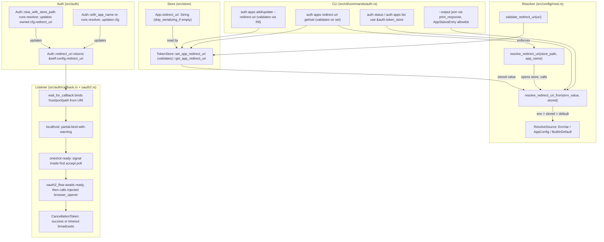

# feat: per-app redirect_uri + OAuth2 callback listener hardening

## Summary

Add a stored per-app OAuth2 `redirect_uri` to `~/.xurl` so multi-app users no longer need `REDIRECT_URI` env juggling.
Resolve the effective URI through `env > app stored > built-in default` and surface the source in `auth status` and
`auth apps list` output (both text and `--output json`). Validate URIs at write and resolve time per the project's
URL-validation learning. Harden the OAuth2 callback listener: bind host, port, and path from the effective redirect URI;
dual-bind `127.0.0.1` and `[::1]` when the host is `localhost` with partial-bind-with-warning when one address is
unavailable (graceful degradation for IPv6-disabled environments); start the listener before opening the browser via a
tokio `oneshot` ready signal; coordinate shutdown via a `CancellationToken`; inject the browser-opener so the
listener-before-browser ordering is test-observable.

Branch: `feat/redirect-uri-and-listener`, cut from `feat/library-cli-entrypoint`.

---

## Problem Frame

`Config::new()` resolves the OAuth2 redirect URI from `REDIRECT_URI` env only, with a built-in
`http://localhost:8080/callback` default. Users with multiple registered apps have no per-app store; they must `export
REDIRECT_URI=...` before every command. The CLI surface to inspect or edit the redirect URI does not exist.

The OAuth2 callback listener at `src/auth/callback.rs::wait_for_callback` hardcodes the bind address
(`127.0.0.1:{port}`) and callback path (`/callback`). Two failure modes follow:

1. Browsers that resolve `localhost` to `[::1]` (IPv6 loopback — common on Linux + Firefox, and on some macOS
   configurations) reach a not-listening port and hang until the 5-minute timeout fires.
2. The local OAuth2 flow opens the browser at `src/auth/oauth2.rs:189` and binds the listener at
   `src/auth/oauth2.rs:203`. On fast machines the browser can hit the callback URL before tokio finishes binding the
   socket, producing flaky "callback never arrived" failures.

A latent bug surfaced during research: `AuthCommands::Status` at `src/cli/commands/auth.rs:137` and `AppCommands::List`
at `:327` both instantiate a fresh `TokenStore::new()`, bypassing the runner-constructed `Auth.token_store`.
Library-level tests for status and list cannot achieve isolation under the current shape; the fix lands as part of U5
since the JSON-mode tests need it.

---

## Requirements

### Per-app redirect_uri storage

- R1. `App.redirect_uri: String` field exists in `~/.xurl` YAML, serialized with `#[serde(default, skip_serializing_if =
  "String::is_empty")]`. Existing files load and round-trip without the field.
- R2. `TokenStore` exposes `set_app_redirect_uri(name, uri) -> Result<()>` and `get_app_redirect_uri(name) ->
  Option<&str>`. Calling `set_app_redirect_uri(name, "")` removes the stored value (sets the field to empty string; next
  serialize omits the field). `set_app_redirect_uri` validates the URI per R8 before persisting; an invalid URI returns
  an error and the store is not modified.
- R3. `App::new()` and `App::with_credentials()` initialize `redirect_uri` to empty. The legacy JSON migration literal
  in `src/store/migration.rs` builds the new field as empty.

### Resolver

- R4. `Config` exposes a layered resolver. `pub(crate) fn resolve_redirect_uri_from(env_value: Option<String>, stored:
  Option<&str>) -> ResolvedRedirectUri` is the pure precedence helper; `pub fn resolve_redirect_uri(store_path: &Path,
  app_name: &str) -> ResolvedRedirectUri` is the thin wrapper that opens the store. Callers with an open `TokenStore` in
  hand (Auth, status renderer, `redirect-uri get` handler) call the pure helper using `store.get_app_redirect_uri(name)`
  to avoid a second disk read.
- R5. Precedence is `REDIRECT_URI env var > app stored value > built-in default ("http://localhost:8080/callback")`.
- R6. `pub(crate) enum ResolveSource { EnvVar, AppConfig, BuiltInDefault }` carries `as_text_label(&self) -> &'static
  str` (upstream-verbatim human labels: `"REDIRECT_URI environment variable"`, `"app config"`, `"built-in default"`) and
  `Serialize`-derives as kebab-case (`"env-var"`, `"app-config"`, `"built-in-default"`) via `#[serde(rename_all =
  "kebab-case")]`. Exhaustive-match tests in `tests/config_tests.rs` lock the mapping.
- R7. `pub const DEFAULT_REDIRECT_URI: &str = "http://localhost:8080/callback"` is the only publicly-exported resolver
  constant.
- R8. `Config::validate_redirect_uri(uri: &str) -> Result<Url, ValidationError>` enforces: parses cleanly as a URL;
  scheme is `https` OR scheme is `http` with host in `{localhost, 127.0.0.1, ::1, [::1]}`. Reference:
  `docs/solutions/best-practices/rust-url-validation-https-only-with-localhost-exception-2026-04-20.md`. Both
  `set_app_redirect_uri` (R2) and the env-var leg of the resolver (R4) call this validator. Invalid env-var values fall
  through to the next precedence level with a one-line warning to stderr (via the runner's stderr writer, not
  `eprintln!`).

### Auth integration: single source of truth on `Config`

- R9. `Auth` does **not** hold its own redirect_uri fields. `Auth::new_with_store_path(mut cfg, store_path)` runs the
  resolver and writes the resolved value plus source plus from_env back into the owned `Config` (which gains
  `redirect_uri_source: ResolveSource` and `redirect_uri_from_env: bool` fields, both `pub(crate)`).
- R10. `Auth::with_app_name(name)` re-runs the resolver against the new app name and updates the owned `Config`. The
  resolver itself enforces env-precedence; the `if self.client_id.is_empty()` pattern used for credentials does not
  apply here (KTD3).
- R11. `Auth::redirect_uri()` returns `&self.config.redirect_uri` (the resolved value).
- R12. Audit gate: before U3 lands, grep `cfg.redirect_uri | config.redirect_uri | \.redirect_uri` outside `src/auth/`
  and ensure every reader either (a) goes through `auth.redirect_uri()`, or (b) is in a path that runs **after**
  `Auth::new_with_store_path` has updated `cfg.redirect_uri` (and the reader uses the same `cfg`). The audit result is
  recorded as a checklist in U3's `Verification` field. If any reader gets a stale `Config`, that site is fixed in U3.
- R13. `Config::new()` keeps env-only resolution. Callers that need the resolved value go through
  `Auth::new_with_store_path` (which mutates the `Config` it owns) or call `Config::resolve_redirect_uri(store_path,
  app_name)` directly. R12's audit verifies no caller reads `cfg.redirect_uri` from a pre-resolution `Config`.

### CLI surface

- R14. `auth apps add NAME --client-id X --client-secret Y [--redirect-uri Z]` accepts an optional `--redirect-uri`
  flag. The handler calls `TokenStore::set_app_redirect_uri` (which validates per R8) immediately after `add_app`.
- R15. `auth apps update NAME [--client-id ...] [--client-secret ...] [--redirect-uri ...]`. The "nothing to update"
  check widens to include the new field. An empty-string `--redirect-uri ""` clears the stored value (R2).
- R16. New subcommand `auth apps redirect-uri get [NAME]` prints the effective URI, source, and stored URI for the named
  app (or the default app when NAME is omitted). Output is text or JSON per `--output`.
- R17. New subcommand `auth apps redirect-uri set NAME URI` writes the stored URI for the named app. Validates per R8.
- R18. The store-path access pattern for handlers: every handler that needs the resolver calls
  `Config::resolve_redirect_uri_from(env::var("REDIRECT_URI").ok(), auth.token_store.get_app_redirect_uri(name))`.
  `TokenStore.file_path` is already `pub` (`src/store/mod.rs:28`); no new `Auth::store_path()` getter is added.

### Display

- R19. `auth status` text mode shows `redirect_uri: <effective> [<source-text-label>]` per app. When the env var
  overrides a stored value, an additional `stored_redirect_uri: <stored>` line surfaces. Per upstream parity.
- R20. `auth apps list` text mode shows the same redirect URI + source hint inline per app row.
- R21. Under `--output json`, `auth status` and `auth apps list` emit structured JSON via
  `OutputConfig::print_response`. Per-app object fields (**explicit allowlist, secrets excluded**): `name`,
  `client_id_hint` (8-char truncated, NEVER the full `client_id`, NEVER `client_secret`), `redirect_uri`,
  `redirect_uri_source` (kebab-case enum), `redirect_uri_stored` (only present when env overrides), `oauth2_users` (list
  of usernames only — never tokens), `oauth1` (bool, presence only), `bearer` (bool, presence only), `default` (bool —
  top-level array marks the default-app entry).
- R22. `auth apps redirect-uri get` text output produces `app:`, `effective_redirect_uri:`, `effective_source:` (human
  label), `stored_redirect_uri:` lines per upstream parity. JSON output produces `{"app", "effective_redirect_uri",
  "effective_source" (kebab-case), "stored_redirect_uri" (null when unset)}`.
- R23. `AppStatusEntry` and `AppListEntry` are constructed field-by-field from named accessors (e.g., `AppStatusEntry {
  name: ..., client_id_hint: truncate(&app.client_id, 8), ... }`). Do **not** derive `From<&App>`, `Serialize` directly
  on `App`, or otherwise risk wholesale-forwarding. A test `serde_json::to_string(&entry)` must not contain
  `"client_secret"`, `"access_token"`, `"refresh_token"`, `"consumer_secret"`, `"bearer"` (the credential field
  literal), or the value of any of those fields from a fixture app. This test is mandatory in U5.
- R24. Status text output gains a new `redirect_uri:` line per app (parity with upstream). This is a deliberate
  user-visible change to `auth status` output; documented in the release notes for PR #3 (docs/version). The plan no
  longer claims "text-mode status output remains unchanged" (the earlier draft's R26 — corrected).

### Listener hardening

- R25. `callback::wait_for_callback` accepts the effective redirect URI (as a parsed `url::Url`) and binds the host,
  port, and path it specifies, rather than hardcoded values.
- R26. When the URI host is `localhost`, the listener attempts both `127.0.0.1:port` and `[::1]:port` binds.
  **Partial-bind-with-warning**: if exactly one bind succeeds, log a one-line warning to stderr (via the runner's stderr
  writer through `OutputConfig::print_message`-on-stderr-equivalent) naming which address bound and which failed, then
  proceed with the bound address. If **both** binds fail, return an error and abort the OAuth2 flow. This reverses an
  earlier fail-fast decision based on adversarial review of the IPv6-disabled use case.
- R27. When the URI host is an explicit IP (`127.0.0.1`, `::1`, or any other), the listener binds that single address.
- R28. The callback path comes from `url::Url::path()`. Per the `url` crate's RFC 3986 normalization, `Url::path()`
  returns `"/"` for a URL without an explicit path (NOT empty string). The listener treats `path == "/"` as a request
  for the upstream-compatible default `/callback` only when the redirect URI was registered without an explicit path; an
  explicitly-registered `http://localhost:8080/` (trailing-slash root) is honored verbatim and matches `/` exactly. Path
  matching is **exact-or-querystring**: `request_path == uri_path || request_path == format!("{uri_path}?...")`. The
  looser `starts_with` of the existing code is tightened.
- R29. `oauth2_flow` binds the listener via a `tokio::sync::oneshot::channel<()>` ready signal **before** calling
  `open::that(auth_url)`. The ready signal fires after every listener's first `accept().await` poll begins, not merely
  after `bind()` returns. This guarantees the accept queue is actively drained when the browser navigates.
- R30. Listener shutdown is coordinated via `tokio_util::sync::CancellationToken`. Both accept loops watch the token;
  the success path triggers cancellation immediately after sending `Ok(code)` to the shared oneshot; the 5-minute
  timeout broadcasts cancellation; on cancel, each accept loop drops its listener.
- R31. The OAuth2 flow function (`oauth2_flow` and `run_oauth2_flow` in `src/auth/oauth2.rs`) accepts a `browser_opener:
  fn(&str) -> std::io::Result<()>` parameter, defaulting to `open::that` at the `Auth::oauth2_flow` call site. Tests
  substitute a recording opener to observe the listener-before-browser ordering. This is a public API change to
  `Auth::oauth2_flow` and is documented in System-Wide Impact.

### Backward compatibility and tests

- R32. Existing `~/.xurl` YAML files load and round-trip unchanged. Absence of `redirect_uri` is preserved on serialize.
- R33. The binary's OAuth2 flow with no app having a stored redirect URI uses `REDIRECT_URI` env or built-in default —
  unchanged from today.
- R34. Tests use `xurl::cli::run_with_store_path` plus `tempfile::TempDir` for all CLI-level coverage. No `#[serial]`
  for CLI tests. Resolver precedence tests in `tests/config_tests.rs` use `#[serial]` + `unsafe { set_var/remove_var }`
  for the env-var leg, matching the existing pattern at `tests/config_tests.rs:14, 22-24`.

---

## Key Technical Decisions

- **KTD1. Resolver: layered API with pure helper + thin wrapper.** Pure `Config::resolve_redirect_uri_from(env_value,
  stored)` does the precedence math without disk I/O. Thin `Config::resolve_redirect_uri(store_path, app_name)` opens
  the store and calls the pure helper. Callers with an open `TokenStore` (Auth construction, status renderer, get
  handler) use the pure helper. Single-app callers (the `redirect-uri get` standalone-tests) use the thin wrapper.
  Avoids the double-open and keeps the surface narrow.

- **KTD2. Single source of truth: `Auth::new_with_store_path` updates the owned `Config`'s `redirect_uri`.** No parallel
  `redirect_uri` field on `Auth`. `Config` gains `pub(crate) redirect_uri_source: ResolveSource` and `pub(crate)
  redirect_uri_from_env: bool` set by the resolver. `Auth::redirect_uri()` returns `&self.config.redirect_uri`.
  `Config::new()` keeps env-only behavior; the audit gate in R12 verifies no consumer reads `cfg.redirect_uri` from a
  pre-resolution `Config` mistakenly.

- **KTD3. `Auth::with_app_name(name)` always re-runs the resolver — no `if empty` preservation.** Credentials use the
  "preserve if non-empty" pattern (an explicitly-set `CLIENT_ID` env var survives switching apps). The redirect URI does
  not: env precedence is enforced inside the resolver itself, so re-running always produces the correct value for the
  new app. The two patterns are documented in U3's `Patterns to follow`.

- **KTD4. Partial-bind-with-warning, NOT fail-fast.** When the URI host is `localhost`, attempt both `127.0.0.1:port`
  and `[::1]:port`. If exactly one succeeds, warn (to runner stderr) and proceed. If both fail, return error. **Reversal
  from earlier decision.** Reasoning: fail-fast was correct upstream where the pre-hardening listener silently hung.
  After hardening, fail-fast turns IPv6-disabled containers and hardened minimal images into config-puzzles for users
  who expected today's working flow. Partial-bind preserves the explicit-signal goal (warning to stderr) without
  breaking working environments. The IPv4-only and IPv6-only single-success cases are both valid configurations a real
  user could hit. The "neither bound" case is the rare, real failure.

- **KTD5. Ready signal fires after the first `accept().await` poll begins, not after `bind()` returns.** The OAuth2 flow
  function spawns the listener task. The task binds, enters the accept loop, signals ready inside the loop via
  `tokio::sync::Notify::notified()` racing with `accept`. Reasoning: `bind()` returning means the kernel listen queue is
  open, but a contract that says "the browser cannot reach the callback URL before the socket is listening" should not
  implicitly rely on kernel-queue behavior. Firing the signal from inside the poll-active accept loop makes the contract
  tight.

- **KTD6. Path matching is exact-or-querystring, derived from `url::Url::path()` (which returns `/` for path-less
  URIs).** `url::Url::path()` per RFC 3986 returns `"/"` for `http://localhost:8080`, not `""`. The listener uses the
  URI's path verbatim and matches `request_path == uri_path || request_path == format!("{uri_path}?…")`. **Special case
  for parity:** when the stored URI is path-less (e.g., `set NAME http://localhost:8080`), the resolver normalizes to
  the upstream `/callback` default during URI construction — the resolved URI exposed via `auth.redirect_uri()` already
  includes `/callback` so listener path-matching is unambiguous. This tightens the existing looser
  `starts_with("/callback")` semantics and locks in upstream-parity behavior.

- **KTD7. Status and Apps-List use `&auth.token_store`, not fresh `TokenStore::new()`.** Fixes the latent bug at
  `src/cli/commands/auth.rs:137` and `:327`. Required for U5's test isolation. Documented separately in the commit
  message paragraph (per the adversarial review's blame-clarity concern) even though it lands in the same unit.

- **KTD8. JSON `redirect_uri_source` derives `Serialize` via `#[serde(rename_all = "kebab-case")]` on `ResolveSource`.**
  Text rendering uses `ResolveSource::as_text_label()` (upstream-verbatim human strings). Single source enum; two render
  methods; exhaustive-match test locks both mappings for every variant. No silent drift when variants are added.

- **KTD9. Resolver types are `pub(crate)` except `DEFAULT_REDIRECT_URI`.** `ResolveSource` and `ResolvedRedirectUri`
  live behind `pub(crate)` since all callers are in-crate. Only `DEFAULT_REDIRECT_URI` is `pub` (the publicly-documented
  contract for what users get with no env and no stored config). Eliminates the `from_env: bool` field as redundant with
  `source.is_env_var()`. Promoting `pub(crate) → pub` later is additive; demoting is breaking.

- **KTD10. Redirect URI validation enforced at write and resolve time.** `Config::validate_redirect_uri` reuses the
  project's existing learning. https-or-loopback-only. Without this, a poisoned env var or stored value points the
  OAuth2 flow at an attacker endpoint, leaking PKCE state + client_id.

- **KTD11. `AppStatusEntry` and `AppListEntry` construction is field-by-field, not derived from `App`.** A `From<&App>`
  impl, a `Serialize` derive on `App` reused for status output, or any other "spread the App into the response" pattern
  is forbidden because `App` holds `client_secret`, OAuth2/OAuth1 tokens, and the bearer string. R23 enumerates the
  allowlist; a mandatory test in U5 asserts none of the credential field names or values appear in the rendered JSON.

- **KTD12. Backward-compat YAML: `String` field with `#[serde(default, skip_serializing_if = "String::is_empty")]`.**
  Mirrors `default_user` at `src/store/types.rs:55-56`. Existing YAML loads cleanly. `set_app_redirect_uri(name, "")`
  clears (next serialize omits the field), so an explicit "fall back to env or default" workflow is reachable from the
  CLI.

- **KTD13. Browser-opener is injectable.** `run_oauth2_flow` and `Auth::oauth2_flow` accept `browser_opener: fn(&str) ->
  std::io::Result<()>` (a function pointer, not a trait, to keep the signature simple). The production
  `Auth::oauth2_flow` defaults to `open::that`. Test fixtures pass a closure that records the invocation time, enabling
  the U6 listener-before-browser ordering assertion. Public API change to `Auth::oauth2_flow`.

---

## Scope Boundaries

### In scope

- Per-app `redirect_uri` field, store accessors with validation, layered resolver, Auth integration via
  single-source-of-truth on `Config` (R1–R13).
- CLI surface: `--redirect-uri` on add/update, nested `redirect-uri get/set` subcommand, store-path access via
  `auth.token_store.file_path` (R14–R18).
- Status and apps-list text and JSON rendering with explicit allowlist for the JSON shape (R19–R24).
- Listener bind from URI, dual-bind localhost with partial-bind-with-warning, listener-before-browser ordering,
  `CancellationToken` shutdown, injectable browser-opener (R25–R31).
- Tests: resolver precedence, CLI surface, status/list rendering text and JSON (including the secret-exclusion
  assertion), validator, dual-bind, listener-before-browser ordering with the recording opener (R34).

### Deferred to follow-up work

- The auth-reliability batch (OAuth2 refresh resilience, `--username` fallback in shortcuts, `auth oauth2 [USERNAME]`
  positional, credential-less-default warning). Ships separately.
- Documentation and version bump for the consolidated release.
- The `Overwriting previous pending auth flow` warning at `src/auth/oauth2.rs:228`.
- Verbose-trace `println!`/`eprintln!` in `src/api/request.rs`.
- Possible `Config::new()` deprecation (after the audit in R12 confirms safety). Deferred to keep this work focused.
- Performance optimization of the double-open (the layered resolver in KTD1 already avoids it for the in-crate callers;
  the `redirect-uri get` standalone path still opens the store, which is acceptable for a one-shot CLI command).

### Outside this work's identity

- The webhook command. Deferred indefinitely.
- Command allow/deny list (a separate design discussion).

---

## High-Level Technical Design

Three boundaries change shape:

1. **Resolution boundary**: layered resolver (`resolve_redirect_uri_from` pure helper + `resolve_redirect_uri` thin
   wrapper). Updates the owned `Config.redirect_uri` in `Auth::new_with_store_path` so there is one source of truth at
   the consumer surface.
2. **Status rendering boundary**: typed `AppStatusEntry` and `AppListEntry` built field-by-field from named accessors.
   Two render methods (text and JSON) consume the same intermediate. The construction discipline (no `From<&App>`, no
   `Serialize`-on-`App`) is the credential-exposure guardrail.
3. **Listener orchestration boundary**: `wait_for_callback(redirect_uri, expected_state, ready_tx, cancel_token)` binds
   from URI, supports partial-bind-with-warning, fires ready inside the accept loop's first poll, coordinates shutdown
   via the cancellation token. `oauth2_flow(..., browser_opener)` accepts an injectable opener for test observability.

---

## Implementation Units

### U1. App.redirect_uri field, store accessors with validation, migration update

- **Goal**: Storage primitive. Field, two accessors with validation hook, migration literal updated, store-test
  coverage.
- **Requirements**: R1, R2, R3, R32.
- **Dependencies**: KTD10's `Config::validate_redirect_uri` lives in `src/config/mod.rs` (added in U2). U1 calls it from
  `set_app_redirect_uri` once U2 lands; the U1 commit can land first with a TODO placeholder if the implementer
  sequences U1 → U2, or U2 first if the implementer sequences U2 → U1. Pick at implementation time.
- **Files**:
- `src/store/types.rs` (modify): add `pub redirect_uri: String` to `App` with `#[serde(default, skip_serializing_if =
    "String::is_empty")]`. Update `App::new()` and `App::with_credentials()`. Update the existing `App { ... }` literals
    visible in `tests/store_tests.rs` (helper at line 17 plus literals — 5 sites per repo research).
- `src/store/mod.rs` (modify): add `pub fn set_app_redirect_uri(&mut self, name: &str, uri: &str) -> Result<()>`.
    Empty-string `uri` clears the field (writes empty string, which `skip_serializing_if` omits on next serialize).
    Non-empty `uri` calls `Config::validate_redirect_uri(uri)?` and returns the validation error on failure. On success,
    writes via `resolve_app_mut` and calls `save_to_file`. Add `pub fn get_app_redirect_uri(&self, name: &str) ->
    Option<&str>` returning `None` for absent or empty.
- `src/store/migration.rs` (modify): include `redirect_uri: String::new()` in the legacy JSON migrator's `App` literal
    at lines 54-61.
- `tests/store_tests.rs` (modify): update existing literals; add tests for `set_app_redirect_uri` (happy path +
    validation rejection + empty-string clears) and `get_app_redirect_uri`.
- **Approach**: Mirror the `default_user` field treatment at `src/store/types.rs:55-56` for serde attributes.
  `set_app_redirect_uri` returns the existing error variant on validation failure and on unknown-app.
- **Patterns to follow**: `default_user` field; `set_default_user` method at `src/store/mod.rs:269`;
  `test_multi_app_default_user_persists` at `tests/store_tests.rs:295`.
- **Test scenarios**:
- Happy path: `set("app1", "http://localhost:9090/cb")` then reload from path; `get("app1")` returns
    `Some("http://localhost:9090/cb")`.
- Empty by default: newly-added app returns `None` from `get`.
- Empty clears: after a set, `set("app1", "")` makes `get("app1")` return `None`; the YAML on disk does not contain
    `redirect_uri`.
- Validation rejects http+remote: `set("app1", "http://attacker.example.com/cb")` returns the validation error; store on
    disk unchanged; `get` returns the pre-existing value (or `None`).
- Validation rejects bad URL: `set("app1", "::not-a-url")` returns the validation error; store unchanged.
- Validation allows https: `set("app1", "https://example.com/cb")` succeeds.
- Validation allows http+loopback: `set("app1", "http://127.0.0.1:9090/cb")` and `set("app2", "http://[::1]:9090/cb")`
    both succeed.
- Backward compat: a YAML file without `redirect_uri` loads cleanly; `App.redirect_uri` is empty; re-serializing does
    not introduce the field.
- Migration: legacy JSON migrator produces an `App` whose `redirect_uri` is empty.
- Unknown-app set: returns the existing "app not found" error from `resolve_app_mut`.
- **Verification**: `cargo test --test store_tests` passes including new tests; `rg 'redirect_uri' src/store/` shows the
  field and methods; existing YAML fixtures round-trip without the field.

### U2. Config: layered resolver + ResolveSource + validator

- **Goal**: Pure resolver helper + thin wrapper + validator + source enum. Public API is `DEFAULT_REDIRECT_URI`,
  `resolve_redirect_uri`, `validate_redirect_uri`; everything else is `pub(crate)`.
- **Requirements**: R4, R5, R6, R7, R8, R13.
- **Dependencies**: U1 (for the thin wrapper's `TokenStore::new_with_path` call, which reads the new field).
- **Files**:
- `src/config/mod.rs` (modify): add `pub const DEFAULT_REDIRECT_URI: &str = "http://localhost:8080/callback"`. Add
    `pub(crate) enum ResolveSource { EnvVar, AppConfig, BuiltInDefault }` with `#[derive(Serialize)] #[serde(rename_all
    = "kebab-case")]`. Implement `as_text_label(&self) -> &'static str` returning upstream-verbatim labels. Add
    `pub(crate) struct ResolvedRedirectUri { pub uri: String, pub source: ResolveSource }` (no `from_env: bool` — derive
    from `source.is_env_var()` if needed). Add `pub(crate) fn resolve_redirect_uri_from(env_value: Option<String>,
    stored: Option<&str>) -> ResolvedRedirectUri` (pure precedence). Add `pub fn resolve_redirect_uri(store_path: &Path,
    app_name: &str) -> ResolvedRedirectUri` (thin wrapper that opens the store via
    `TokenStore::new_with_path(store_path.to_str().unwrap_or("."))` per the existing pattern at `src/auth/mod.rs:46`).
    Add `pub fn validate_redirect_uri(uri: &str) -> Result<Url, XurlError>` enforcing per R8.
- `tests/config_tests.rs` (modify): precedence tests for both `resolve_redirect_uri_from` (pure, no `#[serial]` needed)
    and `resolve_redirect_uri` (env leg uses `#[serial]` + `unsafe { set_var/remove_var }`). Exhaustive-match test for
    `ResolveSource` covering both `as_text_label` and `serde_json::to_string` for every variant (forces a compile-time
    refresh when new variants land). Validator tests for the allowed schemes, allowed hosts, and rejection cases.
- **Approach**: Pure helper does the env-first / stored-second / default-third match. Thin wrapper reads
  `std::env::var("REDIRECT_URI").ok()` and calls `TokenStore::new_with_path(...).get_app_redirect_uri(app_name)`.
  Validator uses `url::Url::parse(uri)?` and inspects scheme + host.
- **Patterns to follow**: `Config::default_store_path()` at `src/config/mod.rs:65-69` for the path-aware-helper shape.
  `tests/config_tests.rs:14, 22-24` for the env-mutation pattern.
- **Test scenarios**:
- Pure helper, env wins: `resolve_redirect_uri_from(Some("http://localhost:8080/x".to_string()),
    Some("http://stored.example.com/cb"))` returns `EnvVar` source, `uri == "http://localhost:8080/x"`.
- Pure helper, stored wins over default: `resolve_redirect_uri_from(None, Some("http://localhost:9090/cb"))` returns
    `AppConfig`, uri matches stored.
- Pure helper, default fallback: `resolve_redirect_uri_from(None, None)` returns `BuiltInDefault`, uri is
    `DEFAULT_REDIRECT_URI`.
- Pure helper, invalid env passes through with warning: `resolve_redirect_uri_from(Some("not-a-url".to_string()),
    Some("http://localhost:9090/cb"))` — env value fails validation, helper proceeds to stored value. The warning
    emission is deferred to the caller (this is a pure function); the caller decides whether to log.
- Thin wrapper integration: env set, store contains stored URI — resolver returns env source. Env unset — resolver
    returns app source. Env unset and store empty — resolver returns default source.
- Thin wrapper with non-existent store path: resolver returns `BuiltInDefault` (TokenStore handles missing path).
- `ResolveSource` exhaustive mapping: `EnvVar.as_text_label() == "REDIRECT_URI environment variable"`,
    `AppConfig.as_text_label() == "app config"`, `BuiltInDefault.as_text_label() == "built-in default"`.
    `serde_json::to_string(&EnvVar) == "\"env-var\""`, `serde_json::to_string(&AppConfig) == "\"app-config\""`,
    `serde_json::to_string(&BuiltInDefault) == "\"built-in-default\""`.
- Validator accepts: `https://example.com/cb`, `http://localhost:9090/cb`, `http://127.0.0.1:9090/cb`,
    `http://[::1]:9090/cb`.
- Validator rejects: `http://example.com/cb` (http+remote), `ftp://localhost/cb` (bad scheme), `not-a-url` (parse
    failure), `file:///etc/passwd`.
- **Verification**: `cargo test --test config_tests` passes; cross-reference upstream
  `/tmp/xurl-upstream/config/config.go:61-73` confirms identical source text labels.

### U3. Auth integration: single source of truth on owned Config

- **Goal**: `Auth::new_with_store_path` runs the resolver and writes back into `self.config.redirect_uri`.
  `Auth::with_app_name` re-runs. `Auth::redirect_uri()` reads from `&self.config.redirect_uri`. Audit confirms no
  stale-`cfg` readers.
- **Requirements**: R9, R10, R11, R12, R33.
- **Dependencies**: U1, U2.
- **Files**:
- `src/config/mod.rs` (modify): add `pub(crate) redirect_uri_source: ResolveSource` and `pub(crate)
    redirect_uri_from_env: bool` fields to `Config`. Default values via `Config::new()`: `redirect_uri_source =
    BuiltInDefault` if the env var is unset, `EnvVar` if set; `redirect_uri_from_env = env.is_some()`.
- `src/auth/mod.rs` (modify): in `Auth::new_with_store_path`, after constructing the `TokenStore` (it's
    `self.token_store`), call `Config::resolve_redirect_uri_from(env::var("REDIRECT_URI").ok(),
    self.token_store.get_app_redirect_uri(&cfg.app_name))` and update `cfg.redirect_uri`, `cfg.redirect_uri_source`,
    `cfg.redirect_uri_from_env`. Update `Auth::with_app_name(name)` to re-run the same resolution with the new app_name.
    `Auth::redirect_uri()` becomes `&self.config.redirect_uri`. Preserve `Auth::new(cfg)` as the existing shim (uses
    `Config::default_store_path()`).
- `tests/auth_tests.rs` (modify): add tests for all three precedence paths via `Auth::new_with_store_path`. Add a
    `with_app_name` re-resolution test (two apps with different stored URIs, switch between them). Send+Sync invariant
    still gated by the existing `_assert_send_sync::<Auth>` const.
- **Audit step in this unit's Verification (R12)**: run `rg 'cfg\.redirect_uri|config\.redirect_uri|\.redirect_uri' src/
  tests/ | grep -v 'src/auth/\|src/config/\|tests/.*_tests\.rs'` and inspect every hit. Document the hit list and the
  resolution per site in the U3 commit message. Known hits per repo research:
- `src/api/request.rs:102` — confirm it reads `auth.redirect_uri()` or the post-resolution `cfg.redirect_uri`; fix if it
    reads pre-resolution.
- `src/cli/commands/mod.rs:46` — the runner constructs `Config::new()` then calls `Auth::new_with_store_path(cfg,
    store_path)`. Confirm the runner uses `auth.redirect_uri()` or `auth.config.redirect_uri` (the post-resolution
    value) downstream, not `cfg.redirect_uri` from before Auth construction.
- `src/cli/runner.rs:133` — same check.
- **Approach**: Auth owns Config (already does). Resolver result writes back into the owned Config. No new fields on
  Auth itself. OAuth2 flow (`oauth2_flow`, `run_remote_step1`, token-exchange in `run_remote_step2`) calls
  `auth.redirect_uri()` and gets the resolved value.
- **Patterns to follow**: existing `Auth::with_app_name` credential pattern, **but document that redirect_uri does NOT
  use the "preserve if non-empty" pattern** (KTD3 — the resolver's env-precedence already handles it).
- **Test scenarios**:
- All three precedence paths via `Auth::new_with_store_path`.
- `with_app_name` re-resolution: construct Auth for app A (stored URI X), call `with_app_name("B")` where B has stored
    URI Y; assert `auth.redirect_uri()` returns Y.
- `with_app_name` with env override: construct Auth with `REDIRECT_URI` env set; switch apps; assert env continues to
    win.
- Backward compat: `Auth::new(cfg)` returns the same `redirect_uri` it does today when no app has stored URI.
- OAuth2 flow consumer path: `build_auth_url` (calls `auth.redirect_uri()`) produces a URL whose `redirect_uri=` matches
    the resolved value.
- Send+Sync invariant: existing const still compiles.
- **Audit assertion**: in the commit message, list the audited sites and the disposition per site.
- **Verification**: `cargo test --test auth_tests` passes; existing OAuth2 tests pass; audit hit list documented in
  commit message; manually-grep verification shows no stale-cfg readers outside the documented sites.

### U4. CLI: `--redirect-uri` flag on add/update + nested `redirect-uri get/set` subcommand

- **Goal**: User-facing surface for setting and inspecting the stored URI. Validates on write.
- **Requirements**: R14, R15, R16, R17, R18.
- **Dependencies**: U1 (storage with validation), U2 (resolver for `get`), U3 (Auth integration for the runner context).
- **Files**:
- `src/cli/mod.rs` (modify): add `redirect_uri: Option<String>` to `AppCommands::Add` (line 527) and
    `AppCommands::Update` (line 538). Add `AppCommands::RedirectUri { command: RedirectUriCommands }`. Define `pub enum
    RedirectUriCommands { Get { name: Option<String> }, Set { name: String, uri: String } }`.
- `src/cli/commands/auth.rs` (modify): extend `run_app_command` Add handler (line 293) to call `set_app_redirect_uri`
    when `redirect_uri` is Some. Extend Update handler (line 305); widen the "nothing to update" check (line 310). Add
    handlers for `RedirectUriCommands::Get` and `RedirectUriCommands::Set`. The `Get` handler uses
    `auth.token_store.file_path.as_path()` for the store_path argument (no new getter), and calls
    `Config::resolve_redirect_uri_from(env::var("REDIRECT_URI").ok(), auth.token_store.get_app_redirect_uri(name))` for
    the precedence math.
- `tests/cli_tests.rs` (modify): tests via `xurl::cli::run_with_store_path` + `TempDir`. Cover `--redirect-uri` on
    add/update, `redirect-uri set`, `redirect-uri get` (text and JSON), validation error from CLI (invalid URI rejected
    with stderr message and exit code).
- **Approach**: Clap nesting mirrors `AuthCommands::Apps { command: AppCommands }`. The validation in U1's
  `set_app_redirect_uri` surfaces as a `XurlError` in the CLI handler, mapped to the appropriate exit code by
  `exit_code_for_error`.
- **Patterns to follow**: `AuthCommands::Apps { command: AppCommands }` nesting at `src/cli/mod.rs:510-513`;
  `AppCommands::Add` handler pattern at `src/cli/commands/auth.rs:293`.
- **Test scenarios**:
- `auth apps add` with valid `--redirect-uri`: store contains the URI.
- `auth apps add` without `--redirect-uri`: store contains empty `redirect_uri`.
- `auth apps add` with invalid `--redirect-uri http://attacker.example.com/cb`: exit code non-zero; stderr contains
    validation error; store is NOT modified (no partial app added — verify the `add_app` + `set_app_redirect_uri`
    ordering rolls back, or verify a no-redirect-uri app is committed and just the redirect_uri call failed; pick at
    implementation time and document).
- `auth apps update --redirect-uri`: existing app's stored value changes.
- `auth apps update --redirect-uri ""`: existing app's stored value clears (next `redirect-uri get` returns default
    source).
- `auth apps update` with no fields: returns the "nothing to update" error.
- `auth apps redirect-uri set app1 https://example.com/cb`: store reflects the new URI.
- `auth apps redirect-uri set app1 http://attacker.example.com/cb`: validation rejects; exit code non-zero; store
    unchanged.
- `auth apps redirect-uri get app1` (text): output contains the upstream `app:`, `effective_redirect_uri:`,
    `effective_source:`, `stored_redirect_uri:` lines.
- `auth apps redirect-uri get` (no NAME, default app exists): same output for the default app.
- `auth apps redirect-uri get` (no NAME, no default app): error indicating no default app.
- **Verification**: `cargo test --test cli_tests` passes; `xr auth apps add test --client-id x --client-secret y
  --redirect-uri https://example.com/cb` followed by reading the tempdir's `.xurl` confirms persistence.

### U5. Status + Apps-List rendering with secret-allowlist + JSON output + token-store fix

- **Goal**: `auth status` and `auth apps list` consume `&auth.token_store`, surface the redirect URI + source in text
  and JSON. JSON construction is field-by-field per the allowlist; mandatory secret-exclusion test.
- **Requirements**: R19, R20, R21, R22, R23, R24.
- **Dependencies**: U1, U2, U3.
- **Files**:
- `src/cli/commands/auth.rs` (modify): replace `let ts = TokenStore::new()` in `AuthCommands::Status` (line 137) with
    `let ts = &auth.token_store`. Same in `AppCommands::List` (line 327). For each app: compute `(uri, source) =
    resolve_redirect_uri_from(env::var("REDIRECT_URI").ok(), ts.get_app_redirect_uri(name))`. Build `AppStatusEntry`
    field-by-field. Per `OutputFormat`: Text uses the existing render path extended with the `redirect_uri:` line;
    Json/Jsonl uses `OutputConfig::print_response(stdout, &serde_json::to_value(&entries)?)`.
- Same JSON branch for the `redirect-uri get` subcommand from U4.
- Add a private module-level `struct AppStatusEntry { name, client_id_hint, redirect_uri, redirect_uri_source:
    ResolveSource, redirect_uri_stored: Option<String>, oauth2_users: Vec<String>, oauth1: bool, bearer: bool, default:
    bool }` with `#[derive(Serialize)]`. Same shape for `AppListEntry` (the list rendering is a strict subset; consider
    folding into one struct).
- `tests/cli_tests.rs` (modify): tests for `auth status` text mode (asserts `redirect_uri:` line and source label for
    stored, env, default cases); `auth status --output json` (asserts structured fields per the allowlist); `auth apps
    list --output json`; `auth apps redirect-uri get --output json`. The env-precedence leg uses `#[serial]`.
- **Mandatory secret-exclusion test in `tests/cli_tests.rs`**: build a tempdir store with an app that has `client_secret
    = "SECRET-VALUE-AAA"`, `oauth2_tokens` containing access/refresh strings, `oauth1_token`, `bearer_token`. Run
    `xurl::cli::run_with_store_path(["xr", "--output", "json", "auth", "status"], &mut stdout, &mut stderr,
    store_path)`. Assert `stdout_str` does NOT contain: `"SECRET-VALUE-AAA"`, `"client_secret"`, `"access_token"`,
    `"refresh_token"`, `"consumer_secret"`, `"token_secret"`, `"bearer"` (the field name). Repeat for `auth apps list`
    and `auth apps redirect-uri get`.
- **Approach**: Build the typed intermediate. Text renderer iterates and prints. JSON renderer serializes the slice.
  Construction is named-field-by-named-field; no `From<&App>`, no `Serialize` on `App` reused.
- **Patterns to follow**: OAuth2 step-1 envelope at `src/cli/commands/auth.rs:42-46` for the `print_response` precedent.
- **Test scenarios** (mostly per the draft; the additions are the secret-exclusion test and the text-output regression
  test):
- Status text, no env, app has stored URI: contains `redirect_uri: <stored> [app config]`; no `stored_redirect_uri:`
    line.
- Status text, env set, app has stored URI: contains `redirect_uri: <env> [REDIRECT_URI environment variable]` followed
    by `stored_redirect_uri: <stored>`.
- Status text, no env, app has no stored URI: contains `redirect_uri: http://localhost:8080/callback [built-in
    default]`.
- Status JSON: array of `AppStatusEntry`; default-app's `default: true`; `redirect_uri_source` is kebab-case.
- Apps list text: per-app row contains the inline redirect URI hint.
- Apps list JSON: same per-app shape.
- Redirect-uri get text: contains `app:`, `effective_redirect_uri:`, `effective_source:`, `stored_redirect_uri:` lines
    per upstream.
- Redirect-uri get JSON: `{"app", "effective_redirect_uri", "effective_source": "app-config", "stored_redirect_uri":
    null|string}`.
- Test isolation: TempDir-bound; parallel-safe (no `#[serial]`) except the env-precedence test.
- **Secret exclusion** (mandatory): the assertion described above. Failure of this test is a credential-leak release
    blocker.
- **Text-output regression** (mandatory): snapshot-style test of the default-case `auth status` text output (no env, no
    stored URIs across 2 apps). Documents the new `redirect_uri:` line addition in code review.
- **Verification**: `cargo test --test cli_tests` passes; running `xr --output json auth status` against a stocked
  tempdir produces parseable JSON whose only credential-suggestive fields are `client_id_hint` (truncated 8 chars) and
  boolean presence flags.

### U6. Listener hardening: bind from URI + partial-bind localhost + listener-before-browser + cancellation + injectable opener

- **Goal**: Replace the hardcoded `127.0.0.1:port/callback` listener. Bind host/port/path from URI.
  Partial-bind-with-warning for localhost dual-stack. Listener-before-browser ordering via inside-accept ready signal.
  Cancellation-token shutdown. Injectable browser opener.
- **Requirements**: R25, R26, R27, R28, R29, R30, R31.
- **Dependencies**: U3 (consumes `auth.redirect_uri()`).
- **Files**:
- `Cargo.toml` (modify): add `tokio-util = { version = "0.7", features = ["rt"] }` for `CancellationToken`. Verify
    license/advisory pass under `cargo deny`.
- `src/auth/callback.rs` (modify, near-rewrite): change signature to `pub fn wait_for_callback(redirect_uri: &Url,
    expected_state: &str, ready_tx: tokio::sync::oneshot::Sender<()>, cancel: tokio_util::sync::CancellationToken) ->
    Result<String>`. Build the address list: for `host == "localhost"`, `["127.0.0.1:port", "[::1]:port"]`; for explicit
    IPs, single-element. Bind each. If only some succeed (localhost case), emit a stderr warning naming bound + failed
    addresses and proceed. If none succeed, return an error. Spawn one accept loop per listener; both share an
    `Arc<Mutex<Option<oneshot::Sender>>>` for code delivery and the same `CancellationToken`. Each accept loop selects
    between `cancel.cancelled()` and `listener.accept()`. The first task to enter its accept loop signals `ready_tx` via
    a `tokio::sync::Notify` raced against the first `accept().await`. On successful code receipt, the loop sends
    `Ok(code)`, triggers `cancel.cancel()`, and exits.
- `src/auth/oauth2.rs` (modify): `run_oauth2_flow(auth, username, out, stdout, browser_opener)` accepts an injectable
    opener. Construct `ready_tx, ready_rx = oneshot::channel()`. Construct `CancellationToken`. Spawn the listener task
    with `tokio::spawn(wait_for_callback(redirect_uri, state, ready_tx, cancel_token.clone()))`. `.await` the ready
    receiver. Then call `browser_opener(auth_url_str)`. Then `.await` the listener task's JoinHandle. The existing
    browser-failure-handling print continues to use the OutputConfig writer.
- `src/auth/mod.rs` (modify): `Auth::oauth2_flow(username, out, stdout)` becomes the default-opener shim that calls
    `run_oauth2_flow(self, username, out, stdout, |url| open::that(url))`. Library consumers needing a custom opener
    call `run_oauth2_flow` directly.
- `src/cli/runner.rs` and `src/cli/commands/auth.rs` (modify): runner uses `auth.oauth2_flow(...)` unchanged (the shim
    preserves the existing call).
- `tests/callback_tests.rs` (new): unit tests for the bind logic. Use a port-finder helper that returns a free port
    pair, then drives the listener with mock HTTP requests via `tokio::net::TcpStream::connect`.
- `tests/oauth2_flow_tests.rs` (new): integration tests for listener-before-browser ordering using `run_oauth2_flow`
    with a recording opener that captures `Instant::now()` on invocation. Assertion: the opener's recorded time is
    greater than the ready signal's observed time at the parent task.
- **Execution note**: Write the listener-before-browser ordering test first (using the new injectable opener). The test
  must fail when the bind/open order is intentionally inverted. This locks in the correctness pivot before the listener
  refactor is complete.
- **Approach**:
- **Address list**: localhost → both loopback addresses (no DNS); explicit IP → single address; any other host → single
    address (rare but supported for custom developer-console configurations).
- **Bind**: sequential. Record each bind's outcome. Localhost case: if both succeed, proceed. If exactly one succeeds,
    warn via `out.print_message` on the stderr writer (re-using the U2 warning emission discipline). If none, return
    error.
- **Accept loops**: one per listener. Shared `Arc<Mutex<Option<oneshot::Sender<Result<String, String>>>>>` for one-shot
    code delivery (existing pattern in `src/auth/callback.rs:25`). Each loop selects on `cancel.cancelled() |
    listener.accept()`.
- **Ready signal**: the first accept loop to start signals `ready_tx.send(())` once (other loops do nothing). The signal
    fires at the top of the loop body, after `listener.accept()` is in-flight.
- **Path matching**: the resolved URI's path (verbatim, with the path-less-normalizes-to-/callback discipline of KTD6
    applied during URI resolution before listener bind). Match `request_path == uri_path || request_path ==
    format!("{uri_path}?…")`.
- **Browser opener**: function-pointer parameter. Production: `|url| open::that(url)`. Tests: a closure that wraps the
    call in `Instant::now()` recording.
- **Patterns to follow**: upstream Go `auth/listener.go:15-92` for the address-list + ready pattern (adapted to
  partial-bind-with-warning per KTD4). Existing tokio runtime construction at `src/auth/callback.rs:18-21`. Existing
  `Arc<Mutex<Option<Sender>>>` pattern at `src/auth/callback.rs:25`.
- **Test scenarios**:
- Single explicit-IP bind: `http://127.0.0.1:9090/callback` — single socket; connection arrives, code captured.
- Single explicit-IPv6 bind: `http://[::1]:9090/callback` — single IPv6 socket; works.
- Dual-bind localhost both succeed: `http://localhost:9090/callback` — both sockets bind; connection to 127.0.0.1
    produces the code; cancellation drops [::1].
- **Partial-bind localhost (IPv4 succeeds, IPv6 fails)**: pre-bind `[::1]:9090` manually before the test; assert the
    listener proceeds with `127.0.0.1:9090` and stderr contains a warning naming `[::1]` as failed.
- **Partial-bind localhost (IPv6 succeeds, IPv4 fails)**: same shape, reversed.
- **Both binds fail**: pre-bind both addresses; assert the listener returns an error.
- Custom path: `http://localhost:9090/oauth/return` — listener responds 200 on `/oauth/return`, 404 on `/callback`.
- Path-less URI normalization: `http://localhost:9090` resolves through `auth.redirect_uri()` to
    `http://localhost:9090/callback`; listener matches `/callback`.
- Trailing-slash URI: `http://localhost:9090/` matches `/` exactly; `/callback` returns 404.
- Exact-or-querystring path matching: `request_path == "/callback?code=…"` matches when `uri_path == "/callback"`;
    `request_path == "/callbackOther"` does NOT match (regression against the existing looser `starts_with`).
- State mismatch: callback URL with wrong state — listener returns 400 with "invalid state parameter";
    `wait_for_callback` returns an error.
- Timeout: no callback within 5 minutes — listener returns timeout error. Use `#[ignore]` on the wall-clock leg, or
    thread an injected duration for a fast test.
- **Listener-before-browser ordering** (the pivotal test): use `run_oauth2_flow` with a recording opener that captures
    `Instant::now()`. Assert the opener's recorded invocation time is after the parent task observed the ready signal.
    Intentionally inverting bind/open in code causes the test to fail.
- Cancellation on success: after first listener delivers the code, the other listener's accept loop exits cleanly within
    a bounded time (use `tokio::time::timeout` in the test).
- **Verification**: `cargo test --test callback_tests --test oauth2_flow_tests` passes; intentionally inverting
  bind/open in `oauth2.rs` makes the ordering test fail; `xr auth oauth2 --app testapp` against a registered app
  completes successfully end-to-end.

---

## System-Wide Impact

- **Public API additions**: `Config::DEFAULT_REDIRECT_URI`, `Config::resolve_redirect_uri(store_path, app_name)`,
  `Config::validate_redirect_uri(uri)`, `TokenStore::set_app_redirect_uri`, `TokenStore::get_app_redirect_uri`,
  `auth::run_oauth2_flow(.., browser_opener)`. `ResolveSource` and `ResolvedRedirectUri` are intentionally `pub(crate)`.
- **Public API change**: `Auth::oauth2_flow` keeps the existing signature as a default-opener shim. Library consumers
  that want a custom opener call `auth::run_oauth2_flow` directly. Documented in the U6 commit message.
- **`Config` struct**: gains `redirect_uri_source: ResolveSource` and `redirect_uri_from_env: bool`, both `pub(crate)`.
  `Config::new()` populates them from env-only resolution.
- **`Auth` struct**: no new fields. The owned `Config`'s `redirect_uri` is updated by `Auth::new_with_store_path` and
  `Auth::with_app_name`. `Auth::redirect_uri()` reads from `&self.config.redirect_uri`.
- **`App` struct**: one new field with backwards-compatible serde shape.
- **`AppCommands::Add`**: gains optional `redirect_uri` field. Existing CLI invocations behave identically.
- **CLI surface**: new subcommand `auth apps redirect-uri get/set` documented in help text.
- **Listener signature**: `wait_for_callback` parameter list changes; only callers are in `oauth2.rs`.
- **New dev/runtime dep**: `tokio-util = { version = "0.7", features = ["rt"] }` for `CancellationToken`. Verified via
  `cargo deny check` before merging.
- **CI**: existing pipeline catches everything (fmt, clippy, test, deny, package check). No CI change.
- **Status text output**: gains a new `redirect_uri:` line per app. This is a deliberate, documented behavior change
  (R24); release notes flag it in PR #3.

---

## Risks & Dependencies

- **Risk: partial-bind preferred address mismatch.** A user whose browser resolves `localhost` to `[::1]` but whose
  system has IPv6 stack issues that allowed `[::1]:port` to bind but rejected the connection at runtime might see
  callbacks land at `127.0.0.1:port`. With both listeners up and the shared oneshot, this is handled. The partial-bind
  warning path covers the bind-time failure; runtime-connect failure on one address while the other accepts is
  functionally identical to dual-bind happy path because both listeners share the oneshot.
- **Risk: state-comparison timing.** The existing `received_state != state` comparison is preserved. On a loopback-only
  listener the timing-attack threat model does not apply; an attacker with sub-microsecond timing access to a local
  socket already has greater capabilities than state-prediction. Documented inline in `callback.rs`; no
  `subtle::ConstantTimeEq` dependency added.
- **Risk: `cfg.redirect_uri` audit (R12) misses a stale reader.** Mitigation: U3's commit message enumerates every
  audited site and the resolution. Reviewer assertion required.
- **Risk: `set_app_redirect_uri` validation rolls back atomically when called immediately after `add_app`.** Mitigation:
  U4 test scenario explicitly covers the failure path; either both succeed or `add_app` is preserved with an empty
  `redirect_uri` and only the set call fails (acceptable user-visible outcome).
- **Risk: future contributor adds a new `ResolveSource` variant and forgets one of the two render mappings.**
  Mitigation: exhaustive-match tests on both `as_text_label` and the serde mapping force a compile-time refresh.
- **Risk: `tokio-util` license/advisory conflict with `cargo deny` rules.** Mitigation: run `cargo deny check` locally
  before committing U6; if conflict, switch to a `tokio::sync::Notify`-based cancellation pattern (more code, no new
  dep).
- **Risk: secret-exclusion test gives false confidence if `AppStatusEntry` is later extended with a credential field.**
  Mitigation: the test asserts negative-presence of specific strings; an added field that includes a known credential
  token in a fixture would trip the test. New non-listed fields would silently pass. Documented in `tests/cli_tests.rs`
  as a known limitation; add new exclusion strings if the entry grows.
- **No new dependencies beyond `tokio-util`.** `url`, `serial_test`, `tempfile`, `assert_cmd` already present.

---

## Sources & Research

- Repo research findings: `App` field-serde pattern, callback listener structure, OAuth2 flow ordering, status/list
  bypass bug, test patterns.
- `docs/solutions/best-practices/rust-url-validation-https-only-with-localhost-exception-2026-04-20.md` — KTD10 / R8
  validator design.
- `docs/solutions/best-practices/oauth2-pkce-credential-handling-rust-cli.md` — `dirs::home_dir()` must not `.expect()`
  (applied transitively via PR #1's `Config::default_store_path`).
- `docs/solutions/best-practices/cli-structure-for-machines-typed-json-fields-over-display-strings-2026-04-20.md` — KTD8
  (typed enum vs display string).
- `docs/solutions/best-practices/consistent-json-schema-across-success-and-error-paths-2026-04-20.md` — JSON envelope
  consistency.
- `docs/solutions/architecture-patterns/anc-cli-output-envelope-pattern-2026-04-29.md` — uniform stdout envelope under
  `--output json`.
- `docs/solutions/integration-issues/cf-containers-ipv6-hangs-force-ipv4-precedence-2026-05-18.md` — IPv6 loopback
  failure mode that KTD4 partially addresses.
- Upstream Go xurl (`/tmp/xurl-upstream`): `config/config.go:61-73` (resolver labels), `auth/listener.go:15-92`
  (`StartListener` with addresses + ready; adapted to partial-bind), `store/tokens.go:55` (YAML tag),
  `store/tokens.go:225-241` (Set/Get methods), `cli/auth.go:289-422` (App add/update/list wiring), `cli/auth.go:424-487`
  (nested subcommand).
- `docs/plans/2026-06-01-001-feat-library-cli-entrypoint-plan.md` — library entrypoint, `Auth::new_with_store_path`,
  `print_response` precedent, TempDir-isolated tests.
