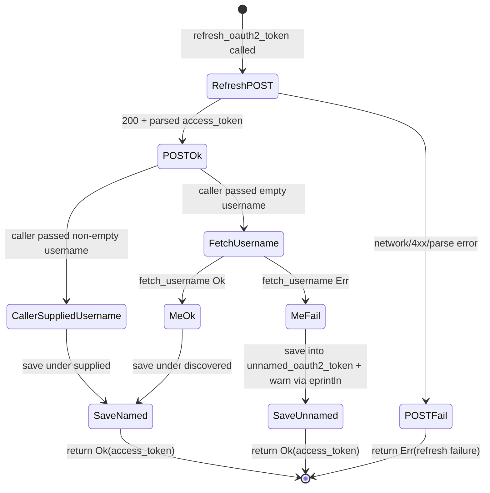
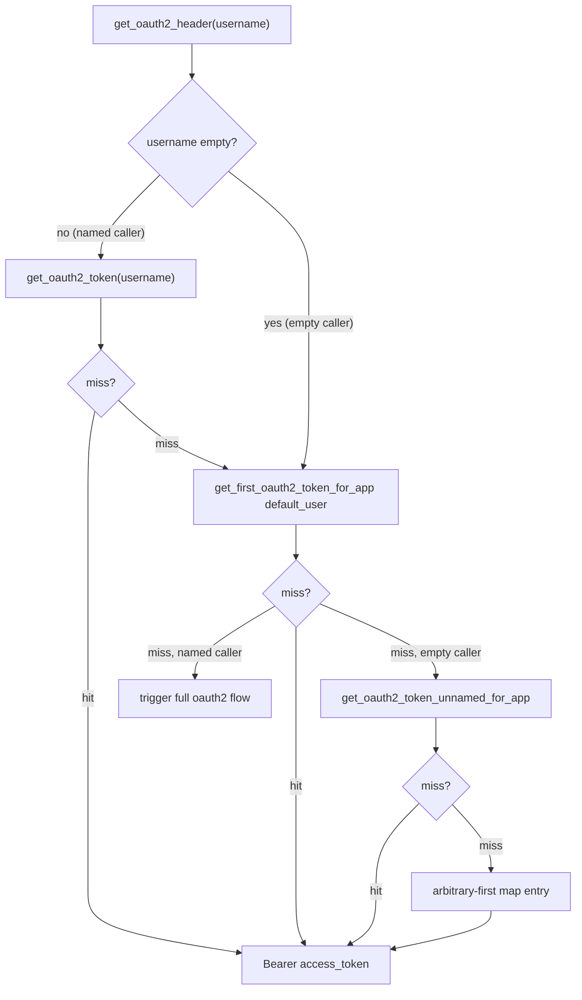

# feat: decouple xr from /2/users/me availability

## Summary

Three changes that remove `/2/users/me` from the critical path of common operations: OAuth2 token refresh keeps the
refreshed token even when post-refresh `/me` username discovery fails (the token lands in a typed `unnamed_oauth2_token`
slot and renders as `(unknown user)`); shortcut commands that need the caller's user ID use `/2/users/by/username/<u>`
when `-u` is passed instead of always hitting `/me`; and `xr auth oauth2 [USERNAME]` accepts a positional username so
the token is saved under a known handle without consulting `/me`. A credential-less-default-app warning surfaces when
the default app has no `client_id` but another registered app does.

Branch: `feat/auth-reliability`, cut from `feat/redirect-uri-and-listener`.

---

## Problem Frame

`/2/users/me` is operationally unreliable on X today. Three xurl-rs code paths depend on it for behavior that does not,
in principle, need user-identity discovery:

1. **Token refresh** (`src/auth/oauth2.rs::refresh_oauth2_token`): after a successful refresh-token POST, the existing
   code calls `fetch_username` (which hits `cfg.info_url`, defaulting to `/2/users/me`) to learn which key to save the
   refreshed token under. When `fetch_username` returns an error, the refresh aborts with
   `XurlError::auth_with_cause("UsernameFetchError", ...)`. The refreshed access token, which is valid, is discarded.
   The next API call then re-triggers a full browser flow.

2. **Shortcut commands' user-ID resolver** (`src/cli/commands/mod.rs::resolve_my_user_id`): every shortcut that needs
   the authenticated user's ID (eighteen call sites in the dispatcher) calls `client.get_me(opts)` which hits
   `/2/users/me`. The user has no way to bypass that call, even when they could supply their own handle.

3. **`auth oauth2` token labeling** (`src/auth/oauth2.rs::exchange_code_for_token` and the `auth oauth2` CLI handler):
   the OAuth2 flow's exchange step calls `fetch_username` to label the new token. If `/me` is unavailable, the entire
   authorization fails even though the access token is fine. Today's `xr auth oauth2` CLI variant has no positional
   argument, so a user who knows their handle has no way to short-circuit the lookup.

A secondary footgun: when a user runs `xr auth oauth2` without `--app NAME` and the default app has no `client_id` (the
legacy migration path produces this), the token is silently saved under the credential-less default app. The token
cannot be refreshed because `Auth` has no client credentials for it. The user only discovers this on the next API call,
which 401s. Upstream Go warns at the start of the OAuth2 handler when this configuration is detected.

This work brings xurl-rs to parity with upstream's `2026-04-19` batch on the three reliability vectors, plus the
credential-less-default warning. PR #29 (library entrypoint + writer threading) and PR #30 (per-app `redirect_uri` +
listener hardening) are the upstream prerequisites; this work stacks on the latter.

---

## Requirements

### Cross-cutting: testing convention

- R21. All tests use the library entrypoint pattern (`xurl::cli::run_with_store_path` + `TempDir`), no env mutation, no
  `#[serial]` for CLI tests. Wiremock-backed tests in `tests/auth_remote_tests.rs` follow the existing `TestServer`
  pattern. R21 applies to every implementation unit in this plan.

### Group C: refresh resilience

- R1. `Auth::refresh_oauth2_token` succeeds when the refresh-token POST succeeds, regardless of whether the post-refresh
  `fetch_username` call returns Ok or Err. The refreshed access token is persisted in either case.
- R2. When the caller passes a non-empty `username` to `refresh_oauth2_token`, the token is saved under that username;
  `fetch_username` is not called. When the caller passes empty `username` and `fetch_username` succeeds, the token is
  saved under the discovered name.
- R3. When the caller passes empty `username` AND `fetch_username` fails, the refreshed token is saved into
  `App.unnamed_oauth2_token` (an `Option<Token>` field) for the active app. The username-keyed `oauth2_tokens` map is
  not touched in this case.
- R4. `Auth::get_oauth2_header` returns `Bearer <access_token>` whenever a token is reachable. The lookup precedence is
  split by caller intent (see KTD5).
- R5. The existing public signatures of `Auth::get_oauth2_header`, `Auth::refresh_oauth2_token`, and `Auth::oauth2_flow`
  are preserved. Behavioral changes to the empty-username path are observable (the unnamed slot becomes reachable); the
  changes to the non-empty-username path are non-observable (the caller continues to see "their" token).

### Group D: shortcut `--username` fallback

- R6. `resolve_my_user_id` in `src/cli/commands/mod.rs` checks `opts.username`. When non-empty, it calls
  `client.lookup_user(&opts.username, opts)?` and returns `resp.data.id`. When empty, it calls `client.get_me(opts)?`
  (today's behavior).
- R7. All eighteen call sites in `run_subcommand` continue to call `resolve_my_user_id(&mut client, &opts)` unchanged;
  the new behavior propagates uniformly via `opts.username`.
- R8. `--username` semantics: always lookup when `opts.username` is non-empty. There is no
  try-`/me`-first-then-fall-back behavior (KTD3).
- R9. When `-u` is set but the lookup fails (e.g., username not found), the failure propagates as today: a
  `XurlError::validation("user @<name> not found")` or the underlying transport error.

### Group E: `auth oauth2 [USERNAME]` positional + credential-less warning

- R10. `AuthCommands::Oauth2` accepts an optional positional `username: Option<String>` after the existing flags. Clap
  parses it as `oauth2 [USERNAME]`.
- R11. When `USERNAME` is supplied, the handler passes the username through to `auth.oauth2_flow(&username, ...)`
  (interactive flow) and `auth.remote_oauth2_step2(&redirect_url, &username, ...)` (no-browser step 2).
  `exchange_code_for_token` receives the supplied username and saves the token under that key, bypassing
  `fetch_username`.
- R12. When `USERNAME` is empty (omitted), the existing behavior is preserved with one resilience addition:
  `exchange_code_for_token` calls `fetch_username` and, on failure, saves to `App.unnamed_oauth2_token` and returns Ok
  with the new access token. This mirrors R1–R3 for the refresh path.
- R13. The credential-less-default warning fires when ALL of the following hold:
- The user did NOT pass `--app` (detected via an explicit `Option<String>` signal threaded from clap, NOT via
    `auth.app_name()` emptiness — the latter is always `"default"` and not load-bearing here);
- `auth.token_store.get_default_app()`'s `client_id` is empty;
- At least one other registered app has a non-empty `client_id`.
- R14. The warning text is plain (no ANSI escape codes, no `eprintln!`). It routes through `OutputConfig::info(stderr,
  msg)`.
- R15. `run_auth_command` accepts a `stderr: &mut dyn Write` parameter and an `app_explicit: bool` parameter (true when
  the user passed `--app`). `commands::run` threads both into the auth handler. The current call site at
  `src/cli/commands/mod.rs:415` drops `stderr` on the floor; this fix is required for R13.

### Storage and rendering

- R16. `App` gains `pub unnamed_oauth2_token: Option<Token>` with `#[serde(default, skip_serializing_if =
  "Option::is_none")]`. Existing YAML files load with the field as `None`; serialized output omits the field when
  `None`. The legacy JSON migrator literal (`src/store/migration.rs`) populates the field as `None`.
- R17. `TokenStore` exposes `save_oauth2_token_unnamed_for_app(app_name, access_token, refresh_token, expiration_time)
  -> Result<()>` and `get_oauth2_token_unnamed_for_app(app_name) -> Option<&Token>`. **No
  `clear_oauth2_token_unnamed_for_app` is added in this PR** (per the scope-guardian finding: pre-landing dead public
  API is YAGNI; the future `--oauth2-unnamed` CLI command brings its own accessor).
- R18. `App::has_tokens()` includes `unnamed_oauth2_token.is_some()`. The existing `clear_all_for_app` and `clear_all`
  methods set `app.unnamed_oauth2_token = None`. These updates land in U1 because `xr auth clear --all` is the only
  documented path to remove an unnamed token in this PR (R19); without them, `--all` would silently leave the unnamed
  slot intact.
- R19. `xr auth clear --all` clears the unnamed token (transitively via R18). A dedicated `--oauth2-unnamed` flag is
  deferred to follow-up work.
- R20. `auth status` and `auth apps list` render the unnamed token alongside named ones. Text mode prints `oauth2:
  (unknown user)` for the unnamed entry. The JSON `AppStatusEntry` introduced in PR #30 grows an optional field
  `oauth2_unnamed: bool` (true when `App.unnamed_oauth2_token.is_some()`). The credential allowlist remains intact: the
  test fixture extends to cover the unnamed token's `access_token` / `refresh_token` strings, and the secret-exclusion
  test asserts none of them reach the JSON.
- R22. Existing `~/.xurl` YAML files load unchanged. The new `unnamed_oauth2_token` field is absent on load;
  serialization stays clean.
- R23. The binary's behavior in the happy path (refresh succeeds AND `/me` returns Ok) is unchanged from today.

---

## Key Technical Decisions

- **KTD1. Typed sentinel via a separate `App.unnamed_oauth2_token: Option<Token>` field, not an enum key or empty-string
  sentinel.** Upstream Go uses `app.OAuth2Tokens[""]`; xurl-rs uses a dedicated field. The `BTreeMap<String, Token>`
  invariant stays "keys are real handles"; `get_oauth2_usernames_for_app` continues to yield only real usernames. The
  slot is **single-occupancy with last-write-wins semantics**: each `/me`-failing refresh overwrites the previous
  unnamed token. This is acceptable for the common case (one user, transient `/me` outage) and documented for the
  implementer.

- **KTD2. Refresh resilience: `fetch_username` failure is non-fatal when the caller passed an empty username.** The
  refresh-token POST result is the source of truth for "is the refresh successful". When the caller supplied a non-empty
  username, `fetch_username` is skipped entirely (no possible `/me` failure). When the caller supplied empty and
  `fetch_username` returns Err, the refresh path saves to `unnamed_oauth2_token` and returns Ok.
  `XurlError::auth_with_cause("UsernameFetchError", ...)` is no longer propagated from the refresh path. The warning
  emission on this path uses `eprintln!` to process stderr because the refresh function lacks an OutputConfig
  (limitation acknowledged; the persisted store state is the load-bearing observable).

- **KTD3. `--username` semantics: always lookup, no cache short-circuit, no try-/me-first.** When `opts.username` is
  set, `resolve_my_user_id` makes exactly one API call (`/by/username/<u>`). It does not look at the token store for a
  cached identity (the store keys on username, not on user ID — so even a name match would not save the lookup). It does
  not try `/me` first. Reasoning: a `/me`-first-then-fallback pattern doubles latency in the failure case; an explicit
  cache lookup would add scope without a clear win because the store doesn't carry user IDs.

- **KTD4. Credential-less-default warning routes through `OutputConfig::info(stderr, msg)` as plain text, not
  ANSI-yellow `eprintln!`.** Upstream Go uses raw `\033[33m` color codes; xurl-rs's writer-routed convention preserves
  test capturability and `--quiet` semantics. The warning is suppressed under `--quiet` per the existing
  `OutputConfig::info` contract.

- **KTD5. `Auth::get_oauth2_header` precedence is intent-split.** When the caller passes a non-empty `username`, the
  lookup proceeds as today: named-by-username, then fall through to `get_first_oauth2_token_for_app` (which itself
  prefers `default_user` then arbitrary-first). **The unnamed slot is never reached on this path.** When the caller
  passes an empty `username`, the lookup is: `default_user`'s named token (existing behavior) → unnamed token (new) →
  arbitrary-first map entry. Reasoning: a caller who supplies a username has explicit identity intent; falling through
  to a salvage-state token under their name would be wrong. A caller who supplies empty has no identity intent; in that
  case `default_user` (a user-chosen explicit signal) outranks the unnamed slot (a salvage state), which in turn
  outranks the arbitrary map entry.

- **KTD6. Stderr threading in `run_auth_command`.** The function signature gains `stderr: &mut dyn Write` AND
  `app_explicit: bool` parameters; `src/cli/commands/mod.rs::run_subcommand` at line 415 threads its `stderr` parameter
  and a new "did the user pass `--app`" boolean (derived at the runner from `cli.app.is_some()`). The current
  `auth.app_name()` is not a substitute because `Config.app_name` defaults to `"default"` and is never empty in normal
  runtime paths.

- **KTD7. `exchange_code_for_token` mirrors KTD2 for the empty-username path.** When the `username` parameter is
  non-empty, the function saves under that username and does not call `fetch_username`. When empty, it calls
  `fetch_username` and on failure saves to `unnamed_oauth2_token` and returns Ok. **The existing test
  `step2_username_resolution_failure_preserves_pending` (`tests/auth_remote_tests.rs:642-692`) currently asserts that
  this path returns Err and preserves the pending file. After this change the test inverts: the call returns Ok, the
  pending file is consumed by `run_remote_step2`'s normal success path, and the token lives in the unnamed slot. The
  test is renamed and its assertions are rewritten in U4 — explicitly listed in U4's Files.**

- **KTD8. Status text rendering for the unnamed slot.** When `App.unnamed_oauth2_token.is_some()`, the status output for
  that app includes an `oauth2: (unknown user)` line in addition to any named-user lines. Order: named entries first
  (alphabetical, current behavior), then the unnamed entry if present. The label string is `"(unknown user)"` for
  upstream parity.

- **KTD9. `AppStatusEntry` JSON field `oauth2_unnamed: bool`.** Rather than mutating the existing `oauth2_users:
  Vec<String>` shape, the JSON gains a separate boolean. This preserves the typed list semantics for consumers that
  iterate usernames; the secret-exclusion test continues to assert no credential strings reach the JSON. The field omits
  when `false` via `#[serde(skip_serializing_if = "<is_false>")]`.

- **KTD10. `App::has_tokens()` and `clear_all_for_app` must learn about the new field.** Without these updates, `xr auth
  clear --all` would silently fail to remove the unnamed token (R19's only documented removal path) and `has_tokens()`
  would return `false` for an app holding only an unnamed token. Both are landed in U1 alongside the field itself.

---

## Scope Boundaries

### In scope

- Storage primitive `App.unnamed_oauth2_token` with backward-compat YAML, plus `has_tokens()` and `clear_all_for_app`
  updates (R16, R18, R22, KTD10).
- TokenStore accessors: `save_oauth2_token_unnamed_for_app`, `get_oauth2_token_unnamed_for_app` (R17). No clear-unnamed
  accessor in this PR.
- Refresh resilience: `fetch_username` failure non-fatal for the empty-username path (R1–R3, KTD2).
- `Auth::get_oauth2_header` precedence: intent-split, unnamed reserved for empty-username callers (R4–R5, KTD5).
- Shortcut `--username` fallback in `resolve_my_user_id` (R6–R9, KTD3).
- `AuthCommands::Oauth2` positional `[USERNAME]` (R10–R12, KTD7).
- `exchange_code_for_token` resilience for the empty-username path + rewrite of the existing `preserves_pending` test
  (R12, KTD7).
- Credential-less-default warning, stderr threading, explicit `--app` signal (R13–R15, KTD4, KTD6).
- Status and apps-list rendering of the unnamed slot, including secret-exclusion regression (R20, KTD8, KTD9).
- `xr auth clear --all` clears the unnamed slot (R19, KTD10).

### Deferred to follow-up work

- `xr auth clear --oauth2-unnamed` dedicated subcommand. The `--all` path covers removal today; a dedicated flag is a
  small follow-up.
- Promotion path: when `auth oauth2 USERNAME` succeeds and the app has an existing `unnamed_oauth2_token`, automatically
  delete the unnamed entry. Not in scope; the user can manually clear via `--all`. After this PR the `get_oauth2_header`
  precedence (KTD5) makes `default_user` outrank unnamed, so a stale unnamed slot does not silently win against a
  user-chosen identity.
- Refresh-time `OutputConfig` stderr access. `refresh_oauth2_token` is called from many entry points including
  mid-request from `ApiClient::send_request`. Threading stderr through to the refresh path would require expanding
  `ApiClient`'s public surface. For this work, the refresh-time warning emits via `eprintln!` to the process's real
  stderr. Library tests assert on the persisted store state rather than the warning text.
- The docs and version-bump PR for the consolidated release.

### Outside this work's identity

- The webhook command (`xr webhook start`). Deferred indefinitely.
- Command allow/deny list (separate design discussion).
- Any change to OAuth1 or bearer-token storage shapes.

---

## High-Level Technical Design

Two state machines change shape:

1. **Refresh-token outcomes**: today a binary success/failure on the combined refresh-POST + `/me`-lookup. After: a
   four-state outcome — refresh failed (return Err), refresh succeeded + caller supplied username (save under supplied,
   skip `/me`, return Ok), refresh succeeded + empty caller + `/me` succeeded (save named, return Ok), refresh succeeded
   - empty caller + `/me` failed (save unnamed, return Ok).

2. **`Auth::get_oauth2_header` precedence**: today a two-branch lookup (named-by-username when set;
   `get_first_oauth2_token_for_app` when empty, which itself prefers `default_user`). After: same two outer branches,
   but the empty-caller branch interpolates the unnamed slot between `default_user` and arbitrary-first.

The credential-less-default warning is a pre-flight check in the `auth oauth2` handler; no state-machine treatment
needed.

---

## Implementation Units

Per R21, every unit below uses the library entrypoint pattern (`xurl::cli::run_with_store_path` + `TempDir`) for
CLI-level tests and follows the existing `TestServer` pattern in `tests/auth_remote_tests.rs` for OAuth-flow tests.

### U1. `App.unnamed_oauth2_token` field, accessors, `has_tokens()`, `clear_all_for_app`

- **Goal**: Storage primitive for the unnamed-token slot, plus the supporting updates to `has_tokens()` and
  `clear_all_for_app`.
- **Requirements**: R16, R17, R18, R19, R22, R23, KTD1, KTD10.
- **Dependencies**: none.
- **Files**:
- `src/store/types.rs` (modify): add `pub unnamed_oauth2_token: Option<Token>` to `App` with `#[serde(default,
    skip_serializing_if = "Option::is_none")]`. Mirror the existing `oauth1_token: Option<Token>` field shape. Update
    `App::new()` and `App::with_credentials()` to initialize the field as `None`. Update `App::has_tokens()` so it
    returns `true` when `self.unnamed_oauth2_token.is_some()`.
- `src/store/migration.rs` (modify): the legacy JSON migrator literal builds the new field as `None`.
- `src/store/tokens.rs` (modify): add `pub fn save_oauth2_token_unnamed_for_app(...) -> Result<()>` writing into
    `resolve_app_mut(app_name).unnamed_oauth2_token`. Add `pub fn get_oauth2_token_unnamed_for_app(&self, app_name:
    &str) -> Option<&Token>` returning `None` when the slot is empty. Update `clear_all_for_app(app_name)` (and
    `clear_all`) to also `app.unnamed_oauth2_token = None`. **Do NOT add `clear_oauth2_token_unnamed_for_app` in this
    PR** — the dedicated clear-flag is deferred.
- `tests/store_tests.rs` (modify): add `unnamed_oauth2_token: None` to the existing `App {}` literals. Add new tests:
    happy-path round-trip; backward-compat (YAML fixture without the field loads with `None`); `clear_all_for_app`
    clears the unnamed slot; `has_tokens()` returns `true` for an app holding only the unnamed slot.
- **Approach**: Mirror `oauth1_token: Option<Token>` exactly for serde shape. `resolve_app_mut` falls back to the active
  or freshly-created app if the named one is missing, so the "missing-app" case is silent auto-create, not an error.
- **Patterns to follow**: `oauth1_token: Option<Token>` at `src/store/types.rs:61`. `save_oauth1_tokens_for_app` for the
  accessor pattern. `clear_oauth1_tokens_for_app` for the clear pattern.
- **Test scenarios**:
- Happy path: `save_oauth2_token_unnamed_for_app("app1", "AT", "RT", 1234567890)` then reload from path;
    `get_oauth2_token_unnamed_for_app("app1")` returns `Some(token)`.
- Empty by default: a freshly added app has `get_oauth2_token_unnamed_for_app` return `None`.
- Last-write-wins: two consecutive saves leave only the second token.
- Backward compat: a YAML fixture (string literal in the test) without `unnamed_oauth2_token` loads with `None`.
- Migration: legacy JSON migrator produces an `App` whose `unnamed_oauth2_token` is `None`.
- Missing app silently auto-creates: `save_oauth2_token_unnamed_for_app("ghost", ...)` writes through `resolve_app_mut`
    which falls back to the active app (or freshly creates) — no error returned. Assert the active app's slot now holds
    the token.
- `App::has_tokens()` for unnamed-only app: an app with no named oauth2, no oauth1, no bearer, but `unnamed_oauth2_token
    = Some(...)` returns `true`.
- `clear_all_for_app` clears unnamed: seed an app with all four token shapes (named oauth2, oauth1, bearer, unnamed),
    call `clear_all_for_app(app_name)`, assert all four are gone (including the unnamed slot).
- **Verification**: `cargo test --test store_tests` passes; `rg 'unnamed_oauth2_token' src/store/` shows the field and
  two accessors; existing YAML fixtures round-trip without the field.

### U2. Refresh resilience: save under unnamed slot on `/me` failure + `get_oauth2_header` precedence

- **Goal**: `Auth::refresh_oauth2_token` succeeds and persists regardless of whether `fetch_username` succeeds
  (empty-username path). `Auth::get_oauth2_header` honors the intent-split precedence.
- **Requirements**: R1, R2, R3, R4, R5, R23.
- **Approach KTDs**: KTD2, KTD5.
- **Dependencies**: U1 (consumes the unnamed accessor).
- **Files**:
- `src/auth/oauth2.rs` (modify): change `refresh_oauth2_token` so the `fetch_username` call at lines 413-419 is wrapped
    in `match`. On `Ok(name)`: save via `save_oauth2_token_for_app(&name, ...)` (current behavior). On `Err(_)`: save
    via `save_oauth2_token_unnamed_for_app(...)` and log a one-line warning via `eprintln!("warning: refresh succeeded
    but /2/users/me lookup failed; token stored under unnamed slot")`. Return Ok with the new access token in both
    paths.
- `src/auth/mod.rs` (modify): rework `get_oauth2_header` (around lines 141-169) for the intent-split precedence per
    KTD5. When `username` is non-empty: try `get_oauth2_token(username)` only; on miss, fall through to
    `get_first_oauth2_token_for_app` (which itself prefers `default_user` then arbitrary-first); **never consult the
    unnamed slot on this branch**. When `username` is empty: try `default_user`'s named token via
    `get_first_oauth2_token_for_app` first, then the unnamed slot, then arbitrary-first. Document the precedence in the
    function's rustdoc.
- `tests/auth_remote_tests.rs` (modify): add `refresh_resilience` tests. Mock `/2/oauth2/token` returning 200 + new
    access_token + refresh_token + expires_in. Mock `/2/users/me` returning 500. Call `auth.refresh_oauth2_token("")`
    (empty caller). Assert: returned access_token matches mock; `get_oauth2_token_unnamed_for_app(active_app)` returns
    the new token; the named `oauth2_tokens` map is unchanged.
- **Approach**: Production code change is small (two function refactors). The bulk is testing — both the refresh path
  and `get_oauth2_header` precedence.
- **Patterns to follow**: existing `step2_username_resolution_failure_preserves_pending` test for the dual-mock wiremock
  setup pattern.
- **Test scenarios**:
- Refresh + caller-supplied username: skips `fetch_username`; saves under that name; unnamed slot untouched.
- Refresh + empty caller + `/me` Ok: saves under discovered name; unnamed slot untouched.
- Refresh + empty caller + `/me` Err: returns Ok with new access_token; unnamed slot holds the new token; named map
    unchanged.
- `get_oauth2_header("alice")` with named token under "alice": returns the named token's Bearer.
- `get_oauth2_header("alice")` with no named token but unnamed slot populated: does NOT return the unnamed token; falls
    through to `get_first_oauth2_token_for_app`; if that also misses, triggers the OAuth2 flow.
- `get_oauth2_header("")` with `default_user` set + named token for default_user + unnamed populated: returns the
    default_user's token (unnamed is below default_user in precedence per KTD5).
- `get_oauth2_header("")` with no `default_user` + no named token + unnamed populated: returns the unnamed token.
- `get_oauth2_header("")` with no `default_user` + no named token + no unnamed but arbitrary first-named exists: returns
    the first-named (current arbitrary fallback).
- Expired-token refresh path: cached token expired; `get_oauth2_header("alice")` delegates to refresh; refresh + `/me`
    succeeds → new token saved under "alice"; returns new Bearer.
- **Verification**: `cargo test --test auth_remote_tests` passes new tests; existing OAuth2 tests pass; `rg
  'UsernameFetchError' src/` returns zero hits in production code (the variant is no longer reachable from the refresh
  path).

### U3. Shortcut `--username` fallback in `resolve_my_user_id`

- **Goal**: `resolve_my_user_id` uses `lookup_user` when `opts.username` is non-empty; current `get_me` behavior
  preserved when empty.
- **Requirements**: R6, R7, R8, R9.
- **Approach KTDs**: KTD3.
- **Dependencies**: none (independent of U1, U2, U4, U5).
- **Files**:
- `src/cli/commands/mod.rs` (modify): rewrite `resolve_my_user_id`. If `opts.username.is_empty()` → call
    `client.get_me(opts)` as today. Otherwise → call `client.lookup_user(&opts.username, opts)` and return
    `resp.data.id`. Both branches share the existing empty-ID check.
- `tests/cli_tests.rs` (modify): add tests that drive a representative shortcut (e.g., `like`) through
    `xurl::cli::run_with_store_path` with a tempdir store. Mock `/2/users/by/username/alice` (and the subsequent like
    endpoint) via wiremock. Drive with and without `-u`.
- **Approach**: One if/else in production code. The bulk is test infrastructure — running a CLI through wiremock to
  assert which user-ID endpoint was hit.
- **Patterns to follow**: `client.lookup_user(username, opts)` at `src/api/shortcuts.rs:244-254`; `TestServer` for
  wiremock setup.
- **Test scenarios**:
- `-u set, lookup succeeds`: `xr like 12345 -u alice` against a tempdir store with a seeded bearer token; mocks
    `/2/users/by/username/alice` returning `{"data": {"id": "67890", ...}}`. Assert the subsequent like request targets
    `/2/users/67890/likes`.
- `-u absent, /me succeeds`: same shape but no `-u`; mocks `/2/users/me` returning `{"data": {"id": "111", ...}}`.
    Assert the like targets `/2/users/111/likes`.
- `-u set, lookup returns 404`: mock returns 404 for `/by/username/alice`; assert exit code non-zero, stderr indicates
    user not found.
- `-u "" treated as absent`: `xr like 12345 -u ""` (forced empty) falls into the `/me` branch via
    `opts.username.is_empty()`. This is current `CommonFlags::to_call_options` behavior; the test documents it
    explicitly so a future change is intentional.
- `-u @alice` strips the `@`: `lookup_user`'s `resolve_username` helper handles this; the mock asserts on
    `/by/username/alice` (not `@alice`).
- Representative coverage: a single test against `like` is sufficient because all eighteen shortcut handlers route
    through the same `resolve_my_user_id`. No per-handler explosion.
- **Verification**: `cargo test --test cli_tests` passes new tests; `rg 'resolve_my_user_id' src/cli/commands/mod.rs`
  shows exactly one definition; the 18 call sites compile unchanged.

### U4. `auth oauth2 [USERNAME]` positional + `exchange_code_for_token` resilience + rewrite `preserves_pending` test

- **Goal**: Add the positional argument to the CLI variant. Thread the supplied username through. Update
  `exchange_code_for_token` to mirror the refresh-resilience pattern when called with empty username. Rewrite the
  existing `preserves_pending` test to match the new behavior.
- **Requirements**: R10, R11, R12.
- **Approach KTDs**: KTD7.
- **Dependencies**: U1 (consumes the unnamed accessor for the empty-caller path).
- **Files**:
- `src/cli/mod.rs` (modify): add `username: Option<String>` positional argument to `AuthCommands::Oauth2`. Use
    `#[arg(value_name = "USERNAME")]`. Keep `no_browser`, `step`, `auth_url` as flags.
- `src/cli/commands/auth.rs` (modify): in the `AuthCommands::Oauth2 { no_browser, step, auth_url, username }` arm, pass
    `username.as_deref().unwrap_or("")` into `auth.oauth2_flow(...)` and `auth.remote_oauth2_step2(...)`.
- `src/auth/oauth2.rs` (modify): update `exchange_code_for_token` so the `if username.is_empty()` branch calls
    `fetch_username` and, on Err, falls back to `save_oauth2_token_unnamed_for_app` and returns Ok (mirroring U2's
    refresh-path logic). When `username` is non-empty, save under that username directly without calling
    `fetch_username` (existing behavior).
- `tests/auth_remote_tests.rs` (modify, rewrite): the existing test
    `step2_username_resolution_failure_preserves_pending` (lines 642-692) currently asserts that empty-caller +
    `/me`-failing returns Err and preserves the pending file. **Rename to
    `step2_username_resolution_failure_saves_unnamed_and_consumes_pending` and rewrite the assertions:**
- The call to `remote_oauth2_step2(&redirect_url, "", &pending_path)` returns Ok with the new access_token.
- `get_oauth2_token_unnamed_for_app(active_app)` returns the new token.
- `pending_path.exists()` is `false` (consumed by the normal success path in `run_remote_step2`).
- `tests/cli_tests.rs` (modify): parse-shape tests for `xr auth oauth2`, `xr auth oauth2 alice`, `xr auth oauth2
    --no-browser --step 1`, `xr auth oauth2 alice --no-browser --step 1`, `xr auth oauth2 alice bob` (invalid; clap exit
    2).
- **Approach**: Clap addition is mechanical. The `exchange_code_for_token` update mirrors U2's pattern. The test rewrite
  is the main work and is explicitly listed.
- **Patterns to follow**: positional handling via `value_name = "USERNAME"` (PR #30 precedent). Existing
  `exchange_code_for_token` empty-vs-set username branch at `src/auth/oauth2.rs:93-162` for the structure.
- **Test scenarios**:
- `auth oauth2 alice`: parse succeeds; the dispatched call passes `"alice"`; `exchange_code_for_token` saves under
    `"alice"`; no `fetch_username` call.
- `auth oauth2` + `/me` Ok: saves under discovered username (`tests/auth_remote_tests.rs` mocks `/me` returning
    `discovered`).
- `auth oauth2` + `/me` Err: saves to unnamed slot; returns Ok; pending consumed (the rewritten test above).
- `auth oauth2 alice --no-browser --step 1`: emits the auth URL; no token save yet (step 1 is URL emission only).
- `auth oauth2 alice --no-browser --step 2 --auth-url <URL>`: passes `"alice"` through to `remote_oauth2_step2`;
    downstream `exchange_code_for_token` saves under `"alice"`.
- Invalid positional shape: `xr auth oauth2 alice bob` returns clap usage error (exit code 2).
- **Verification**: `cargo test --test cli_tests --test auth_remote_tests --test oauth2_flow_tests` passes; `rg
  'exchange_code_for_token' src/` shows the updated branching; clap `oauth2 [USERNAME]` documented in `xr auth oauth2
  --help`.

### U5. Stderr threading + explicit `--app` signal + credential-less-default warning + status/list rendering

- **Goal**: Emit a warning to the runner's stderr when `auth oauth2` runs with a credential-less default app and other
  apps have credentials. Thread `stderr` and an explicit `app_explicit: bool` through `run_auth_command`. Render the
  unnamed token slot in status and apps-list output.
- **Requirements**: R13, R14, R15, R20.
- **Approach KTDs**: KTD4, KTD6, KTD8, KTD9.
- **Dependencies**: U1 (consumes `get_oauth2_token_unnamed_for_app`), U4 (the warning fires in the auth handler U4
  touches).
- **Files**:
- `src/cli/commands/mod.rs` (modify): `run_auth_command` call at line 415 now passes `stderr` (already in scope) and
    `cli.app.is_some()` (the explicit-app signal computed once at the runner). The runner threads `cli.app:
    Option<String>` so this is the place that distinguishes "user passed `--app foo`" from "user passed nothing and the
    default `"default"` filled in".
- `src/cli/commands/auth.rs` (modify): `run_auth_command` signature gains `stderr: &mut dyn Write` and `app_explicit:
    bool` parameters. In the `AuthCommands::Oauth2` arm, before the `if !no_browser` dispatch, check:
- If `!app_explicit` (user did NOT pass `--app`), AND `auth.token_store.get_app(auth.token_store.get_default_app())` has
      empty `client_id`, AND at least one other app has non-empty `client_id`, emit the multi-line warning via
      `out.info(stderr, &msg)`.
- Warning text uses three ASCII dots (`...`) for the truncated client_id hint, matching the existing `auth status`
      rendering at `src/cli/commands/auth.rs:202`.
- `src/cli/commands/auth.rs` (modify): the `Status` handler (from PR #30) gains a per-app check for
    `app.unnamed_oauth2_token.is_some()`; if present, render an `oauth2: (unknown user)` line after the named-user
    lines. Add `oauth2_unnamed: bool` field to `AppStatusEntry` with `#[serde(skip_serializing_if = "<is_false>")]`.
- `tests/cli_tests.rs` (modify): tests for the warning emission (seeded tempdir with default credential-less + secondary
    credentialed app; `xr auth oauth2` with no `--app`; assert stderr contains the warning). Test suppression: pass
    `--app myapp`; assert empty stderr. Test no-secondary-apps case: only the default app exists; assert empty stderr.
    Extend the secret-exclusion test from PR #30 to include the new unnamed slot's token values in the banned-string
    list.
- **Approach**: Warning logic is a half-dozen conditional checks. Stderr threading and `app_explicit` are signature
  additions rippling through `run_auth_command` and one caller. Status/list rendering follows the PR #30 pattern.
- **Patterns to follow**: PR #30's `OutputConfig::info(stderr, msg)` (verify the signature in `src/output.rs`). PR #30's
  `AppStatusEntry` field-by-field construction discipline.
- **Test scenarios**:
- Warning fires: default app credential-less + another app credentialed + no `--app` → stderr contains warning text.
- Warning suppressed by explicit `--app`: `xr auth oauth2 --app myapp` → stderr empty.
- Warning suppressed by no credentialed alternative: only the default app exists (credential-less) → stderr empty.
- Warning suppressed when default app has credentials → stderr empty.
- Status text shows unnamed entry: app with `unnamed_oauth2_token = Some(...)`; status output contains `oauth2: (unknown
    user)` after any named-user lines.
- Status JSON: same fixture; JSON entry has `oauth2_unnamed: true`.
- Status JSON omits `oauth2_unnamed: false`: app without unnamed token; the field is absent from JSON.
- Secret-exclusion regression: extend the PR #30 fixture so the seeded app also has `unnamed_oauth2_token` with known
    access/refresh strings. The assert_no_credentials banned-string list grows with `"UNNAMED-AT-AAA"` and
    `"UNNAMED-RT-BBB"`. The test passes.
- **Verification**: `cargo test --test cli_tests` passes; `rg 'oauth2_unnamed' src/` shows the field and rendering
  wiring; the secret-exclusion test extends without rewrites; the warning text is plain-text routed via
  `OutputConfig::info` (no ANSI escape codes).

---

## System-Wide Impact

- **Public API surface**: two new methods on `TokenStore` (`save_oauth2_token_unnamed_for_app`,
  `get_oauth2_token_unnamed_for_app`). `App` gains one optional field. `App::has_tokens()` and
  `TokenStore::clear_all_for_app` learn about the new field. No changes to `Auth::get_oauth2_header`,
  `Auth::refresh_oauth2_token`, `Auth::oauth2_flow` signatures.
- **CLI surface**: `AuthCommands::Oauth2` gains an optional positional `USERNAME`. Existing invocations without USERNAME
  behave identically.
- **`run_auth_command` signature**: gains `stderr: &mut dyn Write` AND `app_explicit: bool` parameters. Single in-crate
  caller; not a public API.
- **Status text output**: gains a per-app `oauth2: (unknown user)` line when the app has an unnamed token. Documented in
  release notes.
- **Status JSON output**: gains an optional `oauth2_unnamed: bool` field per app. Schema additive.
- **Refresh-path error story**: the `XurlError::auth_with_cause("UsernameFetchError", ...)` arm is no longer reachable
  from the refresh path. Library consumers (`bird`) that pattern-matched on that variant would observe behavior change.
  Repo-research confirmed `bird` pattern-matches on typed `XurlError::Api { status, .. }` shape (not on
  `auth_with_cause` strings), so the practical risk is low.
- **`get_oauth2_header` precedence change**: observable to library consumers in two cases: (a) named-username caller
  with no matching token — now strictly falls through `get_first_oauth2_token_for_app` (which still prefers
  `default_user`), never to the unnamed slot; (b) empty-username caller — now sees `default_user` first, then unnamed,
  then arbitrary-first.
- **No new dependencies**.
- **No CI change**.

---

## Risks & Dependencies

- **Risk: refresh-path warning bypasses `--quiet` and `--output json` envelopes.** The refresh-path warning uses
  `eprintln!` to process stderr because `refresh_oauth2_token` lacks an `OutputConfig`. This violates the project's
  writer-routed warning convention. Mitigation: the warning is suppressed unless `/me` actually fails (the common case
  is no warning); the deferred-work entry documents threading `OutputConfig` through `ApiClient::send_request` →
  `Auth::get_oauth2_header` → `Auth::refresh_oauth2_token` as the right long-term fix; library tests assert on persisted
  store state rather than the warning text. Acceptable for this PR's scope.
- **Risk: stale unnamed-token persistence.** A single unnamed slot per app, last-write-wins. After this PR, the only way
  to clear the unnamed token is `xr auth clear --all`. KTD5's precedence makes a stale unnamed slot lose to
  `default_user` (a user-chosen explicit signal), so the user-facing impact is minor: a stale unnamed token gets quietly
  preserved until next `--all` or until a future `--oauth2-unnamed` flag lands. Documented in deferred work.
- **Risk: `step2_username_resolution_failure_preserves_pending` test rewrite is load-bearing.** The existing test
  asserts the OLD behavior (Err + pending preserved); after U4 the behavior is Ok + pending consumed + unnamed-slot
  save. Mitigation: U4 explicitly lists the rewrite in its file changes; the rewritten test is the regression guard for
  KTD7's resilience.
- **Risk: `app_explicit: bool` signal must be threaded at the runner.** The runner (`src/cli/runner.rs` or
  `src/cli/commands/mod.rs::run`) sees `cli.app: Option<String>` (clap-level). The signal computed once at the runner
  (`cli.app.is_some()`) is threaded through `commands::run` → `run_subcommand` → `run_auth_command`. If the threading is
  missed, the warning will fire on every `xr auth oauth2` invocation (R13's gating breaks open). Mitigation: U5's test
  scenarios explicitly cover the suppression cases.
- **Risk: `bird` ecosystem coupling on `XurlError::auth_with_cause("UsernameFetchError")`.** Repo research confirmed
  `bird` matches on typed `XurlError::Api { status, .. }` shape per
  `docs/brainstorms/2026-04-03-library-ergonomics-requirements.md:90`. The variant change is not load-bearing.
  Documented as a release-notes item but not a release blocker.
- **No new dependencies**.

---

## Sources & Research

- Repo research findings: `Auth::get_oauth2_header`, `refresh_oauth2_token`, `resolve_my_user_id`, `App` shape, runner
  stderr threading gap, `Config.app_name` is always `"default"` not empty, `get_first_oauth2_token_for_app` already
  prefers `default_user`.
- `docs/solutions/best-practices/oauth2-pkce-credential-handling-rust-cli.md` — status-check-before-parse pattern
  carries over to the refresh exchange and the `/me` call.
- `docs/solutions/architecture-patterns/quiet-flag-diagnostic-suppression-pattern.md` — `OutputConfig::info` is the
  canonical stderr-routing path (KTD4).
- `docs/solutions/best-practices/agent-native-semantic-json-fields-over-stderr-warnings-2026-04-20.md` — actionable
  warnings can dual-emit; this work emits plain stderr only because the warning fires before OAuth2 dispatch and the
  JSON envelope is undefined at that point.
- `docs/solutions/rust-patterns/rust-cli-port-methodology.md` — `OutputConfig::info` convention; "no naked
  `println!`/`eprintln!` in command code"; the wiremock `TestServer` pattern.
- `docs/brainstorms/2026-04-03-library-ergonomics-requirements.md:90` — `bird` matches on typed `XurlError::Api {
  status, .. }` shape, not on `auth_with_cause` strings; confirms the `UsernameFetchError` removal is not a breaking
  change for that consumer.
- Upstream Go xurl (`/tmp/xurl-upstream`): `auth/auth.go::RefreshOAuth2Token` (Group C reference; xurl-rs uses a typed
  `Option` instead of `""` map key per scope decision), `cli/shortcuts.go::resolveMyUserID` (Group D reference;
  always-lookup semantics), `cli/auth.go::createAuthOAuth2Cmd` (Group E warning block; xurl-rs uses plain text via
  OutputConfig writer instead of ANSI per scope decision), `cli/auth.go::displayOAuth2Username` (the `(unknown user)`
  label string).
- PR #29 (`docs/plans/2026-06-01-001-feat-library-cli-entrypoint-plan.md`) — library entrypoint + writer threading;
  stderr writer is wired to `commands::run` but not yet to `run_auth_command` (KTD6 closes this).
- PR #30 (`docs/plans/2026-06-01-002-feat-redirect-uri-and-listener-plan.md`) — `AppStatusEntry` shape +
  secret-exclusion test pattern; this work extends both.
