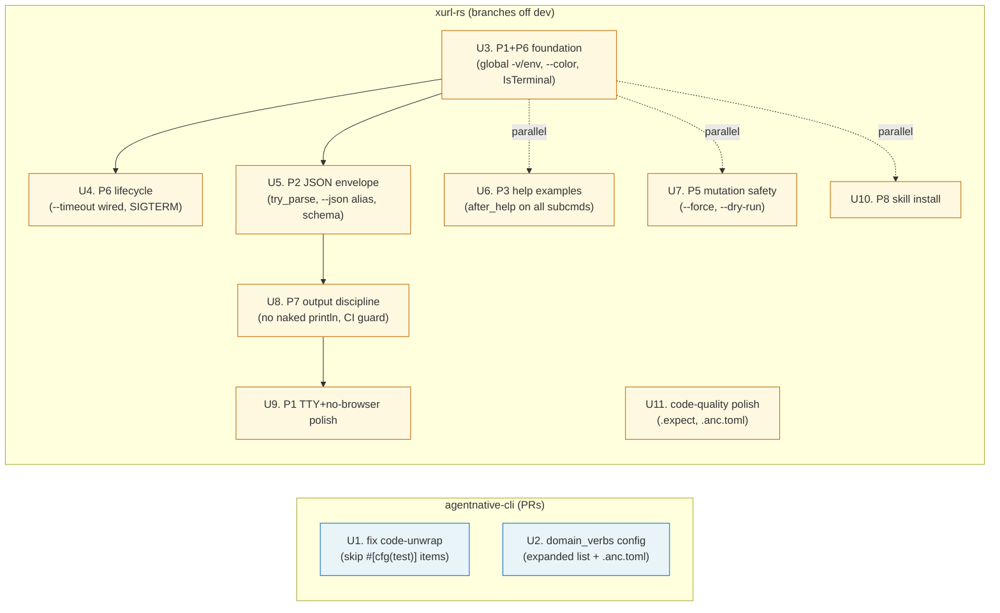

# feat: Bring xurl-rs to 100% on the agent-native CLI spec (anc audit)

## Summary

Bring xurl-rs (binary `xr`) from baseline **37 pass / 6 fail / 21 warn / 5 skip** out of 69 audits to **100% pass** as
scored by `anc audit . --output json`. Two repos in scope: minor upstream fixes to `brettdavies/agentnative-cli` (anc)
for two spec-author-side deficiencies, then targeted xurl-rs work across ~7 feature branches to close the actual gaps
without breaking the public surface.

The baseline gap inventory is at `/tmp/anc-gaps.json` (32 non-pass entries with evidence).

Verification model: after each branch lands on `dev`, re-run `anc audit . --output json` and assert the non-pass count
drops monotonically; the plan completes when the audit reports 69 pass / 0 fail / 0 warn (or warns only on MAY items
with documented opt-out rationale).

---

## Problem Frame

`anc audit` is the canonical agent-native compliance checker that the user authors and maintains. It scores `xr` against
seven principles plus a `CodeQuality` group, emitting a JSON scorecard whose `summary` and per-audit `status` (`pass |
fail | warn | skip | opt_out | n_a | error`) consumers grade with. The xurl-rs baseline shows:

- **6 MUST failures** that must reach `pass`.
- **21 warnings** — several are MUSTs counted as `warn` (e.g., the verbose flag lacks `global` and `env`), several are
  SHOULDs, several are MAYs.
- **5 skips** — three vacuous (genuinely N/A), two recoverable (consistent-envelope blocked on JSON errors landing
  first; headless auth claimed absent because anc didn't see the OAuth code).

Two of the items are not `xr`'s fault:

1. `code-unwrap` flags every `.unwrap()` inside `#[cfg(test)] mod tests` even though `--include-tests` is off by
   default. `anc`'s ast-grep heuristic only excludes the `tests/` directory and `*_test.rs` files; inline test modules
   are mis-classified as production code.
2. `p6-may-standard-names` flags 28/35 subcommands because `post`, `like`, `repost`, `quote`, `bookmark`, `follow`,
   `block`, `mute`, `dm` are not in `anc`'s built-in verb list. These verbs are the X/Twitter platform's canonical
   vocabulary — renaming them would *worsen* agent ergonomics. Fix is to teach `anc` about domain vocabulary, not to
   rewrite `xr`.

Both are addressed by upstream PRs against `agentnative-cli`. The remaining 30 gaps are remediated in `xr` itself, in
changes that are additive and backwards-compatible — no version-2 break.

---

## Requirements

| ID  | Requirement                                                                                                                                                             | Source                                                    |
| --- | ----------------------------------------------------------------------------------------------------------------------------------------------------------------------- | --------------------------------------------------------- |
| R1  | Every MUST in `anc audit . --output json` reports `status: pass` for xurl-rs.                                                                                           | `/tmp/anc-gaps.json` (failures + warned-MUSTs)            |
| R2  | Every SHOULD reports `pass` or `opt_out` with frontmatter rationale.                                                                                                    | Same                                                      |
| R3  | Every MAY reports `pass`, `opt_out`, or stays `warn` only with explicit Sources-and-Research note.                                                                      | Same                                                      |
| R4  | No public CLI command renamed; existing scripts that invoke `xr post`, `xr like`, etc. keep working.                                                                    | User correction (2026-06-02)                              |
| R5  | xurl-rs `Cargo.toml [package].version` bumps minor (1.2.0 → 1.3.0) on first xurl-rs branch landing, patch on the polish branch.                                         | `MEMORY.md` release flow                                  |
| R6  | Behavior under `--output json` is byte-stable across `xr` versions for an unchanged invocation, so agents that pin against the schema don't drift.                      | `p2-should-schema-file` + `p2-should-consistent-envelope` |
| R7  | Long-running `xr` paths (OAuth callback listener, streaming endpoints) flush state and exit `0` on SIGTERM.                                                             | `p6-must-sigterm`                                         |
| R8  | Every network operation honors `--timeout <secs>` (currently advertised but inert).                                                                                     | `p6-must-timeout-network`                                 |
| R9  | Every destructive subcommand (`delete`, `auth clear`, `auth apps remove`) requires `--force` or `--yes` and fails without it under `--no-interactive`.                  | `p5-must-force-yes`                                       |
| R10 | Every write subcommand supports `--dry-run`, producing the same `--output json` envelope shape with a `status: "dry_run"` field.                                        | `p5-must-dry-run` + envelope pattern doc                  |
| R11 | Two upstream PRs land in `brettdavies/agentnative-cli` covering (a) the `code-unwrap` test-module heuristic and (b) the `p6-may-standard-names` domain-vocab mechanism. | Upstream fix                                              |
| R12 | xurl-rs CI gains an `rg` guard step that fails when raw `println!`/`eprintln!` appears outside `src/output.rs`.                                                         | Doc #7 (corpus)                                           |

---

## Scope Boundaries

**In scope:**

- Two PRs against `brettdavies/agentnative-cli` (`code-unwrap` test exclusion; `p6-may-standard-names` expansion +
  `.anc.toml`).
- Seven xurl-rs feature branches that close every MUST/SHOULD gap and the addressable MAYs.
- A `.anc.toml` at the repo root declaring xurl-rs's domain verbs (works as belt-and-braces in case anc PR2 takes time
  to merge).
- A new top-level `xr skill install` subcommand mirroring `anc skill install` so `p8-must-bundle-install` passes.

**Deferred to follow-up work:**

- A dedicated `xurl-rs-skill` bundle repo. The `xr skill install` command distributes the existing `AGENTS.md` via a
  shallow `xurl-rs` clone (see Implementation Unit U10 decision A2). A dedicated skill-bundle repo can land later if the
  bundle grows beyond `AGENTS.md`.

**Outside this product's identity:**

- A v2.0.0 breaking rename to standard verbs. Rejected by R4.
- Any change to OAuth scopes, token storage shape, or YAML config schema. Backwards-compatible only.

---

## Key Technical Decisions

### KTD1. Two-repo plan with anc as upstream dependency

The `code-unwrap` and `p6-may-standard-names` audits have legitimate bugs (or gaps) in `anc`'s heuristics. The user
maintains `anc` as well as `xr`, so the upstream fix is in scope. PRs against `agentnative-cli` are tracked as
Implementation Units **U1** and **U2**. Sequencing: U1 and U2 can land independently of xurl-rs work; nothing in xurl-rs
is blocked on them because U11 ships defensive workarounds (`.expect()` in tests, `.anc.toml` declaring domain verbs).

**Rationale.** Forcing xurl-rs to absorb spec-author bugs would either require structurally invasive changes (move
private-API tests to `tests/` directory, widen visibility to make them compile) or accept a permanent score below 100%.
The upstream fix is small, surface-agnostic, and benefits every consumer.

### KTD2. No public CLI rename — domain vocab declared, not paraphrased

Locking R4. The CLI keeps `xr post`, `xr like`, `xr quote`, `xr repost`, `xr bookmark`, `xr follow`, `xr block`, `xr
mute`, `xr dm`, etc. The fix to `p6-may-standard-names` is anc-side (KTD1, U2). xurl-rs declares its domain verbs in a
new `.anc.toml` at the repo root for forward compatibility with the future anc release:

```toml
# .anc.toml at repo root
[p6]
domain_verbs = [
  "post", "reply", "quote", "delete", "read", "search",
  "whoami", "user", "timeline", "mentions",
  "like", "unlike", "repost", "unrepost",
  "bookmark", "unbookmark", "bookmarks", "likes",
  "follow", "unfollow", "following", "followers",
  "block", "unblock", "mute", "unmute",
  "usage", "dm", "dms",
  "media", "examples", "validate",
]
```

**Rationale.** Agents trained on X already know `post` and `like`; paraphrasing them to `posts create` / `likes add`
creates an xurl-specific dialect that no other tool would speak. R4 makes the rename a non-goal; per-CLI vocab
declaration is the right primitive.

### KTD3. JSON error envelope via `try_parse()` + argv pre-scan

`p2-must-json-errors` fails because clap argument-parsing errors are written to stderr as plain text *before*
`OutputConfig` is constructed (`src/cli/runner.rs:83-95`). The fix follows the corpus `try_parse()` pattern (doc #2):
replace `Cli::parse()` with `Cli::try_parse()`, short-circuit `DisplayHelp`/`DisplayVersion` to clap's default,
otherwise inspect argv and `$XURL_OUTPUT` directly to decide whether to emit a JSON envelope on stderr before exiting
`2`.

The runtime envelope path (`OutputConfig::print_error`, `src/output.rs:103-123`) **already emits**
`{"error","kind","code"}` correctly under `--output json` for non-clap errors. That code path doesn't change — only the
pre-`OutputConfig` clap-error path gains JSON support.

**Rationale.** `try_parse()` is the only way to recover from clap parse failure without `process::exit(2)`. The argv
pre-scan keeps the change localized to `runner.rs` instead of plumbing format-awareness through clap.

### KTD4. `OutputConfig::verbose(out, msg)` absorbs the ~25 naked `eprintln!` sites

`p7-naked-println` only flags the bulk-data emission at `src/api/request.rs:409` (`println!("{line}")`), but the repo
also has ~25 naked `eprintln!` calls scattered across `api/request.rs`, `auth/oauth2.rs`, `auth/callback.rs`,
`store/mod.rs`, `config/mod.rs`, and `cli/commands/streaming.rs`. The fix extends `OutputConfig` with a `verbose(err,
msg)` method gated by the `--verbose` flag (which becomes truly global in U3), and a `warning(err, msg)` method for the
salvage warnings. All sites route through one of `OutputConfig::{info, status, verbose, warning, print_stream_line,
print_error}`. CI gets an `rg` step that fails on naked `println!`/`eprintln!` outside `src/output.rs` (corpus doc #7).

**Rationale.** The discipline only sticks if it's mechanically enforced. The `diag!` macro pattern from bird (corpus
docs #6, #18) is the gold-standard form but bigger than this branch needs; a plain method on `OutputConfig` carries the
same invariant with less ceremony.

### KTD5. SIGTERM via `tokio::signal::unix::SignalKind::terminate()` in callback + streaming

The OAuth callback listener (`src/auth/callback.rs:131-212`) uses `tokio::select!` with a `CancellationToken`; SIGTERM
handling is added by spawning a `signal::unix::signal(SignalKind::terminate())?` future and folding it into the same
select. On signal, cancel the token, abort outstanding listener tasks, write a `{"status":"cancelled"}` envelope under
`--output json` (when applicable), and exit cleanly. The streaming HTTP paths (`api/request.rs:325`,
`cli/commands/streaming.rs:9`) get the same treatment via a shared `wait_for_shutdown()` helper.

**Rationale.** The corpus has no SIGTERM-handler precedent (only bird's callback-timeout doc #16).
`tokio::signal::ctrl_c()` covers SIGINT but not SIGTERM; the `unix::signal` API is the documented way to add SIGTERM,
gated by `#[cfg(unix)]` per the project's prior convention (MEMORY.md: only libc under cfg(unix)).

### KTD6. `xr skill install [--host <name>] [--all] [--dry-run] [--output json]` clones xurl-rs shallow and links AGENTS.md

The skill bundle anc detects is `AGENTS.md` at the repo root (the bundle-exists audit's `BUNDLE_BASENAMES` is
`["AGENTS.md", "SKILL.md"]`). For the install path to be useful, `xr skill install claude_code` needs to make
`AGENTS.md` discoverable at `~/.claude/skills/xurl-rs/`. The install command mirrors anc's pattern
(`agentnative-cli/src/skill_install.rs`): shallow `git clone --depth 1` of xurl-rs into the host's skills dir, with the
same `GIT_HARDEN_FLAGS` / `GIT_HARDEN_ENV_REMOVE` / `GIT_HARDEN_ENV_SET` triplets. A `skill.json` at
`src/skill_install/skill.json` is the source of truth for the host map (codegen'd at build via `build.rs`).

**Rationale.** Decision between (a) shallow-clone xurl-rs vs (b) ship a separate `xurl-rs-skill` repo. (a) wins because
AGENTS.md is currently the only artifact; bifurcating into two repos doubles the maintenance burden for thin benefit. If
the bundle ever grows beyond AGENTS.md, the install command stays the same — only the cloned repo changes.

### KTD7. Branch sequencing minimizes merge conflicts

Seven xurl-rs branches; six can land in any order. The only ordering constraint is **U3 → U5**: the JSON envelope's
`clap-error-aware` argv pre-scan reads `--output` from argv, which depends on the canonical flag name set in U3 (making
`--verbose` global + env'd, and ensuring `--output` retains its name without alias mutations). All other branches touch
disjoint files.

| Branch                                | Files touched                                                                                      | Conflicts with                 |
| ------------------------------------- | -------------------------------------------------------------------------------------------------- | ------------------------------ |
| U3 (P1+P6 foundation)                 | `src/cli/mod.rs` (clap derives)                                                                    | —                              |
| U4 (timeout + SIGTERM)                | `src/auth/callback.rs`, `src/api/request.rs`, `src/cli/commands/streaming.rs`, `src/cli/runner.rs` | minor with U3 (runner.rs)      |
| U5 (P2 JSON envelope)                 | `src/cli/runner.rs`, `src/output.rs`, new `schema/output.schema.json`                              | minor with U3, U4 (runner.rs)  |
| U6 (P3 examples)                      | `src/cli/mod.rs` (after_help blocks only)                                                          | minor with U3 (mod.rs)         |
| U7 (P5 mutation safety)               | `src/cli/mod.rs`, `src/cli/commands/*.rs` (force/dry-run wiring)                                   | minor with U3, U6 (mod.rs)     |
| U8 (P7 output discipline)             | all naked-print sites + `src/output.rs`                                                            | minor with U5 (output.rs)      |
| U9 (TTY + no-browser polish)          | `src/cli/commands/auth.rs`, `src/output.rs`                                                        | minor with U8 (output.rs)      |
| U10 (P8 skill install)                | new `src/skill_install/`, `src/cli/mod.rs`, `build.rs`                                             | minor with U3, U6, U7 (mod.rs) |
| U11 (code-quality polish + .anc.toml) | 3 test modules, new `.anc.toml`                                                                    | none                           |

The `src/cli/mod.rs` clap derive is the highest-traffic file. Strategy: land U3 first (sets up the global-flag pattern
that U6/U7/U10 follow), then everything else in any order, rebasing each as the upstream changes.

---

## High-Level Technical Design

### Branch decomposition across two repos



Solid arrows = hard ordering. Dotted = file-level coexistence preference (parallel branches all touch `src/cli/mod.rs`;
landing U3 first establishes the pattern).

### Audit-to-Unit coverage matrix

| Audit ID                        | Tier   | Status today | Unit                                                                                                                          | After fix         |
| ------------------------------- | ------ | ------------ | ----------------------------------------------------------------------------------------------------------------------------- | ----------------- |
| `p8-must-bundle-install`        | MUST   | fail         | U10                                                                                                                           | pass              |
| `p2-must-json-errors`           | MUST   | fail         | U5                                                                                                                            | pass              |
| `p3-must-subcommand-examples`   | MUST   | fail         | U6                                                                                                                            | pass              |
| `p5-must-force-yes`             | MUST   | fail         | U7                                                                                                                            | pass              |
| `code-unwrap`                   | —      | fail         | U1 + U11                                                                                                                      | pass              |
| `p6-must-sigterm`               | MUST   | fail         | U4                                                                                                                            | pass              |
| `p2-must-output-flag`           | MUST   | warn         | U5 (paired examples + schema make probe pass)                                                                                 | pass              |
| `p2-should-json-aliases`        | SHOULD | warn         | U5                                                                                                                            | pass              |
| `p2-should-schema-file`         | SHOULD | warn         | U5 (`schema/output.schema.json`)                                                                                              | pass              |
| `p2-should-consistent-envelope` | SHOULD | skip         | U5 (depends on json-errors landing)                                                                                           | pass              |
| `p2-may-raw-flag`               | MAY    | warn         | U5 (`--raw`)                                                                                                                  | pass              |
| `p2-may-more-formats`           | MAY    | warn         | csv/tsv/yaml/ndjson formats added in post-U11 follow-up (#46)                                                                 | pass              |
| `p4-should-json-error-output`   | SHOULD | warn         | U5                                                                                                                            | pass              |
| `p1-must-env-var`               | MUST   | warn         | U3 (env on -v)                                                                                                                | pass              |
| `p1-must-no-interactive`        | MUST   | warn         | U9 (dialoguer TTY-gate)                                                                                                       | pass              |
| `p1-should-tty-detection`       | SHOULD | warn         | U3 (IsTerminal in OutputConfig)                                                                                               | pass              |
| `p1-must-no-interactive` (skip) | MUST   | skip         | already satisfied; U6 advertises in help                                                                                      | pass              |
| `p1-must-no-browser`            | MUST   | skip         | U9 (verify `--no-browser` advertised)                                                                                         | pass              |
| `p5-must-dry-run`               | MUST   | warn         | U7                                                                                                                            | pass              |
| `p6-must-global-flags`          | MUST   | warn         | U3                                                                                                                            | pass              |
| `p6-must-timeout-network`       | MUST   | warn         | U4                                                                                                                            | pass              |
| `p6-must-no-pager`              | MUST   | skip         | vacuous (no pager)                                                                                                            | skip (acceptable) |
| `p6-should-stdin-input`         | SHOULD | skip         | vacuous (no input-transform cmds)                                                                                             | skip (acceptable) |
| `p6-should-consistent-naming`   | SHOULD | warn         | U2 (anc-side: auth/media noun mix re-evaluated under domain_verbs) + xurl-side `xr auth oauth2`/`oauth1`/`app` flatten review | pass or opt-out   |
| `p6-may-color-flag`             | MAY    | warn         | U3 (`--color`)                                                                                                                | pass              |
| `p6-may-standard-names`         | MAY    | warn         | U2 (anc-side) + xurl `.anc.toml`                                                                                              | pass              |
| `p7-should-limit`               | SHOULD | warn         | U7 (global `--limit` with clamp, in addition to per-cmd `-n`)                                                                 | pass              |
| `p7-may-cursor-pagination`      | MAY    | warn         | `--cursor` flag added in post-U11 follow-up (#46)                                                                             | pass              |
| `p7-may-auto-verbosity`         | MAY    | warn         | U6 (`after_help` notes TTY-aware behavior)                                                                                    | pass              |
| `p7-naked-println`              | —      | warn         | U8                                                                                                                            | pass              |
| `p3-should-paired-examples`     | SHOULD | warn         | U6                                                                                                                            | pass              |
| `p3-may-examples-subcommand`    | MAY    | warn         | U6 (`xr examples` or `--examples`)                                                                                            | pass              |

Target: **69 pass / 0 fail / 0 warn**. The two MAY items originally deferred (`p2-may-more-formats`,
`p7-may-cursor-pagination`) shipped in a post-U11 follow-up (#46), so no MAY warnings remain.

### JSON envelope shape (matches anc's pattern, corpus doc #1)

The envelope is uniform across success, dry-run, and error paths for every output-producing subcommand:

```text
SUCCESS:   { "status": "ok",       <verb_context_fields>, <payload_fields> }
DRY-RUN:   { "status": "dry_run",  <verb_context_fields>, "would_succeed": bool, "exit_code": int }
ERROR:     { "status": "error",    <verb_context_fields>, "reason": "<kebab-case-typed>", "exit_code": int, "message": "<human>" }
```

- `status` is the discriminant. Agents dispatch on this single field.
- `reason` is a typed kebab-case identifier from a closed set per verb. Examples: `auth-required`, `rate-limited`,
  `not-found`, `network-timeout`, `invalid-args`, `dest-not-empty` (skill install), `home-not-set` (skill install).
- `Option<>` fields use `#[serde(skip_serializing_if = "Option::is_none")]` so absence is silence, never `null`.
- The `XurlError::kind()` method (added in U5, currently a free function `error_kind()` in `src/output.rs:146`) returns
  the typed kebab-case identifier; the matching exit code comes from `XurlError::exit_code()` (also currently free).

---

## Implementation Units

### U1. anc upstream: skip `#[cfg(test)]`-gated items in `code-unwrap`

- **Goal.** Make `anc` recognize Rust's inline test-module convention so `.unwrap()` inside `#[cfg(test)]` blocks is not
  flagged when `--include-tests` is off.
- **Requirements.** R11.
- **Dependencies.** None.
- **Target repo.** `brettdavies/agentnative-cli`. Files: `src/audits/source/code_unwrap.rs` (or equivalent — confirm
  path at implementation time), plus a small fixture under `tests/fixtures/` carrying the inline-mod pattern.
- **Approach.** The current ast-grep pattern matches `.unwrap()` call expressions and filters by path (excludes
  `tests/`, `*_test.rs`, `test_*.rs`). Extend the matcher to walk up from each candidate node and skip when **any**
  enclosing item carries `#[cfg(test)]` — covers inline `mod tests`, `#[cfg(test)] fn helper()`, `#[cfg(test)] impl`
  blocks. When `--include-tests` is set, the additional filter is bypassed (existing behavior preserved). Default-on
  excludes test-gated code.
- **Patterns to follow.** anc's existing layer-source audit conventions (mirror the `code-unwrap` audit's own
  structure). The behavioral-vs-structural MUST doc (corpus #11) is the spec-author guidance: describe the observable
  invariant ("an `.unwrap()` inside any `#[cfg(test)]` block is exempt") rather than enumerating every cfg permutation.
- **Test scenarios.**
- Fixture: a `.rs` file with one `.unwrap()` outside any test gate, three inside `#[cfg(test)] mod tests {}`, one inside
  `#[cfg(test)] fn helper()`. With `--include-tests` off, only the one outside is flagged. With `--include-tests` on,
  all five are flagged.
- Edge case: nested gating (`#[cfg(test)] mod outer { #[cfg(test)] mod inner { ... } }`) — both gates suffice; the inner
  unwrap is exempt.
- Edge case: `#[cfg(test)] use foo::bar;` followed by an `.unwrap()` *outside* the gate. The unwrap is flagged; only
  items, not use statements, gate.
- Regression: existing exclusion of `tests/` directory files and `*_test.rs` continues to work.
- **Verification.** Run `anc audit /home/brett/dev/xurl-rs --output json --principle "" --raw` from the PR branch;
  `code-unwrap` line reports `pass`. The xurl-rs fixture is convenient because it carries the exact pattern that
  motivates the fix.

### U2. anc upstream: expand standard verbs + `.anc.toml` `domain_verbs`

- **Goal.** Teach `anc` two things: (a) a richer built-in standard-verb list that covers common platform vocabulary, and
  (b) a per-CLI override via `.anc.toml` at the audit target root.
- **Requirements.** R11, R4 (rename non-goal).
- **Dependencies.** None.
- **Target repo.** `brettdavies/agentnative-cli`. Files: `src/audits/behavioral/standard_names.rs` (or equivalent), new
  `src/config.rs` if there's no central config loader yet.
- **Approach.**
- Expand the built-in verb list to include: `post`, `reply`, `quote`, `repost`, `bookmark`, `like`, `unlike`, `follow`,
  `unfollow`, `block`, `unblock`, `mute`, `unmute`, `dm`, `subscribe`, `unsubscribe`, `archive`, `unarchive`. Be
  conservative — these are widely understood across social and notification CLIs. Avoid bundling X-specific verbs like
  `mentions`, `timeline`, `whoami`, `usage`, `following`, `followers` in the global list; those belong in `.anc.toml`.
- Load `.anc.toml` from the audit target root via `serde + toml`. Schema:

    ```toml
    [p6]
    domain_verbs = ["mentions", "timeline", "whoami", "usage", "following", "followers", "user", "read", "search"]
    ```

- Audit logic: the verb is recognized if it's in the built-in set OR the per-CLI `domain_verbs` list. Same evidence
  string format; the audit pass simply moves more CLIs above the threshold.
- **Patterns to follow.** anc's existing `--audit-profile` config pattern is the closest precedent (in
  `audit_profile.rs` or similar). Keep `.anc.toml` parsing additive — missing file is fine, malformed file is a `warn`
  on the audit with evidence "could not parse .anc.toml: …".
- **Test scenarios.**
- Fixture CLI with `--help` listing 35 subcommands including `post`, `like`, `mentions`. Without `.anc.toml` and with
  the expanded built-in list, `post`/`like` pass; `mentions` warns. With `.anc.toml` adding `mentions` to
  `domain_verbs`, all three pass.
- Edge case: `.anc.toml` present but empty `domain_verbs = []` → equivalent to absent.
- Edge case: `.anc.toml` malformed (e.g., `domain_verbs = "post"` non-array) → audit emits `warn` with parse-error
  evidence; doesn't crash.
- Regression: CLIs without `.anc.toml` and without expanded vocab terms keep their existing pass/warn verdicts.
- **Verification.** Run `anc audit /home/brett/dev/xurl-rs --output json` after U11 ships `.anc.toml` in xurl-rs;
  `p6-may-standard-names` reports `pass`.

### U3. xurl-rs P1+P6 foundation — global agentic flags + TTY detection + `--color`

- **Goal.** Make the four agentic flags truly global, env-backed, and TTY-aware. Closes `p1-must-env-var`,
  `p1-should-tty-detection`, `p6-must-global-flags`, `p6-may-color-flag`.
- **Requirements.** R1, R2.
- **Dependencies.** None. First xurl-rs branch.
- **Branch.** `feat/anc-foundation-global-flags`.
- **Files.**
- `src/cli/mod.rs:83`, `:435`, `:614`, `:634` — add `global = true, env = "XURL_VERBOSE"` to all four `-v/--verbose`
  definitions and remove `CommonFlags::verbose` from `MediaCommands` (now redundant under the root-level global).
- `src/cli/mod.rs` (new flag): `--color <auto|always|never>` with `global = true, env = "XURL_COLOR", default_value =
  "auto"`.
- `src/output.rs:30-46` — extend `OutputConfig` with `use_color: bool` computed from `--color` flag + `NO_COLOR` env +
  `std::io::stderr().is_terminal()` (corpus doc #6 prescription).
- `src/output.rs` — replace every `\x1b[...]` literal with `OutputConfig::style(...)` that returns either the styled or
  stripped string based on `use_color`.
- Add `Cargo.toml` dep: `is-terminal = "0.4"` (or use `std::io::IsTerminal` — stable since 1.70, project pins 1.94, no
  crate needed). Use `IsTerminal` trait directly.
- `tests/agentic_tests.rs` — add coverage that `XURL_VERBOSE=1 xr search "x" --output json` honors env var; that
  `--color never` strips ANSI; that `NO_COLOR=1` overrides `--color always` (NO_COLOR is conventionally absolute).
- **Approach.**
- `FalseyValueParser::new()` on each boolean-with-env flag so `XURL_VERBOSE=0|false|no|off|""` correctly disables
  verbose (corpus doc #6).
- `--verbose`, `--quiet`, `--no-interactive`, `--timeout`, `--output`, `--color`, `--app` all carry `global = true`. The
  `CommonFlags` struct in `src/cli/mod.rs:425-441` collapses to just `--auth` (subcommand-local; specifying which auth
  method to use is a per-call concern).
- `OutputConfig::new()` re-thinks: takes `(format, quiet, color_choice)` instead of `(format, quiet)`; computes
  `use_color` and `verbose` once.
- **Test scenarios.**
- `XURL_VERBOSE=1 xr --help` shows the env var advertised next to `-v/--verbose` (`[env: XURL_VERBOSE=]`).
- `xr search "x" --color never` with stdout piped to a file produces output with no ANSI bytes.
- `xr search "x" --color always | tee /dev/null` still emits ANSI even when piped (override).
- `NO_COLOR=1 xr search "x" --color always` strips ANSI (NO_COLOR wins, per https://no-color.org).
- `XURL_VERBOSE=foo` is treated as truthy (falsey-value-parser only catches the documented falsey set).
- Regression: every subcommand still parses with `--verbose` after the global migration.
- **Verification.** `anc audit . --output json` reports `pass` on `p1-must-env-var`, `p1-should-tty-detection`,
  `p6-must-global-flags`, `p6-may-color-flag`.

### U4. xurl-rs P6 lifecycle — wire `--timeout` into reqwest + install SIGTERM handler

- **Goal.** Make the `--timeout` flag actually bound network calls; install SIGTERM handling on the OAuth callback
  listener and the streaming paths. Closes `p6-must-timeout-network`, `p6-must-sigterm`.
- **Requirements.** R7, R8.
- **Dependencies.** U3 (the global `cli.timeout` flag needs to be in scope).
- **Branch.** `feat/anc-p6-timeout-and-sigterm`.
- **Files.**
- `src/api/request.rs:78-82` — `blocking::Client::builder().timeout(Duration::from_secs(opts.timeout_secs)).build()`.
  Pass `opts: &CallOptions` through; extend `CallOptions` in `:33-39` with `timeout_secs: u64`.
- `src/api/request.rs:333-336` — streaming client retains `.timeout(None)` (the call is intentionally long-running) but
  adds the SIGTERM observer.
- `src/auth/oauth2.rs:110-113`, `:444` — accept `timeout_secs` parameter instead of hardcoded 30s.
- `src/auth/mod.rs:300` — `Auth::fetch_username` accepts and passes timeout.
- `src/cli/runner.rs:99` — pass `cli.timeout` into the `CallOptions` builder; thread through.
- `src/auth/callback.rs:114-213` — add `let term = signal(SignalKind::terminate())?;` inside the `tokio::spawn`; extend
  the `tokio::select!` with `_ = term.recv() => { cancel.cancel(); ... }`. Mirror SIGINT (`ctrl_c`) handling for
  completeness.
- `src/cli/commands/streaming.rs:9` — wrap the BufReader loop in `tokio::select!` with the same
  `signal(SignalKind::terminate())` + `ctrl_c()` future; on signal, flush buffered output and exit `0` with `--output
  json` envelope `{"status":"cancelled","reason":"sigterm"}`.
- Add `tokio` feature `signal` to `Cargo.toml:37`. Add `#[cfg(unix)]` gating for the SIGTERM path; on Windows, only
  `ctrl_c()` applies.
- **Approach.**
- The corpus has no SIGTERM precedent. Use `tokio::signal::unix::signal(SignalKind::terminate())` for SIGTERM and
  `tokio::signal::ctrl_c()` for SIGINT (cross-platform). On non-Unix, `signal::ctrl_c()` covers both via `CTRL_C_EVENT`
  and `CTRL_BREAK_EVENT`.
- The callback listener's `result_tx` oneshot is currently the only exit path; on signal, write
  `Err(XurlError::auth("oauth callback cancelled by signal"))` to it before aborting tasks. The caller's
  `wait_for_callback_with` propagates a normal cancellation result.
- The streaming path's "Press Ctrl+C to stop" banner stays in text mode; in JSON mode, it's suppressed.
- **Test scenarios.**
- `kill -TERM <pid>` while `xr auth oauth2` is waiting on the callback listener: the process exits `0` (or
  `EXIT_AUTH_REQUIRED=2` — pick one and document) within ~100ms, the listener sockets are released, and `--output json`
  produces a `{"status":"cancelled","reason":"sigterm"}` envelope on stderr.
- `kill -TERM <pid>` while `xr search "x" --stream` is consuming a long stream: same outcome — clean shutdown, no panic.
- `XURL_TIMEOUT=5 xr search "x"` against a slow endpoint (use `wiremock` in `tests/api_tests.rs`) returns a
  `network-timeout` error after ~5s with `--output json` envelope
  `{"status":"error","reason":"network-timeout","exit_code":5}`.
- Regression: every existing integration test under `tests/` still passes (timeout default 30s is unchanged).
- Edge case: SIGTERM during `xr post "text"` mid-HTTP-request — the request future is dropped cleanly via tokio's
  cancellation; no orphan threads.
- **Verification.** `anc audit . --output json` reports `pass` on `p6-must-sigterm`, `p6-must-timeout-network`.

### U5. xurl-rs P2 JSON envelope — `try_parse()` + aliases + raw + schema

- **Goal.** Make every error path (including clap argument parsing) emit a JSON envelope under `--output json`; add
  `--json`/`--jsonl` aliases; add `--raw`; export `schema/output.schema.json`. Closes `p2-must-json-errors`,
  `p2-must-output-flag`, `p2-should-json-aliases`, `p2-should-schema-file`, `p2-should-consistent-envelope`,
  `p2-may-raw-flag`, `p4-should-json-error-output`.
- **Requirements.** R1, R2, R6.
- **Dependencies.** U3 (global flag setup).
- **Branch.** `feat/anc-p2-json-envelope`.
- **Files.**
- `src/cli/runner.rs:71-145` — replace `let cli = Cli::parse()` with `Cli::try_parse()`; on `Err(e)`, inspect `e.kind()`
  and short-circuit `DisplayHelp`/`DisplayVersion` to clap default; otherwise scan `std::env::args()` and
  `std::env::var("XURL_OUTPUT")` for JSON intent; emit JSON envelope
  `{"status":"error","reason":"invalid-args","exit_code":2,"message":<e.to_string()>}` on stderr; exit `2` (matches
  existing `EXIT_USAGE_ERROR`).
- `src/cli/mod.rs` — add `--json` and `--jsonl` as `ArgAction::SetTrue` that conflict with `--output` but resolve to
  `OutputFormat::Json` / `OutputFormat::Jsonl` during `OutputConfig::new`.
- `src/cli/mod.rs` — add `--raw <bool>` global flag; `OutputConfig::print_response` honors it by skipping pretty-print
  indentation and field reordering (line-oriented `serde_json::to_string` always; same for text mode strips ANSI).
- `src/error.rs` — convert `error_kind()` (free fn in `src/output.rs:146`) and `exit_code_for_error()` (free fn in
  `src/error.rs:156`) to methods on `impl XurlError`: `XurlError::kind() -> &'static str`, `XurlError::exit_code() ->
  i32`. Re-export from `src/lib.rs` so library consumers can match on them.
- `src/output.rs:103-123` — `OutputConfig::print_error` writes the canonical envelope shape with all three required
  fields (`status`, `reason`, `exit_code`) plus optional `message`. Add `print_success` and `print_dry_run` helpers that
  emit the matching shape.
- **New file:** `schema/output.schema.json` (JSON Schema Draft 2020-12) describing the envelope. Generate via `schemars`
  (already in deps at `Cargo.toml:57`) from a `#[derive(JsonSchema)] enum Envelope { Ok, DryRun, Error }`. Add a
  `build.rs` step that emits it at compile time; commit the generated file (so it's discoverable without building).
- `src/cli/commands/schema.rs` — extend `xr schema` to also dump the envelope schema: `xr schema envelope --output json`
  returns the schema JSON; `xr schema list` advertises both response schemas and the envelope schema.
- `tests/schema_tests.rs` — assert `schema/output.schema.json` matches the runtime-emitted schema (drift guard).
- `tests/cli_tests.rs` — assert `xr --bogus --output json` emits the envelope on stderr, exit 2; assert `xr search "x"
  --json` is equivalent to `xr search "x" --output json`.
- **Approach.**
- Envelope shape comes verbatim from corpus doc #1 (the anc CLI envelope pattern). The `status` discriminant is `"ok"` /
  `"dry_run"` / `"error"`; `reason` (mandatory on error) is the typed kebab-case kind; `exit_code` (mandatory on error
  and dry_run) is the int; payload fields live alongside.
- `try_parse()` flow follows corpus doc #2: short-circuit `DisplayHelp`/`DisplayVersion` to clap default; otherwise read
  `XURL_OUTPUT` env var (you can't read the parsed flag — parsing failed) and decide whether to JSON-wrap the error.
- `XurlError::kind()` returns the typed kebab-case identifier — change the strings from the current
  `auth`/`http`/`api`/`validation`/`io`/`json`/`invalid_method`/`token_store` to a closed set that matches the envelope
  spec: `auth-required` / `rate-limited` / `not-found` / `network-error` / `invalid-args` / `invalid-method` /
  `validation` / `serialization` / `io` / `token-store`. Document the closed set in `src/error.rs` doc-comments.
- `XurlError::exit_code()` keeps the current numbers (`EXIT_AUTH_REQUIRED=2`, `EXIT_RATE_LIMITED=3`, `EXIT_NOT_FOUND=4`,
  `EXIT_NETWORK_ERROR=5`, `EXIT_GENERAL_ERROR=1`). **Collision**: `EXIT_AUTH_REQUIRED=2` collides with
  `EXIT_USAGE_ERROR=2` (clap parse errors). Resolution: keep `2` for usage errors (sysexits-compatible `EX_USAGE`), bump
  auth-required to `77` (`EX_NOPERM`, matches corpus doc #1's exit-code matrix). Document in CHANGELOG as a behavior
  change.
- **Test scenarios.**
- `xr --bogus-flag --output json` → stderr is
  `{"status":"error","reason":"invalid-args","exit_code":2,"message":"..."}`. Exit code 2.
- `XURL_OUTPUT=json xr --bogus-flag` → same as above (env-var route).
- `xr --help --output json` → still prints clap help to stdout (DisplayHelp short-circuit); exit 0.
- `xr --version` → still prints version; exit 0.
- `xr search "x" --json` produces identical bytes to `xr search "x" --output json` (modulo timing).
- `xr search "x" --json --raw` strips ANSI (vacuous; JSON mode has no ANSI) and emits NDJSON-style one-result-per-line.
- `xr search "x" --output text --raw` strips ANSI; pretty columns disabled.
- `xr schema envelope --output json` returns a parseable JSON Schema document with `$schema:
  "https://json-schema.org/draft/2020-12/schema"` and a `oneOf` array of three envelope variants.
- Schema drift: `schema/output.schema.json` matches the runtime-emitted shape; CI fails on drift.
- Envelope consistency: `xr search "nonexistent_user_handle_12345" --output json` and `xr search "x" --output json`
  share the same non-payload key set (`status`, optionally `request_id` and `command`).
- **Verification.** `anc audit . --output json` reports `pass` on all P2 audits and `p4-should-json-error-output`. The
  JSON Schema validates against the runtime envelopes in a new conformance test.

### U6. xurl-rs P3 progressive help — `after_help` on all subcommands

- **Goal.** Add 3-5 invocation examples to every subcommand's `--help` (including at least one `--output json` paired
  with a text example), add a top-level `xr examples` subcommand. Closes `p3-must-subcommand-examples`,
  `p3-should-paired-examples`, `p3-may-examples-subcommand`, `p7-may-auto-verbosity`.
- **Requirements.** R1, R2.
- **Dependencies.** U3 (so the agentic flags are stable when documented in examples).
- **Branch.** `feat/anc-p3-help-examples`.
- **Files.**
- `src/cli/mod.rs` — add `#[command(after_help = ...)]` on every variant of `enum Commands` and on `enum AuthCommands`,
  `enum AppCommands`, `enum RedirectUriCommands`, `enum MediaCommands`. Extract each `after_help` to a `const POST_HELP:
  &str = "..."` block colocated above the enum for readability.
- `src/cli/mod.rs` (root) — add `after_help = ROOT_HELP` listing the four agentic flags, env-var precedence, exit-code
  matrix, and TTY-aware behavior note (corpus doc #3 — every env var the CLI reads must appear in `--help`). Mention
  that `--quiet` is auto-implied when stdout is not a TTY (gated by `p7-may-auto-verbosity` hint language).
- `src/cli/mod.rs` — new `Commands::Examples` variant with no args; handler in `src/cli/commands/examples.rs` prints a
  curated multi-line examples block grouped by use case.
- `tests/cli_tests.rs` — assert every subcommand's `--help` contains at least one `Examples:` block, at least one
  `--output json` example, and at least one paired (text + json) example within 5 lines of each other.
- **Approach.**
- Examples format (corpus doc #3 + clap convention): label + command, one per line, plain text, no ANSI. 3-5 per
  subcommand.
- Top-level `xr examples` prints the same content the user could discover via subcommand `--help`, grouped by task
  ("Authenticate", "Post and read", "Manage social graph", "Stream", "Inspect schemas").
- `--examples` flag is not added (subcommand is the preferred form per anc spec).
- **Test scenarios.**
- `xr post --help` contains `xr post "Hello world"`, `xr post "..." --reply-to 123`, `xr post "..." --output json`, and
  at least one paired text+json example.
- `xr auth oauth2 --help` shows the device-code-style example and the `--no-browser` example.
- `xr examples` exits 0 with the grouped block.
- `xr search --help` includes `XURL_OUTPUT=json xr search "x"` to demonstrate env-var precedence (corpus doc #9).
- Root `xr --help` lists `ENVIRONMENT VARIABLES:` and `EXIT CODES:` sections per corpus doc #3.
- **Verification.** `anc audit . --output json` reports `pass` on all P3 audits and `p7-may-auto-verbosity`.

### U7. xurl-rs P5 mutation safety — `--force`, `--dry-run`, `--limit`

- **Goal.** Add `--force` to destructive ops; add `--dry-run` to every write op; add a global `--limit` flag with
  clamping. Closes `p5-must-force-yes`, `p5-must-dry-run`, `p7-should-limit`.
- **Requirements.** R9, R10.
- **Dependencies.** U3 (global flag pattern), U5 (envelope shape for dry-run path).
- **Branch.** `feat/anc-p5-mutation-safety`.
- **Files.**
- `src/cli/mod.rs` — add `--force` to `Commands::Delete`, `AuthCommands::Clear`, `AppCommands::Remove`. The flag is a
  hard requirement when `--no-interactive` is set; under TTY without `--force`, prompt for confirmation (dialoguer is
  already in deps).
- `src/cli/mod.rs` — add `--dry-run` to: `Post`, `Reply`, `Quote`, `Delete`, `Like`, `Unlike`, `Repost`, `Unrepost`,
  `Bookmark`, `Unbookmark`, `Follow`, `Unfollow`, `Block`, `Unblock`, `Mute`, `Unmute`, `Dm`, `MediaCommands::Upload`,
  `AppCommands::{Add,Update,Remove}`, `RedirectUriCommands::Set`, `AuthCommands::{Oauth2,Oauth1,Clear,Default}`. Global
  flag for consistency.
- `src/cli/mod.rs` — add `--limit <n>` global flag with default `None`; per-command `-n/--max-results` continues to
  exist and takes precedence when both are set.
- `src/cli/commands/mod.rs` — dispatch each write handler through a `dry_run_or_execute` helper: when `--dry-run` is
  set, build the envelope `{"status":"dry_run","would_succeed":true,"exit_code":0,<verb_context>}` and emit it without
  calling the API.
- `src/cli/commands/auth.rs` — `AuthCommands::Clear` honors `--force` (under non-interactive, missing `--force` errors
  with `reason: "confirmation-required"`).
- `src/api/shortcuts.rs` — write-op functions gain a `dry_run: bool` parameter; when true, validate args (e.g., post
  body length, attachment count) and return `Ok(Envelope::DryRun { ... })` without HTTP.
- `tests/cli_run_tests.rs` and `tests/api_tests.rs` — coverage per scenario below.
- **Approach.**
- `--dry-run` is the canonical name (corpus doc #1 — `p5-safe-retries` checks for this exact name).
- Idempotency where the X API supports it: `Like`/`Unlike` are already idempotent server-side (re-liking is a no-op).
  Document this in the per-command `after_help` example.
- `--limit` with clamp: `let n = cli.limit.unwrap_or(20).clamp(1, 100)` (corpus doc #6/#7's clamp pattern).
- **Test scenarios.**
- `xr delete 12345` under TTY without `--force` → dialoguer confirm prompt; on `n`, exits 0 with no API call.
- `xr delete 12345 --no-interactive` (no `--force`) → exits with envelope
  `{"status":"error","reason":"confirmation-required","exit_code":1}`; no API call.
- `xr delete 12345 --force --no-interactive` → calls API; success envelope.
- `xr post "Hello" --dry-run --output json` → envelope
  `{"status":"dry_run","would_succeed":true,"exit_code":0,"command":"post","body":"Hello"}`; no API call.
- `xr post "" --dry-run` → envelope `{"status":"dry_run","would_succeed":false,"reason":"empty-body","exit_code":1}`;
  validates without API.
- `xr post "x" * 281 --dry-run` (281-char body) → envelope reports body-too-long without API call.
- `xr search "x" --limit 50` → returns up to 50 results.
- `xr search "x" --limit 500` → clamped to 100; warning written to stderr text mode (suppressed under JSON).
- `xr auth clear --force --no-interactive` → clears tokens; success envelope.
- **Verification.** `anc audit . --output json` reports `pass` on `p5-must-force-yes`, `p5-must-dry-run`,
  `p7-should-limit`.

### U8. xurl-rs P7 output discipline — no naked println, CI guard

- **Goal.** Route every print site through `OutputConfig`; add CI step that fails on naked `println!`/`eprintln!`
  outside `src/output.rs`. Closes `p7-naked-println` and the maintenance-of-output-shape requirement.
- **Requirements.** R12, R6.
- **Dependencies.** U5 (the envelope-aware output methods land first).
- **Branch.** `feat/anc-p7-output-discipline`.
- **Files.**
- `src/output.rs` — add methods: `verbose(err, msg)` (gated by `cli.verbose && !cli.quiet && !json_mode`), `warning(err,
  msg)` (always emitted to stderr; suppressed under quiet+json), `progress(err, msg)` (TTY-only when format is text).
  Mirror the bird `diag!` macro behavior (corpus docs #6, #18) without the macro itself.
- `src/api/request.rs:399-417` — replace `println!("{line}")` with `out.print_stream_line(stdout, &line)`. The stream
  banners (`"--- Streaming response started ---"`, etc.) become `out.verbose(stderr, ...)`.
- `src/api/request.rs:190, :196, :198, :204, :294, :371, :374, :379, :381, :387` — verbose request/response logs become
  `out.verbose(stderr, ...)`.
- `src/auth/oauth2.rs:172-174, :287, :492-494` — salvage warnings become `out.warning(stderr, ...)`.
- `src/auth/callback.rs:285-288` — partial-bind warning → `out.warning(stderr, ...)`.
- `src/store/mod.rs:98` — migration warning → `out.warning(stderr, ...)`.
- `src/config/mod.rs:220-222` — env-var-rejection warning → `out.warning(stderr, ...)`.
- `src/cli/commands/streaming.rs:63, :74, :76, :82` — verbose logs through `out.verbose(...)`.
- **New file:** `scripts/lint-stdio.sh` — `rg -n 'println!|eprintln!|print!|eprint!' --glob '!src/output.rs' --glob
  'src/**/*.rs'`; non-zero exit fails the script. Add to `.github/workflows/ci.yml` (thin caller — call the reusable
  workflow if `brettdavies/.github` supports it, otherwise inline a `run:` step).
- **Approach.**
- `OutputConfig::verbose` short-circuits when format is JSON/JSONL — agents parsing structured output must not encounter
  interleaved human text on stderr (corpus doc #5: semantic JSON fields over stderr warnings).
- Warnings under `--output json` are promoted to a `warnings: []` array within the success envelope; agents read them
  programmatically (corpus doc #5).
- The CI guard intentionally allows `src/output.rs` to use the bare macros — that's the single owner.
- **Test scenarios.**
- `xr search "x" --verbose --output json` produces stdout JSON with no `>` request/response prefixes on stderr
  (suppressed under JSON).
- `xr search "x" --verbose --output text` produces colored `> GET ...` lines on stderr when TTY.
- `xr search "x" --output json` against an expired token surfaces the salvage warning as
  `{"warnings":["token-near-expiry"]}` in the envelope rather than on stderr.
- The lint script fails when run against a working copy that adds a stray `println!()` in `src/api/request.rs`.
- `xr search "x" --stream` (live streaming endpoint) emits one JSON line per event to stdout (`print_stream_line`).
- **Verification.** `anc audit . --output json` reports `pass` on `p7-naked-println`. CI's new `lint-stdio` step passes.

### U9. xurl-rs P1 polish — TTY-gated dialoguer + `--no-browser` confirmation

- **Goal.** Ensure dialoguer prompts only fire under TTY+interactive mode; verify `--no-browser` is advertised correctly
  and works headlessly. Closes `p1-must-no-interactive` (the dialoguer-detected warn), `p1-must-no-browser` (skip →
  pass), and the `p1-must-no-interactive` gate-flag advertisement skip.
- **Requirements.** R1.
- **Dependencies.** U3 (TTY detection in `OutputConfig`), U6 (`--no-browser` advertised in `after_help`).
- **Branch.** `feat/anc-p1-tty-and-headless-auth`.
- **Files.**
- `src/cli/commands/auth.rs:330-349, :357-370` — before calling `dialoguer::Select::new().interact_opt()`, check
  `out.is_interactive_terminal()`; when `false` (no TTY, or `--no-interactive` is set, or `--quiet` is on), return
  `Err(XurlError::validation("no default app set; pass --app or run 'xr auth default <name>' interactively"))`. The
  current `--no-interactive` flag check at line 324 stays; the TTY check is additive.
- `src/output.rs` — add `OutputConfig::is_interactive_terminal(&self) -> bool` returning `!self.no_interactive &&
  std::io::stdin().is_terminal() && std::io::stderr().is_terminal()`.
- `src/cli/mod.rs` (`AuthCommands::Oauth2` definition at `:460`) — confirm `--no-browser` is advertised in `after_help`
  examples (added in U6); add `env = "XURL_NO_BROWSER"` so headless runners can default it.
- `src/cli/commands/auth.rs:82-171` — when stdout is not a TTY and `--no-browser` is not explicitly set, **auto-engage**
  `--no-browser` and print the auth URL to stdout (text mode) or include it in the envelope as
  `{"action":"open_url","url":"..."}` (JSON mode). This satisfies the headless-by-default principle without breaking the
  interactive flow.
- `tests/auth_remote_tests.rs` — coverage per scenarios.
- **Approach.**
- The corpus has no prior `--no-browser` precedent; the design is fresh. The auto-engage-when-no-TTY behavior matches
  the `p1-must-no-interactive` spec (when no TTY, don't try to do interactive things).
- `XURL_NO_BROWSER=1` (env-var route) and `--no-browser` (flag route) are equivalent. Precedence: env-var sets default;
  flag overrides.
- **Test scenarios.**
- `xr auth default --no-interactive` (no flag) → exits with `{"status":"error","reason":"no-tty"}` envelope; no
  dialoguer call.
- `xr auth default` with stdin redirected from `/dev/null` → same outcome (TTY detection independently catches it).
- `xr auth oauth2 --no-browser --output json` → emits
  `{"status":"awaiting_callback","url":"https://twitter.com/i/oauth2/authorize?..."}` on stdout, then blocks on the
  callback listener.
- `XURL_NO_BROWSER=1 xr auth oauth2 --output json | head -1` → same as above.
- `xr auth oauth2 --output json` with stdout piped → auto-engages `--no-browser` (no `open::that` call); same envelope
  as explicit `--no-browser`.
- `xr auth oauth2` interactive (TTY stdout) → opens browser; existing behavior preserved.
- **Verification.** `anc audit . --output json` reports `pass` on `p1-must-no-interactive` (both occurrences) and
  `p1-must-no-browser`.

### U10. xurl-rs P8 skill install

- **Goal.** Add `xr skill install` mirroring anc's pattern; install the `AGENTS.md` bundle into per-host skills
  directories via shallow clone of xurl-rs. Closes `p8-must-bundle-install`.
- **Requirements.** R1, R6 (envelope consistency).
- **Dependencies.** U3 (global flag pattern), U5 (envelope shape), U6 (after_help examples).
- **Branch.** `feat/anc-p8-skill-install`.
- **Files.**
- **New module:** `src/skill_install/mod.rs`, `src/skill_install/skill.json`, `build.rs`.
- `src/cli/mod.rs` — new `Commands::Skill { cmd: SkillCmd }` variant; `enum SkillCmd { Install { host:
  Option<SkillHost>, all: bool, dry_run: bool }, Update { host: SkillHost, dry_run: bool } }`.
- `src/skill_install/skill.json` — host map; entries for `claude_code`, `codex`, `cursor`, `kilo_code`, `roo_cli`,
  `gemini` per anc's host taxonomy. Each entry: `{name, install_dir, default_remote_url}`. `install_dir` uses
  `~/<host>/skills/xurl-rs/` shape.
- `build.rs` — codegen `SkillHost` enum from `skill.json` (corpus doc #19 — triple-emit content-negotiation pattern);
  rerun-if-changed on the JSON.
- `src/skill_install/mod.rs` — `expand_tilde`, `check_destination`, `build_clone_command` mirroring
  `agentnative-cli/src/skill_install.rs` line-for-line where applicable; use the same
  `GIT_HARDEN_FLAGS`/`GIT_HARDEN_ENV_REMOVE`/`GIT_HARDEN_ENV_SET` triplets.
- `src/cli/commands/skill.rs` — handler that invokes `skill_install::run_install`/`run_install_multi`; emits
  `InstallEnvelope` via `OutputConfig::print_response`.
- `tests/cli_tests.rs` — assert `xr skill install --help` advertises `--host`, `--all`, `--dry-run`; assert `xr skill
  install --dry-run claude_code --output json` returns the envelope without spawning `git`.
- **Approach.**
- The clone target is the `xurl-rs` repo itself (current default branch); the skill bundle (`AGENTS.md`) lives at repo
  root. Hosts that want a "thinner" bundle can use a sparse-checkout option in a later iteration; v1.3.0 ships the
  full-clone shape.
- `--dry-run` and `--output json` apply orthogonally per the envelope rules.
- Reasons (closed set): `destination-not-empty`, `destination-is-file`, `home-not-set`, `git-not-found`,
  `git-clone-failed`.
- **Test scenarios.**
- `xr skill install claude_code --dry-run --output json` → envelope
  `{"status":"dry_run","host":"claude_code","install_dir":"~/.claude/skills/xurl-rs","would_succeed":true,"exit_code":0,"command_preview":"git
  -c ... clone --depth 1 https://github.com/brettdavies/xurl-rs.git ~/.claude/skills/xurl-rs"}`. No `git` spawned.
- `xr skill install claude_code` with destination already non-empty → envelope
  `{"status":"error","reason":"destination-not-empty","exit_code":1}`.
- `xr skill install --all --dry-run --output json` → multi-envelope `{"status":"dry_run","installations":[{host:...,
  would_succeed:..., reason:...}, ...]}` listing every known host.
- `HOME= xr skill install claude_code` → `{"status":"error","reason":"home-not-set","exit_code":1}` (matches anc's
  `expand_tilde` behavior).
- `xr skill install --host claude_code` (existing install) `--force` — outside scope of v1.3.0; document as future work.
- **Verification.** `anc audit . --output json` reports `pass` on `p8-must-bundle-install`. The schema in
  `schema/output.schema.json` covers the install envelope.

### U11. Code-quality polish + `.anc.toml`

- **Goal.** Replace bare `.unwrap()` in test modules with `.expect("...")` for better failure diagnostics; commit the
  `.anc.toml` declaring xurl-rs's domain verbs as a forward-compat hedge while U2 is in flight. Final defensive layer
  for `code-unwrap` and `p6-may-standard-names`.
- **Requirements.** R3, R11 (defensive companion).
- **Dependencies.** None (last branch).
- **Branch.** `feat/anc-code-quality-and-vocab`.
- **Files.**
- `src/api/response/types.rs:358-880` — 44 `.unwrap()` calls in the `mod tests` block become `.expect("...")` with brief
  messages naming what the failure means.
- `src/config/mod.rs:384, :403, :419` — 3 `TempDir::new().unwrap()` → `.expect("create tempdir")`.
- `src/auth/callback.rs:398, :404, :410` — 3 `Url::parse(...).unwrap()` → `.expect("test URL must parse")`.
- **New file:** `.anc.toml` at repo root — see KTD2 for the contents.
- **Approach.**
- `.expect()` is still likely to be flagged by anc's current heuristic if it matches `.unwrap()`-shaped expressions
  broadly. But the U1 PR makes both forms exempt inside `#[cfg(test)]` blocks. The `.expect()` polish is independently
  valuable: when a test fails, the panic message names the assertion subject rather than "called `Result::unwrap()` on
  an `Err` value: ...".
- `.anc.toml` is checked in even if U2 hasn't merged yet — the file is harmless to current `anc` (silently ignored) and
  immediately load-bearing after U2 ships.
- **Test scenarios.**
- Existing tests still pass (`cargo test` green).
- A deliberately-broken test (e.g., parse a malformed URL fixture) panics with the `.expect()` message visible in the
  test output.
- `anc audit . --output json` against the U1-patched anc reports `pass` on `code-unwrap`.
- `anc audit . --output json` against the U2-patched anc reports `pass` on `p6-may-standard-names` (with or without
  U2-side built-in list, the `.anc.toml` covers it).
- **Verification.** Full audit clean: 69 pass / 0 fail / 0 warn (or warnings only on the two deferred MAY items with
  documented rationale).

---

## Verification Strategy

Each branch's PR description includes a "Before/After" block:

```text
Before: anc audit . --output json | jaq '.summary'
{ "total": 69, "pass": 37, "warn": 21, "fail": 6, "opt_out": 0, "n_a": 0, "skip": 5, "error": 0 }

After:  anc audit . --output json | jaq '.summary'
{ "total": 69, "pass": 41, "warn": 18, "fail": 5, "opt_out": 0, "n_a": 0, "skip": 5, "error": 0 }
```

The orchestrator (me) re-runs `anc audit . --output json` after each merge to `dev` and:

1. Saves the new summary to `/tmp/anc-progress-<branch>.json` for the next branch's baseline diff.
2. Asserts the count of `fail + warn` strictly drops vs the previous baseline (modulo MAY warnings deliberately
   deferred).
3. Posts the delta as a PR comment using `/tmp/pr-comment-<branch>.md` (per CLAUDE.md GitHub-body discipline).

The plan completes when `anc audit . --output json | jaq '.summary'` reports `{ "pass": 69, "fail": 0, "warn": 0|2
(deferred MAYs), "skip": 0|2 (vacuous), "opt_out": 0 }`. The deferred MAYs are tracked in this plan's Scope Boundaries.

---

## Risks & Dependencies

| Risk                                                                                                            | Likelihood | Impact | Mitigation                                                                                                                                                                                                               |
| --------------------------------------------------------------------------------------------------------------- | ---------- | ------ | ------------------------------------------------------------------------------------------------------------------------------------------------------------------------------------------------------------------------ |
| anc PR U1 takes weeks to merge                                                                                  | medium     | low    | U11's `.expect()` polish is independently valuable; xurl-rs hits 68/69 in the interim and 69/69 once U1 ships.                                                                                                           |
| anc PR U2 takes weeks to merge                                                                                  | medium     | low    | U11 commits `.anc.toml` even if not yet honored; xurl-rs hits N-1/69 in the interim. Built-in vocab expansion in U2 may cover most of `xr`'s verbs without `.anc.toml`.                                                  |
| U5's exit-code change (auth → 77) breaks downstream scripts                                                     | low        | medium | Document in CHANGELOG; this is a 1.3.0 minor bump — semantically additive but exit-code change requires a callout. Consider keeping `2` for auth and using `77` only under `--output json` mode; review with maintainer. |
| SIGTERM handler interferes with the `tokio` runtime built per-callback                                          | low        | medium | The OAuth callback already uses `Builder::new_current_thread().enable_all()`; adding `signal` feature to `tokio` is additive. Test on Linux + macOS in CI matrix. Windows path stays on `ctrl_c` only.                   |
| `xr skill install` clones xurl-rs (35MB+ history) into ~/.claude/skills/xurl-rs/ — heavy                        | medium     | low    | `--depth 1` already limits to one commit; size will be ~5MB. Consider `--filter=blob:none` if size is a complaint.                                                                                                       |
| The CI rg-guard in U8 fires on test code                                                                        | low        | low    | Scope the glob to `src/**/*.rs` excluding `src/output.rs`; tests under `tests/` are already excluded.                                                                                                                    |
| The `try_parse()` path's argv pre-scan misclassifies `--output json` when it appears inside a quoted positional | low        | low    | Use clap's own `Cli::command().try_get_matches_from(...)` as a fallback secondary parse before declaring JSON intent; or accept a very small false-positive rate (text envelope emitted in rare cases).                  |
| Schema drift between runtime and `schema/output.schema.json`                                                    | medium     | medium | CI conformance test (in U5) asserts byte-equality; drift fails CI; regenerate the schema via `cargo run -- schema envelope --output json > schema/output.schema.json` (or via `build.rs`).                               |

---

## Sources & Research

External findings that materially shaped this plan (verbatim citations to the corpus):

- **`anc-cli-output-envelope-pattern-2026-04-29.md`** — the four envelope rules; `reason` typed kebab-case closed set;
  `#[serde(skip_serializing_if = "Option::is_none")]` discipline; exit-code matrix (0 success / 1 user-recoverable / 2
  reserved for internal `AppError`); `--quiet` suppresses stderr only, not envelope content. Drives KTD3 and U5.
- **`rust-clap-try-parse-for-custom-error-handling-2026-04-20.md`** — the `try_parse()` migration recipe;
  env-var-not-flag for argv-error path; preserve exit code 2 for argument errors. Drives KTD3 and U5.
- **`cli-env-vars-must-appear-in-help-2026-04-20.md`** — `after_help = ENV_HELP` const-string pattern; four pieces of
  info per env var (name, purpose, format, precedence). Drives U6.
- **`consistent-json-schema-across-success-and-error-paths-2026-04-20.md`** — emit context fields on every JSON path;
  omit (don't fake) absent fields; stable `status` discriminant. Drives U5.
- **`agent-native-semantic-json-fields-over-stderr-warnings-2026-04-20.md`** — promote stderr warnings to typed JSON
  fields. Drives U8's `warnings: []` array under JSON mode.
- **`cli-unified-log-module-with-no-color-support-2026-04-20.md`** — `LazyLock<bool>` for `USE_COLOR`, `IsTerminal` +
  `NO_COLOR` + `--quiet` triple-check. Drives U3 (TTY detection) and U8 (single owner of stdio).
- **`ci-eprintln-audit-script-2026-04-20.md`** — `rg` step in CI fails on raw `eprintln!` outside log module. Drives U8
  CI guard.
- **`release-pipeline-reusable-workflows-20260320.md`** (last_updated 2026-04-16, xurl-rs v1.2.0 end-to-end success) —
  the three-repo release dance; non-draft + `make_latest: false` → bottles → flip; `cargo binstall --force` mandatory.
  Drives the release plan after the branches land.
- **`rust-cli-security-code-quality-audit.md` (bird)** — callback-timeout pattern as the closest substrate for U4's
  SIGTERM design.
- **`triple-emit-content-negotiation-rename-safe-2026-04-29.md`** — `build.rs` codegen of host enum from `skill.json`.
  Drives U10's `skill_install::skill.json` SoT.
- **`behavioral-vs-structural-must-when-authoring-spec-requirements-20260420.md`** — describe the observable invariant,
  not the specific cfg permutation. Drives U1's anc-side change framing.
- **`agentnative-version-model-2026-05-01.md`** — `spec_version` from vendored spec/VERSION; `Cargo.toml
  [package].version` bumps independently. Confirms xurl-rs 1.3.0 minor bump is correct posture.

Gaps in the corpus that required fresh design judgment (called out in the unit prose):

- No prior SIGTERM precedent — U4 designs on top of bird's callback-timeout shape and the `tokio::signal::unix` API.
- No prior `--no-browser` / device-code precedent — U9 designs fresh.
- No prior `code-unwrap` test-module heuristic analysis — U1 anc PR is net-new.
- No prior `schemars`-driven JSON Schema export from a Rust CLI in the corpus — U5 designs the build.rs flow fresh.

---

## Execution Posture

Subagent allocation per branch (orchestrator = me):

- **Triage** (per-branch baseline diff + ordering check): I run `anc audit` myself before/after; no subagent needed.
- **Research** (per-branch): for U4 (SIGTERM) and U10 (skill install), one `ce-best-practices-researcher` per branch to
  surface tokio-signal + skill-install patterns. For U5, the corpus already covers it.
- **Implementation** (per-branch): one `ce-work` or `general-purpose` subagent per branch via `EnterWorktree`, working
  on a fresh `feat/anc-*` branch cut from `dev`. Subagent receives the unit's `**Files**`, `**Approach**`, and `**Test
  scenarios**` verbatim from this plan and is briefed to land green tests and a clean PR body before returning.
- **Review** (per-branch, before merge): `compound-engineering:ce-code-review` on the PR diff.

Parallelism: after U3 merges (foundation), U4 / U5 / U6 / U7 / U8 / U10 / U11 can spawn in parallel worktrees. U9 waits
on U6 (after_help advertises `--no-browser`).

Branch hygiene: each branch is cut from `dev`, PR'd back to `dev` with squash merge; after merge, dev is synced to main
via the standard release-branch flow (MEMORY.md). The full v1.3.0 release runs after U11 lands.
