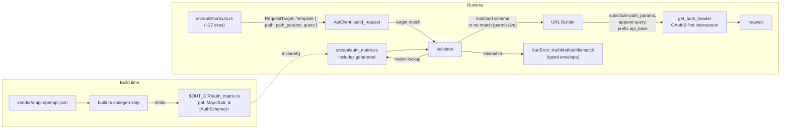
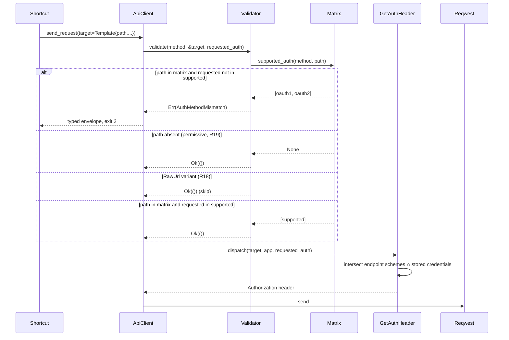
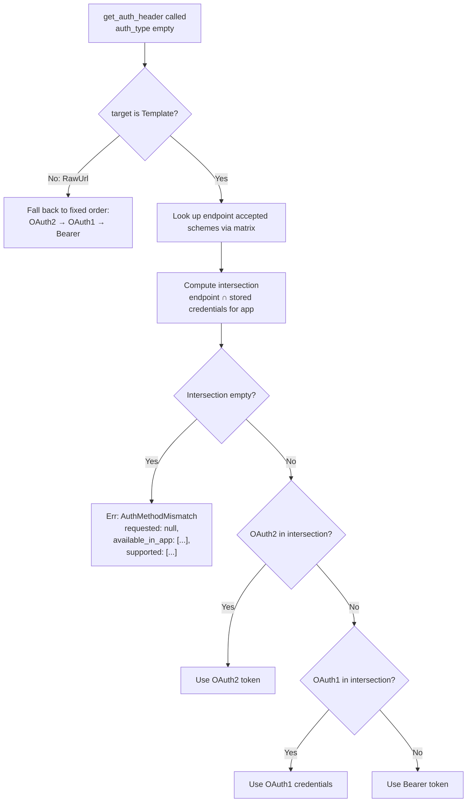

## Summary

Land client-side enforcement of which X API auth method each endpoint accepts, derived at compile time from X's vendored
OpenAPI spec. Refuse mismatched `--auth` invocations before the HTTP round-trip with a typed `auth-method-mismatch`
envelope agents can pattern-match. The change replaces `RequestOptions.endpoint: String` with a typed `target:
RequestTarget` enum, forcing a breaking-change release at v2.0.0 and shipping a `MIGRATING.md` for crates.io consumers.

---

## Problem Frame

During v1.3.0 release-preflight smoke testing, `xr media upload <file> --app bird-prod --auth app` against an app
holding only a bearer token burned a network round-trip and returned X's 403 with `reason: network-error` and the raw
upstream body in `message:`. For agents (the primary audience per the agent-native spec), this forces string-matching
upstream prose where a typed envelope should exist. Today the CLI accepts any `--auth <method>` plus endpoint
combination without consulting any catalog. The fix is to vendor X's OpenAPI spec (current upstream: 790 KB, 139 paths,
spec version 2.165), generate a `(method, path_template) → [AuthScheme]` lookup at build time, and validate at the start
of `ApiClient::send_request` before the request body is built.

Full requirements, key decisions, flows, and acceptance examples live in the origin document
(`docs/brainstorms/2026-06-04-001-auth-method-enforcement-requirements.md`). This plan implements them.

---

## Requirements Traceability

The plan implements all 26 origin requirements. Mapping:

| Origin                                                  | Implementation Unit                        |
| ------------------------------------------------------- | ------------------------------------------ |
| R1, R3 — vendor spec + README                           | U2                                         |
| R2 — spec is sole source                                | U3, U7 (no parallel table)                 |
| R4 — validator wired at three send paths                | U6                                         |
| R5, R6 — `Template.path` is the key, direct hash lookup | U3 (matrix), U6 (lookup)                   |
| R7, R8, R9 — endpoint-aware OAuth2-first intersection   | U7                                         |
| R10, R11, R12, R13 — error variant + envelope           | U6                                         |
| R14, R15, R16 — `build.rs` codegen                      | U3                                         |
| R17 — manual refresh script                             | U2                                         |
| R18, R19 — raw-mode + unknown-endpoint permissive       | U4 (RawUrl variant), U6 (matrix-miss path) |
| R20, R21, R22 — RequestTarget refactor                  | U4, U5                                     |
| R23 — v2.0.0 SemVer-major                               | U10, U11                                   |
| R24 — CI drift-check                                    | U9                                         |
| R25 — build-time coverage check                         | U8                                         |
| R26 — unblock_user resolution                           | U1                                         |

| Origin KTD                                        | Plan section                 |
| ------------------------------------------------- | ---------------------------- |
| KTD-1 — vendored spec as source                   | KTD-P1 + U2, U3              |
| KTD-2 — validation before HTTP                    | U6                           |
| KTD-3, KTD-9 — unknown permissive, coverage check | U6 + U8                      |
| KTD-4 — scope check deferred                      | Scope Boundaries (unchanged) |
| KTD-5 — typed envelope                            | U6                           |
| KTD-6 — endpoint-aware OAuth2-first               | U7                           |
| KTD-7 — vendor in git + CI drift-check            | U2 + U9                      |
| KTD-8 — RequestTarget enum                        | KTD-P2 + U4, U5              |

Acceptance examples AE1–AE7 are enumerated in per-unit test scenarios with `Covers AE<N>` prefixes.

---

## Key Technical Decisions

**KTD-P1. Codegen stack: `serde_json` + tiny derive struct + `phf_codegen`.** Build.rs parses
`vendor/x-api-openapi.json` (790 KB) via `serde_json` against a minimal `#[derive(Deserialize)]` slice (`Spec { paths:
BTreeMap<String, PathItem> }`, `PathItem { get|post|put|delete: Option<Operation> }`, `Operation { security:
Option<Vec<BTreeMap<String, Vec<String>>>> }`). Rejected `openapiv3`: heavy proc-macro derives expand the full 3.0
model, strictness fights X's spec quirks, and the crate is OpenAPI-3.0-only — X may bump to 3.1. The generated matrix
uses `phf_codegen` to emit a static `phf::Map<&'static str, &'static [AuthScheme]>` with a packed-string key
`"METHOD\0/path/template"`; `phf::phf_map!` does not accept tuple keys natively (rust-phf #183/#196). Cargo entries:
`serde = { version = "1", features = ["derive"] }` and `phf_codegen = "0.11"` under `[build-dependencies]`; `phf =
"0.11"` under `[dependencies]`.

**KTD-P2. `RequestTarget` shape carries query params alongside path params.** Brainstorm KTD-8 defined `Template { path:
String, params: HashMap<String, String> }`. Code review found `src/api/shortcuts.rs:143` `append_pagination`
post-processes the rendered URL by string-searching for `?` to splice in the cursor as a query parameter. Conflating
path-substitution and query-string parameters in one map would lose that distinction. The plan splits them:

```text
pub enum RequestTarget {
    Template {
        path: String,                            // spec template, e.g. "/2/users/{id}/likes"
        path_params: HashMap<String, String>,    // substituted into {name} segments
        query: Vec<(String, String)>,            // appended as ?key=value&...
    },
    RawUrl(String),                              // raw mode / xr <URL>
}
```

Directional grammar, not implementation specification — the implementer may pick `BTreeMap` or `IndexMap` if ordering
matters for tests.

**KTD-P3. AuthScheme carries OAuth2 scopes from v1.** Even though v1 defers scope checking (origin KTD-4), the matrix
stores the scope list from each operation's `security:` entry:

```text
pub enum AuthScheme {
    Bearer,
    OAuth1User,
    OAuth2User(&'static [&'static str]),  // empty slice = "no scopes required"
}
```

Bakes the shape now so v2 scope checking adds a check function rather than another `RequestOptions`-class break. Cost is
a `&'static [&'static str]` per OAuth2 entry, never read in v1.

**KTD-P4. Matrix is pruned to xurl-rs shortcut paths.** The codegen walks the spec's full 139 paths but emits only
entries for paths reachable from `src/api/shortcuts.rs`. Trade-off: smaller binary and faster builds versus raw-mode
users losing a "what auth methods does this path support?" affordance. Origin R19 covers this — unknown endpoints are
permissive — so the affordance was never available anyway. The exception list from U8 doubles as the prune allowlist.

**KTD-P5. R7 intersection lives in `get_auth_header`, not at shortcut sites.** Origin R7 says auto-detect intersects
"credentials the active app holds" with "schemes the endpoint accepts". Implementation lands in the existing
`get_auth_header` helper at `src/api/request.rs:529`, which already walks OAuth2 → OAuth1 → Bearer in fixed order. The
shortcut sites declare templates; the dispatch helper inspects `target` plus the endpoint's accepted scheme set
(threaded through `RequestOptions.target`) and intersects. Pattern: docs/solutions/best-practices/
centralize-oauth1-boilerplate-via-one-helper-2026-04-20.md.

**KTD-P6. CI drift-check is a separate workflow file on weekly cron + PR-touches-vendor.** New file
`.github/workflows/spec-drift.yml` (not a job in `ci.yml` — would couple drift to every PR; not in `brettdavies/.github`
— would repo-pollute a generic Rust template). Triggers: `schedule:` (weekly Monday 09:00 UTC), `workflow_dispatch:`,
and `pull_request:` with `paths:` filter on `vendor/x-api-openapi.json`. Job fetches `https://api.x.com/2/openapi.json`,
byte-compares against vendored, posts a job summary always, posts a PR comment on PR runs, and opens a GitHub issue on
the scheduled run when divergent.

**KTD-P7. Migration messaging: `MIGRATING.md` + `cliff.toml` BREAKING CHANGE parser entry.** `cliff.toml` currently has
no commit-parser rule for `^.*!:` scopes or `BREAKING CHANGE:` footers — the change would silently disappear from the
auto-generated changelog. The plan adds a parser entry routing breaking commits into a `[Breaking]` section. The durable
migration artifact is `MIGRATING.md` at the repo root, linked from CHANGELOG v2.0.0 and from `docs.rs/xurl-rs`. Pattern:
docs/solutions/best-practices/rust-library-ergonomics-api-design.md.

---

## High-Level Technical Design

### Component map



### Validation flow (origin F1, F2, F3, F4)



### Auto-detect intersection (origin R7, R8, R9)



### RequestTarget grammar

```text
RequestTarget ::= Template { path, path_params, query }
                | RawUrl(url)

path           ::= spec-exact-path-template
                   e.g. "/2/users/{id}/likes"
path_params    ::= HashMap<String, String>
                   keyed on spec parameter names (e.g. "id"), not local var names
query          ::= Vec<(String, String)>
                   ordered for stable URL construction across calls
url            ::= absolute URL string passed via xr <URL>
```

Plan-authoritative — see KTD-P2 for shape rationale. Implementer may pick `BTreeMap`/`IndexMap` for `path_params` if
ordering matters in tests.

---

## Implementation Units

Units carry stable plan-local U-IDs. Phased grouping reflects logical sequencing; phases are not commits.

### Phase A — Foundation

### U1. Verify unblock endpoint behavior (R26 resolution)

**Goal:** Empirically determine whether `DELETE /2/users/{source_user_id}/blocking/{target_user_id}` still works in the
current X API. The brainstorm R26 leaves three branches open (remove shortcut, raw-mode-only, exception list); the right
branch depends on whether the endpoint accepts requests today.

**Requirements:** R26.

**Dependencies:** none.

**Files:** `docs/notes/2026-06-04-unblock-endpoint-probe.md` (new, ephemeral — moved to commit message of subsequent
unit and deleted).

**Approach:** Run a one-off probe against the user's `bird-dev` app with OAuth1 credentials (the spec lists OAuth1 as
accepted for the documented `/2/users/{id}/blocking` GET). Construct the DELETE request manually via `xr <URL>` raw mode
and observe the response. Branch:

- HTTP 200/204 → endpoint works; pick R26 path (b) raw-mode-only via `RequestTarget::RawUrl`. The shortcut rewrites
  itself to construct the URL and bypass the matrix.
- HTTP 404 → endpoint gone; pick R26 path (a) remove the shortcut entirely. Migration note in `MIGRATING.md`.
- Other (401, 403, 429) → re-probe with OAuth2 / different app to disambiguate. If still ambiguous, default to (b)
  raw-mode-only and document the uncertainty.

The probe runs once and the outcome is captured in the commit message of U5 (shortcut rewrites). No code lands from U1
by itself.

**Execution note:** Runtime discovery, not deterministic. Probe in `ce-work`, not in `ce-plan`.

**Patterns to follow:** None — single-shot investigation.

**Test scenarios:** none — investigation unit, no behavioral surface to test.

**Verification:** U5 commits with the chosen R26 path explicitly named in the commit body, and `MIGRATING.md` carries
the rationale.

---

### U2. Vendor X's OpenAPI spec + sync script + provenance README

**Goal:** Land the vendored spec, the manual refresh script, and the `vendor/README.md` provenance record.

**Requirements:** R1, R3, R17, KTD-1, KTD-7.

**Dependencies:** none.

**Files:**

- `vendor/x-api-openapi.json` (new — fresh fetch from `https://api.x.com/2/openapi.json`)
- `vendor/README.md` (new — provenance, refresh date, upstream URL, command, current SHA)
- `scripts/refresh-x-openapi.sh` (new — the one-line curl recipe wrapped in error handling; name matches brainstorm
  R1/R17)

**Approach:** The vendored spec is the build's input contract. `scripts/refresh-x-openapi.sh` runs `curl -sS --fail -o
vendor/x-api-openapi.json "https://api.x.com/2/openapi.json"` and updates `vendor/README.md` with the new fetch date and
computed SHA256. The README records: upstream URL, refresh date, upstream `info.version` value parsed from the spec,
SHA256 of the file, refresh command (links to the script). Pattern:
docs/solutions/architecture-patterns/cross-repo-artifact-sync-commit-over-fetch-20260420.md and
docs/solutions/workflow-issues/verify-sync-script-scope-before-revendoring.md.

**Patterns to follow:**

- The sync-script glob *is* the coupling contract — explicit allowlist of files (just the one spec for now), no wildcard
  globs.
- `vendor/README.md` records upstream commit SHA equivalent (spec `info.version`) so drift is detectable by humans.
- `scripts/` lives at repo root; `.sh` scripts are POSIX-shell-portable per `pre-push` patterns.

**Test scenarios:**

- Happy path: running `scripts/refresh-x-openapi.sh` fetches the spec, writes it to `vendor/x-api-openapi.json`, and
  updates `vendor/README.md` with a new date and SHA.
- Error path: when `curl` fails (network down, 5xx), the script exits non-zero without partial-writing the spec.
- Idempotency: running the script twice in a row with no upstream change leaves `vendor/x-api-openapi.json`
  byte-identical.
- Coverage check (cross-cutting with U8): the vendored spec contains at least one known endpoint (e.g. `/2/media/upload`
  with `POST`).

**Verification:** `cargo build` succeeds with the vendored spec present and a non-empty `vendor/x-api-openapi.json`.
`vendor/README.md` renders with the four required fields populated.

---

### U3. Extend `build.rs` with auth matrix codegen

**Goal:** Add a second emit step to the existing `build.rs` that parses `vendor/x-api-openapi.json` and emits
`$OUT_DIR/auth_matrix.rs` containing a `phf::Map<&'static str, &'static [AuthScheme]>` keyed on `"METHOD\0/path"`. Wrap
consumption in `src/api/auth_matrix.rs`.

**Requirements:** R2, R14, R15, R16, KTD-1, KTD-9 (matrix surface). Also KTD-P1, KTD-P3, KTD-P4.

**Dependencies:** U2.

**Files:**

- `build.rs` (modify — extends the existing `generated_hosts.rs` emission with a second step for `auth_matrix.rs`)
- `Cargo.toml` (modify — `[build-dependencies]` adds `serde = { version = "1", features = ["derive"] }`, `phf_codegen =
  "0.11"`; `[dependencies]` adds `phf = "0.11"`. `serde_json = "1"` already present in build-deps)
- `src/api/auth_matrix.rs` (new — `include!()` wrapper, `AuthScheme` enum, `supported_auth(method, path)` accessor,
  shortcut-allowlist constant)
- `src/api/mod.rs` (modify — `pub mod auth_matrix;`)

**Approach:**

- Parse the spec via minimal serde derive: `Spec { paths: BTreeMap<String, PathItem> }`, `PathItem` with optional
  per-method `Operation`, `Operation { security: Option<Vec<BTreeMap<String, Vec<String>>>> }`. `#[serde(default)]` on
  optional fields; do not use `deny_unknown_fields` — X may add fields.
- Walk `paths`, for each `(method, path)` extract the security list. Filter the matrix to the shortcut allowlist (per
  KTD-P4). Emit `phf_codegen::Map::new()` builder calls into `$OUT_DIR/auth_matrix.rs` keyed on `format!("{}\0{}",
  method.to_uppercase(), path)`.
- The values are `&'static [AuthScheme]`. Generate `static SUPPORTED_METHOD_PATH_N: &[AuthScheme] = &[...]` per entry
  and reference by name in the map; phf cannot inline slice literals directly.
- The `AuthScheme` enum lives in `src/api/auth_matrix.rs` (hand-written) so the generated file imports it. Variants per
  KTD-P3: `Bearer | OAuth1User | OAuth2User(&'static [&'static str])`.
- `supported_auth(method: &str, path: &str) -> Option<&'static [AuthScheme]>` performs the packed-key lookup. The
  shortcut allowlist is `const SHORTCUT_TEMPLATES: &[(&str, &str)]` co-located in this file, consumed by U8's coverage
  check.
- `build.rs` emits `cargo::rerun-if-changed=vendor/x-api-openapi.json` (double-colon form per Rust 1.94.1 Cargo Book).
  Existing `cargo:rerun-if-changed=src/skill_install/skill.json` line stays.

**Execution note:** Generated code must compile under `RUSTFLAGS="-Dwarnings"` and pass cross-target Windows clippy per
`scripts/hooks/pre-push:29` and `:119`. Pattern: docs/solutions/best-practices/
rust-cfg-unix-deps-must-match-use-site-2026-04-20.md — no `cfg(unix)` gating, use `PathBuf::join`, not literal `/`.

**Technical design** (directional):

```text
build.rs:
  // existing: emit_skill_install_hosts(out_dir);
  emit_auth_matrix(out_dir);

fn emit_auth_matrix(out_dir: &Path) -> io::Result<()> {
    let spec: Spec = serde_json::from_str(&fs::read_to_string("vendor/x-api-openapi.json")?)?;
    let entries = collect_shortcut_entries(&spec);  // filter to allowlist
    let mut map = phf_codegen::Map::new();
    for (i, (method, path, schemes)) in entries.iter().enumerate() {
        writeln!(f, "static SUP_{}: &[AuthScheme] = &[{}];", i, render_schemes(schemes))?;
        map.entry(format!("{}\0{}", method, path), &format!("&SUP_{}", i));
    }
    writeln!(f, "pub static AUTH_MATRIX: phf::Map<&'static str, &'static [AuthScheme]> = {};",
             map.build())?;
}
```

**Patterns to follow:**

- The existing `generated_hosts.rs` emission pattern in `build.rs` (sorted by key, panics on malformed input,
  `cargo:rerun-if-changed` declaration).
- docs/solutions/design-patterns/decouple-test-fixtures-from-build-time-constants-via-red-team-meta-test.md — tests
  import the generated constants, never literal values.
- docs/solutions/best-practices/byte-equivalence-regression-tests-for-copied-design-artifacts-2026-04-14.md —
  deterministic- transform equality test for the generated matrix.

**Test scenarios:**

- Happy path: `build.rs` parses the vendored spec and emits `$OUT_DIR/auth_matrix.rs`. `cargo build` succeeds.
- Happy path: `supported_auth("POST", "/2/media/upload")` returns `Some(&[OAuth2User(["media.write"]), OAuth1User])` —
  the matrix-lookup foundation for U6's AE1 envelope assertion.
- Happy path: `supported_auth("DELETE", "/2/tweets/{id}")` returns `Some(&[OAuth2User([...]), OAuth1User])`.
- Edge: `supported_auth("GET", "/2/users/me")` (literal at depth where param siblings exist) returns the literal
  endpoint's security, not `/2/users/{id}` — confirms direct hash lookup, no precedence resolution. Covers KTD-P1's
  rejection of reverse-matching.
- Edge: `supported_auth("POST", "/2/never/heard/of")` returns `None`. Confirms R19 unknown-permissive path.
- Edge: `supported_auth("PATCH", "/2/tweets")` (method not declared on this path) returns `None`. Method+path is the
  composite key.
- Error: malformed `vendor/x-api-openapi.json` causes `build.rs` to fail loudly with a clear error message naming the
  parse failure location.
- Integration: codegen output is byte-deterministic — `cargo clean && cargo build` twice produces identical
  `auth_matrix.rs` bytes. Anchor-snapshot of `SHORTCUT_TEMPLATES` (the allowlist) in a unit test asserts the expected
  count and one known entry.
- Coverage stub for U8: `SHORTCUT_TEMPLATES` is exposed pub(crate) so the U8 test can iterate it.

**Verification:** `cargo build` produces `target/debug/deps/auth_matrix_generated-*.rs` (or `$OUT_DIR/auth_matrix.rs`),
and `supported_auth("POST", "/2/media/upload")` returns the documented two-scheme list.

---

### Phase B — Refactor `RequestOptions`

### U4. Introduce `RequestTarget` enum and rewrite URL builder

**Goal:** Replace `RequestOptions.endpoint: String` with `target: RequestTarget` (Template variant + RawUrl variant).
Rewrite `ApiClient::build_url` to substitute path params and append query, branching on the variant.

**Requirements:** R20, R22, KTD-8, KTD-P2.

**Dependencies:** none structurally on U2/U3 (this is the type change); landed together with U5 as one breaking commit.

**Files:**

- `src/api/request.rs` (modify — `RequestOptions` struct, `build_url`, `send_request`, `send_multipart_request`,
  `stream_request`, three `let url = self.build_url(&options.endpoint)` call sites at `:219, :320, :420`)
- `src/api/mod.rs` (modify — re-exports if any)
- `src/lib.rs` (no direct change, but `xurl::api::RequestOptions` consumers see the break)

**Approach:**

- Replace `pub endpoint: String` with `pub target: RequestTarget` on `RequestOptions`. Remove the old field; no
  compatibility alias. Update `Default` impl.
- `RequestTarget` defined in `src/api/request.rs` (or a sub-module if naming clarity calls for it). Variants and shape
  per KTD-P2.
- `CallOptions::to_request_options` stays the consumer surface; the call site in shortcuts (U5) constructs the
  `Template` variant directly.
- `build_url` becomes:

  ```text
  match &options.target {
      RequestTarget::Template { path, path_params, query } => {
          let rendered = substitute(path, path_params)?;  // {name} → URL-encoded value
          let mut url = format!("{}{}", self.base_url, rendered);
          if !query.is_empty() {
              url.push('?');
              url.push_str(&encode_query(query));
          }
          url
      }
      RequestTarget::RawUrl(s) => s.clone(),  // raw mode passes through
  }
  ```

- Substitution percent-encodes each value via `urlencoding` or the equivalent (existing dep — confirm in U4 research).
  Missing `{name}` in `path_params` is a programmer error → return `XurlError::Internal(...)` (or panic in build.rs test
  layer — pick at execution time).
- Remove `build_url`'s current `if endpoint.to_lowercase().starts_with("http") { return endpoint.to_string(); }`
  heuristic — the variant carries the distinction explicitly. The `build_url_public` wrapper (`:188`) is similarly
  updated.

**Execution note:** Land U4 + U5 in one commit. Splitting them would leave shortcuts uncompiled mid-tree.

**Technical design** (directional grammar — see HTD for full shape):

```text
struct RequestOptions {
    pub method: String,
    pub target: RequestTarget,   // was: endpoint: String
    pub headers: Vec<String>,
    pub data: String,
    pub auth_type: String,
    pub username: String,
    pub no_auth: bool,
    pub verbose: bool,
    pub trace: bool,
    pub pagination_token: String,  // kept for now; consumed at shortcut layer
}
```

`pagination_token` stays on `RequestOptions` because the shortcut layer reads it during `Template` construction; it does
not survive past `to_request_options`. Alternative considered: move pagination handling into a request-builder helper.
Out of scope for v2.0.0 — see "Future considerations".

**Patterns to follow:**

- docs/solutions/best-practices/rust-library-ergonomics-api-design.md — structured types over stringly-typed input.
- No `unwrap()` in production code per AGENTS.md quality bar.

**Test scenarios:**

- Happy path: `build_url` for `Template { path: "/2/tweets", ... empty params/query }` returns
  `"https://api.x.com/2/tweets"`.
- Happy path: `build_url` for `Template { path: "/2/users/{id}/likes", path_params: {id: "12345"}, query: [] }` returns
  `"https://api.x.com/2/users/12345/likes"`.
- Happy path: `build_url` for `Template { path: "/2/users/{id}/tweets", path_params: {id: "12345"}, query:
  [("max_results", "10"), ("pagination_token", "abc")] }` returns
  `"https://api.x.com/2/users/12345/tweets?max_results=10&pagination_token=abc"`.
- Happy path: `build_url` for `RawUrl("https://api.x.com/2/raw/x")` returns `"https://api.x.com/2/raw/x"` unchanged.
- Edge: percent-encoding — `path_params: {id: "ab cd"}` substitutes as `"ab%20cd"`. Confirm against existing
  `urlencoding` patterns in the codebase.
- Edge: query value with special chars — `query: [("q", "hello world")]` encodes correctly.
- Edge: empty query vec produces no `?` suffix.
- Error: `Template` with `{name}` segment but `name` absent from `path_params` returns a typed error (not panic in
  production).
- Integration: `xr <URL>` raw mode routes through `RequestTarget::RawUrl` and the URL is unchanged.

**Verification:** All existing integration tests (`tests/api_tests.rs`, `tests/cli_tests.rs`) pass after U5 lands.

---

### U5. Rewrite shortcuts to construct `Template` variants with spec param names

**Goal:** Rewrite ~27 sites in `src/api/shortcuts.rs` to construct `RequestTarget::Template { path, path_params, query
}` using the spec's exact param names (`{id}`, `{tweet_id}`, `{source_tweet_id}`), not xurl-rs's local variable names.
Resolve the R26 outcome from U1.

**Requirements:** R21, KTD-8.

**Dependencies:** U4 (struct change), U1 (R26 outcome).

**Files:**

- `src/api/shortcuts.rs` (modify — every `req.endpoint = ...` assignment; the `append_pagination` helper rewrites to
  push to `query`)
- `src/api/media.rs` (modify — 6 RequestOptions construction sites per repo research)
- `tests/api_tests.rs`, `tests/cli_tests.rs` (modify — any test constructing `RequestOptions` directly updates to the
  new shape)

**Approach:**

- Each shortcut site changes shape:

  ```text
  // Before:
  let mut req = opts.to_request_options();
  req.method = "POST".to_string();
  req.endpoint = format!("/2/users/{user_id}/likes");
  // append_pagination(&mut req.endpoint, &opts.pagination_token);

  // After:
  let mut req = opts.to_request_options();
  req.method = "POST".to_string();
  req.target = RequestTarget::Template {
      path: "/2/users/{id}/likes".to_string(),
      path_params: [("id".to_string(), user_id.to_string())].into(),
      query: build_query(opts),  // helper that includes pagination_token if non-empty
  };
  ```

- The `build_query(opts: &RequestOptions) -> Vec<(String, String)>` helper centralizes the pagination_token check and
  any other shared query-param logic. Returns empty vec when no query params apply.
- For static-string sites (e.g. `/2/tweets`): `path: "/2/tweets".to_string()`, `path_params: HashMap::new()`, `query:
  build_query(opts)`.
- The R26 outcome from U1 determines `unblock_user`'s rewrite:
- If U1 found 200/204: `target: RequestTarget::RawUrl(format!("{}/2/users/{}/blocking/{}", base, source, target))`.
  Bypasses the matrix per R18. Comment in source explains the X-spec gap.
- If U1 found 404: delete the `unblock_user` shortcut entirely, delete its tests, document in `MIGRATING.md`.

**Execution note:** Single commit with U4. The commit body names the R26 outcome and the chosen branch.

**Patterns to follow:**

- The existing shortcut shape — each function is small, signature-stable, returns `ApiResponse<T>`.
- Centralize the `build_query` helper near `append_pagination` (which gets deleted as part of this unit).
- Spec param names — table at `vendor/README.md` if useful, or inline comments per site.

**Test scenarios:**

- Happy path: every existing shortcut test passes against the new shape (regression coverage).
- Happy path: `create_post` constructs `Template { path: "/2/tweets", path_params: {}, query: [] }`.
- Happy path: `like_post` constructs `Template { path: "/2/users/{id}/likes", path_params: {id: user_id}, query: [] }`.
- Happy path: a paginated shortcut with non-empty `pagination_token` includes it in `query`, not in `path`.
- Edge: param name mismatch is caught at build time by U8's coverage check (the path string must appear in the matrix).
- Edge: the resolved R26 branch behaves correctly — raw-mode-only branch routes through `RawUrl`; remove branch deletes
  the symbol and exposes no Rust-level breakage in dependent code.
- Integration: end-to-end `xr like <post-id> --app bird-dev` (wiremock-backed) hits the expected URL and auth method.

**Verification:** `cargo test` passes; `cargo clippy --all-targets -- -D warnings` clean; the unblock_user branch
matches the U1 outcome.

---

### Phase C — Validator and auth dispatch

### U6. Wire the validator into `send_request`, multipart, streaming; add `AuthMethodMismatch` error variant

**Goal:** Call the matrix validator at the start of all three send paths, branching on `target` and the requested auth
method. Add `XurlError::AuthMethodMismatch` and the JSON envelope at R10.

**Requirements:** R4, R5, R6, R10, R11, R12, R13, R18, R19, KTD-2, KTD-5.

**Dependencies:** U3 (matrix exists), U4 (RequestTarget exists).

**Files:**

- `src/api/request.rs` (modify — call sites at start of `send_request`, `send_multipart_request`, `stream_request`)
- `src/error.rs` (modify — add `AuthMethodMismatch { endpoint, method, requested, supported }` variant; update `kind()`
  closed set; update Display impl)
- `src/output.rs` or wherever the envelope serialization lives (modify — JSON shape per R10, exit code 2)
- `tests/error_envelopes.rs` (new or extend existing — assertions on the new envelope shape)

**Approach:**

- Validator signature: `fn validate(target: &RequestTarget, method: &str, requested_auth: &str) -> Result<(),
  XurlError>`. Lives in `src/api/auth_matrix.rs` or a sibling module.
- For `RequestTarget::RawUrl`, skip immediately (R18).
- For `RequestTarget::Template { path, .. }`, call `supported_auth(method, path)`. If `None` → R19 permissive Ok(()). If
  `Some(supported)` and the requested auth is empty (auto-detect path), defer to `get_auth_header` (U7). If `Some` and
  the requested auth is set, check membership; on miss, return `AuthMethodMismatch { endpoint: path, method, requested,
  supported }`.
- `XurlError::AuthMethodMismatch` carries:

  ```text
  AuthMethodMismatch {
      endpoint: String,      // path template
      method: String,        // HTTP method
      requested: String,     // "app" | "oauth1" | "oauth2" — or None for empty intersection (U7)
      supported: Vec<String>, // ["oauth1", "oauth2"]
  }
  ```

  `kind()` returns `"auth-method-mismatch"`. Display formats as `"Bearer (app) auth is not accepted at POST
  /2/media/upload. Use --auth oauth1 or --auth oauth2."`. JSON serialization matches R10 exactly.
- Exit code 2 (R13). `EX_USAGE`-aligned. Map in the existing exit-code dispatch (where `EXIT_AUTH_REQUIRED` lives).
- Validator runs *before* URL rendering. The order at the top of each send path is:

1. Validate (`AuthMethodMismatch` short-circuit).
2. Resolve auth header (U7's `get_auth_header`).
3. Render URL (U4's `build_url`).
4. Build request body / multipart / stream.
5. Dispatch via reqwest.

**Patterns to follow:**

- docs/solutions/best-practices/oauth2-pkce-credential-handling-rust-cli.md — typed errors, not generic IO, for auth
  taxonomy.
- Existing `XurlError` variants and their closed-set `kind()` return.

**Test scenarios:**

- Happy path: validator returns `Ok(())` for a matched `(method, path, requested_auth)` triple. Covers AE2.
- Happy path: validator returns `Ok(())` for `RawUrl` regardless of auth. Covers AE5.
- Happy path: validator returns `Ok(())` for an unknown path (R19 permissive).
- Error: validator returns `AuthMethodMismatch` when bearer requested on a POST /2/media/upload. Covers AE1. Asserts
  exact envelope JSON shape per R10, exit code 2.
- Error: text-mode rendering of `AuthMethodMismatch` matches `Error: Bearer (app) auth is not accepted at POST
  /2/media/upload. Use --auth oauth1 or --auth oauth2.` Covers R12.
- Edge: `auth_type` empty triggers the U7 path; validator returns `Ok(())` itself, the dispatch happens downstream.
- Edge: validator runs identically for multipart (`send_multipart_request`) and streaming (`stream_request`) — same
  matrix lookup, same error variant.
- Integration: end-to-end `xr media upload x.jpg --app bird-prod --auth app` against a wiremock-backed bearer-only store
  → exit 2, no HTTP request observed by the mock. Covers AE1 end-to-end.
- Integration: end-to-end raw mode `xr /2/media/upload --auth app` produces a request to the mock and surfaces the
  mock's 403. Covers AE5.

**Verification:** `cargo test`, integration tests, and a smoke run against a real `bird-dev` confirm the envelope shape
and exit code.

---

### U7. Endpoint-aware OAuth2-first auto-detect intersection

**Goal:** Modify `get_auth_header` (`src/api/request.rs:529`) to intersect endpoint-accepted schemes with stored
credentials and pick OAuth2 → OAuth1 → Bearer. When the intersection is empty, return `AuthMethodMismatch` with the
empty-set envelope shape from R8.

**Requirements:** R7, R8, R9, KTD-6, KTD-P5.

**Dependencies:** U3 (matrix), U4 (RequestTarget), U6 (error variant).

**Files:**

- `src/api/request.rs` (modify — `get_auth_header` signature and body)
- `src/api/request.rs` (modify — call sites at lines 256 / multipart equivalent / stream equivalent to forward
  `&target`)

**Approach:**

- Signature change: `get_auth_header(&self, options: &RequestOptions) -> Result<HeaderValue, XurlError>` already takes
  `options`; the existing code reads `options.auth_type` and `options.username`. Extend the auto-detect path
  (`options.auth_type.is_empty()`) to:

1. Resolve `endpoint_supported: Option<&[AuthScheme]>` via `supported_auth(method, target_path)`. For `RawUrl`, set to
   `None` and fall back to today's fixed order.
2. Probe `available_in_app: Vec<AuthMethod>` — query the token store for OAuth2, OAuth1, Bearer presence on the active
   app.
3. If `endpoint_supported` is `None` (RawUrl or unknown), apply the existing fixed order.
4. Else intersect `endpoint_supported` ∩ `available_in_app` (mapping `AuthScheme` variants to AuthMethod names).
5. If intersection empty → return `AuthMethodMismatch { requested: None, available_in_app, supported: ...}`.
6. Else pick first match in OAuth2 → OAuth1 → Bearer order; construct the Authorization header for that scheme.

- The `AuthMethodMismatch.requested: None` shape (R8) requires JSON null vs the populated case from U6. The error
  variant accommodates both via `Option<String>` for `requested` plus the additional `available_in_app: Vec<String>`
  field.
- Old behavior (walk OAuth2 → OAuth1 → Bearer regardless of endpoint acceptance) is removed (R9). No compat flag.

**Patterns to follow:**

- docs/solutions/best-practices/centralize-oauth1-boilerplate-via-one-helper-2026-04-20.md — credentials never leak past
  this helper; the new intersection logic lives here, not at shortcut sites.

**Test scenarios:**

- Happy path: app has only OAuth1, endpoint accepts OAuth1+OAuth2 → OAuth1 selected (covers AE3).
- Happy path: app has both OAuth1+OAuth2, endpoint accepts both → OAuth2 selected per preference order (covers AE6).
- Happy path: app has only Bearer, endpoint accepts Bearer (read endpoint) → Bearer selected.
- Edge: app has all three, endpoint accepts only Bearer → Bearer selected (Bearer-only endpoints don't attempt OAuth2;
  covers R9's semantic change).
- Edge: app has both OAuth1+OAuth2, endpoint accepts only OAuth1 (hypothetical, but possible for some legacy paths) →
  OAuth1 selected.
- Error: app has only Bearer, endpoint accepts only OAuth1+OAuth2 (e.g. `/2/media/upload`) → `AuthMethodMismatch {
  requested: null, available_in_app: ["app"], supported: ["oauth1", "oauth2"] }` (covers AE4).
- Edge: `RawUrl` falls back to today's fixed order (no matrix lookup); existing tests for this path continue passing.
- Integration: end-to-end auto-detect on `bird-dev` (multi-method app) hits OAuth2 when both stored.

**Verification:** `cargo test`; live smoke against `bird-dev` resolves to OAuth2 when expected; envelope JSON for empty
intersection matches the R8 shape exactly.

---

### Phase D — Hardening

### U8. Build-time coverage check: every shortcut template must resolve in the matrix

**Goal:** Add a test (`tests/auth_matrix_coverage.rs`) that iterates `SHORTCUT_TEMPLATES` (the const from U3) and
asserts each `(method, path)` resolves to a non-empty entry in the matrix. Fail the build (test run) loudly when a
shortcut targets a path the spec doesn't document.

**Requirements:** R25, R26 (via exception-list mechanism if U1 chose R26 path (c); otherwise just R25), KTD-9.

**Dependencies:** U3 (matrix), U5 (shortcut rewrites finalized).

**Files:**

- `tests/auth_matrix_coverage.rs` (new — integration test that imports `xurl::api::auth_matrix::*`)
- `src/api/auth_matrix.rs` (modify — expose `SHORTCUT_TEMPLATES` pub(crate); optionally add an exception list if R26
  resolution requires it)

**Approach:**

- The test iterates `SHORTCUT_TEMPLATES` and calls `supported_auth(method, path)` on each. Any `None` result fails with
  a message naming the shortcut name (or call-site path) and the missing template.
- If U1 / U5 chose R26 path (c) (documented exception list), the test reads `src/api/auth_matrix_exceptions.toml` (or a
  `pub const EXCEPTIONS: &[(&str, &str)]`) and accepts those misses with a documented rationale. Otherwise the test
  treats every miss as failure.
- Pattern: docs/solutions/best-practices/byte-equivalence-regression-tests-for-copied-design-artifacts-2026-04-14.md —
  anchor-snapshot test (locked count of templates), structural-snapshot of generated matrix shape.

**Patterns to follow:**

- docs/solutions/design-patterns/decouple-test-fixtures-from-build-time-constants-via-red-team-meta-test.md — tests
  import generated constants, not literal copies.
- Integration test layer (`tests/*.rs`), not a unit test inside `src/`.

**Test scenarios:**

- Happy path: `tests/auth_matrix_coverage.rs` passes when every shortcut path exists in the spec.
- Failure mode (intentional regression test): a unit test that constructs a fake `SHORTCUT_TEMPLATES` with a path absent
  from the matrix asserts the coverage check fails with a clear message. Covers AE7.
- Edge: the exception list (if used) is respected; an entry in `EXCEPTIONS` does not cause the test to fail.
- Edge: an entry in `EXCEPTIONS` that *also* exists in the matrix triggers a warning or test failure (prevents stale
  exceptions from accumulating).
- Integration: the test runs as part of `cargo test` in CI and blocks merge on failure.

**Verification:** `cargo test --test auth_matrix_coverage` exits 0 on a clean tree.

---

### U9. CI drift-check workflow

**Goal:** New workflow `.github/workflows/spec-drift.yml` that fetches `https://api.x.com/2/openapi.json` and compares
against `vendor/x-api-openapi.json`. Posts a job summary always, a PR comment on PR triggers, and opens an issue on the
scheduled run when divergent. Non-blocking on the weekly run; informational on PRs.

**Requirements:** R24, KTD-7, KTD-P6.

**Dependencies:** U2 (vendored spec exists).

**Files:**

- `.github/workflows/spec-drift.yml` (new)

**Approach:**

- Triggers: `schedule:` (cron `0 9 * * 1` — Monday 09:00 UTC), `workflow_dispatch:`, `pull_request:` with `paths:
  ['vendor/x-api-openapi.json', 'build.rs', 'src/api/auth_matrix.rs']`.
- Job steps:

1. `actions/checkout@<sha>` (pinned per supply-chain rule).
2. Fetch upstream: `curl -sS --fail -o /tmp/upstream-openapi.json https://api.x.com/2/openapi.json`.
3. Byte-compare: `cmp -s vendor/x-api-openapi.json /tmp/upstream-openapi.json`.
4. If identical: write green job summary, exit 0.
5. If divergent:

- Compute diff stats (path count delta, version delta).
- Write job summary with diff stats and a suggested refresh command.
- On `pull_request:` event: post PR comment via `gh pr comment $PR --body-file <(...)`.
- On `schedule:` event: check for an existing open issue with label `spec-drift`; create one if absent, otherwise update
  its body with the new diff stats. Use `gh issue create/edit`.
- Issue body includes the upstream `info.version` value, the local `info.version`, the path-count delta, and the refresh
  command.
- Hosts: `ubuntu-latest`. `permissions: contents: read, issues: write, pull-requests: write` (minimum scoped).
- The job is non-blocking — does not fail the workflow even when divergent. Drift is informational.

**Patterns to follow:**

- Thin caller pattern: this workflow is not a `uses:` of a reusable from `brettdavies/.github` — it's a one-off,
  repo-specific. Pinning per supply-chain rule (SHA-pin GitHub Actions).
- docs/solutions/architecture-patterns/cross-repo-artifact-sync-commit-over-fetch-20260420.md — commit + CI check
  pattern.

**Test scenarios:**

- Happy path (manual `workflow_dispatch` test): trigger the workflow, observe a green job summary when no drift.
- Failure mode (manual test): introduce a one-byte change in `vendor/x-api-openapi.json`, trigger the workflow, observe
  the job summary lists divergence and (if PR) the PR comment posts.
- Edge: existing open `spec-drift` issue gets updated, not duplicated.
- Edge: closed `spec-drift` issue is reopened or a new one is created (pick at execution; default: create new).
- Edge: weekly cron run on a clean tree posts a green job summary and does not open an issue.

**Verification:** Manually trigger via `workflow_dispatch` and observe the job summary. Validate the drift case by
artificially editing the vendored file in a test branch.

---

### Phase E — Release prep

### U10. `cliff.toml` BREAKING CHANGE parser + `MIGRATING.md`

**Goal:** Update `cliff.toml` to route conventional-commit `feat!:` / `fix!:` and `BREAKING CHANGE:` footers into a
dedicated `[Breaking]` changelog section. Write `MIGRATING.md` at the repo root with the v2.0.0 migration snippet for
crates.io consumers.

**Requirements:** R23.

**Dependencies:** U4 (RequestTarget exists; migration snippet references it).

**Files:**

- `cliff.toml` (modify — add commit-parser entry for breaking-change scopes/footers)
- `MIGRATING.md` (new — repo root)
- `CHANGELOG.md` (auto-regenerated post-commit via existing tooling; not directly edited)

**Approach:**

- Add a `[git.commit_parsers]` entry to `cliff.toml` matching either:
- Commits whose type ends in `!` (e.g. `feat!:`, `fix!:`), or
- Commits with a `BREAKING CHANGE:` body footer. Route to a new section `[Breaking]` ordered first in the changelog
  body.
- `MIGRATING.md` covers:
- The `RequestOptions::endpoint -> RequestOptions::target` rename and shape change.
- The `RequestTarget` enum definition (per KTD-P2).
- Before/after code samples for the most common consumer shapes (constructing a Template, constructing a RawUrl).
- The `AuthMethodMismatch` error variant addition and what it means for callers matching on `XurlError`.
- The auto-detect preference shift (still OAuth2-first, but now intersected with endpoint acceptance — affects edge
  cases where the app stores credentials the endpoint doesn't accept).
- Pointer to the brainstorm + this plan for deeper rationale.
- `MIGRATING.md` link from `CHANGELOG.md` v2.0.0 entry (once `git cliff` generates it post-commit) and from `Cargo.toml`
  `[package.metadata]` if docs.rs supports surfacing it.

**Patterns to follow:**

- docs/solutions/best-practices/rust-library-ergonomics-api-design.md — durable migration artifact alongside CHANGELOG.

**Test scenarios:**

- Happy path: `git cliff` against a test commit with `feat!:` prefix lists it under `[Breaking]` in the generated
  CHANGELOG. Manual validation via `scripts/generate-changelog.sh`.
- Happy path: `MIGRATING.md` renders cleanly in markdown preview; links resolve.
- Edge: a commit with type `fix(deps)!:` (combination scope) still routes to `[Breaking]`.
- Edge: a commit without `!` but with a `BREAKING CHANGE:` body footer routes to `[Breaking]`.

**Verification:** Manual `scripts/generate-changelog.sh` dry-run against a synthetic test commit produces the expected
`[Breaking]` section.

---

### U11. v2.0.0 release cut

**Goal:** Bump `Cargo.toml` `version = "2.0.0"`. Validate the auto-generated CHANGELOG contains the `[Breaking]` section
pointing at U4/U5. Cut `release/v2.0.0-auth-method-enforcement` per the standard release flow. PR to main.

**Requirements:** R23 release execution, plus reuse of the standard release pipeline (origin doc memory: pipeline
validated end-to-end on 2026-04-16).

**Dependencies:** U1–U10 merged to dev.

**Files:**

- `Cargo.toml` (modify — `version = "2.0.0"`)
- `Cargo.lock` (auto-updated by `cargo build`)
- `CHANGELOG.md` (auto-regenerated via `scripts/generate-changelog.sh`)

**Approach:**

- Standard release flow per memory:
- Cherry-pick (not merge) squash commits from dev onto `release/v2.0.0-auth-method-enforcement` (origin
  docs/solutions/workflow-issues/release-branch-cherry-pick-vs-merge-squash-orphans-2026-04-15.md).
- PR to main; main only accepts via PR.
- Validate CHANGELOG locally before opening PR: `scripts/generate-changelog.sh` produces a `[Breaking]` section with
  U4/U5's commits.
- Confirm `homebrew-tap` dispatch fires on the release tag (rust-release.yml reusable workflow).
- After release: `finalize-release.yml` flips `make_latest: true` once bottles are built.
- Migration coverage check: the `MIGRATING.md` URL is correctly linked from the release notes (auto-generated GH release
  body) by virtue of being in the repo root.

**Patterns to follow:**

- docs/solutions/architecture-patterns/release-pipeline-reusable-workflows-20260320.md.
- docs/solutions/workflow-issues/release-branch-cherry-pick-vs-merge-squash-orphans-2026-04-15.md.

**Test scenarios:**

- Pre-merge: `cargo test --release` clean.
- Pre-merge: `scripts/hooks/pre-push` clean (clippy, rustfmt, cross-target Windows clippy, audit).
- Post-merge: GitHub release page shows v2.0.0 with `MIGRATING.md` linked; homebrew bottle CI succeeds; finalize flips
  `make_latest: true`.
- Smoke: `cargo install xurl-rs` on a fresh machine installs v2.0.0; `xr --version` reports `2.0.0`.

**Verification:** Release pipeline runs end-to-end green; `xr --version` reports 2.0.0; `MIGRATING.md` is linkable from
docs.rs/xurl-rs.

---

## Scope Boundaries

### Deferred for later (origin, unchanged)

- OAuth2 scope checking. The v2 follow-up that makes the empty-intersection envelope a typed `auth-scope-mismatch`
  rather than `network-error`.
- A `--strict` flag for raw mode opting into matrix validation even on `xr <URL>` calls.
- A tier-aware variant of the validator reflecting X's access-tier gating (Enterprise-only endpoints).

### Outside this product's identity (origin, unchanged)

- Automatic OAuth2 scope re-acquisition when a scope mismatch is detected.
- Automatic fallback to a different auth method after a 403 from X.

### Deferred to Follow-Up Work (plan-local)

- A `request_builder` helper that swallows the `pagination_token` plumbing into a single chainable construction site.
  Out of scope for v2.0.0 — narrow the public-API break to `RequestOptions` shape only.
- Narrowing `src/lib.rs`'s "re-export every module unrestricted" surface into a curated public facade. Real cleanup, but
  a v2.0.0-class break in its own right and orthogonal to auth-method enforcement.
- Updating the `docs/solutions/` corpus with the build.rs + OUT_DIR pattern and the SemVer-major release pattern after
  v2.0.0 ships. These are valuable institutional learnings the absence of which is the $100-rule signal.
- Capturing the test-isolation-via-explicit-paths pattern (currently in MEMORY only) as a `docs/solutions/` entry.

---

## System-Wide Impact

- **Public library API break.** `xurl::api::RequestOptions::endpoint: String` → `target: RequestTarget`. Every crates.io
  consumer that constructs `RequestOptions` directly will see a compile error. Migration is mechanical via
  `MIGRATING.md`. `xurl-rs` is published on crates.io (`documentation = "https://docs.rs/xurl-rs"`), so this is a real
  breaking surface for known and unknown library consumers.
- **CLI behavior change for bearer-on-write-endpoint users.** Pre-v2: returned X's 403 with `reason: network-error`.
  Post-v2: returns local `reason: auth-method-mismatch` with exit code 2. Agents string-matching the prior network error
  must update to the typed envelope.
- **CLI behavior change for auto-detect with mixed credentials.** Pre-v2: walked OAuth2 → OAuth1 → Bearer regardless of
  endpoint acceptance. Post-v2: intersected first. A token configured for an app but rejected by the endpoint is no
  longer attempted. Users relying on the prior order to "fall through" to OAuth1 on Bearer-only endpoints will see the
  new intersection-empty envelope instead.
- **Test scope.** `tests/api_tests.rs` (70 KB) and `tests/cli_tests.rs` (99 KB) both construct `RequestOptions` and
  consume `xurl::api::*`. Significant test-surface diff; the diff is mechanical but large.
- **Build time.** `build.rs` cold-build time increases by the spec-parse + phf_codegen step. Expected: under 1 second
  added for `serde_json` + 30-line derive + `phf_codegen` on 150–300 entries. Validate during U3.
- **Binary size.** Adding `phf` runtime dep + ~200 `AuthScheme` entries + scope `&'static [&'static str]` arrays.
  Expected: under 50 KB to release binary. Validate.

---

## Risks and Dependencies

### Risks

- **R-1. R26 outcome may force a deeper rewrite if X removed the endpoint entirely.** If U1 finds 404, removing
  `unblock_user` is breaking on its own. Mitigation: document in `MIGRATING.md` next to the `RequestOptions` rewrite —
  one breaking release covers both.
- **R-2. `cliff.toml` BREAKING CHANGE parser may behave unexpectedly on prior commits.** The parser entry is global, not
  v2.0.0-scoped. If past commits accidentally used `!` syntax (review git log), they'd be retroactively re-classified.
  Mitigation: U10 runs `git log --grep '!:'` on dev to confirm no false positives in recent history before adding the
  parser entry.
- **R-3. phf_codegen's `Map::build()` output isn't `include!()`-safe in all configurations.** Documented use case, but
  validate early in U3 with a smoke test. Mitigation: fall back to `phf::phf_map!` with packed-string keys if
  `phf_codegen` output trips on the include path.
- **R-4. Spec drift between U2 (fetched today) and U11 (cut release).** X updates the spec; the matrix becomes stale
  during the implementation window. Mitigation: U2's sync script + a final pre-release refresh + U9's drift-check.
  Release notes acknowledge the matrix snapshot date.
- **R-5. CI drift-check might flap on transient upstream changes.** Spec changes frequently; weekly issues become noise.
  Mitigation: U9 deduplicates by reopening the same issue rather than creating new ones; team can mute notifications on
  the issue if needed.
- **R-6. First SemVer-major on this release pipeline.** xurl-rs has only done 0.x/1.x. The pipeline is version-agnostic
  but the cliff.toml entry, MIGRATING.md routing, and homebrew bottle workflow on a major bump are first-time.
  Mitigation: validate `scripts/generate-changelog.sh` produces the expected `[Breaking]` section in U10 before opening
  the PR to main. Watch finalize-release.yml's homebrew dispatch carefully on tag push.

### Dependencies

- X publishes `https://api.x.com/2/openapi.json` reliably (origin assumption, unchanged).
- The vendored spec is refreshed before each release cycle (U2's sync script + U9's drift-check make this visible).
- `phf 0.11` and `phf_codegen 0.11` are MSRV-compatible with Rust 1.94.1 (research confirmed).
- `serde_json 1` is already in build-deps (existing).

---

## Alternatives Considered

- **Reverse-matching a rendered path against parameterized templates instead of threading the template through.** Avoids
  the `RequestOptions` change but requires a router with literal-beats-parameterized precedence. 19 real collisions in
  the current spec (including `/2/media/upload` vs `/2/media/{media_key}`, the bug-triggering path). Each precedence bug
  is a silent false negative on the very endpoint the feature is built for. Rejected.
- **Keep `RequestOptions.endpoint: String` and add `RequestOptions.path_template: Option<String>` alongside.** Less
  breaking (additive field) — could ship as v1.4.0. Cost: shortcut authors maintain two coupled strings (rendered and
  template) that can silently drift. The maintenance cost recurs at every new shortcut. Rejected in favor of the typed
  enum that collapses to one source of truth.
- **Use `openapiv3` for spec parsing.** Provides typed access to the spec; matches the OpenAPI model exactly. Cost:
  heavy proc-macro derives expand the full 3.0 model at build time, the crate is 3.0-only-locked (X may bump to 3.1),
  and it's strict in ways X's spec quirks may trip. Rejected in favor of a tiny `#[derive(Deserialize)]` slice via
  `serde_json` that reads only the fields the matrix needs.
- **Use `once_cell::sync::Lazy<HashMap<...>>` for the static matrix instead of `phf`.** Simpler; familiar. Cost:
  allocates on first lookup, adds runtime init. Rejected — `LazyLock` (std, stable since 1.80) makes `once_cell`
  obsolete on 1.94.1 anyway, and `phf` is zero-init.
- **Include all 139 spec paths in the matrix, not just the pruned shortcut-targeted subset.** Gives raw-mode users
  visibility into which auth methods each endpoint supports. Cost: 5× binary growth for the matrix; R19's permissive
  default makes the affordance moot at runtime (raw mode skips validation anyway). Rejected.
- **Auto-fetch the spec at build time instead of vendoring.** Always-fresh. Cost: Homebrew bottle CI can't reach
  api.x.com on every build; reproducibility breaks; rate-limit risk. Rejected per KTD-7.

---

## Documentation Plan

- `MIGRATING.md` at repo root (U10). Durable artifact crates.io consumers find via docs.rs.
- `CHANGELOG.md` (auto-generated, U10/U11). `[Breaking]` section names the `RequestOptions::endpoint -> target` rewrite
  and the AuthMethodMismatch envelope addition.
- `vendor/README.md` (U2). Provenance record for the vendored spec.
- Brainstorm origin doc remains as the deeper rationale source. No update to the brainstorm needed — this plan
  implements it.
- `docs/solutions/` updates deferred to post-release (see Scope Boundaries).

---

## Open Questions

**Resolved during planning:**

- R26 (`unblock_user` resolution) → U1's runtime probe picks remove/raw-mode-only/exception-list.
- build.rs parsing approach → `serde_json` + tiny derive struct (KTD-P1).
- Matrix prune scope → pruned to shortcut allowlist (KTD-P4).
- AuthScheme enum representation → carries OAuth2 scopes from v1 (KTD-P3).
- Static-map representation → `phf_codegen` from build.rs with packed-string key (KTD-P1).
- CI drift-check shape → separate workflow file, weekly cron + PR-touches-vendor + workflow_dispatch, opens issue on
  scheduled divergence (KTD-P6).
- Migration messaging → `MIGRATING.md` at repo root + cliff.toml `BREAKING CHANGE` parser entry (KTD-P7).
- `Template` field shape → three fields (path, path_params, query) not two (KTD-P2). The brainstorm's two-field shape
  would have lost the existing query-string handling at `append_pagination`.

**Deferred to implementation:**

- Whether `path_params` uses `HashMap`, `BTreeMap`, or `IndexMap`. Pick based on test-stability ergonomics (`BTreeMap`
  if test assertions need stable ordering).
- The exact `phf` runtime dep version (`0.11` recommended; `0.13` is the current line with OR-pattern support that may
  be useful elsewhere). Confirm during U3 against the existing `Cargo.lock` ecosystem.
- The exact wording of the `MIGRATING.md` migration snippet — make it concrete with real before/after Rust code samples
  using current repository patterns.
- The Display impl format for the `AuthMethodMismatch.requested: None` empty-intersection case (R8). The
  populated-requested case is R10. The empty-intersection text-mode rendering is not yet specified in the brainstorm.

---

## Sources and Research

- `docs/brainstorms/2026-06-04-001-auth-method-enforcement-requirements.md` — origin doc.
- `https://api.x.com/2/openapi.json` — live upstream OpenAPI spec (790 KB, 139 paths, version 2.165 as of 2026-06-04).
- `docs/solutions/architecture-patterns/release-pipeline-reusable-workflows-20260320.md` — pipeline pattern xurl-rs
  validated on 2026-04-16.
- `docs/solutions/workflow-issues/release-branch-cherry-pick-vs-merge-squash-orphans-2026-04-15.md` — cherry-pick
  discipline for the release branch.
- `docs/solutions/workflow-issues/verify-sync-script-scope-before-revendoring.md` — explains why twarch's vendored copy
  drifts (sync-script glob is the coupling contract).
- `docs/solutions/architecture-patterns/cross-repo-artifact-sync-commit-over-fetch-20260420.md` — vendor + CI check
  pattern.
- `docs/solutions/design-patterns/decouple-test-fixtures-from-build-time-constants-via-red-team-meta-test.md` —
  generated-constant import discipline for U3 and U8.
- `docs/solutions/best-practices/rust-cfg-unix-deps-must-match-use-site-2026-04-20.md` — cross-platform discipline for
  `build.rs`.
- `docs/solutions/best-practices/centralize-oauth1-boilerplate-via-one-helper-2026-04-20.md` — R7 intersection lands in
  `get_auth_header`, not at shortcut sites.
- `docs/solutions/best-practices/oauth2-pkce-credential-handling-rust-cli.md` — typed errors for auth taxonomy.
- `docs/solutions/best-practices/rust-library-ergonomics-api-design.md` — `MIGRATING.md` pattern for breaking releases.
- `docs/solutions/best-practices/byte-equivalence-regression-tests-for-copied-design-artifacts-2026-04-14.md` — U8
  coverage check shape.
- Cargo Book — Build Scripts; rust-phf README; phf_codegen docs.rs.
- xurl-rs PR #51 and PR #52 — auth-chain prior art the new endpoint-aware auto-detect must honor.
