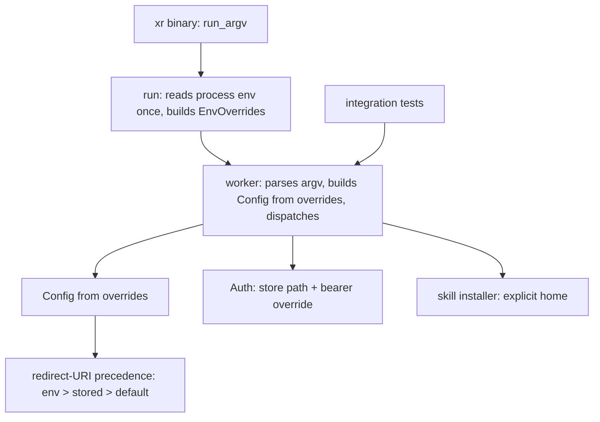

# Injected Environment Overrides for CLI Runs - Plan

## Goal Capsule

- **Objective:** A red test run means a defect and a green one means coverage, for a contributor on any machine and for
  CI, without either depending on what else the test process happened to be doing. A program embedding the library
  drives a run without the host process's environment deciding the outcome.
- **Means:** Resolve process-environment reads at one edge and pass the resolved values into the run (KTD1).
- **Authority:** Requirements win on behavior. Key Technical Decisions win on mechanism inside those requirements. Units
  override neither. The diagram illustrates; prose governs.
- **Execution profile:** Behavior-preserving refactor. The shipped binary's observable behavior does not change at any
  point in the sequence.
- **Stop conditions:** Stop and ask if a unit cannot preserve the documented precedence for a variable, or if removing a
  test's process mutation would drop the only proof that a variable still reaches the code it configures.
- **Tail ownership:** U6 owns the cleanup: annotations come out and the guard goes in together, so the suite never sits
  in a state where nothing enforces isolation.

---

## Product Contract

### Summary

Give the CLI its environment as data. One edge reads the process environment and builds a values struct; the entrypoint
family passes that struct down to config construction, auth, and the skill installer. Tests supply the struct directly,
or pass the CLI flag that already exists for the same value, and stop mutating the process. The `#[serial_test::serial]`
/ `#[parallel]` annotations added across four test files come out once no mutation remains, replaced by a guard that
fails the build if mutation returns.

### Problem Frame

Integration tests configure the CLI by writing to the process environment: 94 mutation sites across four files, wrapped
in `unsafe` because `std::env::set_var` racing a concurrent read is undefined behavior in edition 2024. The tests run in
parallel inside one binary, and `run_at` executes the CLI in-process, so a write in one test reaches every other test's
run.

That produced a real CI failure on 2026-08-31: a test setting `XURL_DRY_RUN=1` reached a concurrent test whose `xr auth
apps add --redirect-uri ...` took the dry-run branch, returned 0, and persisted nothing, so that test's own follow-up
read reported no stored value. It reproduced twice on a CI runner and intermittently on developer machines against a
different victim test.

The immediate remedy annotated all 201 non-mutating tests `#[serial_test::parallel]` so they cannot overlap a
`#[serial]` mutator. That constrains the scheduler; it does not remove the shared mutable state. It also has a silent
failure mode: a new test written without the attribute reopens the hole, and the symptom is an intermittent failure that
costs about an hour to trace back to its cause.

### Requirements

**Environment resolution**

- R1. The CLI resolves each process-environment read at one edge and passes the resolved values into the run.
- R2. A caller supplies those values explicitly, through the public entrypoint, without touching the process
  environment.
- R3. The shipped binary's observable behavior is unchanged. Each documented variable keeps its current effect, and the
  redirect URI keeps its env-over-stored-over-default precedence.
- R4. The resolved values carry whether a value came from the environment, not only what the value was, because the
  redirect-URI precedence branches on that distinction.

**Test isolation**

- R5. The four integration test files set no process-environment variable, except the edge proofs R6 requires, each
  named in an allowlist with its reason.
- R6. A test whose subject is a variable's own wiring keeps proving that wiring reaches the code it configures, rather
  than asserting only against the resolver.
- R7. The `#[serial_test::serial]` and `#[serial_test::parallel]` annotations are removed from a test file once that
  file holds no mutation.
- R8. A repository guard fails when a new process-environment mutation appears in the integration tests.

**Library surface**

- R9. The injected entrypoint joins the existing documented entrypoint family and satisfies the crate's `missing_docs`
  lint.

### Key Decisions

- **Narrow scope over full environment injection** (session-settled: user-directed — chosen over threading every
  environment read, including the argument parser's and the auth layer's, through an injected environment: the parser's
  `env =` attributes are what make `--help` advertise each variable, and rewriting them buys uniformity the tests do not
  need). Governs R1, R3.
- **Injection over permanent annotations** (session-settled: user-approved — chosen over keeping the serial/parallel
  pairing as the durable guard: the pairing constrains the scheduler while the shared mutable state, and its undefined
  behavior, remain). Governs R5, R7.

### Scope Boundaries

**In scope**

- The environment reads that feed `Config` construction, the entrypoint family in `src/cli/`, the bearer-token read in
  `src/auth/`, and the home-directory read in `src/skill_install/`.
- The four integration test files that mutate: `tests/cli_tests.rs`, `tests/api_tests.rs`, `tests/auth_tests.rs`,
  `tests/config_tests.rs`.

Credential values reach the CLI through `Config`, which already carries `client_id` and `client_secret` as public
fields. They therefore travel on the same injected struct at no extra cost, and the 24 credential mutation sites in
`tests/api_tests.rs` and `tests/config_tests.rs` close with the rest. This widens the confirmed scope by including
credential *values*; it does not touch the auth layer's own read paths, which the Key Decision above holds out.

**Deferred to Follow-Up Work**

- `src/output.rs` mutates `NO_COLOR` in three unit tests inside the library test binary, and `OutputConfig::new` reads
  it. Those tests carry a `SAFETY` comment asserting the module is single-threaded under `cargo test`, which is false —
  cargo runs test functions on a thread pool. The claim needs correcting and the mutation needs the same treatment, in
  its own change.
- Removing the parser's `env =` attributes.

**Outside this work**

- Renaming any variable, changing any precedence rule, or altering what the shipped binary does when a user exports a
  variable.

### Sources

- `docs/solutions/architecture-patterns/bird-library-lift-2026-06.md` — the sibling `bird` CLI performed this exact
  lift, deriving it from this repo's own library lift, and documents the three-layer entrypoint shape, the
  `EnvOverrides` struct, the `load` / `load_with_paths` shim pair, and the explicit-`home` treatment for its skill
  installer.
- `docs/solutions/conventions/never-override-core-env-vars-in-tests-stub-collaborators.md` — never reset a core system
  variable such as `HOME` to isolate a test; parameterize the seam instead.
- `docs/solutions/conventions/verify-the-real-implementation-when-a-di-seam-sits-above-the-risk.md` — when a seam sits
  above the risk, a test through the seam can stop reaching the real behavior. Shapes R6 and U5.
- `src/cli/runner.rs` — `run_argv`, `run`, `run_with_store_path`; the parse-error path reads `XURL_OUTPUT` before any
  config exists.
- `src/config/mod.rs` — `Config::new` and the `env_or_default` helper; the redirect-URI precedence helper already takes
  the environment value as a parameter.
- `src/skill_install/mod.rs` — `expand_tilde_with` is already a pure core taking `home` explicitly, with a doc comment
  stating the parallel-test reason; only the CLI path still calls the env-reading wrapper.

---

## Planning Contract

### Key Technical Decisions

- KTD1. **Carry the values in an `EnvOverrides` struct passed to a worker entrypoint.** (session-settled: user-approved
  — chosen over a hidden test-only CLI flag for each value: one seam covers every variable, and `bird` already proved
  the shape against this repo's entrypoint family.) The binary's layer builds the struct from the process; the worker
  layer never reads the process. Governs R1, R2.
- KTD2. **`Config::new()` becomes a thin shim over a from-overrides constructor.** The shim reads the process once and
  delegates. Existing callers and the public signature stay. Mirrors `bird`'s `load` / `load_with_paths` pair.
- KTD3. **Keep the argument parser's `env =` attributes.** Tests that need a flag's value pass the flag. `--help` keeps
  advertising which variable each flag reads, which is user-facing documentation the tests have no claim on.
- KTD4. **Model provenance, not just value.** The redirect-URI resolution branches on whether the value came from the
  environment, and `Config` carries that as its own field. An override that supplies only a string silently promotes a
  test value to env precedence, or demotes it, depending on the default chosen. The struct therefore distinguishes
  "unset" from "set to this value" per field.
- KTD5. **Keep one end-to-end proof per wired variable.** Injection moves the seam above the process read, so a suite
  that only injects can no longer tell whether the process read still reaches the code it configures. Each variable that
  stays wired keeps one test that exercises the real edge. Governs R6.
- KTD6. **The skill installer receives an explicit home.** The pure core already exists and is documented for this
  reason; only the CLI call site needs to pass the value down. Governs R5 for the four `HOME` sites.
- KTD7. **A repository guard replaces the annotations.** A test that scans the integration test sources for
  environment-mutation calls fails the build when one returns. This is the enforcement the annotations were standing in
  for, and unlike them it cannot be forgotten on a new test. Governs R8.

### High-Level Technical Design

Three layers, with the process read confined to the middle one. The worker takes both the store path it already accepts
and the new overrides struct.

Two reads sit outside `Config` construction and need routing explicitly: the bearer token in the auth layer, and the
parse-error path in the runner that inspects output intent before any config exists. The parse-error path runs before
the worker builds anything, so it reads its value from the overrides the worker already received rather than from the
process.

### Assumptions

- The clap-sourced globals that tests set today (`XURL_DRY_RUN`, `XURL_NO_INTERACTIVE`) each have a flag with identical
  effect, so those 16 sites convert to arguments with no production change.
- `bird` consumes this crate as a library, so the entrypoint family is already public and documented; the new entrypoint
  extends it rather than introducing a visibility question.

### Sequencing

U1 and U3 are independent. U2 depends on U1. U4 depends on U1, U2, and U3. U5 depends on U4. U6 depends on U4 and U5,
and lands last because the annotations are the only isolation guarantee until the guard replaces them.

---

## Implementation Units

### U1. Environment values as a struct

**Goal:** Introduce the overrides struct and a `Config` constructor that takes it, with `Config::new()` reduced to a
shim that reads the process and delegates.

**Requirements:** R1, R2, R3, R4

**Dependencies:** none

**Files:**

- `src/config/mod.rs`
- `tests/config_tests.rs`

**Approach:**

1. Define the struct with one optional field per value `Config::new()` resolves today: client id, client secret,
   redirect URI, auth URL, token URL, API base URL, info URL.
2. Give it a constructor that reads the process, so exactly one function in the crate performs those reads.
3. Add the from-overrides `Config` constructor. It applies each present field and falls back to the same default the
   current code uses when a field is absent, including the info-URL default that derives from the API base URL.
4. Set the redirect-URI provenance from field presence per KTD4, so an absent field yields the built-in-default source
   and a present one yields the env source.
5. Reduce `Config::new()` to reading the process and calling the new constructor.

**Patterns to follow:** `bird`'s `ResolvedConfig::load` / `load_with_paths` shim pair, described in the
architecture-patterns source. The existing redirect-URI precedence helper already takes its environment value as a
parameter — extend that shape rather than inventing a second one.

**Test scenarios:**

- An overrides value with no fields set produces a `Config` field-identical to one built with every variable unset,
  including the derived info URL.
- An overrides value with the API base URL set and the info URL unset derives the info URL from the supplied base,
  matching current behavior.
- An overrides value with the redirect URI set reports the environment as the source; absent reports the built-in
  default as the source.
- `Config::new()` with a variable exported produces the same `Config` as the from-overrides constructor given that
  value, for each of the seven values.

**Verification:** `tests/config_tests.rs` covers both constructors without mutating the process for any assertion that
does not specifically exercise `Config::new()`.

### U2. Thread the overrides through the entrypoint family

**Goal:** Add the worker entrypoint that accepts the overrides alongside the store path, and reduce the existing
entrypoints to layers that build the overrides from the process.

**Requirements:** R1, R2, R9

**Dependencies:** U1

**Files:**

- `src/cli/runner.rs`
- `src/cli/commands/mod.rs`
- `src/config/mod.rs`
- `src/auth/mod.rs`

**Approach:**

1. Extend the U1 struct with the two values resolved outside `Config` construction: the bearer token the auth layer
   reads, and the output intent the parse-error path inspects before any config exists.
2. Add the worker entrypoint taking argv, both writers, the store path, and the overrides.
3. Make the existing store-path entrypoint a shim that builds overrides from the process and calls the worker,
   preserving its signature.
4. Replace both `Config::new()` call sites in the CLI path with the from-overrides constructor, fed by the worker's
   parameter.
5. Route the parse-error output-intent read from the overrides rather than the process, so a parse failure resolves its
   envelope shape from the same source as a successful run.
6. Document the new entrypoint to the standard the `missing_docs` lint enforces, stating that callers supply the
   environment explicitly and that the existing entrypoints read it from the process.

**Patterns to follow:** the existing three-layer shape in `src/cli/runner.rs`, where `run_argv` collects argv and `run`
supplies the default store path. The new layer is the same move applied to environment values.

**Test scenarios:**

- A run through the worker with an API base URL override reaches a stubbed server at that address, with no variable
  exported.
- A run through the worker with no overrides set behaves identically to a run through the existing entrypoint in a
  process with no variables exported.
- A parse error under an injected JSON output intent emits the error envelope shape; under no intent it emits clap's
  text rendering.
- The existing store-path entrypoint still honors an exported variable, proving the shim reads the process.

**Verification:** both entrypoints appear in the public docs build, and the integration suite drives the worker without
exporting anything.

### U3. Explicit home for the skill installer

**Goal:** Remove the installer's process read from the CLI path by passing the home directory down from the caller.

**Requirements:** R5

**Dependencies:** none

**Files:**

- `src/skill_install/mod.rs`
- `src/cli/commands/mod.rs`
- `tests/cli_tests.rs`

**Approach:**

1. Accept the home directory as a parameter on the installer's CLI-facing function, delegating to the existing pure
   core.
2. Resolve the value once at the layer that already builds the overrides, and pass it through.
3. Convert the four `HOME` sites in the integration tests to supply a temporary directory through that parameter.

**Patterns to follow:** `expand_tilde_with` in the same module is already the pure core with a doc comment naming
parallel-test safety as the reason. `bird` applied the same treatment to its installer entrypoint.

**Test scenarios:**

- Installation into a temporary home writes under the supplied directory and never consults the process value.
- A tilde-prefixed destination with no home supplied fails with the existing missing-home error rather than falling back
  to the process.
- The binary path still resolves the real home, proving the caller-side resolution is wired.

**Verification:** no `HOME` mutation remains in `tests/cli_tests.rs`, and installation coverage still exercises a
tilde-prefixed destination.

### U4. Convert the mutating test sites

**Goal:** Replace every process mutation in the four integration files with either the flag that already carries the
value or an injected override.

**Requirements:** R5

**Dependencies:** U1, U2, U3

**Files:**

- `tests/cli_tests.rs`
- `tests/api_tests.rs`
- `tests/auth_tests.rs`
- `tests/config_tests.rs`

**Approach:**

1. Convert the dry-run and no-interactive sites to pass the corresponding flag in the argument vector.
2. Convert the API base URL, redirect URI, and credential sites to overrides supplied through the worker entrypoint.
3. Route the bearer-token sites in the auth tests through the override field U2 added for it.
4. Add a small shared test helper that builds a temporary store path and overrides together, so per-test setup stays one
   call.
5. Leave the tests identified in U5 untouched in this unit; they are converted or kept deliberately there.

**Execution note:** Convert one file at a time and run the whole suite between files. A conversion that changes what a
test proves is easier to spot against a small diff than a large one.

**Patterns to follow:** `bird`'s test helper pairing resolved paths with overrides behind a single in-process run call,
described in the architecture-patterns source.

**Test scenarios:**

- Every converted test asserts the same behavior it asserted before conversion, with no assertion weakened to
  accommodate the new setup.
- A stubbed-server test reaches the stub through the injected base URL.
- A credential-dependent test authenticates with injected credentials and no exported variable.
- The suite passes with `--test-threads=1` and with the default thread count.

**Verification:** a scan of the four files finds no environment-mutation call outside the tests U5 keeps.

### U5. Keep the environment path proven

**Goal:** Ensure each variable that remains wired keeps one test that exercises the real process read, so injection does
not hide a broken edge.

**Requirements:** R3, R6

**Dependencies:** U4

**Files:**

- `tests/config_tests.rs`
- `tests/cli_tests.rs`

**Approach:**

1. Identify each variable whose wiring is only claimed by a converted test.
2. For values resolved inside `Config`, prove the edge by asserting that the process-reading constructor produces the
   same result as the injected one for that variable. A single test can cover the set.
3. For a clap-sourced variable, keep one test that exports it and drives the parser, since no injected path exercises
   that binding. Isolate it: it stays annotated, and it is the only remaining annotated test in its file.
4. Record in the test's own comment why it mutates, so a future reader does not convert it away.

**Approach note on the residue:** this unit is where "zero annotations" is decided. Keeping one clap-binding proof per
file trades a small annotated remainder for evidence the parser bindings still work.

**Patterns to follow:** the seam-verification learning in Sources — a test above the seam proves the seam, not the
behavior underneath it.

**Test scenarios:**

- The process-reading constructor and the injected constructor agree for each of the seven config values.
- An exported clap-bound variable still engages its flag through the real parser.
- Removing a variable's binding causes exactly one test to fail, confirming the proof is load-bearing rather than
  incidental.

**Verification:** every wired variable is named by at least one test that exercises its real read.

### U6. Remove the annotations and guard the invariant

**Goal:** Take the serial and parallel annotations out of the files that no longer mutate, and add the guard that fails
when mutation returns.

**Requirements:** R7, R8

**Dependencies:** U4, U5

**Files:**

- `tests/cli_tests.rs`
- `tests/api_tests.rs`
- `tests/auth_tests.rs`
- `tests/config_tests.rs`
- `tests/env_mutation_guard.rs`

**Approach:**

1. Remove the annotations file by file, keeping them only on the deliberate remainder from U5.
2. Add a guard test that reads the integration test sources and fails when an environment-mutation call appears outside
   an explicit allowlist naming the U5 tests and their reason.
3. Keep the `serial_test` dev-dependency, since U5's allowlisted proofs stay annotated. Drop it only if that remainder
   turns out to be empty.

**Execution note:** Land the guard in the same change as the removal. The annotations are the only isolation guarantee
until the guard exists.

**Patterns to follow:** the allowlist carries a reason string per entry, so an addition to it is a visible decision in
review rather than a silent widening.

**Test scenarios:**

- The guard fails when a mutation call is added to any integration test file outside the allowlist.
- The guard passes on the converted suite.
- The guard names the offending file and test in its failure output.
- Twenty consecutive full-suite runs at the default thread count pass with no annotations in place.

**Verification:** the annotation count in the integration suite is zero outside the allowlisted remainder, and the guard
is part of the default test run.

---

## Verification Contract

| Gate                            | Command                                                   | Applies to                         |
| ------------------------------- | --------------------------------------------------------- | ---------------------------------- |
| Unit and integration tests      | `cargo test`                                              | every unit                         |
| Determinism under serialization | `cargo test -- --test-threads=1`                          | U4, U5, U6                         |
| Repeat stability                | `cargo test` run twenty times consecutively, all clean    | U6                                 |
| Lint                            | `cargo clippy --all-targets --all-features -- -Dwarnings` | every unit                         |
| Format                          | `cargo fmt --check`                                       | every unit                         |
| Supply chain                    | `cargo deny check`                                        | U6 when the dev-dependency changes |
| Public surface                  | `cargo package --locked`                                  | U2                                 |
| Mutation guard                  | the guard test in the default run                         | U6                                 |

The repeat-run gate is the one that proves the goal. The failure this work removes appeared in roughly one run in three
before the annotations and twice consecutively in CI; twenty clean consecutive runs with no annotations is the threshold
that distinguishes a fix from luck.

---

## Definition of Done

- Every requirement R1 through R9 is met, or explicitly deferred with the reason recorded in the plan.
- The shipped binary honors each documented variable exactly as it does today, including redirect-URI precedence.
- No integration test mutates the process environment except the allowlisted proofs from U5, each carrying its reason.
- The annotations are gone from every file with no mutation, and the guard fails when mutation returns.
- Twenty consecutive full-suite runs at the default thread count pass.
- The new entrypoint is documented to the `missing_docs` standard and appears in the public docs build.
- Abandoned intermediate scaffolding — a partial overrides struct, a superseded helper, a test kept only to compare
  against a removed path — is removed rather than left in the diff.
