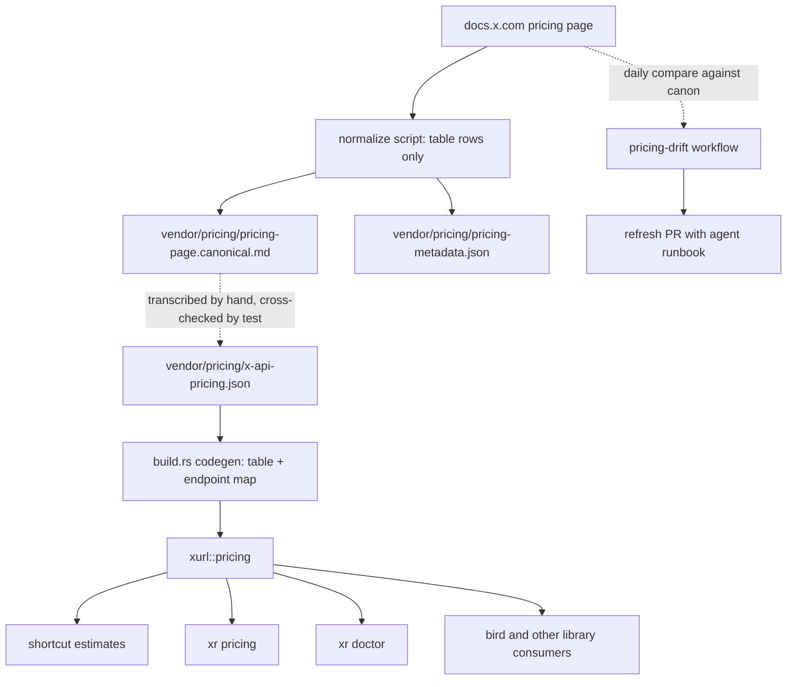
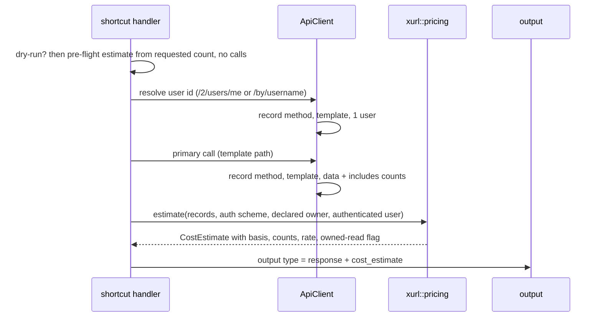

# X API Pricing, Cost Estimates, and Doctor - Plan

## Goal Capsule

- **Objective:** An operator or agent driving `xr` knows, before and after each call, what X charges for it at the
  published rates and whether the active app qualifies for the owned-read rate, without opening the Developer Console. A
  downstream library consumer reads the same price table from one source instead of hardcoding rates.
- **Means:** Vendor the published price list with provenance and a drift check, expose it through a pricing module and
  CLI surfaces, and add a doctor command that verifies ownership from a declared owner (KTD1, KTD4, KTD6, KTD8).
- **Authority:** Requirements win on behavior. Key Technical Decisions win on mechanism inside those requirements. Units
  override neither. Diagrams illustrate; prose governs.
- **Execution profile:** Additive feature. Shipped behavior changes in two places only: read shortcuts start honoring
  `--dry-run` (R12), and structured shortcut output gains one optional field (R8).
- **Stop conditions:** Stop and ask if the pricing page's table rows cannot be extracted identically across two fetches,
  if attaching the estimate would require changing any wire field of the typed response, or if a doctor live check
  cannot be made safe against the interactive authorization flow.
- **Tail ownership:** U8 owns the drift workflow and the documentation and glossary updates, so the snapshot never ships
  without its refresh path and the CLI surface never ships undocumented.

---

## Product Contract

### Summary

Vendor X's pay-per-usage price list into the crate as a structured table with provenance, map every shortcut endpoint to
a price category, and expose it through a library module, an `xr pricing` command, cost estimates on every shortcut
response, and a new `xr doctor` command. Doctor reports provenance, store health, auth state, an ownership verdict built
from a declared owner plus identity match, owned-read eligibility, credit balance, and project usage.

### Problem Frame

X bills the API per resource read and per request written, with a 24-hour deduplication window and a monthly post-read
cap. The only place a developer sees what a call costs is the Developer Console, after the fact. `xr` and the agents
driving it spend real money on every read with no signal from the tool, and bird, the first downstream library consumer,
hardcodes two rates in its own cost module that already lag the published page.

The published page also introduced Owned Reads on 2026-04-20: twelve `GET /2/users/{id}/...` endpoints bill at one fifth
to one tenth of the standard rate when `{id}` is the authenticated user and that user owns the developer app. Whether a
given `xr` setup qualifies is not knowable from anything the API returns.

Research on 2026-09-03 checked every surface for an ownership signal. The OpenAPI spec (2.168) has no endpoint that
lists an app's owner. `GET /2/account` exists behind a `developer.read` scope, but a live probe with a freshly scoped
token returned 403 `client-not-enrolled` for a project-attached app, so it is gated to an enrollment ordinary apps lack.
The OAuth2 consent screen shows the app name, its console description, the authorizing account, and the scope list, with
no developer identity. Response headers carry rate-limit and access-level fields only. `/2/usage/tweets` is app-only and
returns the project id; `/2/usage/credits` returned 404 for both test apps under every credential type. The console
documents that its OAuth1 "Access Token & Secret" are issued for the app owner's own account, which is the one
documented ownership binding.

`xr doctor` does not exist today. `xr auth status` is the nearest precedent and reports store contents without
validating tokens.

### Key Decisions

- **Doctor is a general diagnostics command**, not an ownership-only report and not a fold into `xr auth status`.
  (session-settled: user-approved — chosen over an ownership-only report: one command answers "is my setup healthy and
  what will it cost", and bird's doctor can delegate to it.) Governs R18, R19, R20, R22.
- **Cost estimates are on by default in structured output**, as an additive optional field. (session-settled:
  user-approved — chosen over an opt-in flag: agents discover the field through `xr schema` and consumers ignore unknown
  keys; an opt-in flag would leave most runs blind.) Governs R8, R9, R10.
- **Ownership is a declared owner corroborated by identity match.** (session-settled: user-directed — chosen over
  corroboration through `GET /2/account` with a new `developer.read` scope, which returned 403 `client-not-enrolled` on
  a live probe, and over declaration-only, which would report a verdict `xr` never checks; the identity reads doctor
  needs already happen for authentication.) Governs R11, R16, R19, R23.
- **Pricing drift is checked by a scheduled workflow** that opens a refresh PR, mirroring spec drift. (session-settled:
  user-approved — chosen over manual refresh only: the page states prices are subject to change and the spec pipeline
  already proved the shape.) Governs R24.
- **Raw-URL requests, webhook events, and local spend controls are out of this plan.** Raw requests cannot be mapped to
  a template without new URL matching; `xr` drives no webhooks; budgets and ledgers are a different product surface.
  Governs the Scope Boundaries below.

### Requirements

**Pricing data**

- R1. The crate vendors X's published pay-per-usage price list as a structured table with provenance: source URL, fetch
  date, and a content hash of the canonical page extract.
- R2. The vendored table covers every priced category on the published page: per-resource read rates, per-request write
  rates, the owned-read rate with its endpoint list, webhook event rates, the deduplication rule, and the monthly
  post-read cap.
- R3. Every shortcut endpoint template maps to exactly one price category, or to an explicit unpriced or enterprise-only
  category; a template without a mapping fails the build.
- R4. A refresh script fetches the page, extracts its canonical table content, and rewrites the vendored files and
  sidecar; a fetch that yields no table rows writes nothing and exits nonzero.

**Library surface**

- R5. A downstream Rust caller can look up the price entry for a method and template path, read the snapshot provenance,
  test owned-read eligibility, and compute pre-flight and post-response estimates through one public module whose result
  types derive `JsonSchema`.
- R6. An estimate carries its basis (pre-flight upper bound or resources returned), the counted resources by type, the
  unit rate applied, the currency, whether the owned-read rate applied, whether included objects were counted, and the
  snapshot identity. It is labeled an estimate, never a billed amount.
- R7. Included objects returned under `includes` count at their own resource-type rate; resource types with no published
  rate are not counted.

**Cost estimates in the CLI**

- R8. Every shortcut response in structured output carries an optional additive estimate field beside the wire fields;
  text output appends one estimate line that `--quiet` suppresses.
- R9. The estimate for a command sums every billable call the command made, including the user-id resolution call some
  shortcuts make before their primary request.
- R10. `xr schema` describes and `xr validate` accepts the estimate field for every shortcut response type.
- R11. A request is owned-read eligible only when it uses user-context auth, its endpoint is on the owned-read list, its
  path id is the authenticated user, and that user is the declared owner of the active app.

**Dry-run**

- R12. Every read shortcut honors `--dry-run`: it performs no network call and prints the dry-run envelope with a
  pre-flight estimate.
- R13. A read dry-run derives `would_succeed` from offline preconditions only: argument validation and an available auth
  method for the endpoint.
- R14. A pre-flight estimate uses the requested result count, or the endpoint default when none is given, as the
  resource count, and reports eligibility as possible when the path id cannot be known offline.

**Pricing command**

- R15. `xr pricing` prints the vendored table with its provenance; `xr pricing <command-or-template>` prints one price
  entry with its owned-read rule, in text and structured output.

**Ownership**

- R16. An operator declares the owner account of an app once through the app-update command and clears it the same way;
  the declaration is stored as an additive optional field and is never written on load.
- R17. `xr auth status` shows the declared owner per app without exposing any credential.

**Doctor**

- R18. `xr doctor` reports offline: crate version and git sha, vendored spec provenance, pricing snapshot provenance and
  age with a stale flag, token-store path and health (exists, readable, parses, permission bits), and the per-app auth
  summary in the secret-free status shape.
- R19. Unless `--offline` is set, doctor runs live checks for the active app after stating their maximum spend:
  authenticated identity for each user-context credential present (OAuth2, then OAuth1), the ownership verdict, the
  shortcuts that would bill at the owned-read rate, the credit balance, and project usage with cap headroom.
- R20. Each check reports a typed status from a closed set (ok, degraded, skipped, failed) with a reason code; HTTP
  failures degrade or skip, missing credentials skip, transport failures fail the check; the report is always emitted.
- R21. Doctor never starts an interactive authorization flow; when no user token is cached for a credential type it
  skips that identity check with a reason.
- R22. Doctor exits 0 whenever it produced a report and nonzero only when it could not.
- R23. The ownership verdict is one of: verified (OAuth2 identity equals the declared owner), corroborated (OAuth1
  identity also equals it), mismatch, undeclared, not-applicable (no user-context credential).

**Drift automation**

- R24. A scheduled workflow compares the live page's canonical extract against the vendored one and, on divergence,
  opens or updates one refresh PR on its own branch whose body is an agent runbook; drift never fails a build or a
  check.

**Documentation**

- R25. README, AGENTS.md, the examples gallery, and shell completions cover the new commands, flags, and the estimate
  field; CONCEPTS.md defines the new domain terms.

### Success Criteria

- An agent can answer "what will this cost" for any shortcut without spending: the dry-run envelope carries the
  pre-flight estimate and eligibility.
- bird can delete its hardcoded rates and import the pricing module, with the estimate counts it needs for cache-hit
  zeroing available as fields.
- `xr doctor --offline` makes zero network calls and zero store writes, verified by the test suite.
- Every price the module returns equals the number on the vendored canonical page extract, verified by a test.

### Acceptance Examples

- AE1. Owned-read estimate for own bookmarks
  - **Covers:** R6, R9, R11
  - **Given:** the active app has declared owner `@alice`, an OAuth2 token for `alice`, and the operator runs `xr
    bookmarks -n 20 --output json`
  - **When:** the response returns 20 posts and 5 included users
  - **Then:** the estimate counts 20 posts at the owned-read rate and 5 users at the user-read rate, plus the one user
    read the id resolution made, reports the owned-read rate as applied, and reports its basis as resources returned.
- AE2. Owned-read denied for another user's followers
  - **Covers:** R11
  - **Given:** the same app and token
  - **When:** the operator runs `xr followers --username bob -n 50 --output json`
  - **Then:** the estimate applies the standard following-read rate and reports the owned-read rate as not applied
    because the path id is not the authenticated user.
- AE3. Timeline is never an owned read
  - **Covers:** R3, R11
  - **Given:** any app
  - **When:** the operator runs `xr timeline --dry-run --output json`
  - **Then:** the pre-flight estimate prices the reverse-chronological timeline endpoint at the standard post-read rate,
    marks owned-read as not applicable, and makes no network call.
- AE4. Dry-run read with no usable auth
  - **Covers:** R12, R13
  - **Given:** an app with only a bearer token
  - **When:** the operator runs `xr whoami --dry-run --output json`
  - **Then:** the dry-run envelope reports `would_succeed: false` with the auth-method-mismatch reason and exit code,
    and still carries the pre-flight estimate.
- AE5. Doctor degrades on credits 404
  - **Covers:** R19, R20, R22
  - **Given:** a live setup where `/2/usage/credits` returns 404
  - **When:** the operator runs `xr doctor --output json`
  - **Then:** the credit-balance check reports status skipped with reason `not-available`, every other check still
    reports, and the process exits 0.
- AE6. Doctor skips project usage without a bearer
  - **Covers:** R20, R21
  - **Given:** an app with an OAuth2 token and no bearer token
  - **When:** the operator runs `xr doctor`
  - **Then:** the project-usage check reports skipped with reason `no-bearer`, the identity check runs with the OAuth2
    token, and no browser or authorization prompt opens.
- AE7. Ownership mismatch
  - **Covers:** R23
  - **Given:** declared owner `@alice` and an OAuth2 token whose identity resolves to `bob`
  - **When:** doctor runs its identity check
  - **Then:** the verdict is mismatch, naming the declared and authenticated handles, and the owned-read eligible
    shortcut list is empty.

### Scope Boundaries

- Raw-URL requests (`xr /2/...`) receive no estimate; the auth matrix already declines URL-to-template matching and this
  plan does not add it.
- Webhook and Activity API event rates are vendored for completeness but never estimated; `xr` drives no webhook
  subscriptions.
- The estimate is an upper bound: the 24-hour deduplication window, the monthly cap, and the rate X actually applied are
  server-side facts the client cannot observe.
- Multi-app doctor runs offline checks for every registered app and live checks for the active app only.

#### Deferred to Follow-Up Work

- bird migration: bump the git pin, replace the hardcoded rates in bird's cost module with the pricing module, delegate
  bird's doctor auth section to `xr doctor`, and update the solutions doc that assigns cost tracking to bird (KTD12).
- A shortcut for `GET /2/users/{id}/tweets` (own posts), the flagship owned-read endpoint `xr` cannot reach today.
- A spend gate (`--max-cost`) on the pre-flight estimate, and a local spend ledger.
- Storing the declared owner's stable user id beside the handle, once a free resolution path exists.
- An estimate off switch, if a fixed-schema consumer asks for one.
- Reading `pricing_snapshot` staleness from the drift workflow's last run instead of a fixed age threshold.

### Open Questions

- OQ1 (deferred). Do included objects bill per resource? The page says reads are charged per resource returned and does
  not mention expansions. Default: count them (R7), flag it in the estimate (R6), and verify once with a live read in
  release preflight when convenient.
- OQ2 (deferred). Is `/2/usage/credits` available to any pay-per-use account? Both test apps returned 404 under every
  credential type on 2026-09-03. Default: doctor degrades (AE5); the check stays because the spec and docs list the
  endpoint.

### Sources

- Pricing page: `https://docs.x.com/x-api/getting-started/pricing.md` (fetched 2026-09-03; rates, owned-read list,
  deduplication, cap).
- Changelog entry of 2026-04-16 announcing Owned Reads at `https://docs.x.com/changelog.md`.
- Apps and console docs: `https://docs.x.com/resources/fundamentals/developer-apps.md`,
  `https://docs.x.com/fundamentals/developer-portal.md` (Access Token & Secret are for the owner's own account; team
  roles are enterprise-only).
- Vendored spec `vendor/x-api-openapi.json` (2.168): `GET /2/account` schema and scope, `/2/usage/tweets` bearer-only
  security, `UsageDailyClientAppUsage`.
- Live probes on 2026-09-03 against the operator's two apps: `/2/account` 403 `client-not-enrolled` with
  `developer.read`; `/2/usage/credits` 404 under bearer and OAuth2; `/2/usage/tweets` 403 under OAuth2 user context;
  response header set on `/2/usage/tweets`.
- Rendered OAuth2 consent page for the test app (no developer identity shown).
- Existing pipeline to mirror: `build.rs` (`emit_auth_matrix`, `emit_build_info`), `vendor/spec-metadata.json`,
  `scripts/refresh-x-openapi.sh`, `scripts/normalize-x-openapi.sh`, `.github/workflows/spec-drift.yml`.
- bird's current cost model at `~/dev/bird/src/cost.rs` and its `doctor` command (downstream consumer).
- Solutions corpus under `docs/solutions/`:
  `integration-issues/nondeterministic-upstream-scope-serialization-defeats-byte-drift-gate.md`,
  `conventions/home-anchored-constructors-never-write-on-load-and-tests-inject-the-path-2026-09-03.md`,
  `conventions/hermetic-cli-spawn-seam-with-unwritable-default-store-and-escape-hatch-guard.md`,
  `best-practices/agent-native-semantic-json-fields-over-stderr-warnings-2026-04-20.md`,
  `best-practices/cli-default-inversion-api-first-local-flag-20260327.md`,
  `architecture-patterns/live-integration-testing-cli-external-api.md`,
  `architecture-patterns/xurl-subprocess-transport-layer.md`,
  `design-patterns/generated-pr-body-as-execution-runbook-for-background-agents.md`.

---

## Planning Contract

### Key Technical Decisions

- KTD1. **Snapshot layout under `vendor/pricing/`.** Three files with their own README: `x-api-pricing.json` (the
  structured table and endpoint map, hand-transcribed, the build input), `pricing-page.canonical.md` (the extracted
  table rows, the drift oracle), and `pricing-metadata.json` (the sidecar with the same key shape as
  `vendor/spec-metadata.json`). A separate directory avoids the spec refresh script's wholesale rewrite of
  `vendor/README.md`, and a JSON build input avoids the CI `paths-ignore` rule that skips pushes touching only markdown.
- KTD2. **Canonical form is the page's markdown table rows, whitespace-collapsed.** One script produces it at refresh
  time and in CI, so both sides of the drift comparison go through the same normalizer. Byte comparison is rejected: the
  page embeds asset URLs with per-deploy cache keys, and the spec-drift gate has already shown how a byte oracle reads
  permanent false drift.
- KTD3. **Build-time codegen for the table and endpoint map**, mirroring `emit_auth_matrix` in `build.rs`: read the
  JSON, emit a generated module, panic when a shortcut template has no category or when a mapped template is absent from
  the spec. Snapshot date and hash reach `src/lib.rs` as consts the way the spec consts do. A test cross-checks every
  JSON rate against the canonical rows so a transcription error cannot ship.
- KTD4. **Estimates attach through a CLI-side output type**, not the wire type. Shortcut handlers today serialize
  `ApiResponse<T>` verbatim; the new type flattens the response and adds an optional `cost_estimate`, and `xr schema`
  plus `xr validate` register it so the documented shape stays true. Adding the field to `ApiResponse<T>` is rejected
  because bird deserializes X's body into that type; injecting at print time is rejected because the schema would lie.
- KTD5. **A per-run call record on `ApiClient`.** `send_request` appends the method, template path, and per-type
  resource counts for every template-targeted call; handlers read the records after the primary call to sum the
  id-resolution read with the main read (R9). Raw targets are not recorded. The record lives on the client, which is
  constructed once per CLI invocation, so it is per-run state and not a ledger; library callers read it too.
- KTD6. **Ownership model.** (session-settled: user-directed — chosen over `GET /2/account` corroboration behind a new
  default scope: the live probe returned 403 `client-not-enrolled`, so the scope would force a re-authorization for a
  check that cannot succeed; and over declaration-only: the identity comparison costs nothing beyond reads doctor
  already makes.) The owner is stored as a normalized handle (lowercase, no `@`) and compared case-insensitively against
  the username `/2/users/me` returns for each credential. OAuth1 tokens in the store count as portal-issued owner tokens
  because `xr` has no three-legged OAuth1 flow, so an agreeing OAuth1 identity upgrades the verdict to corroborated.
- KTD7. **Dry-run parity for reads** extends the existing `dry_run_or_validate` shape to every read arm. `would_succeed`
  is argument validation plus a non-empty intersection of the app's available auth methods with the endpoint's accepted
  methods from the auth matrix; the id resolver never runs under dry-run, so self-targeted commands know the path id is
  the authenticated user and username-targeted commands report eligibility as possible.
- KTD8. **Doctor architecture.** A library module under `src/doctor/` owns a read-only store probe (exists, readable,
  parses, permission bits, without seeding a default app the way store construction does), an auth-availability
  pre-check per endpoint, the check runner, and the typed report; `src/cli/commands/doctor.rs` renders it. Live checks
  go through the normal client path, so an expired OAuth2 token refreshes and the rotated token is saved, which the
  report states; a missing cached token skips the check rather than falling into the browser flow. The report prints
  through the success envelope and exits 0 whenever it exists (R22); a strict exit mode is deferred.
- KTD9. **Check semantics.** Status and reason codes are closed enums serialized as strings: HTTP 404 on credits is
  skipped `not-available`; a user-context-only endpoint with no user token, or the bearer-only usage endpoint with no
  bearer, is skipped `no-user-token` or `no-bearer` decided offline from the auth intersection; HTTP 401/403 is degraded
  `forbidden`; a refresh failure is failed `refresh-failed`; a connection or timeout error is failed `network`. Nothing
  an agent must act on is written to stderr or in prose.
- KTD10. **Staleness threshold.** The pricing snapshot reports its age in days and a `stale` flag when the refresh date
  is more than 90 days old; the threshold is one named constant in the pricing module.
- KTD11. **Separate drift workflow.** `.github/workflows/pricing-drift.yml` on a daily schedule with `workflow_dispatch`
  and a `pull_request` trigger scoped to `vendor/pricing/**`, its own branch (`pricing-refresh`), title prefix, and body
  marker, so it never collides with the spec refresh PR's one-open-PR logic. The runbook directs the agent to
  re-transcribe the JSON from the new canonical rows, run the cross-check test, regenerate derived artifacts, and
  rewrite the body to the PR template. A scheduled workflow runs from the default branch, so the check is inert until a
  release ships it; `workflow_dispatch` against `dev` is the interim lever, as it was for spec drift.
- KTD12. **Layering with bird.** Pricing data, the endpoint map, eligibility, and stateless estimation are X API
  compatibility data and live in `xurl`; bird keeps the persistent usage ledger, cache-hit zeroing, and its display.
  AGENTS.md records this split so a later cleanup does not move cost estimation back to bird.
- KTD13. **Included objects count at their own rate** (R7): users in `includes.users` at the user-read rate, posts in
  `includes.tweets` at the post-read rate, media, places, and polls not at all. This is the conservative upper bound the
  page's per-resource wording implies; the estimate flags that includes were counted so a consumer can subtract them if
  OQ1 resolves the other way.
- KTD14. **Rendering.** Text output appends one line through the existing message path so `--quiet` suppresses it; csv
  and tsv treat the estimate like `includes` and `meta`, which already flatten to a JSON-string column; `--raw` keeps
  the field because it controls compaction, not content.
- KTD15. **File placement.** Every touched CLI file is already past the 200-line refactor trigger, so new code lands in
  new modules: `src/pricing/` split by concern (types, generated table access, eligibility, estimation), `src/doctor/`
  split by concern (store probe, checks, report), `src/cli/commands/pricing.rs` and `src/cli/commands/doctor.rs` for
  handlers, and the new `after_help` constants beside their handlers instead of in `src/cli/mod.rs`.

### High-Level Technical Design

Pricing data flow, from the published page to every consumer:



How one shortcut invocation produces its estimate (KTD4, KTD5, KTD7):



Doctor's per-check decision (KTD8, KTD9):

```mermaid
flowchart TB
  start[check] --> offline{offline flag?}
  offline -->|yes| skipO[skipped: offline]
  offline -->|no| cred{credential for endpoint present?}
  cred -->|no| skipC[skipped: no-bearer or no-user-token]
  cred -->|yes| call[call through ApiClient]
  call --> resp{result}
  resp -->|2xx| ok[ok]
  resp -->|404| skipN[skipped: not-available]
  resp -->|401 or 403| deg[degraded: forbidden]
  resp -->|refresh error| failR[failed: refresh-failed]
  resp -->|transport error| failN[failed: network]
```

### Sequencing

- Phase A, foundation: U1, U2. The snapshot and module exist before any consumer.
- Phase B, cost surface: U3, U4, U5. Dry-run parity lands before estimates so the pre-flight path has somewhere to
  print.
- Phase C, ownership and doctor: U6, U7. The declared owner exists before doctor reads it.
- Phase D, automation and docs: U8.

Each unit is a separate PR to `dev`; U1 and U2 may share one.

### System-Wide Impact

- **Structured output contract.** Every shortcut's JSON gains an optional field and every committed response schema
  changes. bird parses `xr` stdout in its subprocess mode; the field is additive and bird's deserialization ignores
  unknown keys, but the bird integration check belongs in the U4 verification.
- **Dry-run contract.** The root flag's documentation says read operations ignore it; after U3 that sentence is false
  and must change in `src/cli/mod.rs`, README, AGENTS.md, and the skill bundle.
- **Token store schema.** One optional per-app field; older writers' files read unchanged; nothing writes on load.
- **Build.** `build.rs` gains a second codegen source; a transcription gap fails every build, which is the intended
  tripwire.
- **Spend.** Doctor's default run spends at most two user reads for the active app, deduplicated within the UTC day;
  `--offline` spends nothing.
- **Agent surface.** New commands, the estimate field, and the doctor report need `xr schema` entries, examples,
  completions, and skill-bundle notes so agents discover them.

### Risks & Dependencies

- **Rate or category drift between refreshes.** Mitigation: the sidecar date, the stale flag, the daily drift workflow,
  and the label "estimate" on every number.
- **Page structure change breaks the normalizer.** Mitigation: the refresh script refuses to write when no table rows
  are extracted (R4); the workflow reports the failure rather than vendoring an empty extract.
- **Estimates overstate because of deduplication or under-count if includes are free.** Mitigation: basis and includes
  flags on the estimate; OQ1 verification in preflight.
- **Doctor refresh rotates a token during a diagnostic.** Mitigation: the report says so; `--offline` never touches the
  network; the live smoke run uses a seeded store copy per the existing preflight convention.
- **Scheduled workflow inert until release.** Mitigation: named in KTD11; dispatch against `dev` after merge.
- **Downstream pin.** bird pins a pre-3.0 revision; consuming the module requires absorbing the 3.0 vocabulary change
  first (deferred follow-up).

### Documentation / Operational Notes

- README: new "Pricing and cost estimates" and "Doctor" sections under Commands; dry-run sentence corrected; the
  enrollment recipe stays.
- AGENTS.md: new commands in the running list, the layering note (KTD12), a "Pricing refresh PRs" invocation paragraph
  beside the spec-refresh one, and the vendored pricing table in the architecture list.
- CONCEPTS.md: vendored pricing table, pricing drift, cost estimate, declared owner, owned read.
- `src/cli/commands/examples.rs`: a "Cost and diagnostics" block.
- Skill bundle (`brettdavies/xurl-rs-skill`): follow-up after release.

---

## Implementation Units

### U1. Vendored pricing snapshot and refresh tooling

- **Goal:** The published price list exists in the repo as a canonical extract, a hand-transcribed structured table, and
  a provenance sidecar, with a script that refreshes all three.
- **Requirements:** R1, R2, R4
- **Dependencies:** none
- **Files:** `vendor/pricing/x-api-pricing.json`, `vendor/pricing/pricing-page.canonical.md`,
  `vendor/pricing/pricing-metadata.json`, `vendor/pricing/README.md`, `scripts/normalize-x-pricing.sh`,
  `scripts/refresh-x-pricing.sh`, `scripts/hooks/pre-push` (shellcheck already covers `scripts/`)
- **Approach:**
  1. The normalizer reads a page file and prints only markdown table rows with collapsed whitespace and trailing
     whitespace removed (KTD2).
  2. The refresh script fetches the page with the same retry shape as `scripts/refresh-x-openapi.sh`, runs the
     normalizer, refuses to write when the extract has no rows, writes the canonical file and the sidecar (source URL,
     refreshed date, sha256 of the canonical bytes), and rewrites `vendor/pricing/README.md` from its own heredoc.
  3. A `--check` mode compares the live canonical extract to the committed one and exits nonzero on divergence, for
     local use and for the workflow in U8.
  4. The JSON table is transcribed by hand from the canonical rows: categories with unit type (per resource, per
     request, per event) and USD rate, the owned-read rate and endpoint list, deduplication window, monthly cap, and an
     endpoint map from `METHOD /template/path` to category with `unpriced` and `enterprise-only` values for templates
     the page does not price.
- **Patterns to follow:** `scripts/refresh-x-openapi.sh` (fetch, sidecar, README heredoc),
  `scripts/normalize-x-openapi.sh` (single normalizer used on both sides), `vendor/spec-metadata.json` (sidecar keys).
- **Test scenarios:**
  - Two fixture pages that differ only in asset URLs, blank lines, and column padding normalize to byte-identical
    output.
  - A fixture page with no table rows makes the refresh script exit nonzero and leave `vendor/pricing/` unchanged.
  - `--check` exits 0 against a fixture identical to the committed canonical file and nonzero against one with a changed
    rate.
  - The sidecar's sha256 equals the sha256 of the committed canonical file (asserted by the Rust cross-check test in
    U2).
- **Verification:** The committed canonical extract reproduces from the live page through the script; shellcheck passes;
  the JSON parses and names every category the canonical rows contain.

### U2. Pricing module and build-time table generation

- **Goal:** `xurl::pricing` answers price, eligibility, and estimate questions from the vendored table, and the build
  fails when a shortcut template lacks a category.
- **Requirements:** R3, R5, R6, R7
- **Dependencies:** U1
- **Files:** `build.rs`, `src/pricing/mod.rs`, `src/pricing/types.rs`, `src/pricing/table.rs`,
  `src/pricing/eligibility.rs`, `src/pricing/estimate.rs`, `src/lib.rs`, `Cargo.toml` (build-dependency for hashing only
  if the sidecar hash is checked at build rather than in a test), `tests/pricing_coverage.rs`,
  `tests/pricing_snapshot_tests.rs`
- **Approach:**
  1. `build.rs` reads `vendor/pricing/x-api-pricing.json`, emits a generated module with the category table and the
     endpoint map keyed on the same `METHOD\0/path` strings the auth matrix uses, and panics when any
     `SHORTCUT_TEMPLATES` entry lacks a mapping or a mapped template is absent from the spec (KTD3).
  2. Types: price category with unit type and rate, price entry for a template, owned-read rule, snapshot provenance
     (source, date, sha, age, stale), cost estimate per R6 with closed enums for basis and eligibility, all deriving
     `Serialize`, `Deserialize`, `JsonSchema`, and `Send + Sync` by construction.
  3. Eligibility takes the resolved auth scheme, the template, the path id, the authenticated username, and the declared
     owner, and returns eligible, not eligible with a reason, or possible (R11, R14).
  4. Estimation has two entry points: pre-flight from a template and requested count, and post-response from call
     records carrying per-type counts of `data` and `includes` (KTD5, KTD13); both return the same estimate type.
  5. `src/lib.rs` exposes the module and the snapshot consts the same way it exposes the spec consts.
- **Patterns to follow:** `build.rs` `emit_auth_matrix` and `emit_build_info`; `src/api/auth_matrix.rs` runtime wrapper
  over generated code; `tests/auth_matrix_coverage.rs`;
  `docs/solutions/best-practices/rust-library-ergonomics-api-design.md` for the public shape.
- **Test scenarios:**
  - Every `SHORTCUT_TEMPLATES` entry resolves to a price entry; the failure message names the missing template.
  - Every rate in the JSON equals the rate parsed from the canonical rows for the same category name; every category in
    the rows exists in the JSON.
  - The sidecar sha256 matches the committed canonical file.
  - The reverse-chronological timeline template is not owned-read eligible under any inputs (AE3).
  - Bookmarks with user-context auth, path id equal to the authenticated user, and a matching declared owner is eligible
    (AE1); the same with a bearer scheme is not eligible with reason app-only auth; with a different declared owner, not
    eligible with reason owner mismatch; with a username-targeted id under dry-run, possible.
  - Post-response estimate for 20 posts plus 5 included users at standard rates equals 20 times the post rate plus 5
    times the user rate, and reports includes counted.
  - Post-response estimate for an empty data array is zero with basis resources returned.
  - Pre-flight estimate for a search with count 100 equals 100 times the post rate with basis upper bound.
  - Included media, places, and polls do not change the estimate.
  - Snapshot age of 91 days sets `stale` true; 89 days sets it false.
  - A write template (create post) prices per request regardless of counts.
- **Verification:** `cargo build` fails when a test-only edit removes a template's mapping and passes when restored; the
  module is documented (`missing_docs` deny is on); `cargo doc` renders the public types.

### U3. Dry-run parity for read shortcuts

- **Goal:** Every read shortcut honors `--dry-run` without a network call and reports offline preconditions.
- **Requirements:** R12, R13, R14
- **Dependencies:** U2
- **Files:** `src/cli/commands/mod.rs` (read arms), `src/cli/mod.rs` (dry-run flag documentation), `tests/cli_tests.rs`,
  `README.md`, `AGENTS.md`
- **Approach:**
  1. Each read arm computes its dry-run context (command, target, requested count) and calls the shared dry-run helper
     before any client call, the way write arms do.
  2. `would_succeed` is argument validation plus a non-empty intersection between the app's available auth methods and
     the endpoint's accepted methods (KTD7); on an empty intersection the envelope carries the auth-method-mismatch
     reason and exit code the runtime path would return.
  3. The dry-run context carries the pre-flight estimate from U2, with eligibility possible for username-targeted reads
     and decided for self-targeted ones.
  4. Correct the flag documentation that says read operations ignore dry-run.
- **Patterns to follow:** `dry_run_or_validate` and the write arms in `src/cli/commands/mod.rs`;
  `OutputConfig::print_dry_run`.
- **Test scenarios:**
  - Each read shortcut under `--dry-run --output json` against a mock server that fails on any request produces a
    dry-run envelope and the mock records zero requests.
  - `whoami --dry-run` with a bearer-only store reports `would_succeed: false` with the auth-mismatch reason (AE4).
  - `search "x" -n 100 --dry-run` reports a pre-flight estimate of 100 post reads with basis upper bound.
  - `timeline --dry-run` marks owned-read as not applicable (AE3).
  - `bookmarks --dry-run` with a declared owner equal to the stored OAuth2 username reports eligible; with `--username
    other` reports possible.
  - Text-mode dry-run prints the estimate line; `--quiet` suppresses it.
- **Verification:** No read shortcut reaches the network under dry-run in the suite; the root help and README describe
  dry-run as covering every shortcut.

### U4. Cost estimates in shortcut output

- **Goal:** Structured shortcut output carries the estimate for every billable call the command made, and the documented
  schemas match.
- **Requirements:** R8, R9, R10, R11
- **Dependencies:** U2, U3
- **Files:** `src/api/request.rs` (call record), `src/api/mod.rs`, `src/cli/commands/mod.rs` (output type at the typed
  print path), `src/cli/commands/schema.rs`, `src/cli/commands/validate.rs`, `src/output.rs` (text estimate line),
  `schema/responses/*.schema.json` (regenerated), `tests/schema_tests.rs` (row counts), `tests/api_tests.rs`,
  `tests/cli_tests.rs`
- **Approach:**
  1. `ApiClient` keeps a per-run vector of call records appended in `send_request` for template targets, with per-type
     counts taken from `data` and `includes` (KTD5); a method drains or reads them.
  2. The typed print path wraps the response in the CLI output type from KTD4 with `cost_estimate` computed from the
     records, the resolved auth scheme, the declared owner, and the authenticated username the store already holds.
  3. Register the output type in `SCHEMA_ENTRIES` and the validate catalog, regenerate `schema/responses/`, and update
     the hardcoded row counts.
  4. Text output appends one estimate line through the message path (KTD14).
- **Patterns to follow:** `print_typed` and `OutputConfig::print_response`; `scripts/generate-response-schemas.sh`; the
  schema drift guard in `tests/schema_tests.rs`; bird's counting heuristics in `~/dev/bird/src/cost.rs` as test cases.
- **Test scenarios:**
  - `bookmarks -n 20 --output json` against a mock returning 20 posts and 5 included users, with a declared owner
    matching the OAuth2 username, yields an estimate of 20 owned reads plus 5 user reads plus 1 user read for id
    resolution (AE1).
  - `followers --username bob --output json` yields the standard following-read rate with owned-read not applied (AE2).
  - `whoami --output json` yields one user read; the response wire fields are byte-identical to today's output apart
    from the new key.
  - A single-object response counts one resource; an empty list counts zero.
  - A write shortcut yields a per-request estimate independent of the response body.
  - `--output csv` and `--output tsv` add one estimate column and keep every existing column.
  - `--quiet` text output has no estimate line; default text output has exactly one.
  - `xr schema bookmarks` includes `cost_estimate`; `xr validate` accepts a captured response with and without the
    field.
  - The committed `schema/responses/*.schema.json` files byte-match the runtime emitter.
  - A mock JSON consumer that reads only the wire fields (bird's parsing shape) still parses the output.
- **Verification:** Every shortcut's structured output carries the field; `cargo test` schema guards pass after
  regeneration; a manual bird subprocess run against the new binary parses unchanged.

### U5. `xr pricing` command

- **Goal:** Humans and agents look up the vendored table and any shortcut's price entry offline.
- **Requirements:** R15
- **Dependencies:** U2
- **Files:** `src/cli/mod.rs` (variant), `src/cli/commands/pricing.rs` (handler and help constant), `src/cli/runner.rs`
  (tier-1 dispatch, needs no auth), `src/cli/commands/schema.rs`, `src/cli/commands/examples.rs`, `tests/cli_tests.rs`,
  `tests/completion_tests.rs`, `tests/schema_tests.rs` (row counts), `schema/responses/` (regenerated), `README.md`
- **Approach:**
  1. `xr pricing` prints the table with provenance (source, date, age, stale); `xr pricing <name>` accepts a shortcut
     command name or a `METHOD /template` string and prints the entry with its owned-read rule and unit type.
  2. Structured output uses the success envelope with the pricing types from U2; text output renders a table.
  3. Unknown names return the invalid-args error envelope with the closest matches.
- **Patterns to follow:** `xr examples` registration commit (variant, help constant, runner dispatch, tests); `xr schema
  --list` text and JSON shapes.
- **Test scenarios:**
  - `xr pricing --output json` lists every category and the provenance block.
  - `xr pricing bookmarks` shows the owned-read rule; `xr pricing timeline` shows the standard post-read rate and no
    owned-read rule.
  - `xr pricing "GET /2/users/{id}/bookmarks"` resolves the same entry as the command name.
  - `xr pricing nosuch` exits with the invalid-args code and names suggestions.
  - The command appears in `xr --help`, completions, `xr schema --list`, and the examples gallery.
- **Verification:** Runs with an unwritable store path and no credentials; completions and schema checks pass.

### U6. Declared owner in the token store

- **Goal:** An operator declares and clears an app's owner, and status output shows it without exposing credentials.
- **Requirements:** R16, R17
- **Dependencies:** none
- **Files:** `src/store/types.rs`, `src/store/mod.rs`, `src/store/migration.rs` (struct literal), `src/cli/mod.rs`
  (`--owner` on app update), `src/cli/commands/auth.rs` (update handler, status rendering, status entry field),
  `tests/store_tests.rs`, `tests/cli_tests.rs`
- **Approach:**
  1. Add an optional owner field on the app type with the `redirect_uri` serde shape; construction and load never
     populate it (KTD6).
  2. Store accessors validate and normalize the handle (strip `@`, lowercase) and persist on set; an empty value clears.
  3. Extend the update command's "nothing to update" guard and dry-run context; render the owner in text status and in
     the JSON status entry.
- **Patterns to follow:** `set_app_redirect_uri` and `get_app_redirect_uri`; `AppCommands::Update` handler;
  `build_app_status_entries` and the secret-exclusion test.
- **Test scenarios:**
  - Setting `--owner @Alice` stores `alice`; status shows `alice`; setting an empty owner clears it and the YAML omits
    the key.
  - A store file without the field loads and, after an unrelated save, still omits the field (no write on load, no
    invented value).
  - An older file with the field present loads it.
  - The secret-exclusion test still finds no credential value or field name in status JSON with an owner set.
  - `xr auth apps update NAME` with no flags still reports nothing to update; `--dry-run` reports `has_owner`.
- **Verification:** A fingerprint of the real-store fixture is unchanged across a load-only run; store tests pass
  through injected paths only.

### U7. `xr doctor`

- **Goal:** One command reports provenance, store health, auth state, ownership verdict, owned-read eligibility, credit
  balance, and project usage, with typed statuses and disclosed spend.
- **Requirements:** R18, R19, R20, R21, R22, R23
- **Dependencies:** U2, U4, U6
- **Files:** `src/doctor/mod.rs`, `src/doctor/store_probe.rs`, `src/doctor/checks.rs`, `src/doctor/report.rs`,
  `src/cli/mod.rs` (variant with `--offline`), `src/cli/commands/doctor.rs` (handler, text rendering, help constant),
  `src/cli/commands/mod.rs` (tier-2 dispatch beside `Commands::Auth`), `src/cli/commands/schema.rs`,
  `src/cli/commands/validate.rs`, `src/cli/commands/examples.rs`, `tests/cli_tests.rs`, `tests/live_smoke.rs`,
  `tests/store_isolation_guard.rs` (allowlist entry for the live test), `tests/completion_tests.rs`,
  `tests/schema_tests.rs`, `schema/responses/` (regenerated)
- **Approach:**
  1. Store probe: a read-only inspection of the store path that reports existence, readability, parse result, and
     permission bits without constructing a store or seeding a default app (KTD8).
  2. Offline section: version and git sha, spec provenance consts, pricing provenance and staleness, store probe,
     per-app status entries from the existing builder, declared owner per app.
  3. Live section, active app only, skipped entirely under `--offline`: before any call, compute the auth intersection
     per endpoint and the maximum spend, print it, then run identity via OAuth2 if a token is cached, identity via
     OAuth1 if present, credits, and project usage, each producing a check record per KTD9.
  4. Verdict from the identities and the declared owner per R23; the owned-read eligible list is the owned-read
     templates that map to shortcuts, present only when the verdict is verified or corroborated.
  5. Exit 0 with the report through the success envelope; only a failure to build the report returns the error path
     (R22).
  6. Live smoke: one ignored test behind `XURL_LIVE_SMOKE=1` that runs doctor against the seeded store and asserts the
     identity check is ok, with the allowlist entry and reason.
- **Execution note:** Build the check runner against wiremock fixtures for each status branch before wiring the live
  section; the degrade paths are the product here.
- **Patterns to follow:** `AppStatusEntry` and its secret-exclusion test; `run_with_overrides` with a mock base URL in
  `tests/cli_tests.rs`; `tests/live_smoke.rs` gating;
  `docs/solutions/best-practices/cli-default-inversion-api-first-local-flag-20260327.md` for HTTP-degrade versus
  transport-fail.
- **Test scenarios:**
  - `doctor --offline --output json` against a seeded temp store makes zero requests to a mock that fails on any
    request, writes nothing (store fingerprint unchanged), and reports every offline section.
  - Store probe on a missing path reports exists false; on an unreadable file reports readable false; on invalid YAML
    reports parses false; a store constructed afterwards is not seeded by the probe.
  - Credits mock returns 404: check skipped `not-available`, exit 0 (AE5).
  - App with OAuth2 and no bearer: usage check skipped `no-bearer`; identity runs (AE6).
  - App with bearer only: identity checks skipped `no-user-token`; verdict not-applicable.
  - Identity mock returns `alice`, declared owner `alice`: verdict verified; with an OAuth1 token whose identity mock
    also returns `alice`: corroborated; identity `bob`: mismatch (AE7); no declared owner: undeclared.
  - Identity mock returns 403: degraded `forbidden`; mock closes the connection: failed `network`; both keep the report
    and exit 0.
  - Expired OAuth2 token with a refresh mock that succeeds: identity ok and the report states a refresh happened;
    refresh mock fails: failed `refresh-failed`, no browser flow, no pending-state file created.
  - Spend line names two user reads when both OAuth2 and OAuth1 are present and one when only OAuth2 is.
  - `xr schema doctor` matches the emitted report; completions and examples include the command.
- **Verification:** All branches covered by mock tests through the spawn seam or the in-process runner; the live smoke
  test passes against the operator's seeded store in release preflight; no credential value appears in any doctor output
  fixture.

### U8. Pricing drift workflow, documentation, and glossary

- **Goal:** Divergence between the live page and the vendored extract opens a refresh PR with a runbook, and every new
  surface is documented.
- **Requirements:** R24, R25
- **Dependencies:** U1, U5, U7
- **Files:** `.github/workflows/pricing-drift.yml`, `AGENTS.md`, `CONCEPTS.md`, `README.md`,
  `src/cli/commands/examples.rs`, `vendor/pricing/README.md`
- **Approach:**
  1. Copy the spec-drift workflow's fetch-with-retry, canonical compare, one-open-PR dedupe, `createCommitOnBranch`
     commit, and marker-owned body, with the pricing branch, title prefix, marker, and `vendor/pricing/**` PR paths
     (KTD11); the compare step is `scripts/refresh-x-pricing.sh --check`.
  2. Runbook steps: run the refresh script, re-transcribe `x-api-pricing.json` from the new canonical rows, run the
     cross-check and coverage tests, regenerate response schemas if types changed, update README rate mentions, rewrite
     the body to the PR template; decision authority mirrors the spec runbook (rate changes are applied; new categories
     or endpoint remaps are proposed).
  3. AGENTS.md: commands list, dry-run sentence, "Pricing refresh PRs" invocation paragraph, layering note (KTD12);
     CONCEPTS.md: the five new terms; README: pricing and doctor sections.
- **Patterns to follow:** `.github/workflows/spec-drift.yml`;
  `docs/solutions/design-patterns/generated-pr-body-as-execution-runbook-for-background-agents.md`; supply-chain pinning
  of every action by SHA.
- **Test scenarios:**
  - `actionlint` passes on the workflow.
  - `workflow_dispatch` against a branch whose canonical file is edited opens a PR with the marker and runbook; a second
    dispatch updates the same PR; an unchanged page produces no PR.
  - The PR trigger fires on a change under `vendor/pricing/` and posts the compare result.
- **Verification:** One dispatch run observed end to end on `dev` after merge; README and AGENTS.md read consistently
  with `xr --help` output; CONCEPTS.md entries follow the existing format.

---

## Verification Contract

| Gate               | Command                                                                      | Applies to                        | Done signal                                                                            |
| ------------------ | ---------------------------------------------------------------------------- | --------------------------------- | -------------------------------------------------------------------------------------- |
| Format             | `cargo fmt --check`                                                          | all units                         | clean                                                                                  |
| Lint               | `cargo clippy --all-targets -- -D warnings`                                  | all units                         | clean                                                                                  |
| Tests              | `cargo test`                                                                 | all units                         | green, including new `tests/pricing_coverage.rs` and `tests/pricing_snapshot_tests.rs` |
| Supply chain       | `cargo deny check`                                                           | U2 if a build-dependency is added | clean                                                                                  |
| Schema drift       | `scripts/generate-response-schemas.sh` then `cargo test --test schema_tests` | U4, U5, U7                        | committed schemas byte-match                                                           |
| Completions        | `scripts/generate-completions.sh --check`                                    | U5, U7                            | clean                                                                                  |
| Stdout discipline  | `scripts/lint-stdio.sh`                                                      | U4, U5, U7                        | clean                                                                                  |
| Env-var help guard | `cargo test --test agentic_tests`                                            | U7 (no new env var expected)      | green                                                                                  |
| Store isolation    | `cargo test --test store_isolation_guard`                                    | U6, U7                            | green, live test allowlisted with reason                                               |
| Shell              | `shellcheck scripts/*.sh` (via `scripts/hooks/pre-push`)                     | U1, U8                            | clean                                                                                  |
| Workflow           | `actionlint .github/workflows/pricing-drift.yml`                             | U8                                | clean                                                                                  |
| Pricing refresh    | `scripts/refresh-x-pricing.sh --check`                                       | U1, U8                            | exit 0 against the live page                                                           |
| Live smoke         | `XURL_LIVE_SMOKE=1 cargo test --test live_smoke -- --ignored`                | U7, release preflight only        | doctor identity check ok; spends at most two deduplicated user reads                   |
| Full mirror        | `scripts/hooks/pre-push`                                                     | before each push                  | green                                                                                  |

---

## Definition of Done

**Global**

- Every requirement R1 to R25 is implemented and traced to a passing test or a verified manual check named in its unit.
- No shortcut reaches the network under `--dry-run`; no test resolves the real token store; `xr doctor --offline` makes
  no network call and no store write.
- Every number the CLI prints as a cost is labeled an estimate and traces to the vendored table.
- The spawn seam, store isolation guard, env-var help guard, schema drift guard, and completions check all pass
  unchanged in policy.
- README, AGENTS.md, CONCEPTS.md, and the examples gallery describe the shipped surface; the dry-run documentation no
  longer says reads ignore it.
- Abandoned approaches and experimental code are removed before each PR is marked ready.

**Per unit**

- U1: canonical extract reproduces from the live page; degraded fetch writes nothing.
- U2: build fails on a missing mapping; every JSON rate matches the canonical rows; eligibility and estimate scenarios
  pass.
- U3: every read shortcut has a dry-run path proven against a failing mock.
- U4: every shortcut's structured output carries the estimate; schemas regenerated; bird-shaped parsing unaffected.
- U5: `xr pricing` works with no credentials and appears in help, completions, schema list, and examples.
- U6: owner set, shown, cleared; no write on load; secret exclusion holds.
- U7: every status branch covered by mocks; live smoke passes in preflight; no browser flow reachable.
- U8: workflow dispatch observed producing a runbook PR; docs and glossary updated.
