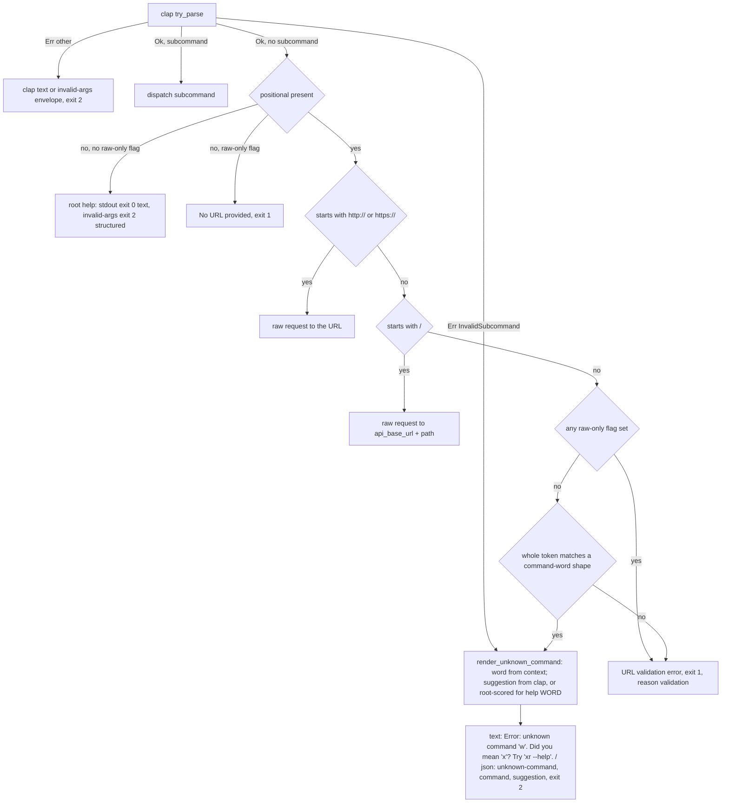
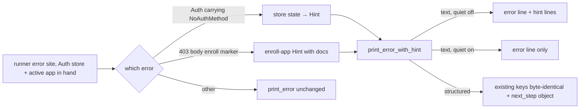

# Pre-Attention Cleanup - Plan

## Goal Capsule

- **Objective:** A stranger who arrives from the X developer docs listing can tell in one click that xurl-rs is an
  independent port, can find how to report a vulnerability and how to contribute, and gets a next step from every
  mistake a newcomer makes in the first five minutes: running a command with no credentials, following the Quick Start
  on a fresh install, mistyping a command, and hitting the enrollment wall after a successful sign-in. An AI agent
  driving `xr` gets the same next steps as structured fields it can branch on. Release hygiene stops leaking runbooks
  into the crates.io tarball and stops printing warnings from the dependency audit.
- **Means:** Three community files and a README pass (KTD8, KTD9); an error-hint mechanism that renders prose for humans
  and a `next_step` object for agents (KTD1, KTD12); an empty token store that is empty, a register verb that promotes
  past a credential-less default, and a sign-in guard (KTD13); one unknown-command renderer for both detection paths,
  using clap's own suggestion where clap computed one (KTD2, KTD4, KTD5); a one-attribute fix for flags that swallow the
  command word (KTD6); an enrollment hint on the 403 that follows the first sign-in (KTD12); status-ok envelopes for
  every auth verb (KTD14); package and audit config edits (KTD7); a scoped SRP review that records split boundaries
  without moving code (KTD10). A standalone fix PR for the env bearer token lands first (KTD15).
- **Authority:** Requirements win on behavior. Key Technical Decisions win on mechanism inside those requirements. Units
  override neither. The diagram illustrates; prose governs.
- **Execution profile:** Visible changes, each documented in the changelog `### Changed` section: a bare command-word
  positional moves from a URL validation error at exit 1 to an unknown-command error at exit 2 (R8); clap-detected typos
  move from reason `invalid-args` to `unknown-command` (R8); six boolean flags stop consuming the word after them, so
  the space-separated `--quiet true` form no longer parses (R10); a bare `xr` prints help (R8); `TokenStore::new` on an
  empty file returns no apps (R15); `auth status` and `auth apps list` emit a status-ok envelope instead of a bare array
  (R17). No public `XurlError` variant changes.
- **Stop conditions:** Stop and ask if the `next_step` field cannot be added without changing an existing envelope key,
  if the unknown-command path cannot be reached without adding a public `XurlError` variant, if `require_equals` breaks
  an env-backed boolean flag, if removing the eager default seed breaks the `CLIENT_ID` env-credential path or the
  legacy JSON migration, or if the SRP review concludes that a file split cannot be deferred safely.
- **Tail ownership:** The implementer owns the follow-up plan produced by U9, the skill-bundle updates in Related work,
  and the three `docs/solutions/` entries named in Definition of Done.

---

## Product Contract

### Summary

Make xurl-rs safe to point strangers at, human or agent. Land the three files a reviewer clicks through to, make the
README Quick Start true on a fresh install, give every first-five-minutes error an actionable next step in both output
modes, fix the flag-ordering bug on the same path, and clear the packaging and audit warnings. Record the file-split
debt as boundaries in a follow-up plan rather than moving code before an audience arrives.

### Problem Frame

The docs listing plan (`docs/plans/2026-09-04-1836-docs-x-docs-listing-plan.md`) puts xurl-rs in front of X's developer
audience. A health pass on 2026-09-04 found the code gates green (811 tests, clippy, deny, doc build) but the newcomer
surface thin: the README never says the project is unaffiliated with X, the repository has no security policy while
vulnerability alerts are on, and `AGENTS.md` is the only contribution guide, written for agents.

A DX review on 2026-09-09 replayed the README against the 3.1.0 binary with an isolated empty token store and found the
first five minutes broken in more places than the health pass saw:

- `xr whoami` with no credentials prints only `Auth Error: NoAuthMethod: no authentication method available`.
- The Quick Start itself fails on a fresh install. The store seeds a placeholder app named `default` with no
  credentials, registration only promotes an app to default when it is the sole entry, so `xr auth apps add myapp` then
  `xr auth oauth2` warns that the token will land on an app with no credentials and proceeds anyway, sending the browser
  to X with an empty client id and exiting 0.
- `xr whoam` is parsed as a raw URL and fails with "must be an absolute http(s) URL"; `xr help whoam` and `xr auth
  whoam` go through clap with a different wording; the `help` path never carries a suggestion.
- Six boolean flags declared with an optional value swallow the following word, so `xr --quiet whoami` fails with "No
  URL provided" and the README's own `xr -q search "topic"` example fails on the word `topic`.
- `XURL_BEARER_TOKEN` works on the raw path and is ignored by every shortcut command, with or without `--auth app`,
  because shortcut auth resolution consults only the token store. `auth status` shows no bearer either.
- After a successful sign-in, the first call can fail with a 403 whose body says `client-not-enrolled`; the README
  Troubleshooting section documents the fix and the error never points at it.
- Every auth verb's JSON success is a bare `{"message": …}` object or a bare array, not the `{"status": "ok", …}`
  envelope the rest of the tool emits.
- The README Install section never says the binary is `xr`; the README never mentions `xr skill install`, the portal
  prerequisites, or that the API is pay-per-use.

On the hygiene side, the crates.io tarball ships four release runbooks and the concepts doc, `cargo deny check` prints
four warnings that hide real ones, `MIGRATING.md` ships with links into the excluded docs directory, and eight source
files exceed 800 lines.

### Key Decisions

- **All health-review and DX-review items are in scope, refactor debt included as a non-blocking tier**
  (session-settled: user-approved; chosen over a blockers-only cleanup: the user wants one home for everything the
  reviews raised). Governs R13.
- **Text mode is written for humans, JSON for agents; the two need not match** (session-settled: user-approved; chosen
  over one wording for both: each reader gets what it can use). Text errors carry prose hints and a help pointer. JSON
  envelopes keep every existing key byte-identical and gain an additive `next_step` object. Governs R6, R7, R8, R16.
- **Every structured error meets the Stripe tier: stable reason, exit code, message, offending value, and a `next_step`
  object with a closed-set `action`, exactly one of a verbatim headless-safe `command` or a placeholder `template`, and
  an optional `docs` URL** (session-settled: user-approved; chosen over a plain-string hint: agents branch on `action`
  and run `command`). Recorded in `AGENTS.md`, `CONTRIBUTING.md`, and the user's global instructions for other repos.
  Governs R7, R16.
- **A mistyped command word becomes an unknown-command error with a suggestion, through one renderer whether clap or the
  raw-mode classifier detected it** (session-settled: user-approved; chosen over two shapes for one mistake: agents
  branch on one reason and humans read one wording). Governs R8, R9.
- **The token store stops seeding a placeholder default app, and registration promotes past a credential-less default**
  (session-settled: user-approved; chosen over patching only the placeholder to yield: an empty store is empty, the
  register doc comment becomes true by construction, and the fresh-install trap disappears; the yield rule stays as
  belt-and-braces for the lazy-create paths). `default` still materializes lazily when `CLIENT_ID` env credentials, a
  legacy migration, or a token save need it. Governs R15.
- **Sign-in refuses to start with an empty client id** (session-settled: user-approved). Governs R15.
- **The env bearer fix ships as a standalone fix PR ahead of this plan** (session-settled: user-approved; chosen over a
  unit here: agents and CI are unblocked before the listing work lands). This plan cites it as a prerequisite. Governs
  R18.
- **Every auth verb emits a status-ok envelope, arrays included, in 3.x with the break documented in the changelog**
  (session-settled: user-approved; chosen over leaving the documented arrays for a major: one success contract across
  the auth surface; the user accepted the documented-shape break in a minor release with the risk stated). No code
  consumer parses the arrays; two skill bundles document them and are updated in Related work. Governs R17.
- **The credential-free trial against X's API Playground is a developer note in `CONTRIBUTING.md`, not a README Quick
  Start block** (session-settled: user-approved; chosen over a README try-it block: newcomers must not read it as a
  requirement). Governs R3.
- **Homebrew installs `xurl-rs` as a symlink beside `xr` and prints a caveats note; never a `xurl` symlink**
  (session-settled: user-approved; the Go tool ships as a cask named `xurl` in X's tap and would collide on link). Lands
  in the homebrew-tap repo; recorded here as related work. Governs R5.
- **A bare `xr` prints help at exit 0 in text mode and the `invalid-args` envelope at exit 2 under structured intent**
  (session-settled: user-approved; chosen over one exit code in both modes: a human typing `xr` is exploring and gh
  answers with help, while an agent that emits `xr --output json` with no command made a usage error). Governs R8.
- **The enrollment hint matches both `client-not-enrolled` and `client-forbidden`** (session-settled: user-approved;
  chosen over the narrower marker: the README Troubleshooting recipe names both from observed cases). Governs R16.
- **Discussions are enabled** (session-settled: user-approved; chosen over leaving them off). Conflict noted: the house
  repo standard sets `has_discussions` to false as "Not used". This plan follows the user's choice and KTD9 records the
  revisit condition. Governs R4.
- **Refactor debt is recorded as boundaries and deferred; no file moves in this plan** (session-settled: user-approved;
  chosen over splitting now: heavy churn right before an audience arrives). Governs R13.
- **Vulnerability reports route through GitHub private vulnerability reporting, not an email address** (session-settled:
  user-approved; chosen over an address in the policy: exposes nothing and gives reporters a form). Governs R2.

### Requirements

**Newcomer files**

- R1. The README states under the tagline that xurl-rs is an independent port not affiliated with or maintained by X,
  and carries a "Relationship to xurl" section, three or four lines linking `KNOWN_DIFFERENCES.md`, that introduces the
  existing comparison table.
- R2. `SECURITY.md` routes reports to GitHub private vulnerability reporting, names the supported version as the latest
  tagged release, and states an acknowledgement and fix window; private vulnerability reporting is enabled on the
  repository.
- R3. `CONTRIBUTING.md`, about twenty-five lines, states the feature-branch-then-PR-to-`dev` flow, points at the
  `AGENTS.md` sections for the quality bar, testing, and releasing instead of restating them, states the error-contract
  principle in three lines, and carries a developer note on exercising `xr` against X's API Playground with
  `API_BASE_URL` and `XURL_BEARER_TOKEN`, including the port caveat; the README's Contributing section points at it.
- R4. The repository has issue forms for a bug, a feature request, and a skill-bundle report, with blank issues disabled
  and contact links for out-of-scope questions; Discussions are enabled.
- R5. The README carries crates.io version, CI status, and license badges below the title; the Install section says the
  binary is `xr` and shows `xr --version` as the verify step; the Quick Start is preceded by a before-you-start block
  naming the portal prerequisites (Read and Write permission, confidential client, redirect URI
  `http://localhost:8080/callback`), linking the Troubleshooting enrollment recipe, and stating in one sentence that the
  API is pay-per-use with a link to X's pricing page; the Agent-Native Features section names `xr skill install` and `xr
  skill update --all`. README lines that describe behavior a unit introduces land with that unit.

**First-run errors**

- R6. In text mode, the no-credentials error prints a next step chosen from the token store the run already loaded: app
  registration when no app carries client credentials, sign-in when the active app carries client credentials and no
  tokens, sign-in with `--app NAME` when the active app lacks client credentials and another app has them, and a fixed
  two-line hint when the store path cannot be read; `--quiet` suppresses the hint and never the error.
- R7. In every structured output mode, the no-credentials envelope keeps `status`, `reason` `auth-required`, `exit_code`
  77, and `message` byte-identical to today and gains one additive `next_step` object: `action` from the closed set,
  exactly one of `command` (runnable verbatim by a non-TTY caller; the headless form `xr auth oauth2 --no-browser --step
  1`, with `--app NAME` when the target app is not the default) or `template` (angle-bracket placeholders, used by
  `register-app`), and `docs` when a recipe exists; the unreadable-store case carries `{action: inspect-store, command:
  xr auth status}`.
- R8. A mistyped command word fails as an unknown command at exit 2 with reason `unknown-command`, through one renderer,
  whether the raw-mode classifier caught a bare positional or clap caught an invalid subcommand after `help` or a family
  noun; when a candidate is within the suggestion threshold, the text names it and the envelope carries `suggestion`;
  the text always ends with `Try 'xr --help'.`; `command` echoes the word verbatim. The classifier matches the whole
  token against `[a-z][a-z0-9-]*` case-insensitively, so a bare dotless hostname such as `localhost` is an unknown
  command. A bare `xr` with no subcommand, no positional, and no raw-only flag prints the root help to stdout at exit 0
  in text mode and the `invalid-args` envelope at exit 2 under structured intent; `xr -q` alone behaves the same.
- R9. Every other bare positional keeps today's URL validation error, and any raw-only flag (`-X`, `-d`, `-H`, `-F`,
  streaming flags) forces URL semantics for the positional. Unknown flags and missing values keep clap's text and reason
  `invalid-args`.
- R10. The six boolean flags that accept an optional value (`--verbose`, `--quiet`, `--no-interactive`, `--dry-run`,
  `--raw`, and `--no-browser` on `auth oauth2`) require `=` for an explicit value, so the word after the flag is no
  longer consumed as its value: `xr --quiet whoami` runs `whoami` and the README's `xr -q search "topic"` example works;
  `--quiet=false` still overrides an env-provided true; the space-separated `--quiet true` form no longer parses.
- R15. A token store loaded from a missing or empty file has no apps; `default` is created only when `CLIENT_ID` and
  `CLIENT_SECRET` env credentials are present, when a legacy JSON store or `.twurlrc` is migrated, when a token save
  targets the active app with none registered, or when a caller asks for the active app with none registered. The first
  registered app becomes the default, and registering an app while the current default has no client id promotes the new
  app. `xr auth apps add` prints whether the app is the default and the next command. `xr auth status` on a store with
  no apps prints `No apps registered. Run: xr auth apps add NAME --client-id ID --client-secret SECRET`, plus a line
  reporting the env bearer when `XURL_BEARER_TOKEN` is set. `xr auth oauth2` refuses to start when the target app has no
  client id, at exit 2 with reason `client-credentials-missing`, naming `xr auth oauth2 --app NAME` when another app has
  credentials and `xr auth apps add` otherwise, in both modes with a `next_step`.
- R16. A 403 whose body contains `client-not-enrolled` or `client-forbidden` prints, in text mode, a hint pointing at
  the README Troubleshooting enrollment recipe, and carries in structured modes a `next_step` with `action` `enroll-app`
  and `docs` set to that section's URL and no `command`; existing envelope keys are unchanged.
- R17. Every `xr auth` verb's structured success is a `{"status": "ok", …}` envelope: message-shaped verbs (`apps add`,
  `apps update`, `apps remove`, `apps redirect-uri set`, `default`, `clear`, `oauth1`, `app`, `oauth2` success, and the
  headless steps) keep their current keys and gain `status`, plus typed fields where the text names one (`default`,
  `next_step`); `auth status` and `auth apps list` move their array under an `apps` key; the README jq example and the
  envelope schema follow; the changelog `### Changed` entry names the array-shape break.
- R18. Prerequisite, shipped ahead of this plan: `XURL_BEARER_TOKEN` counts as the `app` scheme in shortcut auth
  resolution, so `XURL_BEARER_TOKEN=… xr search "x"` succeeds on an empty store, and `auth status` reports the bearer as
  present from the environment, with or without registered apps.

**Hygiene**

- R11. The crates.io tarball excludes `RELEASES*.md` and `CONCEPTS.md`; the README's release-procedure link and the two
  `MIGRATING.md` guide links survive as GitHub URLs.
- R12. `cargo deny check` prints no warnings: the unused BSD-2-Clause and CDLA-Permissive-2.0 allowances are gone, the
  graph targets are the seven release triples, and the two remaining duplicate crates are skipped with a stated reason.
- R13. An SRP review of the six non-exempt files over 800 lines produces a follow-up plan that records split boundaries;
  `src/api/shortcuts.rs` and `src/cli/mod.rs` are recorded as exempt per the prior ruling.
- R14. The README exit-code table, `KNOWN_DIFFERENCES.md`, `AGENTS.md`, and the envelope reason vocabulary document the
  unknown-command behavior, the `next_step` object and its action set, the text-for-humans and JSON-for-agents
  principle, and an on-exit-77 recovery recipe for agents (`xr --output json auth status`, branch on `client_id_hint`
  inside `apps`, then `apps add` or the headless two-step with `--app`).

### Success Criteria

- From a fresh shell with an empty token store, `xr whoami` tells the user to register an app first; the README Quick
  Start's four lines then succeed in order on that store; with an app registered and no tokens `xr whoami` names `xr
  auth oauth2`; `xr whoam` names `whoami`; and each of those under `--output json` carries a `next_step` or a
  `suggestion` an agent can act on.
- The GitHub repository page shows a security policy, a contributing guide, and issue forms; the README renders three
  badges, the non-affiliation sentence, and the before-you-start block above the fold.
- `cargo package --list` shows no `RELEASES` or `CONCEPTS` files and `cargo deny check` prints only its four `ok` lines.
- A 3.2.0 release carrying Phase B is tagged before the listing PR opens, so `main` and every install channel carry the
  fixes the listing audience will hit.

### Scope Boundaries

- The docs listing PR and the X outreach stay in `docs/plans/2026-09-04-1836-docs-x-docs-listing-plan.md`; that plan's
  Phase 1 points at U1 through U4 here.
- No new public `XurlError` variants in 3.x (KTD2).
- No file moves; U9 produces a plan, not a diff.
- Opinionated workflows and aggregation (threads, watchlists, cost views) belong to downstream clients such as `bird`;
  this repo owns primitive correctness, auth, the error contract, and discoverability of the tool itself.
- Cost estimates, `xr pricing`, and `xr doctor` stay in
  `docs/plans/2026-09-03-1310-feat-pricing-cost-estimates-doctor-plan.md`.

#### Deferred to Follow-Up Work

- Typed `NoAuthMethod`, `UnknownCommand`, and `ClientCredentialsMissing` error variants behind `#[non_exhaustive]`, for
  the next major; until then the already-emitted sentinel's `kind()` stays a documented placeholder.
- A code of conduct, the two markdownlint hits in `docs/plans/2026-03-26-001-feat-remote-oauth2-flow-plan.md`, the audit
  of 20 `dead_code` allows, SAFETY comments on the six `unsafe` blocks, and a root `CODEOWNERS` per the house standard.
- `xr schema nope` reports "unknown command" at exit 1 with reason `validation`; aligning it with R8 is a separate
  change.
- GitHub reports the license as Apache-2.0 alone for the dual-licensed repository; cosmetic, and both license files
  stay.
- Rejecting a positional that stands beside a subcommand (`xr false whoami` drops the word silently today), and whether
  `true` and `false` deserve a flag-syntax diagnosis instead of unknown command.
- Suggestions for nested `help` paths such as `xr help auth statsu`; the root-scored fallback covers `help WORD` only.
- A post-ship replay of this review's persona against the released binary; the user chose not to schedule it.

### Sources

- Text error rendering: `src/output.rs` `print_error`, `print_error_envelope`, `write_envelope_or_text_error`; the
  mismatch hint precedent in `src/error.rs` `auth_method_mismatch_message`; `print_error` folds extra envelope fields
  only for `AuthMethodMismatch`.
- No-credentials construction: `src/api/request.rs` lines 839 and 867, both `XurlError::auth("NoAuthMethod: ...")`.
- Shortcut auth availability: `src/api/request.rs` `available_auth_in_app` consults only the store; the env override
  lives in `src/auth/mod.rs` `bearer_token_override` and `resolve_bearer_token`.
- Store seeding: `src/store/mod.rs` inserts `default` in `with_credentials`, `new_with_path`, and `new_with_home` when
  no apps load; `new_with_path` swallows read errors, so an unreadable path loads as an empty store;
  `active_app_or_create` materializes `default` lazily and `resolve_app_mut` routes every token save through it;
  `add_app` promotes only when `apps.len() == 1`; env credentials backfill through `new_with_credentials_and_path`.
- Sign-in warning: `src/cli/commands/auth.rs` `credential_less_default_warning` lists credentialed apps and names `--app
  NAME`; its caller proceeds after printing.
- Auth verb output: 46 `print_message` calls and no `print_success` calls in `src/cli/commands/auth.rs`; under
  structured modes `print_message` emits `{"message": …}`; `auth status` and `apps list` emit arrays built by
  `build_app_status_entries`. Downstream: `bird` reads the store through the crate, not the CLI JSON; `bird-skill` and
  `xurl-rs-skill` document `xr auth status --output json` and the envelope reasons.
- Raw-mode validation: `src/cli/commands/mod.rs` `run_raw_mode`; positional declared at `src/cli/mod.rs` line 942; parse
  path and `invalid-args` envelope in `src/cli/runner.rs` lines 127 to 146 and 287 to 295. clap 4.5 attaches
  `ContextKind::SuggestedSubcommand` on its `invalid_subcommand` path (a family noun followed by a near-miss) and
  nothing on its `unrecognized_subcommand` path (`help WORD`, or no candidate); `Error::get` exposes both the word and
  the suggestion; `infer_subcommands` is not enabled.
- Flag declarations: `require_equals = false` is set explicitly on all six flags, from PR #34, alongside their env
  bindings.
- Exit-code contract: `src/error.rs` lines 405 to 458; README "Structured Exit Codes" table; reason vocabulary in
  `src/envelope.rs` line 49 and the `kind()` doc table in `src/error.rs`; `EnvelopeAlreadyEmitted` maps `kind()` to
  `confirmation-required` and is consumed only by the runner.
- clap suggestion machinery is crate-private; `strsim 0.11.1` is already locked through `clap_builder`; clap's own
  subcommand suggestion uses `strsim::jaro` above 0.7 (clap-rs/clap issue 4660 on why not Jaro-Winkler).
- Go original accepts any positional and sends it as the endpoint: `xdevplatform/xurl` `cli/root.go`. The Go store
  always returns a usable store with a `default` app; the seed comment in `with_credentials` cites that parity.
- X API Playground: `https://github.com/xdevplatform/playground`, `playground start --port N`; default port 8080
  collides with the OAuth2 callback listener; verified on 2026-09-09 that a raw search with any bearer returns data and
  that the server enforces per-endpoint auth rules.
- Homebrew tap: `~/dev/homebrew-tap/Formula/xurl-rs.rb`; `update-formula.yml` rewrites only the `url`, `sha256`, and
  `bottle` lines, so `bin.install_symlink` and `caveats` additions survive a release. The Go tool is
  `xdevplatform/tap/xurl`, a cask.
- `deny.toml` lines 5 to 7 record that empty `targets` checks all targets; pinning trades that coverage for a clean
  report.
- Prior split ruling: `docs/solutions/best-practices/rust-module-splitting-srp-not-loc-20260327.md`. Argv classification
  pitfalls: `docs/solutions/best-practices/clap-default-subcommand-via-argv-pre-parse-20260415.md`. Envelope discipline:
  `docs/solutions/best-practices/agent-native-semantic-json-fields-over-stderr-warnings-2026-04-20.md`. Exit-code tests:
  `docs/solutions/best-practices/test-exit-code-paths-even-if-trivial-2026-04-20.md`. Packaging policy:
  `docs/solutions/architecture-patterns/crates-io-distribution-readiness.md`. Fallible parse for custom error output:
  `docs/solutions/best-practices/rust-clap-try-parse-for-custom-error-handling-2026-04-20.md`.
- Templates to mirror: `~/dev/xurl-rs-skill/SECURITY.md`; `~/dev/agentnative-cli/.github/ISSUE_TEMPLATE/`; the house
  `issue-template-config.yml` in the `github-repo-setup` skill.

---

## Planning Contract

### Key Technical Decisions

- KTD1. **Error hints are chosen at the runner's error site from the store the run already loaded, and rendered per mode
  by one helper.** The two construction sites share one constant for the `NoAuthMethod` text. When the runner is about
  to print an `Auth` error carrying that constant, it builds a `Hint { text_lines, next_step }` from the `Auth` value's
  token store (env backfill included) and the active app name (`--app` or `XURL_APP`), across four states: no app
  carries client credentials (`register-app`, with a `template`); the active app carries client credentials and no
  tokens (`sign-in`); the active app lacks client credentials and another app has them (`select-app`, naming the first
  credentialed app through the same helper the sign-in warning uses, moved to a shared module); the store path cannot be
  read (`inspect-store`), which the chooser detects with its own readability check because the store constructor
  swallows read errors. An additive `print_error_with_hint` on the output config renders `text_lines` after the error
  line in text mode when quiet is off, and folds `next_step` into the envelope in structured modes. `print_error`, the
  Display string, `kind()`, and `exit_code()` do not change. Rejected: embedding the hint in Display, which feeds the
  JSON `message`; computing the hint inside the resolver, which would need a new error field to carry it; and reloading
  the store from disk, which would not see env credentials or the active app.
- KTD2. **No new public error variants in 3.x.** `XurlError` is not `#[non_exhaustive]`, so a new variant breaks any
  downstream exhaustive match (`kind()` in `src/error.rs` has no wildcard arm; `bird` pins the crate and maps its
  variants). Unknown-command and client-credentials-missing errors are emitted through an envelope emitter that accepts
  extra fields and return the existing `EnvelopeAlreadyEmitted { exit_code: 2 }` so the runner exits without printing
  again. The sentinel's `kind()` returns `confirmation-required` as a placeholder; the variant's doc states that the
  runner is its only consumer and that the envelope already on stderr carries the real reason. Typed variants move to
  the deferred list.
- KTD3. **`EXIT_USAGE_ERROR` becomes a public constant in `src/error.rs`.** The runner's private copy is replaced by an
  import; the constant's doc keeps the note that clap parse failures share it. Rejected: reusing `EXIT_AUTH_MISMATCH`,
  which has the same value but a different meaning.
- KTD4. **Two detection paths, one renderer, no argv walk.** The raw-mode classifier runs after clap parsing, inside
  `run_raw_mode`, in this order: `http://` or `https://` prefix is raw; `/` prefix is raw; any raw-only flag present
  keeps the URL validation error; a token that matches `[a-z][a-z0-9-]*` in full, case-insensitively, is an unknown
  command; anything else keeps the URL validation error. The clap path intercepts `ErrorKind::InvalidSubcommand` in the
  runner's parse-error branch, reads the word from `ContextKind::InvalidSubcommand` and the suggestion from
  `ContextKind::SuggestedSubcommand` when clap attached one; when it did not and the first argv token is `help`, the
  word is scored against the root subcommands; otherwise no suggestion. Both paths call `render_unknown_command(word,
  suggestion)`. Placing the classifier after parsing avoids every argv pre-parse pitfall because clap has already
  consumed help, `--`, and value-taking flags; not walking argv for a parent avoids the global-flag and alias pitfalls
  the corpus records. The bare-`xr` help path runs after parsing too: no subcommand, no positional, no raw-only flag.
- KTD5. **Suggestions come from clap where clap computed one, and from `strsim::jaro` above 0.7 against the root
  subcommand names, aliases, and `help` where clap is silent (the raw classifier and `help WORD`).** Only the best match
  is offered. `strsim` becomes a direct dependency at the version clap already locks, so no new crate enters the graph.
  Rejected: Jaro-Winkler, which clap avoids for subcommands (clap-rs/clap issue 4660); `infer_subcommands`, which would
  run a different command on a truncated word; and a second engine on the clap path, which would drift from clap's
  threshold on a bump.
- KTD6. **The six optional-value boolean flags flip `require_equals` from `false`, set explicitly in PR #34, to
  `true`.** The sixth is the no-browser flag on `auth oauth2`, declared with the same shape directly ahead of the bare
  username positional. `--quiet` and `--quiet=false` both parse; `--quiet false` no longer consumes `false`, which falls
  through to the positional; the space-separated `--quiet true` form stops parsing and the changelog says so. All six
  carry env bindings (`XURL_VERBOSE`, `XURL_RAW`, `XURL_QUIET`, `XURL_NO_INTERACTIVE`, `XURL_DRY_RUN`,
  `XURL_NO_BROWSER`); env values are read through the value parser and never touch the equals rule. Found during
  research, not in the original request; it is in scope because R8's own tests cannot be written without it.
- KTD7. **Audit config, not dependency pins, at the cost of coverage.** `[graph] targets` lists the seven release
  triples, which removes the Redox-only `getrandom` duplicate and the wasm-only `webpki-root-certs` crate, the sole
  carrier of CDLA-Permissive-2.0. This drops audit coverage for hosts outside the seven triples (a `cargo install` on
  wasm or Redox) by policy: the release builds no such target, and `deny.toml` records the tradeoff in the comment that
  today says empty targets check everything. `[bans] skip` names `base64@0.22` (reqwest and hyper-util lag the direct
  dependency) and `syn@2` (proc-macro crates on the icu path), each with a reason. `multiple-versions` stays `warn`, the
  recorded policy. The allow list drops BSD-2-Clause, which no crate carries, and CDLA-Permissive-2.0. Rejected:
  downgrading the direct `base64` dependency, which Dependabot's weekly grouped update would re-bump.
- KTD8. **Community files mirror the siblings.** `SECURITY.md` follows `~/dev/xurl-rs-skill/SECURITY.md` in shape
  (private advisory link, acknowledgement and fix window, scope, latest tag only). Issue forms follow
  `~/dev/agentnative-cli/.github/ISSUE_TEMPLATE/` including the AI-disclosure field. `config.yml` follows the house
  template with blank issues disabled and contact links to the X developer community and the upstream
  `xdevplatform/xurl` tracker. A skill-bundle form exists because `xurl-rs-skill` disables its own tracker and routes
  issues here with a `[skill]` prefix.
- KTD9. **Discussions are a repository setting flipped with the GitHub API, not a file.** Recorded conflict: the house
  standard disables Discussions. Revisit if no thread appears within a quarter of the listing landing.
- KTD10. **The SRP review uses the prior ruling's checklist, not the line count.** Split on mixed concerns, misplaced
  types, or `pub(crate)` hacks. `src/cli/mod.rs` (clap declarations and help constants) and `src/api/shortcuts.rs`
  (uniform API methods) are exempt. The output is a follow-up plan with boundaries for `src/api/request.rs`,
  `src/cli/commands/auth.rs`, `src/cli/commands/mod.rs`, `src/output.rs`, `src/skill_install/mod.rs`, and
  `src/api/response/types.rs`.
- KTD11. **The reason vocabulary doc is completed while it is open.** `src/envelope.rs` gains `unknown-command`,
  `client-credentials-missing`, the `next_step` object with its action set (`register-app`, `sign-in`, `select-app`,
  `inspect-store`, `enroll-app`), the `command` versus `template` rule and the angle-bracket placeholder form, and the
  thirteen reasons the runtime already emits but the doc omits: seven from `kind()` or literal envelope calls
  (`auth-method-mismatch`, `invalid-url`, `invalid-path-param`, `internal`, `confirmation-required`, `no-tty`,
  `unsupported-pagination`) and six verb-local ones from the validate and skill commands (`invalid-json`,
  `unknown-schema`, `validation-failed`, `missing-host`, `home-not-set`, `remove-failed`, the last verified against
  `render_update_error` before it is listed); the schema is regenerated. Whether verb-local reasons belong in the closed
  set or in per-verb schema text is deferred.
- KTD12. **`next_step` is one object shape for every hint.** `{action, command?, template?, docs?}`: `action` from the
  closed set in KTD11; exactly one of `command` (a verbatim invocation safe for a non-TTY caller; the headless sign-in
  form under structured intent, the browser form in text) or `template` (the same with `<name>`, `<client-id>`,
  `<client-secret>` placeholders, used by `register-app`), except `enroll-app`, which carries only `docs`; `docs` a URL
  when a recipe exists. The `Hint` type in KTD1 carries it; the no-credentials error, the client-credentials-missing
  error, and the enrollment 403 all use it. The enrollment hint matches `client-not-enrolled` or `client-forbidden` in a
  403 body inside the runner's error site, the same seam as KTD1, and is tested with a canned body; the test pins
  today's wording and the match is case-insensitive substring.
- KTD13. **An empty store is empty, and registration promotes past a credential-less default.** The three constructors
  stop inserting `default` when nothing loads; `active_app_or_create` keeps materializing it on demand, which preserves
  the `CLIENT_ID` env-credential single-app mode, the legacy migrations, and token saves on an empty store. `add_app`
  promotes the new app when it is the only one, or when the current default has no client id, so a `default` that a
  bearer-only or OAuth1-only save created still yields to the first registered app. `auth status` and `apps list` handle
  zero apps and report the env bearer when set. Sign-in guards on an empty client id before any URL is built and before
  any pending file is written. The extra-fields envelope emitter lands in this unit, the first that needs it, and U7
  reuses it. The store change, the guard, the register message, and every test assertion that expects the placeholder
  land in one unit (prior learning: unit ordering breaks zero-broken-tests when signature changes and their tests are
  split).
- KTD14. **Auth verb envelopes are additive except the two arrays.** Message-shaped verbs gain `status: ok` and keep
  `message`; `apps add` gains `default: bool` and `next_step`; the headless step-1 object gains `status` and keeps
  `auth_url` and `instructions`; `auth status` and `apps list` return `{"status": "ok", "apps": [...]}`. Emission goes
  through `print_success` so every verb shares one path; the 46 `print_message` calls that render multi-line text
  instructions stay text-only behind the structured branch. The README's jq example becomes `.apps[]`.
- KTD15. **Env bearer counts as available.** `available_auth_in_app` includes `app` when the `Auth` value carries a
  bearer override, and `build_app_status_entries` reports `bearer: true` with `bearer_source: env` for the active app
  when the override is set, or as a top-level line when no app is registered. Standalone fix PR, cited by this plan;
  U3's playground note depends on it.

### High-Level Technical Design

Dispatch after U6, U7, and U10. Prose governs where they differ.



Error-hint rendering after U5, U10, and U11:



### Sequencing

- Phase 0, before anything here: the env bearer fix PR (R18, KTD15) lands on `dev`.
- Phase A, before the docs PR: U1, U2, U3, U4. Independent of each other, except that U1 links to the file U3 creates,
  so land U3 first or in the same PR; U3's playground note cites the Phase 0 PR.
- Phase B, first-run fixes, one PR per unit in this order: U10 (store semantics and the shared emitter); U6; U7; U12
  (the `apps` shape the U5 recipe branches on); U5; U11 (shares the `Hint` type).
- Release: tag 3.2.0 after Phase B and before the listing PR opens, so `main` and every install channel carry the fixes
  the listing audience will hit.
- Phase C, hygiene: U8 and U9, independent; may ride the 3.2.0 release or follow it.
- Related work in other repos: the homebrew-tap symlink and caveats any time after Phase A; the skill-bundle updates
  after 3.2.0 is tagged.

---

## Implementation Units

### U1. README: non-affiliation, relationship section, badges, install name, before-you-start, agent surface

- **Goal:** The first screen of the README answers "is this official?", names the binary, names the portal prerequisites
  and the cost, and carries the three badges; the agent section names the skill installer. Every line this unit writes
  is true against the binary on `main` the day it lands.
- **Requirements:** R1, R5, R3 (link only), R11 (runbook link).
- **Dependencies:** U3 for the Contributing pointer; otherwise none.
- **Files:** `README.md`.
- **Approach:**
  1. Add one sentence under the tagline: xurl-rs is an independent port and is not affiliated with or maintained by X.
  2. Add three badge lines below the title: crates.io version, the `ci.yml` workflow status on `main`, and the dual
     license, in the sibling repo's shield style.
  3. Open the Install section with one line: every method installs the `xr` binary; verify with `xr --version`. Under
     Homebrew, note that the formula also links `xurl-rs` as an alias once the tap change lands.
  4. Insert a "Before you start" block above Quick Start: three bullets with a portal link (Read and Write permission,
     confidential client so a client secret is issued, redirect URI `http://localhost:8080/callback`), a fourth bullet
     linking the Troubleshooting enrollment recipe, and one sentence that the API is pay-per-use with a link to X's
     pricing page. Quick Start's four lines stay as they are; after U10 they are correct on a fresh store.
  5. Rename or introduce a "Relationship to xurl" section that leads the existing "vs Go Original" table with three or
     four lines: what is ported, what differs on purpose, and a link to `KNOWN_DIFFERENCES.md`.
  6. Under Agent-Native Features, add `xr skill install <host>` and `xr skill update --all` with one sentence each.
  7. Rewrite the Contributing section to point at `CONTRIBUTING.md`; replace the relative `RELEASES.md` link with its
     GitHub URL (R11).
- **Patterns to follow:** Badge lines in `~/dev/agentnative-cli/README.md`; the comparison table already in the README;
  the Troubleshooting enrollment recipe already in the README.
- **Test scenarios:**
  - Test expectation: none. Documentation only; markdownlint passes and the three badge URLs resolve when opened.
- **Verification:** The rendered README on GitHub shows the badges, the non-affiliation sentence, the install name, and
  the before-you-start block above the fold; every internal link resolves; no line describes U5, U7, or U12 behavior.

### U2. Security policy and private vulnerability reporting

- **Goal:** A reporter has a private route and knows what to expect.
- **Requirements:** R2.
- **Dependencies:** None. The repository setting must be enabled before the file links to it.
- **Files:** `SECURITY.md` (create).
- **Approach:**
  1. Enable private vulnerability reporting through the GitHub repository API.
  2. Write `SECURITY.md` with the private advisory link for this repository, an acknowledgement window of five business
     days, a fix window of ninety days, scope (the `xr` binary, the `xurl` library, release artifacts), and the
     supported version as the latest tagged release.
- **Patterns to follow:** `~/dev/xurl-rs-skill/SECURITY.md`, whose out-of-scope section already points at this
  repository.
- **Test scenarios:**
  - Test expectation: none. Repository setting plus a markdown file; the advisory link opens a form rather than a 404.
- **Verification:** The repository's Security tab shows the policy and the "Report a vulnerability" button.

### U3. Contributing guide with the error-contract principle and the playground developer note

- **Goal:** A human contributor finds the standard file, is routed to the existing rules, learns the error contract, and
  can exercise `xr` without an X account.
- **Requirements:** R3.
- **Dependencies:** The Phase 0 env bearer fix, so the playground note's shortcut example works.
- **Files:** `CONTRIBUTING.md` (create).
- **Approach:** About twenty-five lines: clone and run the gates; branch from `dev` as `feat/` or `fix/`; open a PR to
  `dev` using the template; pointers to `AGENTS.md` for the quality bar, testing, and releasing; the house rule that
  consumer-facing markdown also goes through a PR; where to file issues (the forms from U4). Then a three-line "Error
  contract" paragraph: text mode is for humans and JSON for agents, the two need not match, and every structured error
  carries `reason`, `exit_code`, `message`, and a `next_step` object `{action, command | template, docs}`. Then a "Try
  it without an X account" developer note: install X's API Playground, start it on a spare port (`playground start
  --port 8089`, because the default 8080 is the OAuth2 callback port), and run `API_BASE_URL=http://localhost:8089
  XURL_BEARER_TOKEN=test xr search "hello"`. No duplication of the rules themselves.
- **Patterns to follow:** `~/dev/agentnative-cli/CONTRIBUTING.md` for shape, cut to a fifth of its length; `RELEASES.md`
  lines 26 to 56 for the branch flow it points at; `xr examples` for the headless sign-in wording.
- **Test scenarios:**
  - Test expectation: none. Documentation only.
- **Verification:** GitHub shows the "Contributing" link on the repository page and on the new-issue and new-PR screens;
  the playground recipe runs as written on a machine with the playground installed.

### U4. Issue forms, routing config, and Discussions

- **Goal:** Issues arrive structured and misrouted questions have somewhere to go.
- **Requirements:** R4.
- **Dependencies:** None.
- **Files:** `.github/ISSUE_TEMPLATE/bug-report.yml`, `.github/ISSUE_TEMPLATE/feature-request.yml`,
  `.github/ISSUE_TEMPLATE/skill-bundle.yml`, `.github/ISSUE_TEMPLATE/config.yml` (all create).
- **Approach:**
  1. Bug form: command, actual output, expected output, `xr --version`, install channel, AI-disclosure line; label
     `bug`.
  2. Feature form: the problem, the proposed command or flag, agent-native considerations; label `enhancement`.
  3. Skill-bundle form: for reports routed from `xurl-rs-skill`; title prefix `[skill]`; label `documentation`.
  4. `config.yml`: blank issues disabled; contact links to the X developer community for platform questions and to
     `xdevplatform/xurl` for questions about the original tool.
  5. Enable Discussions through the repository API (KTD9).
- **Patterns to follow:** `~/dev/agentnative-cli/.github/ISSUE_TEMPLATE/`; the house `issue-template-config.yml`
  template.
- **Test scenarios:**
  - Test expectation: none. GitHub validates form YAML on the new-issue screen; a broken form falls back to a blank
    editor, which is the visible failure to check for.
- **Verification:** The new-issue screen offers the three forms and the two contact links and no blank option; the
  Discussions tab exists.

### U5. Next-step hint on the no-credentials error, in both modes

- **Goal:** Text mode tells the user how to authenticate; structured modes give the agent a `next_step` it can run;
  every existing envelope key is unchanged.
- **Requirements:** R6, R7, R14. Implements KTD1, KTD12 (session-settled).
- **Dependencies:** U10 (store semantics and the shared emitter); U12 (the `apps` shape the agent recipe branches on).
- **Files:** `src/api/request.rs`, `src/error.rs`, `src/output.rs`, `src/cli/runner.rs`, a new shared module for the
  credentialed-apps helper (for example `src/store/inspect.rs`, chosen by the SRP ruling), `src/envelope.rs`,
  `schema/output.schema.json` (regenerated), `AGENTS.md`, `README.md` (exit-code row 77 and one `next_step` envelope
  example under Machine-Readable Output), `tests/cli_tests.rs`, `tests/wiring_tests.rs`, `tests/schema_tests.rs`.
- **Approach:**
  1. Replace the two literal `NoAuthMethod` strings with one constant in `src/error.rs`.
  2. Move `credential_less_default_warning`'s app-listing logic into a shared helper that returns the credentialed app
     names; the sign-in guard (U10) and the hint chooser both call it.
  3. Add a `Hint { text_lines: Vec<String>, next_step: NextStep }` type and a hint chooser in the runner that takes the
     `Auth` value's token store and active app name (not a fresh disk load) and returns one of the four KTD1 states; the
     chooser performs its own readability check on the store path for the `inspect-store` state. `NextStep { action,
     command, template, docs }` serializes with absent fields omitted.
  4. Add `print_error_with_hint` to the output config: text mode prints `text_lines` after the error line outside the
     color wrap and skips them under quiet; structured modes fold `next_step` into the envelope after `message`. The
     runner calls it for the no-credentials error and `print_error` for everything else.
  5. Leave `print_error`, `print_error_envelope`, `kind()`, `exit_code()`, and the Display impl untouched.
  6. `AGENTS.md`: under Output formats, state the text-for-humans and JSON-for-agents principle and the Stripe-tier
     error contract; under Auth paths, add the on-exit-77 recipe that reads `apps[]` from `auth status`. README: row
     77's action becomes "see Authentication; agents: run `xr --output json auth status` and follow `next_step`"; add
     one error envelope example showing `next_step`. Complete the vocabulary doc per KTD11 for the parts this unit
     introduces; regenerate the schema.
- **Execution note:** Capture the JSON envelope for the no-credentials case in a test before touching the renderer, and
  assert key-by-key that every pre-existing key is byte-identical and exactly one key, `next_step`, is new.
- **Patterns to follow:** `run_isolated` in `tests/cli_tests.rs` for in-process runs with an injected store; the
  envelope assertions in `tests/wiring_tests.rs` near the exit-77 test; the case selection in
  `auth_method_mismatch_message` for choosing wording by store state; the `AuthMethodMismatch` branch of `print_error`
  for folding extra fields.
- **Test scenarios:**
  - Text mode, empty store, `xr whoami`: stderr has the existing error line followed by a registration line naming `xr
    auth apps add`; exit 77.
  - Text mode, one app carrying client credentials as default and no tokens: the extra lines name `xr auth oauth2` and
    the app-only alternative, not registration.
  - Text mode, active app without client credentials and another app with them: the extra lines name `xr auth oauth2
    --app NAME`.
  - Text mode, `--app other` naming an app that lacks client credentials while the default has them: `select-app` names
    the default, proving the chooser sees the active app.
  - Text mode, `CLIENT_ID` and `CLIENT_SECRET` exported with an empty file and a user-context endpoint: the hint is
    `sign-in`, not `register-app`, proving the chooser sees the env backfill.
  - Text mode, store path pointing at a directory: the fixed fallback lines print and the error line is unchanged.
  - Text mode with `--quiet`: the error line prints, the hint lines do not; exit 77.
  - Text mode with `NO_COLOR`: no line carries an escape sequence.
  - `--output json`, each of the four states: `status`, `reason`, `exit_code`, `message` byte-identical to the captured
    baseline; `next_step.action` is `register-app` (with `template`), `sign-in`, `select-app`, or `inspect-store`;
    `command` uses the `--no-browser --step 1` form and carries `--app NAME` when the target app is not the default;
    never both `command` and `template`.
  - `--output jsonl` and `--output yaml`: `next_step` present, no hint prose anywhere in stderr.
  - Any other error (for example the URL validation error): no hint line and no `next_step`.
  - Schema drift test passes after regeneration; the vocabulary doc lists the action set and the placeholder form.
- **Verification:** The scenarios above pass; `scripts/lint-stdio.sh` stays clean; the store isolation guard passes
  because every new test injects `XURL_TOKEN_STORE`.

### U6. Boolean flags stop swallowing the next word

- **Goal:** `xr --quiet whoami` runs `whoami`.
- **Requirements:** R10. Implements KTD6.
- **Dependencies:** None. U7 depends on this unit.
- **Files:** `src/cli/mod.rs`, `tests/cli_tests.rs`, `README.md` (verify the `-q search` example only).
- **Approach:** Flip `require_equals` from `false` to `true` on each of the six flags declared with `num_args = 0..=1`
  and `default_missing_value = "true"`. Keep the `FalseyValueParser` so `--quiet=false` still overrides an env-provided
  true. The PR body's `### Changed` names the loss of the space-separated `--quiet true` form.
- **Execution note:** Write the invocation-matrix test first and observe it fail on the current parser before changing
  the attributes.
- **Patterns to follow:** The existing flag declarations at `src/cli/mod.rs` lines 734, 802, 827, 841, 872, and 1497.
- **Test scenarios:**
  - `xr --quiet whoami` with an empty store reaches the auth error (exit 77), not "No URL provided".
  - `xr -q whoami`, `xr --verbose whoami`, `xr --no-interactive whoami`, `xr --raw whoami`, and `xr --dry-run whoami`
    each reach `whoami`.
  - `xr --quiet=false whoami` parses and quiet is off.
  - `xr --quiet false whoami` runs `whoami` with quiet on and leaves `false` in the ignored raw-mode positional (exit 77
    on an empty store).
  - `XURL_QUIET=true xr whoami` sets quiet; `XURL_QUIET=true xr --quiet=false whoami` clears it; one such pair for each
    of the six env bindings.
  - `xr -q search topic` reaches the search command with `topic` as the query; the README example at line 289 works as
    written.
  - `xr auth oauth2 --no-browser alice` parses with the flag set and `alice` as the username, asserted at the parse
    level so no sign-in flow runs.
  - `xr auth oauth2 --no-browser=false alice` parses with the flag off and the username kept.
- **Verification:** The matrix passes; `scripts/generate-completions.sh --check` still passes (the flag names are
  unchanged).

### U7. Unknown-command error with a suggestion, one renderer, and bare-`xr` help

- **Goal:** A mistyped command names the nearest real one and exits as a usage error, with the same wording and the same
  envelope whether clap or the classifier caught it; a bare `xr` prints help.
- **Requirements:** R8, R9, R14. Implements KTD2, KTD3, KTD4, KTD5, KTD11.
- **Dependencies:** U6; U10 for the extra-fields emitter.
- **Files:** `src/cli/commands/mod.rs`, `src/cli/runner.rs`, `src/error.rs`, `src/output.rs`, `src/envelope.rs`,
  `Cargo.toml`, `README.md` (exit-code row 2), `KNOWN_DIFFERENCES.md`, `schema/output.schema.json` (regenerated),
  `tests/cli_tests.rs`, `tests/cli_run_tests.rs`, `tests/error_tests.rs`, `tests/schema_tests.rs`.
- **Approach:**
  1. Promote `EXIT_USAGE_ERROR` per KTD3 and import it in the runner.
  2. Add a suggestion helper that takes a candidate list and returns the best `jaro` match above 0.7 (KTD5), and a
     root-candidate collector over `Cli::command()` (names, aliases, `help`). Add `strsim` as a direct dependency.
  3. Add `render_unknown_command(word, suggestion, out, stderr)` that prints `Error: unknown command 'WORD'. Did you
     mean 'X'? Try 'xr --help'.` in text mode (without the middle sentence when no match), and emits the envelope with
     reason `unknown-command`, exit code 2, `command`, and `suggestion` (omitted when none) in structured modes, then
     returns `EnvelopeAlreadyEmitted`.
  4. In the runner's parse-error branch, intercept `ErrorKind::InvalidSubcommand`: read the word from
     `ContextKind::InvalidSubcommand`; take `ContextKind::SuggestedSubcommand` when present; otherwise, when the first
     argv token is `help`, score the word against the root candidates; call the renderer. Every other kind keeps clap's
     rendered text or the `invalid-args` envelope.
  5. In `run_raw_mode`, apply the KTD4 order with a full-token match; for a command word, score against the root
     candidates and call the renderer. Before that, when there is no positional and no raw-only flag, print the root
     help to stdout at exit 0 in text mode or the `invalid-args` envelope at exit 2 under structured intent; keep "No
     URL provided" for the raw-only-flag case.
  6. Update the README exit-code table (row 2 mentions unknown command), add a `KNOWN_DIFFERENCES.md` row (the Go
     original sends a bare word as the endpoint; xurl-rs rejects it as an unknown command at exit 2), and complete the
     reason vocabulary in `src/envelope.rs` per KTD11; regenerate the envelope schema with `cargo run --bin xr -- schema
     envelope --output json`.
- **Execution note:** Start with a failing test for `xr whoam` asserting exit 2 and reason `unknown-command`, a second
  for `xr help whoam` asserting `suggestion` equal to `whoami`, and a third for `xr auth statsu` asserting `suggestion`
  equal to `status` through clap's own context.
- **Patterns to follow:** The `AuthMethodMismatch` branch of `print_error` for folding extra envelope fields;
  `emit_invalid_args_envelope` in `src/cli/runner.rs` for the usage-error shape; the `EnvelopeAlreadyEmitted` handling
  in the runner; `docs/solutions/best-practices/clap-default-subcommand-via-argv-pre-parse-20260415.md` for the
  quiet-only pitfall the bare-`xr` path must handle.
- **Test scenarios:**
  - `xr whoam`: exit 2; text stderr is `Error: unknown command 'whoam'. Did you mean 'whoami'? Try 'xr --help'.`; JSON
    stderr has reason `unknown-command`, `command` equal to `whoam`, `suggestion` equal to `whoami`.
  - `xr help whoam`: same shape through the clap path with the root-scored suggestion `whoami`.
  - `xr auth statsu`: same shape with `suggestion` equal to `status` from clap's context; `xr auth whoam`: same shape,
    no `suggestion` key, because no auth verb clears the threshold.
  - `xr Whoam`: matched case-insensitively; `command` echoes `Whoam` verbatim.
  - `xr zzzzzz`: exit 2, reason `unknown-command`, no `suggestion` key; text ends with `Try 'xr --help'.`.
  - `xr localhost`: exit 2, reason `unknown-command`, no suggestion (full-match rule); `xr localhost:8080/x`: URL
    validation error.
  - `xr --quiet false` alone: exit 2, reason `unknown-command`, `command` equal to `false`, no `suggestion` key.
  - `xr example.com`: URL validation error, exit 1, reason `validation` (contains a dot, not a command word).
  - `xr 123`: URL validation error (does not start with a letter).
  - `xr -X POST whoam` and `xr -d '{}' whoam`: URL validation error (raw-only flag present).
  - `xr /2/users/me` and `xr https://api.x.com/2/users/me`: still raw requests; assert with the existing raw-mode tests.
  - `xr --output json whoam` and `xr whoam --output json`: envelope in both orders.
  - `xr` alone and `xr -q` alone: root help on stdout, exit 0; `xr --output json` alone: `invalid-args` envelope, exit
    2; `xr -X POST` alone: unchanged "No URL provided" at exit 1.
  - `xr --frobnicate`: still a clap error at exit 2 with the `invalid-args` envelope under JSON intent.
  - Schema drift test passes after regeneration; the vocabulary doc lists `unknown-command`.
  - Exit-code table test in `tests/error_tests.rs` covers the promoted constant.
- **Verification:** The scenarios pass; `cargo deny check` is unchanged by the `strsim` line; the conformance runner
  needs no new case.

### U8. Package exclusions, audit config, and migration links

- **Goal:** The published tarball carries no runbooks and no dangling links, and the audit prints no warnings.
- **Requirements:** R11, R12. Implements KTD7.
- **Dependencies:** None.
- **Files:** `Cargo.toml`, `deny.toml`, `MIGRATING.md`.
- **Approach:**
  1. Add `RELEASES*.md` and `CONCEPTS.md` to the `exclude` list.
  2. In `deny.toml`: remove `BSD-2-Clause` and `CDLA-Permissive-2.0` from the allow list, the latter used only through
     the wasm-only root-certificate bundle the target pin removes; set `[graph] targets` to the seven triples in
     `.github/workflows/release-matrix-check.yml` and rewrite the comment above it to record the coverage tradeoff; add
     `[bans] skip` entries for `base64@0.22` and `syn@2` with one-line reasons.
  3. In `MIGRATING.md`, turn the two guide links in the table into GitHub URLs, the same pattern U1 applies to the
     release runbook link.
- **Patterns to follow:** The existing `exclude` entries; the reasons style used elsewhere in `deny.toml` comments.
- **Test scenarios:**
  - Test expectation: none. Config only; proof is the tool output below.
- **Verification:** `cargo package --list` shows no `RELEASES` or `CONCEPTS` entries; `cargo deny check` prints exactly
  the four `ok` lines and no `warning[` lines; the `package-check` CI job passes; the two migration links open on
  GitHub.

### U9. SRP review of the oversized files

- **Goal:** The split debt is recorded as boundaries in a follow-up plan, with nothing moved.
- **Requirements:** R13. Implements KTD10.
- **Dependencies:** None.
- **Files:** A new plan under `docs/plans/` (create); no source changes.
- **Approach:** For each of the six non-exempt files, apply the prior ruling's checklist and record: the concerns
  present, whether a split is warranted, the seam (a sub-module directory promotion or a second `impl` block), the types
  that would move, and any `pub(crate)` field needed. Record `src/cli/mod.rs` and `src/api/shortcuts.rs` as exempt with
  the ruling cited. Write the result as a refactor plan with one unit per warranted split. Include the location chosen
  for the shared credentialed-apps helper from U5 so the split plan does not move it again.
- **Patterns to follow:** `docs/solutions/best-practices/rust-module-splitting-srp-not-loc-20260327.md`;
  `src/api/response/mod.rs` for the re-export shape a promotion would use.
- **Test scenarios:**
  - Test expectation: none. The deliverable is a plan.
- **Verification:** The follow-up plan exists, passes markdownlint, and names a seam or an explicit "keep whole" verdict
  for all eight files.

### U10. An empty store is empty; registration promotes; sign-in refuses an empty client id

- **Goal:** The README Quick Start succeeds in order on a fresh install, `auth status` shows no phantom app, a named app
  registered beside a credential-less default becomes the default, and a sign-in with nothing to sign in with stops
  before it reaches X.
- **Requirements:** R15. Implements KTD13, KTD2 (for the new error), KTD12 (for its `next_step`).
- **Dependencies:** None. U5, U7, and U12 depend on this unit.
- **Files:** `src/store/mod.rs`, `src/store/migration.rs` (verify only), `src/cli/commands/auth.rs`, `src/output.rs`
  (the extra-fields envelope emitter lands here), `src/envelope.rs`, `tests/store_tests.rs`, `tests/auth_tests.rs`,
  `tests/cli_tests.rs`, `tests/wiring_tests.rs`, `tests/api_tests.rs`, `tests/auth_remote_tests.rs`,
  `tests/oauth2_flow_tests.rs`.
- **Approach:**
  1. Remove the three `if store.apps.is_empty() { insert "default" }` blocks in `with_credentials`, `new_with_path`, and
     `new_with_home`. Keep `active_app_or_create`. Confirm the `.twurlrc` import and the legacy JSON migration still
     create `default` through their own paths, that token saves on an empty store still land on a lazily created
     `default`, and that `new_with_credentials_and_path` with non-empty env credentials still yields a usable `default`
     at first use so the `CLIENT_ID` single-app mode is unchanged.
  2. `add_app` promotes the new app when it is the only one, or when the current default's client id is empty; update
     its doc comment to say so.
  3. `auth status` and `apps list` with zero apps: text prints the R15 sentence, plus the env bearer line when
     `XURL_BEARER_TOKEN` is set; structured prints an empty `apps` array (U12 shape) or, if U12 has not landed, an empty
     array.
  4. `apps add` success text: `App "NAME" registered (default). Next: xr auth oauth2` or `App "NAME" registered. Next:
     xr auth oauth2 --app NAME`; structured gains `default` and `next_step`.
  5. `auth oauth2` (browser and headless): before building the authorize URL or writing the pending file, if the target
     app's client id is empty, emit reason `client-credentials-missing` at exit 2 with `next_step` `select-app` (naming
     the first credentialed app) or `register-app` (with `template`), in both modes, and return
     `EnvelopeAlreadyEmitted`. The existing warning path becomes unreachable and is removed.
  6. Extend the envelope emitter in `src/output.rs` to accept extra fields; keep the existing four-argument entry point
     for current callers. U7 reuses it.
  7. Update every test that asserts the placeholder, in this unit.
- **Execution note:** Write the fresh-store Quick Start test first: `apps add myapp …` then `auth oauth2 --no-browser
  --step 1` on an isolated store; observe today's URL with `client_id=` empty before the change; after the change the
  same sequence produces a URL carrying `myapp`'s client id.
- **Patterns to follow:** `run_isolated` in `tests/cli_tests.rs`; `credential_less_default_warning` for the wording the
  guard reuses; `print_confirmation_required` for emitting a sentinel-backed envelope.
- **Test scenarios:**
  - `TokenStore::new_with_path` on a missing file: `apps` is empty and `default_app` is empty.
  - `CLIENT_ID` and `CLIENT_SECRET` set, empty file: the first `get_auth_header` call for an app-only endpoint finds the
    credentials on a lazily created `default` app; behavior identical to today.
  - Legacy JSON store and `.twurlrc` fixtures still migrate into `default`.
  - `apps add myapp` on an empty store: `myapp` is the default; text names `xr auth oauth2`; JSON has `default: true`.
  - `apps add second` after that: not the default; text names `--app second`; JSON has `default: false`.
  - `auth app --bearer-token T` on an empty store, then `apps add myapp`: `myapp` is the default (yield rule).
  - `auth status` on an empty store: the R15 sentence at exit 0; with `XURL_BEARER_TOKEN` set, one more line reporting
    it; JSON `apps: []`.
  - `auth oauth2 --no-browser --step 1` on an empty store: exit 2, reason `client-credentials-missing`, `next_step`
    `register-app` with `template`, no pending file written, no URL printed.
  - Same with a credentialed non-default app present: `next_step` `select-app` naming it with a `command`.
  - `auth oauth2 --no-browser --step 1 --app myapp`: the URL carries `myapp`'s client id.
- **Verification:** The scenarios pass; the store isolation guard passes; `scripts/lint-stdio.sh` stays clean.

### U11. Enrollment hint on the post-sign-in 403

- **Goal:** The first real call after a successful sign-in names the enrollment fix when X refuses the app.
- **Requirements:** R16. Implements KTD12.
- **Dependencies:** U5 (the `Hint` type and `print_error_with_hint`).
- **Files:** `src/cli/runner.rs`, `src/output.rs` (only if the hint helper needs a second entry point),
  `tests/cli_tests.rs` or `tests/api_tests.rs` with a canned 403 body, `README.md` (anchor check only).
- **Approach:** At the runner's error site, when the error is `Api { status: 403, body }` and the body contains
  `client-not-enrolled` or `client-forbidden`, build a `Hint` with two text lines pointing at the README Troubleshooting
  enrollment recipe and a `next_step` `{action: enroll-app, docs: <README anchor URL>}` with no `command`; render
  through `print_error_with_hint`. Nothing else about the 403 changes.
- **Execution note:** Capture the JSON envelope for a canned 403 before adding the hint; assert existing keys
  byte-identical and `next_step` new.
- **Patterns to follow:** U5's hint chooser and test shape; the README Troubleshooting section for the wording.
- **Test scenarios:**
  - Canned 403 with `client-not-enrolled`: text has the two hint lines; JSON carries `next_step.action` `enroll-app` and
    `docs`, and no `command` or `template`.
  - Canned 403 with `client-forbidden`: same.
  - Canned 403 with an unrelated body: no hint, no `next_step`.
  - `--quiet`: error line only.
- **Verification:** The scenarios pass; the README anchor in `docs` resolves.

### U12. Status-ok envelopes for every auth verb

- **Goal:** One success contract across the auth surface for agents.
- **Requirements:** R17. Implements KTD14.
- **Dependencies:** U10 (shares `src/cli/commands/auth.rs` and the `apps add` shape). U5 depends on this unit.
- **Files:** `src/cli/commands/auth.rs`, `src/output.rs` (verify `print_success` handles the shapes), `README.md` (jq
  example), `schema/output.schema.json` (regenerated if the envelope type changes), `tests/cli_tests.rs`,
  `tests/wiring_tests.rs`, `CHANGELOG.md` inputs (the PR body's `### Changed` names the array-shape break).
- **Approach:**
  1. Inventory each verb's current structured output (the DX review captured: `apps add`, `apps update`, `default`,
     `app` as `{"message"}`; `apps redirect-uri get` as a typed object without `status`; headless step 1 as `{auth_url,
     instructions}`; `auth status` and `apps list` as arrays).
  2. Route every structured success through `print_success` with a typed payload: message-shaped verbs keep `message`;
     `apps add` carries `default` and `next_step` (from U10); `redirect-uri get` keeps its fields; step 1 keeps
     `auth_url` and `instructions`; `status` and `apps list` wrap their entries under `apps`.
  3. Text output is unchanged.
  4. README jq example becomes `xr --output json auth status | jq '.apps[] | select(.default) | .name'`.
- **Execution note:** Capture every verb's current structured output in a test table first; after the change assert
  `status: ok` on each and the documented fields intact.
- **Patterns to follow:** `print_success` in `src/output.rs`; `build_app_status_entries` for the typed entries.
- **Test scenarios:**
  - Each verb under `--output json`, `jsonl`, and `yaml`: `status` is `ok`; documented keys present.
  - `auth status` on a store with two apps: `apps` has two entries with today's fields.
  - Text output for each verb byte-identical to before.
- **Verification:** The scenarios pass; the schema drift test passes; the changelog entry names the shape change.

### Related work outside this repository

- **Phase 0 fix PR (R18, KTD15):** `available_auth_in_app` counts the bearer override as `app`;
  `build_app_status_entries` reports it with `bearer_source: env`, and `auth status` prints the env line even with no
  apps; a test drives `search` with the override and an empty store and observes exit 77 before the fix. Branch
  `fix/env-bearer-shortcut-resolution` from `dev`.
- **homebrew-tap:** in `Formula/xurl-rs.rb`, add `bin.install_symlink bin/"xr" => "xurl-rs"` and a `caveats` block that
  names `xr` as the documented command. The tap's `update-formula.yml` rewrites only `url`, `sha256`, and the `bottle`
  block, so both additions survive a release. Never add a `xurl` symlink.
- **Skill bundles, after 3.2.0 is tagged:** `xurl-rs-skill` (`SKILL.md`, `references/auth-modes.md`,
  `references/self-introspection.md`) and `bird-skill` (`references/xr-bridge.md`) document `xr auth status --output
  json` as a bare array and list the envelope reasons; update them to the `apps` wrapper, the `next_step` object, the
  `unknown-command` and `client-credentials-missing` reasons, and the exit-77 recipe. Installed agents branch on the old
  shape until these land.

---

## Verification Contract

| Gate                  | Command                                                                                                                  | Applies to             | Done signal                                                                       |
| --------------------- | ------------------------------------------------------------------------------------------------------------------------ | ---------------------- | --------------------------------------------------------------------------------- |
| Format                | `cargo fmt -- --check`                                                                                                   | U5, U6, U7, U10 to U12 | No diff                                                                           |
| Lint                  | `cargo clippy --all-targets -- -D warnings`                                                                              | U5, U6, U7, U10 to U12 | Clean                                                                             |
| Tests                 | `cargo test`                                                                                                             | U5, U6, U7, U10 to U12 | All pass, including the new scenarios and the store isolation guard               |
| Output discipline     | `bash scripts/lint-stdio.sh`                                                                                             | U5, U7, U10 to U12     | Clean                                                                             |
| Schema freshness      | `cargo test --test schema_tests` after `cargo run --bin xr -- schema envelope --output json > schema/output.schema.json` | U5, U7, U10, U12       | Drift test passes                                                                 |
| Completions freshness | `./scripts/generate-completions.sh --check`                                                                              | U6, U7                 | Fresh                                                                             |
| Dependency audit      | `cargo deny check`                                                                                                       | U7, U8                 | U7: no new `warning[` lines relative to `dev`; U8: four `ok` lines, zero warnings |
| Package contents      | `cargo package --list`                                                                                                   | U8                     | No `RELEASES` or `CONCEPTS` entries                                               |
| Markdown              | `markdownlint-cli2 <changed .md files>`                                                                                  | U1, U2, U3, U5, U7, U9 | Zero issues                                                                       |
| Repository settings   | GitHub API read-back                                                                                                     | U2, U4                 | Private vulnerability reporting and Discussions report enabled                    |
| Fresh-store replay    | The U10 Quick Start test plus a manual run of the README's four Quick Start lines against `XURL_TOKEN_STORE=<tmp>`       | U1, U10                | The four lines succeed in order without `--app`                                   |

---

## Definition of Done

- Every unit's verification signal is met and every gate in the Verification Contract passes on `dev`.
- The Phase 0 env bearer fix is merged before U3's playground note is written.
- Phase B lands as one PR per unit in the sequenced order; the extra-fields emitter ships in U10.
- U6, U7, U10, U11, and U12 tests were observed failing against the unchanged code before the fix landed.
- The JSON envelope for the no-credentials error and for the canned 403 keep every pre-existing key byte-identical to
  the baselines captured in U5 and U11, with `next_step` the only addition.
- The listing plan's Phase 1 points at U1 through U4 of this plan, and 3.2.0 is tagged before the listing PR opens.
- No experimental or abandoned code remains in the diff; the `strsim` dependency is the only addition to `Cargo.toml`.
- Each PR body's `### Changed` section names the visible changes its unit introduces, per the Execution profile,
  including the auth array-shape break and the loss of the space-separated `--quiet true` form.
- Three `docs/solutions/` entries are written after landing: the unified unknown-command renderer and where each
  suggestion comes from, the renderer-side hint pattern that keeps existing envelope keys byte-identical while adding
  `next_step`, and the placeholder-default-app trap with its removal.

---

## DX Review Outputs

Produced by the plan-devex-review on 2026-09-09, with the outside voice's corrections applied on 2026-09-10. The
implementer reads the Developer Perspective before touching U1, U5, U7, or U10.

### Developer Persona Card

```text
TARGET DEVELOPER PERSONA (co-primary)
=====================================
Who:       (1) X API developer arriving from the developer docs listing
           (2) AI coding agent driving xr on a user's behalf
Context:   (1) Portal tab open, evaluating an unofficial port, copies the Quick Start
           (2) Reads AGENTS.md, runs with --output json, branches on reason and exit_code,
               completes sign-in through the headless two-step and hands the URL to a human
Tolerance: (1) About five minutes and two failed commands before closing the tab
           (2) One or two retries per error; a misleading envelope ends the task
Expects:   (1) Install, one auth step, one working command; every error names the next step
           (2) Every failure is a stable reason plus a machine-usable field; text hints don't exist
```

### Developer Perspective (Empathy Narrative, as confirmed)

Human, X API developer from the listing: I'm on the X developer docs tools page and click xurl-rs. The README opens with
"A fast, ergonomic CLI for the X (Twitter) API" and then "Rust port of xurl". Is this X's tool or someone's? Nothing
says. I scroll to Install and run brew install xurl-rs. Done in a minute. I only learn the binary is called xr from the
Quick Start block, not from Install. Quick Start line one is xr auth apps add with a client id and secret. I have a
portal tab open, but I'm impatient and type xr whoami first to see if it even runs. I get "Auth Error: NoAuthMethod: no
authentication method available", exit 77, and nothing about what to do. Back to the README. I register the app, run xr
auth oauth2, a warning says the token will land on an app with no credentials and names --app myapp, and the browser
opens anyway to an X error page with exit 0. Did it work? I retry with --app myapp, authorize, and xr whoami prints my
profile, or a raw 403 about enrollment if the portal app is not on pay-per-use. Then I copy xr -q search "topic" from
Quiet Mode and get told "topic" must be an absolute http(s) URL. A minute later I fat-finger xr whoam and get the same
URL lecture. Two of my first six commands answered with something about URLs when I never typed one.

Agent, Claude Code with xr on PATH: The user says "post this to X". I read AGENTS.md, see the json output flag, and run
xr --output json whoami. I get reason auth-required, exit 77. I can drive the headless two-step sign-in and hand the URL
to the human, but nothing in the envelope tells me whether an app is registered, and AGENTS.md has no recipe for exit
77. Later I mistype a command and get reason validation, exit 1, about absolute URLs. If I follow the docs and export
XURL_BEARER_TOKEN for a read-only task, every shortcut still fails with exit 77.

### Competitive DX Benchmark

```text
COMPETITIVE DX BENCHMARK
=========================
Tool           | TTHW (creds in hand) | Notable DX choice                                                | Source
Go xurl        | ~2 min, 4 steps      | Docs name portal steps + redirect URI; --headless; SKILL.md      | docs.x.com/tools/xurl
gh CLI         | ~2 min, 3 steps      | Unauthenticated command prints "please run: gh auth login"; exit 4 | cli.github.com/manual
git / clap     | n/a                  | "Did you mean 'status'?"; clap ships jaro suggestions            | blog.dominicrodemer.com
Stripe CLI     | ~1 min (reference)   | stripe login pairs by browser code; first list call works        | reference benchmark
xurl-rs before | ~2 min with creds;   | Quick Start broken on a fresh store; two first-run errors        | README, live probe
               | 5-10 min without     | dead-end; env bearer ignored by shortcuts                        |
xurl-rs after  | ~2 min with creds;   | Quick Start true on a fresh store; every first-run error names   | this plan
               | ~2 min, no account,  | its next step in both modes; playground path for developers      |
               | via the playground   |                                                                  |
```

Chosen tier: Champion, defined as "the first attempt succeeds", not a hosted sandbox.

### Magical Moment Specification

The moment is `xr whoami` printing the user's own profile about thirty seconds after a browser tab, and for the agent,
one command posting to X after a headless sign-in. Vehicle: the copy-paste golden path already in the README. The plan
protects it rather than building a new one: U10 makes the four Quick Start lines true on a fresh store, U5 and U7 give
the two errors on either side of it a next step, U1 names the portal prerequisites and the cost above it, and U11
catches the one failure that can follow a successful sign-in. The credential-free trial through X's API Playground is a
developer path in `CONTRIBUTING.md`, deliberately kept off the newcomer screen.

### Developer Journey Map

```text
STAGE           | DEVELOPER DOES                          | FRICTION POINTS                                   | STATUS
----------------|-----------------------------------------|---------------------------------------------------|----------
1. Discover     | Lands on README from the X listing      | No non-affiliation line; no badges; skill install | U1 fixed
                |                                         | absent; license shown as Apache-2.0 only          | deferred
2. Install      | brew install xurl-rs                    | Binary name never stated; xurl-rs not on PATH     | U1 + tap fixed
3. Hello World  | apps add, oauth2, whoami                | Placeholder default app; sign-in proceeds with an | U10, U1 fixed
                |                                         | empty client id; no portal prereqs; no cost note;  |
                |                                         | register message names no next step               |
4. Real Usage   | -q search, whoam, first post            | Flags swallow words; URL lecture on typos; two    | U6, U7, U11,
                |                                         | shapes for one typo; enrollment 403 raw; env      | Phase 0 fixed
                |                                         | bearer ignored by shortcuts; auth JSON shapes     | U12 fixed
5. Debug        | Reads exit 77, reads envelope           | No next step in text or JSON; no agent recipe     | U5 fixed
6. Upgrade      | brew upgrade, reads MIGRATING           | Tarball guide links dangle; array-shape break in  | U8 fixed;
                |                                         | 3.x by user choice, changelog-documented; skill   | accepted;
                |                                         | bundles document the old shape                    | related work
```

### First-Time Developer Confusion Report (annotated)

```text
Persona: X API developer from the docs listing, portal tab open, Homebrew on a Mac
Attempting: xurl-rs Quick Start against the 3.1.0 binary

T+0:00  Land on the README. Rust port of xurl. Official or not? Cannot tell.            -> U1
T+0:30  brew install xurl-rs. xurl-rs --help: command not found. Quick Start says xr.    -> U1, tap symlink
T+1:30  xr whoami. Auth Error: NoAuthMethod, exit 77, no next step.                      -> U5
T+2:00  xr auth apps add myapp. "registered!" Nothing about default or what is next.     -> U10
T+2:30  xr auth oauth2. Warning names --app myapp, browser opens to an X error, exit 0.  -> U10
T+3:30  Retry with --app myapp. Authorize. OAuth2 authentication successful!
T+4:00  xr whoami. Profile, or a raw 403 client-not-enrolled with no pointer.            -> U1, U11
T+5:00  xr -q search "rust": URL "rust" must be absolute. xr whoam: same lecture.        -> U6, U7
T+6:00  Succeeded only if the portal was already right.

AGENT CODA: json whoami gives auth-required with no next_step -> U5; auth status is a bare array -> U12;
headless step 1 has no status key -> U12; XURL_BEARER_TOKEN ignored by shortcuts -> Phase 0;
skill install absent from README -> U1; no exit-77 recipe in AGENTS.md -> U5.
```

### NOT in scope

- A README try-it block for the API Playground: newcomers must not read it as a requirement; it is a developer note.
- A post-ship replay of this review against the released binary: the user chose not to schedule it.
- A 4.0.0 bump for the auth array-shape change: the user chose 3.x with a changelog entry.
- One exit code for a bare `xr` in both modes: the user kept help at exit 0 for humans and a usage error for agents.
- Narrowing the enrollment hint to `client-not-enrolled` alone: the README recipe names both markers from real cases.
- Typed error variants now: a compile-time break for any exhaustive matcher; the sentinel stays, documented.
- Prefix inference for subcommands (`infer_subcommands`): runs a different command on a truncated word.
- Suggestions for nested `help` paths: the root-scored fallback covers `help WORD` only.
- `xr doctor`, `xr pricing`, and cost estimates: owned by the pricing plan.
- Thread reconstruction, watchlists, and other opinionated workflows: downstream clients such as `bird`.
- A code of conduct and a root `CODEOWNERS`: on the deferred list.

### What already exists

- `credential_less_default_warning` in `src/cli/commands/auth.rs` lists credentialed apps and names `--app NAME`; U5 and
  U10 reuse its logic through a shared helper.
- `EnvelopeAlreadyEmitted` and the runner's skip-print handling; `print_error_envelope`; `json_intent`; the fallible
  `try_parse_from` branch: the seams U7 and U10 emit through.
- clap's `ContextKind::SuggestedSubcommand` on the family-noun typo path; U7 reads it instead of rescoring.
- `xr examples` already documents the headless two-step; `auth status --output json` already exposes `client_id_hint`,
  which the agent recipe in U5 branches on.
- `FalseyValueParser` and the env bindings on the six flags; flipping `require_equals` is the only change U6 makes.
- `run_isolated` in `tests/cli_tests.rs` and `XURL_TOKEN_STORE` injection for every new test.
- `strsim 0.11.1` locked through clap; `active_app_or_create` as the lazy path that keeps env-credential mode working.
- `API_BASE_URL` and `XURL_BEARER_TOKEN` env bindings; the README Troubleshooting enrollment recipe; X's API Playground
  as an external mock server.

### DX Scorecard

```text
+====================================================================+
|              DX PLAN REVIEW — SCORECARD                             |
+====================================================================+
| Dimension            | Before | After  | Trend  |
|----------------------|--------|--------|--------|
| Getting Started      |  4/10  |  9/10  |  +5 ↑  |
| API/CLI/SDK          |  5/10  |  9/10  |  +4 ↑  |
| Error Messages       |  3/10  |  9/10  |  +6 ↑  |
| Documentation        |  6/10  |  9/10  |  +3 ↑  |
| Upgrade Path         |  6/10  |  7/10  |  +1 ↑  |
| Dev Environment      |  6/10  |  9/10  |  +3 ↑  |
| Community            |  4/10  |  8/10  |  +4 ↑  |
| DX Measurement       |  2/10  |  4/10  |  +2 ↑  |
+--------------------------------------------------------------------+
| TTHW                 | 5-10 min (no creds) / ~2 min | ~2 min, both  |
| Competitive Rank     | Champion (first attempt succeeds)            |
| Magical Moment       | designed via copy-paste golden path          |
| Product Type         | CLI Tool + Documentation                     |
| Mode                 | EXPANSION, scope line held vs downstream     |
| Overall DX           |  4.5/10 |  8.0/10 |  +3.5 ↑ |
+====================================================================+
| DX PRINCIPLE COVERAGE                                               |
| Zero Friction      | covered (U1, U10, Phase 0)                     |
| Learn by Doing     | covered (Quick Start true; playground for devs)|
| Fight Uncertainty  | covered (U5, U7, U10, U11 in both modes)       |
| Opinionated + Escape Hatches | covered (defaults + --app, env vars) |
| Code in Context    | covered (before-you-start, enrollment link)    |
| Magical Moments    | covered (golden path protected)                |
+====================================================================+
```

Upgrade Path stays at 7 because the auth array-shape change ships in a minor release without a migration guide, by the
user's choice, and the skill bundles document the old shape until their update lands. DX Measurement stays at 4 because
the only instruments are the issue forms.

### DX Implementation Checklist

```text
[x] Time to hello world < 2 min with credentials in hand (U1, U10)
[x] Installation is one command; binary name stated (U1, tap)
[x] First run produces meaningful output or a named next step (U5, U10)
[x] Magical moment delivered via the copy-paste golden path (U1, U10)
[x] Every error on the first-run path has: problem + cause + fix + docs link (U5, U7, U10, U11)
[x] CLI naming is guessable; typos get a suggestion on every path clap or the classifier can score (U7)
[x] Every flag has a sensible default; flags never swallow the next word (U6)
[x] Docs have copy-paste examples that work as written on a fresh store (U1, U10, verification gate)
[x] Examples show real use cases (xr examples, README Commands)
[~] Upgrade path documented: changelog names every break; no v4 guide by choice (U8, U12)
[x] Works in CI without special configuration (Phase 0 env bearer fix, --no-interactive, NO_COLOR)
[x] Free tier: playground path for developers; cost stated for real calls (U1, U3)
[x] Changelog exists and is generated
[x] Community channel exists: issue forms, Discussions, security policy, contributing guide (U2 to U4)
```

## Implementation Tasks

Synthesized from this review's findings. Each task derives from a specific finding above. Run with Claude Code or Codex;
checkbox as you ship.

- [ ] **T1 (P1, human: ~half day / CC: ~20 min)** — auth resolution — Count `XURL_BEARER_TOKEN` as the `app` scheme in
  shortcut resolution and report it in `auth status`, with or without apps; standalone fix PR
  - Surfaced by: Pass 2 and 6 — shortcut `search` with the env bearer on an empty store exits 77 while the raw path
    returns data
  - Files: `src/api/request.rs`, `src/cli/commands/auth.rs`, `tests/api_tests.rs`, `tests/cli_tests.rs`
  - Verify: a test drives `search` with the override and an empty store; observe exit 77 before, success after
- [ ] **T2 (P1, human: ~2 days / CC: ~1 hour)** — token store — Drop the eager `default` seed, promote the first
  registered app and any app registered beside a credential-less default, guard sign-in on an empty client id, name the
  next step in the register message, land the extra-fields emitter (U10)
  - Surfaced by: Hello World trace — fresh-store Quick Start signs into the placeholder with an empty client id; outside
    voice — token saves lazily create `default`
  - Files: `src/store/mod.rs`, `src/cli/commands/auth.rs`, `src/output.rs`, `src/envelope.rs`, the store, auth, cli,
    wiring, api, and oauth2 test files
  - Verify: the fresh-store Quick Start test; the bearer-then-register test; `cargo test`; the store isolation guard
- [ ] **T3 (P1, human: ~1 day / CC: ~30 min)** — error rendering — `Hint` type, four-state chooser fed by the Auth's
  store and active app through a shared credentialed-apps helper, `print_error_with_hint` rendering prose in text and
  `next_step` in JSON; AGENTS.md principle and exit-77 recipe; README row 77 and envelope example (U5)
  - Surfaced by: Pass 3 — no-credentials error names no next step in either mode; D13, D14, D25, D33; outside voice —
    chooser must see env credentials and `--app`
  - Files: `src/error.rs`, `src/api/request.rs`, `src/output.rs`, `src/cli/runner.rs`, shared helper module,
    `src/envelope.rs`, `schema/output.schema.json`, `AGENTS.md`, `README.md`, tests
  - Verify: baseline envelope test asserts pre-existing keys byte-identical and `next_step` new; `lint-stdio.sh`
- [ ] **T4 (P1, human: ~2 hours / CC: ~10 min)** — clap flags — Flip `require_equals` to `true` on the six
  optional-value boolean flags (U6)
  - Surfaced by: Real Usage trace — `xr --quiet whoami` and the README's `-q search` example fail
  - Files: `src/cli/mod.rs`, `tests/cli_tests.rs`
  - Verify: invocation matrix observed failing first; `generate-completions.sh --check`
- [ ] **T5 (P1, human: ~1 day / CC: ~40 min)** — unknown command — One renderer for clap and classifier paths, clap's
  suggestion where present and jaro against the root where not, house-style text with a help pointer, bare `xr` help,
  `EXIT_USAGE_ERROR` public, vocabulary and schema (U7)
  - Surfaced by: Pass 3 — `xr whoam` gives a URL lecture; `xr help whoam` gives no suggestion; D15, D17, D29, D32
  - Files: `src/cli/runner.rs`, `src/cli/commands/mod.rs`, `src/error.rs`, `src/output.rs`, `src/envelope.rs`,
    `Cargo.toml`, `README.md`, `KNOWN_DIFFERENCES.md`, `schema/output.schema.json`, tests
  - Verify: failing tests for `xr whoam`, `xr help whoam`, and `xr auth statsu` first; schema drift test
- [ ] **T6 (P1, human: ~2 hours / CC: ~15 min)** — README — Non-affiliation, badges, install name and verify step,
  before-you-start block with portal prerequisites and the cost sentence, relationship section, skill install lines,
  Contributing pointer, GitHub URL for the runbook (U1)
  - Surfaced by: Discover and Install traces; D9, D10, D19, D27
  - Files: `README.md`
  - Verify: markdownlint; rendered README on GitHub; every link resolves; no line describes unlanded behavior
- [ ] **T7 (P1, human: ~1 hour / CC: ~10 min)** — security — Enable private vulnerability reporting; write `SECURITY.md`
  (U2)
  - Surfaced by: Pass 7 — no security policy with vulnerability alerts on
  - Files: `SECURITY.md`; repository setting
  - Verify: Security tab shows the policy and the report button
- [ ] **T8 (P1, human: ~1 hour / CC: ~10 min)** — contributing — `CONTRIBUTING.md` with the branch flow, pointers, the
  error-contract paragraph, and the playground developer note (U3)
  - Surfaced by: Pass 7 and Pass 1 sandbox — no contributing guide; credential-free path undocumented; D24, D25
  - Files: `CONTRIBUTING.md`
  - Verify: GitHub shows the Contributing link; the playground recipe runs as written after T1
- [ ] **T9 (P1, human: ~2 hours / CC: ~15 min)** — issue forms — Three forms, `config.yml`, Discussions enabled (U4)
  - Surfaced by: Pass 7 — blank issues, no routing, no Discussions
  - Files: `.github/ISSUE_TEMPLATE/*.yml`; repository setting
  - Verify: new-issue screen offers three forms and two links, no blank option; Discussions tab exists
- [ ] **T10 (P2, human: ~half day / CC: ~15 min)** — error rendering — Enrollment hint on 403 bodies with a `docs` link
  and no `command` (U11)
  - Surfaced by: Real Usage trace — first post-sign-in call can fail with a raw `client-not-enrolled` 403; D16
  - Files: `src/cli/runner.rs`, tests with a canned body
  - Verify: canned-body test; baseline keys byte-identical; `next_step.action` `enroll-app`
- [ ] **T11 (P2, human: ~2 days / CC: ~1 hour)** — auth verbs — Status-ok envelopes for every verb, arrays under `apps`,
  README jq example, changelog `### Changed` (U12), sequenced before U5
  - Surfaced by: Pass 2 — `{"message"}` and bare arrays without `status`; D20, D21, D26
  - Files: `src/cli/commands/auth.rs`, `README.md`, `schema/output.schema.json`, tests
  - Verify: per-verb table test; schema drift test; text output unchanged
- [ ] **T12 (P2, human: ~1 hour / CC: ~10 min)** — packaging — Exclude runbooks and concepts doc; deny targets with the
  coverage tradeoff recorded, skips, allow list; MIGRATING.md GitHub links (U8)
  - Surfaced by: Hygiene and Upgrade trace — tarball leaks; four deny warnings; dangling guide links; D18
  - Files: `Cargo.toml`, `deny.toml`, `MIGRATING.md`
  - Verify: `cargo package --list`; `cargo deny check` four `ok` lines
- [ ] **T13 (P3, human: ~half day / CC: ~30 min)** — refactor plan — SRP review of the six non-exempt files, including
  the home of the shared credentialed-apps helper (U9)
  - Surfaced by: Health pass — eight files over 800 lines
  - Files: new plan under `docs/plans/`
  - Verify: markdownlint; a seam or keep-whole verdict for all eight files
- [ ] **T14 (P2, human: ~1 hour / CC: ~10 min)** — homebrew-tap — `xurl-rs` symlink and caveats note in the formula
  - Surfaced by: Install trace — `brew install xurl-rs` then `xurl-rs` is command not found; D12
  - Files: `~/dev/homebrew-tap/Formula/xurl-rs.rb`
  - Verify: `brew install` from the tap; both names run; caveats print
- [ ] **T15 (P2, human: ~2 hours / CC: ~20 min)** — skill bundles — Update `xurl-rs-skill` and `bird-skill` to the
  `apps` wrapper, `next_step`, the new reasons, and the exit-77 recipe, after 3.2.0 is tagged
  - Surfaced by: outside voice — installed agents branch on the shapes those bundles document
  - Files: `~/dev/xurl-rs-skill/SKILL.md`, `references/auth-modes.md`, `references/self-introspection.md`;
    `~/dev/bird-skill/references/xr-bridge.md`
  - Verify: each bundle's examples run against 3.2.0 as written
- [ ] **T16 (P1, human: ~1 hour / CC: ~10 min)** — release — Tag 3.2.0 after Phase B and before the listing PR opens
  - Surfaced by: outside voice — strangers install from `main`, which changes only at a tagged release
  - Files: release branch per `RELEASES.md`
  - Verify: `brew install xurl-rs` and `cargo install xurl-rs` yield a binary whose `xr whoami` on an empty store prints
    the registration hint

### Unresolved Decisions

None. Every decision brief in the review received an answer, including the six cross-model tensions and the batch of
twelve corrections.

## GSTACK REVIEW REPORT

| Review        | Trigger               | Why                             | Runs | Status                                     | Findings                                                                                        |
| ------------- | --------------------- | ------------------------------- | ---- | ------------------------------------------ | ----------------------------------------------------------------------------------------------- |
| CEO Review    | `/plan-ceo-review`    | Scope & strategy                | 0    | —                                          | —                                                                                               |
| Codex Review  | `/codex review`       | Independent 2nd opinion         | 3    | issues_found (claude subagent, 2026-09-10) | 19 raised: 3 accepted, 3 kept, 12 corrections applied, 1 partly wrong on clap's suggestion path |
| Eng Review    | `/plan-eng-review`    | Architecture & tests (required) | 2    | STALE (PLAN, 2026-04-03, different plan)   | 2 issues, 0 critical gaps                                                                       |
| Design Review | `/plan-design-review` | UI/UX gaps                      | 0    | —                                          | —                                                                                               |
| DX Review     | `/plan-devex-review`  | Developer experience gaps       | 1    | clean (2026-09-10)                         | score: 4.5/10 → 8.0/10, TTHW: 5-10 min → ~2 min                                                 |

- **CROSS-MODEL:** The outside voice was a fresh Claude subagent, same model family, not a cross-model read. It found
  the lazy-create side door, the placeholder `command` violation, the unreachable inspect-store state, the
  clap-suggestion source, and the missing release cut, all verified against source and adopted. Its claim that clap
  already suggests on every invalid-subcommand path was half right: true after a family noun, false after `help`. Its
  one-exit-code and narrower-403 points were put to the user and kept as planned.
- **VERDICT:** DX CLEARED — eng review required (the only eng review on file is from April on a different plan).

NO UNRESOLVED DECISIONS
