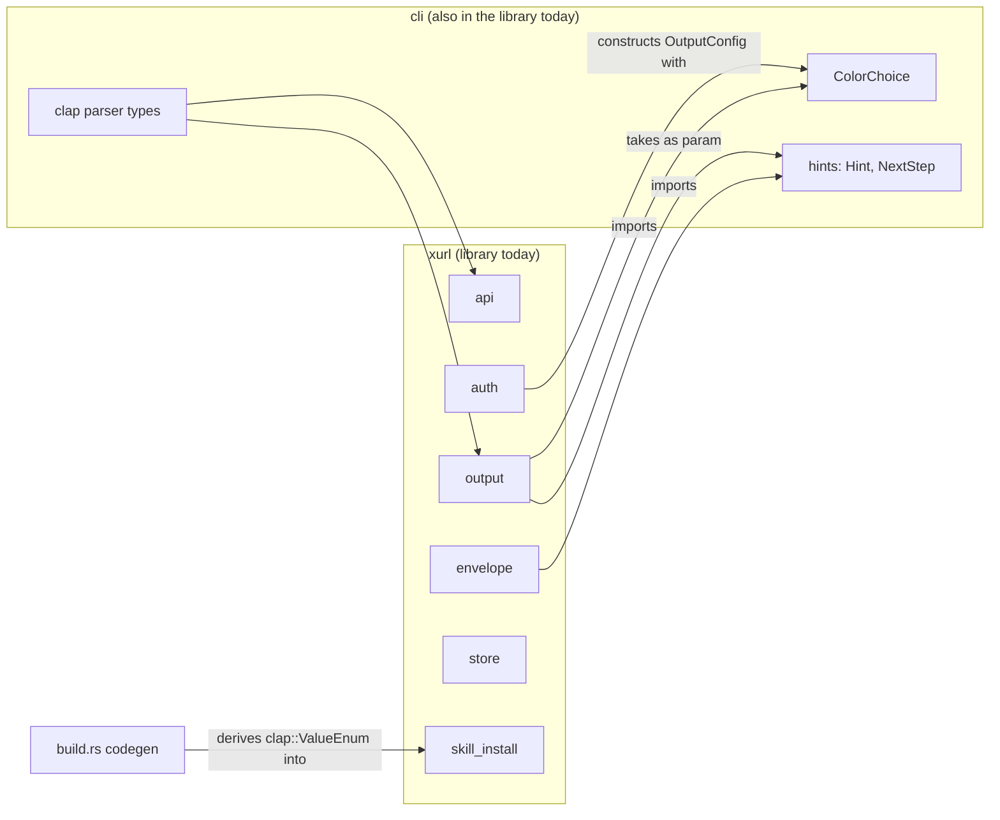
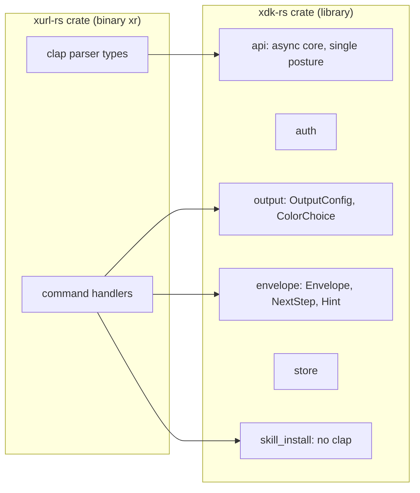
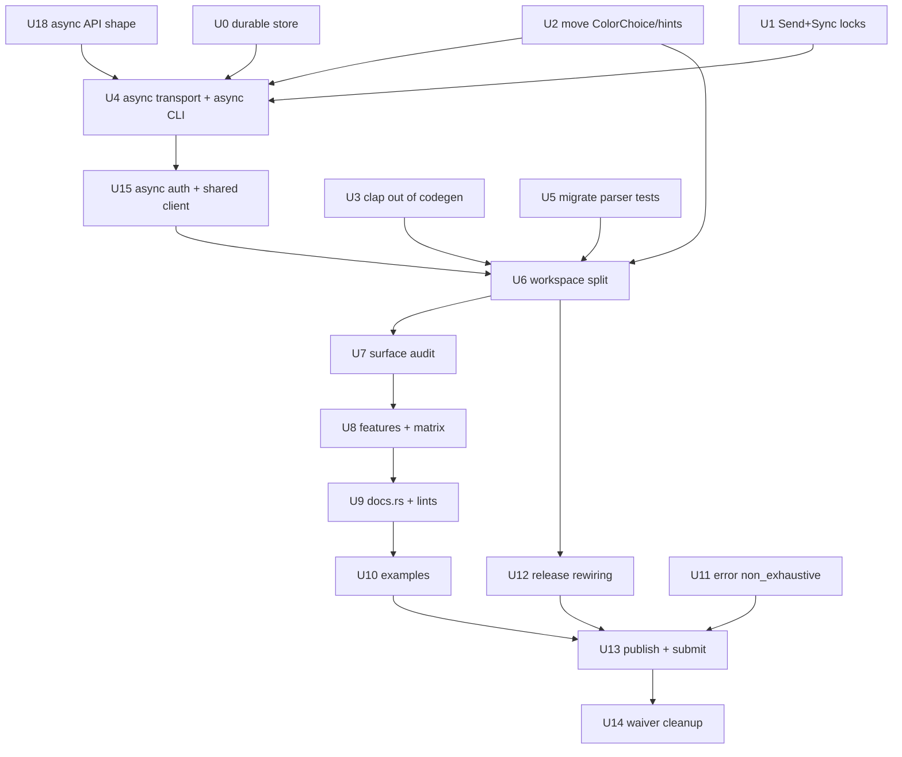

# Adoption-Grade Crate and CLI - Plan

## Goal Capsule

**Objective.** A Rust developer who needs the X API reaches for `xdk-rs` and finds it obviously alive, obviously
idiomatic, and usable from the async application they are already writing — so that it can credibly stand as the Rust
client listed on X's developer documentation.

**Means.** Harden the credential store, untangle the library from the CLI, convert the client core and the binary to
async on a single posture, split the workspace so an embedder compiles no CLI code, publish the library as a new crate
at `0.1.0`, then bring metadata, features, docs, examples, and error design up to the bar a reviewer applies when
deciding whether a crate is worth depending on.

**Authority hierarchy.** This plan, then the repo's active instructions (`AGENTS.md`, `CONTRIBUTING.md`, `CONCEPTS.md`),
then the implementer's judgment on details the plan leaves open. Where this plan and
`docs/plans/2026-09-14-1200-refactor-srp-module-boundaries-plan.md` disagree about where a type lives, this plan governs
and U2 records why.

**Stop conditions.** Stop and report rather than improvising if: the async conversion cannot preserve an existing CLI
behavior covered by a test; the Homebrew formula or the reusable release workflow cannot be made workspace-aware before
the split lands; or U17 finds the listing route unmaintained, in which case Phase C stops for a scope decision rather
than proceeding.

## Product Contract

### Summary

The crate is positioned to be the Rust entry on X's developer documentation. That means optimizing for many future
library embedders and CLI users rather than the single current consumer. The work covers the library/CLI boundary, the
async posture, the published surface, and the packaging and documentation that a prospective adopter evaluates. It does
not change what any CLI command does or what any command outputs.

### Requirements

R1. A downstream crate depending on the library compiles no CLI dependencies — no `clap`, `clap_complete`, `colored`, or
`open` — without passing any feature flags.

R2. No clap-derived type appears in the library's public API, so adding, removing, or reordering a CLI command is not a
library semver event.

R3. Client operations are callable from inside an existing async runtime without `spawn_blocking` and without a
nested-runtime panic.

R4. The library ships exactly one posture at `0.1.0`: async. Synchronous consumers own a runtime. A `blocking` facade is
an additive `0.x` minor if an embedder asks for one, never a launch requirement — adding it later is free, removing it
after adoption is a break.

R5. The TLS backend is a documented, selectable choice rather than a hardcoded one.

R6. Every module the library publishes is something an embedder has reason to call; machinery that exists only to serve
the binary is not published.

R7. docs.rs renders the library with feature annotations on gated items and at least one runnable example per major
capability.

R8. The public error type can gain variants without forcing a major version.

R9. Package metadata, lint posture, and MSRV policy meet the standard a reviewer applies to a recommended third-party
client.

R10. Existing CLI users see no behavior change, and the existing distribution channels (release artifacts, Homebrew,
binstall) keep working. **Proven, not asserted:** a golden-output baseline captured from the pre-split binary and
re-asserted byte-for-byte afterward. KTD16 moves the whole output layer across a crate boundary and KTD17 rewrites every
error Display string, so a green unit suite does not establish that `xr` still prints what it printed.

R11. The library is submitted for listing on X's community libraries page, with the repository in a state that survives
the review that follows.

R12. An embedder supplies a credential to the client directly, in code, without installing the CLI, without writing a
token-store file, and without mutating process environment variables. Time from `cargo add` to a typed response on
screen is under two minutes for a developer who already holds a credential.

R13. The library performs no terminal I/O and launches no browser. It returns data and URLs; the binary renders and
opens. No library code path writes to stdout or stderr, and `colored` and `open` are absent from the library's
dependency graph on every feature combination.

R14. The library's error type follows Rust library convention: a bare `Error` re-exported at the crate root, Display
strings that are lowercase fragments without an `Error:` prefix or trailing period, no internal control-flow sentinel in
the public enum, and a documentation pointer on the variants that have one.

R15. The crate states its breaking-change and MSRV policy, and honors it: every breaking entry in the library changelog
carries a before/after snippet, and an MSRV bump is a minor, never a patch.

R16. The getting-started artifacts are verified by machine. README Rust blocks compile as doctests, and the
credential-free example runs to completion in CI.

### Scope Boundaries

**Non-goals.**

- Changing what any CLI command does, what it prints, or what its JSON envelope contains. Output-shape changes belong to
  the separate output-shape work already in flight, which lands on its own release.
- Redesigning the domain API. `ApiClient`'s shortcut methods keep their names and meanings; only their sync/async
  posture changes.
- Adding new X API endpoint coverage.
- Splitting `src/api/shortcuts.rs` or `src/cli/mod.rs` on line count. A prior decision deliberately exempted both, and
  `docs/solutions/best-practices/rust-module-splitting-srp-not-loc-20260327.md` records why.

**Deferred to Follow-Up Work.**

- Requesting the `xurl` name on crates.io. It is X's own CLI's name, so claiming it in the Rust ecosystem would be
  presumptuous regardless of whether the current holder would release it. (For the record, they likely would not:
  crates.io is first-come-first-served with no policy that forces transfer, and the holder's crate has real content and
  live downloads rather than being an empty placeholder.)

- A `blocking` feature on the library, if a synchronous embedder asks for one. Adding it is a purely additive `0.x`
  minor with no migration, which is precisely why KTD3 declines to ship it at `0.1.0`.
- Promoting the `#[non_exhaustive]` placement rule from session memory into `docs/solutions/`, once U11 settles it.
- Evaluating `release-plz` in place of the hand-rolled two-scheme tag check and git-cliff filtering KTD12 specifies.
  `docs/solutions/integration-issues/release-plz-rust-workspace-setup.md` records a working two-crate-workspace setup
  from `payg`; dropping its `version_group` gives the independent version lines KTD9 requires, with per-package
  `git_tag_name` and `changelog_path`. Not in scope here because U12 must not also migrate release tooling.

## Planning Contract

### Key Technical Decisions

KTD1. **Untangle the library-to-CLI dependency before any structural work.** Research found the coupling runs backwards
from what the module names suggest: `src/output/mod.rs:22` imports `crate::cli::ColorChoice` and takes
`crate::cli::hints::Hint` as a parameter, `src/envelope.rs:24` imports `crate::cli::hints::NextStep` into the schema
type backing `schema/output.schema.json`, and `src/auth/mod.rs:296-308` constructs an `OutputConfig` with
`ColorChoice::Auto` and writes to stdout. Until those are resolved, neither the async conversion nor the split can
proceed, because the "library" does not currently compile without the CLI module.

KTD2. **The library becomes a new crate, `xdk-rs`, starting at `0.1.0`; `xurl-rs` becomes CLI-only at `4.0.0`.** X's own
naming already splits these two things the same way: `xurl` is its CLI, listed under Developer tools, and `xdk` is its
SDK, shipped as `pip install xdk` and `@xdevplatform/xdk`. The Rust slot in that taxonomy is empty, and the `-rs` suffix
is the convention this project already uses for it. Package `xdk-rs`, lib target `xdk`, so an embedder writes `cargo add
xdk-rs` then `use xdk::`.

The inversion is what makes the rest cheap. A published crates.io version can never be deleted or overwritten — yanking
blocks new resolution but leaves the version in the index — so `xurl-rs` cannot be rewound off 3.x. It does not need to
be: the library is new code looking for its first adopters, and `0.1.0` states that honestly. Meanwhile the CLI package
never moves, so `cargo install xurl-rs`, the Homebrew formula, `[package.metadata.binstall]`, the release workflow's
`crate:` and `bin:` inputs, and every release artifact name stay exactly as they are.

**The CLI's major bump is the lib target, not the binary.** `Cargo.toml` declares `[lib] name = "xurl"` on published
package `xurl-rs`, and `src/lib.rs` exports nine modules plus four public consts. Moving that library to `xdk-rs`
deletes the entire public library API of a published crate — the largest break Rust's compatibility rules describe, and
one the `[package.metadata.cargo-semver-checks.lints]` waiver table cannot express, because no lint key means "the lib
target is gone." `ci / Public API semver` is a required check on `main`, so a minor-versioned removal stalls U6 on a red
gate with no documented escape.

`4.0.0` states what happened and clears the gate with no waiver entries at all. The package *name* is what KTD2
protects, and the major bump does not touch it: `cargo install xurl-rs`, `brew install brettdavies/tap/xurl-rs`,
`[package.metadata.binstall]`'s `pkg-url`, the `xurl-rs-<target>` artifact names, and the `xr` binary all stay as they
are. U12 ships a `docs/migrating/v4.0.0.md` recording that the library moved, in the same form as the existing
`docs/migrating/v3.0.0.md`.

**The name carries an obligation.** `xdk` is X's SDK name, and no affiliation exists. The crate description, the README,
and the docs.rs landing text each state that plainly, and U13 raises the name explicitly when approaching the
xdevplatform maintainers rather than letting them discover it.

KTD3. **Async-only core at `0.1.0`; no blocking facade, and the CLI goes async all the way out.** `session-settled:
user-directed`; chosen over mirroring `reqwest`'s blocking module. Keeping blocking as the only posture is what makes
the crate unusable from an async application, which is most of them — but shipping *both* postures at `0.1.0` is the
irreversible direction. A `blocking` feature added later is a purely additive minor; one removed after embedders adopt
it is a break. At zero embedders, the reversible choice wins.

The facade's cost is not the `cfg` surface alone. Keeping two paths honest means equivalence-testing all 39 methods in
`src/api/shortcuts.rs` plus a count guard, permanently, to defend against a drift class that exists only because the
surface is duplicated.

Something must still own the runtime, because `xr` is a binary. That is `#[tokio::main(flavor = "current_thread")]` in
`src/main.rs` — five lines private to the binary crate, rather than a published, feature-gated API on the library.
`current_thread` is deliberate: `[dependencies] tokio` carries `rt` and not `rt-multi-thread` (`Cargo.toml:41`), so the
flavor needs no new dependency feature and starts no worker-thread pool, which protects the cold-start number this plan
gates on.

KTD4. **The clap parser types become crate-private.** `session-settled: user-directed`; chosen over `#[doc(hidden)]` and
over leaving `#[non_exhaustive]` as the answer. Governs R2. After KTD2 this is largely mechanical, because the parser
types end up in a different crate entirely.

KTD5. **Breaking changes ride `0.x` minors until the API settles, then the library reaches `1.0` and strict semver.**
`session-settled: user-directed`; chosen over forcing majors now and over carrying an accept-breaks-in-a-minor policy
indefinitely. Starting the library at `0.1.0` makes this conventional rather than exceptional: under Cargo's
compatibility rules a `0.x` breaking change bumps the minor, which is exactly what this roadmap does repeatedly. The
tightening point is publication maturity, not a date — once the async surface and the module boundaries have stopped
moving, cut `1.0` and break only on majors from there.

The `xurl-rs` CLI keeps its own 3.x line and its own release cadence; see KTD9.

KTD6. **`XurlError` gains `#[non_exhaustive]`, with a variant-set snapshot test in-crate.** A public error enum that
cannot gain a variant without a major is a liability for a crate courting embedders. The earlier objection — that a
first-party consumer matched the enum exhaustively as a deliberate drift alarm — no longer applies: that consumer is
explicitly out of scope for this plan, and its owner will adapt it afterward. The snapshot test lives in this crate,
where an exhaustive match still compiles, so drift is still caught; it just catches it here rather than downstream.

KTD7. **Feature-matrix cells that mean "this configuration alone" use `--no-default-features --features X`.** Cargo
features are additive, so a matrix that only ever adds to the default set can be fully green while never compiling the
non-default path. `docs/solutions/build-errors/rust-ci-feature-matrix-additive-gotcha.md` records this failing exactly
that way.

KTD8. **Cross-crate visibility replaces `pub(crate)` at the split boundary.** `pub(crate)` does not cross a workspace
member boundary, and it does not reach `tests/*.rs` either, since each integration test file is its own crate. Items the
binary crate or the test crates legitimately need become `pub` with `#[doc(hidden)]` where they are not embedder API,
per `docs/solutions/best-practices/rust-workspace-pub-crate-doesnt-cross-crates-2026-04-20.md`.

KTD9. **The two crates version independently.** `session-settled: user-directed`; chosen over a shared version line.
Decoupling the library's semver from CLI churn is the point of the split, and a shared line would re-couple them — a
CLI-only fix would bump the library and vice versa. The cost is real and lands on tooling: the release pipeline derives
its tag check from a single package version and git-cliff generates a repo-wide changelog, so both need a per-package
scheme, and `xr --version` stops matching the library's `CRATE_VERSION`.

KTD10. **Three build surfaces assume a single root package, and all three break on the virtual manifest.** They are
prerequisites of the split, not consequences of it: the Homebrew formula runs `cargo install` with `std_cargo_args`,
whose `--path .` fails on a virtual manifest; the reusable release workflow's `check-version` job runs a bare `cargo
pkgid`, which fails the same way; and `scripts/generate-completions.sh` selects the binary via `cargo metadata --no-deps
... .packages[0]`, which is ambiguous with two members. Each needs a package-scoped fix before U6 lands.

KTD11. **reqwest and tokio stay, confirmed against current data rather than inherited.** Checked 2026-09-16: reqwest
0.13.5 shipped eight days prior at 181.8M recent downloads, against isahc's 1.2M and surf's — dead since 2021 — 517k;
tokio 1.53.1 at 223.2M against smol's 4.6M, with async-std deprecated. For a crate whose pitch is being the safe,
obvious choice, anything else imposes a foreign runtime on every embedder. The real alternative is `hyper` plus
`hyper-util` directly for runtime agnosticism, rejected because it means hand-rolling connectors, TLS, redirects, and
decompression for a benefit almost no embedder wants. `ureq` (58M, sync-only, actively shipped) is noted only as a
blocking-path option, and carrying two HTTP stacks is worse than one.

KTD12. **The CLI keeps the `vX.Y.Z` tag line; only the library takes a prefix. Each crate carries its own changelog.**
`session-settled: user-directed`; this **reverses** an earlier symmetric-prefix decision, which was taken while the plan
asserted that distribution was unaffected. It is not. Four things are keyed to the CLI's `v*` tag, and a
`xurl-rs-v4.0.0` rename breaks all four:

1. `.github/workflows/release.yml` fires `on: push: tags: - 'v[0-9]+.[0-9]+.[0-9]+'`. A tag starting with `x` does not
   match, so **the release workflow never starts** — no binaries, no bottles, no crates.io publish, and no red run to
   notice, because no run begins.
2. `[package.metadata.binstall]`'s `pkg-url = "{ repo }/releases/download/v{ version }/..."` resolves to a tag path that
   would no longer hold the assets.
3. The Homebrew formula's `url "…/archive/refs/tags/v3.2.0.tar.gz"`.
4. The Homebrew formula's bottle `root_url "…/releases/download/v3.2.0"`.

Items 3 and 4 live in `brettdavies/homebrew-tap`, so a symmetric rename is a three-repository change whose failure mode
is a silent no-op.

So: `v4.0.0` for the CLI, `xdk-rs-v0.1.0` for the library. git-cliff filters `v*` for the CLI and `xdk-rs-v*` for the
library, by tag pattern and path, so each changelog reflects its own commits. The library is new, with no tag history
and no install paths, so a prefix there costs nothing. The asymmetry is invisible to every consumer; the symmetry it
replaces was not.

KTD13. **`xr --version` leads with the CLI version and carries the library version alongside.** `session-settled:
user-directed`. Humans see the version they installed; the verbose and JSON forms also report the `xdk-rs` version the
binary was built against, so a bug report identifies both. Costs a build-time constant, which `build.rs` already emits
for the spec metadata.

KTD15. **The client carries credentials directly, and every call is a builder.** `session-settled: user-directed`;
governs R12. A credential-carrying constructor is what makes the crate an SDK by the standard of the name KTD2 takes:
X's own `xdk` for Python puts credentials in the constructor, and U13 asks to be listed beside it. Shortcut methods
return a per-call builder terminated by `.send().await` rather than taking a trailing options struct, matching
`octocrab` and the AWS SDK. Implement it as **one generic `Call<T>` with 32 constructors**, not 32 builder types: the
endpoint closure and the per-call overrides are the only things that vary, so a single type carries both. Refines the
2026-04-03 decision recorded in `calloptions-vs-requestoptions-for-shortcuts`, whose rationale — never leak
`RequestOptions` internals to consumers — the builder preserves; `CallOptions` becomes the builder's private carrier
rather than a parameter, and KTD16 removes its `verbose` and `trace` fields.

KTD16. **Presentation and side effects leave the library; U2 moves types out, not in.** `session-settled:
user-directed`; governs R13. R1 forbids `clap`, `clap_complete`, `colored`, and `open` in the library, and two of those
four live in modules the earlier draft kept there: `colored` in `src/api/response/format.rs`, and `open` in all three
`auth/` files. `src/api/request/transport.rs` also writes to the caller's terminal directly — `:345` prints a Ctrl+C
banner to stderr and `:354` writes stream lines to stdout. So `OutputConfig`, `ColorChoice`, `Envelope`, `ErrorBody`,
`Hint`, and `NextStep` all move to the **binary** crate. `oauth2_flow` returns the authorize URL and the binary calls
`open`; `stream_request` returns a `Stream` and the binary prints the banner. Library diagnostics become `tracing`
events. This makes U2 smaller than the inbound version it replaces: one direction of travel instead of three types
moving in plus an `OutputConfig` threaded through auth.

KTD17. **The error type is `xdk::Error`, and its Display follows library convention.** `session-settled: user-directed`;
governs R14. `XurlError` is the only public identifier in the library still carrying the old brand, so this is one
rename, not a sweep. R10 survives because KTD16 hands error rendering to the binary: `print_error_with_hint` is the
single boundary where `xr` re-applies its `Auth Error:` / `HTTP Error:` prefixes, so CLI output stays byte-identical
while the library's Display stops stuttering inside an embedder's `anyhow` chain. Three assertions in
`tests/cli_tests.rs` pin the prefix text and move with the renderer.

KTD18. **Pagination is out of scope for 0.1.0.** `session-settled: user-directed`. This repository carries no pagination
contract plan, and one is designed from scratch after 0.1.0 ships. A contract written against the synchronous,
single-package shape cannot survive this plan: its signatures, its five new public module paths, and its error-surface
changes all describe code that U4, U6, U11, and U15 replace. U18's only pagination obligation is negative — leave the
`Call<T>` shape open enough that a later design is additive. It does **not** design pagination here.

The two documents a future rewrite starts from, `2026-09-03-pagination-and-result-bounding.md` and
`2026-09-04-xurl-bird-seam.md`, live in `bird/docs/designs/`. They are inputs to that rewrite, not to this plan, and
neither is normative for U18.

KTD19. **Getting-started artifacts are machine-verified.** Governs R16. `#![doc = include_str!("../README.md")]` turns
the library README's Rust blocks into doctests, so the most-read page cannot drift from the code. Every shell block in a
doctested README must be fence-tagged ```bash, because an untagged fence defaults to Rust. `cargo build --examples`
proves compilation only, so the credential-free example additionally runs to completion as a CI step.

KTD14. **`xdk-rs` is taken knowing X may one day generate a Rust XDK.** `session-settled: user-directed`.
`xdevplatform/xdk` is an SDK *generator* and the Python and TypeScript SDKs are its outputs, so a Rust output is
possible. If it appears, this crate is the hand-written idiomatic alternative rather than a duplicate — a real niche,
since generated SDKs are rarely idiomatic. The non-affiliation obligation in KTD2 is what keeps that honest.

### High-Level Technical Design

**Current dependency shape.** The arrows that break the split are the three pointing left, from library modules into
`cli`.



**Target shape.** `ColorChoice` and the hint types move into library homes; the parser crate depends on the library and
nothing depends back.



**Unit sequencing.** The three untangling units gate everything; the split gates the surface audit.



### Risks and Dependencies

**The async conversion is the whole plan's risk concentration.** It touches the transport, both OAuth2 HTTP paths, and
the callback listener, and it is the one unit where a mistake is silent rather than loud: a token refresh that works in
tests and deadlocks under a caller's runtime looks fine until an embedder reports it. Mitigation is the split into U4
and U15 with a characterization baseline captured before either, and an async-context test that is observed panicking
before the conversion starts.

**The external reusable workflow breaks unconditionally at U6, not conditionally at U12.** Its `check-version` job runs
a bare `cargo pkgid`, which errors on a virtual manifest, so every tag push fails the moment the root becomes a
workspace. The upstream changes in `brettdavies/.github` are a hard prerequisite of U6 — package-scoped `cargo pkgid`,
an artifact-name input, and two-package publish ordering — and that repo is outside this one.

**There is no embedder to measure, which makes U7 harder than it looks.** The public surface cannot be derived from
observed consumption, because the only consumer is first-party, out of scope by direction, and pinned two minors back.
U7 has to reason from what an X API client is for and what the official Python and TypeScript SDKs expose, which is a
judgment call rather than a measurement — and judgment calls made once, at `0.x`, are what `1.0` later freezes.

**A package-scoped green test run is not proof.** `cargo test -p xdk-rs` passing says nothing about whether an
out-of-package consumer still compiles.
`docs/solutions/conventions/package-test-gate-misses-app-target-exhaustive-match-breaks.md` records exactly this blind
spot. With no real embedder to build, the substitute is a scratch consumer crate in the repo that exercises the
documented surface and is compiled in CI — it stands in for the embedder the measurement no longer provides.

**Three first-party build surfaces break on the virtual manifest, and one of them is Homebrew.** The formula builds from
source via `cargo install` with `std_cargo_args`, so `--path .` fails the moment the root stops being a package — a
broken `brew install` is the most user-visible failure in the plan and the least likely to be caught by repo CI. See
KTD10.

**Accepted-break entries accumulate.** Every phase adds entries to a table whose own policy says a standing entry
understates the next break of the same kind. U14 exists to clear them, but it only fires after U13, so the table is at
its largest during the riskiest phases. Re-read the table at the head of each unit and confirm every entry still
describes a break that has not yet shipped.

**Scope creep from the audit is likely.** U7 will surface more misplacements like the `ColorChoice` one, because that
defect was only found by looking. Record each as a follow-up rather than absorbing it, unless it blocks the split.

### Assumptions

- `ApiClient` still owns `Auth` by value with no lifetime parameter. The library-ergonomics work removed `<'a>`
  specifically to make `Send + Sync` reachable; U1 verifies this before U4 depends on it.
- No downstream embedder exists yet whose compilation this plan must preserve. The one first-party consumer is
  explicitly out of scope by the owner's direction, and is not used as evidence of what the public surface should be
  either — a sample of one, written by the same author against a two-year-old pin, describes that consumer's accidents
  rather than an embedder's needs.
- The Homebrew formula, the reusable release workflow, and the completions script can each be made workspace-aware
  before U6 lands. All three are first-party and under the same ownership; see KTD10.
- The CLI becomes async itself rather than delegating to a facade (KTD3), so the binary target does **not** build
  between the transport conversion and its own, which is why U4 and U15 land as one increment.
  `src/cli/commands/streaming.rs` needs the deepest rewrite because it bypasses `ApiClient` entirely.

### Sequencing

Three phases, each independently shippable in a minor.

**Phase A — make the library a library (U18, U0, U1, U2, U3, U4, U15, U5, U6).** Ends with a workspace where the library
crate compiles with no CLI dependency, the binary crate owns clap, and both run on one async posture.

**Phase B — make it idiomatic (U7, U8, U9, U10, U11).** Published surface, features, docs, examples, error posture.

**Phase C — make it visible (U12, U13, U14).** Distribution rewiring, publishing, submission to X's community libraries
list, and deletion of the accepted-break entries once the tag moves past them.

## Implementation Units

| U-ID | Title                                                     | Files touched                                                                                                                                                                                                     | Depends on      |
| ---- | --------------------------------------------------------- | ----------------------------------------------------------------------------------------------------------------------------------------------------------------------------------------------------------------- | --------------- |
| U17  | The listing route, established (answered)                 | —                                                                                                                                                                                                                 | —               |
| U18  | Settle the async API shape                                | —                                                                                                                                                                                                                 | —               |
| U0   | Durable, lockable credential store                        | `src/store/mod.rs`, `src/auth/pending.rs`, `src/auth/oauth2.rs`, `src/auth/mod.rs`, `tests/store_tests.rs`                                                                                                        | —               |
| U1   | Lock Send + Sync as compile-time invariants               | `src/api/request/mod.rs`, `src/auth/mod.rs`, `src/config/mod.rs`, `src/error.rs`, `src/output/mod.rs`                                                                                                             | —               |
| U2   | Move presentation and side effects out of the library     | `src/output/mod.rs`, `src/envelope.rs`, `src/cli/hints.rs`, `src/cli/mod.rs`, `src/auth/mod.rs`, `src/config/mod.rs`, `src/skill_install/update.rs`, `tests/output_writer_tests.rs`, `tests/oauth2_flow_tests.rs` | —               |
| U3   | Remove clap from the generated skill-host enum            | `build.rs`, `src/skill_install/mod.rs`, `src/skill_install/update.rs`, `src/cli/mod.rs`                                                                                                                           | —               |
| U4   | Async transport core, and the CLI goes async              | `src/api/request/*`, `src/api/media.rs`, `src/cli/commands/*`, `src/cli/runner.rs`, `src/main.rs`                                                                                                                 | U0, U1, U2      |
| U15  | Async auth paths, one shared HTTP client                  | `src/auth/{mod,oauth2,callback}.rs`, `src/api/request/auth_header.rs`                                                                                                                                             | U4              |
| U5   | Migrate parser-introspection tests                        | `tests/cli_tests.rs`, `tests/cli_run_tests.rs`, `tests/oauth2_flow_tests.rs`, `tests/binary_contract_tests.rs`, `tests/unknown_command_tests.rs`, `src/cli/mod.rs`                                                | U2              |
| U6   | Split into a workspace                                    | `Cargo.toml`, `crates/**`, `tests/**`, `build.rs`, `scripts/hooks/pre-push`, `scripts/generate-completions.sh`, `.github/workflows/ci.yml`                                                                        | U2, U3, U5, U15 |
| U7   | Audit and close the published surface                     | `crates/xdk/src/lib.rs`, module roots                                                                                                                                                                             | U6              |
| U8   | TLS feature design and the CI matrix                      | `Cargo.toml`, `.github/workflows/ci.yml`                                                                                                                                                                          | U7              |
| U9   | docs.rs metadata, lints, rustdoc posture                  | `Cargo.toml`, `crates/xdk/src/lib.rs`                                                                                                                                                                             | U8              |
| U10  | Runnable examples                                         | `crates/xdk/examples/**`                                                                                                                                                                                          | U9              |
| U11  | `XurlError` non-exhaustive, `exit_code()` made exhaustive | `src/error.rs`, `Cargo.toml`                                                                                                                                                                                      | —               |
| U12  | Rewire release and distribution for the split             | `.github/workflows/release.yml`, `Cargo.toml`, `docs/migrating/v4.0.0.md`, Homebrew formula                                                                                                                       | U6              |
| U13  | Publish and submit for listing                            | `README.md`, `Cargo.toml`                                                                                                                                                                                         | U10, U11, U12   |
| U14  | Delete the accepted-break entries                         | `Cargo.toml`                                                                                                                                                                                                      | U13             |

### U17. The listing route, established

**Status.** Answered 2026-09-16. Recorded here because it changes U13 and clears the Phase C stop condition.

**Finding: the route is a pull request, not a forum post.** X's documentation is the public `xdevplatform/docs`
repository, pushed the same day this was checked, and the page in question is `tools-and-libraries.mdx` at its root.
Merged pull requests there run daily.

**The forum route is weak by comparison.** The Libraries, SDKs, and sample code category is active but is almost
entirely unanswered support questions, and the one historically comparable post — a 2022 announcement of a new
Dart/Flutter v2 library, the same shape of submission this crate would make — drew zero replies.

**Caveat.** Recent merged pull requests in the docs repo are internal: their Mintlify bot and X staff. External
contribution throughput is unproven from that window, though 20 forks and 89 open issues show outside engagement exists.
So the route is open and concrete, not guaranteed.

**Consequence.** Phase C proceeds. U13 opens a pull request against `tools-and-libraries.mdx` and treats the forum as a
secondary signal rather than the primary channel.

### U18. Settle the async API shape

**Goal.** Decide the library's async surface before any of it is written, because `0.1.0` is where these choices start
setting.

**Requirements.** R3, R4.

**Dependencies.** None. Must complete before U4.

**Approach.** Produce KTDs, not code. Four questions, each of which U4 would otherwise improvise:

- **Receiver shape.** `ApiClient::send_request` takes `&mut self` today, which makes concurrent use impossible: an
  embedder cannot share one client across tasks, and each task holding its own client is what lets two token refreshes
  clobber each other. `reqwest::Client` is the model — `&self`, cheap `Clone`, `Send + Sync`, connection pool shared
  internally. Decide the receiver and what interior mutability the token store needs to match it. This is the decision
  with the longest shadow; converting the transport to async without it satisfies R3's letter and misses its point.
- ~~Whether the blocking facade earns its place.~~ **Answered by KTD3.** No facade at `0.1.0`; the CLI is async
  throughout and owns one `current_thread` runtime in `src/main.rs`. Sync callers own a runtime or wait for an additive
  `blocking` minor. Do not reopen this in U4.
- ~~Pagination.~~ **Out of scope at 0.1.0 by KTD18.** Do not design it here, and treat nothing in `bird/docs/designs/`
  as normative for this unit — pagination is designed from scratch after 0.1.0 ships. The only obligation is negative:
  confirm the `Call<T>` shape below can gain a paging terminator later without reshaping, so the eventual design is
  additive.
- **Credential entry, and the per-call builder.** Settled in shape by KTD15; fix the exact signatures here. A client
  builder takes a bearer token, an OAuth2 token, or OAuth1 credentials directly, so R12 holds without the CLI, a
  token-store file, or `env::set_var` — which edition 2024 makes `unsafe`, so the env path is not a workaround an
  embedder can reach for. Shortcut methods return `Call<T>`; `.send().await` terminates. Decide which credential the
  docs.rs landing example uses and state what that credential can and cannot do — a Bearer landing example whose next
  line is `create_post` fails, because Bearer is read-only.
- **Error surface.** The type is `xdk::Error` per KTD17. Fix here whether `NextAction` — the closed recovery enum —
  stays on the library error when KTD16 moves the hint strings to the binary. It must: a bare 403 on X's Pay-per-use
  enrollment failure is unactionable, and `NextAction::EnrollApp` is the machine-readable half an embedder can branch
  on. The `xr`-prefixed `command` and `template` strings stay in the binary.
- **Cancellation and timeouts.** What a caller can cancel, what happens to an in-flight token refresh when they do, and
  where per-request timeouts sit relative to the client-level one.
- **Signal ownership — settle the API shape here.** The library takes a `CancellationToken` and never registers a signal
  handler; the binary owns `tokio::signal`. Fix the exact signature of `wait_for_callback_with` in this unit, and
  confirm the same token carries the Drop-safety cancellation U15 needs. At `0.1.0` this signature is cheap to change;
  at `1.0` it is not.

**Execution note.** Ground each decision in what current, maintained crates do — `reqwest` itself, `octocrab`, the AWS
SDK — rather than in any single prior art. The earlier draft of this plan inherited a 2022 crate's feature names and was
wrong about them; that is the failure mode to avoid.

**Test scenarios.**

- Test expectation: none — this unit produces decisions, not behavior. Replacement verification is that U4 and U15 each
  cite the KTD they implement.

**Verification.** The KTDs exist, name their rejected alternatives, and each downstream async unit references one.

### U0. Durable, lockable credential store

**Goal.** Credential writes survive a crash, a concurrent writer, and a restrictive umask. This is a present-day bug
with no async dependency; it is sequenced before U4 because R3 makes concurrent use the headline capability and the
store is not ready for it.

**Requirements.** R3 (prerequisite), R10.

**Dependencies.** None. Gates U4.

**Approach.** Three defects in one function, `src/store/mod.rs:503`:

```rust
fs::write(&self.file_path, data)?;                      // truncate-then-write, no lock, no fsync
#[cfg(unix)] { fs::set_permissions(&self.file_path, Permissions::from_mode(0o600))?; }  // after the tokens land
```

1. **Non-atomic write.** A crash or a second process mid-write leaves a truncated file, and `refuse_if_load_failed` then
   refuses every subsequent write until the user hand-edits `~/.xurl`.
2. **Permission window.** `fs::write` creates with the umask default (typically `0644`) and narrows afterward, so
   freshly-minted OAuth tokens are world-readable for the interval.
3. **Lost updates.** `save_to_file` serializes the whole app map from its own in-memory snapshot, so the second of two
   writers overwrites the first's rotated refresh token. Every later refresh fails until the user re-authenticates.

The correct writer already exists in this repo at `src/auth/pending.rs:96-113`, for the *less* important file:
`OpenOptions::create_new(true)` with `.mode(0o600)` set at open time, then `write_all` → `flush` → `sync_all` →
`fs::rename`. Extract it into one shared helper and route both callers through it. Setting the mode at open time is what
closes the window for every save rather than only the first, because the temp file is always newly created.

**The lock must be an OS file lock, not an in-process one.** `xr` is a binary: the race that loses a refresh token is
two `xr` **processes** — two terminals, a shell loop, a CI matrix, an agent fanning out calls. A `std::sync::Mutex` or a
`tokio::sync::Mutex` is invisible across that boundary and fixes nothing. Use `flock`/`fcntl` on unix and `LockFileEx`
on windows, on a sidecar lock path beside the store, held across the whole read-modify-write window. R3's async
concurrency is this lock's second consumer, not its first.

**Ride-along (Issue 10).** The same unit may take the timeout fallback described in U15, since it is also a present-day
bug in the same subsystem: `.unwrap_or_else(|_| Client::new())` at `src/auth/oauth2.rs:114,480` and
`src/auth/mod.rs:409` silently discards the configured `http_timeout_secs` and yields an unbounded client.

**Test scenarios.**

- Integration: two `xr auth` processes write the same store concurrently; both apps are present afterward and the
  rotated refresh token survives. Use `common::xr_with_store`, which already points `XURL_TOKEN_STORE` at the test's own
  temp store.
- Error path: a process killed mid-write leaves the previous file intact and parseable — `refuse_if_load_failed` never
  trips. Observe the corruption against today's code first.
- Edge case: the store file's mode is `0600` at every observation point, including immediately after first creation.
  Copy the assertion form from `tests/auth_pending_tests.rs:82-92`.
- Happy path: two tasks in one `#[tokio::test]` against one store path both land.
- Rename the false green: `tests/store_tests.rs:914 test_concurrent_app_operations` is a sequential `for` loop over one
  binding with no threads or processes. It is a fine test; its name claims coverage the suite does not have, which is
  how this gap stayed invisible. Rename it `test_many_apps_stay_isolated`.

**Verification.** `cargo test`, plus the two-process test observed failing against today's `fs::write` path before the
fix lands.

### U1. Lock Send + Sync as compile-time invariants

**Goal.** Turn "async is reachable" from a claim into a compile error if it ever stops being true.

**Requirements.** R3.

**Approach.** Add a zero-cost assertion per public type, in this form:

```rust
const _: fn() = || {
    fn _assert_send_sync<T: Send + Sync>() {}
    _assert_send_sync::<ApiClient>();
};
```

Three lines each, no new dependency. Cover `ApiClient`, `Auth`, `Config`, `XurlError`, and `OutputConfig`. First verify
`ApiClient` still owns `Auth` by value with no lifetime parameter; if a lifetime has crept back, fixing that is this
unit's real work and U4 depends on it.

**Patterns to follow.** `docs/solutions/architecture-patterns/bird-library-lift-2026-06.md` documents this assertion
form. `src/output/mod.rs:60-61` already states the intent in a doc comment.

**Test scenarios.**

- Happy path: the crate compiles with all five assertions present.
- Error path: temporarily adding a `Rc<()>` field to one of the five types fails the build at the assertion rather than
  at a distant call site. Observe this failure before removing the field.

**Verification.** `cargo build` and `cargo clippy --all-targets -- -D warnings`.

### U2. Move presentation and side effects out of the library

**Goal.** Remove every dependency that points from library code into `src/cli/`, remove clap from the library types that
already carry it, and remove the library's terminal I/O and browser launching.

**Requirements.** R1, R2, R6, R13.

**Direction of travel — outward, per KTD16.** The inbound alternative — move `ColorChoice`, `Hint`, and `NextStep`
*into* library homes and thread an `OutputConfig` through auth — is rejected: it satisfies the compiler and fails R1 and
R6, leaving the library owning a terminal formatter no embedder calls. The presentation layer leaves instead.

To the binary crate: `OutputConfig`, `ColorChoice`, `Envelope`, `ErrorBody`, `Hint`, `NextStep`, and the
`schema/output.schema.json` generation that backs them. The closed `NextAction` enum is the exception and stays on the
library error per U18 — it is the machine-readable recovery signal, and only its `xr`-prefixed `command` and `template`
strings are CLI-shaped.

**The two R1 names no gate was checking.** R1 forbids four dependencies and the plan's only check was `cargo tree -p
xdk-rs -i clap`. Two of the other three live in library modules:

- `colored` at `src/api/response/format.rs` — response formatting for terminal display. Moves to the binary crate.
- `open` at `src/auth/{mod,oauth2,callback}.rs` — launches a browser. `oauth2_flow` returns the authorize URL; the
  binary calls `open`. A library that seizes the user's browser is the defect, not the dependency edge.

**Terminal writes in the transport.** `src/api/request/transport.rs:345` prints `--- Press Ctrl+C to stop ---` to stderr
and `:354` writes stream lines to stdout. `stream_request` returns a `Stream` instead; the binary prints the banner and
drives the loop. Diagnostics that survive become `tracing` events, which is what an embedder already has a subscriber
for. Removing `verbose` and `trace` from the per-call surface is KTD15's half of the same change.

This replaces, rather than supplements, the inbound move:
`docs/solutions/best-practices/rust-library-cli-separation-for-interactive-concerns-2026-04-20.md` is the governing
pattern for all of it, not only for the `src/auth/mod.rs:296-308` case the earlier draft cited.

Relocating the types is not sufficient on its own. `ColorChoice` derives `clap::ValueEnum` (`src/cli/mod.rs:22`), so
moving it would carry clap into `src/output/` — and `OutputFormat` already derives it there today
(`src/output/mod.rs:19` and `:28`), which means the library depends on clap right now, before any of this work starts.
Drop the `ValueEnum` derive and the `use clap::ValueEnum` import from both types, and give the binary crate value
parsers for `--color` (`src/cli/mod.rs:899-902`) and `--output` (`src/cli/mod.rs:811`) using the newtype or `FromStr`
pattern U3 applies to `SkillHost`. The orphan rule stops the binary crate from implementing `clap::ValueEnum` on a
library type, so a wrapper is required rather than a bare impl.

**Fix every reference in this unit, tests included.** U5 is the parser-coupling unit, not the repointing unit. If the
four test references below wait for U5, `cargo test` does not compile between U2 and U5, U2 cannot report a passing
gate, and the plan gains a second non-building window in its riskiest phase. This is a recorded prior failure in this
repo: signature changes and their test updates belong in one atomic unit.

- `tests/output_writer_tests.rs:721,759` — `xurl::cli::ColorChoice::{Always,Never}` → `xurl::output::ColorChoice`
- `tests/output_writer_tests.rs:809` — `xurl::cli::hints::NextStep::select_app` → `xurl::envelope::NextStep`
- `tests/oauth2_flow_tests.rs:206` — `xurl::cli::ColorChoice::Auto` → `xurl::output::ColorChoice`

Two more files the original inventory missed and this unit must also cover:

- `src/skill_install/update.rs:270,305,345` — `crate::cli::ColorChoice::Never` in the `#[cfg(test)]` block (line 189
  onward). Test-only, but it still has to resolve.
- `src/config/mod.rs:69,110` — intra-doc links into `crate::cli::runner::{run_with_overrides,run}`. These are valid
  today (`RUSTDOCFLAGS="-D warnings" cargo doc --no-deps` exits 0, verified) and become `broken_intra_doc_links` after
  U6. U9 runs exactly that command as its gate, so leaving them here surfaces the break two units and one phase away
  from its cause. Repoint them at the binary crate or delink them.

**Execution note.** This unit re-litigates a verdict in
`docs/plans/2026-09-14-1200-refactor-srp-module-boundaries-plan.md`, which recorded `src/cli/hints.rs` as settled "CLI
code". Record the reversal and its reason in the unit's commit message; the evidence is that library modules import
those types.

**Patterns to follow.** The directory-promotion and re-export mechanics in
`docs/solutions/best-practices/module-directory-promotion-pattern-2026-04-22.md`.

**Test scenarios.**

- Happy path: `schema/output.schema.json` regenerates byte-identical after the type moves.
- Integration: `cargo test` passes with no change to any assertion about envelope shape.
- Edge case: a library-only build (temporarily commenting out `pub mod cli` in `src/lib.rs`) compiles, and `cargo tree
  -i clap` against that build returns nothing. This is the real proof; run it, observe it, then restore.
- Happy path: `xr --color never` and `xr --output json` still parse and behave identically through the new parsers.
- Error path: an invalid `--color` or `--output` value produces the same error text and exit code as before.

**Verification.** `cargo test`, `bash scripts/generate-response-schemas.sh` with a clean `git status`, and the
library-only build above.

### U3. Remove clap from the generated skill-host enum

**Goal.** Stop `build.rs` from deriving a clap trait into library code, and remove the library's production use of that
trait.

**Requirements.** R1.

**Approach.** `build.rs:120` emits `#[derive(Clone, Copy, Debug, PartialEq, Eq, ::clap::ValueEnum)]` for the generated
`SkillHost`. Dropping that derive is not self-contained: two production call sites iterate
`SkillHost::value_variants()`, a `ValueEnum` trait method — `src/skill_install/mod.rs:325` in `run_for_all_hosts` (the
module's test block does not start until line 376) and `src/skill_install/update.rs:153` in `run_update_multi`. Have
`build.rs` also emit a `const ALL: &[SkillHost]` alongside the existing `KNOWN_HOSTS` and repoint both loops at it. Then
give the binary crate a newtype or `FromStr`-based value parser so `xr skill install <host>` keeps accepting the same
values.

**Test scenarios.**

- Happy path: `xr skill install claude_code --dry-run` accepts the same host names as before.
- Happy path: `xr skill install --all --dry-run` still enumerates every host, exercising both converted loops.
- Error path: an unknown host still produces the same error text and exit code.
- Edge case: `xr skill install --help` still lists every host.
- Edge case: `xr skill update --all --dry-run` enumerates every host through the `update.rs` loop.

**Verification.** `cargo test --test cli_tests`, plus running the five commands above against the built binary.

### U4. Async transport core, and the CLI goes async

**Goal.** The request layer sends over an async client with the runtime owned by the caller, and the binary owns exactly
one runtime, privately.

**Requirements.** R3, R4.

**Landing note.** U4 and U15 land as **one increment**. Making the transport async makes the whole shortcut surface
async, so the binary does not build until its own conversion lands with it. Gate U4 on `cargo check --lib` plus its new
async tests; the full `cargo test` gate applies to the combined increment at the end of U15.

**The CLI conversion, measured.** Per KTD3 there is no facade, so the binary converts rather than delegating. The work
is mechanical and bounded:

- `src/main.rs` becomes `#[tokio::main(flavor = "current_thread")] async fn main()`. `current_thread` is required, not
  preferred: `[dependencies] tokio` carries `rt` and not `rt-multi-thread` (`Cargo.toml:41`), and a CLI should not spawn
  a worker pool it never uses.
- `src/cli/runner.rs` — all four layered entrypoints become `async fn`: `run_argv` (`:53`), `run` (`:66`),
  `run_with_store_path` (`:97`), `run_with_overrides` (`:126`).
- 40 call sites gain `.await`: `src/cli/commands/mod.rs` (37), `streaming.rs` (2), `media.rs` (1). ~37 functions across
  the 7 files in `src/cli/commands/` (2,101 LOC) become `async fn`.
- 17 test references across `cli_tests.rs`, `cli_run_tests.rs`, `unknown_command_tests.rs`, `binary_contract_tests.rs`,
  `oauth2_flow_tests.rs`, and `store_isolation_guard.rs` gain `#[tokio::test]`. `tokio` with `rt-multi-thread` and
  `macros` is already a dev-dependency.
- `src/cli/commands/streaming.rs` is rewritten onto `ApiClient`'s transport. It currently builds its own
  `reqwest::blocking::Client` at `:50`, spawns its own current-thread runtime for the shutdown watcher, and calls
  `get_auth_header_public` directly — the method U15 makes async. The binary must carry one HTTP client whose TLS
  selection follows the U8 features, not a second stack resolving its own backend.

**Verify, do not assume — SIGPIPE.** `src/main.rs:3-6` resets `SIGPIPE` to `SIG_DFL` before anything runs, because Rust
masks it and closed pipes panic. Under `#[tokio::main]` that reset moves after runtime construction, and tokio's
`signal` feature is enabled (`Cargo.toml:41`). Prove the behavior with an actual piped run — `xr <cmd> | head -1` exits
clean — not with a unit test.

**Approach.** Convert `src/api/request/transport.rs` from `reqwest::blocking` to async — `send_request`,
`send_multipart_request`, and `stream_request` — and the `Client` field on `ApiClient` in `src/api/request/mod.rs`.
Every caller follows: `src/api/shortcuts.rs` alone holds the call sites behind the 27 shortcut methods, plus
`src/api/media.rs` and `src/api/endpoints.rs`. Store one `reqwest::Client` on the struct rather than building one per
request. `src/api/media.rs:315` polls processing status with `thread::sleep`, which would park the caller's executor
thread; it becomes `tokio::time::sleep` on the async path. Do not touch the auth paths here; U15 owns those.

**Execution note.** Characterization-first, and the order matters. Write the async-context test described below and
observe it failing against today's code before converting anything — the nested-runtime panic is the defect being fixed,
so it has to be seen first. `reqwest`'s own `blocking` module documents this panic, so the failure is expected rather
than incidental.

**Patterns to follow.** `docs/solutions/best-practices/rust-store-http-client-on-struct-not-per-request-2026-04-20.md`.

**Test scenarios.**

- Error path: calling a shortcut method from inside `#[tokio::test]` panics on the nested runtime today. Observe this
  before converting.
- Happy path: the same call succeeds after conversion, without `spawn_blocking`.
- Edge case: a streaming request is cancellable mid-stream and releases its connection.
- Integration: media upload still completes its initialize, append, and finalize sequence. Already covered at
  `tests/api_tests.rs:1096`; keep it green.
- Edge case: a media upload whose processing poll sleeps does not block other tasks on the same runtime. **This branch
  has never executed in a test.** The existing STATUS mock (`tests/api_tests.rs:1099`) returns `processing_info.state =
  "succeeded"` immediately, so `thread::sleep` at `src/api/media.rs:315` is never reached. Register an `in_progress`
  response with a `check_after_secs` ahead of the `succeeded` one so the sleep path runs.
- Integration: the full CLI suite passes with the binary async throughout — same test count as before the conversion.
- Integration: `xr stream` works through `ApiClient`'s transport rather than its own client.
- Edge case: `xr <cmd> | head -1` exits clean rather than panicking (SIGPIPE under `#[tokio::main]`). An actual piped
  run.

**Verification.** `cargo check --lib`, `cargo clippy --all-targets -- -D warnings`, and the new async tests. The full
suite runs at the end of the U4+U15 increment. Also measure `xr` release binary size and cold-start time against the
last tag before U4 and record the result — the async runtime is now the CLI's, not a facade's, so this number is the
conversion's direct cost. The standing CI ceiling U6 adds is what keeps it honest afterward.

### U15. Async auth paths, one shared HTTP client

**Goal.** Token exchange, refresh, and the OAuth2 callback listener stop creating their own runtimes — and stop creating
their own clients.

**Requirements.** R3.

**Dependencies.** U4. Closes the increment U4 opens; see U4's landing note.

**Approach.** `src/auth/oauth2.rs` builds blocking clients at lines 111, 114, 477, and 480 for token exchange and
refresh; `src/auth/mod.rs:404` and `:409` build one for `fetch_username`. Convert all of them to **the** async client,
singular — not to three new ones.

**One client, and a fallback that fails loudly.** The same four-line block appears three times, inside a function body,
rebuilt on every call:

```rust
let client = reqwest::blocking::Client::builder()
    .timeout(Duration::from_secs(auth.http_timeout_secs()))
    .build()
    .unwrap_or_else(|_| reqwest::blocking::Client::new());
```

Two defects, not one. Each build allocates a new connection pool and reloads the TLS root store, and a single OAuth2
sign-in does exchange plus `fetch_username` plus the transport's own — three per run. Worse, `.unwrap_or_else(|_|
Client::new())` discards the configured timeout: `Client::new()` has none, so a hung refresh hangs `xr` forever while
`http_timeout_secs` is silently ignored.

Follow `docs/solutions/best-practices/rust-store-http-client-on-struct-not-per-request-2026-04-20.md` — the same
document U4 cites, which U4 then scopes away from these paths. One client, constructed once, shared by the transport and
by auth. Ownership follows U18's receiver decision; do not settle it here, only require that there is one. Replace the
fallback with a returned error at all three sites: a client that cannot honor its configured timeout is a startup
failure, not a silently unbounded client.

Sharing the client makes the fallback broader, not narrower — one bad construction would put the whole process on a
timeout-free client — so the two changes have to land together. `src/auth/callback.rs:289-294` already runs an async
accept loop wrapped in a `block_on` shim at `wait_for_callback_with` — remove the shim and let the async version be the
real API. Conversion ripples into `src/api/request/auth_header.rs` (`get_auth_header`, `get_auth_header_public`) and the
`src/cli/commands/` call sites.

Two hazards the shim currently hides:

- **Drop safety.** Today the owned `current_thread` runtime guarantees the spawned accept loops die when
  `wait_for_callback_with` returns by any path. As a plain async fn, spawned tasks detach from the parent future, so a
  caller wrapping the await in `tokio::select!` or a timeout drops the future and never reaches the `h.abort()` cleanup
  — leaving the loopback redirect port bound for the process lifetime. Hold the handles in a struct whose `Drop` cancels
  the token and aborts every handle.
- **Signal handling. Settled: the library stops touching signals.** `shutdown_signal()` at `src/auth/callback.rs:28-48`
  calls `tokio::signal::unix::signal(SignalKind::terminate())`, which registers a **process-global** handler and
  permanently changes that signal's disposition for the whole process — it is not scoped to the future awaiting it.
  Inside an embedder's service that silently breaks their orchestrator's graceful shutdown, with nothing pointing at
  `xdk-rs`. Move `shutdown_signal()` to the binary crate; `wait_for_callback_with` takes a caller-supplied
  `CancellationToken` instead. `tokio-util` with `rt` is already a dependency (`Cargo.toml:42`), and this is the same
  token the Drop-safety fix above needs — one mechanism, not two. Record the API shape in U18 with the other async-shape
  decisions rather than improvising it here.

**Concurrency and the credential store.** Owned by **U0**, which lands before U4. The store's non-atomic write, its
permission window, and its lost-update race are present-day bugs with no async dependency; R3 is their second consumer,
not their first. This unit inherits a store that is already durable and lockable, and must not re-derive one.

**Test scenarios.**

- Integration: the OAuth2 PKCE callback flow completes against the local listener through its async path.
- Error path: a token refresh triggered from inside a caller's runtime completes rather than deadlocking. Write this
  before converting and observe the current behavior.
- Edge case: dropping the listener future mid-wait releases the port, proven by rebinding it immediately afterward.
  **This is not the same test as `tests/callback_tests.rs:338`** —
  `external_cancellation_returns_quickly_with_typed_error` cancels *through the API*, which still reaches the
  `h.abort()` cleanup. The hazard here is the future being **dropped** by a `tokio::select!` or a timeout, which
  detaches spawned tasks and leaves the loopback port bound for the process lifetime. Write a test that drops the
  future.
- Edge case: the callback listener still honors its shutdown signal.
- Error path: a refresh against a server that never responds gives up at `http_timeout_secs` rather than hanging.
- Error path: a client-builder failure surfaces an error rather than a timeout-free client.
- Happy path: one client instance serves the transport, `exchange_code_for_token`, and `fetch_username` across a single
  OAuth2 run.
- Error path: a refresh the server rejects still surfaces the same error variant and exit code as today.

**Verification.** `cargo check --lib` plus the new async tests; the interactive listener path exercised end to end (note
that the headless flow, `run_remote_step1`/`run_remote_step2`, never touches the listener, so it does not cover this
unit).

### U5. Migrate parser-introspection tests

**Goal.** Remove the test-suite dependency on parser types being public, which is a confirmed compile break under U6.

**Requirements.** R2.

**Approach.** Six files import `xurl::cli::` today. `tests/cli_tests.rs` and `tests/cli_run_tests.rs` are the
substantial ones: they call `Cli::try_parse_from`, match on `Commands` and `AuthCommands`, and call `Cli::command()`.
Move assertions that genuinely test parsing into `#[cfg(test)]` unit tests inside `src/cli/`, where same-crate access is
full. Keep assertions that test observable behavior in `tests/`, rewritten to go through the argv entrypoint or
`assert_cmd`. The `ColorChoice` and `NextStep` repoints in `tests/output_writer_tests.rs` and
`tests/oauth2_flow_tests.rs` are **U2's work, not this unit's** — they ride with the relocation so no unit gate ever
runs against a non-compiling suite. `tests/oauth2_flow_tests.rs` still needs this unit, though: it also calls
`xurl::cli::runner::run_with_overrides` (line 331), which the split moves to the binary crate, so the file itself moves
with it.

**Execution note.** Some parser assertions get weaker when expressed behaviorally and some become impossible. Where that
happens, move the assertion into a unit test rather than dropping it; record any assertion that genuinely cannot
survive.

**Test scenarios.**

- Happy path: the boolean-flag-does-not-swallow-the-next-word assertion survives the move and still fails when that
  regression is reintroduced. Reintroduce it, observe the failure, revert.
- Integration: the subcommand `Examples:` lock still walks every subcommand.
- Edge case: `tests/store_isolation_guard.rs`, which scans every file under `tests/`, still passes with the new file
  set.

**Verification.** `cargo test`, and a count comparison of passing tests before and after.

### U6. Split into a workspace

**Goal.** A library crate with no CLI dependencies, and a binary crate that owns clap.

**Requirements.** R1, R2, R10.

**Hard prerequisite.** The reusable `brettdavies/.github` release workflow breaks the moment the repo root becomes a
virtual manifest, and it breaks unconditionally, not contingently: its `check-version` job runs a bare `cargo pkgid`,
which errors on a virtual manifest. Land the upstream changes **before** starting this unit — package-scoped `cargo
pkgid -p <library>`, an artifact-name input so releases keep the `xurl-rs-<target>` prefix the Definition of Done
requires, and two-package publish ordering.

**Pre-flight gates — derive the inventory, do not trust a written list.** The file lists in this plan were built by hand
and were verifiably incomplete when reviewed. Run these before the split starts; each must return empty or exit 0.

```bash
# No library module may reference cli — code OR intra-doc links.
rg 'crate::cli' src/ --glob '!src/cli/**' --glob '!src/main.rs'   # must be empty

# Enumerate what actually must move to the binary crate. Regenerate; do not trust a count.
rg -l 'CARGO_BIN_EXE_xr|mod common|common::' tests/               # 11 of 28 files today

# Build scripts address source by string literal, so no compiler error fires when the target moves.
rg -n "src/[a-zA-Z0-9_/.]+" build.rs                              # every hit must move with its crate

RUSTDOCFLAGS="-D warnings" cargo doc --no-deps                    # passes today; must still pass
```

**`build.rs` is a loud-failure surface, and this unit relocates what it points at.** `build.rs:44` resolves
`manifest_dir.join("src/skill_install/skill.json")` and `:47-48` reads it with `.unwrap_or_else(|e| panic!("read {}:
{e}", ...))`, so a moved `skill.json` fails the build rather than degrading quietly. `:45` emits a second hardcoded
literal, `cargo:rerun-if-changed=src/skill_install/skill.json`, which does not panic and instead goes silently stale,
leaving the generated host enum un-regenerated when `skill.json` changes. Both literals move to the binary crate's
`build.rs` with the directory. Loud is the better failure here, but `manifest_dir` resolves per-crate, so the panic only
fires if the literal is left behind in the wrong crate's build script; splitting `build.rs` correctly is what makes it
fire at all.

**Approach.** Convert the root `Cargo.toml` to a workspace with two members. The library becomes the `xdk-rs` package
(lib target `xdk`) per KTD2. The binary crate takes `src/cli/`, `src/main.rs`, clap, and the terminal dependencies.
`pub(crate)` seams at the new boundary become `pub` with `#[doc(hidden)]` where they are not embedder API. Update
`scripts/hooks/pre-push` path scoping, `scripts/generate-completions.sh` (it selects the binary via `cargo metadata
--no-deps ... .packages[0]`, which is ambiguous with two members and backs the completions-freshness gate), and the
`semver` job in `.github/workflows/ci.yml` to target the library package.

**`skill_install` goes to the binary crate, and `build.rs` splits with it.** U7 calls `skill_install` binary machinery
that should not be published, and it is right — but that is a crate move, not a `pub` downgrade, so it belongs here
while the files are already moving. `build.rs` does three jobs for what become two crates, and `OUT_DIR` and
`cargo:rustc-env` are per-crate: one crate cannot `include!` another's `OUT_DIR`.

| Destination       | build.rs job                   | Emits                                                   | Consumed by                                                    |
| ----------------- | ------------------------------ | ------------------------------------------------------- | -------------------------------------------------------------- |
| `crates/xdk`      | `emit_auth_matrix` (`:308`)    | `$OUT_DIR/auth_matrix.rs`                               | `src/api/auth_matrix.rs:115`, `auth_header.rs`, `error.rs:252` |
| `crates/xdk`      | spec metadata (`:456-508`)     | `cargo:rustc-env=XURL_API_SPEC_*`, `XURL_CRATE_GIT_SHA` | `src/lib.rs` public consts                                     |
| `crates/xurl-cli` | `emit_generated_hosts` (`:26`) | `$OUT_DIR/generated_hosts.rs`                           | `src/skill_install/mod.rs:71`                                  |

`vendor/` follows `auth_matrix` into the library. `src/skill_install/` and `src/skill_install/skill.json` follow
`generated_hosts` into the binary crate. Doing this here also simplifies U3: once the enum lives in the binary crate its
`clap::ValueEnum` derive is no longer a library dependency at all, though U3's `const ALL` change is still required for
the two production loops at `src/skill_install/mod.rs:329` and `update.rs:155`.

**Manifest partition.** `Cargo.toml` does not split by intuition. Cargo honors `[profile.*]` **only** in the
workspace-root manifest and warns `profiles for the non root package will be ignored` everywhere else, so a
`[profile.release]` that travels with the CLI silently loses `lto`, `strip`, and `codegen-units = 1`.

| Block                                                           | Home              | Note                                                                                                                                    |
| --------------------------------------------------------------- | ----------------- | --------------------------------------------------------------------------------------------------------------------------------------- |
| `[profile.release]` (`Cargo.toml:96-101`)                       | workspace root    | Non-negotiable. Member-level profiles are ignored.                                                                                      |
| `[workspace.package]`                                           | workspace root    | `license`, `repository`, `homepage`, `authors`, `edition`, `rust-version`. **Not `version`** — KTD9 gives the crates independent lines. |
| `name`/`version`/`description`/`keywords`/`categories`/`readme` | each member       | U9 rewrites the library's; U12 keeps the CLI's.                                                                                         |
| `[package.metadata.docs.rs]`                                    | `crates/xdk`      | U9 adds it.                                                                                                                             |
| `[package.metadata.cargo-semver-checks.lints]`                  | `crates/xdk`      | U14 drains it.                                                                                                                          |
| `[package.metadata.binstall]` + windows override                | `crates/xurl-cli` | U12 keeps it unchanged.                                                                                                                 |
| `[[bin]] name = "xr"`                                           | `crates/xurl-cli` | Unchanged.                                                                                                                              |
| `exclude` (`Cargo.toml:16-29`)                                  | each member       | Re-scope to member-relative paths.                                                                                                      |

Add a **standing CI binary-size ceiling** for the release `xr`, recorded from the U4 measurement. Without it a dropped
profile inflates the binary and reads as an async-core regression rather than a manifest bug, which is the most
expensive misdiagnosis available in this plan.

**Test relocation.** The suite does not survive the split untouched, and its guards fail quietly rather than loudly:

- **11 of 28 test files must move to the binary crate.** `env!("CARGO_BIN_EXE_xr")` only exists for the package
  declaring the bin target. `tests/common/mod.rs` uses it at `:26` and `:48`, and `tests/wiring_tests.rs:387` uses it
  **directly**, not via `common/`. The files importing `tests/common/` today: `wiring_tests`, `unknown_command_tests`,
  `env_mutation_guard`, `conformance_runner`, `store_isolation_guard`, `completion_tests`, `agentic_tests`, `cli_tests`,
  `schema_tests`, `binary_contract_tests`, `auth_remote_tests`. Regenerate this list from the pre-flight grep rather
  than trusting it.
- `tests/agentic_tests.rs`, `tests/schema_tests.rs`, `tests/spec_scripts.rs`, `tests/conformance_runner.rs`, and
  `tests/conformance/mod.rs` anchor repo-root assets on `env!("CARGO_MANIFEST_DIR")`, which after the split resolves to
  the member directory. Rewrite them to resolve the workspace root.
- `tests/store_isolation_guard.rs` and `tests/env_mutation_guard.rs` scan `CARGO_MANIFEST_DIR/{src,tests}`, so whichever
  crate hosts them silently stops covering the other. Instantiate both guards in both members with each copy's
  `ALLOWLIST` re-pointed at the files that crate owns. This is the guard that exists because `cargo test` once clobbered
  the real token store; a vacuously-green version of it is worse than none.

**Patterns to follow.** `docs/solutions/architecture-patterns/bird-library-lift-2026-06.md` for the layered `run_argv` /
`run` / `run_with_paths` entrypoints, and the rule that the library returns `ExitCode` and never calls `process::exit`.
Use `git mv` so history survives, and verify with `git blame -C -C -C`.

**Test scenarios.**

- Happy path: `cargo build -p xdk-rs` produces none of R1's four forbidden dependencies. Assert with `cargo tree -p
  xdk-rs -i <dep>` returning nothing for **each** of `clap`, `clap_complete`, `colored`, and `open`. A single-name check
  against `clap` alone passes while two of the four ship; see KTD16.
- Error path: no library source writes to a terminal. `rg -n 'println!|eprintln!|print!|eprint!|stdout\(\)|stderr\(\)'
  crates/xdk/src/` returns empty.
- Integration: the full test suite passes with the same count as before the split.
- Error path: planting a deliberate `Auth::new(` call in each crate's `tests/` tree makes that crate's isolation guard
  report a violation. Observe both failures, then remove the plants.
- Edge case: `cargo package -p xdk-rs` succeeds and excludes the CLI crate.
- Error path: `cargo semver-checks --baseline-rev <last tag>` reports exactly the removals this split intends.
- Integration: the scratch consumer crate compiles and runs against the library from a local path override.

**Knowledge-corpus sweep.** This unit re-roots every `src/**` path in the repo, which invalidates every path-pinned
citation in every knowledge store in one commit. Those stores are unlisted consumers: nothing compiles them, no CI gate
reads them, and a dead citation in one reads as "not located yet" rather than "wrong", so it keeps its authority
indefinitely. The sweep is part of this unit's Definition of Done, not a follow-up.

```bash
# Structured learnings store.
jaq -r '(.files // [])[]' ~/.gstack/projects/<slug>/learnings.jsonl | sort -u \
  | while read -r p; do [ -e "$p" ] || echo "DEAD: $p"; done

# Prose memory files.
rg -o "src/[a-zA-Z0-9_/.]+\.rs" ~/.claude/projects/<slug>/memory/*.md | cut -d: -f2- | sort -u \
  | while read -r p; do [ -e "$p" ] || echo "DEAD: $p"; done

# Solutions corpus — scan the WHOLE file, frontmatter included.
rg -o "src/[a-zA-Z0-9_/.]+\.rs" docs/solutions/ | cut -d: -f2- | sort -u \
  | while read -r p; do [ -e "$p" ] || echo "DEAD: $p"; done
```

**Scan frontmatter, not only prose.** `docs/solutions/best-practices/rust-module-splitting-srp-not-loc-20260327.md:13`
pins `module: src/cli/commands, src/store` in a metadata field. Both paths move here, and they land in *different*
crates, which also splits that doc's subject across two packages. A checker that reads document bodies only returns a
clean zero over it, which is the false-negative the corpus's own
`best-practices/a-zero-result-is-a-claim-about-the-filter-not-evidence-of-absence.md` warns about. Five xurl-rs-scoped
solutions docs carry roughly 22 live `src/**.rs` citations between them.

Repointing a path is not revalidating the claim attached to it. Where a citation moves, re-read the symbol and confirm
the assertion still holds against what is there now; the full failure mode and its recovery sequence are in
`docs/solutions/workflow-issues/path-pinned-learnings-go-stale-when-a-module-split-moves-the-file.md`.

**Verification — exit gates.** `cargo test --workspace`, `cargo tree -p xdk-rs -i <dep>` empty for **all four** of
`clap`, `clap_complete`, `colored`, and `open` (KTD16), the terminal-write grep above empty, `rg 'crate::cli'
crates/xdk/` (empty), `RUSTDOCFLAGS="-D warnings" cargo doc -p xdk-rs --no-deps`, `cargo package -p xdk-rs`, the release
`xr` under its recorded size ceiling, `rg -n "src/[a-zA-Z0-9_/.]+" build.rs` showing no literal that stayed behind in
the wrong crate, all three knowledge-corpus sweeps reporting no `DEAD:` lines, `scripts/generate-completions.sh
--check`, and the pre-push mirror.

### U7. Audit and close the published surface

**Goal.** Every published module is something an embedder has reason to call, and every item promoted to reach across
the split is reviewed rather than merely hidden.

**Requirements.** R6.

**Approach.** With the split done, decide which library modules stay public — and decide it from first principles,
because there is nothing to measure. The only existing consumer is out of scope by direction and would be a sample of
one in any case. Reason instead from what an X API client is for and what X's own Python and TypeScript SDKs expose: a
client, typed responses, auth, configuration, errors. `skill_install` is binary machinery, and **U6 already moved it to
the binary crate** — do not re-decide that here, and do not expect to demote it with a `pub` change. `envelope` backs
the published output schema, so it is API by intent even with no caller today; say so explicitly rather than leaving it
public by default.

Build a scratch consumer crate in the repo that uses the surface an embedder would, and compile it in CI. It replaces
the measurement this unit no longer has, and it fails loudly when a demotion goes too far.

Audit the items KTD8 promoted, not only the modules. `pub` plus `#[doc(hidden)]` removes an item from rustdoc and from
the semver contract, but it stays callable — and in `store` and `auth` those items are credential-mutating
(`TokenStore::save_to_file`, `active_app_or_create`, `StoreFile`, `migration::load_from_data`,
`exchange_code_for_token`, `fetch_username`). Give each the `_raw` / `_unchecked` naming and the `# Safety
(caller-beware)` doc section that
`docs/solutions/best-practices/rust-workspace-pub-crate-doesnt-cross-crates-2026-04-20.md` prescribes; hiding an item
from rustdoc is not access control.

**Execution note.** At `0.x` these calls are cheap to revise and at `1.0` they freeze. Prefer publishing less: a module
withheld now can be published later in a minor, while one published now cannot be withdrawn without a major.

**Test scenarios.**

- Happy path: the scratch consumer crate compiles against every documented capability and runs a read end to end.
- Error path: demoting a module the scratch consumer uses breaks its build. Observe it, then decide deliberately.
- Error path: `cargo semver-checks` names each demotion, and each has a matching `required-update` entry.

**Verification.** `cargo doc --no-deps --document-private-items` — the default render omits `#[doc(hidden)]` items, so
the plain command cannot show the surface being audited — plus a review of the enumerated promoted items.

### U8. TLS feature design and the CI matrix

**Goal.** Selectable TLS, and a matrix that actually compiles each configuration.

**Requirements.** R5.

**Approach.** Use reqwest 0.13's actual feature names, which are not the 0.11-era ones: the backends are `rustls`,
`rustls-no-provider`, `native-tls`, and `native-tls-vendored`, and `Cargo.toml` already selects `rustls` today. Expose
them as the crate's own `rustls` (default) and `native-tls` features that forward to reqwest. There is no `blocking`
feature — KTD3 settled that; the library ships one posture. Every matrix cell that means "this configuration alone" uses
`--no-default-features --features X`, per KTD7.

**Test scenarios.**

- Happy path: default features build and test green.
- Edge case: `--no-default-features --features native-tls` builds and makes a real request in an ignored test.
- Edge case: `--no-default-features --features rustls` builds, proving the default is not silently required.
- Edge case: `--all-features` builds and tests green, so no two features are mutually exclusive.
- Error path: `--no-default-features` with no TLS feature fails with a clear `compile_error!` rather than an obscure
  reqwest error.
- Edge case: `--features testing` builds and tests green, and `cargo tree -p xdk-rs -i <dep>` against a **default**
  build shows the testing helper's dependencies absent. U10 adds this feature; it is non-default precisely so R1 and
  U7's publish-less posture are unaffected for everyone who does not opt in.

**Verification.** The CI matrix, plus `cargo hack check --feature-powerset` if available.

### U9. docs.rs metadata, lints, rustdoc posture

**Goal.** The crate's crates.io and docs.rs pages read like a maintained, professional library.

**Requirements.** R7, R9.

**Approach.** The library package still presents itself as a CLI: `description` reads "A fast, ergonomic CLI for the X
(Twitter) API", `keywords` includes `cli`, and `categories` leads with `command-line-utilities`. After U6 that is
factually wrong for the package it describes, and it is the first thing a developer evaluating an X API client sees.
Rewrite the description to name an async X API client, drop `cli` from keywords and `command-line-utilities` from
categories, and give the library crate a library-first README while the existing CLI README moves with the binary crate.

**Three READMEs, and the root one is what the world sees.** Each member README renders on its own crates.io page. The
repository root README is a third file, and it is what GitHub shows, what a docs.rs visitor gets when they click
Repository, and what U13 points X's reviewer at. Leaving it as today's CLI-first page reproduces the exact dead end the
Developer Perspective narrative records. Structure it as: a lightweight router nav at the top so either audience
self-selects in one glance, then library-first content — what it is, `cargo add xdk-rs`, the complete landing example —
then a CLI section. Both halves stay shallow and deep-link into the corresponding member README's sections rather than
duplicating them, so the three files cannot drift apart.

**The landing example is the magical moment; it has to be complete.** The crate-level doc opens with a whole program:
`#[tokio::main]`, a client built from a credential per KTD15, one read, the text printed. Two details that decide
whether a paste works on the first try. State the example's own `Cargo.toml` requirements, including the `tokio`
features `#[tokio::main]` needs — without them the paste fails with a proc-macro error that names nothing useful. And
show `cargo add xdk-rs` adjacent to `use xdk::`, because the package name and the lib target differ by KTD2 and `use
xdk_rs::` is the natural first guess.

Apply KTD19 here: `#![doc = include_str!("../README.md")]` on the library crate, with every shell fence in that README
tagged ```bash so an untagged fence is not compiled as Rust.

Then the docs configuration: add `[package.metadata.docs.rs]` with `all-features = true` and `rustdoc-args = ["--cfg",
"docsrs"]`, and annotate feature-gated items with `#[cfg_attr(docsrs, doc(cfg(...)))]`. Extend the lint posture beyond
the current `#![deny(missing_docs)]` with `#![forbid(unsafe_code)]` and `#![warn(missing_debug_implementations)]`. Write
a crate-level doc comment that opens with a working example, since that is the first thing a docs.rs visitor reads.

**Test scenarios.**

- Happy path: `cargo doc --no-deps` with `RUSTDOCFLAGS="--cfg docsrs -D warnings"` succeeds and feature-gated items
  render with their feature badge.
- Happy path: the rendered crates.io metadata describes a library, with no CLI category or keyword.
- Error path: an undocumented public item fails the build.

**Verification.** `RUSTDOCFLAGS="-D warnings" cargo doc --no-deps --all-features`, and `cargo package -p xdk-rs`
followed by a read of the generated metadata.

### U10. Runnable examples

**Goal.** A prospective adopter can copy something that works.

**Requirements.** R7.

**Requirements.** R7, R16.

**Approach.** Add `crates/xdk/examples/` with one example per major capability: authenticate, read a post, search, post
with media, and stream. Each compiles under `cargo test --examples` and reads credentials from the environment rather
than embedding them.

**The testing story is an adoption gate, not a nicety.** The question an embedder asks before depending on any client is
whether they can test their own code without hitting the live API — and against a metered API, getting that wrong bills
them on every CI run. Ship both halves, because they answer different questions:

- **X's own playground, documented for embedders.** `CONTRIBUTING.md:68-81` already records the recipe — `go install
  github.com/xdevplatform/playground/cmd/playground@latest`, then `API_BASE_URL=http://localhost:8089
  XURL_BEARER_TOKEN=test_token`. It is offered to contributors and never to embedders. A `# Testing` section in the
  crate docs fixes that. State both limits plainly rather than letting them be discovered: it needs a Go toolchain, and
  per `CONTRIBUTING.md:80-81` its parameter vocabulary predates the post-vocabulary rename this project adopted from
  spec 2.168, so current expansion names return invalid-request errors. It proves the wire protocol; it is not the
  unit-test story.
- **A non-default `testing` feature.** A mock-server builder plus fixtures seeded from
  `tests/fixtures/openapi/example_responses.json`, in-process, no second binary, version-locked to the crate's own
  types. Non-default keeps it out of the default dependency graph, so R1 and U7's publish-less posture are unaffected;
  U8 adds its matrix cells.

`Config::api_base_url` is already public and the repo's own tests already use it this way at `tests/api_tests.rs:124`,
so the capability exists — what is missing is that anyone is told.

**Test scenarios.**

- Happy path: every example compiles under `cargo build --examples`.
- Edge case: an example run without credentials exits with the documented auth-required code rather than panicking.
- Integration: the credential-free example **runs to completion** in CI, not merely compiles (KTD19). It is the only
  artifact in the crate that needs no X app, no credentials, and no credits.
- Happy path: `cargo test --doc -p xdk-rs` compiles every Rust block in the library README via the `include_str!`
  bridge, and a deliberately broken snippet fails that gate. Observe the failure, then revert.
- Edge case: `--features testing` builds and its mock-server builder drives a full read end to end.

**Verification.** `cargo build --examples` plus the credential-free example executed in CI, and `cargo test --doc -p
xdk-rs`.

### U11. The error type becomes `xdk::Error`: renamed, non-exhaustive, exhaustively coded

**Goal.** The public error type reads like a Rust library's, new variants stop forcing a version bump the crate cannot
afford, and no variant silently inherits a generic exit code.

**Requirements.** R8, R14.

**Rename and Display, per KTD17.** Four changes, all in `src/error.rs`, all free now and each a major break after `1.0`:

1. **`XurlError` → `Error`,** re-exported at the crate root as `xdk::Error`, with `pub type Result<T> =
   std::result::Result<T, Error>` beside it. It is the only public identifier in the library still carrying the old
   brand — `rg 'pub (struct|enum|fn|const|type) .*[Xx][Uu][Rr][Ll]' src` returns exactly this one hit — so this is a
   single rename across 267 references, most of them reaching it through the existing `Result` alias. The binary crate
   aliases it if it wants the old spelling.
2. **Display becomes a lowercase fragment with no prefix and no trailing period.** Today's variants bake in Title Case
   prefixes — `"Auth Error: {0}"`, `"HTTP Error: {0}"`, `"JSON Error: {0}"`, `"Token Store Error: {0}"` — which stutter
   when an embedder wraps them: `Error: failed to fetch timeline: Auth Error: NoAuthMethod: ...`. **R10 is preserved by
   KTD16, not waived.** CLI error text funnels through one function, `print_error_with_hint` at `src/output/mod.rs:240`,
   which U2 moves to the binary crate; it re-applies the prefixes there and `xr` prints byte-identical output. The three
   assertions in `tests/cli_tests.rs` that pin the prefix text move with the renderer.
3. **The envelope sentinel leaves the public enum.** `#[error("envelope-already-emitted")]` at `src/error.rs:102` is
   internal control flow, not an error an embedder can act on. `#[non_exhaustive]` would freeze it in place, since the
   attribute makes variants addable and not removable.
4. **Variants gain a documentation pointer.** No variant carries one today. It is the field Stripe's error format is
   built around, and after U2 moves `NextStep` to the binary the library has no other route to one.

**Approach.** Add `#[non_exhaustive]` to `Error`. The attribute is unambiguously right for a public error type on a
crate seeking embedders: without it, every new error variant is a breaking change, and an X API client will grow error
variants as the API does. The earlier hesitation came from a first-party consumer that matched the enum exhaustively as
a deliberate alarm; that consumer is out of scope for this plan by its owner's direction and will be adapted afterward.

**Do not add a variant-set snapshot test.** It would be a third alarm for a property two mechanisms already guard.
`XurlError::kind()` at `src/error.rs:323` is an exhaustive match with no wildcard across all 13 variants, so adding a
variant already fails to compile in-crate — `#[non_exhaustive]` does not change that, because it only affects downstream
matches. Renames and removals are caught by `cargo semver-checks`, a required check on `main` (`ci.yml:95`). A snapshot
test adds nothing except a re-bless ritual on every intentional change, which is how people are trained to re-bless
without reading.

**Spend the unit on the drift that actually escapes.** `exit_code()` at `src/error.rs:350` ends at `:368` with `_ =>
EXIT_GENERAL_ERROR,`. A new variant compiles clean and silently returns exit 1. `#[non_exhaustive]` is a promise that
variants *will* be added, so this gets worse, not better — and for an agent-facing CLI the exit code is the
machine-readable half of the error contract. Replace the wildcard with one arm per variant, so adding a variant forces
an explicit exit-code decision. `exit_code_for_error()` at `:480` routes through the same match rather than growing its
own arms.

**Test scenarios.**

- Happy path: adding a throwaway variant fails the build at both `kind()` and `exit_code()`. Observe both failures, then
  remove the variant.
- Error path: `cargo semver-checks` classifies the change at the level KTD5 expects for a `0.x` line.
- Integration: the scratch consumer crate still compiles, matching with a wildcard arm.
- Integration: every existing exit-code assertion in `tests/error_tests.rs` still passes — the exhaustive rewrite must
  preserve today's mapping exactly, not re-derive it.

**Verification.** `cargo test`, and `cargo build` against a planted throwaway variant.

### U12. Rewire release and distribution for the split

**Goal.** Every existing distribution channel keeps working after the split.

**Requirements.** R10.

**Approach.** The inversion did most of this unit's work. The CLI stays the `xurl-rs` package producing `xr`, so
`crate:`, `bin:`, `[package.metadata.binstall]`, every release artifact name, and the Homebrew formula's `url` and
bottle `root_url` are all unchanged — **and they stay unchanged only because KTD12 keeps the CLI on `vX.Y.Z`.** All four
are keyed to that tag. Verify each against the tag the release actually publishes before declaring this unit done;
"unchanged" is a claim about the tag scheme, not an independent property.

**`xr --version` is a pinned binary contract.** KTD13 changes what it reports, and `tests/binary_contract_tests.rs` pins
that output. Update the contract test in the same unit as the change, and keep the plain `xr --version` line CLI-only so
an agent parsing it sees no new field; the library version belongs to the verbose and JSON forms.

What remains: the formula's `cargo install` needs `std_cargo_args(path: ...)` pointing at the CLI crate rather than the
virtual-manifest root (KTD10), the release workflow needs the workspace support landed as U6's prerequisite, and
publishing now covers two packages on independent version lines (KTD9), which the tag scheme and git-cliff configuration
both have to express.

The CLI ships as `4.0.0`, not a minor: KTD2's lib-target removal is a major break. Write `docs/migrating/v4.0.0.md` in
the same form as the existing `docs/migrating/v3.0.0.md`, recording that the library moved to `xdk-rs` and that nothing
about installing or running `xr` changed.

**State the library's upgrade policy, and honor it (R15).** KTD5 has breaking changes riding 0.x minors repeatedly until
the API settles. Cargo stops anyone from being broken silently, but the developer who adopted at 0.1 and tries 0.3 gets
a wall of compile errors with nothing telling them what to type instead — and an embedder burned once pins forever,
which is indistinguishable from churn when X's reviewer checks whether the crate has real users. Two rules, both written
into the library README where a reviewer can check them in seconds:

- Every breaking entry in the library changelog carries a **before/after snippet**, not only a description. A release
  that breaks something and ships no snippet does not go out.
- **An MSRV bump is a minor, never a patch.** Note the coupling: U6 puts `rust-version` in `[workspace.package]`, so one
  bump moves both crates' floors at once and therefore forces a minor on both, independent version lines notwithstanding
  (KTD9). If that coupling is unwanted, give each member its own `rust-version` instead.

**Test scenarios.**

- Happy path: a dry-run release produces artifacts with the same names as the previous release.
- Error path: `cargo install` instructions in `README.md` name the package that actually produces the binary.
- Integration: `cargo binstall` resolves against the new package.
- Edge case: required status-check names on the protected branch still match what the workflow reports.

**Verification.** A release dry run, and `gh pr checks` showing the same required check names as before.

### U13. Publish and submit for listing

**Goal.** The crate is on crates.io in its adoption-grade form and submitted for X's community libraries list.

**Requirements.** R9, R11.

**Approach.** Publish the library and the CLI.

For the submission, open a pull request against `tools-and-libraries.mdx` in the public `xdevplatform/docs` repository,
adding the crate to the Rust entry. U17 established that this is the live route and that the developer forum is not.
Lead with the lineage that already exists — X's own `xurl` is listed there under Developer tools and this project is its
Rust port — and state the `xdk-rs` name and the absence of any affiliation plainly in the PR body rather than leaving
either to be discovered. Post in the Libraries, SDKs, Samples forum category as a secondary signal, not as the primary
channel.

**Post-submission checkpoint.** Record the result. If the submission is rejected or goes unanswered by the window the
recon unit established, state what the plan does next rather than treating the roadmap as complete.

**Test scenarios.**

- Happy path: `cargo publish --dry-run` succeeds for both packages.
- Error path: no optional git dependency lacks a `version` field, which `cargo publish --dry-run` rejects and which fmt,
  clippy, and test do not catch.

**Verification.** `cargo publish --dry-run -p xdk-rs`, then the real publish.

### U14. Delete the accepted-break entries

**Goal.** The waiver table does not outlive the release it describes.

**Requirements.** R9.

**Approach.** Once the tag moves past each recorded break, delete its entry from
`[package.metadata.cargo-semver-checks.lints]`. `CONCEPTS.md` states the rule: a standing entry understates the next
break of the same kind. There are four entries today, plus each one this plan adds.

**Test scenarios.**

- Happy path: with the entries removed and the baseline at the new tag, `cargo semver-checks` passes.
- Error path: removing an entry whose break has not yet shipped fails the gate, naming the lint.

**Verification.** `cargo semver-checks --baseline-rev <new tag> --release-type minor`.

## Verification Contract

**Per-unit gates.** `cargo test` for every unit, plus `cargo clippy --all-targets -- -D warnings`.

**CLI golden-output gate — capture the baseline before U2 touches anything.** R10's promise is about the shipped binary,
and KTD16 relocates the entire output layer while KTD17 rewrites the error Display strings. Record today's `xr` output
across a fixed matrix and commit it as fixtures: `--help` and every subcommand's `--help`, `--version`, `xr schema
--list`, `xr examples`, and one `--output json` capture per `reason` in the closed set with its exit code. Re-assert
byte-equality after U2, after U6, and after U11. Run it against the built binary, never against library functions. The
baseline is worthless if captured after the first move, so this is the first action of Phase A, ahead of U18.

**Agent-native regression gate.** `anc audit` currently runs nowhere — not in CI, not in `scripts/hooks/pre-push` —
while the repo carries a `.anc.toml` and a 94% score. That is how the four commands added by #165 (`block`, `unblock`,
`blocked`, `muted`) drifted out of the `p6` vocabulary unnoticed. Wire `anc audit` into the same CI job that U6 already
edits, gated on no MUST-tier row in `fail`.

**Full local mirror.** `LC_ALL=C.UTF-8 scripts/hooks/pre-push` — fmt, clippy, test, MSRV, doc build, `cargo deny`,
shellcheck, Windows cross-clippy, markdownlint, actionlint. Required before every push. Note that it does not cover the
three CI-only gates: completions freshness, the package check, and the public-API semver gate.

**Semver gate as a design instrument.** `cargo semver-checks --baseline-rev <last released tag> --release-type minor` at
the head of every unit, not only at release. Baseline against the last released tag, never the PR base. Record accepted
breaks with `required-update`, never `lint-level = "allow"`.

**Cross-crate proof.** `cargo tree -p xdk-rs -i clap` must return nothing after U6. A package-scoped green test run does
not prove an out-of-package consumer still compiles, so compile the scratch consumer crate against the library before
declaring U7 or U11 done.

**Feature matrix.** At minimum: default; `--no-default-features --features rustls`; `--no-default-features --features
native-tls`; `--no-default-features` alone (must fail with a clear `compile_error!`); `--all-features`.

**Artifact freshness.** `scripts/generate-completions.sh --check` and `scripts/generate-response-schemas.sh` with a
clean tree.

## Definition of Done

**Global.**

- A downstream crate depending on `xdk-rs` compiles no clap, proven by `cargo tree`.
- A shortcut method is callable from inside `#[tokio::test]` without `spawn_blocking` and without panicking.
- The library ships one posture. `cargo tree -p xdk-rs` shows no `blocking` feature and no second HTTP path.
- The binary owns exactly one runtime, in `src/main.rs`, and no `block_on` appears in either crate.
- Credential writes are atomic, `0600` from creation, and serialized by an OS file lock proven across two processes.
- `exit_code()` has no wildcard arm, so a new `XurlError` variant cannot ship with an unassigned exit code.
- No clap-derived type appears in `cargo doc` output for the library.
- Every published module has a named embedder use, or a recorded decision to publish it anyway.
- docs.rs renders feature badges and at least one runnable example per major capability.
- An embedder reaches a typed response in under two minutes: `cargo add xdk-rs`, paste the docs.rs landing example,
  supply a credential in code, `cargo run`. No CLI install, no token-store file, no `env::set_var` (R12).
- The library performs no terminal I/O and launches no browser. `cargo tree -p xdk-rs -i <dep>` is empty for all four of
  `clap`, `clap_complete`, `colored`, and `open`, and no library source references stdout or stderr (R13).
- The error type is `xdk::Error` with lowercase prefix-free Display, no internal sentinel variant, and a documentation
  pointer where one exists — while `xr` prints byte-identical error text to today (R14).
- The library README states the breaking-change and MSRV policy, and every shipped breaking changelog entry carries a
  before/after snippet (R15).
- README Rust blocks compile as doctests via `include_str!`, and the credential-free example runs to completion in CI,
  not merely compiles (R16).
- The root README leads with the library behind a router nav, and deep-links rather than duplicates the member READMEs.
- The `xdk::testing` feature is non-default, and X's playground is documented for embedders with its Go-toolchain and
  spec-vocabulary limits stated.
- Every accepted break has a `required-update` entry that names what it covers, and every entry whose release has
  shipped is deleted.
- No knowledge store cites a path the split moved. The learnings store, the project memory files, and the solutions
  corpus each sweep clean, with frontmatter scanned alongside prose, and every repointed citation has had its claim
  re-read rather than only its path repaired.
- The CLI's observable behavior is unchanged: same commands, same output shapes, same exit codes — proven by the golden
  fixtures captured before U2 and re-asserted byte-for-byte after U2, U6, and U11, not by a green unit suite.
- The release workflow fires on the tag the CLI actually publishes, and `cargo binstall xurl-rs`, `brew install
  brettdavies/tap/xurl-rs`, and the bottle `root_url` all resolve against it (KTD12).
- `tests/binary_contract_tests.rs` is updated in the same unit that changes `xr --version` (KTD13).
- `anc audit` reports no MUST-tier `fail`, and it runs in CI rather than on request.
- Existing distribution channels produce the same artifact names, and `brew install brettdavies/tap/xurl-rs` still
  builds and links `xr`.
- R11's outcome is recorded, not just its action: either the library appears on X's community-libraries page, or the
  submission's result is written down along with what the plan does next. A forum post with no recorded response does
  not close this.

**Per unit.** Each unit's Verification section has an observed result, not an assumed one. Units whose test scenarios
call for observing a failure first record the actual failure output.

## Appendix

### Sources

- X developer documentation, Tools and Libraries: official SDKs are Python (`xdk`, advertising async support and type
  hints) and TypeScript. The Go `xurl` is listed under Developer tools. Community libraries are tabbed by language —
  Python, JavaScript/TypeScript, Go, Java/Kotlin, PHP, Ruby — with Rust relegated to an "Other" tab holding a single
  entry, `twitter-v2`.
- `twitter-v2` on crates.io: version 0.1.8, last updated 2022-10-25, 86,727 total downloads against 2,227 recent. Its
  `Cargo.toml` uses async `reqwest` with no `blocking` feature, and offers `rustls-tls` and `native-tls` as selectable
  features.
- `xurl-rs` on crates.io: version 3.2.0, 313 total downloads, 172 recent. It keeps the 3.x line as the CLI package.
- Library name availability, checked 2026-09-16: `xdk-rs` free on both crates.io and npm; `xdk` free on crates.io, taken
  on npm by an unrelated placeholder. `xurl` is held by an unrelated 2021 utility and is X's own CLI's name; `xr` is
  held by i18n.site; `xurl-cli` is an active unrelated project by Xuanwo.
- crates.io publishing is permanent: versions cannot be deleted or overwritten, and yanking blocks new resolution
  without removing the version or its code. A lower version may be published out of order, but Cargo resolves by semver
  rather than publish order, so it does not rewind a crate's line.
- The `xurl` crate name is held by an unrelated URL-manipulation utility published once in June 2021.
- Submission route: X's developer forum, Libraries, SDKs, Samples category, described as the place to announce libraries
  for inclusion or linking in the developer documentation.

### Solution documents to read before starting

- `docs/solutions/architecture-patterns/bird-library-lift-2026-06.md` — the layered-entrypoint split pattern, which
  cites this repo's own earlier split as its source.
- `docs/solutions/best-practices/rust-workspace-pub-crate-doesnt-cross-crates-2026-04-20.md` — the visibility hazard at
  the new boundary.
- `docs/solutions/best-practices/rust-library-ergonomics-api-design.md` — API choices this crate already settled when it
  first gained a library consumer, including the lifetime removal that makes `Send + Sync` reachable.
- `docs/solutions/logic-errors/regex-diff-heuristic-cannot-gate-public-api-breakage.md` — how the semver gate is meant
  to be operated.
- `docs/solutions/build-errors/rust-ci-feature-matrix-additive-gotcha.md` — why an isolation cell needs
  `--no-default-features`.
- `docs/solutions/best-practices/rust-library-cli-separation-for-interactive-concerns-2026-04-20.md` — the
  dependency-hygiene rule for the boundary.
- `docs/solutions/architecture-patterns/crates-io-distribution-readiness.md` — the metadata checklist.
- `docs/solutions/best-practices/module-directory-promotion-pattern-2026-04-22.md` — the directory-promotion and
  re-export mechanics U2 depends on.
- `docs/solutions/best-practices/rust-store-http-client-on-struct-not-per-request-2026-04-20.md` — the client-storage
  pattern U4 depends on.
- `docs/solutions/conventions/package-test-gate-misses-app-target-exhaustive-match-breaks.md` — the package-scoped-test
  blind spot: a package-scoped gate reports green while an out-of-package consumer's build breaks.

### Corpus gaps worth compounding later

The solutions corpus has nothing on `reqwest::blocking`-to-async conversion, nested-runtime `block_on` panics,
`[package.metadata.docs.rs]` configuration, or runnable-example design. U4 and U9 are strong `/compound` candidates once
they land. Add to that list: the atomic-credential-write and cross-process file-lock pattern from U0, and the
"member-level `[profile.release]` is silently ignored" workspace trap from U6.

## Engineering Review Outcomes

### NOT in scope

Considered during the engineering review and explicitly deferred.

- **A `blocking` feature on the library.** KTD3 declines it at `0.1.0`. Adding it later is a purely additive `0.x`
  minor; removing it after embedders adopt it is a break. With zero embedders, the reversible choice wins.
- **Reducing the unit count.** The scope gate proposed trimming the facade and the TLS matrix. The facade was cut for
  the reversibility reason above; the TLS work stays, because R5's cost is two features and a `compile_error!` guard,
  and the decision to keep it was made deliberately.
- **`release-plz` migration.** A working two-crate-workspace configuration exists at
  `docs/solutions/integration-issues/release-plz-rust-workspace-setup.md`, and dropping its `version_group` would give
  KTD9's independent version lines directly. Out of scope because U12 must not also migrate release tooling while the
  workspace split is landing. Recorded under Deferred to Follow-Up Work.
- **A variant-set snapshot test for `XurlError`.** Cut in favor of an exhaustive `exit_code()`. Three alarms for one
  property, and the third was guarding drift that `kind()` and `cargo semver-checks` already catch.
- **Fixing `src/api/shortcuts.rs` or `src/cli/mod.rs` line counts.** Already out of scope per the plan's own non-goals
  and `docs/solutions/best-practices/rust-module-splitting-srp-not-loc-20260327.md`. The review did not revisit it.
- **The 3.3.0 output-shape work.** Separate release, separate plan. This plan changes no command's output.

### What already exists

Existing code and flows that partially solve sub-problems here, and whether the plan reuses them.

| Sub-problem                   | What already exists                                                                        | Plan's use                                                                          |
| ----------------------------- | ------------------------------------------------------------------------------------------ | ----------------------------------------------------------------------------------- |
| Atomic, `0600` file write     | `src/auth/pending.rs:96-113` — `create_new(true)` + `.mode(0o600)` + `sync_all` + `rename` | **Now reused.** U0 extracts it into one shared helper rather than writing a second. |
| Permission assertion in tests | `tests/auth_pending_tests.rs:82-92`                                                        | **Now reused.** U0 copies the assertion form for the store.                         |
| Process-spawning test helper  | `common::xr_with_store`, pointing `XURL_TOKEN_STORE` at a temp store                       | **Now reused.** U0's two-process test needs no new harness.                         |
| Async test harness            | `tokio` with `rt-multi-thread` + `macros` in dev-dependencies                              | Available and never used — zero `#[tokio::test]` in the repo.                       |
| Variant-drift detection       | `XurlError::kind()` at `src/error.rs:323`, exhaustive, no wildcard                         | **Now reused.** U11 drops its redundant snapshot test.                              |
| Rename/removal detection      | `cargo semver-checks`, required check on `main` (`ci.yml:95`)                              | Already relied on; U11 no longer duplicates it.                                     |
| Table-count guard pattern     | `tests/auth_matrix_coverage.rs`, `tests/agentic_tests.rs` env-var derivation               | Available as the shape for any future coverage guard.                               |
| Layered entrypoints           | `src/cli/runner.rs:53,66,97,126` per `bird-library-lift-2026-06.md`                        | Preserved; all four become `async fn` rather than being replaced.                   |
| Two-crate release automation  | `docs/solutions/integration-issues/release-plz-rust-workspace-setup.md`                    | Not reused — deferred, see NOT in scope.                                            |

### Failure modes

One realistic production failure per new codepath, and whether the plan now catches it.

| Codepath               | Realistic failure                                                      | Test?                                | Error handling?                       | User sees                                       |
| ---------------------- | ---------------------------------------------------------------------- | ------------------------------------ | ------------------------------------- | ----------------------------------------------- |
| U0 store write         | Two `xr` processes race; rotated refresh token lost                    | Yes (U0, two-process)                | OS file lock                          | Nothing — silent until the next refresh fails   |
| U0 store write         | Killed mid-write; file truncated                                       | Yes (U0)                             | temp + rename                         | Previous file intact                            |
| U0 store perms         | Token file world-readable after first creation                         | Yes (U0)                             | `0600` at open time                   | Nothing — a local exposure                      |
| U4 transport           | Nested-runtime panic from an embedder's async context                  | Yes (observed first)                 | Removed by conversion                 | A panic, today                                  |
| U4 media poll          | `thread::sleep` parks the caller's executor thread                     | Yes (U4, new mock)                   | `tokio::time::sleep`                  | Other tasks stall                               |
| U4 CLI SIGPIPE         | `#[tokio::main]` reorders the `SIG_DFL` reset; piped output panics     | Yes (piped run)                      | `SIG_DFL` reset                       | A panic on `\| head`                            |
| U15 listener drop      | `select!`/timeout drops the future; loopback port stays bound          | Yes (U15, drop test)                 | `Drop` impl aborts handles            | Next sign-in cannot bind                        |
| U15 client timeout     | Builder fails; process runs on a timeout-free client; refresh hangs    | Yes (U15)                            | Hard error                            | `xr` hangs, today                               |
| U15 signal disposition | Library installs process-global SIGINT/SIGTERM handlers in an embedder | Yes (U18/U15)                        | Library takes a token, never a signal | Nothing — the library no longer touches signals |
| U6 isolation guards    | Guard hosted in one crate silently stops covering the other            | Yes (planted-violation test in both) | Both instantiated                     | Nothing — vacuous green                         |
| U6 `[profile.release]` | Profile lands in a member manifest and is ignored                      | Yes (CI size ceiling)                | Ceiling fails the build               | Larger, slower binary                           |
| U11 `exit_code()`      | New variant inherits exit 1                                            | Compile gate                         | Exhaustive match                      | Agent misreads the failure                      |

**Critical gaps: 0.** One was open at review time — U15's signal-handling decision, which was silent, untested, and
unhandled at once. It is now settled: the library takes a `CancellationToken` and never registers a signal handler, the
binary owns `tokio::signal`, and U18 fixes the signature. See U15's signal-handling bullet.

Every remaining failure mode has either a test or a compile-time gate, and none of the silent ones are also unhandled.

### Worktree parallelization strategy

| Step                           | Modules touched                                        | Depends on      |
| ------------------------------ | ------------------------------------------------------ | --------------- |
| U18 async API shape            | — (decisions only)                                     | —               |
| U0 durable store               | `src/store/`, `src/auth/`                              | —               |
| U1 Send + Sync assertions      | `src/api/`, `src/auth/`, `src/config/`, `src/output/`  | —               |
| U2 relocate types              | `src/output/`, `src/envelope.rs`, `src/cli/`, `tests/` | —               |
| U3 clap out of codegen         | `build.rs`, `src/skill_install/`, `src/cli/`           | —               |
| U11 error posture              | `src/error.rs`                                         | —               |
| U4 + U15 async increment       | `src/api/`, `src/auth/`, `src/cli/`, `src/main.rs`     | U18, U0, U1, U2 |
| U5 migrate parser tests        | `tests/`, `src/cli/`                                   | U2              |
| U6 workspace split             | everything                                             | U2, U3, U5, U15 |
| U7–U10 surface, features, docs | `crates/xdk/`, `Cargo.toml`, `.github/`                | U6              |
| U12 release rewiring           | `.github/`, `Cargo.toml`, Homebrew                     | U6              |

**Lanes.**

- **Lane A:** U18 → U0 → (U4 + U15) — sequential, and the long pole. `src/auth/` is shared between U0 and U15, so they
  cannot overlap.
- **Lane B:** U2 → U5 — sequential, shared `tests/` and `src/cli/`.
- **Lane C:** U3 — independent (`build.rs`, `src/skill_install/`).
- **Lane D:** U11 — fully independent (`src/error.rs` alone). Can land any time before U13.

**Execution order.** Launch A, B, C, and D in parallel worktrees. U1 rides Lane A ahead of U4. Merge B, C, and D, then
finish A, then U6 alone. Phase B and Phase C are sequential after U6.

**Conflict flags.**

- **Lanes A and B both touch `src/cli/`.** U4's async conversion rewrites the handlers; U5 moves parser assertions into
  `#[cfg(test)]` blocks in the same tree. Land B before A finishes, or expect conflicts in `src/cli/mod.rs`.
- **Lanes A and C both touch `src/skill_install/`** only if U3 lands after U6 moves it. Keep U3 ahead of U6.
- **U6 conflicts with everything.** It is a whole-repo `git mv`. Quiesce all lanes before starting it.

### Implementation Tasks

Synthesized from this review's findings. Each derives from a specific finding above.

- [ ] **T1 (P1, human: ~1d / CC: ~40min)** — store — Add U0: atomic write, `0600` at open, OS file lock, two-process
  test
  - Surfaced by: Issue 3 + Issue 8 — `src/store/mod.rs:503` uses `fs::write` with post-hoc `set_permissions` and no lock
  - Files: `src/store/mod.rs`, `src/auth/pending.rs`, `tests/store_tests.rs`
  - Verify: two-process test observed failing against today's `fs::write` path first
- [ ] **T2 (P1, human: ~1.5d / CC: ~1h)** — cli — Convert the CLI to async; delete the facade and the `blocking` feature
  - Surfaced by: Issue 9 reopened (9E) — 4 entrypoints, 40 `.await` sites, 17 test refs
  - Files: `src/main.rs`, `src/cli/runner.rs`, `src/cli/commands/*`
  - Verify: `cargo test` at the same count, plus `xr <cmd> | head -1` exits clean
- [ ] **T3 (P1, human: ~20min / CC: ~5min)** — release — Ship the CLI as `xurl-rs` 4.0.0 with `docs/migrating/v4.0.0.md`
  - Surfaced by: Issue 1 — `Cargo.toml:73-75` declares `[lib] name = "xurl"` on a published crate
  - Files: `Cargo.toml`, `docs/migrating/v4.0.0.md`, `.github/workflows/release.yml`
  - Verify: `cargo semver-checks --release-type major` passes with no waiver entries
- [ ] **T4 (P1, human: ~2h / CC: ~15min)** — workspace — Manifest-partition table and a standing CI binary-size ceiling
  - Surfaced by: Issue 5 — `[profile.release]` is silently ignored in a member manifest
  - Files: `Cargo.toml`, `.github/workflows/ci.yml`
  - Verify: the release `xr` is under its recorded ceiling
- [ ] **T5 (P1, human: ~1d / CC: ~45min)** — workspace — Move `skill_install` to the binary crate; split `build.rs`
  - Surfaced by: Issue 7 — `OUT_DIR` cannot cross a crate boundary (`src/skill_install/mod.rs:71`)
  - Files: `build.rs`, `src/skill_install/`, `Cargo.toml`
  - Verify: both crates build; `git blame -C -C -C` shows preserved history
- [ ] **T6 (P2, human: ~15min / CC: ~3min)** — tests — Fold the four test repoints and the doc links into U2
  - Surfaced by: Issue 2 — `cargo test` does not compile between U2 and U5
  - Files: `tests/output_writer_tests.rs`, `tests/oauth2_flow_tests.rs`, `src/config/mod.rs`,
    `src/skill_install/update.rs`
  - Verify: `cargo test` green at the end of U2
- [ ] **T7 (P2, human: ~1h / CC: ~10min)** — workspace — Mechanical pre-flight and exit gates on U6
  - Surfaced by: Issue 4 — three verified omissions in hand-written file lists; extended to cover `build.rs`, which
    addresses source by string literal (`:44`, `:45`) so no compiler error fires when the target moves
  - Files: `.github/workflows/ci.yml`, `scripts/hooks/pre-push`, `build.rs`
  - Verify: `rg 'crate::cli' src/ --glob '!src/cli/**'` returns empty, and every `src/**` literal in `build.rs` sits in
    the crate that owns the file it names
- [ ] **T14 (P2, human: ~3h / CC: ~20min)** — workspace — Sweep the knowledge stores in U6, frontmatter included
  - Surfaced by: the U6 corpus-sweep section — the stores are unlisted consumers that no gate reads, and a dead citation
    in one reads as "not located yet" rather than "wrong"
  - Files: `~/.gstack/projects/<slug>/learnings.jsonl`, `~/.claude/projects/<slug>/memory/*.md`, ~5 xurl-rs-scoped docs
    under `docs/solutions/` carrying ~22 live `src/**.rs` citations
  - Verify: all three sweeps report no `DEAD:` lines; `rust-module-splitting-srp-not-loc-20260327.md:13`'s `module:`
    frontmatter pin is repointed and its two paths noted as landing in different crates; each repointed citation's claim
    re-read, not just its path
- [ ] **T8 (P2, human: ~1h / CC: ~10min)** — error — Make `exit_code()` exhaustive; drop U11's snapshot test
  - Surfaced by: Issue 6 — `src/error.rs:368` wildcard means every new variant silently returns exit 1
  - Files: `src/error.rs`
  - Verify: a planted throwaway variant fails the build at both `kind()` and `exit_code()`
- [ ] **T9 (P2, human: ~4h / CC: ~25min)** — auth — One shared HTTP client; hard-error the timeout fallback
  - Surfaced by: Issue 10 — `unwrap_or_else(|_| Client::new())` discards `http_timeout_secs` at three sites
  - Files: `src/auth/oauth2.rs`, `src/auth/mod.rs`, `src/api/request/auth_header.rs`
  - Verify: a refresh against a non-responding server gives up at `http_timeout_secs`
- [ ] **T10 (P2, human: ~4h / CC: ~25min)** — tests — Media-poll-sleep and listener-future-drop tests
  - Surfaced by: Test review — `tests/api_tests.rs:1099` returns `succeeded` immediately; `callback_tests.rs:338` covers
    API cancellation, not future drop
  - Files: `tests/api_tests.rs`, `tests/callback_tests.rs`
  - Verify: `src/api/media.rs:315` executes under test; the port rebinds after a dropped future
- [ ] **T11 (P3, human: ~10min / CC: ~2min)** — tests — Rename `test_concurrent_app_operations`
  - Surfaced by: Issue 8 — `tests/store_tests.rs:914` is a sequential loop claiming concurrency coverage
  - Files: `tests/store_tests.rs`
  - Verify: `cargo test` green
- [ ] **T12 (P3, human: ~4h / CC: ~30min)** — release — Evaluate `release-plz` for the two-crate workspace
  - Surfaced by: Step 0 solutions search — a working two-crate setup is already documented
  - Files: `release-plz.toml`, `.github/workflows/release.yml`
  - Verify: a dry-run release produces the same artifact names
- [ ] **T13 (P1, human: ~4h / CC: ~25min)** — auth — Move `shutdown_signal()` to the binary; library takes a
  `CancellationToken`
  - Surfaced by: Issue 11 — `src/auth/callback.rs:31` registers a process-global SIGTERM handler that outlives the
    future awaiting it; was the review's only silent-and-untested-and-unhandled failure mode
  - Files: `src/auth/callback.rs`, `src/cli/`, `src/auth/oauth2.rs`
  - Verify: a library-only build leaves the process's SIGTERM disposition unchanged after a listener runs and returns;
    `xr` still honors Ctrl-C and SIGTERM during sign-in

## DX Review Outcomes — Library (`xdk-rs`)

Mode: DX EXPANSION. Fifteen decisions, all answered. The persona, narrative, benchmark, and journey below are the
grounding every requirement and KTD added by this review traces back to.

### Developer Persona Card

```text
TARGET DEVELOPER PERSONA
========================
Who:       Rust service developer embedding an X API client
Context:   Existing tokio app — a bot, a backend, a data pipeline. Needs read,
           post, and search from inside that app.
Tolerance: ~15 minutes. Abandons if the first working request is not one screen
           of code, or if credentials require installing a second tool.
Expects:   cargo add, an async client, a documented way to hand it a token,
           typed responses, docs.rs with a runnable example.
```

The one existing first-party consumer is explicitly **not** this persona and is not evidence of what the surface should
be — a sample of one, written by the same author, pinned two minors back.

### Developer Perspective

Confirmed accurate against the repository at review time.

> I have a tokio service that needs to read X posts. I search crates.io for "x api rust". `twitter-v2` is top, last
> published 2022. Dead. Next: `xurl-rs` 3.2.0. The description reads "A fast, ergonomic CLI for the X (Twitter) API" and
> the first category is `command-line-utilities`. I nearly close the tab; I don't want a CLI.
>
> I open the README anyway. Line 7 confirms it: "A fast, ergonomic CLI." I scroll past four install methods, a shell
> Quick Start, ten sections of shell commands, the auth flows, the agent section, completions — 400 lines — and finally
> reach **Library Usage**. It is 30 lines. It shows `deserialize_response(json_value)`. Where does `json_value` come
> from? It doesn't say. There is no client, no auth, and no request anywhere in that section.
>
> I try docs.rs instead. The crate doc points at `ApiClient`, and that page has a real example: `Config::new()`,
> `Auth::new(&cfg)`, `ApiClient::new(&cfg, auth)`, `client.send_request(&opts)`. Three lines to a client — good. I paste
> it in. It compiles. At runtime: `cannot start a runtime from within a runtime`. `send_request` is blocking.
>
> Then the real wall. `Auth::new(&cfg)` reads `~/.xurl`. My token lives in a secrets manager. To get it into the library
> I have to install the CLI and run `xr auth oauth2` on the box — or set `XURL_BEARER_TOKEN`, which in edition 2024
> means `unsafe { env::set_var }`. I stop here.

Read this before implementing U9 or U10. The plan's job is to make every sentence of it obsolete.

### Competitive DX Benchmark

| Tool                          | TTHW       | Notable DX choice                                       | Source                         |
| ----------------------------- | ---------- | ------------------------------------------------------- | ------------------------------ |
| `xdk` (Python, X's own)       | ~2 min     | `pip install xdk`; credentials in the **constructor**   | docs.x.com/xdks/python/install |
| `@xdevplatform/xdk` (TS)      | ~2 min     | `npm install`; `bearerToken` option                     | same                           |
| `octocrab` (Rust, GitHub)     | ~3 min     | Builder + static `instance()`; typed and raw layers     | docs.rs/octocrab               |
| `twitter-v2` (Rust incumbent) | ~3 min     | Async reqwest, selectable TLS — unpublished since 2022  | Appendix                       |
| `xurl-rs` 3.2.0 today         | blocked    | Library section shows no request; credentials need CLI  | `README.md:400-429`            |
| `xdk-rs` 0.1.0 target         | **<2 min** | Credential in the constructor; complete landing example | This plan                      |

X's own Python SDK takes credentials in the constructor, and U13 asks X to list `xdk-rs` beside it. The name KTD2 takes
makes that comparison automatic; R12 is what makes it survive.

### Magical Moment Specification

**The moment:** a typed X post printing from the developer's own Rust program, no CLI involved.

**Vehicle:** the docs.rs crate-level landing example. Every evaluator reads it, including the reviewer U13 sends.

Implementation requirements, all owned by U9:

1. A whole program, not a fragment: `#[tokio::main]`, client built from a credential, one read, the text printed.
2. The credential line is present and the credential type is named, with its capability boundary stated. A Bearer
   landing example whose next line is `create_post` fails, because Bearer is read-only.
3. The example states its own `Cargo.toml` requirements, including the `tokio` features `#[tokio::main]` needs.
4. `cargo add xdk-rs` appears adjacent to `use xdk::`, because the package and lib target names differ by KTD2.
5. It is a doctest, so it cannot rot (KTD19).

### Developer Journey Map

| Stage          | Developer does                      | Friction found                                                             | Resolution          |
| -------------- | ----------------------------------- | -------------------------------------------------------------------------- | ------------------- |
| 1. Discover    | crates.io / docs.rs search          | Metadata sells a CLI; root README sells a CLI                              | U9 (metadata + D13) |
| 2. Install     | `cargo add xdk-rs`, `use xdk::`     | Package name and lib target differ                                         | U9 — doc adjacently |
| 3. Hello World | Paste landing example, `cargo run`  | No credential path; blocking client panics under tokio                     | R12 / KTD15, U4     |
| 4. Real Usage  | `client.read_post(id).send().await` | Options struct on all 32 methods; library opens browsers, prints to stderr | KTD15, KTD16        |
| 5. Debug       | Match on the error type             | `XurlError` name; `xr` strings in library errors; no docs URL              | KTD17, U18, U11     |
| 6. Upgrade     | Bump 0.1 → 0.2                      | No migration notes; MSRV policy unstated                                   | R15, U12            |

### First-Time Developer Confusion Report

Roleplayed against the plan **with** the decisions above applied, to find residuals. All three were accepted for fixing.

```text
T+0:00  `use xdk_rs::Client` — unresolved import.          → U9: show both lines adjacently
T+0:30  `#[tokio::main]` fails; tokio lacks `macros`.       → U9: example states its Cargo.toml needs
T+1:00  Which credential does the landing example use?      → U18 fixes it; U9 states the capability boundary
T+2:00  403 `client-not-enrolled`, no idea it is a console  → U18: `NextAction` stays on the library error
        setting (README.md:433-449 documents the fix)
T+3:00  Retry loop burns real credits; no rate-limit or     → U7: surface rate-limit and usage state
        usage state exposed by the library
```

The third is the one a reviewer working on a metered API notices without being told, and it lands in U7's surface audit.

### NOT in scope — DX

Considered during this review and explicitly deferred.

- **A credential-free path to a live first success.** X requires an app, confidential-client setup, a redirect URI, and
  Pay-per-use enrollment before any real call works (`README.md:45-57`), and that cost is the category's, not this
  crate's. D14's playground and `testing` feature recover the credential-free *runnable* path at example cost.
- **Pagination at 0.1.0.** KTD18. Designed from scratch after 0.1.0 ships, against the async workspace shape.
- **Thirty-two distinct builder types.** KTD15 specifies one generic `Call<T>` with 32 constructors instead; the surface
  is identical and the implementation is a fraction of it.
- **`xdk::testing` as default surface.** Non-default by design, so R1 and U7's publish-less posture are untouched for
  anyone who does not opt in.
- **Renaming the GitHub repository to match the crate.** A two-crate repository cannot be named for one of them, and
  GitHub's permanent redirects make the discoverability gain small. The root README router (D13) solves the real
  problem.
- **The `cargo add xdk-rs` / `use xdk::` divergence.** Settled deliberately by KTD2; mitigated by documentation
  adjacency, not by a rename.
- **Codemods and deprecation cycles for 0.x breaks.** R15's before/after snippets are the proportionate mechanism at
  this stage.
- **Journey analytics and NPS instrumentation.** A published crate has no telemetry surface worth building here; the
  post-ship `/devex-review` boomerang is the measurement.

### What already exists — DX

Existing assets this review found and routed into the plan rather than rebuilding.

| Sub-problem                  | What already exists                                                           | Plan's use                                                    |
| ---------------------------- | ----------------------------------------------------------------------------- | ------------------------------------------------------------- |
| Credential-free test server  | X's own playground, `CONTRIBUTING.md:68-81`                                   | **Now reused.** U10 documents it for embedders.               |
| Mockable base URL            | `Config::api_base_url` is `pub`; `tests/api_tests.rs:124` uses it             | **Now reused.** U10's `# Testing` section.                    |
| Mock harness + fixtures      | `wiremock` dev-dependency; `tests/fixtures/openapi/example_responses.json`    | **Now reused.** Seeds the `testing` feature.                  |
| Single error-render boundary | `print_error_with_hint`, `src/output/mod.rs:240`                              | **Now reused.** Makes KTD17 possible without breaking R10.    |
| Structured recovery contract | Closed `NextAction` set; `next_step {action, command, docs}`                  | Split by KTD16: action to the library, strings to the binary. |
| Pricing transparency         | `README.md:56-57` states pay-per-use and links X's pricing page               | Carries into the library README unchanged.                    |
| Working rustdoc examples     | `rust,no_run` on `ApiClient` and three shortcuts                              | Basis for U9's landing example.                               |
| Doc-coverage gate            | `#![deny(missing_docs)]`, `src/lib.rs:26`                                     | U9 extends it rather than introducing one.                    |
| Community health files       | Four issue templates, PR template, CODEOWNERS, SECURITY, dependabot, rulesets | No change needed — Pass 7 found no gaps.                      |

### DX Scorecard

```text
+====================================================================+
|              DX PLAN REVIEW — SCORECARD                            |
+====================================================================+
| Dimension            | Before | After  | Trend                     |
|----------------------|--------|--------|---------------------------|
| Getting Started      |  3/10  |  9/10  | +6                        |
| API/CLI/SDK          |  4/10  |  9/10  | +5                        |
| Error Messages       |  5/10  |  9/10  | +4                        |
| Documentation        |  4/10  |  9/10  | +5                        |
| Upgrade Path         |  4/10  |  9/10  | +5                        |
| Dev Environment      |  5/10  |  9/10  | +4                        |
| Community            |  8/10  |  8/10  | =  (no findings)          |
| DX Measurement       |  2/10  |  8/10  | +6                        |
+--------------------------------------------------------------------+
| TTHW                 | blocked (no library credential path) -> <2 min |
| Competitive Rank     | Champion (target)                              |
| Magical Moment       | designed — docs.rs crate-level landing example  |
| Product Type         | Library/SDK (primary) + CLI Tool               |
| Mode                 | EXPANSION                                      |
| Overall DX           |  4.4   |  8.8   | +4.4                      |
+====================================================================+
| DX PRINCIPLE COVERAGE                                              |
| Zero Friction                | covered — R12, KTD15                |
| Learn by Doing               | covered — U10 examples, testing feature |
| Fight Uncertainty            | covered — KTD17, U11, U18 NextAction |
| Opinionated + Escape Hatches | covered — Call<T> defaults, raw send_request |
| Code in Context              | covered — complete landing example, KTD19 |
| Magical Moments              | covered — docs.rs landing example    |
+====================================================================+
```

Prior DX review (2026-09-10, commit `35f71a6`) scored 4.5 → 8 against product type "CLI Tool + Documentation" and a
different plan. Its dimension scores are not comparable to these; only the overall shape is.

### DX Implementation Checklist

```text
[x] Time to hello world < 2 min ................ R12, KTD15
[x] Installation is one command ................ cargo add xdk-rs
[x] First run produces meaningful output ....... U9 landing example
[x] Magical moment delivered .................... docs.rs crate-level example
[x] Errors carry problem + cause + fix + docs ... KTD17, U18 NextAction
[x] API naming guessable without docs ........... KTD15, KTD17
[x] Every parameter has a sensible default ...... Call<T> — domain args only
[x] Docs examples copy-paste and actually work .. KTD19 doctests
[x] Examples show real use cases ................ U10, one per capability
[x] Upgrade path documented ..................... R15, U12
[~] Breaking changes: before/after, no codemods . R15 — codemods out of scope
[n/a] TypeScript types .......................... Rust crate
[x] Works in CI without special config .......... U10 credential-free example
[x] Free tier, no credit card ................... playground; X API is pay-per-use, stated
[x] Changelog exists and is maintained .......... KTD12 per-crate changelogs
[x] Search works in documentation ............... docs.rs
[x] Community channel exists .................... GitHub issues, 4 templates
```

### Implementation Tasks — DX

Synthesized from this review. Each derives from a specific decision above and continues the numbering from the
engineering review.

- [ ] **T15 (P1, human: ~4h / CC: ~30min)** — api — Client builder taking credentials directly; fluent `Call<T>` per
  call
  - Surfaced by: D3 + D7 — `Auth::new(&cfg)` reads `~/.xurl`, which only the CLI writes; 34 `&CallOptions` params across
    32 public methods at `src/api/shortcuts.rs`
  - Files: `src/api/request/mod.rs`, `src/api/shortcuts.rs`, `src/auth/mod.rs`, `src/config/mod.rs`
  - Verify: an embedder reaches a typed response in under 2 min with no CLI, no store file, and no `env::set_var`
- [ ] **T16 (P1, human: ~3d / CC: ~2h)** — lib — Move presentation and side effects to the binary crate
  - Surfaced by: D8 — R1 forbids `colored` and `open` in the library; `colored` is at `src/api/response/format.rs` and
    `open` in all three `auth/` files; `src/api/request/transport.rs:345,354` writes to the caller's terminal
  - Files: `src/api/response/format.rs`, `src/api/request/transport.rs`, `src/auth/{mod,oauth2,callback}.rs`,
    `src/output/mod.rs`, `src/envelope.rs`
  - Verify: `cargo tree -p xdk-rs -i <dep>` empty for all four R1 names; no stdout/stderr reference in `crates/xdk/src/`
- [ ] **T17 (P1, human: ~1h / CC: ~10min)** — error — Rename `XurlError` to `xdk::Error`, re-export at the crate root
  - Surfaced by: D6 — the only public identifier still carrying the old brand, across 267 references in 30 files
  - Files: `src/error.rs`, `src/lib.rs`
  - Verify: `rg 'pub (struct|enum|fn|const|type) .*[Xx][Uu][Rr][Ll]' crates/xdk/src` returns empty
- [ ] **T18 (P2, human: ~2h / CC: ~15min)** — error — Lowercase Display, drop the sentinel, add `docs_url()`
  - Surfaced by: D12 — `"Auth Error: {0}"` stutters inside an embedder's `anyhow` chain;
    `#[error("envelope-already-emitted")]` at `src/error.rs:102` is internal control flow in a public enum
  - Files: `src/error.rs`, `src/output/mod.rs` (prefix re-application at `print_error_with_hint`), `tests/cli_tests.rs`
  - Verify: `xr` error text is byte-identical to the previous tag; the three pinned assertions still pass
- [ ] **T19 (P1, human: ~3h / CC: ~20min)** — docs — Complete docs.rs landing example with the credential line
  - Surfaced by: D4 + D10 — the magical moment; a fragment that stops before auth reproduces the Developer Perspective
    dead end
  - Files: `crates/xdk/src/lib.rs`
  - Verify: paste into an empty crate with only the stated `Cargo.toml` additions; it compiles and returns a post
- [ ] **T20 (P1, human: ~3h / CC: ~20min)** — docs — Root README: router nav, library-first, deep-linked CLI section
  - Surfaced by: D13 — U9 specified two member READMEs and never said what lands at the repository root, which is what
    GitHub, the docs.rs Repository link, and U13's reviewer all see
  - Files: `README.md`, `crates/xdk/README.md`, `crates/xurl-cli/README.md`
  - Verify: a library visitor reaches `cargo add` and a working example without scrolling past CLI install instructions
- [ ] **T21 (P2, human: ~2h / CC: ~15min)** — docs — Doctest the README via `include_str!`; tag every shell fence
  - Surfaced by: D15 — `src/lib.rs` has no `include_str!`, so README code has never been compiled
  - Files: `crates/xdk/src/lib.rs`, `crates/xdk/README.md`
  - Verify: break a snippet deliberately, observe `cargo test --doc -p xdk-rs` fail, revert
- [ ] **T22 (P2, human: ~2h / CC: ~15min)** — docs — Document X's playground as the embedder integration-test path
  - Surfaced by: D14 — `CONTRIBUTING.md:68-81` offers it to contributors only; binary present at
    `~/.cache/go/bin/playground`
  - Files: `crates/xdk/src/lib.rs`, `crates/xdk/README.md`
  - Verify: the documented sequence answers a real read; the Go-toolchain and spec-vocabulary limits are both stated
- [ ] **T23 (P2, human: ~3d / CC: ~2h)** — testing — Non-default `testing` feature: mock-server builder plus fixtures
  - Surfaced by: D14 — an embedder testing against a metered API pays real credits on every CI run
  - Files: `crates/xdk/src/testing/`, `Cargo.toml`, `.github/workflows/ci.yml`
  - Verify: `--features testing` green; a default build's dependency graph is unchanged
- [ ] **T24 (P2, human: ~1h / CC: ~10min)** — ci — Run the credential-free example to completion in CI
  - Surfaced by: D15 — `cargo build --examples` proves compilation and nothing about whether the example works
  - Files: `.github/workflows/ci.yml`
  - Verify: breaking the example's runtime path fails CI, not just its compilation
- [ ] **T25 (P2, human: ~2h / CC: ~15min)** — release — State and enforce the breaking-change and MSRV policy
  - Surfaced by: D9 — KTD5 has 0.x minors breaking repeatedly with no guidance, and R9 names an MSRV policy the plan
    never states
  - Files: `crates/xdk/README.md`, `cliff.toml`, `Cargo.toml`
  - Verify: a breaking changelog entry without a before/after snippet fails review; MSRV bump lands as a minor

## DX Review Outcomes — CLI (`xr`)

Mode: DX POLISH. Eight decisions, all answered. Scope held to the plan's own CLI surface; envelope-shape findings are
routed to the 3.3.0 work rather than absorbed here.

### Target CLI personas

```text
CO-PRIMARY
==========
B. Agent / automation engineer
   Context:   Drives `xr` from an AI agent or a CI job
   Tolerance: One failed parse before switching tools
   Expects:   Parseable output on every path, stable exit codes, `next_step`

C. New CLI user arriving from X's tools page
   Context:   Wants an X API command-line tool; holds no X app yet
   Tolerance: ~10 minutes, most of it inside X's developer console
   Expects:   One install command, then a working first call

NOT APPLICABLE
==============
Existing-user upgrade safety. There is one `xr` user and he wrote it, so
R10 protects a population of one. That does not make R10 worthless — it
is what keeps the author's own agent workflows and skill bundle working —
but it is not a reason to pay a large cost, which is what settles KTD12.
```

### Developer Perspective — CLI

Both traces confirmed against the installed `xr 3.2.0` and the files named.

> **The new user.** I find `xr` on X's tools page and run `brew install brettdavies/tap/xurl-rs`. Homebrew resolves a
> formula whose `url` is `…/archive/refs/tags/v3.2.0.tar.gz` and whose bottle `root_url` is
> `…/releases/download/v3.2.0`. Both embed the git tag. Under a symmetric `xurl-rs-v4.0.0` rename, the release workflow
> never fires at all, because its trigger is `tags: - 'v[0-9]+.[0-9]+.[0-9]+'` and the new tag starts with `x`. No
> binaries, no bottles, no publish, and no red run to notice.
>
> **The agent.** `xr skill install claude_code` clones the bundle. `xr schema --list` gives me a response type per
> command. `xr examples` gives copyable invocations. `xr --output json whoami --no-interactive` with no credentials
> returns exit 77 and a clean envelope on stderr with stdout empty, carrying `reason`, `exit_code`, `message`, and an
> actionable `next_step`. A typo returns exit 2 and `"suggestion": "whoami"`. This is genuinely good work. Then I typo a
> *flag*, and the parse fails before `--output` applies, so I get raw clap text instead of JSON. `XURL_OUTPUT=json`
> fixes it, and the README presents that variable as a convenience for defaulting to JSON rather than as the thing that
> keeps errors parseable.

### Competitive DX Benchmark — CLI

| Tool                | TTHW      | Notable DX choice                                              | Source                  |
| ------------------- | --------- | -------------------------------------------------------------- | ----------------------- |
| Go `xurl` (X's own) | ~5-10 min | go / npm / prebuilt / install script; ships a `SKILL.md`       | docs.x.com/tools/xurl   |
| `gh`                | ~2 min    | device-flow login; `--json` with `--jq`                        | known                   |
| `stripe` CLI        | ~2 min    | browser pairing; `stripe listen`                               | known                   |
| `xr` today          | ~10 min   | `anc` 94%, schema discovery, exit codes, stderr-clean envelope | measured in this review |

TTHW here is category-dominated. Every X API CLI pays the same app-creation and Pay-per-use enrollment tax
(`README.md:45-57`), and nothing in this plan reduces it. The tool's own contribution to TTHW is roughly one minute. The
lever that matters for persona B is agent-native compliance, not setup time.

### Magical Moment — CLI

Verified as already delivered rather than designed; POLISH mode does not add a vehicle.

- **Agent:** `xr schema --list` followed by the first structured envelope. Type discovery without scraping `--help` is
  the thing most CLIs never ship, and it is the clearest advantage over the Go `xurl`.
- **New user:** the first successful `xr post`. Unchanged by this plan.

### Developer Journey Map — CLI

| Stage          | User does                         | Friction found                                                 | Resolution        |
| -------------- | --------------------------------- | -------------------------------------------------------------- | ----------------- |
| 1. Discover    | X tools page, crates.io, Homebrew | U13 submits only the library; the CLI is not listed            | routed, see below |
| 2. Install     | `brew install` / `binstall`       | Tag rename kills the release trigger and all three paths       | KTD12 (reversed)  |
| 3. Hello World | X app, then `auth apps add`       | X app plus enrollment dominates; plan does not change it       | category cost     |
| 4. Real Usage  | shortcuts, raw paths, `--output`  | none — surface is frozen by R10 and already strong             | no change         |
| 5. Debug       | read the JSON envelope            | one MUST-tier `anc` fail; `--output json` dies on parse errors | routed to 3.3.0   |
| 6. Upgrade     | 4.0.0 with nothing new            | R10 asserted with no gate behind it                            | R10 + golden gate |

### First-Run Confusion Report — CLI

Commands executed against `xr 3.2.0`, not inferred.

```text
T+0:00  brew install                    -> fixed by KTD12's reversal
T+1:00  xr skill install --dry-run      -> prints the resolved git clone. Honest.
T+1:30  xr schema --list / xr examples  -> ahead of the Go xurl. No issue.
T+2:00  xr --output json whoami         -> exit 77, envelope on stderr, stdout empty
T+2:30  RESIDUAL .anc.toml declares 29 p6 domain_verbs; anc 0.5.0 still flags
        every one, and `anc audit --help` exposes no config flag
T+3:00  RESIDUAL anc code-unwrap FAIL lists 13 .unwrap() calls, all inside
        #[cfg(test)] (markers at url.rs:173, validate.rs:264, output/mod.rs:680)
T+3:30  RESIDUAL KTD13 changes `xr --version`, pinned by binary_contract_tests.rs
```

All three accepted for fixing.

### anc scorecard at review time

`anc 0.5.0`, scorecard schema 0.7, no audit profile. 69 rows: 61 pass, 3 warn, 2 fail, 3 skip. Badge eligible at
**94%**.

| Row                           | Tier   | Status | Note                                                                            |
| ----------------------------- | ------ | ------ | ------------------------------------------------------------------------------- |
| `p2-must-json-errors`         | must   | FAIL   | Envelope lacks `error` and `kind`. The only MUST-tier failure. Routed to 3.3.0. |
| `code-unwrap`                 | —      | FAIL   | False positive: all 13 hits are in `#[cfg(test)]`. Source layer, unscored.      |
| `p2-must-output-flag`         | must   | WARN   | Probe limitation, not a defect.                                                 |
| `p6-should-consistent-naming` | should | WARN   | `auth` and `media` mix verb and non-verb children. Routed.                      |
| `p6-may-standard-names`       | may    | WARN   | Domain verbs; `.anc.toml` was meant to cover this and does not.                 |

### NOT in scope — CLI

- **Envelope shape changes.** The plan's own non-goals hand these to the 3.3.0 output-shape work. Decided here, built
  there; see the routing list below.
- **Reducing TTHW.** X's app creation and Pay-per-use enrollment are the bulk of it and belong to X.
- **Renaming domain verbs to `get`/`list`/`create`.** `p6-may-standard-names` is MAY-tier and low confidence; `post`,
  `like`, and `repost` are X's own vocabulary and an agent reading `xr examples` is better served by them.
- **An npm distribution channel.** The Go `xurl` has one; four channels already cover this CLI's audience of one.
- **Submitting the CLI to X's tools page.** U13 submits the library. The CLI is a Rust port of X's own listed tool, so a
  separate listing is a distinct conversation with a distinct pitch.

### What already exists — CLI

| Sub-problem               | What already exists                                                          | Plan's use                            |
| ------------------------- | ---------------------------------------------------------------------------- | ------------------------------------- |
| Agent-native audit        | `anc` + a committed `.anc.toml`, 94% badge-eligible                          | **Now gated.** Wired into CI.         |
| Structured error contract | `reason` / `exit_code` / `message` / `next_step`, stderr-clean, stdout empty | Preserved verbatim by R10.            |
| Typo recovery             | `"suggestion": "whoami"` on `unknown-command`                                | Preserved; no change needed.          |
| Schema discovery          | `xr schema --list`, `xr schema <cmd>`, `xr schema --all`                     | Preserved; the agent magical moment.  |
| Curated invocations       | `xr examples`                                                                | Preserved.                            |
| Parse-error envelope      | `XURL_OUTPUT` read before clap so a parse failure still picks its envelope   | **Now documented** as the agent path. |
| Binary contract tests     | `tests/binary_contract_tests.rs` pins `xr --version` and bare-`xr` behavior  | **Now named** in U12 alongside KTD13. |
| Pinned error-prefix tests | 3 assertions in `tests/cli_tests.rs`                                         | Move with the renderer under KTD16.   |

### DX Scorecard — CLI

```text
+====================================================================+
|              DX PLAN REVIEW — SCORECARD (CLI)                      |
+====================================================================+
| Dimension            | Before | After  | Note                      |
|----------------------|--------|--------|---------------------------|
| Getting Started      |  3/10  |  9/10  | install was broken by KTD12 |
| API/CLI/SDK          |  8/10  |  8/10  | already strong; frozen     |
| Error Messages       |  6/10  |  8/10  | decided here, built in 3.3.0 |
| Documentation        |  7/10  |  8/10  | CLI README section settled |
| Upgrade Path         |  4/10  |  9/10  | R10 now has a gate         |
| Dev Environment      |  8/10  |  9/10  | anc gated in CI            |
| Community            |  8/10  |  8/10  | no findings                |
| DX Measurement       |  3/10  |  8/10  | golden output + anc gate   |
+--------------------------------------------------------------------+
| TTHW                 | broken by KTD12 as written -> ~10 min       |
|                      | (category-dominated; tool's share is ~1 min) |
| Competitive Rank     | Competitive (Champion unreachable: X's      |
|                      | enrollment step dominates for every entrant) |
| Magical Moment       | delivered - `xr schema --list` (agent),     |
|                      | first successful `xr post` (new user)        |
| Product Type         | CLI Tool                                    |
| Mode                 | POLISH                                      |
| Overall DX           |  5.9   |  8.4   |                           |
+====================================================================+
```

### Routed to the 3.3.0 output-shape work

Decided in this review, built on `feat/v3.3.0-migration-guide`. That branch is stale against `dev` and needs a rebase
before any of it lands.

1. **Add `error` and `kind` to the JSON error envelope** (clears `p2-must-json-errors`, the only MUST-tier failure).
   `error: true`. `kind` is a **coarse class** — `auth`, `usage`, `network`, `not-found`, `rate-limit` — and `reason`
   stays the precise kebab-case code beneath it. This is Stripe's type-plus-code split, so `kind` earns its place
   instead of echoing `reason`. Every existing key stays, which is what the error-contract rule about additive envelope
   changes requires.
2. **Version the envelope.** `schema/output.schema.json` carries only the JSON Schema meta-schema `$schema` and no
   version of its own, so an agent cannot tell which envelope shape it is parsing. 3.3.0 ships breaking output changes,
   which is exactly when that matters.
3. **Document `XURL_OUTPUT=json` as the agent path**, not as a convenience. It is the only way to keep a clap parse
   error parseable, because `--output json` has not been applied yet when the parse fails.
4. **`p6-should-consistent-naming`:** `auth` and `media` mix verb and non-verb children, so an agent cannot predict
   where the action lives.

### Implementation Tasks — CLI

- [ ] **T26 (P1, human: ~1h / CC: ~10min)** — release — Keep the CLI on `vX.Y.Z`; prefix the library tag only
  - Surfaced by: D6 — `release.yml` fires on `tags: v[0-9]+.[0-9]+.[0-9]+`, so `xurl-rs-v4.0.0` starts no run at all;
    binstall `pkg-url`, the formula `url`, and the bottle `root_url` each embed the tag
  - Files: `Cargo.toml`, `cliff.toml`, `.github/workflows/release.yml`
  - Verify: a dry-run release fires, and all three install paths resolve against the published tag
- [ ] **T27 (P1, human: ~4h / CC: ~30min)** — tests — Capture the golden-output baseline before U2
  - Surfaced by: D7 — R10 promises unchanged CLI behavior while KTD16 moves the output layer across a crate boundary and
    KTD17 rewrites the error Display strings, with no gate comparing before and after
  - Files: `tests/golden/`, `tests/cli_tests.rs`
  - Verify: fixtures recorded from the pre-split binary; byte-equality re-asserted after U2, U6, and U11
- [ ] **T28 (P2, human: ~1h / CC: ~10min)** — ci — Gate `anc audit` on no MUST-tier failure
  - Surfaced by: Pass 8 — `anc` runs neither in CI nor in `scripts/hooks/pre-push`, which is how #165's four new
    commands drifted out of the `p6` vocabulary unnoticed
  - Files: `.github/workflows/ci.yml`
  - Verify: a planted MUST-tier violation fails the job
- [ ] **T29 (P2, human: ~30min / CC: ~5min)** — release — Move the `xr --version` contract test with KTD13
  - Surfaced by: D8 — `tests/binary_contract_tests.rs` pins that output and KTD13 changes it
  - Files: `tests/binary_contract_tests.rs`, `src/cli/`
  - Verify: plain `xr --version` gains no field; verbose and JSON forms carry the library version
- [ ] **T30 (P3, human: ~15min / CC: ~3min)** — config — Make `.anc.toml` work or delete it
  - Surfaced by: D8 — every one of its 29 `domain_verbs` is still reported as non-standard by `anc 0.5.0`, and `anc
    audit --help` exposes no config flag, so the committed file has no effect
  - Files: `.anc.toml`
  - Verify: either the `p6` evidence reflects the allowlist, or the file is gone
- [ ] **T31 (P3, human: ~20min / CC: ~5min)** — upstream — Report the `code-unwrap` false positive to `anc`
  - Surfaced by: D8 — all 13 reported `.unwrap()` calls sit inside `#[cfg(test)]` blocks; the source scan does not
    exclude test modules
  - Files: none here; an issue against `brettdavies/agentnative-cli`
  - Verify: `code-unwrap` stops reporting test-only hits

## GSTACK REVIEW REPORT

| Review         | Trigger               | Why                             | Runs | Status   | Findings                             |
| -------------- | --------------------- | ------------------------------- | ---- | -------- | ------------------------------------ |
| CEO Review     | `/plan-ceo-review`    | Scope & strategy                | 0    | —        | —                                    |
| Outside Review | `/plan-eng-review`    | Independent 2nd opinion         | 2    | DISABLED | none — `codex_reviews` disabled      |
| Eng Review     | `/plan-eng-review`    | Architecture & tests (required) | 2    | CLEAR    | 11 issues, 0 critical gaps           |
| Design Review  | `/plan-design-review` | UI/UX gaps                      | 0    | —        | —                                    |
| DX Review      | `/plan-devex-review`  | Developer experience gaps       | 3    | CLEAR    | lib 4.4→8.8, CLI 5.9→8.4, 1 P1 break |

**OUTSIDE COVERAGE:** codex, phase `plan-review`, `outside_status: disabled` on both DX runs — `codex_reviews` is
disabled, so no outside process was started and no native substitute was dispatched. This plan has **no outside-model
coverage**. Re-enable with `gstack-config set codex_reviews enabled`.

**STALENESS:** The 2026-09-10 DX and Eng rows graded a different plan and are ~50 commits behind. The current Eng row
(2026-09-16) predates both DX runs, so it has not seen KTD15 through KTD19, the KTD12 reversal, or the R10 golden-output
gate.

**VERDICT:** ENG + DX CLEARED — 11 engineering findings folded, 15 library DX decisions and 8 CLI DX decisions resolved,
0 critical gaps, 0 unresolved. Outside coverage missing by configuration, which never gates shipping.

**Load-bearing calls, for anyone reading this plan later:**

1. The library ships **one posture**. No blocking facade at `0.1.0`, and the CLI goes async all the way out under
   `#[tokio::main(flavor = "current_thread")]`. Adding `blocking` later is additive; removing it would not be.
2. `xurl-rs` bumps to **4.0.0**, because moving the lib target to `xdk-rs` deletes a published crate's entire library
   API. The package name, binary name, Homebrew formula, binstall config, and artifact names are all unchanged.
3. A new **U0** hardens the credential store — atomic write, `0600` at open time, OS file lock across read-modify-write
   — before any async work, because all three are present-day bugs and R3 is their second consumer, not their first.
4. `skill_install` and the `build.rs` job that feeds it move to the binary crate **during** U6, not during U7's audit,
   because `OUT_DIR` cannot cross a crate boundary.
5. The library never registers a signal handler. It takes a `CancellationToken`; the binary owns `tokio::signal`.
6. **U2 moves presentation outward, not inward** (KTD16). R1 forbids four dependencies and the original gate checked
   one; `colored` and `open` both shipped in the library. The library performs no terminal I/O and opens no browser.
7. **Credentials go into the client in code** (R12, KTD15), because X's own `xdk` does and U13 asks to be listed beside
   it. Shortcuts return one generic `Call<T>`, not a trailing options struct.
8. **The error type is `xdk::Error`** with library-convention Display (KTD17). `xr`'s printed text is unchanged, because
   KTD16 moved the renderer into the binary.
9. **Pagination is out of scope at 0.1.0** and this repository carries no pagination contract plan (KTD18). U18 reserves
   shape only.
10. **The CLI keeps `vX.Y.Z` tags; only the library takes a prefix** (KTD12, reversed). A symmetric rename starts no
    release workflow at all and 404s every install path, across three repositories, with no red run to notice.
11. **R10 is proven, not asserted.** Golden CLI output is captured before U2 and re-asserted byte-for-byte afterward,
    because KTD16 moves the output layer and KTD17 rewrites the error strings.

NO UNRESOLVED DECISIONS
