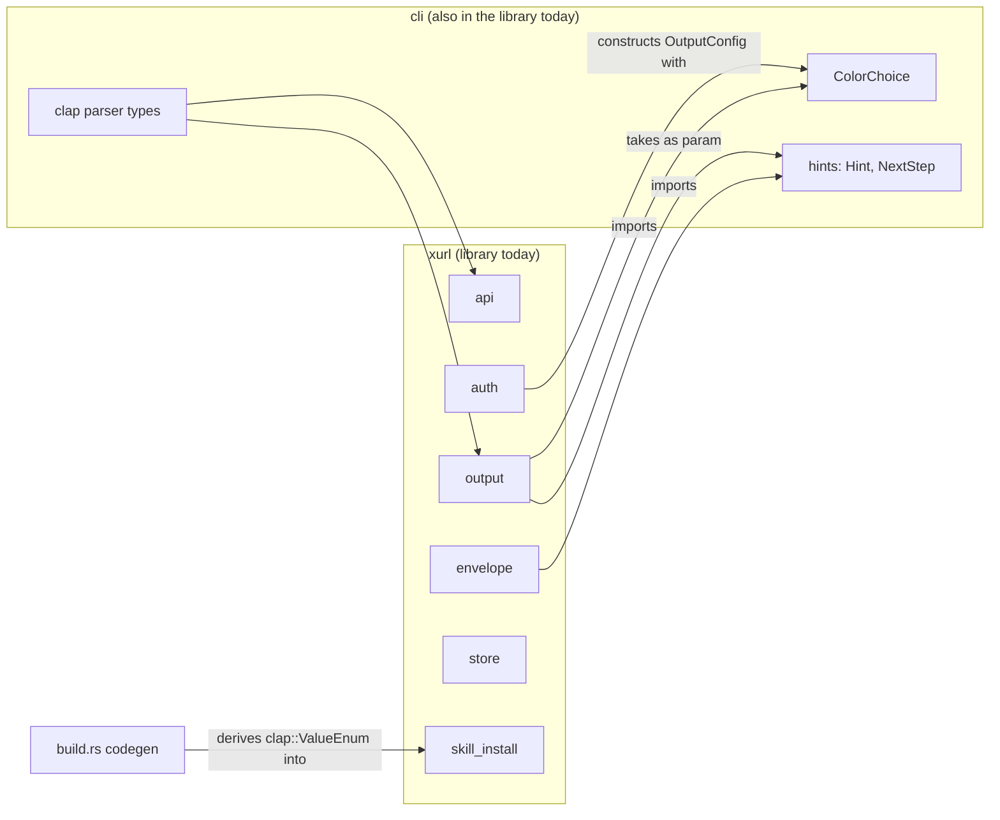
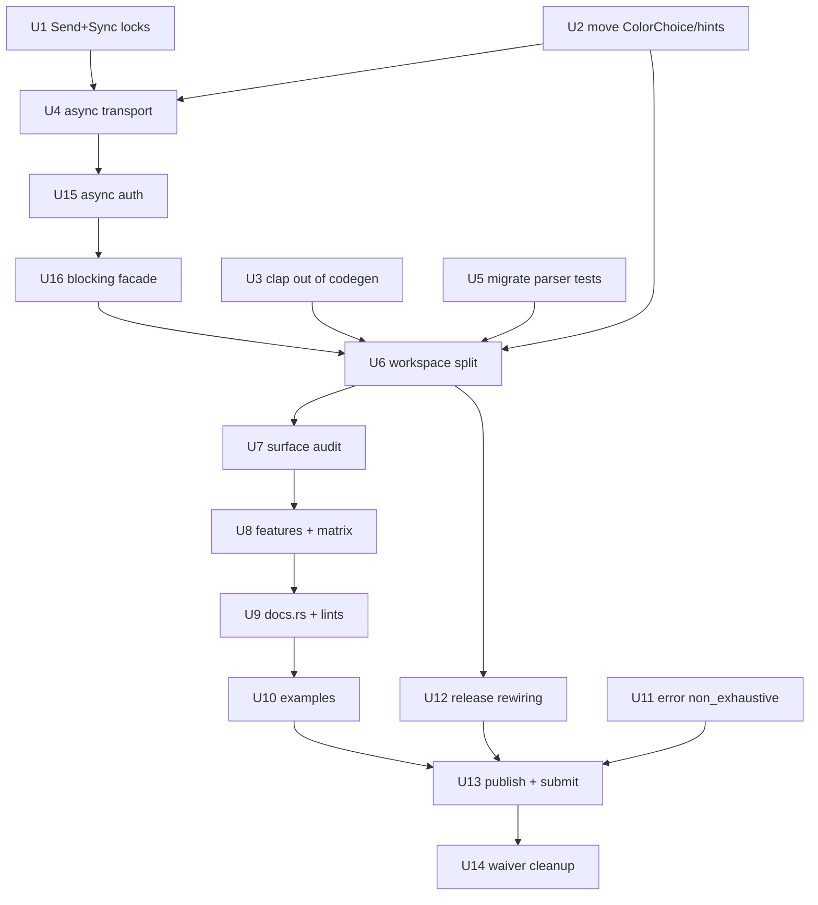

# Adoption-Grade Crate and CLI - Plan

## Goal Capsule

**Objective.** A Rust developer who needs the X API reaches for `xurl-rs` and finds it obviously alive, obviously
idiomatic, and usable from the async application they are already writing — so that it can credibly stand as the Rust
client listed on X's developer documentation.

**Means.** Untangle the library from the CLI, convert the client core to async with a blocking facade, split the
workspace so an embedder compiles no CLI code, then bring metadata, features, docs, examples, and error design up to the
bar a reviewer applies when deciding whether a crate is worth depending on.

**Authority hierarchy.** This plan, then the repo's active instructions (`AGENTS.md`, `CONTRIBUTING.md`, `CONCEPTS.md`),
then the implementer's judgment on details the plan leaves open. Where this plan and
`docs/plans/2026-09-14-1200-refactor-srp-module-boundaries-plan.md` disagree about where a type lives, this plan governs
and U2 records why.

**Stop conditions.** Stop and report rather than improvising if: the async conversion cannot preserve an existing CLI
behavior covered by a test; the workspace split would require renaming the published library package; or `bird`'s owner
has not resolved the drift-alarm question that U11 depends on; or U17 finds the listing route unmaintained, in which
case Phase C stops for a scope decision rather than proceeding.

## Product Contract

### Summary

The crate is positioned to be the Rust entry on X's developer documentation. That means optimizing for many future
library embedders and CLI users rather than the single current consumer. The work covers the library/CLI boundary, the
async posture, the published surface, and the packaging and documentation that a prospective adopter evaluates. It does
not change what any CLI command does or what any command outputs.

### Requirements

R1. A downstream crate depending on the library compiles no CLI dependencies — no `clap`, `clap_complete`, `colored`, or
`open` — without passing any feature flags.

R2. No clap-derived type appears in the library's public API, so adding, removing, or reordering a CLI command is not a
library semver event.

R3. Client operations are callable from inside an existing async runtime without `spawn_blocking` and without a
nested-runtime panic.

R4. A blocking API remains available for synchronous consumers and for the CLI, built on the same implementation rather
than a parallel one.

R5. The TLS backend is a documented, selectable choice rather than a hardcoded one.

R6. Every module the library publishes is something an embedder has reason to call; machinery that exists only to serve
the binary is not published.

R7. docs.rs renders the library with feature annotations on gated items and at least one runnable example per major
capability.

R8. The public error type can gain variants without forcing a major version.

R9. Package metadata, lint posture, and MSRV policy meet the standard a reviewer applies to a recommended third-party
client.

R10. Existing CLI users see no behavior change, and the existing distribution channels (release artifacts, Homebrew,
binstall) keep working.

R11. The library is submitted for listing on X's community libraries page, with the repository in a state that survives
the review that follows.

### Scope Boundaries

**Non-goals.**

- Changing what any CLI command does, what it prints, or what its JSON envelope contains. Output-shape changes belong to
  the separate 3.3.0 work already in flight.
- Redesigning the domain API. `ApiClient`'s shortcut methods keep their names and meanings; only their sync/async
  posture changes.
- Adding new X API endpoint coverage.
- Splitting `src/api/shortcuts.rs` or `src/cli/mod.rs` on line count. A prior decision deliberately exempted both, and
  `docs/solutions/best-practices/rust-module-splitting-srp-not-loc-20260327.md` records why.

**Deferred to Follow-Up Work.**

- Requesting the `xurl` name on crates.io. It is held by an unrelated 2021 URL utility that has never been updated; the
  crates.io abandoned-name process is slow and uncertain, and the plan does not depend on it.
- A `blocking`-only build profile for the CLI, if the async core turns out to make the binary meaningfully larger or
  slower to start.
- Promoting the `#[non_exhaustive]` placement rule from session memory into `docs/solutions/`, once U11 settles it.

## Planning Contract

### Key Technical Decisions

KTD1. **Untangle the library-to-CLI dependency before any structural work.** Research found the coupling runs backwards
from what the module names suggest: `src/output/mod.rs:22` imports `crate::cli::ColorChoice` and takes
`crate::cli::hints::Hint` as a parameter, `src/envelope.rs:24` imports `crate::cli::hints::NextStep` into the schema
type backing `schema/output.schema.json`, and `src/auth/mod.rs:296-308` constructs an `OutputConfig` with
`ColorChoice::Auto` and writes to stdout. Until those are resolved, neither the async conversion nor the split can
proceed, because the "library" does not currently compile without the CLI module.

KTD2. **The library keeps the `xurl-rs` package name; the binary moves to a new package.** The library is the artifact
being positioned for adoption, so it keeps the published name, the crates.io history, and the `https://docs.rs/xurl-rs`
URL that `Cargo.toml` already advertises. The cost lands on the binary: `cargo install xurl-rs` stops producing `xr`,
and `[package.metadata.binstall]`, the Homebrew formula, and the reusable release workflow's `bin:` input all move.
(`crate:` deliberately stays `xurl-rs`; it only labels archives, and holding it still preserves the artifact names.)
That cost is acceptable because most CLI users arrive through Homebrew or release artifacts rather than `cargo
install`.

**The binary package's name is an open user decision**, recorded here rather than invented during execution. It becomes
a permanent crates.io identifier and determines the `cargo install` line in `README.md`, `[package.metadata.binstall]`'s
`pkg-url`, the Homebrew formula URL, and the release workflow's `bin:` input. `xurl` is unavailable — an unrelated 2021
utility holds it. Confirm the chosen name is free before U6 starts.

**Rejected alternative: stay one package and feature-gate the CLI.** Mark `clap`, `clap_complete`, `colored`, and `open`
optional, set `default = []`, and give `[[bin]] xr` `required-features = ["cli"]`. That reaches R1 and R2 for the
default build with no distribution churn at all — no renamed package, no cross-repo release change, no `pub(crate)`
promotion. It loses on R2 under any build with the feature on: clap-derived types re-enter the public API whenever `cli`
is enabled, including the `all-features = true` docs.rs build U9 configures, so the published documentation would show
exactly the surface the split exists to remove. A workspace makes the guarantee unconditional.

KTD3. **Async-first core with a blocking facade behind a feature.** This mirrors what `reqwest` itself does and what the
abandoned incumbent `twitter-v2` already did in 2022. The alternative — keeping blocking as the only posture — is what
currently makes the crate unusable from an async application, which is most of them.

KTD4. **The clap parser types become crate-private.** `session-settled: user-directed`; chosen over `#[doc(hidden)]` and
over leaving `#[non_exhaustive]` as the answer. Governs R2. After KTD2 this is largely mechanical, because the parser
types end up in a different crate entirely.

KTD5. **Each increment ships in a minor with its breaks recorded as accepted breaks.** `session-settled: user-directed`;
chosen over forcing a major. `CONCEPTS.md` defines the mechanism and `Cargo.toml` already carries four entries. Every
phase here is independently capable of a major-level break, so `cargo semver-checks --baseline-rev <last tag>` is run at
the head of each unit as a design instrument, not only at release.

KTD6. **`XurlError` gains `#[non_exhaustive]`, and `bird`'s drift alarm becomes an explicit test.** This contradicts a
recorded rule that says never to add the attribute to `XurlError`, because `bird` matches it exhaustively with no
wildcard arm as a deliberate alarm against upstream variant additions. That rule was correct when `bird` was the only
consumer; under R8 it inverts, because every new error variant would otherwise force a major on every other consumer.
The alarm moves into `xurl-rs` as a variant-set snapshot test, because a downstream crate cannot enumerate a
`#[non_exhaustive]` foreign enum at all — `bird` gains a wildcard arm and **loses** compile-time drift detection rather
than keeping it in another form. That loss is the substance of what its owner is being asked to approve. **This
decision requires `bird`'s owner to agree before U11 starts.**

KTD7. **Feature-matrix cells that mean "this configuration alone" use `--no-default-features --features X`.** Cargo
features are additive, so a matrix that only ever adds to the default set can be fully green while never compiling the
non-default path. `docs/solutions/build-errors/rust-ci-feature-matrix-additive-gotcha.md` records this failing exactly
that way.

KTD8. **Cross-crate visibility replaces `pub(crate)` at the split boundary.** `pub(crate)` does not cross a workspace
member boundary, and it does not reach `tests/*.rs` either, since each integration test file is its own crate. Items the
binary crate or the test crates legitimately need become `pub` with `#[doc(hidden)]` where they are not embedder API,
per `docs/solutions/best-practices/rust-workspace-pub-crate-doesnt-cross-crates-2026-04-20.md`.

### High-Level Technical Design

**Current dependency shape.** The arrows that break the split are the three pointing left, from library modules into
`cli`.



**Target shape.** `ColorChoice` and the hint types move into library homes; the parser crate depends on the library and
nothing depends back.


**Unit sequencing.** The three untangling units gate everything; the split gates the surface audit.



### Risks and Dependencies

**The async conversion is the whole plan's risk concentration.** It touches the transport, both OAuth2 HTTP paths, and
the callback listener, and it is the one unit where a mistake is silent rather than loud: a token refresh that works in
tests and deadlocks under a caller's runtime looks fine until an embedder reports it. Mitigation is the split into U4,
U15, and U16 with a characterization baseline captured before any of them, and an async-context test that is observed
panicking before the conversion starts.

**The external reusable workflow breaks unconditionally at U6, not conditionally at U12.** Its `check-version` job runs
a bare `cargo pkgid`, which errors on a virtual manifest, so every tag push fails the moment the root becomes a
workspace. The upstream changes in `brettdavies/.github` are a hard prerequisite of U6 — package-scoped `cargo pkgid`,
an artifact-name input, and two-package publish ordering — and that repo is outside this one.

**U11 is blocked on a decision, not on code.** It contradicts a recorded rule and needs `bird`'s owner to agree. It is
drawn with no dependency edge so it can proceed in parallel once unblocked, but it must not be started on the assumption
that the answer is yes.

**A package-scoped green test run is not proof.** `cargo test -p xurl-rs` passing says nothing about whether `bird`
still compiles against a reshaped surface.
`docs/solutions/conventions/package-test-gate-misses-app-target-exhaustive-match-breaks.md` records exactly this blind
spot, with `bird` as the consumer that fell through it. Build `bird` against the local path before declaring U7 or U11
done.

**Accepted-break entries accumulate.** Every phase adds entries to a table whose own policy says a standing entry
understates the next break of the same kind. U14 exists to clear them, but it only fires after U13, so the table is at
its largest during the riskiest phases. Re-read the table at the head of each unit and confirm every entry still
describes a break that has not yet shipped.

**Scope creep from the audit is likely.** U7 will surface more misplacements like the `ColorChoice` one, because that
defect was only found by looking. Record each as a follow-up rather than absorbing it, unless it blocks the split.

### Assumptions

- `ApiClient` still owns `Auth` by value with no lifetime parameter. The library-ergonomics work removed `<'a>`
  specifically to make `Send + Sync` reachable; U1 verifies this before U4 depends on it.
- `bird` is the only consumer that matters for break assessment. It is a git dependency pinned to a rev, so nothing here
  reaches it until that pin moves.
- The reusable release workflow in `brettdavies/.github` can take new `crate:`/`bin:` inputs. If it cannot, U12 becomes
  a two-repo change.
- The CLI keeps using the blocking facade rather than becoming async itself, so most command handlers need no rewrite.
  The binary target does **not** build between the transport conversion and the facade, which is why U4, U15, and U16
  land as one increment, and `src/cli/commands/streaming.rs` is the one handler that does need rewriting because it
  bypasses `ApiClient` entirely.

### Sequencing

Three phases, each independently shippable in a minor.

**Phase A — make the library a library (U1, U2, U3, U4, U15, U16, U5, U6).** Ends with a workspace where the library
crate compiles
with no CLI dependency and the binary crate owns clap.

**Phase B — make it idiomatic (U7, U8, U9, U10, U11).** Published surface, features, docs, examples, error posture.

**Phase C — make it visible (U12, U13, U14).** Distribution rewiring, publishing, submission to X's community libraries
list, and deletion of the accepted-break entries once the tag moves past them.

## Implementation Units

| U-ID | Title                                                  | Files touched                                                                                                                                                                                      | Depends on      |
| ---- | ------------------------------------------------------ | -------------------------------------------------------------------------------------------------------------------------------------------------------------------------------------------------- | --------------- |
| U17  | Establish that the listing route is live               | —                                                                                                                                                                                                  | —               |
| U1   | Lock Send + Sync as compile-time invariants            | `src/api/request/mod.rs`, `src/auth/mod.rs`, `src/config/mod.rs`, `src/error.rs`, `src/output/mod.rs`                                                                                              | —               |
| U2   | Move ColorChoice and the hint types into library homes | `src/output/mod.rs`, `src/envelope.rs`, `src/cli/hints.rs`, `src/cli/mod.rs`, `src/auth/mod.rs`                                                                                                    | —               |
| U3   | Remove clap from the generated skill-host enum         | `build.rs`, `src/skill_install/mod.rs`, `src/skill_install/update.rs`, `src/cli/mod.rs`                                                                                                            | —               |
| U4   | Async transport core                                   | `src/api/request/*`, `src/api/media.rs`                                                                                                                                                            | U1, U2          |
| U15  | Async auth paths                                       | `src/auth/{mod,oauth2,callback}.rs`                                                                                                                                                                | U4              |
| U16  | Blocking facade behind a feature                       | `src/api/`, `Cargo.toml`                                                                                                                                                                           | U4, U15         |
| U5   | Migrate parser-introspection tests                     | `tests/cli_tests.rs`, `tests/cli_run_tests.rs`, `tests/output_writer_tests.rs`, `tests/oauth2_flow_tests.rs`, `tests/binary_contract_tests.rs`, `tests/unknown_command_tests.rs`, `src/cli/mod.rs` | U2              |
| U6   | Split into a workspace                                 | `Cargo.toml`, `crates/**`, `tests/**`, `scripts/hooks/pre-push`, `scripts/generate-completions.sh`, `.github/workflows/ci.yml`                                                                     | U2, U3, U5, U16 |
| U7   | Audit and close the published surface                  | `crates/xurl/src/lib.rs`, module roots                                                                                                                                                             | U6              |
| U8   | Feature design and the CI matrix                       | `Cargo.toml`, `.github/workflows/ci.yml`                                                                                                                                                           | U7              |
| U9   | docs.rs metadata, lints, rustdoc posture               | `Cargo.toml`, `crates/xurl/src/lib.rs`                                                                                                                                                             | U8              |
| U10  | Runnable examples                                      | `crates/xurl/examples/**`                                                                                                                                                                          | U9              |
| U11  | `XurlError` non-exhaustive and the bird drift test     | `src/error.rs`, `Cargo.toml`, plus a change in `bird`                                                                                                                                              | —               |
| U12  | Rewire release and distribution for the split          | `.github/workflows/release.yml`, `Cargo.toml`, Homebrew formula                                                                                                                                    | U6              |
| U13  | Publish and submit for listing                         | `README.md`, `Cargo.toml`                                                                                                                                                                          | U10, U11, U12   |
| U14  | Delete the accepted-break entries                      | `Cargo.toml`                                                                                                                                                                                       | U13             |

### U17. Establish that the listing route is live

**Goal.** Know, before the budget is spent, whether X still curates the community-libraries page and what it takes to
get on it.

**Requirements.** R11.

**Dependencies.** None. Runs ahead of Phase A and blocks nothing.

**Approach.** Without submitting anything, establish whether the page is actively curated: when entries were last added
or changed, whether submissions in the Libraries, SDKs, Samples category get responses, and what turnaround looks like.
The plan's own evidence is ambiguous — the sole Rust entry has been unpublished since October 2022 and Rust has no tab
of its own, which is equally consistent with a curated directory nobody submits to and an abandoned one. Those two
readings imply different amounts of work being worth doing.

**Execution note.** Read-only reconnaissance. Do not post, and do not contact maintainers here; U13 owns the approach
when the time comes.

**Test scenarios.**

- Test expectation: none — this unit produces a finding, not behavior. Replacement verification is the written
  conclusion and the evidence behind it.

**Verification.** A recorded answer to "is this route live, and what does it take", with dates and links.

### U1. Lock Send + Sync as compile-time invariants

**Goal.** Turn "async is reachable" from a claim into a compile error if it ever stops being true.

**Requirements.** R3.

**Approach.** Add a zero-cost assertion per public type, in this form:

```rust
const _: fn() = || {
    fn _assert_send_sync<T: Send + Sync>() {}
    _assert_send_sync::<ApiClient>();
};
```

Three lines each, no new dependency. Cover `ApiClient`, `Auth`, `Config`, `XurlError`, and `OutputConfig`. First verify
`ApiClient` still owns `Auth` by value with no lifetime parameter; if a lifetime has crept back, fixing that is this
unit's real work and U4 depends on it.

**Patterns to follow.** `docs/solutions/architecture-patterns/bird-library-lift-2026-06.md` documents this assertion
form. `src/output/mod.rs:60-61` already states the intent in a doc comment.

**Test scenarios.**

- Happy path: the crate compiles with all five assertions present.
- Error path: temporarily adding a `Rc<()>` field to one of the five types fails the build at the assertion rather than
  at a distant call site. Observe this failure before removing the field.

**Verification.** `cargo build` and `cargo clippy --all-targets -- -D warnings`.

### U2. Move ColorChoice and the hint types into library homes

**Goal.** Remove every dependency that points from library code into `src/cli/`, and remove clap from the library types
that already carry it.

**Requirements.** R1, R2, R6.

**Approach.** `ColorChoice` moves to `src/output/`, where its only public consumer (`OutputConfig::new`) already lives
and where `bird` reaches for it. `Hint` and `NextStep` move to `src/envelope.rs` or a sibling module, since `ErrorBody`
embeds `NextStep` and that type backs the committed `schema/output.schema.json`. Then remove the terminal I/O from
`src/auth/mod.rs:296-308` by threading an `OutputConfig` in from the caller rather than constructing one, per
`docs/solutions/best-practices/rust-library-cli-separation-for-interactive-concerns-2026-04-20.md`.

Relocating the types is not sufficient on its own. `ColorChoice` derives `clap::ValueEnum` (`src/cli/mod.rs:22`), so
moving it would carry clap into `src/output/` — and `OutputFormat` already derives it there today
(`src/output/mod.rs:19` and `:28`), which means the library depends on clap right now, before any of this work starts.
Drop the `ValueEnum` derive and the `use clap::ValueEnum` import from both types, and give the binary crate value
parsers for `--color` (`src/cli/mod.rs:899-902`) and `--output` (`src/cli/mod.rs:811`) using the newtype or `FromStr`
pattern U3 applies to `SkillHost`. The orphan rule stops the binary crate from implementing `clap::ValueEnum` on a
library type, so a wrapper is required rather than a bare impl.

**Execution note.** This unit re-litigates a verdict in
`docs/plans/2026-09-14-1200-refactor-srp-module-boundaries-plan.md`, which recorded `src/cli/hints.rs` as settled "CLI
code". Record the reversal and its reason in the unit's commit message; the evidence is that library modules import
those types.

**Patterns to follow.** The directory-promotion and re-export mechanics in
`docs/solutions/best-practices/module-directory-promotion-pattern-2026-04-22.md`.

**Test scenarios.**

- Happy path: `schema/output.schema.json` regenerates byte-identical after the type moves.
- Integration: `cargo test` passes with no change to any assertion about envelope shape.
- Edge case: a library-only build (temporarily commenting out `pub mod cli` in `src/lib.rs`) compiles, and
  `cargo tree -i clap` against that build returns nothing. This is the real proof; run it, observe it, then restore.
- Happy path: `xr --color never` and `xr --output json` still parse and behave identically through the new parsers.
- Error path: an invalid `--color` or `--output` value produces the same error text and exit code as before.
- Integration: `bird` still compiles against the relocated `ColorChoice`, built from a local path override.

**Verification.** `cargo test`, `bash scripts/generate-response-schemas.sh` with a clean `git status`, and the
library-only build above.

### U3. Remove clap from the generated skill-host enum

**Goal.** Stop `build.rs` from deriving a clap trait into library code, and remove the library's production use of that
trait.

**Requirements.** R1.

**Approach.** `build.rs:120` emits `#[derive(Clone, Copy, Debug, PartialEq, Eq, ::clap::ValueEnum)]` for the generated
`SkillHost`. Dropping that derive is not self-contained: two production call sites iterate
`SkillHost::value_variants()`,
a `ValueEnum` trait method — `src/skill_install/mod.rs:325` in `run_for_all_hosts` (the module's test block does not
start until line 376) and `src/skill_install/update.rs:153` in `run_update_multi`. Have `build.rs` also emit a
`const ALL: &[SkillHost]` alongside the existing `KNOWN_HOSTS` and repoint both loops at it. Then give the binary crate
a newtype or `FromStr`-based value parser so `xr skill install <host>` keeps accepting the same values.

**Test scenarios.**

- Happy path: `xr skill install claude_code --dry-run` accepts the same host names as before.
- Happy path: `xr skill install --all --dry-run` still enumerates every host, exercising both converted loops.
- Error path: an unknown host still produces the same error text and exit code.
- Edge case: `xr skill install --help` still lists every host.
- Edge case: `xr skill update --all --dry-run` enumerates every host through the `update.rs` loop.

**Verification.** `cargo test --test cli_tests`, plus running the five commands above against the built binary.

### U4. Async transport core

**Goal.** The request layer sends over an async client, with the runtime owned by the caller.

**Requirements.** R3.

**Landing note.** U4, U15, and U16 land as **one increment**. Making the transport async makes the whole shortcut
surface async, and the blocking facade the CLI runs on does not exist until U16, so the binary does not build in
between. Gate U4 and U15 on `cargo check --lib` plus their own new async tests; the full `cargo test` gate applies to
the combined increment at U16.

**Approach.** Convert `src/api/request/transport.rs` from `reqwest::blocking` to async — `send_request`,
`send_multipart_request`, and `stream_request` — and the `Client` field on `ApiClient` in `src/api/request/mod.rs`.
Every caller follows: `src/api/shortcuts.rs` alone holds the call sites behind the 27 shortcut methods, plus
`src/api/media.rs` and `src/api/endpoints.rs`. Store one `reqwest::Client` on the struct rather than building one per
request. `src/api/media.rs:315` polls processing status with `thread::sleep`, which would park the caller's executor
thread; it becomes `tokio::time::sleep` on the async path. Do not touch the auth paths here; U15 owns those.

**Execution note.** Characterization-first, and the order matters. Write the async-context test described below and
observe it failing against today's code before converting anything — the nested-runtime panic is the defect being
fixed, so it has to be seen first. `reqwest`'s own `blocking` module documents this panic, so the failure is expected
rather than incidental.

**Patterns to follow.** `docs/solutions/best-practices/rust-store-http-client-on-struct-not-per-request-2026-04-20.md`.

**Test scenarios.**

- Error path: calling a shortcut method from inside `#[tokio::test]` panics on the nested runtime today. Observe this
  before converting.
- Happy path: the same call succeeds after conversion, without `spawn_blocking`.
- Edge case: a streaming request is cancellable mid-stream and releases its connection.
- Integration: media upload still completes its initialize, append, and finalize sequence.
- Edge case: a media upload whose processing poll sleeps does not block other tasks on the same runtime.

**Verification.** `cargo check --lib`, `cargo clippy --all-targets -- -D warnings`, and the new async tests. The full
suite runs at U16.

### U15. Async auth paths

**Goal.** Token exchange, refresh, and the OAuth2 callback listener stop creating their own runtimes.

**Requirements.** R3.

**Dependencies.** U4. Lands in the same increment as U4 and U16; see U4's landing note.

**Approach.** `src/auth/oauth2.rs` builds blocking clients at lines 111, 114, 477, and 480 for token exchange and
refresh; `src/auth/mod.rs:404` and `:409` build one for `fetch_username`. Convert all of them to the async client.
`src/auth/callback.rs:289-294` already runs an async accept loop wrapped in a `block_on` shim at
`wait_for_callback_with` — remove the shim and let the async version be the real API. Conversion ripples into
`src/api/request/auth_header.rs` (`get_auth_header`, `get_auth_header_public`) and the `src/cli/commands/` call sites.

Two hazards the shim currently hides:

- **Drop safety.** Today the owned `current_thread` runtime guarantees the spawned accept loops die when
  `wait_for_callback_with` returns by any path. As a plain async fn, spawned tasks detach from the parent future, so a
  caller wrapping the await in `tokio::select!` or a timeout drops the future and never reaches the `h.abort()`
  cleanup — leaving the loopback redirect port bound for the process lifetime. Hold the handles in a struct whose
  `Drop` cancels the token and aborts every handle.
- **Signal handling.** `shutdown_signal()` installs process-global SIGINT/SIGTERM handlers via `tokio::signal`. Inside
  an embedder's process that persists for the process lifetime and changes SIGTERM disposition. Decide explicitly
  whether signal handling stays library-owned or moves to the binary crate, and record the choice.

**Concurrency and the credential store.** R3 makes concurrent use the headline capability, and the store is not ready
for it: `TokenStore::save_to_file` serializes the whole app map from its own in-memory snapshot and does a non-atomic
whole-file write with no lock. Two tasks each holding their own `ApiClient` can have one write back pre-refresh state
over the other's rotated refresh token, which fails every later refresh until the user re-authenticates. Route every
store write through one serialized write-temp-then-rename path holding an advisory lock for the read-modify-write
window.

**Test scenarios.**

- Integration: the OAuth2 PKCE callback flow completes against the local listener through its async path.
- Error path: a token refresh triggered from inside a caller's runtime completes rather than deadlocking. Write this
  before converting and observe the current behavior.
- Edge case: dropping the listener future mid-wait releases the port, proven by rebinding it immediately afterward.
- Edge case: the callback listener still honors its shutdown signal.
- Error path: two concurrent refreshes against one store path both land, and the rotated refresh token survives.
- Error path: a refresh the server rejects still surfaces the same error variant and exit code as today.

**Verification.** `cargo check --lib` plus the new async tests; the interactive listener path exercised end to end
(note that the headless flow, `run_remote_step1`/`run_remote_step2`, never touches the listener, so it does not cover
this unit).

### U16. Blocking facade behind a feature

**Goal.** Synchronous consumers and the CLI keep a blocking API, built on the async implementation rather than beside
it.

**Requirements.** R4.

**Dependencies.** U4, U15. This unit closes the increment those two open.

**Approach.** Add a `blocking` feature providing a facade that owns a runtime and wraps the async methods, the shape
`reqwest` itself uses. There must be exactly one implementation; the facade delegates and never duplicates
request-building logic.

Most CLI handlers move to the facade unchanged, but one does not: `src/cli/commands/streaming.rs` never goes through
`ApiClient`'s transport. It builds its own `reqwest::blocking::Client`, spawns its own current-thread runtime for the
shutdown watcher, and calls `get_auth_header_public` directly — the method U15 makes async. Move it onto the facade so
the binary carries one HTTP client whose TLS selection follows the U8 features, rather than a second stack resolving
its own backend.

**Test scenarios.**

- Happy path: the blocking facade returns identical results to the async path for one representative read and one
  representative write.
- Error path: the same failure produces the same error variant through both paths.
- Edge case: constructing the facade from inside an existing runtime fails with a clear error rather than panicking.
- Integration: the full CLI test suite passes with the CLI running on the facade.
- Integration: `xr stream` works through the facade rather than its own client.

**Verification.** `cargo test`, `cargo test --no-default-features --features blocking`, and the pre-push mirror. Also
measure `xr` release binary size and cold-start time against the last tag before U4, and record the result: above a
threshold the team sets here, the deferred blocking-only CLI profile is pulled into scope before U6 proceeds, because
backing the async core out after the split is the highest-reversal-cost path in the plan.

### U5. Migrate parser-introspection tests

**Goal.** Remove the test-suite dependency on parser types being public, which is a confirmed compile break under U6.

**Requirements.** R2.

**Approach.** Six files import `xurl::cli::` today. `tests/cli_tests.rs` and `tests/cli_run_tests.rs` are the
substantial ones: they call `Cli::try_parse_from`, match on `Commands` and `AuthCommands`, and call `Cli::command()`.
Move assertions that genuinely test parsing into `#[cfg(test)]` unit tests inside `src/cli/`, where same-crate access is
full. Keep assertions that test observable behavior in `tests/`, rewritten to go through the argv entrypoint or
`assert_cmd`. `tests/output_writer_tests.rs` and `tests/oauth2_flow_tests.rs` reach for `ColorChoice` and `NextStep`,
which U2 relocates to library homes, so those imports only need repointing. `tests/oauth2_flow_tests.rs` needs more
than that, though: it also calls `xurl::cli::runner::run_with_overrides` (line 331), which the split moves to the binary
crate, so the file itself moves with it.

**Execution note.** Some parser assertions get weaker when expressed behaviorally and some become impossible. Where that
happens, move the assertion into a unit test rather than dropping it; record any assertion that genuinely cannot
survive.

**Test scenarios.**

- Happy path: the boolean-flag-does-not-swallow-the-next-word assertion survives the move and still fails when that
  regression is reintroduced. Reintroduce it, observe the failure, revert.
- Integration: the subcommand `Examples:` lock still walks every subcommand.
- Edge case: `tests/store_isolation_guard.rs`, which scans every file under `tests/`, still passes with the new file
  set.

**Verification.** `cargo test`, and a count comparison of passing tests before and after.

### U6. Split into a workspace

**Goal.** A library crate with no CLI dependencies, and a binary crate that owns clap.

**Requirements.** R1, R2, R10.

**Hard prerequisite.** The reusable `brettdavies/.github` release workflow breaks the moment the repo root becomes a
virtual manifest, and it breaks unconditionally, not contingently: its `check-version` job runs a bare `cargo pkgid`,
which errors on a virtual manifest. Land the upstream changes **before** starting this unit — package-scoped
`cargo pkgid -p <library>`, an artifact-name input so releases keep the `xurl-rs-<target>` prefix the Definition of
Done requires, and two-package publish ordering.

**Approach.** Convert the root `Cargo.toml` to a workspace with two members. The library keeps the `xurl-rs` package
name per KTD2, and takes `build.rs`, `vendor/`, and every module except `cli`. The binary crate takes `src/cli/`,
`src/main.rs`, clap, the terminal dependencies, and its own `reqwest` dependency until U16's facade absorbs the
streaming handler. `pub(crate)` seams at the new boundary become `pub` with `#[doc(hidden)]` where they are not
embedder API. Update `scripts/hooks/pre-push` path scoping, `scripts/generate-completions.sh` (it selects the binary
via `cargo metadata --no-deps ... .packages[0]`, which is ambiguous with two members and backs the completions-freshness
gate), and the `semver` job in `.github/workflows/ci.yml` to target the library package.

**Test relocation.** The suite does not survive the split untouched, and its guards fail quietly rather than loudly:

- Every file reaching the binary through `env!("CARGO_BIN_EXE_xr")` (via `tests/common/`) must move to the binary
  crate; that variable only exists for the package declaring the bin target.
- `tests/agentic_tests.rs`, `tests/schema_tests.rs`, `tests/spec_scripts.rs`, `tests/conformance_runner.rs`, and
  `tests/conformance/mod.rs` anchor repo-root assets on `env!("CARGO_MANIFEST_DIR")`, which after the split resolves to
  the member directory. Rewrite them to resolve the workspace root.
- `tests/store_isolation_guard.rs` and `tests/env_mutation_guard.rs` scan `CARGO_MANIFEST_DIR/{src,tests}`, so whichever
  crate hosts them silently stops covering the other. Instantiate both guards in both members with each copy's
  `ALLOWLIST` re-pointed at the files that crate owns. This is the guard that exists because `cargo test` once
  clobbered the real token store; a vacuously-green version of it is worse than none.

**Patterns to follow.** `docs/solutions/architecture-patterns/bird-library-lift-2026-06.md` for the layered
`run_argv` / `run` / `run_with_paths` entrypoints, and the rule that the library returns `ExitCode` and never calls
`process::exit`. Use `git mv` so history survives, and verify with `git blame -C -C -C`.

**Test scenarios.**

- Happy path: `cargo build -p xurl-rs` produces no clap in the dependency graph. Assert with
  `cargo tree -p xurl-rs -i clap` returning nothing.
- Integration: the full test suite passes with the same count as before the split.
- Error path: planting a deliberate `Auth::new(` call in each crate's `tests/` tree makes that crate's isolation guard
  report a violation. Observe both failures, then remove the plants.
- Edge case: `cargo package -p xurl-rs` succeeds and excludes the CLI crate.
- Error path: `cargo semver-checks --baseline-rev <last tag>` reports exactly the removals this split intends.
- Integration: `bird` compiles against the library from a local path override.

**Verification.** `cargo test --workspace`, `cargo tree -p xurl-rs -i clap`, `cargo package -p xurl-rs`,
`scripts/generate-completions.sh --check`, and the pre-push mirror.

### U7. Audit and close the published surface

**Goal.** Every published module is something an embedder calls, and every item promoted to reach across the split is
reviewed rather than merely hidden.

**Requirements.** R6.

**Approach.** With the split done, decide which library modules stay public. Measured consumption from `bird` is the
starting evidence — it reaches `error`, `api`, `auth`, `config`, `store::types`, and `output` — but `bird` is pinned to
a rev from the v2.0.0 era, so its import set describes a surface two minors old. Build it against the local path before
treating any demotion as safe. `skill_install` has no external consumer; `envelope` has none either, though it backs
the published output schema and may be API by intent rather than by current use.

Audit the items KTD8 promoted, not only the modules. `pub` plus `#[doc(hidden)]` removes an item from rustdoc and from
the semver contract, but it stays callable — and in `store` and `auth` those items are credential-mutating
(`TokenStore::save_to_file`, `active_app_or_create`, `StoreFile`, `migration::load_from_data`,
`exchange_code_for_token`, `fetch_username`). Give each one the `_raw` / `_unchecked` naming and the
`# Safety (caller-beware)` doc section that
`docs/solutions/best-practices/rust-workspace-pub-crate-doesnt-cross-crates-2026-04-20.md` prescribes; hiding an item
from rustdoc is not access control. Record each demotion as an accepted break.

**Test scenarios.**

- Happy path: a scratch crate depending on the library path-locally compiles against every documented capability.
- Integration: `bird` compiles against the library from a local path override.
- Error path: `cargo semver-checks` names each demotion, and each has a matching `required-update` entry.

**Verification.** `cargo doc --no-deps --document-private-items` — the default render omits `#[doc(hidden)]` items, so
the plain command cannot show the surface being audited — plus a review of the enumerated promoted items against the
decision.

### U8. Feature design and the CI matrix

**Goal.** Selectable TLS, an optional blocking facade, and a matrix that actually compiles each configuration.

**Requirements.** R4, R5.

**Approach.** Introduce `default = ["rustls-tls"]`, plus `native-tls` and `blocking`. The incumbent `twitter-v2` offers
exactly the two TLS features, which is the shape Rust users expect. Every matrix cell that means "this configuration
alone" uses `--no-default-features --features X`, per KTD7.

**Test scenarios.**

- Happy path: default features build and test green.
- Edge case: `--no-default-features --features native-tls` builds and makes a real request in an ignored test.
- Edge case: `--no-default-features --features blocking` builds and the blocking facade works.
- Error path: `--no-default-features` with no TLS feature fails with a clear `compile_error!` rather than an obscure
  reqwest error.

**Verification.** The CI matrix, plus `cargo hack check --feature-powerset` if available.

### U9. docs.rs metadata, lints, rustdoc posture

**Goal.** The crate's crates.io and docs.rs pages read like a maintained, professional library.

**Requirements.** R7, R9.

**Approach.** The library package still presents itself as a CLI: `description` reads "A fast, ergonomic CLI for the X
(Twitter) API", `keywords` includes `cli`, and `categories` leads with `command-line-utilities`. After U6 that is
factually wrong for the package it describes, and it is the first thing a developer evaluating an X API client sees.
Rewrite the description to name an async X API client, drop `cli` from keywords and `command-line-utilities` from
categories, and give the library crate a library-first README while the existing CLI README moves with the binary
crate.

Then the docs configuration: add `[package.metadata.docs.rs]` with `all-features = true` and
`rustdoc-args = ["--cfg", "docsrs"]`, and annotate feature-gated items with `#[cfg_attr(docsrs, doc(cfg(...)))]`.
Extend the lint posture beyond the current `#![deny(missing_docs)]` with `#![forbid(unsafe_code)]` and
`#![warn(missing_debug_implementations)]`. Write a crate-level doc comment that opens with a working example, since
that is the first thing a docs.rs visitor reads.

**Test scenarios.**

- Happy path: `cargo doc --no-deps` with `RUSTDOCFLAGS="--cfg docsrs -D warnings"` succeeds and feature-gated items
  render with their feature badge.
- Happy path: the rendered crates.io metadata describes a library, with no CLI category or keyword.
- Error path: an undocumented public item fails the build.

**Verification.** `RUSTDOCFLAGS="-D warnings" cargo doc --no-deps --all-features`, and `cargo package -p xurl-rs`
followed by a read of the generated metadata.

### U10. Runnable examples

**Goal.** A prospective adopter can copy something that works.

**Requirements.** R7.

**Approach.** Add `crates/xurl/examples/` with one example per major capability: authenticate, read a post, search, post
with media, and stream. Each compiles under `cargo test --examples` and reads credentials from the environment rather
than embedding them.

**Test scenarios.**

- Happy path: every example compiles under `cargo build --examples`.
- Edge case: an example run without credentials exits with the documented auth-required code rather than panicking.

**Verification.** `cargo build --examples` in CI.

### U11. `XurlError` non-exhaustive and the bird drift test

**Goal.** New error variants stop forcing a major version, without silently deleting the drift alarm that justified
keeping the enum exhaustive.

**Requirements.** R8.

**Approach.** Add `#[non_exhaustive]` to `XurlError` and record the accepted break.

The compensating control cannot live where it first seems to. `#[non_exhaustive]` is precisely the attribute that stops
a downstream crate from enumerating a foreign enum's variants, so no test inside `bird` can observe a new one: its
converter must gain a `_ =>` arm, and new variants then fall into it silently. Put the variant-set snapshot test inside
`xurl-rs`, where an exhaustive match still compiles, and give `bird` the wildcard arm mapping unknown variants to its
generic error plus a rev-bump checklist item to re-read that snapshot.

**Execution note.** Blocked on the KTD6 decision, and the decision must be stated accurately: `bird` **loses**
compile-time drift detection. It does not keep it in another form. That is the trade its owner is being asked to
approve, and the earlier framing of this unit understated it.

**Test scenarios.**

- Happy path: adding a throwaway variant to `XurlError` fails the in-crate snapshot test. Observe it, then remove the
  variant.
- Integration: `bird` compiles against the changed enum with its new wildcard arm.
- Error path: `cargo semver-checks` classifies the change as the recorded accepted break.

**Verification.** `cargo test` in both repos.

### U12. Rewire release and distribution for the split

**Goal.** Every existing distribution channel keeps working after the split.

**Requirements.** R10.

**Approach.** The upstream workflow changes are a prerequisite of U6, not of this unit; by the time this runs they
exist. What remains here is the caller side. Keep `crate: xurl-rs` as the input — it only labels archives, and holding
it still is what keeps the `xurl-rs-<target>` artifact names R10 promises. Change only `bin:`. Move
`[package.metadata.binstall]` to the binary package, and re-check the Homebrew formula's source URL against the
artifact names. Verify the status-check context names still match what the required checks expect, since a job inside a
reusable workflow reports as `<caller-job> / <job>`.

**Test scenarios.**

- Happy path: a dry-run release produces artifacts with the same names as the previous release.
- Error path: `cargo install` instructions in `README.md` name the package that actually produces the binary.
- Integration: `cargo binstall` resolves against the new package.
- Edge case: required status-check names on the protected branch still match what the workflow reports.

**Verification.** A release dry run, and `gh pr checks` showing the same required check names as before.

### U13. Publish and submit for listing

**Goal.** The crate is on crates.io in its adoption-grade form and submitted for X's community libraries list.

**Requirements.** R9, R11.

**Approach.** Publish the library and the CLI.

For the submission, use the relationship that already exists rather than arriving cold. X's own Go `xurl` is listed on
the same page under Developer tools, and this crate is a port of it — so open through the `xdevplatform` maintainers as
the Rust port of a tool X already ships and links, and lead the forum post with that lineage. The Libraries, SDKs,
Samples category is the documented route for a library to be linked from the developer docs; gap-filling is the weaker
framing and the fallback, not the opener.

**Post-submission checkpoint.** Record the result. If the submission is rejected or goes unanswered by the window the
recon unit established, state what the plan does next rather than treating the roadmap as complete.

**Test scenarios.**

- Happy path: `cargo publish --dry-run` succeeds for both packages.
- Error path: no optional git dependency lacks a `version` field, which `cargo publish --dry-run` rejects and which
  fmt, clippy, and test do not catch.

**Verification.** `cargo publish --dry-run -p xurl-rs`, then the real publish.

### U14. Delete the accepted-break entries

**Goal.** The waiver table does not outlive the release it describes.

**Requirements.** R9.

**Approach.** Once the tag moves past each recorded break, delete its entry from
`[package.metadata.cargo-semver-checks.lints]`. `CONCEPTS.md` states the rule: a standing entry understates the next
break of the same kind. There are four entries today, plus each one this plan adds.

**Test scenarios.**

- Happy path: with the entries removed and the baseline at the new tag, `cargo semver-checks` passes.
- Error path: removing an entry whose break has not yet shipped fails the gate, naming the lint.

**Verification.** `cargo semver-checks --baseline-rev <new tag> --release-type minor`.

## Verification Contract

**Per-unit gates.** `cargo test` for every unit, plus `cargo clippy --all-targets -- -D warnings`.

**Full local mirror.** `LC_ALL=C.UTF-8 scripts/hooks/pre-push` — fmt, clippy, test, MSRV, doc build, `cargo deny`,
shellcheck, Windows cross-clippy, markdownlint, actionlint. Required before every push. Note that it does not cover the
three CI-only gates: completions freshness, the package check, and the public-API semver gate.

**Semver gate as a design instrument.** `cargo semver-checks --baseline-rev <last released tag> --release-type minor` at
the head of every unit, not only at release. Baseline against the last released tag, never the PR base. Record accepted
breaks with `required-update`, never `lint-level = "allow"`.

**Cross-crate proof.** `cargo tree -p xurl-rs -i clap` must return nothing after U6. A package-scoped green test run
does not prove an out-of-package consumer still compiles, so build `bird` against the local path before declaring U7 or
U11 done.

**Feature matrix.** At minimum: default; `--no-default-features --features blocking`; `--no-default-features --features
native-tls`; `--all-features`.

**Artifact freshness.** `scripts/generate-completions.sh --check` and `scripts/generate-response-schemas.sh` with a
clean tree.

## Definition of Done

**Global.**

- A downstream crate depending on `xurl-rs` compiles no clap, proven by `cargo tree`.
- A shortcut method is callable from inside `#[tokio::test]` without `spawn_blocking` and without panicking.
- The blocking facade exists behind a feature and returns the same results as the async path.
- No clap-derived type appears in `cargo doc` output for the library.
- Every published module has a named embedder use, or a recorded decision to publish it anyway.
- docs.rs renders feature badges and at least one runnable example per major capability.
- Every accepted break has a `required-update` entry that names what it covers, and every entry whose release has
  shipped is deleted.
- The CLI's observable behavior is unchanged: same commands, same output shapes, same exit codes.
- Existing distribution channels produce the same artifact names.
- R11's outcome is recorded, not just its action: either the library appears on X's community-libraries page, or the
  submission's result is written down along with what the plan does next. A forum post with no recorded response does
  not close this.

**Per unit.** Each unit's Verification section has an observed result, not an assumed one. Units whose test scenarios
call for observing a failure first record the actual failure output.

## Appendix

### Sources

- X developer documentation, Tools and Libraries: official SDKs are Python (`xdk`, advertising async support and type
  hints) and TypeScript. The Go `xurl` is listed under Developer tools. Community libraries are tabbed by language —
  Python, JavaScript/TypeScript, Go, Java/Kotlin, PHP, Ruby — with Rust relegated to an "Other" tab holding a single
  entry, `twitter-v2`.
- `twitter-v2` on crates.io: version 0.1.8, last updated 2022-10-25, 86,727 total downloads against 2,227 recent. Its
  `Cargo.toml` uses async `reqwest` with no `blocking` feature, and offers `rustls-tls` and `native-tls` as selectable
  features.
- `xurl-rs` on crates.io: version 3.2.0, 313 total downloads, 172 recent.
- The `xurl` crate name is held by an unrelated URL-manipulation utility published once in June 2021.
- Submission route: X's developer forum, Libraries, SDKs, Samples category, described as the place to announce libraries
  for inclusion or linking in the developer documentation.

### Solution documents to read before starting

- `docs/solutions/architecture-patterns/bird-library-lift-2026-06.md` — the layered-entrypoint split pattern, which
  cites this repo's own earlier split as its source.
- `docs/solutions/best-practices/rust-workspace-pub-crate-doesnt-cross-crates-2026-04-20.md` — the visibility hazard at
  the new boundary.
- `docs/solutions/best-practices/rust-library-ergonomics-api-design.md` — the API choices already fixed when `bird`
  became the first consumer.
- `docs/solutions/logic-errors/regex-diff-heuristic-cannot-gate-public-api-breakage.md` — how the semver gate is meant
  to be operated.
- `docs/solutions/build-errors/rust-ci-feature-matrix-additive-gotcha.md` — why an isolation cell needs
  `--no-default-features`.
- `docs/solutions/best-practices/rust-library-cli-separation-for-interactive-concerns-2026-04-20.md` — the
  dependency-hygiene rule for the boundary.
- `docs/solutions/architecture-patterns/crates-io-distribution-readiness.md` — the metadata checklist.
- `docs/solutions/best-practices/module-directory-promotion-pattern-2026-04-22.md` — the directory-promotion and
  re-export mechanics U2 depends on.
- `docs/solutions/best-practices/rust-store-http-client-on-struct-not-per-request-2026-04-20.md` — the client-storage
  pattern U4 depends on.
- `docs/solutions/conventions/package-test-gate-misses-app-target-exhaustive-match-breaks.md` — the package-scoped-test
  blind spot, with `bird` as the consumer that fell through it.

### Corpus gaps worth compounding later

The solutions corpus has nothing on `reqwest::blocking`-to-async conversion, nested-runtime `block_on` panics,
`[package.metadata.docs.rs]` configuration, or runnable-example design. U4 and U9 are strong `/compound` candidates once
they land.
