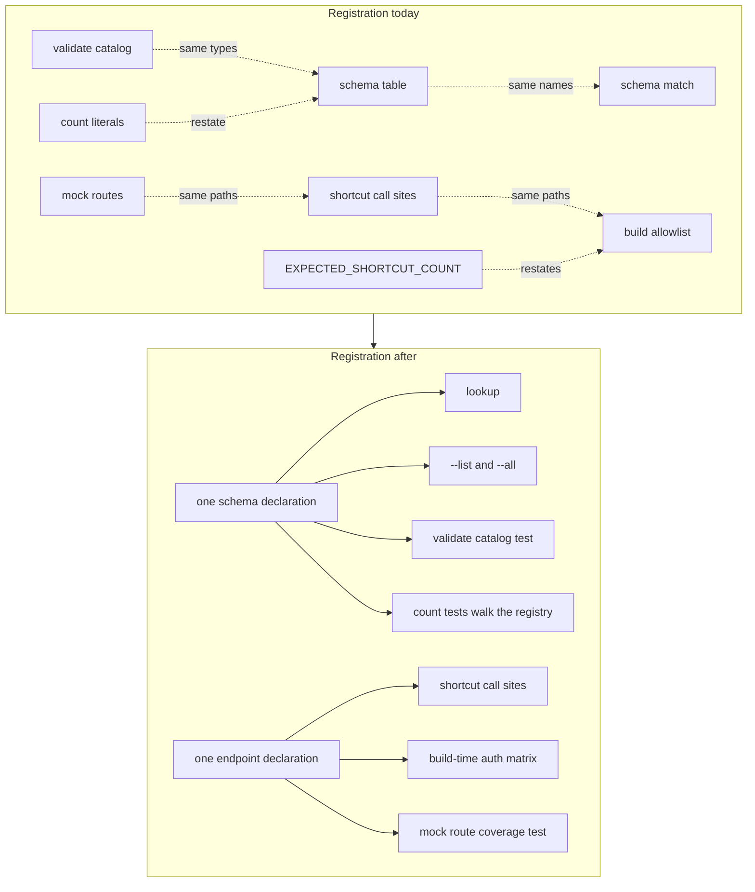

# Single Command Registration - Plan

## Goal Capsule

**Objective.** Someone adding a command family to `xr` declares it once per concern, and the test suite — not their
memory of a checklist — is what catches a family that is only half-registered. A family that never reached `xr schema`,
the in-process mock, or the examples page fails a test instead of shipping.

**Means.** Collapse each duplicated registration list to one declaration, and replace every hardcoded count with a walk
over the live registry (KTD1, KTD3).

**Authority hierarchy.** This plan, then the repo's active instructions (`AGENTS.md`, `CONTRIBUTING.md`, `CONCEPTS.md`),
then the implementer's judgment on details left open. Where this plan and
`docs/plans/2026-09-15-2343-refactor-adoption-grade-crate-plan.md` disagree about where a type lives, that plan governs
— it defines the crate boundary this one works inside.

**Stop conditions.** A golden fixture that changes as a *side effect* of a collapse, a published-surface break beyond
the existing waivers, or a registry walk that cannot be made to fail against a real omission. Any of these means the
shape is wrong; stop and record rather than re-blessing the fixture.

A fixture change is permitted only where a unit declares the content addition that causes it, and only for the three
fixtures named in KTD4. Every other fixture passes unchanged. The distinction is the whole point: a fixture that moves
because a refactor leaked is a defect, a fixture that moves because a unit deliberately added documented content is a
reviewed diff.

**Execution profile.** One branch cut from `dev`, one pull request targeting `dev`, outside any stack (KTD6). The
implementer runs the Verification Contract locally and opens the pull request; a human reviews and merges.

---

## Product Contract

### Summary

Every registration surface in `xr` that currently lists the same commands or endpoints twice collapses to one
declaration, and every test that pins a count of registered things becomes a walk over the live registry. Adding a
command family stops being a ten-file checklist whose omissions are silent.

### Problem Frame

A command family has to be registered in more hand-written places than a contributor can hold in their head, and the
places do not agree with each other by construction.

The broadcast chat moderator family (#182) is the worked example: 33 files changed, of which 10 were hand-written source
and the rest were regenerated artifacts. Within those 10, the same names were written down twice in three separate
pairs. `crates/xurl-cli/src/cli/commands/schema.rs` lists every command in the `SCHEMA_ENTRIES` table and then lists
them all again in the `schema_for_command` match. `crates/xdk/build.rs` carries a `SHORTCUT_TEMPLATES` allowlist of 38
endpoints that restates paths already written at the call sites in `crates/xdk/src/api/shortcuts.rs`, and
`crates/xdk/src/testing/mod.rs` writes those paths a third time as mock route patterns.
`crates/xurl-cli/src/cli/commands/validate.rs` keeps a third catalog of the same response types.

Two tests then pin those sets with literals rather than reading them. `crates/xurl-cli/tests/schema_tests.rs` asserted
39 rows and 38 entries and had to be bumped to 42 and 41 when the family landed. `crates/xdk/src/api/auth_matrix.rs`
carries `EXPECTED_SHORTCUT_COUNT: usize = 38` with a comment telling the reader to update the allowlist by hand. A
literal count is a tripwire that fires on every addition and proves nothing about the addition itself: it goes red for
the correct change and stays green for a family that was silently omitted from a sibling list.

The command surface has the same shape one level up. `crates/xurl-cli/src/cli/mod.rs` is 1,871 lines carrying 61
near-identical help constants across 64 `after_help` sites, five of them for the one broadcasts family.
`crates/xurl-cli/src/cli/commands/mod.rs` is 1,108 lines of 40 dispatch arms, where the add and remove verbs of a family
differ only in which shortcut they call. The examples page in `crates/xurl-cli/src/cli/commands/examples.rs` is
maintained by hand with nothing checking that a new family reached it.

### Requirements

**Schema registration**

- R1. One declaration per command names its response type, and `xr schema <command>`, `xr schema --list`, and `xr schema
  --all` all read that declaration.
- R2. The `xr validate` alias set, its validators, and the `--schema` help text all read one declaration, and every
  registry response type either has a validator or is named in a declared exemption set.
- R3. No test asserts a literal count of registered commands.
- R13. Every command clap can parse either has a schema registry row or is named in the declared schema-less set, and no
  command is in both or in neither.

**Endpoint registration**

- R4. One declaration per shortcut endpoint serves both the library call site and the build-time auth matrix.
- R5. The in-process testing mock answers every declared shortcut endpoint, proven by probing a running mock rather
  than by reading its route table.
- R6. No test or constant asserts a literal count of shortcut endpoints.
- R12. Every response fixture in the vendored-spec fixture file is exercised by a validation test, enforced by a test.

**Command surface**

- R7. A command family's help pages come from one shared shape, and every existing help page renders byte-identical
  output.
- R8. The verbs that resolve a handle and then call one shortcut share a single dispatch path.
- R9. Every command family clap can parse appears on the examples page, enforced by a test that reads clap's command
  tree rather than a hand-written family list.

**Preserved contracts**

- R10. Every golden fixture passes unchanged, except the three named in KTD4 that change because a unit deliberately
  adds documented content. No fixture changes as a side effect of a collapse.
- R11. The published library surface is unchanged, and `cargo semver-checks` reports no break beyond the waivers already
  in `crates/xdk/Cargo.toml`.

### Key Decisions

- **The registration surface shrinks; the command surface does not.** No command, flag, or output *shape* changes. Three
  surfaces gain *content* because a walk found them incomplete: nine families reach the examples page, seven already-wired
  schema aliases reach the `--schema` help text, and three real commands stop being reported as unknown. Governs R7, R10,
  R11.
- **Clap's command tree is the registry.** Every walk derives the set of commands it checks from `Cli::command()`, never
  from a list written into the test. A walk whose expected set is hand-written can detect a deletion but not an omission,
  and omission is the defect this plan exists to catch. Governs R9, R13.
- **Generated artifacts stay checked in.** The completions, response schemas, and golden fixtures remain committed and
  regenerated by their existing scripts; this work reduces the hand-written sites that feed them, not the artifacts
  themselves. Governs R1, R4.

### Scope Boundaries

- The 200-line refactor trigger applies to `crates/xurl-cli/src/cli/mod.rs` (1,871 lines) and
  `crates/xurl-cli/src/cli/commands/mod.rs` (1,108 lines), but splitting those files is not this work. This plan reduces
  what a new family adds to them; it does not restructure what is already there.
- The auth matrix stays scoped to the shortcut allowlist rather than widening to the whole vendored spec (KTD2).
- The examples page stays curated rather than generated (KTD5). The nine sections U4a adds are written by hand; only the
  check that every family has one is mechanical.
- The shared help shape (U5) earns its first user on the broadcasts family only. Converting the remaining families is
  deferred.

#### Deferred to Follow-Up Work

- Splitting `crates/xurl-cli/src/cli/mod.rs` and `crates/xurl-cli/src/cli/commands/mod.rs` along family boundaries.
- Deriving the examples page content from per-command examples, which would change what the page says.

---

## Planning Contract

### Key Technical Decisions

- KTD1. **The schema registry carries a schema thunk per entry.** Each `SCHEMA_ENTRIES` row gains a `fn() -> Value`
  column built from a non-capturing closure wrapping `schema_for!`, so the monomorphized call site the macro needs lives
  in the table rather than in a parallel match. The existing comment in `crates/xurl-cli/src/cli/commands/schema.rs`
  states a match is required because `schema_for!` needs types known at compile time; that is true of the macro's
  expansion site, not of the lookup, and a function-pointer column keeps the expansion at one site per entry. The thunk
  needs no fallible conversion: `schemars::Schema` is a newtype over `serde_json::Value` with an infallible `From<Schema>
  for Value`, so a `fn() -> Value` column introduces no panic path where the current code propagates with `?`. Retires
  the second list. Advances R1.
- KTD2. **One endpoint declaration shared by the shortcuts and the build script, not a widened matrix.** The alternative
  — dropping the allowlist and generating the auth matrix from the whole vendored spec — is simpler to write but changes
  behavior: raw-URL requests would start being auth-checked against endpoints no shortcut calls. (session-settled:
  user-directed — chosen over widening the matrix to the entire spec: raw-URL requests would begin being auth-checked.)
  Advances R4.
- KTD3. **Every count assertion becomes a registry walk.** Replace `EXPECTED_SHORTCUT_COUNT` and the two literals in
  `crates/xurl-cli/tests/schema_tests.rs` with assertions that derive both sides from live state, which is what makes an
  omission fail rather than an addition
  (`docs/solutions/conventions/registry-walk-coverage-tests-prevent-silent-omission.md`). Advances R3, R6.
- KTD4. **Help text stays byte-identical wherever a collapse touches it.** The collapse changes where a family's help
  strings are written, never what they render, so no golden help page moves because of U1, U3, U5, or U6.
  (session-settled: user-directed — chosen over normalizing wording across families while here: that re-blesses the
  pinned help pages.) Exactly three fixtures change, each because a unit declares the content addition that moves it:
  `examples.golden` (U4a writes nine missing family sections), `help-validate.golden` (U7 derives the `--schema` list
  from the alias table, which advertises seven aliases the text omits today), and `reason-unknown-schema.golden` (U7 adds
  the moderators alias). A fourth changed fixture is a stop condition. Advances R7, R10.
- KTD5. **The examples page stays curated, with a coverage test.** A test asserts every top-level command family appears
  on the page; the prose stays hand-written. (session-settled: user-directed — chosen over deriving the whole page from
  per-command examples: that changes the page's content.) Advances R9.
- KTD7. **Every walk reads clap's command tree, not a list in the test.** `Cli` is public at
  `crates/xurl-cli/src/cli/mod.rs`, the crate keeps a library target so its own integration tests can drive the
  dispatcher in-process, and six test files already `use xurl::cli`. A shared test helper returns the leaf command paths
  and the top-level families from `Cli::command()`; the examples walk and the schema exhaustiveness check both read it.
  Advances R9, R13.
- KTD8. **The mock walk probes a running mock over HTTP.** The mock's route table and its `Route` struct are private, so
  an integration test in another crate cannot read them, and exposing them would add public surface the plan promises not
  to change. Probing also tests the claim R5 actually makes — that the mock *answers* — rather than the proxy question of
  whether a pattern is present in a table. It catches a route whose regex never matches the path the shortcut really
  sends, which a table walk cannot. Advances R5, R11.
- KTD9. **The declared endpoint constants are the only source of `/2/` paths in the library's request layer.** The four
  URL-classification sites in `crates/xdk/src/api/media.rs` read the constants too, so the guard is an absolute ban on a
  `/2/` literal in `shortcuts.rs` and `media.rs` rather than a position-aware grep with a maintained exemption list. The
  value those sites need already exists as the public `MEDIA_ENDPOINT` constant in the same file. Advances R4.
- KTD6. **Ships as one pull request cut from `dev`, targeting `dev`, outside any stack.** (session-settled:
  user-directed — chosen over folding it into the broadcast-moderators pull request or adding a stack layer: it is
  cleanup of what that family exposed, not part of it.) The originally named base branch,
  `feat/xdk-13-broadcast-moderators`, merged into `dev` on 2026-09-17, so `dev` now contains it.

### High-Level Technical Design

Each collapse has the same shape: several consumers that each carry their own copy of a list become several consumers
reading one declaration, with a test walking the declaration to prove each consumer covers it.



The dotted edges are the defect: a name written in one box has to be written again in the box it points at, with nothing
checking the two agree. The solid edges are reads of a single owner.

The measured gap each walk closes, counted against the tree at `6ecd6a1`:

```text
             ONE DECLARATION                 WALK                    CONSUMER          GAP TODAY
  ┌──────────────────────────────┐
  │ clap command tree            │──[W1 examples]──────────────▶ examples.rs        9 of 40 families
  │   Cli::command()             │                                                  absent
  │   40 families                │──[W2 exhaustive]────────────▶ SCHEMA_ENTRIES     3 commands in
  │                              │                               + schema-less set  neither set
  └──────────────────────────────┘

  ┌──────────────────────────────┐
  │ SCHEMA_ENTRIES               │──[lookup]───────────────────▶ schema_for_command 22-arm match
  │   22 rows / 41 commands      │                                                  duplicates table
  │   + schema thunk column      │──[W3 list = all]────────────▶ --list, --all      2 literal counts
  └──────────────────────────────┘                                                  (42, 41)

  ┌──────────────────────────────┐
  │ alias table (U7)             │──[dispatch]─────────────────▶ validate_against   16 arms, untested
  │   16 aliases + moderators    │──[render]───────────────────▶ --schema help      9 advertised,
  └──────────────────────────────┘                                                  16 wired  DRIFTED

  ┌──────────────────────────────┐
  │ SHORTCUT_TEMPLATES (build.rs)│──[named consts]─────────────▶ shortcuts.rs       35 path literals
  │   38 endpoints               │                               media.rs            9 path literals
  │                              │──[W4 auth matrix]───────────▶ AUTH_MATRIX        covered today
  │                              │──[W5 http probe]────────────▶ MockX routes       16 of 38 with
  └──────────────────────────────┘                                                  no route
```

Five walks, five gaps. W1, W2, W4 and W5 are new; W3 replaces the two count literals. Every gap above is a measured
count against the current tree, not an estimate, and each one is a family that could be added tomorrow with nothing
going red.

### Assumptions

- A `const`-eligible table holding `fn() -> Value` entries built from non-capturing closures compiles on the pinned
  toolchain. U1 proves this on one entry before converting the rest; if it does not hold, a `static` table or a
  generated match from one list is the fallback and U1 records which. The conversion inside the thunk is infallible
  (KTD1), so the fallback question is closure-to-function-pointer coercion in a `const`, nothing else.
- A materialized path substitutes cleanly into every mock route pattern. The patterns widen `{id}` segments to
  `[0-9]+` and `{username}` to `[^/]+`, so substituting a numeric token for every parameter satisfies both. U4b fixes
  the substitution token in one helper rather than per call site; a parameter that later needs a non-numeric sample is a
  signal the route pattern changed shape.

---

## Implementation Units

### U1. One schema registry

**Goal:** `SCHEMA_ENTRIES` becomes the only place a command's response type is named, and `schema_for_command` reads it.

**Requirements:** R1, R13

**Dependencies:** none

**Files:**

- `crates/xurl-cli/src/cli/commands/schema.rs` (modify)
- `crates/xurl-cli/tests/schema_tests.rs` (modify — existing behavior coverage stays green)

**Approach:**

1. Add a schema-thunk column to the entry struct, populated per row from the same `schema_for!` invocation the match arm
   used.
2. Prove the table compiles with one converted entry before touching the rest (see Assumptions).
3. Replace `schema_for_command`'s body with a lookup over the table, keeping its two non-lookup arms: the
   no-typed-response commands that return a validation error, and the unknown-command arm that lists valid commands.
4. Delete the arms that the table now covers.
5. Promote the hardcoded no-typed-response arm to a declared set. It names six commands today and is missing three real
   ones: `xr schema skill`, `xr schema examples`, and `xr schema validate` each fall through to the unknown-command arm
   and report a command that plainly exists as unknown. Add them. No golden fixture pins these three messages, and the
   four commands `schema_tests.rs` asserts on stay correct.

**Patterns to follow:** the existing `print_schema_list` and `print_all_schemas` already iterate `SCHEMA_ENTRIES`; the
lookup joins them rather than introducing a new access shape.

**Test scenarios:**

- `xr schema post` returns the same schema document as before the change, for one command from each entry group.
- `xr schema broadcasts` returns the `schema not available` validation error, unchanged.
- `xr schema nonsense` returns the unknown-command error and its message lists the registered commands.
- `xr schema skill`, `xr schema examples`, and `xr schema validate` each return `schema not available` rather than
  `unknown command`.
- `xr schema --all` emits one entry per registered command with no duplicates and no omissions.
- `xr schema --list` output is byte-identical to the committed golden fixture.
- Every leaf command clap can parse is in exactly one of the registry or the schema-less set, with the failure message
  naming any command in neither and any command in both.

**Verification:** the golden schema-list fixture passes unchanged, no command name appears twice in the file, and the
exhaustiveness check has been observed failing against a command removed from both sets.

### U2. Count assertions read the registry

**Goal:** No test pins a literal number of registered commands.

**Requirements:** R3

**Dependencies:** U1

**Files:**

- `crates/xurl-cli/tests/schema_tests.rs` (modify)

**Approach:** replace both literals with assertions derived from live state — the `--list` row count equals the `--all`
entry count plus the envelope row, and every name in one appears in the other. The test then fails when a command
reaches one surface but not the other, and stays green when a family is added correctly.

**Execution note:** confirm each new assertion fails against a deliberately half-registered command before keeping it; a
coverage test that cannot go red is decoration.

**Test scenarios:**

- Adding a registered command to the table changes no assertion in this file.
- A command present in the table but absent from `--list` output fails with a message naming it.
- A command present in `--list` but absent from `--all` fails with a message naming it.
- The envelope row is still advertised by `--list`.

**Verification:** both former literal assertions are gone, and the file contains no bare integer expectation about
command counts.

### U3. One endpoint declaration

**Goal:** A shortcut endpoint's method and path are written once and consumed by both the call site and the build-time
auth matrix.

**Requirements:** R4, R6, R11

**Dependencies:** none

**Files:**

- `crates/xdk/build.rs` (modify)
- `crates/xdk/src/api/shortcuts.rs` (modify)
- `crates/xdk/src/api/media.rs` (modify)
- `crates/xdk/src/api/auth_matrix.rs` (modify — remove `EXPECTED_SHORTCUT_COUNT` and its anchor test)
- `crates/xdk/tests/auth_matrix_coverage.rs` (modify)

**Approach:** the declaration already exists and already reaches the crate. `crates/xdk/build.rs` emits its
`SHORTCUT_TEMPLATES` list into the generated module, and `crates/xdk/src/api/auth_matrix.rs` re-exports it. What is
missing is that the call sites never read it: `crates/xdk/src/api/shortcuts.rs` writes 36 path literals of its own and
`crates/xdk/src/api/media.rs` writes 9 more. The work is to close that loop rather than to invent a new home.

1. Have the build script emit a named constant per endpoint alongside the existing tuple list, so a call site can name
   an endpoint instead of spelling its path.
2. Repoint the shortcut and media call sites at those constants, leaving each call site's path-parameter and query
   construction exactly as it is. The shortcut sites already pass the spec-shaped template to a `template()` helper that
   owns substitution, so this is a literal-for-constant swap with no new runtime machinery.
3. Repoint the four URL-classification sites in `crates/xdk/src/api/media.rs` at the same constants (KTD9). They inspect
   a caller-supplied URL rather than declaring an endpoint, but they spell out a value the file already exposes as the
   public `MEDIA_ENDPOINT` constant. One site splits on a trailing-slash prefix and needs a derived value rather than the
   constant verbatim.
4. Delete `EXPECTED_SHORTCUT_COUNT` and the anchor test that reads it (KTD3); the coverage test in
   `crates/xdk/tests/auth_matrix_coverage.rs` already walks the list and is the real guard.

**Execution note:** the build script panics by design when a declared path is absent from the vendored spec. Keep that
behavior — it is the earliest tripwire for a spec revision that drops an endpoint, per `CONCEPTS.md`.

**Test scenarios:**

- Every declared endpoint resolves in the generated auth matrix, with the failure message naming the endpoint that did
  not.
- A declared endpoint whose path is absent from the vendored spec fails the build with a message naming the path and
  pointing at the refresh script.
- Declared methods are uppercase and standard, with a non-standard method failing by name.
- The matrix is non-empty, so the coverage walk cannot pass vacuously.
- No `/2/` path literal remains anywhere in `crates/xdk/src/api/shortcuts.rs` or `crates/xdk/src/api/media.rs`, so a
  call site and the auth matrix cannot disagree. The ban is absolute rather than scoped to declaration positions, which
  is why the classification sites move too.
- The media URL classification still routes an initialize, append, finalize and status URL to the same branch it does
  today, proven against the existing media coverage rather than by inspection.

**Verification:** `EXPECTED_SHORTCUT_COUNT` no longer exists anywhere, `rg '"/2/' crates/xdk/src/api/` returns nothing,
the auth-matrix tests pass, and `cargo semver-checks` reports no new break.

### U4a. Registry-walk coverage for the surfaces a family can miss

**Goal:** Three surfaces a new family can silently miss are each covered by a walk over the live registry, and the
examples page gains the nine families it is missing.

**Requirements:** R2, R9, R12, R13

**Dependencies:** U1, U3

**Files:**

- `crates/xdk/tests/spec_validation.rs` (modify — add the fixture-coverage walk)
- `crates/xurl-cli/tests/schema_tests.rs` (modify — add the validate-catalog walk and the clap exhaustiveness walk)
- `crates/xurl-cli/tests/agentic_tests.rs` (modify — add the examples-page walk)
- `crates/xurl-cli/src/cli/commands/examples.rs` (modify — write the nine missing family sections)
- `crates/xurl-cli/tests/golden/examples.golden` (re-bless — the only fixture this unit changes)
- `crates/xurl-cli/tests/common/` (modify — the shared clap command-tree helper, KTD7)

**Approach:** each walk derives its expected set from the live declaration rather than a literal, and the family set
comes from `Cli::command()` rather than a list written into the test.

1. Add the shared helper that returns the leaf command paths and the top-level families from clap's command tree. Both
   the examples walk and the U1 exhaustiveness check read it.
2. The fixture walk asserts every response fixture key is exercised by a validation test. The file carries 18 response
   fixtures plus a `description` metadata key, and 18 tests name them, so the sets agree today with nothing holding them
   there. U4b adds one more fixture, which this walk then requires a test for.
3. The validate walk asserts every response type in the schema registry either has a validator in the `xr validate`
   alias table or is named in the declared exemption set. Five registry types are CLI-local and will never be
   validatable: `Vec<AppStatusEntry>`, `RedirectUriGetResponse`, `RedirectUriSetResponse`, `InstallEnvelope`, and
   `InstallMultiEnvelope`. They are the exemption set, declared in one place and named in the failure message so the
   next reader knows the list is deliberate.
4. The examples walk asserts every top-level family from clap's tree appears on the examples page. Nine are absent
   today: `delete`, `unrepost`, `unbookmark`, `following`, `followers`, `skill`, `completions`, `version`, and
   `validate`. Write a section for each in the page's existing voice, then re-bless `examples.golden` once. That is the
   content addition KTD4 permits; a second changed fixture in this unit is a stop condition.

**Execution note:** each walk has to be seen failing against a real omission before it counts. Remove one entry from the
surface under test, observe the message name it, restore it. A walk that cannot be made to go red is decoration, and a
walk whose expected set is hand-written can only go red for a deletion.

**Test scenarios:**

- A response type in the schema registry with no validator and no exemption fails, naming the type.
- A type named in the exemption set that the registry no longer produces fails, so the exemption list cannot rot.
- A command family absent from the examples page fails, naming the family.
- A family added to clap with no examples section fails without anyone editing the test.
- A response fixture with no validation test fails, naming the fixture key, and the `description` metadata key is not
  treated as a fixture.
- The examples page renders the nine new sections and the rest of the page byte-identical to its previous content.

**Verification:** the three walks pass, each has been observed red against a removed entry, and `examples.golden` is the
only fixture this unit changes.

### U4b. The mock answers every declared endpoint

**Goal:** The in-process testing mock answers all 38 declared shortcut endpoints, proven by probing a running mock.

**Requirements:** R5, R11, R12

**Dependencies:** U3

**Files:**

- `crates/xdk/src/testing/mod.rs` (modify — add the 16 missing routes)
- `crates/xdk/tests/fixtures/openapi/example_responses.json` (modify — add the usage-credits fixture)
- `crates/xdk/tests/spec_validation.rs` (modify — the new fixture's validation test, required by R12)
- `crates/xdk/tests/mock_endpoint_coverage.rs` (create — the HTTP probe walk)
- `crates/xdk/Cargo.toml` (modify — the new test target's `required-features`)

**Approach:** the mock answers 22 of the 38 declared endpoints. The 16 it misses are not a maybe; they are 42% of the
surface, and the walk cannot pass until they exist.

1. Add the 10 missing user-graph routes: the four list reads (`followers`, `following`, `muting`, `blocking`) and the
   six delete verbs (unlike, unrepost, unbookmark, unfollow, unmute, unblock). Each reuses a fixture the file already
   carries, `user_list` for the reads and the matching `action_*` for the deletes.
2. Add the five media-upload routes. `media_upload_init` and `media_upload_status` already exist, so these are canned
   responses; the mock needs no upload state machine because each route answers independently.
3. Add `GET /2/usage/credits`, the one endpoint with no fixture at all. Write a `usage_credits` fixture shaped to
   `ApiResponse<UsageCreditsData>` and the `spec_validation.rs` test R12 then requires for it.
4. Write the probe walk: start `MockX`, materialize each declared template into a concrete path with a numeric token,
   issue the declared method, and assert a seeded answer rather than an unmatched-route response.
5. Gate the new test file on the `testing` feature so plain `cargo test --workspace` still compiles. The feature is
   `testing = ["dep:wiremock"]` and today only the `offline_search` example declares `required-features`; no test target
   does, because no test uses the mock at all.

**Execution note:** this unit is the first test coverage the published mock has ever had. Its only user in the tree is
`crates/xdk/examples/offline_search.rs`. Expect the probe to find more than missing routes; a route pattern that never
matches the path its shortcut really sends has had nothing to catch it.

**Test scenarios:**

- Every declared endpoint returns a seeded response, with the failure naming the method and path that did not.
- A route removed from the mock fails the probe, naming the endpoint.
- A route whose pattern cannot match its shortcut's real path fails, which a route-table walk would miss.
- The new usage-credits fixture deserializes into `ApiResponse<UsageCreditsData>`.
- `cargo test --workspace` compiles and passes without the `testing` feature enabled.

**Verification:** the probe covers all 38 declared endpoints, has been observed red against a removed route, and the
published surface is unchanged, so no new item is exposed to satisfy the walk.

### U5. Family help constants from one shape

**Goal:** A command family's help pages come from one shared shape instead of one constant per verb.

**Requirements:** R7, R10

**Dependencies:** none

**Files:**

- `crates/xurl-cli/src/cli/mod.rs` (modify)
- `crates/xurl-cli/tests/golden_tests.rs` (no change expected — the fixtures prove the bytes)

**Approach:**

1. Take the broadcasts family's five constants as the first case, since they were written together and share a shape
   exactly.
2. Introduce one declarative shape that renders the family's help strings, driven by the family name, its verbs, and the
   example arguments.
3. Leave every other family's constants alone in this unit. The shape has to earn its second and third user before it is
   worth applying broadly.

**Execution note:** the golden fixtures are the proof. Run them after each family is converted; a single changed byte
means the shape is wrong, not that the fixture is stale (KTD4).

**Test scenarios:**

- Each of the five broadcasts help pages renders byte-identical output to its committed golden fixture.
- The root help page is unchanged.
- The examples golden fixture is unchanged by this unit. U4a is the only unit permitted to move it.
- A family declared through the shared shape with a missing verb fails to compile rather than rendering an empty
  section.

**Verification:** `cargo test -p xurl-rs --test golden_tests` passes with no fixture re-blessed, and the broadcasts
family's five separate constants are gone.

### U6. One dispatch path for the resolve-then-call verbs

**Goal:** The verbs that resolve a handle to a user id and then call one shortcut share a single path instead of one
copy per verb.

**Requirements:** R8, R10

**Dependencies:** none

**Files:**

- `crates/xurl-cli/src/cli/commands/mod.rs` (modify)
- `crates/xurl-cli/tests/wiring_tests.rs` (modify)

**Approach:**

1. Name the shape precisely before extracting it: build a dry-run context, validate the handle, resolve it, call one
   shortcut, print the typed response. Eleven call sites resolve a target handle and twenty-one reference the caller's
   own id, so the two shapes may need separate helpers rather than one over-parameterized helper.
2. Extract the shape that appears with no per-verb variation first, and leave arms that differ in any other way alone.
3. Keep each arm's dry-run context payload exactly as it is; the dry-run golden fixtures pin that JSON.

**Test scenarios:**

- Each converted verb's dry-run output is byte-identical to its committed golden fixture.
- A converted verb with an empty handle returns the same validation reason and exit code as before.
- A converted verb resolves the handle before calling the shortcut, proven through the mock by asserting the lookup
  request precedes the action request.
- A converted verb's JSON envelope is unchanged for a successful call.
- The arms that were deliberately not converted still compile and pass their existing coverage.

**Verification:** the golden and wiring suites pass unchanged, and the converted arms no longer repeat the
resolve-then-call body.

### U7. One validate alias declaration

**Goal:** The `xr validate` alias set, its validators, and its help text read one declaration.

**Requirements:** R2, R10

**Dependencies:** none

**Files:**

- `crates/xurl-cli/src/cli/commands/validate.rs` (modify)
- `crates/xurl-cli/src/cli/mod.rs` (modify — the `--schema` help derives from the table)
- `crates/xurl-cli/tests/golden/help-validate.golden` (re-bless)
- `crates/xurl-cli/tests/golden/reason-unknown-schema.golden` (re-bless)

**Approach:** this file carries the same defect the plan opens with, one level tighter, and one copy has already
drifted into shipped output.

1. Collapse `known_schemas()` and the `validate_against` match into one alias-to-validator declaration. They agree today
   at 16 entries with nothing holding them there; the `"has no validator wired up"` arm exists precisely because the
   author foresaw the drift and had no way to prevent it.
2. Derive the `--schema` argument help from that table. It advertises nine aliases while sixteen are wired, so
   `xr validate --help` and `xr validate --schema bogus` contradict each other in shipped output today.
3. Add the missing `ChatModeratorsResult` validator. The broadcast moderators family is the plan's worked example and it
   reaches the schema registry without reaching the validate catalog, which is the exact drift this plan exists to catch.
4. Re-bless the two fixtures that carry the alias list. Both changes are content the table now generates, not shape.

**Test scenarios:**

- Every alias in the declaration has a validator, proven by dispatching each one rather than by counting.
- The `--schema` help text lists exactly the aliases the error envelope lists, with neither able to drift from the other.
- `xr validate --schema moderators` accepts a chat-moderators response and rejects a post.
- The unknown-schema error envelope names the full alias set including the new one.
- Auto-detection behavior for every existing shape is unchanged.

**Verification:** the alias list appears once in the source, the two re-blessed fixtures differ only in the alias list,
and the dead `"has no validator wired up"` arm is gone because it is now unreachable by construction.

---

## Verification Contract

| Gate              | Command                                                                   | Units          | Signal                                |
| ----------------- | ------------------------------------------------------------------------- | -------------- | ------------------------------------- |
| Format            | `cargo fmt --all --check`                                                 | all            | clean                                 |
| Lint              | `RUSTFLAGS=-Dwarnings cargo clippy --workspace --all-targets`             | all            | clean                                 |
| Tests             | `cargo test --workspace`                                                  | all            | green, and compiles without `testing` |
| Library features  | `cargo test -p xdk-rs --all-features`                                     | U3, U4a, U4b   | green                                 |
| Golden fixtures   | `cargo test -p xurl-rs --test golden_tests`                               | U1, U5, U6, U7 | green; exactly 3 fixtures re-blessed  |
| Path-literal ban  | `rg '"/2/' crates/xdk/src/api/`                                           | U3             | no matches                            |
| Count-literal ban | `rg 'EXPECTED_SHORTCUT_COUNT' crates/`                                    | U3             | no matches                            |
| Completions       | `scripts/generate-completions.sh --check`                                 | U5             | clean                                 |
| Response schemas  | `scripts/generate-response-schemas.sh`, then `git status --short schema/` | U1             | empty                                 |
| Published surface | the CI `Public API semver` job                                            | U3, U4b        | no break beyond the existing waivers  |
| Full mirror       | `LC_ALL=C.UTF-8 scripts/hooks/pre-push`                                   | all            | green before the push                 |

The golden suite is the load-bearing gate. It pins every help page, the examples page, the schema list, and the dry-run
envelopes, which is exactly the surface this work moves without changing. Exactly three fixtures may differ at the end of
this work, each named in KTD4 and each attributable to a unit that declares the content addition. A fourth is a defect.

The count is itself a gate: `git diff --name-only crates/xurl-cli/tests/golden/` must list `examples.golden`,
`help-validate.golden`, and `reason-unknown-schema.golden`, and nothing else.

---

## Definition of Done

**Global**

- Every requirement R1 through R13 holds.
- No literal count of registered commands or endpoints remains in any test or constant.
- Every gate in the Verification Contract passes, and exactly the three fixtures named in KTD4 differ.
- Each registry walk added by U2, U4a and U4b has been observed failing against a real omission, and the failure message
  names the missing entry.
- No walk derives its expected set from a list written into a test. Every one reads clap's command tree, the schema
  registry, the alias table, or the declared endpoint list.
- No abandoned approach is left in the diff. If the schema-thunk table did not work out, the fallback is in place and
  the Assumptions entry is resolved to say which shape shipped.
- One pull request, cut from `dev` and targeting `dev`, with its body filled from the repo template.

**Per unit**

| Unit | Done when                                                                                                                              |
| ---- | -------------------------------------------------------------------------------------------------------------------------------------- |
| U1   | A response type is named in exactly one place, every command is in exactly one of the two sets, and `schema-list.golden` is unchanged. |
| U2   | Both count literals are gone and the replacements have been seen red.                                                                  |
| U3   | `EXPECTED_SHORTCUT_COUNT` is gone, no `/2/` literal remains in the request layer, and the published surface is unbroken.               |
| U4a  | The fixture, validate-catalog and examples walks are each seen red, and `examples.golden` is the one fixture it moves.                 |
| U4b  | All 38 declared endpoints answer from a running mock, and the probe has been seen red against a removed route.                         |
| U5   | The broadcasts family renders from one shape with five fixtures unchanged.                                                             |
| U6   | The converted verbs share one path with their dry-run fixtures unchanged.                                                              |
| U7   | The alias list appears once, the help text and the error envelope cannot disagree, and moderators responses validate.                  |

---

## What already exists

The plan reuses more than it builds. Each row is machinery already in the tree that a unit reads rather than reinvents.

| Existing                        | Where                                              | How the plan uses it                                                                                                                                          |
| ------------------------------- | -------------------------------------------------- | ------------------------------------------------------------------------------------------------------------------------------------------------------------- |
| `template()` + params map       | `crates/xdk/src/api/shortcuts.rs:149`              | Call sites already pass the spec-shaped template and let the helper substitute, so U3 is a literal-for-constant swap with no substitution machinery to write. |
| `SHORTCUT_TEMPLATES` re-export  | `crates/xdk/src/api/auth_matrix.rs:118`            | The declaration already reaches the crate. U3 closes the loop at the call sites rather than inventing a new home.                                             |
| `auth_matrix_coverage.rs` walk  | `crates/xdk/tests/`                                | Already a registry walk with a naming failure message. U3 deletes the count anchor beside it and keeps the walk as the real guard.                            |
| `dry_run_or_validate()`         | `crates/xurl-cli/src/cli/commands/mod.rs:130`      | Half of U6's shape is already extracted; U6 extends an existing helper instead of starting from the arms.                                                     |
| `MEDIA_ENDPOINT`                | `crates/xdk/src/api/media.rs:15`                   | Already public and already the right value. KTD9 points the four classification sites at it.                                                                  |
| Library target on the CLI crate | `crates/xurl-cli/Cargo.toml`                       | Exists so integration tests can drive the dispatcher in-process. KTD7's clap walk needs nothing new.                                                          |
| `known_schemas()` guard arm     | `crates/xurl-cli/src/cli/commands/validate.rs:220` | The author already anticipated the drift U7 makes impossible. U7 deletes the arm rather than adding a check beside it.                                        |
| Fixtures for the media flow     | `example_responses.json`                           | `media_upload_init` and `media_upload_status` already exist, which is why U4b's five media routes are cheap.                                                  |

Nothing in the plan rebuilds a thing that already works. The one place a new abstraction appears is U5's shared help
shape, and that is deliberately limited to a single family until it earns a second user.

## NOT in scope

| Deferred                                                                                         | Why                                                                                                                                                                                          |
| ------------------------------------------------------------------------------------------------ | -------------------------------------------------------------------------------------------------------------------------------------------------------------------------------------------- |
| Splitting `cli/mod.rs` (1,871 lines) and `commands/mod.rs` (1,108 lines) along family boundaries | The 200-line trigger fires on both, but restructuring what is already there is a different change from reducing what a new family adds. Mixing them would make every golden diff unreadable. |
| Converting the other 35 families to U5's shared help shape                                       | The shape must earn its second and third user first. Converting 61 help constants in the same pull request puts the whole golden suite in one diff.                                          |
| Deriving the examples page content from per-command examples                                     | Changes what the page says, not just whether a family reaches it. KTD5 keeps the prose curated.                                                                                              |
| Widening the auth matrix to the whole vendored spec                                              | Behavior change, not cleanup: raw-URL requests would start being auth-checked against endpoints no shortcut calls (KTD2).                                                                    |
| Validators for the five CLI-local response types                                                 | `Vec<AppStatusEntry>`, the two redirect-uri responses and the two install envelopes are not API response shapes. They are the declared exemption set in U4a, not future work.                |
| A stateful media-upload rehearsal in the mock                                                    | U4b's five media routes answer independently from existing fixtures. A mock that tracks an upload across initialize, append and finalize is a separate capability nothing asks for yet.      |

No `TODOS.md` exists in this repo and repo policy keeps TODO files out of git, so the deferrals above are the record.
This review surfaced no deferral that the plan's own scope boundaries did not already cover.

## Test coverage

```text
CODE PATHS                                          REGISTRY WALKS
[~] cli/commands/schema.rs                          [+] W1 examples page coverage
  ├── schema_for_command()                            ├── [GAP] family in clap, absent from page
  │   ├── [★★★ TESTED] typed lookup — schema_tests      └── [GAP] expected set read from clap, not a list
  │   ├── [★★  TESTED] schema-less arm — :180-207    [+] W2 schema exhaustiveness
  │   └── [GAP] 3 cmds in neither set → wrong error    ├── [GAP] command in neither set
  └── print_all_schemas()                             └── [GAP] command in both sets
      └── [★★★ TESTED] golden schema-list            [+] W3 list/all agreement (replaces 2 literals)
[~] cli/commands/validate.rs                          └── [GAP] name in one surface, not the other
  ├── known_schemas() ─┐ untested pair               [+] W4 auth matrix coverage
  ├── validate_against()┘                             └── [★★★ TESTED] already green
  │   ├── [★★  TESTED] valid/invalid — agentic:464     [+] W5 mock answers every endpoint
  │   └── [GAP] alias advertised with no validator     ├── [GAP] 16 of 38 endpoints unanswered
  └── --schema help text                              └── [GAP] pattern never matches real path
      └── [GAP] 9 advertised vs 16 wired  DRIFTED     [+] W6 fixture coverage
[~] xdk/src/api/media.rs                              └── [GAP] fixture with no validation test
  └── 4 URL classification sites
      └── [★★  TESTED] existing media coverage
[~] xdk/src/testing/mod.rs
  └── MockX — [GAP] zero test users today

COVERAGE BEFORE: 5/16 paths tested (31%)   AFTER: 16/16 (100%)
QUALITY: ★★★:4 ★★:4  |  GAPS CLOSED: 11  |  NEW UNITS: U4a, U4b, U7
```

Every `[GAP]` above becomes a named test scenario in U1, U2, U4a, U4b or U7. None is deferred.

## Failure modes

| New codepath                  | Realistic production failure                                     | Covered by a test                                                   | Error handling                                                     | What the user sees                                                                                                                                                 |
| ----------------------------- | ---------------------------------------------------------------- | ------------------------------------------------------------------- | ------------------------------------------------------------------ | ------------------------------------------------------------------------------------------------------------------------------------------------------------------ |
| Schema thunk table (U1)       | A row's thunk names a different type than its `type_name` column | Yes, `--all` walks every row and compares                           | N/A, compile-time types                                            | Correct schema, wrong label, caught in CI                                                                                                                          |
| Schema-less set (U1)          | A new command added to neither set                               | Yes, W2 exhaustiveness                                              | Falls to unknown-command arm                                       | Would have been a wrong error; now a red test                                                                                                                      |
| Endpoint constants (U3)       | A constant renamed but a call site missed                        | Yes, compile error                                                  | N/A                                                                | Build fails, never ships                                                                                                                                           |
| Media URL classification (U3) | A derived prefix constant drifts from the endpoint               | Yes, existing media coverage plus the path-literal ban              | Falls through to the non-media branch                              | Upload misrouted. This is the one path where a silent wrong answer is possible, which is why the prefix derives from the constant rather than being spelled again. |
| Mock probe (U4b)              | A route pattern that cannot match its shortcut's real path       | Yes, that is exactly what probing catches and a table walk does not | N/A, test-only                                                     | Embedder tests fail confusingly against the mock                                                                                                                   |
| Alias table (U7)              | An alias advertised with no validator                            | Yes, dispatch each alias                                            | The `"no validator wired up"` arm, which U7 deletes as unreachable | Today a confusing runtime error; after U7, impossible                                                                                                              |
| Clap walk helper (KTD7)       | A clap major bump changes the introspection API                  | Compile error in one helper                                         | N/A                                                                | Build fails in one place, not forty                                                                                                                                |

No failure mode is left with no test, no error handling, and a silent outcome. The closest is media URL classification,
and KTD9 is the mitigation: the classification reads the same constant the declaration does, so the two cannot drift.

## Worktree parallelization strategy

| Step | Modules touched                                                    | Depends on |
| ---- | ------------------------------------------------------------------ | ---------- |
| U1   | `xurl-cli/src/cli/commands/`                                       | —          |
| U2   | `xurl-cli/tests/`                                                  | U1         |
| U3   | `xdk/src/api/`, `xdk/build.rs`                                     | —          |
| U4a  | `xurl-cli/tests/`, `xurl-cli/src/cli/commands/`                    | U1, U3     |
| U4b  | `xdk/src/testing/`, `xdk/tests/`                                   | U3         |
| U5   | `xurl-cli/src/cli/mod.rs`                                          | —          |
| U6   | `xurl-cli/src/cli/commands/mod.rs`                                 | —          |
| U7   | `xurl-cli/src/cli/commands/validate.rs`, `xurl-cli/src/cli/mod.rs` | —          |
| --   | ------------------------------------------------------------------ | -          |

```text
Lane A:  U1 ──▶ U2 ──▶ U4a          (shared: xurl-cli/src/cli/commands/, tests/)
Lane B:  U3 ──▶ U4b                 (shared: xdk/)
Lane C:  U5                         (independent: cli/mod.rs help constants)
Lane D:  U6                         (independent: commands/mod.rs dispatch arms)
Lane E:  U7                         (touches cli/mod.rs + validate.rs)

Launch A, B, C, D, E.  U4a additionally waits on Lane B reaching U3.
```

**Conflict flags.** Lanes C and E both touch `crates/xurl-cli/src/cli/mod.rs`, C in the help constants and E in the
`--schema` argument. The regions do not overlap but the file does, so land one before the other rather than merging both
at once. Lanes A and E both touch `crates/xurl-cli/src/cli/commands/`, in `schema.rs` and `validate.rs` respectively, so
they conflict only if one reaches into the other's file. Lane B is fully independent of the CLI crate until U4a.

Given KTD6 ships this as a single pull request, the lanes are an ordering aid for one implementer, not a fan-out plan.
Sequential C, E, A, B, D is the lowest-friction order because it retires the two shared-file lanes first.

## Implementation Tasks

Synthesized from this review's findings. Each task derives from a specific finding above.

- [ ] **T1 (P1, human: ~3h / CC: ~20min)** — `xdk/src/testing/` — Add the 16 unanswered routes and the usage-credits fixture
  - Surfaced by: Architecture — the mock answers 22 of 38 declared endpoints, a 42% gap U4 described as a maybe
  - Files: `crates/xdk/src/testing/mod.rs`, `crates/xdk/tests/fixtures/openapi/example_responses.json`, `crates/xdk/tests/spec_validation.rs`
  - Verify: `cargo test -p xdk-rs --all-features`
- [ ] **T2 (P1, human: ~2.5h / CC: ~18min)** — `xdk/tests/` — Write the HTTP probe walk and gate it on the testing feature
  - Surfaced by: Architecture — the mock route table is private, so U4's walk cannot be written where the plan puts it
  - Files: `crates/xdk/tests/mock_endpoint_coverage.rs`, `crates/xdk/Cargo.toml`
  - Verify: `cargo test --workspace` compiles without the feature; `cargo test -p xdk-rs --all-features` passes
- [ ] **T3 (P1, human: ~2h / CC: ~15min)** — `xurl-cli/src/cli/commands/` — Write the nine missing examples-page sections
  - Surfaced by: Architecture — R9 collides with R10; nine of 40 families are absent and the page is golden-pinned
  - Files: `crates/xurl-cli/src/cli/commands/examples.rs`, `crates/xurl-cli/tests/golden/examples.golden`
  - Verify: `cargo test -p xurl-rs --test golden_tests`, with `examples.golden` the only fixture changed
- [ ] **T4 (P1, human: ~3h / CC: ~20min)** — `xurl-cli/src/cli/commands/` — Collapse the validate alias table
  - Surfaced by: Architecture — `--help` advertises 9 aliases, the error envelope lists 16, and they disagree today
  - Files: `crates/xurl-cli/src/cli/commands/validate.rs`, `crates/xurl-cli/src/cli/mod.rs`, two golden fixtures
  - Verify: `cargo test -p xurl-rs --test golden_tests`; the alias list appears once in the source
- [ ] **T5 (P1, human: ~3h / CC: ~20min)** — `xurl-cli/tests/` — Add the clap command-tree helper every walk reads
  - Surfaced by: Architecture — a walk with a hand-written expected set detects deletions, never omissions
  - Files: `crates/xurl-cli/tests/common/`, `crates/xurl-cli/tests/agentic_tests.rs`, `crates/xurl-cli/tests/schema_tests.rs`
  - Verify: adding a clap subcommand with no examples section turns the walk red without editing the test
- [ ] **T6 (P2, human: ~1.5h / CC: ~10min)** — `xurl-cli/src/cli/commands/` — Declare the schema-less set
  - Surfaced by: Code Quality — `xr schema skill`, `examples` and `validate` report real commands as unknown
  - Files: `crates/xurl-cli/src/cli/commands/schema.rs`, `crates/xurl-cli/tests/schema_tests.rs`
  - Verify: those three return `schema not available`; the exhaustiveness walk goes red against a command in neither set
- [ ] **T7 (P2, human: ~1h / CC: ~8min)** — `xdk/src/api/` — Point the media URL classifiers at the endpoint constants
  - Surfaced by: Code Quality — U3's no-literal guard trips on four legitimate classification sites that duplicate `MEDIA_ENDPOINT`
  - Files: `crates/xdk/src/api/media.rs`
  - Verify: `rg '"/2/' crates/xdk/src/api/` returns nothing; existing media coverage stays green

## GSTACK REVIEW REPORT

| Run                                   | Status   | Findings                                                                          |
| ------------------------------------- | -------- | --------------------------------------------------------------------------------- |
| plan-eng-review (native, FULL_REVIEW) | complete | 7 findings, all resolved and folded                                               |
| Architecture                          | complete | 4 findings (Issues 1, 2, 3, 4)                                                    |
| Code Quality                          | complete | 2 findings (Issues 5, 6) plus 1 false finding withdrawn                           |
| Tests                                 | complete | 1 blocking finding (Issue 7); remaining coverage folded into U1, U2, U4a, U4b, U7 |
| Performance                           | complete | no issues found                                                                   |
| Outside voice (codex)                 | skipped  | `codex_reviews` disabled by config; no fallback reviewer dispatched               |

**Findings and dispositions**

| # | Sev | Conf  | Location                                               | Finding                                                                                            | Disposition                                                                         |
| - | --- | ----- | ------------------------------------------------------ | -------------------------------------------------------------------------------------------------- | ----------------------------------------------------------------------------------- |
| 1 | P1  | 9/10  | `xdk/src/testing/mod.rs:68` vs `xdk/build.rs:38`       | The mock answers 22 of 38 declared endpoints; U4 called touching it conditional                    | Complete the mock: U4b adds 16 routes and one fixture                               |
| 2 | P1  | 9/10  | `xurl-cli/tests/golden_tests.rs:301`                   | R9 requires content the golden-pinned examples page lacks for 9 of 40 families, colliding with R10 | Write the nine sections, re-bless one fixture deliberately; KTD4 now draws the line |
| 3 | P1  | 8/10  | `validate.rs:36`, `validate.rs:183`, `cli/mod.rs:1423` | Three copies of the alias list, one already drifted in shipped output                              | New U7 collapses the table, derives the help, adds the moderators validator         |
| 4 | P1  | 9/10  | plan, all four walks                                   | No walk said where its command set comes from; a hand-written set cannot detect omission           | KTD7: every walk reads `Cli::command()`                                             |
| 5 | P2  | 9/10  | `schema.rs:146`                                        | The schema-less arm is a fourth hand-maintained list, already missing 3 real commands              | U1 declares the set and asserts exhaustiveness against clap                         |
| 6 | P2  | 9/10  | `media.rs:362,366,371,405`                             | U3's no-literal guard has four built-in false positives that duplicate a public constant           | KTD9: classifiers read the constants, guard becomes absolute                        |
| 7 | P1  | 10/10 | `testing/mod.rs:58,68`                                 | U4's mock walk cannot be written where the plan puts it; the route table is private                | KTD8: probe a running mock over HTTP instead                                        |
| - | --  | ----- | ----------------------                                 | -----------------------------------------------------------------------------------                | --------------------------------------------                                        |

**Suppressed findings**

- The plan states shortcuts.rs carries 36 path literals; the tree has 35, with `"/2/tweets"` appearing three times.
  Cosmetic, no action taken.
- Suspected error-handling regression in KTD1's `fn() -> Value` thunk, on the theory it would force an unwrap where the
  code propagates with `?`. Withdrawn after reading `schemars-1.2.2/src/schema.rs:417`: `Schema` is a newtype over
  `Value` with an infallible `From`, so no panic path is introduced. KTD1 now records this.

**VERDICT: PROCEED.** Seven findings, all approved and folded. The plan's factual claims held up under verification:
file sizes, the 61 help constants, the 38 declared endpoints, the 18 fixtures and 18 tests, and the 11 resolve-handle
call sites all match the tree at `6ecd6a1`. Three requirements could not have passed as written and now can. The unit
count grows from 6 to 8, and the work is larger than the plan claimed, mostly because R5 was sized as a maybe.

**OUTSIDE COVERAGE: MISSING.** `codex_reviews` is disabled by configuration, so no second model read this plan. Enable
with `gstack-config set codex_reviews enabled`.

**CROSS-MODEL: N/A.** No outside reviewer ran, so there is no cross-model agreement to report.

NO UNRESOLVED DECISIONS
