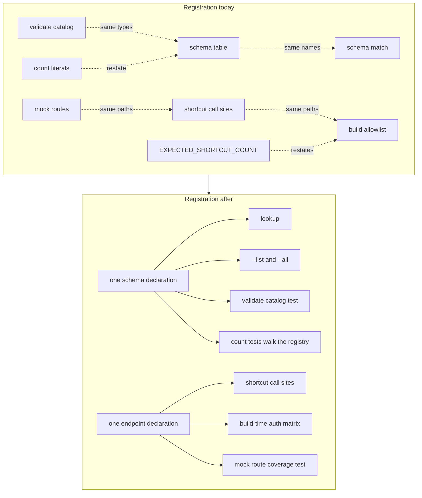

# Single Command Registration - Plan

## Goal Capsule

**Objective.** Someone adding a command family to `xr` declares it once per concern, and the test suite — not their
memory of a checklist — is what catches a family that is only half-registered. A family that never reached `xr schema`,
the in-process mock, or the examples page fails a test instead of shipping.

**Means.** Collapse each duplicated registration list to one declaration, and replace every hardcoded count with a walk
over the live registry (KTD1, KTD3).

**Authority hierarchy.** This plan, then the repo's active instructions (`AGENTS.md`, `CONTRIBUTING.md`, `CONCEPTS.md`),
then the implementer's judgment on details left open. Where this plan and
`docs/plans/2026-09-15-2343-refactor-adoption-grade-crate-plan.md` disagree about where a type lives, that plan governs
— it defines the crate boundary this one works inside.

**Stop conditions.** A golden fixture that cannot pass unchanged, a published-surface break beyond the existing waivers,
or a registry collapse that would require re-blessing a help page. Any of these means the shape is wrong; stop and
record rather than re-blessing the fixture.

**Execution profile.** One branch cut from `dev`, one pull request targeting `dev`, outside any stack (KTD6). The
implementer runs the Verification Contract locally and opens the pull request; a human reviews and merges.

---

## Product Contract

### Summary

Every registration surface in `xr` that currently lists the same commands or endpoints twice collapses to one
declaration, and every test that pins a count of registered things becomes a walk over the live registry. Adding a
command family stops being a ten-file checklist whose omissions are silent.

### Problem Frame

A command family has to be registered in more hand-written places than a contributor can hold in their head, and the
places do not agree with each other by construction.

The broadcast chat moderator family (#182) is the worked example: 33 files changed, of which 10 were hand-written source
and the rest were regenerated artifacts. Within those 10, the same names were written down twice in three separate
pairs. `crates/xurl-cli/src/cli/commands/schema.rs` lists every command in the `SCHEMA_ENTRIES` table and then lists
them all again in the `schema_for_command` match. `crates/xdk/build.rs` carries a `SHORTCUT_TEMPLATES` allowlist of 38
endpoints that restates paths already written at the call sites in `crates/xdk/src/api/shortcuts.rs`, and
`crates/xdk/src/testing/mod.rs` writes those paths a third time as mock route patterns.
`crates/xurl-cli/src/cli/commands/validate.rs` keeps a third catalog of the same response types.

Two tests then pin those sets with literals rather than reading them. `crates/xurl-cli/tests/schema_tests.rs` asserted
39 rows and 38 entries and had to be bumped to 42 and 41 when the family landed. `crates/xdk/src/api/auth_matrix.rs`
carries `EXPECTED_SHORTCUT_COUNT: usize = 38` with a comment telling the reader to update the allowlist by hand. A
literal count is a tripwire that fires on every addition and proves nothing about the addition itself: it goes red for
the correct change and stays green for a family that was silently omitted from a sibling list.

The command surface has the same shape one level up. `crates/xurl-cli/src/cli/mod.rs` is 1,871 lines carrying 61
near-identical help constants across 64 `after_help` sites, five of them for the one broadcasts family.
`crates/xurl-cli/src/cli/commands/mod.rs` is 1,108 lines of 40 dispatch arms, where the add and remove verbs of a family
differ only in which shortcut they call. The examples page in `crates/xurl-cli/src/cli/commands/examples.rs` is
maintained by hand with nothing checking that a new family reached it.

### Requirements

**Schema registration**

- R1. One declaration per command names its response type, and `xr schema <command>`, `xr schema --list`, and `xr schema
  --all` all read that declaration.
- R2. The `xr validate` schema catalog and the `xr schema` registry agree, enforced by a test rather than by hand.
- R3. No test asserts a literal count of registered commands.

**Endpoint registration**

- R4. One declaration per shortcut endpoint serves both the library call site and the build-time auth matrix.
- R5. The in-process testing mock answers every declared shortcut endpoint, enforced by a test.
- R6. No test or constant asserts a literal count of shortcut endpoints.
- R12. Every response fixture in the vendored-spec fixture file is exercised by a validation test, enforced by a test.

**Command surface**

- R7. A command family's help pages come from one shared shape, and every existing help page renders byte-identical
  output.
- R8. The verbs that resolve a handle and then call one shortcut share a single dispatch path.
- R9. Every command family appears on the examples page, enforced by a test.

**Preserved contracts**

- R10. Every golden fixture passes unchanged. No fixture is re-blessed.
- R11. The published library surface is unchanged, and `cargo semver-checks` reports no break beyond the waivers already
  in `crates/xdk/Cargo.toml`.

### Key Decisions

- **The registration surface shrinks; the command surface does not.** No command, flag, help page, or output shape
  changes. Governs R7, R10, R11.
- **Generated artifacts stay checked in.** The completions, response schemas, and golden fixtures remain committed and
  regenerated by their existing scripts; this work reduces the hand-written sites that feed them, not the artifacts
  themselves. Governs R1, R4.

### Scope Boundaries

- The 200-line refactor trigger applies to `crates/xurl-cli/src/cli/mod.rs` (1,871 lines) and
  `crates/xurl-cli/src/cli/commands/mod.rs` (1,108 lines), but splitting those files is not this work. This plan reduces
  what a new family adds to them; it does not restructure what is already there.
- The auth matrix stays scoped to the shortcut allowlist rather than widening to the whole vendored spec (KTD2).
- The examples page stays curated rather than generated (KTD5).

#### Deferred to Follow-Up Work

- Splitting `crates/xurl-cli/src/cli/mod.rs` and `crates/xurl-cli/src/cli/commands/mod.rs` along family boundaries.
- Deriving the examples page content from per-command examples, which would change what the page says.

---

## Planning Contract

### Key Technical Decisions

- KTD1. **The schema registry carries a schema thunk per entry.** Each `SCHEMA_ENTRIES` row gains a `fn() -> Value`
  column built from a non-capturing closure wrapping `schema_for!`, so the monomorphized call site the macro needs lives
  in the table rather than in a parallel match. The existing comment in `crates/xurl-cli/src/cli/commands/schema.rs`
  states a match is required because `schema_for!` needs types known at compile time; that is true of the macro's
  expansion site, not of the lookup, and a function-pointer column keeps the expansion at one site per entry. Retires
  the second list. Advances R1.
- KTD2. **One endpoint declaration shared by the shortcuts and the build script, not a widened matrix.** The alternative
  — dropping the allowlist and generating the auth matrix from the whole vendored spec — is simpler to write but changes
  behavior: raw-URL requests would start being auth-checked against endpoints no shortcut calls. (session-settled:
  user-directed — chosen over widening the matrix to the entire spec: raw-URL requests would begin being auth-checked.)
  Advances R4.
- KTD3. **Every count assertion becomes a registry walk.** Replace `EXPECTED_SHORTCUT_COUNT` and the two literals in
  `crates/xurl-cli/tests/schema_tests.rs` with assertions that derive both sides from live state, which is what makes an
  omission fail rather than an addition
  (`docs/solutions/conventions/registry-walk-coverage-tests-prevent-silent-omission.md`). Advances R3, R6.
- KTD4. **Help text stays byte-identical.** The collapse changes where a family's help strings are written, never what
  they render, so no golden help page is re-blessed. (session-settled: user-directed — chosen over normalizing wording
  across families while here: that re-blesses the pinned help pages.) Advances R7, R10.
- KTD5. **The examples page stays curated, with a coverage test.** A test asserts every top-level command family appears
  on the page; the prose stays hand-written. (session-settled: user-directed — chosen over deriving the whole page from
  per-command examples: that changes the page's content.) Advances R9.
- KTD6. **Ships as one pull request cut from `dev`, targeting `dev`, outside any stack.** (session-settled:
  user-directed — chosen over folding it into the broadcast-moderators pull request or adding a stack layer: it is
  cleanup of what that family exposed, not part of it.) The originally named base branch,
  `feat/xdk-13-broadcast-moderators`, merged into `dev` on 2026-09-17, so `dev` now contains it.

### High-Level Technical Design

Each collapse has the same shape: several consumers that each carry their own copy of a list become several consumers
reading one declaration, with a test walking the declaration to prove each consumer covers it.

The dotted edges are the defect: a name written in one box has to be written again in the box it points at, with nothing
checking the two agree. The solid edges are reads of a single owner.

### Assumptions

- A `const`-eligible table holding `fn() -> Value` entries built from non-capturing closures compiles on the pinned
  toolchain. U1 proves this on one entry before converting the rest; if it does not hold, a `static` table or a
  generated match from one list is the fallback and U1 records which.

---

## Implementation Units

### U1. One schema registry

**Goal:** `SCHEMA_ENTRIES` becomes the only place a command's response type is named, and `schema_for_command` reads it.

**Requirements:** R1

**Dependencies:** none

**Files:**

- `crates/xurl-cli/src/cli/commands/schema.rs` (modify)
- `crates/xurl-cli/tests/schema_tests.rs` (modify — existing behavior coverage stays green)

**Approach:**

1. Add a schema-thunk column to the entry struct, populated per row from the same `schema_for!` invocation the match arm
   used.
2. Prove the table compiles with one converted entry before touching the rest (see Assumptions).
3. Replace `schema_for_command`'s body with a lookup over the table, keeping its two non-lookup arms: the
   no-typed-response commands that return a validation error, and the unknown-command arm that lists valid commands.
4. Delete the arms that the table now covers.

**Patterns to follow:** the existing `print_schema_list` and `print_all_schemas` already iterate `SCHEMA_ENTRIES`; the
lookup joins them rather than introducing a new access shape.

**Test scenarios:**

- `xr schema post` returns the same schema document as before the change, for one command from each entry group.
- `xr schema broadcasts` returns the `schema not available` validation error, unchanged.
- `xr schema nonsense` returns the unknown-command error and its message lists the registered commands.
- `xr schema --all` emits one entry per registered command with no duplicates and no omissions.
- `xr schema --list` output is byte-identical to the committed golden fixture.

**Verification:** the golden schema-list fixture passes unchanged, and no command name appears twice in the file.

### U2. Count assertions read the registry

**Goal:** No test pins a literal number of registered commands.

**Requirements:** R3

**Dependencies:** U1

**Files:**

- `crates/xurl-cli/tests/schema_tests.rs` (modify)

**Approach:** replace both literals with assertions derived from live state — the `--list` row count equals the `--all`
entry count plus the envelope row, and every name in one appears in the other. The test then fails when a command
reaches one surface but not the other, and stays green when a family is added correctly.

**Execution note:** confirm each new assertion fails against a deliberately half-registered command before keeping it; a
coverage test that cannot go red is decoration.

**Test scenarios:**

- Adding a registered command to the table changes no assertion in this file.
- A command present in the table but absent from `--list` output fails with a message naming it.
- A command present in `--list` but absent from `--all` fails with a message naming it.
- The envelope row is still advertised by `--list`.

**Verification:** both former literal assertions are gone, and the file contains no bare integer expectation about
command counts.

### U3. One endpoint declaration

**Goal:** A shortcut endpoint's method and path are written once and consumed by both the call site and the build-time
auth matrix.

**Requirements:** R4, R6, R11

**Dependencies:** none

**Files:**

- `crates/xdk/build.rs` (modify)
- `crates/xdk/src/api/shortcuts.rs` (modify)
- `crates/xdk/src/api/media.rs` (modify)
- `crates/xdk/src/api/auth_matrix.rs` (modify — remove `EXPECTED_SHORTCUT_COUNT` and its anchor test)
- `crates/xdk/tests/auth_matrix_coverage.rs` (modify)

**Approach:** the declaration already exists and already reaches the crate. `crates/xdk/build.rs` emits its
`SHORTCUT_TEMPLATES` list into the generated module, and `crates/xdk/src/api/auth_matrix.rs` re-exports it. What is
missing is that the call sites never read it: `crates/xdk/src/api/shortcuts.rs` writes 36 path literals of its own and
`crates/xdk/src/api/media.rs` writes 9 more. The work is to close that loop rather than to invent a new home.

1. Have the build script emit a named constant per endpoint alongside the existing tuple list, so a call site can name
   an endpoint instead of spelling its path.
2. Repoint the shortcut and media call sites at those constants, leaving each call site's path-parameter and query
   construction exactly as it is.
3. Delete `EXPECTED_SHORTCUT_COUNT` and the anchor test that reads it (KTD3); the coverage test in
   `crates/xdk/tests/auth_matrix_coverage.rs` already walks the list and is the real guard.

**Execution note:** the build script panics by design when a declared path is absent from the vendored spec. Keep that
behavior — it is the earliest tripwire for a spec revision that drops an endpoint, per `CONCEPTS.md`.

**Test scenarios:**

- Every declared endpoint resolves in the generated auth matrix, with the failure message naming the endpoint that did
  not.
- A declared endpoint whose path is absent from the vendored spec fails the build with a message naming the path and
  pointing at the refresh script.
- Declared methods are uppercase and standard, with a non-standard method failing by name.
- The matrix is non-empty, so the coverage walk cannot pass vacuously.
- No path literal remains in `crates/xdk/src/api/shortcuts.rs` or `crates/xdk/src/api/media.rs` for a declared endpoint,
  so a call site and the auth matrix cannot disagree.

**Verification:** `EXPECTED_SHORTCUT_COUNT` no longer exists anywhere, the auth-matrix tests pass, and `cargo
semver-checks` reports no new break.

### U4. Registry-walk coverage for the surfaces a family can miss

**Goal:** Four surfaces that a new family can silently miss are each covered by a test that walks the live registry.

**Requirements:** R2, R5, R9, R12

**Dependencies:** U1, U3

**Files:**

- `crates/xdk/tests/auth_matrix_coverage.rs` (modify — add the mock-route walk)
- `crates/xdk/tests/spec_validation.rs` (modify — add the fixture-coverage walk)
- `crates/xurl-cli/tests/schema_tests.rs` (modify — add the validate-catalog walk)
- `crates/xurl-cli/tests/agentic_tests.rs` (modify — add the examples-page walk)
- `crates/xdk/src/testing/mod.rs` (modify — only if a declared endpoint has no mock route today)

**Approach:** each test derives its expected set from the live declaration rather than a literal.

1. The mock walk asserts every declared shortcut endpoint matches some route pattern in the testing mock.
2. The fixture walk asserts every response fixture key is exercised by a validation test. The file currently carries 18
   response fixtures plus a `description` metadata key, and 18 tests name them, so the sets agree today with nothing
   holding them there.
3. The validate walk asserts the `xr validate` catalog and the schema registry name the same response types.
4. The examples walk asserts every top-level command family appears on the examples page.

**Execution note:** each walk has to be seen failing against a real omission before it counts. Remove one entry from the
surface under test, observe the message name it, restore it.

**Test scenarios:**

- A declared shortcut endpoint with no matching mock route fails, naming the endpoint.
- A response type in the schema registry that the validate catalog does not accept fails, naming the type.
- A schema name the validate catalog accepts that no registry entry produces fails, naming the name.
- A command family absent from the examples page fails, naming the family.
- A response fixture with no validation test fails, naming the fixture key, and the `description` metadata key is not
  treated as a fixture.
- All four walks pass on the current tree without editing the surfaces, or the unit records which surface had a real gap
  and fixes it.

**Verification:** the four walks pass, and each has been observed red against a removed entry.

### U5. Family help constants from one shape

**Goal:** A command family's help pages come from one shared shape instead of one constant per verb.

**Requirements:** R7, R10

**Dependencies:** none

**Files:**

- `crates/xurl-cli/src/cli/mod.rs` (modify)
- `crates/xurl-cli/tests/golden_tests.rs` (no change expected — the fixtures prove the bytes)

**Approach:**

1. Take the broadcasts family's five constants as the first case, since they were written together and share a shape
   exactly.
2. Introduce one declarative shape that renders the family's help strings, driven by the family name, its verbs, and the
   example arguments.
3. Leave every other family's constants alone in this unit. The shape has to earn its second and third user before it is
   worth applying broadly.

**Execution note:** the golden fixtures are the proof. Run them after each family is converted; a single changed byte
means the shape is wrong, not that the fixture is stale (KTD4).

**Test scenarios:**

- Each of the five broadcasts help pages renders byte-identical output to its committed golden fixture.
- The root help page is unchanged.
- The examples golden fixture is unchanged.
- A family declared through the shared shape with a missing verb fails to compile rather than rendering an empty
  section.

**Verification:** `cargo test -p xurl-rs --test golden_tests` passes with no fixture re-blessed, and the broadcasts
family's five separate constants are gone.

### U6. One dispatch path for the resolve-then-call verbs

**Goal:** The verbs that resolve a handle to a user id and then call one shortcut share a single path instead of one
copy per verb.

**Requirements:** R8, R10

**Dependencies:** none

**Files:**

- `crates/xurl-cli/src/cli/commands/mod.rs` (modify)
- `crates/xurl-cli/tests/wiring_tests.rs` (modify)

**Approach:**

1. Name the shape precisely before extracting it: build a dry-run context, validate the handle, resolve it, call one
   shortcut, print the typed response. Eleven call sites resolve a target handle and twenty-one reference the caller's
   own id, so the two shapes may need separate helpers rather than one over-parameterized helper.
2. Extract the shape that appears with no per-verb variation first, and leave arms that differ in any other way alone.
3. Keep each arm's dry-run context payload exactly as it is; the dry-run golden fixtures pin that JSON.

**Test scenarios:**

- Each converted verb's dry-run output is byte-identical to its committed golden fixture.
- A converted verb with an empty handle returns the same validation reason and exit code as before.
- A converted verb resolves the handle before calling the shortcut, proven through the mock by asserting the lookup
  request precedes the action request.
- A converted verb's JSON envelope is unchanged for a successful call.
- The arms that were deliberately not converted still compile and pass their existing coverage.

**Verification:** the golden and wiring suites pass unchanged, and the converted arms no longer repeat the
resolve-then-call body.

---

## Verification Contract

| Gate              | Command                                                                   | Units      | Signal                               |
| ----------------- | ------------------------------------------------------------------------- | ---------- | ------------------------------------ |
| Format            | `cargo fmt --all --check`                                                 | all        | clean                                |
| Lint              | `RUSTFLAGS=-Dwarnings cargo clippy --workspace --all-targets`             | all        | clean                                |
| Tests             | `cargo test --workspace`                                                  | all        | green                                |
| Library features  | `cargo test -p xdk-rs --all-features`                                     | U3, U4     | green                                |
| Golden fixtures   | `cargo test -p xurl-rs --test golden_tests`                               | U1, U5, U6 | green with no fixture re-blessed     |
| Completions       | `scripts/generate-completions.sh --check`                                 | U5         | clean                                |
| Response schemas  | `scripts/generate-response-schemas.sh`, then `git status --short schema/` | U1         | empty                                |
| Published surface | the CI `Public API semver` job                                            | U3         | no break beyond the existing waivers |
| Full mirror       | `LC_ALL=C.UTF-8 scripts/hooks/pre-push`                                   | all        | green before the push                |

The golden suite is the load-bearing gate. It pins every help page, the examples page, the schema list, and the dry-run
envelopes, which is exactly the surface this work moves without changing. A re-blessed fixture means a unit changed
behavior it was supposed to preserve.

---

## Definition of Done

**Global**

- Every requirement R1 through R12 holds.
- No literal count of registered commands or endpoints remains in any test or constant.
- Every gate in the Verification Contract passes, with no golden fixture re-blessed.
- Each registry-walk test added by U2 and U4 has been observed failing against a real omission, and the failure message
  names the missing entry.
- No abandoned approach is left in the diff. If the schema-thunk table did not work out, the fallback is in place and
  the Assumptions entry is resolved to say which shape shipped.
- One pull request, cut from `dev` and targeting `dev`, with its body filled from the repo template.

**Per unit**

| Unit | Done when                                                                                                     |
| ---- | ------------------------------------------------------------------------------------------------------------- |
| U1   | A command's response type is named in exactly one place, and the schema-list fixture is unchanged.            |
| U2   | Both count literals are gone and the replacements have been seen red.                                         |
| U3   | `EXPECTED_SHORTCUT_COUNT` is gone, one declaration feeds both readers, and the published surface is unbroken. |
| U4   | The mock, the spec fixtures, the validate catalog, and the examples page each have a walk seen red.           |
| U5   | The broadcasts family renders from one shape with five fixtures unchanged.                                    |
| U6   | The converted verbs share one path with their dry-run fixtures unchanged.                                     |
