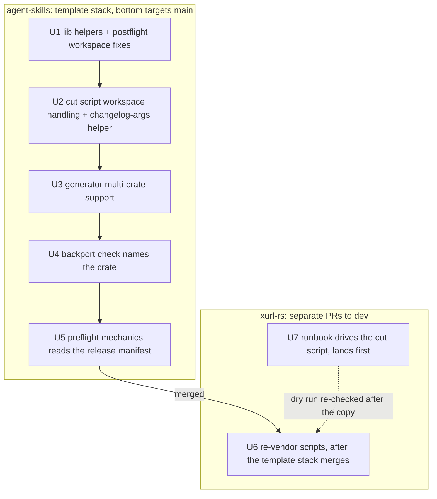
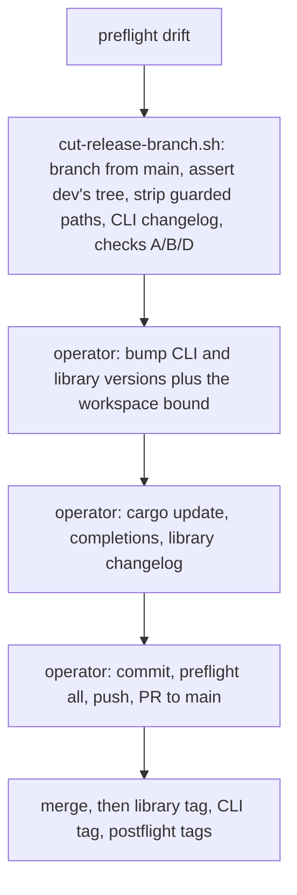

# Release Cut Script Wiring - Plan

**Target repos:** brettdavies/agent-skills, whose `github-repo-setup/` directory is the canonical template for vendored
release scripts, and brettdavies/xurl-rs. Paths starting with `github-repo-setup/` are in agent-skills; every other path
is in xurl-rs.

---

## Goal Capsule

- **Objective:** an xurl-rs release branch is built and checked by one command whose behavior the template's test suite
  covers, so no part of the overlay or its checks depends on commands typed by hand.
- **Means:** bring xurl-rs's vendored release scripts and the template into line, generic workspace support moving up
  and a verbatim copy coming back down (KTD1, KTD3, KTD4), then make `RELEASES.md` call
  `scripts/release/cut-release-branch.sh` (KTD2).
- **Authority:** the Product Contract's R-IDs win on behavior, KTDs win on mechanism, and a unit overrides neither. The
  template is canon for vendored scripts
  (`docs/solutions/conventions/upstream-a-vendored-copy-that-ran-ahead-until-the-repo-copy-derives-from-the-template.md`).
- **Execution profile:** inline, with no subagents, workers, or worktrees. Template units ship as one stack of PRs in
  agent-skills (bottom targets `main`). In xurl-rs, U7 ships first as its own PR to `dev`, and U6 follows as a separate
  PR to `dev` once the template stack has merged (R1, D2). Long jobs run in the background.
- **Stop conditions:** stop and ask when an upstreamed generator change would alter a single-crate repo's output beyond
  KTD5, when the rehearsal cut (KTD8) stages a tree that differs from the manual procedure's, or when a template change
  would break another consumer's documented flow.
- **Who finishes:** the implementer opens each PR and verifies its CI rollup; Brett merges every PR.

---

## Product Contract

### Summary

Move xurl-rs's workspace improvements in its vendored release scripts into the github-repo-setup template with bats
coverage, bring the template's own improvements down, and re-vendor so each script xurl-rs copies verbatim is
byte-identical to the template. Then rewrite the release runbook around `cut-release-branch.sh`, leaving the operator
the version bumps, lockfile, completions, library changelog, commit, preflight, push, and PR.

### Problem Frame

xurl-rs vendors `scripts/release/cut-release-branch.sh` but has never run it: `RELEASES.md` still documents the overlay
as hand-typed commands. The rename-detection gaps fixed in #259 and #260 lived in exactly those hand-typed commands,
while the script, which asserts the tree with `git read-tree` and runs the same checks in code, had them right and has
bats coverage in the template.

The vendored copies have also drifted from the template in both directions. xurl-rs carries workspace improvements the
template lacks (member changelogs, a version read from the release manifest, a backport check that accepts a library
tag's changelog). The template carries improvements xurl-rs lacks (`count_and_list`). `RELEASES-POSTFLIGHT.md` calls
xurl-rs's postflight a verbatim copy when it is not. The generator's multi-crate support, including the library's
member-tag changelog anchor from #261, exists only in xurl-rs, where nothing tests it.

The drift also hides a defect: the backport script's post-commit check runs `generate-changelog.py --dry-run --tag
vX.Y.Z` without `--crate`, so in xurl-rs it targets the root `CHANGELOG.md`, which is a router the generator refuses to
write, and every backport reports a failed check instead of comparing the changelog it synced.

### Requirements

**Release procedure**

- R1. xurl-rs's runbook builds the release branch with `scripts/release/cut-release-branch.sh` and no longer documents a
  hand-run overlay or hand-run checks A, B, and D for a normal release.
- R2. The runbook lists, in order, the steps the script leaves to the operator: the version bumps (the library's
  workspace bound with its own), the lockfile refresh, completions, the library changelog, the commit, preflight, push,
  and PR.
- R3. A rehearsal cut against the current `main` and `dev` stages the same tree as the documented manual procedure,
  before any version-carrier edit.

**Template parity**

- R4. After reconciliation, xurl-rs's `_lib.sh`, `cut-release-branch.sh`, `postflight.sh`, `sync-dev-after-release.sh`,
  and `generate-changelog.py` are byte-identical to the template.
- R5. xurl-rs's `preflight.sh`, a per-repo starter skeleton, shares the template's generic mechanics gate and keeps its
  repo-specific gates.
- R6. Every behavior moved into the template has a bats case observed failing against the pre-change template, and a
  single-package repo's output is unchanged except where KTD5 says otherwise.

**Correctness carried along**

- R7. In a workspace, the backport's post-commit check compares the released crate's own changelog instead of failing on
  the router.
- R8. The library's member-tag changelog anchor has permanent test coverage.
- R9. The docs describe the copies as they are: xurl-rs's `RELEASES-POSTFLIGHT.md` and the template's script reference.

### Success Criteria

- A `diff` of each R4 script against its template prints nothing.
- The template's full bats suite passes, and each new case was seen failing against `main`'s template first.
- The R3 rehearsal's staged tree equals the manual procedure's.

### Scope Boundaries

- The release model does not change: two tag lines, the library tag first, both tags on the release commit.
- Version bumps stay with the operator, as the script's header states.
- Other repos that vendor the template are not re-vendored here.
- The cherry-pick exception in `RELEASES.md` keeps its hand-run commands; it exists for repos that cannot overlay.

#### Deferred to Follow-Up Work

- The template's `semver` preflight gate: xurl-rs runs the semver check in CI, so a local counterpart can wait.
- A documented flow for a library-only release. The member anchor already handles one if it happens.

### Sources

- `docs/solutions/conventions/upstream-a-vendored-copy-that-ran-ahead-until-the-repo-copy-derives-from-the-template.md`:
  generalize while upstreaming, keep single-package behavior, bring helpers along, test against the old template, leave
  the repo copy alone once derivable.
- `github-repo-setup/references/vendored-release-scripts.md`: which scripts refresh verbatim and which (`preflight.sh`,
  `surface-smoke.sh`) are per-repo starter skeletons.
- Prior work: xurl-rs#259, #260, #261; agent-skills#105 (an earlier upstreaming done this way), #119, #120, #121, #123;
  agentnative-cli#125.

---

## Planning Contract

### Key Technical Decisions

- KTD1. **Reconcile all five scripts, and `preflight.sh` only at its generic mechanics gate.** The template reference
  marks `preflight.sh` a starter skeleton each repo fills in, so xurl-rs's `api-contract`, `multi-app`, and xr-shaped
  `smoke` gates are expected divergence, not drift. Only the workspace-aware mechanics body is generic.
- KTD2. **The library changelog stays a manual step after the script.** The script's argument is the binary's version,
  and the library's next version is an operator decision read from the PRs' `## Changelog (xdk-rs)` blocks. The script
  also leaves every version carrier to the operator by design, so taking member versions as input would cut across that
  boundary.
- KTD3. **The generator's multi-crate support moves into the template, and xurl-rs re-vendors it verbatim.** The
  template's backport script and postflight already read `[package.metadata.changelog]` and `<crate>-vX.Y.Z` tags, so
  the generator is the one script in the set that does not. The function inventory supports a clean move: every template
  function exists in xurl-rs's copy, and xurl-rs adds thirteen (member config, router refusal, path membership,
  `binary_tag_beside`, batched fetches, title grouping, the git-cliff member merge).
- KTD4. **Generalize while upstreaming.** Template code learns workspace facts from `cargo metadata`,
  `[package.metadata.changelog]`, and `release.env`, and never names xurl-rs's crates or paths. A single-package repo
  takes the code path it takes today.
- KTD5. **Title fallback groups by conventional-commit type in the template too.** A PR with no changelog block lands
  under the group git-cliff gives its commit (`fix:` under Fixed, `feat:` under Added, `type!:` under Breaking changes),
  because the template's `cliff.toml` routes commits to exactly those groups. This changes single-package output (the
  template files every fallback under Changed today), so the generator PR says so for consumers who re-vendor.
- KTD6. **One rule decides when the generator gets `--crate`.** The cut script passes `--crate <release package>` when
  the release manifest is not the root `Cargo.toml`. The backport check needs the same arguments, so the rule moves into
  one `_lib.sh` helper both scripts call rather than a second inline copy.
- KTD7. **The template stack merges before xurl-rs re-vendors.** xurl-rs copies only merged template content, so the
  re-vendor diff is a pure copy and R4's `diff` is meaningful.
- KTD8. **A rehearsal proves the wiring before the runbook PR merges.** Run the script against current refs onto a
  throwaway local branch that is never pushed, rebuild the same branch with the manual procedure, and compare the two
  staged trees. This is the first time xurl-rs runs the script, and a staged-tree comparison is the evidence a passing
  suite cannot give.

### High-Level Technical Design

The work crosses two repos. The runbook wiring lands in xurl-rs first; the template changes land and merge as one stack,
then xurl-rs copies them.



After the wiring, a release follows this sequence; the script owns the boxed steps and the operator the rest.



### Risks & Dependencies

| Risk                                                                                   | Mitigation                                                                                                                     |
| -------------------------------------------------------------------------------------- | ------------------------------------------------------------------------------------------------------------------------------ |
| Every repo that re-vendors the template picks up the new workspace code paths.         | R6's single-package regression cases run in every template unit; KTD4 keeps workspace logic behind workspace-only conditions.  |
| The generator PR is large, about 640 changed lines.                                    | Port the function bodies unchanged where they are already general, review per function, and keep test cases one behavior each. |
| The first real run of the script on xurl-rs surfaces something the template never met. | KTD8's rehearsal runs before U7 merges; a mismatch is a stop condition.                                                        |
| A release branch is open while U6 or U7 lands.                                         | Land U6 and U7 between releases; neither changes a published crate.                                                            |
| The template's `RELEASES.md` and the reference drift from the scripts again.           | Each template unit updates the reference row for the script it touches.                                                        |

---

## Implementation Units

### U1. Upstream the workspace helpers and postflight's workspace fixes

- **Goal:** the template's `_lib.sh` and `postflight.sh` carry xurl-rs's generic workspace behavior.
- **Requirements:** R4, R6, R9
- **Dependencies:** none
- **Files:** `github-repo-setup/templates/scripts/release/_lib.sh`,
  `github-repo-setup/templates/scripts/release/postflight.sh`, `github-repo-setup/tests/lib.bats`,
  `github-repo-setup/tests/postflight-release-line.bats`, `github-repo-setup/templates/RELEASES-POSTFLIGHT.md`,
  `github-repo-setup/references/vendored-release-scripts.md`
- **Approach:**
  1. Add `crate_changelog_path` and `crate_changelog_paths` to `_lib.sh`, and make `project_version` tolerate a manifest
     with no version line under `pipefail`.
  2. In `postflight.sh`, read the version through `project_version` so a virtual workspace resolves the binary's tag,
     and keep the pyproject read from aborting the script.
  3. Add the backport gate's library-tag path: when no PR names the tag, compare the member's changelog on `dev` and
     `main`.
  4. Reword comments from "the binary and the library" to "a member" (KTD4).
- **Execution note:** write each case against `main`'s template first and watch it fail.
- **Patterns to follow:** xurl-rs `scripts/release/postflight.sh` (the backport gate's changelog comparison) and
  `scripts/release/_lib.sh`; the workspace fixture in `github-repo-setup/tests/postflight-tags.bats`.
- **Test scenarios:**
  - A virtual workspace with `RELEASE_MANIFEST` naming the binary resolves the tag `v<binary version>`, where the old
    template falls back to the newest git tag, which can be a library tag.
  - A single-package repo resolves its tag exactly as before.
  - The backport gate on a library tag with no PR naming it passes when `dev`'s member changelog equals `main`'s, fails
    when they differ, and skips when the member declares no changelog.
  - `crate_changelog_path` returns the declared path for a member, nothing for an undeclared member, and nothing when
    `cargo` or `jaq` is missing.
  - `project_version` on a manifest without a version line returns nothing and does not abort a `set -euo pipefail`
    caller.
- **Verification:** the new cases fail against `main`'s template and pass after; the full suite passes.

### U2. Upstream the cut script's workspace handling

- **Goal:** in a workspace, the cut script writes the release package's own changelog and treats member manifests and
  changelogs as version carriers; after a failed check it prints the recovery instead of the commit steps (R2, D3).
- **Requirements:** R4, R6, R9
- **Dependencies:** U1
- **Files:** `github-repo-setup/templates/scripts/release/cut-release-branch.sh`,
  `github-repo-setup/templates/scripts/release/_lib.sh`, `github-repo-setup/tests/cut-release-branch.bats`,
  `github-repo-setup/tests/lib.bats`,
  `github-repo-setup/templates/RELEASES.md`, `github-repo-setup/references/vendored-release-scripts.md`
- **Approach:**
  1. Add the KTD6 helper to `_lib.sh` and call it from the changelog step, keeping the explicit `--tag v<version>`.
  2. Widen verification A's carrier pattern to manifests and changelogs inside member directories.
  3. Note in the template runbook's workspace section that the script writes only the release package's changelog, and
     that each other member's changelog is the operator's step (KTD2).
  4. Print the next steps only when every check passed. After a failed check, print the recovery instead: switch back
     to the integration branch, delete the release branch, and re-run once fixed. Document exit codes 0, 1, and 2 and
     that recovery in the template runbook (R2, D3).
- **Patterns to follow:** xurl-rs `scripts/release/cut-release-branch.sh` (its two workspace hunks).
- **Test scenarios:**
  - A virtual workspace whose `release.env` names the binary invokes the generator with `--from-dev-prs --tag v<version>
    --crate <binary>` (a stub generator records its arguments).
  - A single-package repo invokes it without `--crate`.
  - `--branch` with a custom name still passes `--tag v<version>`.
  - Verification A passes when a member's manifest and changelog differ from `dev`, and still fails on any other file in
    a member directory.
  - A cut whose verification fails exits 1, prints the recovery, and does not print the commit-and-push steps (R2).
  - A cut whose checks all pass exits 0 and prints the commit-and-push steps.
  - The KTD6 helper returns `--crate <package>` for a virtual workspace whose release manifest names it, and nothing
    for a single-package repo or when the package name is unknown (`lib.bats`).
- **Verification:** the new cases fail against U1's template and pass after; the existing cut-script cases pass
  unchanged.

### U3. Upstream the generator's multi-crate support

- **Goal:** the template's `generate-changelog.py` gains xurl-rs's multi-crate mode, generalized, so xurl-rs's copy
  becomes derivable from it (KTD3).
- **Requirements:** R4, R6, R8, R9
- **Dependencies:** U2
- **Files:** `github-repo-setup/templates/generate-changelog.py`, `github-repo-setup/tests/generate-changelog.bats`,
  `github-repo-setup/tests/generate-changelog-workspace.bats` (new),
  `github-repo-setup/references/vendored-release-scripts.md`, `github-repo-setup/templates/RELEASES-RATIONALE.md`
- **Approach:**
  1. Bring over `--crate` and its `[package.metadata.changelog]` config, router detection and refusal, path-based
     membership, `binary_tag_beside` and its use in `merged_pr_numbers`, the batched GraphQL prefetch with its per-PR
     fallback, the git-cliff member merge, and the prefixed tag-line helpers.
  2. Adopt title grouping by type and the Deprecated category (KTD5), rewording the grouping table's comment to cite the
     template's own `cliff.toml`.
  3. Rewrite the reference's generator row: it refreshes verbatim, it has a workspace mode, and `--from-dev-prs` anchors
     on the previous release's backport commit (the row still describes the older rule).
  4. Update the one existing case that asserts fallback titles land under Changed, as KTD5's deliberate change.
  5. Explain a member's changelog window in `RELEASES-RATIONALE.md`'s workspace section: it starts at the backport of
     the binary tag beside the member's previous tag, because the backport's subject names only the binary's tag.
- **Execution note:** port the scratch-harness cases used to verify #261 as permanent tests before moving the code.
- **Patterns to follow:** xurl-rs `scripts/generate-changelog.py`; the harness in
  `github-repo-setup/tests/generate-changelog.bats` (stubbed `fetch_pr`, real git history through `history_repo`).
- **Test scenarios:**
  - `--crate <member>` writes the member's changelog at the path its `[package.metadata.changelog]` table declares,
    under the heading it declares.
  - Without `--crate`, a root changelog carrying the router marker is refused with a message naming `--crate`.
  - A PR that touches only another member's paths is left out of a member's section; a PR with the member's own block is
    kept whatever paths it touched.
  - An empty `## Changelog (<member>)` block contributes nothing.
  - A member's previous tag beside a binary tag anchors on that binary tag's backport. Covers R8.
  - A member released alone anchors on its own backport, and with none falls back to its tag.
  - A fallback title `fix(x): y` lands under Fixed, `feat!: y` under Breaking changes, and `chore: y` nowhere.
  - A Deprecated section renders between Changed and Fixed.
  - A prefetch failure falls back to per-PR fetches and yields the same entries.
  - A single-package repo's existing cases all pass except the updated fallback-group case.
  - `--dry-run --crate <member>` on a current member changelog exits 0 and leaves the file byte-identical; on a stale
    one it exits 1 with the drift line and restores the file. This is the path U4's regen check calls (R7).
  - Real git-cliff on a fixture repo: a single-package default-mode run renders the same skeleton for the same tag as
    the pre-change template, the explicit `-c <repo>/cliff.toml` being the call's only difference; a member run's
    skeleton holds only commits under its include paths and its tag pattern (R4, D5). These cases need git-cliff on
    PATH.
- **Verification:** each new case fails against U2's template and passes after; `diff` against xurl-rs's copy shows only
  reworded comments, which U6 then takes.

### U4. Make the backport check name the released crate

- **Goal:** in a workspace, the backport's post-commit regen check compares the released crate's changelog (R7).
- **Requirements:** R4, R6, R7
- **Dependencies:** U3
- **Files:** `github-repo-setup/templates/sync-dev-after-release.sh`,
  `github-repo-setup/tests/sync-dev-after-release.bats`
- **Approach:** call the KTD6 helper for the regen check's arguments; the success and warning lines name the changelog
  that was checked.
- **Patterns to follow:** U2's changelog step.
- **Test scenarios:**
  - A workspace whose root changelog is a router runs the check with `--crate <binary>` and reports a match when the
    synced changelog is current.
  - The same workspace with a stale member changelog warns with the generator's drift line, not a router refusal.
  - A single-package repo runs the check with the arguments it uses today.
- **Verification:** the workspace cases fail against U3's template, where the check ends in the router refusal, and pass
  after.

### U5. Make preflight's mechanics gate read the release manifest

- **Goal:** the template's mechanics gate reads a virtual workspace's binary version and changelog, and checks each
  member whose release is pending, so xurl-rs's mechanics body can match it without losing a check (R5).
- **Requirements:** R5, R6
- **Dependencies:** U4
- **Files:** `github-repo-setup/templates/scripts/release/preflight.sh`,
  `github-repo-setup/templates/scripts/release/_lib.sh`, `github-repo-setup/templates/scripts/release/postflight.sh`,
  `github-repo-setup/tests/preflight-mechanics.bats` (new), `github-repo-setup/tests/lib.bats`,
  `github-repo-setup/tests/postflight-tags.bats`
- **Approach:**
  1. Read the version through `project_version` and the changelog through `release_changelog`, as xurl-rs's mechanics
     gate does.
  2. Generalize xurl-rs's library-changelog check: for each publishable member other than the release package, its
     release is pending when no `<tag_prefix><version>` tag exists, and then its changelog's top section must equal its
     version with no `[Unreleased]`. Tag prefix and changelog path come from `[package.metadata.changelog]` with the
     generator's defaults. This check is the safety net KTD2's manual library-changelog step relies on.
  3. Name `generate-changelog.py --crate <member>` in the failure hint, in place of xurl-rs's reference to a per-crate
     `cliff.toml` that does not exist.
  4. Leave the starter gates and their placeholders alone.
  5. Add one `_lib.sh` helper that lists each publishable member other than the release package with its name,
     manifest path, tag prefix (from `[package.metadata.changelog]`, default `<name>-v`) and changelog path. Step 2's
     check and postflight's `tags` gate both read members through it, so the gate stops assuming `<name>-v` (R3, D4).
- **Patterns to follow:** xurl-rs `scripts/release/preflight.sh` (`gate_mechanics`); the harness in
  `github-repo-setup/tests/preflight-added-docs.bats`.
- **Test scenarios:**
  - A virtual workspace with `RELEASE_MANIFEST` and `RELEASE_CHANGELOG` passes when the binary's version matches its
    changelog's top section, and fails naming both when it does not.
  - A single-package repo behaves exactly as before.
  - A `pyproject.toml` with no version line under `pipefail` does not abort the gate.
  - A library member with no tag at its manifest version fails when its changelog's top section names another version,
    and passes when they match.
  - A library member whose version is already tagged is not checked.
  - A library member's changelog holding `[Unreleased]` fails while its release is pending.
  - The member helper lists a member's declared `tag_prefix` and `changelog`, falls back to `<name>-v` and the file
    beside the manifest, and omits the release package and `publish = false` members (`lib.bats`).
  - Postflight's `tags` gate passes for a member whose custom `tag_prefix` names the tag on the release commit, and
    fails when only a `<name>-v` tag exists there (`postflight-tags.bats`).
- **Verification:** the workspace cases fail against U4's template and pass after.

### U6. Re-vendor xurl-rs's release scripts

- **Goal:** each R4 script is a byte-identical copy of the merged template, and `preflight.sh`'s mechanics gate matches
  the template's.
- **Requirements:** R4, R5, R9
- **Dependencies:** U1 through U5 merged (KTD7)
- **Files:** `scripts/release/_lib.sh`, `scripts/release/cut-release-branch.sh`, `scripts/release/postflight.sh`,
  `scripts/release/preflight.sh`, `scripts/sync-dev-after-release.sh`, `scripts/generate-changelog.py`,
  `scripts/release/release.env`, `RELEASES-POSTFLIGHT.md`
- **Approach:**
  1. Copy each R4 script from the merged template.
  2. Replace only `gate_mechanics` in `preflight.sh` with the template's, which after U5 carries the generalized
     library-changelog check and the portable `epoch_of_date` date math.
  3. Add any `release.env` key a template script now reads.
  4. Make `RELEASES-POSTFLIGHT.md`'s "verbatim copy" sentence true.
- **Test expectation:** none beyond verification; the copied behavior is tested in the template, and this unit proves
  the copy matches what was tested.
- **Verification:**
  - `diff` of each R4 script against the template prints nothing.
  - `postflight.sh --tag v4.2.0 tags` and `backport` pass.
  - The generator's `--crate xdk-rs` and `--crate xurl-rs` windows still return the same PRs as on `dev` before the
    copy.
  - The KTD6 helper, sourced from xurl-rs's `_lib.sh` with its `release.env`, returns `--crate xurl-rs`, so the
    backport's regen check and the cut script pass the same arguments.
  - `scripts/release/cut-release-branch.sh --dry-run` still passes on the copied scripts, so the runbook U7 wrote holds
    (R1, D2).
  - `scripts/hooks/pre-push` and the PR's CI pass.

### U7. Make the runbook drive the cut script

- **Goal:** `RELEASES.md` builds the release branch with the script, and every remaining manual step is listed in order
  (R1, R2).
- **Requirements:** R1, R2, R3
- **Dependencies:** none; U7 lands first and its rehearsal runs on xurl-rs's current scripts (R1, D2)
- **Files:** `RELEASES.md`, `RELEASES-PREFLIGHT.md`, `RELEASES-RATIONALE.md`
- **Approach:**
  1. Replace § Releasing dev to main steps 1 through 3 and checks A, B, and D with one call to the script and a table of
     what it checks, following the template's runbook shape.
  2. Add § Project specifics holding xurl-rs's operator steps: the CLI version bump, the library bump and workspace
     bound, `cargo update`, completions, and the library changelog (KTD2).
  3. Fold § Releasing the library step 1 into that list, so the library changelog appears once.
  4. Update `RELEASES-PREFLIGHT.md` and `RELEASES-RATIONALE.md` wherever they cite the hand-run steps.
  5. Document the script's exit codes 0, 1, and 2, and the recovery from a failed cut: switch back to `dev`, delete the
     release branch, and re-run once fixed (R2, D3).
- **Test expectation:** none in the suite; the behavioral proof is the rehearsal.
- **Verification:** the KTD8 rehearsal: `cut-release-branch.sh --dry-run`, then a real run onto a throwaway local
  branch, its staged tree compared with the tree the manual overlay, guarded-path strip, and CLI changelog step stage
  for the same refs, after which the throwaway branch is deleted without ever being pushed. markdownlint and the PR's CI
  pass.

---

## Verification Contract

| Scope                | Command or check                                                                                | Applies to         |
| -------------------- | ----------------------------------------------------------------------------------------------- | ------------------ |
| Template suite       | `bats github-repo-setup/tests/`, full, in the background                                        | U1 to U5           |
| New cases fail first | each new case run against the template one unit earlier, failure output quoted in the PR        | U1 to U5           |
| Shell lint           | `LC_ALL=C.UTF-8 shellcheck` on every changed script                                             | U1, U2, U4, U5, U6 |
| Markdown lint        | `markdownlint-cli2` on every changed doc, run from the repo root so its config applies          | all                |
| Copy parity          | `diff` of each R4 script against the merged template prints nothing                             | U6                 |
| Real tags            | `scripts/release/postflight.sh --tag v4.2.0 tags` and `backport` pass                           | U6                 |
| Rehearsal            | KTD8 staged-tree comparison against current `main` and `dev`, throwaway branch deleted unpushed | U7                 |
| Local CI mirror      | `scripts/hooks/pre-push`                                                                        | U6, U7             |
| CI                   | every PR's rollup reads SUCCESS apart from conditional skips                                    | all                |

---

## Definition of Done

- R1 through R9 hold, and each Success Criteria item has been observed.
- The agent-skills stack and the xurl-rs PRs are merged by Brett; nothing in this plan is merged by the implementer.
- The xurl-rs scripts that R4 names carry no local edits; any later fix lands in the template first.
- No throwaway branch from the rehearsal remains locally or on the remote.
- Abandoned attempts are removed from the diff, not left commented out.
- Per unit: its Verification bullets were run and their results quoted in its PR body.

---

## Reconciliation

(against `xurl-rs` `origin/dev` @ `76d52e3` and `agent-skills` `origin/main` @ `59c4561`, 2026-10-07)

All seven units landed on 2026-10-04, and T1 through T6 are checked against the template's suite. R4 holds at the
baseline: `scripts/release/_lib.sh`, `cut-release-branch.sh`, `postflight.sh`, `scripts/sync-dev-after-release.sh`, and
`scripts/generate-changelog.py` are byte-identical to the template, as is `scripts/release/guarded-paths.sh`.
`scripts/release/preflight.sh` stays a per-repo skeleton (R5).

| Unit | State  | PR                | Commit    | Note                                                                                                    |
| ---- | ------ | ----------------- | --------- | ------------------------------------------------------------------------------------------------------- |
| U1   | landed | agent-skills #124 | `996c0d2` | —                                                                                                       |
| U2   | landed | agent-skills #125 | `5d83972` | Adds `changelog_crate_args`, the KTD6 helper. A failed check prints the recovery, not the commit steps. |
| U3   | landed | agent-skills #126 | `856214b` | `generate-changelog-workspace.bats` renders real git-cliff output for both run shapes.                  |
| U4   | landed | agent-skills #127 | `224d52f` | The backport's regen check calls `changelog_crate_args`, as the cut script does.                        |
| U5   | landed | agent-skills #128 | `a705de0` | `release_members` is the one member list postflight `tags` and preflight mechanics both read.           |
| U7   | landed | #262              | `ce879a4` | Landed first; the KTD8 rehearsal staged identical trees from the script and the manual overlay.         |
| U6   | landed | #263              | `7bea2e7` | —                                                                                                       |

Two later changes moved the same files past this plan's end state:

- **#273** (`71b2eb5`) re-vendored the scripts from the template at `9b55d8d` (agent-skills #142 and #143): a cut that
  fails at any step after it branches prints the way back, postflight resolves a library tag's crate from the member's
  declared `tag_prefix`, and the generator gains `--audit-sections`.
- **#274** (`bbb0c9f`) took the template's current text into the four `RELEASES*.md` runbooks and added the template's
  `changelog-sections` gate to `preflight.sh`. That gate runs `generate-changelog.py --audit-sections`, which accepts a
  section left empty on purpose and reads stacked PRs, so the deferred reconciliation of that gate is done.

### Remaining work

- The template's `semver` preflight gate is not adopted. `preflight.sh`'s own `api-contract` gate runs
  `cargo semver-checks` on `xdk-rs`, and CI's `Public API semver` check is the required one.
- `RELEASES.md` documents no library-only release.

---

## Eng Review

Target: `docs/plans/2026-10-02-1439-feat-release-cut-script-wiring-plan.md` (this file), `/plan-eng-review` on
2026-10-02.

### Scope record

feature answers: none proposed; structure: A (D1, Original arrangement); accepted scope: U1 through U7 as written;
pending remedies: S1

### Decision ledger

#### R1: when the runbook wiring (U7) lands

Finding: S1, P2, confidence 8/10, plan U7 `Dependencies: U6` (line 377) and KTD7 (line 151), reviewer
plan-eng-review (Claude).

Plan baseline: original proposal. U7 depends on U6, which waits for U1 through U5 to merge (KTD7).

Runtime evidence: xurl-rs's own `scripts/release/cut-release-branch.sh` already handles the workspace. Lines 240-241
pass `--crate "$(project_crate)"` when the release manifest is not the root `Cargo.toml`; line 271 counts member
manifests and changelogs as version carriers. The script has never run on xurl-rs, so whether it stages the same tree
as the manual procedure is unknown until the KTD8 rehearsal.

Comparison grid:

| Choice | Current | A | B |
| --- | --- | --- | --- |
| R1 order of U7 | after U6, which waits for U1-U5 | unchanged | first: U7 depends on nothing, rehearsed against xurl-rs's current scripts |
| U6 verification | diff, postflight, windows, helper, pre-push | unchanged | adds `cut-release-branch.sh --dry-run` after the copy |
| KTD7 wording | template stack merges before xurl-rs re-vendors | unchanged | unchanged; it governs U6 only |
| Structure (D1) | Original arrangement, approved | unchanged | unchanged |

Question D2:
D2 — Land the runbook wiring first, or after the template stack?
Project/branch/task: xurl-rs dev, eng review of the release cut script wiring plan.
ELI10: The plan rewrites the runbook to use the cut script only after five template PRs and a re-vendor land. But
xurl-rs's copy of the script already handles its workspace today, so the runbook could switch now and the rest would
follow. Until it switches, releases keep using the hand-typed steps where the last two bugs lived.
Stakes if we pick wrong: a release cut in the meantime runs untested hand steps, or the wiring rests on a script copy
that is about to change.
Recommendation: B because the script copy already supports the workspace and the rehearsal proves it before merge.
Note: options differ in kind, not coverage — no completeness score.
Pros / cons:
A) Keep the order
  ✅ The runbook switches once, onto scripts that are already byte-identical to the reconciled template
  ✅ No second check needed after the re-vendor, since U7's rehearsal already runs on the final copies
  ❌ Any release cut during the five-PR template stack still uses the hand-typed overlay and its checks
B) Wire first (recommended)
  ✅ The tested script path replaces the hand-typed overlay after one PR, rehearsed on today's refs
  ✅ The template stack and re-vendor stop blocking the Objective, so they can land at their own pace
  ❌ U6 must re-run the script's dry run after the copy to show the runbook still holds (human ~10 min / CC ~2 min)
Net: getting the tested path into releases now against one extra dry run when the copies change.
Header: D2 U7 order
Options:
A) Keep the order
Leave U7 depending on U6 after U1-U5 merge. No change to U6's verification or KTD7.
B) Wire first (recommended)
U7 depends on nothing and its rehearsal runs on xurl-rs's current scripts. U6 adds a `cut-release-branch.sh --dry-run`
after the copy. KTD7 still orders the template stack before U6.

State: approved
Actual answer: B) Wire first (recommended), D2 answer in this review
Accepted scope: U7 depends on nothing and its KTD8 rehearsal runs on xurl-rs's current scripts; U6 adds
`cut-release-branch.sh --dry-run` after the copy; KTD7 still orders the template stack before U6, and the Goal
Capsule, technical-design diagram and Definition of Done describe U7 and U6 as separate PRs to `dev`.
History: none

#### R2: what a failed cut tells the operator

Finding: A1, P2, confidence 9/10, `scripts/release/cut-release-branch.sh:313-323` (identical in the template), reviewer
plan-eng-review (Claude), Section 1.

Plan baseline: original proposal. U2 upstreams only the workspace hunks; U7 documents the script's success path.

Runtime evidence: the script runs `print_summary`, then prints "Staged, not committed, on $BRANCH. Next: ... git add
-A && git commit ... git push" (lines 311-321), and only then `[[ "$FAIL_COUNT" -eq 0 ]] || exit 1`(line 323). A
failed verification therefore prints the commit-and-push steps. A re-run is refused at line 131 (`git status
--porcelain` non-empty, exit 2) because the failed cut left the overlay staged. No script text or runbook names the
way back.

Comparison grid:

| Choice | Current | A | B | C |
| --- | --- | --- | --- | --- |
| R2 failed-cut output | prints success next steps, then exits 1 | U2: next steps only on success; on failure print the recovery (back to the integration branch, delete the release branch, re-run); bats cases for both | unchanged script; U7 runbook documents exit codes 0/1/2 and the recovery | unchanged |
| U7 runbook | success path only | adds exit codes and recovery | adds exit codes and recovery | unchanged |
| R1 order of U7 | U7 first, approved (D2) | unchanged | unchanged | unchanged |
| Structure (D1) | Original arrangement, approved | unchanged | unchanged | unchanged |

Question D3:
D3 — What should a failed release cut tell the operator?
Project/branch/task: xurl-rs dev, eng review of the release cut script wiring plan.
ELI10: When one of the cut script's checks fails, it still prints "Next: commit, run preflight, push" and then exits
with an error. A tired operator can follow those steps and ship a broken branch. Re-running is refused too, because
the failed cut left files staged, and nothing says how to get back.
Stakes if we pick wrong: a failed overlay gets committed and pushed as a release PR, or the operator is stuck mid-release.
Recommendation: A because the fix is in the shared template, so every repo's cut script stops printing commit steps on failure.
Completeness: A=10/10, B=7/10, C=3/10
Pros / cons:
A) Fix script and docs (recommended)
  ✅ The script prints commit steps only after every check passes, and the failure path names the exact recovery
  ✅ Lands in the template (U2) with bats cases, so any repo that vendors the script gets the fix on re-vendor
  ❌ Adds a branch to the script's ending and two test cases to U2 (human ~1 h / CC ~10 min)
B) Document only
  ✅ No script change; U7's runbook explains exit codes and how to recover from a failed cut
  ✅ Nothing to re-vendor, so the template stack stays exactly as planned
  ❌ The script keeps printing commit-and-push steps after a failed check, and other repos never learn the recovery
C) Leave as is
  ✅ Zero extra work in either repo; the exit code already signals failure to scripts
  ✅ The plan's units and PR count stay exactly as reviewed so far
  ❌ The misleading next steps stay, and a stuck re-run has no documented way out
Net: a small template fix that removes a ship-the-broken-branch trap, against leaving it to documentation or chance.
Header: D3 failed cut
Options:
A) Fix script and docs (recommended)
U2: print the next steps only when every check passed; on failure, print the recovery (switch back to the integration
branch, delete the release branch, re-run), with bats cases for both endings. U7's runbook documents exit codes 0/1/2
and the recovery.
B) Document only
Script unchanged. U7's runbook documents exit codes 0/1/2 and the recovery from a failed cut.
C) Leave as is
No change to the script or the runbook.

State: approved
Actual answer: A) Fix script and docs (recommended), D3 answer in this review
Accepted scope: U2 prints the next steps only when every check passed and, after a failed check, prints the recovery
(switch back to the integration branch, delete the release branch, re-run), with bats cases for both endings and the
exit codes plus recovery in the template runbook; U7's runbook documents exit codes 0/1/2 and the recovery.
History: none

#### R3: one member list for the release scripts

Finding: Q1, P3, confidence 8/10, `github-repo-setup/templates/scripts/release/postflight.sh:631-654` and
`scripts/generate-changelog.py:230`, reviewer plan-eng-review (Claude), Section 2.

Plan baseline: original proposal. U5 adds its own member enumeration to preflight's mechanics gate; postflight's `tags`
gate keeps its own.

Runtime evidence: postflight lists publishable members with `cargo metadata` and jaq (lines 631-633), then names each
member's tag `member_tag="$name-v$now"` (line 654). The generator reads the prefix from `[package.metadata.changelog]`
(`"tag_prefix": table.get("tag_prefix", f"{crate}-v")`, line 230). xurl-rs's library uses the default, so the two
agree today; a member with a custom `tag_prefix` would make the `tags` gate check a tag that never exists. U5's check
would be a third enumeration. Rubric: two callers, one existing (postflight `gate_tags`) and one proposed (U5 approach
step 2); a `_lib.sh` helper of about 12 lines replaces about 8 lines in `gate_tags` and avoids about 8 in U5, so net
lines roughly break even and the gain is one rule for a member's tag line.

Comparison grid:

| Choice | Current | A | B | C |
| --- | --- | --- | --- | --- |
| R3 member enumeration | postflight inline; U5 would add its own | one `_lib.sh` helper listing name, manifest, tag prefix, changelog, used by both | separate copies; `gate_tags` keeps `<name>-v` | separate copies; both read `tag_prefix` from `[package.metadata.changelog]` |
| `tags` gate prefix | hardcoded `<name>-v` | read from the table, default `<name>-v` | hardcoded `<name>-v` | read from the table, default `<name>-v` |
| Tests | postflight-tags.bats (8 cases) | helper cases in lib.bats plus a custom-prefix case in postflight-tags.bats | unchanged | a custom-prefix case in postflight-tags.bats |
| R2 failed-cut output | approved (D3 A) | unchanged | unchanged | unchanged |
| R1 order of U7 | approved (D2 B) | unchanged | unchanged | unchanged |
| Structure (D1) | approved (A) | unchanged; the helper lands in U5's `_lib.sh` edit | unchanged | unchanged |

Question D4:
D4 — Share one workspace-member list between the postflight and preflight checks?
Project/branch/task: xurl-rs dev, eng review of the release cut script wiring plan.
ELI10: Two release checks need the same list: which workspace crates publish on their own tag line, and what that
tag looks like. Postflight already builds that list and assumes every tag starts with the crate name. The changelog
generator instead reads the tag prefix from each crate's settings. U5 is about to build the list a third time.
Stakes if we pick wrong: a crate with a custom tag prefix makes the tags check look for a tag that never exists.
Recommendation: A because one helper gives all checks the generator's rule for a member's tag line.
Completeness: A=10/10, B=6/10, C=8/10
Pros / cons:
A) One shared helper (recommended)
  ✅ Postflight and preflight read members and tag prefixes the same way the generator does, from one function
  ✅ A custom tag_prefix works everywhere, and the helper gets its own cases in lib.bats
  ❌ Touches the merged tags gate again and adds about 12 lines to `_lib.sh` (human ~1 h / CC ~10 min)
B) Separate, unchanged gate
  ✅ No change to the tags gate that just merged in agent-skills#123
  ✅ U5 stays exactly as planned, with its own short member loop
  ❌ The tags gate keeps assuming `<name>-v`, so a custom prefix silently checks the wrong tag
C) Separate, both read prefix
  ✅ Fixes the custom-prefix case in both checks without a new shared function
  ✅ Each script stays readable on its own, with no extra indirection through_lib.sh
  ❌ Two copies of the same member loop that must change together the next time the rule moves
Net: one rule in one place, against leaving the merged gate alone or keeping two loops in sync by hand.
Header: D4 member list
Options:
A) One shared helper (recommended)
U5 adds a `_lib.sh` helper that lists each publishable non-release member's name, manifest, tag prefix (from
`[package.metadata.changelog]`, default `<name>-v`) and changelog; postflight's `tags` gate and U5's member check use
it. Tests: helper cases in lib.bats and a custom-prefix case in postflight-tags.bats.
B) Separate, unchanged gate
U5 builds its own member loop; postflight's `tags` gate keeps `<name>-v`. No new tests.
C) Separate, both read prefix
U5 builds its own member loop reading `tag_prefix`; the `tags` gate also reads `tag_prefix`, default `<name>-v`. Test:
a custom-prefix case in postflight-tags.bats.

State: approved
Actual answer: A) One shared helper (recommended), D4 answer in this review
Accepted scope: U5 adds a `_lib.sh` helper listing each publishable non-release member's name, manifest, tag prefix
(from `[package.metadata.changelog]`, default `<name>-v`) and changelog; postflight's `tags` gate and U5's member check
use it; tests are helper cases in `lib.bats` and a custom-prefix case in `postflight-tags.bats`.
History: none

#### R4: regression contract for the generator's git-cliff call

Finding: T3, P2, confidence 9/10, `github-repo-setup/templates/generate-changelog.py` `run_git_cliff` and
`github-repo-setup/tests/generate-changelog.bats:99`, reviewer plan-eng-review (Claude), Section 3.

Plan baseline: original proposal. U3 moves xurl-rs's `run_git_cliff` into the template; R6 says single-package output
stays unchanged except KTD5.

Runtime evidence: the template calls `git cliff --unreleased --tag <tag>` plus `--prepend <changelog>` or `-o`.
xurl-rs's version always adds `-c <config>` and, for a member, `--include-path`, `--exclude-path` and
`--tag-pattern`. The template harness sets `module.run_git_cliff = refuse` (line 99), so no test pins the argv a
single-package repo sends today. Behavior to preserve: a single-package repo renders the same skeleton for the same
tag. Intentional change: the explicit `-c <repo>/cliff.toml`, which is correct when the generator runs with a
repo-path argument from another directory.

Comparison grid:

| Choice | Current | A | B |
| --- | --- | --- | --- |
| R4 regression proof | none; `run_git_cliff` stubbed to refuse | stub `git-cliff` on PATH records argv; single-package argv equals today's plus `-c <repo>/cliff.toml`; member argv carries include, exclude and tag pattern | real `git-cliff` renders a fixture repo's skeleton; single-package output equals the pre-change template's; member output limited to its paths |
| Required proof added without asking | T1 dry-run with `--crate` (U3), T2 helper contract (U2) | unchanged | unchanged |
| R3 member list | approved (D4 A) | unchanged | unchanged |
| R2 failed-cut output | approved (D3 A) | unchanged | unchanged |
| R1 order of U7 | approved (D2 B) | unchanged | unchanged |
| Structure (D1) | approved (A) | unchanged | unchanged |

Question D5:
D5 — How should the tests pin the generator's git-cliff call for single-package repos?
Project/branch/task: xurl-rs dev, eng review of the release cut script wiring plan.
ELI10: Moving xurl-rs's changelog generator into the template changes the command it hands to git-cliff, even for
repos with one crate. Today no test checks that command at all, because the test harness blocks it. We need a test
that proves single-crate repos keep getting the same changelog skeleton, with only the intended difference.
Stakes if we pick wrong: every single-crate repo that re-vendors could get a different or broken changelog skeleton.
Recommendation: A because the contract that changes is the argument list, and pinning it stays deterministic.
Completeness: A=9/10, B=10/10
Pros / cons:
A) Pin the argv (recommended)
  ✅ A stub git-cliff records the exact arguments, so single-package and member calls are each asserted precisely
  ✅ Runs anywhere the bats suite runs, with no git-cliff install and no dependence on its version
  ❌ Proves what we send git-cliff, not what git-cliff renders from it (human ~1 h / CC ~10 min)
B) Render real output
  ✅ Runs real git-cliff on a fixture repo and compares the rendered skeleton to the pre-change template's output
  ✅ Catches a rendering difference that an identical-looking argv could still produce
  ❌ Needs git-cliff installed and pins its rendering across versions (human ~3 h / CC ~25 min)
Net: a deterministic contract on our arguments, against end-to-end fidelity that depends on an installed tool.
Header: D5 cliff proof
Options:
A) Pin the argv (recommended)
U3 adds bats cases with a stub git-cliff on PATH: a single-package call equals today's arguments plus
`-c <repo>/cliff.toml`; a member call adds its include paths, exclude paths and tag pattern.
B) Render real output
U3 adds bats cases that run real git-cliff on a fixture repo: single-package output equals the pre-change template's
render; member output contains only commits under its paths.

State: approved
Actual answer: B) Render real output, D5 answer in this review
Accepted scope: U3 adds bats cases that run real git-cliff on a fixture repo: single-package output equals the
pre-change template's render (the explicit `-c <repo>/cliff.toml` being the call's only difference); member output
holds only commits under its paths and tag pattern. The cases need git-cliff on PATH.
History: none

Approval readiness: PASS. R1 (D2 answer B), R2 (D3 answer A), R3 (D4 answer A), R4 (D5 answer B); T1 and T2 are
required proof of the approved R7 and KTD6 and were added without a question.

### Findings and dispositions

- Scope Challenge: S1 accepted (D2 B). Scope Challenge result: scope accepted as-is.
- Architecture: A1 accepted (D3 A).
- Code Quality: Q1 accepted (D4 A).
- Tests: T1 accepted (required proof, U3), T2 accepted (required proof, U2), T3 accepted (D5 B).
- Performance: no issues found. Member windows hold 3 to 15 PRs after the anchor fix, `read-tree` runs over about 1 to 2
  thousand files, the member helper runs one `cargo metadata` per gate, and the D5 cases render a small fixture repo.
- Outside voice: Codex disabled by `codex_reviews`; no outside coverage, no native fallback.

### Test coverage

```text
CODE PATHS                                              USER FLOWS
[+] _lib.sh                                             [+] Operator cuts an xurl-rs release
  |-- crate_changelog_path(s)    [*** PLANNED U1]         |-- [->E2E manual] KTD8 rehearsal vs manual tree (U7)
  |-- project_version no-version [**  PLANNED U1]         |-- [*** PLANNED] failed cut prints recovery (U2, D3)
  |-- KTD6 --crate helper        [*** ADDED U2, T2]       `-- [**  PLANNED] runbook exit codes 0/1/2 (U7)
  `-- member list helper         [*** PLANNED U5, D4]   [+] Operator tags both crates
[+] postflight.sh                                         `-- [*** TESTED] tags gate (#123) + custom prefix (U5)
  |-- resolve_tag via release manifest    [**  PLANNED U1]
  |-- backport: library tag by changelog  [*** PLANNED U1]
  `-- tags gate via member helper         [*** PLANNED U5]
[+] cut-release-branch.sh
  |-- changelog step --crate / none / --branch  [*** PLANNED U2]
  |-- verification A member carriers            [*** PLANNED U2]
  `-- ending: success vs failure                [*** PLANNED U2, D3]
[+] generate-changelog.py
  |-- member section, router, membership, empty block  [*** PLANNED U3]
  |-- member anchor beside / alone / fallback          [*** PLANNED U3]
  |-- title grouping, Deprecated, prefetch fallback    [**  PLANNED U3]
  |-- --dry-run --crate restore and drift              [*** ADDED U3, T1]
  `-- default-mode git-cliff render, single + member   [*** ADDED U3, D5 real git-cliff]
[+] sync-dev-after-release.sh regen arguments  [**  PLANNED U4, stub generator]
[+] preflight.sh mechanics + member check      [*** PLANNED U5]

COVERAGE: 21/21 paths planned or tested | ***:16 **:5 | GAPS: 0 after T1, T2, D5
Legend: *** behavior + edge + error | ** happy path | ->E2E manual end-to-end
```

Tests made obsolete by this plan: none in either repo. The scratch harness used to verify #261 was never committed.

### NOT in scope

- Reconciling the template's `changelog-sections` preflight gate with the empty-block convention: deferred, because
  xurl-rs does not adopt that gate here.
- A local `semver` preflight gate for xurl-rs: deferred, because CI already runs the semver check.
- A documented library-only release flow: deferred, because the member anchor already handles one.
- Re-vendoring other repos: each repo takes the updated template on its own schedule.
- Changing the release model: the two tag lines and their order stay as they are.

### What already exists

- The template's `cut-release-branch.sh` and its bats suite: reused as the cut path; U2 extends it.
- xurl-rs's workspace hunks in `cut-release-branch.sh`, `_lib.sh`, `postflight.sh`, `preflight.sh`, and the generator:
  moved up into the template (U1 to U5) rather than rebuilt.
- `sync-dev-after-release.sh`: already byte-identical; U4 changes only the regen check's arguments.
- The member-tag anchor (#261) and the `tags` gate (agent-skills#123): kept; D4's helper gives the gate the generator's
  tag-prefix rule.

### Failure modes

| New path | Realistic failure | Test or handling | Operator sees |
| --- | --- | --- | --- |
| Cut script changelog step | GitHub API error mid-cut | U2 failure case; recovery text (D3) | exit 1 with the recovery |
| Library tag pairing | library bumped, tag forgotten | postflight `tags` gate, existing cases | failure naming the `git tag` command |
| Member tag prefix | custom `tag_prefix` | U5 custom-prefix case (D4) | the right tag is checked |
| Generator re-vendor | single-package skeleton changes | U3 real git-cliff cases (D5) | caught before merge |
| Backport regen check | router refusal in a workspace | U4 cases | a real comparison instead of a false warning |
| Re-vendor | partial or edited copy | U6 `diff` and dry run | caught before merge |
| Rehearsal | staged tree differs from the manual one | KTD8 stop condition | stop and ask |

Critical gaps: 0.

### Parallelization strategy

| Step | Modules touched | Depends on |
| --- | --- | --- |
| U7 runbook wiring | xurl-rs release docs | — |
| U1 to U5 template stack | agent-skills `github-repo-setup/` | — |
| U6 re-vendor | xurl-rs `scripts/` | U1 to U5 merged |

Lane A: U7 (xurl-rs). Lane B: U1, U2, U3, U4, U5 (agent-skills), then U6. The lanes touch different repos and could
overlap, but this repo runs every unit inline with no worktrees, so execution is sequential: U7, then the template
stack, then U6.

### Implementation Tasks

Synthesized from this review's findings. Each task derives from a specific finding above.

- [x] **T1 (P2, human: ~1h / CC: ~10min)** — cut script — print the recovery instead of the next steps after a failed
  check
  - Surfaced by: Architecture — A1, `scripts/release/cut-release-branch.sh:313-323`
  - Files: `github-repo-setup/templates/scripts/release/cut-release-branch.sh`,
    `github-repo-setup/tests/cut-release-branch.bats`, `github-repo-setup/templates/RELEASES.md`, `RELEASES.md`
  - Verify: the failure and success cases in `cut-release-branch.bats` fail against the old ending and pass after
- [x] **T2 (P2, human: ~2h / CC: ~15min)** — runbook — land U7 first, rehearsed on xurl-rs's current scripts
  - Surfaced by: Scope Challenge — S1, U7 `Dependencies: U6`
  - Files: `RELEASES.md`, `RELEASES-PREFLIGHT.md`, `RELEASES-RATIONALE.md`
  - Verify: KTD8 rehearsal staged-tree comparison; U6 re-runs `cut-release-branch.sh --dry-run`
- [x] **T3 (P3, human: ~1h / CC: ~10min)** — `_lib.sh` — one member-list helper for postflight `tags` and preflight
  mechanics
  - Surfaced by: Code Quality — Q1, `postflight.sh:631-654` vs `generate-changelog.py:230`
  - Files: `github-repo-setup/templates/scripts/release/_lib.sh`,
    `github-repo-setup/templates/scripts/release/postflight.sh`,
    `github-repo-setup/templates/scripts/release/preflight.sh`, `github-repo-setup/tests/lib.bats`,
    `github-repo-setup/tests/postflight-tags.bats`
  - Verify: helper cases and the custom-prefix case fail before and pass after
- [x] **T4 (P2, human: ~3h / CC: ~25min)** — generator tests — render real git-cliff output for single-package and
  member runs
  - Surfaced by: Tests — T3, `generate-changelog.bats:99`
  - Files: `github-repo-setup/tests/generate-changelog-workspace.bats`
  - Verify: single-package render equals the pre-change template's; member render holds only its paths
- [x] **T5 (P2, human: ~1h / CC: ~10min)** — generator tests — `--dry-run --crate` restores the member changelog and
  reports drift
  - Surfaced by: Tests — T1, `sync-dev-after-release.bats:496-507` stubs the generator
  - Files: `github-repo-setup/tests/generate-changelog-workspace.bats`
  - Verify: current file exits 0 unchanged; stale file exits 1 and is restored
- [x] **T6 (P3, human: ~30min / CC: ~5min)** — lib tests — pin the KTD6 `--crate` helper's contract
  - Surfaced by: Tests — T2
  - Files: `github-repo-setup/tests/lib.bats`
  - Verify: workspace returns `--crate <package>`; single package and unknown name return nothing

Effort ratios assume tests about 50x and bug fixes about 20x faster with CC.

### Unresolved decisions

None.

### Completion summary

- Step 0: Scope Challenge — scope accepted as-is
- Architecture Review: 1 issue found
- Code Quality Review: 1 issue found
- Test Review: diagram produced, 3 gaps identified
- Performance Review: 0 issues found
- NOT in scope: written
- What already exists: written
- TODOS.md updates: 0 items proposed to user
- Failure modes: 0 critical gaps flagged
- Unresolved decisions: 0 in this review
- Outside voice: codex, disabled (`codex_reviews` disabled)
- Parallelization: 2 lanes, 0 parallel / 2 sequential (inline, no worktrees)
- Lake Score: 3/3 (D3, D4, D5 each picked the 10/10 option; D1 and D2 had no completeness score)

### Suppressed findings

None.

## GSTACK REVIEW REPORT

| Review | Trigger | Why | Runs | Status | Findings |
| -------- | --------- | ----- | ------ | -------- | ---------- |
| CEO Review | `/plan-ceo-review` | Scope & strategy | 0 | — | — |
| Outside Review | codex via `/plan-eng-review` | Independent 2nd opinion | 12 | disabled | none (outside_status: disabled) |
| Eng Review | `/plan-eng-review` | Architecture & tests (required) | 9 | ISSUES OPEN (PLAN) | 5 issues, 0 critical gaps |
| Design Review | `/plan-design-review` | UI/UX gaps | 0 | — | — |
| DX Review | `/plan-devex-review` | Developer experience gaps | 4 | issues_found (2026-09-17, older than 7 days) | not this plan |

- **OUTSIDE COVERAGE:** codex, plan-review phase, disabled by `codex_reviews`; no outside findings and no native fallback.
- **VERDICT:** no review CLEAR. Eng Review found 5 issues, each resolved into this plan (D2 to D5 and two required
  proofs); eng review required

NO UNRESOLVED DECISIONS
