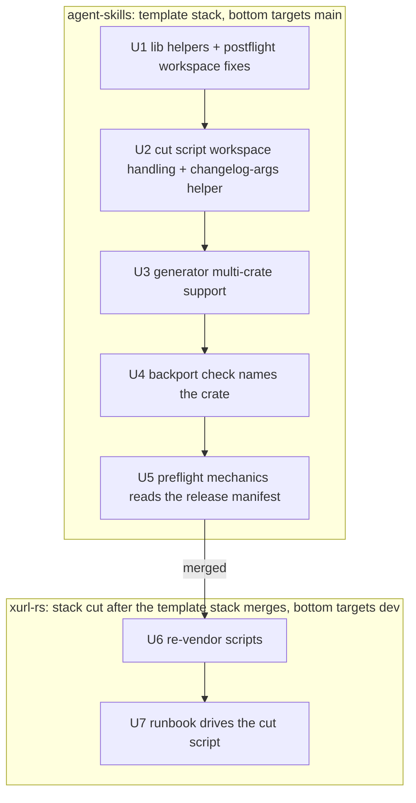
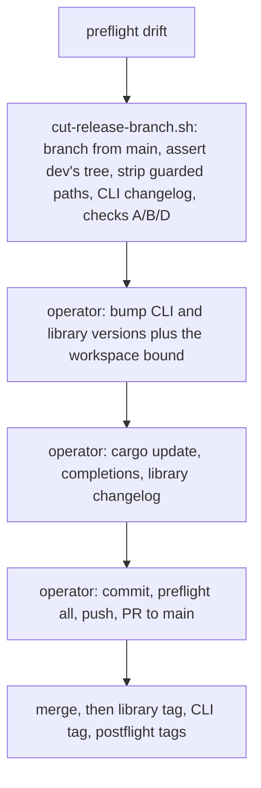

# Release Cut Script Wiring - Plan

**Target repos:** brettdavies/agent-skills, whose `github-repo-setup/` directory is the canonical template for vendored
release scripts, and brettdavies/xurl-rs. Paths starting with `github-repo-setup/` are in agent-skills; every other path
is in xurl-rs.

---

## Goal Capsule

- **Objective:** an xurl-rs release branch is built and checked by one command whose behavior the template's test suite
  covers, so no part of the overlay or its checks depends on commands typed by hand.
- **Means:** bring xurl-rs's vendored release scripts and the template into line, generic workspace support moving up
  and a verbatim copy coming back down (KTD1, KTD3, KTD4), then make `RELEASES.md` call
  `scripts/release/cut-release-branch.sh` (KTD2).
- **Authority:** the Product Contract's R-IDs win on behavior, KTDs win on mechanism, and a unit overrides neither. The
  template is canon for vendored scripts
  (`docs/solutions/conventions/upstream-a-vendored-copy-that-ran-ahead-until-the-repo-copy-derives-from-the-template.md`).
- **Execution profile:** inline, with no subagents, workers, or worktrees. Template units ship as one stack of PRs in
  agent-skills (bottom targets `main`); xurl-rs units ship as a second stack (bottom targets `dev`) cut only after the
  template stack has merged. Long jobs run in the background.
- **Stop conditions:** stop and ask when an upstreamed generator change would alter a single-crate repo's output beyond
  KTD5, when the rehearsal cut (KTD8) stages a tree that differs from the manual procedure's, or when a template change
  would break another consumer's documented flow.
- **Who finishes:** the implementer opens each PR and verifies its CI rollup; Brett merges every PR.

---

## Product Contract

### Summary

Move xurl-rs's workspace improvements in its vendored release scripts into the github-repo-setup template with bats
coverage, bring the template's own improvements down, and re-vendor so each script xurl-rs copies verbatim is
byte-identical to the template. Then rewrite the release runbook around `cut-release-branch.sh`, leaving the operator
the version bumps, lockfile, completions, library changelog, commit, preflight, push, and PR.

### Problem Frame

xurl-rs vendors `scripts/release/cut-release-branch.sh` but has never run it: `RELEASES.md` still documents the overlay
as hand-typed commands. The rename-detection gaps fixed in #259 and #260 lived in exactly those hand-typed commands,
while the script, which asserts the tree with `git read-tree` and runs the same checks in code, had them right and has
bats coverage in the template.

The vendored copies have also drifted from the template in both directions. xurl-rs carries workspace improvements the
template lacks (member changelogs, a version read from the release manifest, a backport check that accepts a library
tag's changelog). The template carries improvements xurl-rs lacks (`count_and_list`). `RELEASES-POSTFLIGHT.md` calls
xurl-rs's postflight a verbatim copy when it is not. The generator's multi-crate support, including the library's
member-tag changelog anchor from #261, exists only in xurl-rs, where nothing tests it.

The drift also hides a defect: the backport script's post-commit check runs `generate-changelog.py --dry-run --tag
vX.Y.Z` without `--crate`, so in xurl-rs it targets the root `CHANGELOG.md`, which is a router the generator refuses to
write, and every backport reports a failed check instead of comparing the changelog it synced.

### Requirements

**Release procedure**

- R1. xurl-rs's runbook builds the release branch with `scripts/release/cut-release-branch.sh` and no longer documents a
  hand-run overlay or hand-run checks A, B, and D for a normal release.
- R2. The runbook lists, in order, the steps the script leaves to the operator: the version bumps (the library's
  workspace bound with its own), the lockfile refresh, completions, the library changelog, the commit, preflight, push,
  and PR.
- R3. A rehearsal cut against the current `main` and `dev` stages the same tree as the documented manual procedure,
  before any version-carrier edit.

**Template parity**

- R4. After reconciliation, xurl-rs's `_lib.sh`, `cut-release-branch.sh`, `postflight.sh`, `sync-dev-after-release.sh`,
  and `generate-changelog.py` are byte-identical to the template.
- R5. xurl-rs's `preflight.sh`, a per-repo starter skeleton, shares the template's generic mechanics gate and keeps its
  repo-specific gates.
- R6. Every behavior moved into the template has a bats case observed failing against the pre-change template, and a
  single-package repo's output is unchanged except where KTD5 says otherwise.

**Correctness carried along**

- R7. In a workspace, the backport's post-commit check compares the released crate's own changelog instead of failing on
  the router.
- R8. The library's member-tag changelog anchor has permanent test coverage.
- R9. The docs describe the copies as they are: xurl-rs's `RELEASES-POSTFLIGHT.md` and the template's script reference.

### Success Criteria

- A `diff` of each R4 script against its template prints nothing.
- The template's full bats suite passes, and each new case was seen failing against `main`'s template first.
- The R3 rehearsal's staged tree equals the manual procedure's.

### Scope Boundaries

- The release model does not change: two tag lines, the library tag first, both tags on the release commit.
- Version bumps stay with the operator, as the script's header states.
- Other repos that vendor the template are not re-vendored here.
- The cherry-pick exception in `RELEASES.md` keeps its hand-run commands; it exists for repos that cannot overlay.

#### Deferred to Follow-Up Work

- The template's `changelog-sections` preflight gate fails a deliberately empty `## Changelog` block, which the
  generator treats as "nothing for this crate", and finds PRs with `gh pr list --base`, which misses stacked PRs.
  Reconcile it with the generator before xurl-rs adopts it.
- The template's `semver` preflight gate: xurl-rs runs the semver check in CI, so a local counterpart can wait.
- A documented flow for a library-only release. The member anchor already handles one if it happens.

### Sources

- `docs/solutions/conventions/upstream-a-vendored-copy-that-ran-ahead-until-the-repo-copy-derives-from-the-template.md`:
  generalize while upstreaming, keep single-package behavior, bring helpers along, test against the old template, leave
  the repo copy alone once derivable.
- `github-repo-setup/references/vendored-release-scripts.md`: which scripts refresh verbatim and which (`preflight.sh`,
  `surface-smoke.sh`) are per-repo starter skeletons.
- Prior work: xurl-rs#259, #260, #261; agent-skills#105 (an earlier upstreaming done this way), #119, #120, #121, #123;
  agentnative-cli#125.

---

## Planning Contract

### Key Technical Decisions

- KTD1. **Reconcile all five scripts, and `preflight.sh` only at its generic mechanics gate.** The template reference
  marks `preflight.sh` a starter skeleton each repo fills in, so xurl-rs's `api-contract`, `multi-app`, and xr-shaped
  `smoke` gates are expected divergence, not drift. Only the workspace-aware mechanics body is generic.
- KTD2. **The library changelog stays a manual step after the script.** The script's argument is the binary's version,
  and the library's next version is an operator decision read from the PRs' `## Changelog (xdk-rs)` blocks. The script
  also leaves every version carrier to the operator by design, so taking member versions as input would cut across that
  boundary.
- KTD3. **The generator's multi-crate support moves into the template, and xurl-rs re-vendors it verbatim.** The
  template's backport script and postflight already read `[package.metadata.changelog]` and `<crate>-vX.Y.Z` tags, so
  the generator is the one script in the set that does not. The function inventory supports a clean move: every template
  function exists in xurl-rs's copy, and xurl-rs adds thirteen (member config, router refusal, path membership,
  `binary_tag_beside`, batched fetches, title grouping, the git-cliff member merge).
- KTD4. **Generalize while upstreaming.** Template code learns workspace facts from `cargo metadata`,
  `[package.metadata.changelog]`, and `release.env`, and never names xurl-rs's crates or paths. A single-package repo
  takes the code path it takes today.
- KTD5. **Title fallback groups by conventional-commit type in the template too.** A PR with no changelog block lands
  under the group git-cliff gives its commit (`fix:` under Fixed, `feat:` under Added, `type!:` under Breaking changes),
  because the template's `cliff.toml` routes commits to exactly those groups. This changes single-package output (the
  template files every fallback under Changed today), so the generator PR says so for consumers who re-vendor.
- KTD6. **One rule decides when the generator gets `--crate`.** The cut script passes `--crate <release package>` when
  the release manifest is not the root `Cargo.toml`. The backport check needs the same arguments, so the rule moves into
  one `_lib.sh` helper both scripts call rather than a second inline copy.
- KTD7. **The template stack merges before xurl-rs re-vendors.** xurl-rs copies only merged template content, so the
  re-vendor diff is a pure copy and R4's `diff` is meaningful.
- KTD8. **A rehearsal proves the wiring before the runbook PR merges.** Run the script against current refs onto a
  throwaway local branch that is never pushed, rebuild the same branch with the manual procedure, and compare the two
  staged trees. This is the first time xurl-rs runs the script, and a staged-tree comparison is the evidence a passing
  suite cannot give.

### High-Level Technical Design

The work crosses two repos in a fixed order: template changes land and merge as one stack, then xurl-rs copies them.

After the wiring, a release follows this sequence; the script owns the boxed steps and the operator the rest.

### Risks & Dependencies

| Risk                                                                                   | Mitigation                                                                                                                     |
| -------------------------------------------------------------------------------------- | ------------------------------------------------------------------------------------------------------------------------------ |
| Every repo that re-vendors the template picks up the new workspace code paths.         | R6's single-package regression cases run in every template unit; KTD4 keeps workspace logic behind workspace-only conditions.  |
| The generator PR is large, about 640 changed lines.                                    | Port the function bodies unchanged where they are already general, review per function, and keep test cases one behavior each. |
| The first real run of the script on xurl-rs surfaces something the template never met. | KTD8's rehearsal runs before U7 merges; a mismatch is a stop condition.                                                        |
| A release branch is open while U6 or U7 lands.                                         | Land U6 and U7 between releases; neither changes a published crate.                                                            |
| The template's `RELEASES.md` and the reference drift from the scripts again.           | Each template unit updates the reference row for the script it touches.                                                        |

---

## Implementation Units

### U1. Upstream the workspace helpers and postflight's workspace fixes

- **Goal:** the template's `_lib.sh` and `postflight.sh` carry xurl-rs's generic workspace behavior.
- **Requirements:** R4, R6, R9
- **Dependencies:** none
- **Files:** `github-repo-setup/templates/scripts/release/_lib.sh`,
  `github-repo-setup/templates/scripts/release/postflight.sh`, `github-repo-setup/tests/lib.bats`,
  `github-repo-setup/tests/postflight-release-line.bats`, `github-repo-setup/templates/RELEASES-POSTFLIGHT.md`,
  `github-repo-setup/references/vendored-release-scripts.md`
- **Approach:**
  1. Add `crate_changelog_path` and `crate_changelog_paths` to `_lib.sh`, and make `project_version` tolerate a manifest
     with no version line under `pipefail`.
  2. In `postflight.sh`, read the version through `project_version` so a virtual workspace resolves the binary's tag,
     and keep the pyproject read from aborting the script.
  3. Add the backport gate's library-tag path: when no PR names the tag, compare the member's changelog on `dev` and
     `main`.
  4. Reword comments from "the binary and the library" to "a member" (KTD4).
- **Execution note:** write each case against `main`'s template first and watch it fail.
- **Patterns to follow:** xurl-rs `scripts/release/postflight.sh` (the backport gate's changelog comparison) and
  `scripts/release/_lib.sh`; the workspace fixture in `github-repo-setup/tests/postflight-tags.bats`.
- **Test scenarios:**
  - A virtual workspace with `RELEASE_MANIFEST` naming the binary resolves the tag `v<binary version>`, where the old
    template falls back to the newest git tag, which can be a library tag.
  - A single-package repo resolves its tag exactly as before.
  - The backport gate on a library tag with no PR naming it passes when `dev`'s member changelog equals `main`'s, fails
    when they differ, and skips when the member declares no changelog.
  - `crate_changelog_path` returns the declared path for a member, nothing for an undeclared member, and nothing when
    `cargo` or `jaq` is missing.
  - `project_version` on a manifest without a version line returns nothing and does not abort a `set -euo pipefail`
    caller.
- **Verification:** the new cases fail against `main`'s template and pass after; the full suite passes.

### U2. Upstream the cut script's workspace handling

- **Goal:** in a workspace, the cut script writes the release package's own changelog and treats member manifests and
  changelogs as version carriers.
- **Requirements:** R4, R6, R9
- **Dependencies:** U1
- **Files:** `github-repo-setup/templates/scripts/release/cut-release-branch.sh`,
  `github-repo-setup/templates/scripts/release/_lib.sh`, `github-repo-setup/tests/cut-release-branch.bats`,
  `github-repo-setup/templates/RELEASES.md`, `github-repo-setup/references/vendored-release-scripts.md`
- **Approach:**
  1. Add the KTD6 helper to `_lib.sh` and call it from the changelog step, keeping the explicit `--tag v<version>`.
  2. Widen verification A's carrier pattern to manifests and changelogs inside member directories.
  3. Note in the template runbook's workspace section that the script writes only the release package's changelog, and
     that each other member's changelog is the operator's step (KTD2).
- **Patterns to follow:** xurl-rs `scripts/release/cut-release-branch.sh` (its two workspace hunks).
- **Test scenarios:**
  - A virtual workspace whose `release.env` names the binary invokes the generator with `--from-dev-prs --tag v<version>
    --crate <binary>` (a stub generator records its arguments).
  - A single-package repo invokes it without `--crate`.
  - `--branch` with a custom name still passes `--tag v<version>`.
  - Verification A passes when a member's manifest and changelog differ from `dev`, and still fails on any other file in
    a member directory.
- **Verification:** the new cases fail against U1's template and pass after; the existing cut-script cases pass
  unchanged.

### U3. Upstream the generator's multi-crate support

- **Goal:** the template's `generate-changelog.py` gains xurl-rs's multi-crate mode, generalized, so xurl-rs's copy
  becomes derivable from it (KTD3).
- **Requirements:** R4, R6, R8, R9
- **Dependencies:** U2
- **Files:** `github-repo-setup/templates/generate-changelog.py`, `github-repo-setup/tests/generate-changelog.bats`,
  `github-repo-setup/tests/generate-changelog-workspace.bats` (new),
  `github-repo-setup/references/vendored-release-scripts.md`, `github-repo-setup/templates/RELEASES-RATIONALE.md`
- **Approach:**
  1. Bring over `--crate` and its `[package.metadata.changelog]` config, router detection and refusal, path-based
     membership, `binary_tag_beside` and its use in `merged_pr_numbers`, the batched GraphQL prefetch with its per-PR
     fallback, the git-cliff member merge, and the prefixed tag-line helpers.
  2. Adopt title grouping by type and the Deprecated category (KTD5), rewording the grouping table's comment to cite the
     template's own `cliff.toml`.
  3. Rewrite the reference's generator row: it refreshes verbatim, it has a workspace mode, and `--from-dev-prs` anchors
     on the previous release's backport commit (the row still describes the older rule).
  4. Update the one existing case that asserts fallback titles land under Changed, as KTD5's deliberate change.
  5. Explain a member's changelog window in `RELEASES-RATIONALE.md`'s workspace section: it starts at the backport of
     the binary tag beside the member's previous tag, because the backport's subject names only the binary's tag.
- **Execution note:** port the scratch-harness cases used to verify #261 as permanent tests before moving the code.
- **Patterns to follow:** xurl-rs `scripts/generate-changelog.py`; the harness in
  `github-repo-setup/tests/generate-changelog.bats` (stubbed `fetch_pr`, real git history through `history_repo`).
- **Test scenarios:**
  - `--crate <member>` writes the member's changelog at the path its `[package.metadata.changelog]` table declares,
    under the heading it declares.
  - Without `--crate`, a root changelog carrying the router marker is refused with a message naming `--crate`.
  - A PR that touches only another member's paths is left out of a member's section; a PR with the member's own block is
    kept whatever paths it touched.
  - An empty `## Changelog (<member>)` block contributes nothing.
  - A member's previous tag beside a binary tag anchors on that binary tag's backport. Covers R8.
  - A member released alone anchors on its own backport, and with none falls back to its tag.
  - A fallback title `fix(x): y` lands under Fixed, `feat!: y` under Breaking changes, and `chore: y` nowhere.
  - A Deprecated section renders between Changed and Fixed.
  - A prefetch failure falls back to per-PR fetches and yields the same entries.
  - A single-package repo's existing cases all pass except the updated fallback-group case.
- **Verification:** each new case fails against U2's template and passes after; `diff` against xurl-rs's copy shows only
  reworded comments, which U6 then takes.

### U4. Make the backport check name the released crate

- **Goal:** in a workspace, the backport's post-commit regen check compares the released crate's changelog (R7).
- **Requirements:** R4, R6, R7
- **Dependencies:** U3
- **Files:** `github-repo-setup/templates/sync-dev-after-release.sh`,
  `github-repo-setup/tests/sync-dev-after-release.bats`
- **Approach:** call the KTD6 helper for the regen check's arguments; the success and warning lines name the changelog
  that was checked.
- **Patterns to follow:** U2's changelog step.
- **Test scenarios:**
  - A workspace whose root changelog is a router runs the check with `--crate <binary>` and reports a match when the
    synced changelog is current.
  - The same workspace with a stale member changelog warns with the generator's drift line, not a router refusal.
  - A single-package repo runs the check with the arguments it uses today.
- **Verification:** the workspace cases fail against U3's template, where the check ends in the router refusal, and pass
  after.

### U5. Make preflight's mechanics gate read the release manifest

- **Goal:** the template's mechanics gate reads a virtual workspace's binary version and changelog, and checks each
  member whose release is pending, so xurl-rs's mechanics body can match it without losing a check (R5).
- **Requirements:** R5, R6
- **Dependencies:** U4
- **Files:** `github-repo-setup/templates/scripts/release/preflight.sh`,
  `github-repo-setup/tests/preflight-mechanics.bats` (new)
- **Approach:**
  1. Read the version through `project_version` and the changelog through `release_changelog`, as xurl-rs's mechanics
     gate does.
  2. Generalize xurl-rs's library-changelog check: for each publishable member other than the release package, its
     release is pending when no `<tag_prefix><version>` tag exists, and then its changelog's top section must equal its
     version with no `[Unreleased]`. Tag prefix and changelog path come from `[package.metadata.changelog]` with the
     generator's defaults. This check is the safety net KTD2's manual library-changelog step relies on.
  3. Name `generate-changelog.py --crate <member>` in the failure hint, in place of xurl-rs's reference to a per-crate
     `cliff.toml` that does not exist.
  4. Leave the starter gates and their placeholders alone.
- **Patterns to follow:** xurl-rs `scripts/release/preflight.sh` (`gate_mechanics`); the harness in
  `github-repo-setup/tests/preflight-added-docs.bats`.
- **Test scenarios:**
  - A virtual workspace with `RELEASE_MANIFEST` and `RELEASE_CHANGELOG` passes when the binary's version matches its
    changelog's top section, and fails naming both when it does not.
  - A single-package repo behaves exactly as before.
  - A `pyproject.toml` with no version line under `pipefail` does not abort the gate.
  - A library member with no tag at its manifest version fails when its changelog's top section names another version,
    and passes when they match.
  - A library member whose version is already tagged is not checked.
  - A library member's changelog holding `[Unreleased]` fails while its release is pending.
- **Verification:** the workspace cases fail against U4's template and pass after.

### U6. Re-vendor xurl-rs's release scripts

- **Goal:** each R4 script is a byte-identical copy of the merged template, and `preflight.sh`'s mechanics gate matches
  the template's.
- **Requirements:** R4, R5, R9
- **Dependencies:** U1 through U5 merged (KTD7)
- **Files:** `scripts/release/_lib.sh`, `scripts/release/cut-release-branch.sh`, `scripts/release/postflight.sh`,
  `scripts/release/preflight.sh`, `scripts/sync-dev-after-release.sh`, `scripts/generate-changelog.py`,
  `scripts/release/release.env`, `RELEASES-POSTFLIGHT.md`
- **Approach:**
  1. Copy each R4 script from the merged template.
  2. Replace only `gate_mechanics` in `preflight.sh` with the template's, which after U5 carries the generalized
     library-changelog check and the portable `epoch_of_date` date math.
  3. Add any `release.env` key a template script now reads.
  4. Make `RELEASES-POSTFLIGHT.md`'s "verbatim copy" sentence true.
- **Test expectation:** none beyond verification; the copied behavior is tested in the template, and this unit proves
  the copy matches what was tested.
- **Verification:**
  - `diff` of each R4 script against the template prints nothing.
  - `postflight.sh --tag v4.2.0 tags` and `backport` pass.
  - The generator's `--crate xdk-rs` and `--crate xurl-rs` windows still return the same PRs as on `dev` before the
    copy.
  - The KTD6 helper, sourced from xurl-rs's `_lib.sh` with its `release.env`, returns `--crate xurl-rs`, so the
    backport's regen check and the cut script pass the same arguments.
  - `scripts/hooks/pre-push` and the PR's CI pass.

### U7. Make the runbook drive the cut script

- **Goal:** `RELEASES.md` builds the release branch with the script, and every remaining manual step is listed in order
  (R1, R2).
- **Requirements:** R1, R2, R3
- **Dependencies:** U6
- **Files:** `RELEASES.md`, `RELEASES-PREFLIGHT.md`, `RELEASES-RATIONALE.md`
- **Approach:**
  1. Replace § Releasing dev to main steps 1 through 3 and checks A, B, and D with one call to the script and a table of
     what it checks, following the template's runbook shape.
  2. Add § Project specifics holding xurl-rs's operator steps: the CLI version bump, the library bump and workspace
     bound, `cargo update`, completions, and the library changelog (KTD2).
  3. Fold § Releasing the library step 1 into that list, so the library changelog appears once.
  4. Update `RELEASES-PREFLIGHT.md` and `RELEASES-RATIONALE.md` wherever they cite the hand-run steps.
- **Test expectation:** none in the suite; the behavioral proof is the rehearsal.
- **Verification:** the KTD8 rehearsal: `cut-release-branch.sh --dry-run`, then a real run onto a throwaway local
  branch, its staged tree compared with the tree the manual overlay, guarded-path strip, and CLI changelog step stage
  for the same refs, after which the throwaway branch is deleted without ever being pushed. markdownlint and the PR's
  CI pass.

---

## Verification Contract

| Scope                | Command or check                                                                                | Applies to         |
| -------------------- | ----------------------------------------------------------------------------------------------- | ------------------ |
| Template suite       | `bats github-repo-setup/tests/`, full, in the background                                        | U1 to U5           |
| New cases fail first | each new case run against the template one unit earlier, failure output quoted in the PR        | U1 to U5           |
| Shell lint           | `LC_ALL=C.UTF-8 shellcheck` on every changed script                                             | U1, U2, U4, U5, U6 |
| Markdown lint        | `markdownlint-cli2` on every changed doc, run from the repo root so its config applies          | all                |
| Copy parity          | `diff` of each R4 script against the merged template prints nothing                             | U6                 |
| Real tags            | `scripts/release/postflight.sh --tag v4.2.0 tags` and `backport` pass                           | U6                 |
| Rehearsal            | KTD8 staged-tree comparison against current `main` and `dev`, throwaway branch deleted unpushed | U7                 |
| Local CI mirror      | `scripts/hooks/pre-push`                                                                        | U6, U7             |
| CI                   | every PR's rollup reads SUCCESS apart from conditional skips                                    | all                |

---

## Definition of Done

- R1 through R9 hold, and each Success Criteria item has been observed.
- Both stacks are merged by Brett; nothing in this plan is merged by the implementer.
- The xurl-rs scripts that R4 names carry no local edits; any later fix lands in the template first.
- No throwaway branch from the rehearsal remains locally or on the remote.
- Abandoned attempts are removed from the diff, not left commented out.
- Per unit: its Verification bullets were run and their results quoted in its PR body.
