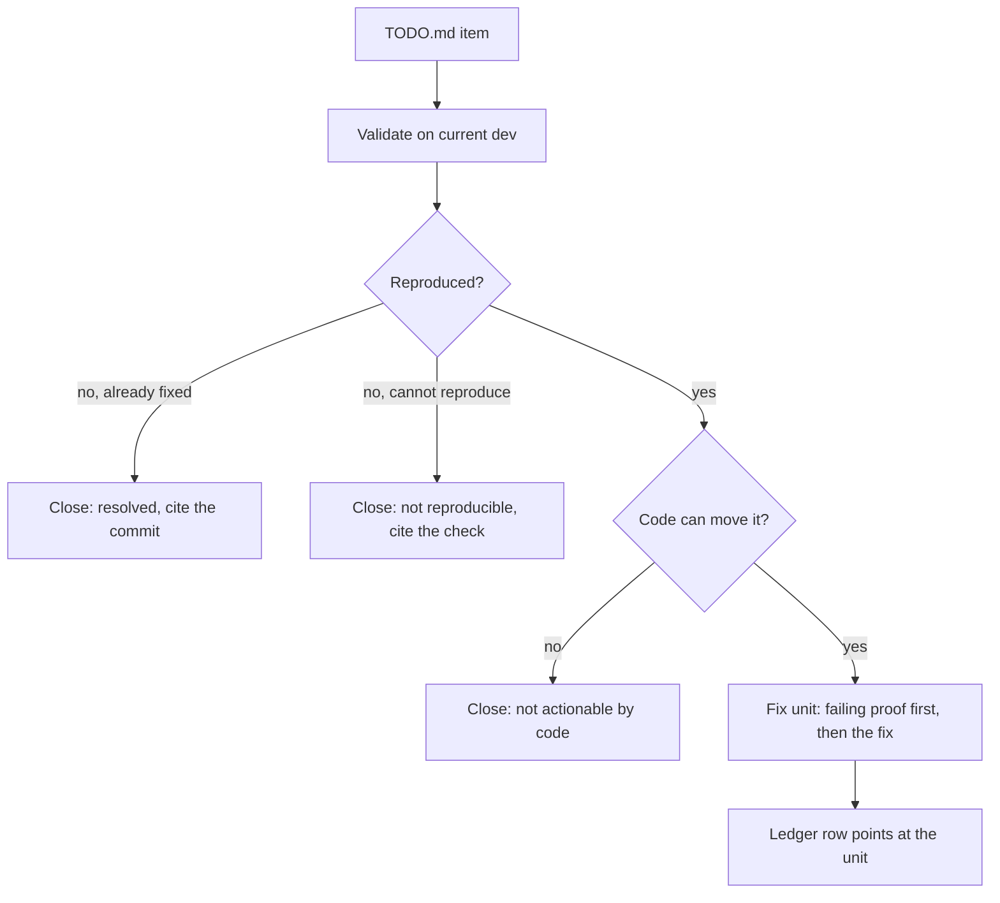
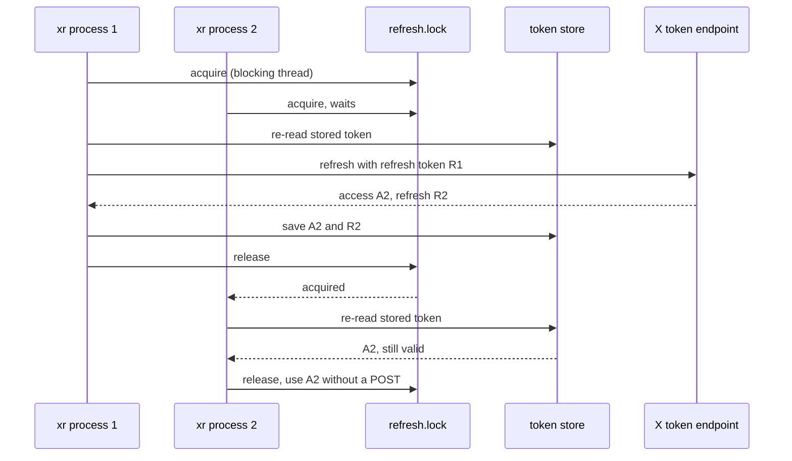
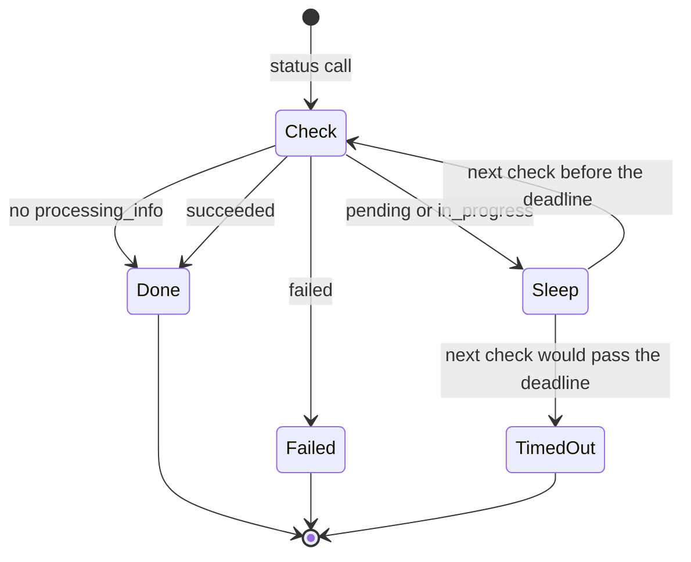
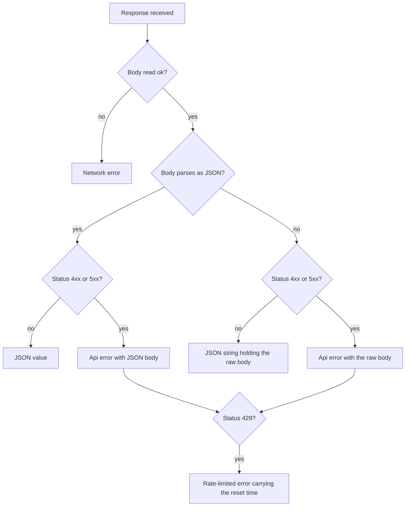
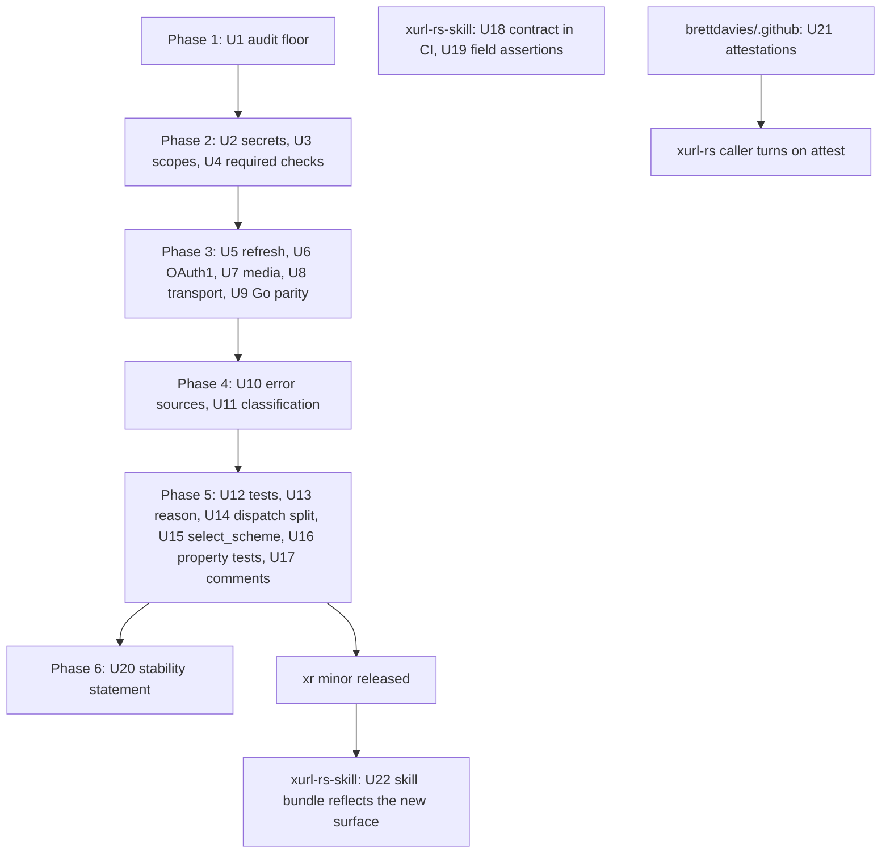

# Public Review Follow-ups - Plan

**Target repos:** brettdavies/xurl-rs (every unprefixed path), brettdavies/xurl-rs-skill (paths prefixed
`xurl-rs-skill:`), and brettdavies/.github (paths prefixed `dot-github:`), which holds the reusable release workflows
every Rust repo calls.

---

## Goal Capsule

- **Objective:** A developer deciding whether to depend on `xr` or `xdk-rs`, re-running the 2026-10-01 public review
  against the repos, finds no defect to cite: every finding is either fixed with a test that proves it or closed with
  the evidence recorded.
- **Means:** validate each item against current `dev`, triage it on that evidence, and fix what triage keeps (KTD1),
  across xurl-rs, xurl-rs-skill, and the shared release workflows.
- **Authority:** Requirements outrank Key Technical Decisions, which outrank unit text. `AGENTS.md` § "Where a change
  goes" decides which crate a change lands in; `RELEASES.md` § Versioning decides each crate's bump.
- **Stop conditions:**
  - Stop and ask before any change that alters the CLI contract outside the planned `xr` minor or the planned `xdk-rs`
    0.2.0.
  - Stop and ask when settling an item would take more than two live X API calls.
  - Stop and ask when an item turns out to need a product decision this plan does not record.
- **Execution profile:** one stacked PR series per repo, cut from `dev`; no subagents or worktrees; long jobs run in the
  background; live X API calls only where a unit names one.
- **Who finishes:** the executing agent opens and verifies every PR. Brett merges every PR, applies the rulesets, and
  cuts the `xr` minor and `xdk-rs` 0.2.0 releases through `RELEASES.md`.

---

## Product Contract

### Summary

Every item in the local TODO.md, which lists the findings of the 2026-10-01 outside-agent review, goes through
validation, triage, and a fix. Twenty-two items are confirmed against current `dev` and get fixed. One, outside
validation of the project, is not actionable by code and is closed with its reason recorded. The fixes ship as an `xr`
minor and an `xdk-rs` 0.2.0, plus changes in xurl-rs-skill's CI and in the shared release workflows.

### Problem Frame

On 2026-10-01, outside agents reviewed the public repos using only public GitHub data and anc.dev. They found that `xr`
failed a MUST in the agent-native standard it advertises, and they reported correctness gaps, library API weaknesses,
thin tests, and trust signals a consumer looks for. To anyone evaluating the project, those read as an unfinished tool.

The findings were recorded as claims, some verified and some not, with line numbers against a `main` commit that has
since moved. Re-checking them against current `dev` changed the picture:

- **Resolved:** the MUST failure is gone, and the audit now scores 98%.
- **Wider than reported:** every credential flag is argv-only, not just `--client-secret`.
- **Worse than reported:** `media status --wait` on an image polls the paid API forever.
- **Confirmed by test vector:** the OAuth1 encoding defect is provable against X's own published signature example.

The work therefore starts from evidence rather than from the review's text.

### Requirements

**Validation and triage**

- R1. Every TODO.md item carries a triage outcome (fix, close as resolved or not reproducible, or not actionable by
  code) backed by evidence against current `dev`, recorded in the triage ledger.
- R2. Every fixed item ships with a test or CI gate that fails against the code before its fix.

**Agent-native contract**

- R3. The agent-native audit's score floor in CI equals the score `dev` achieves, and every remaining non-passing row is
  fixed or recorded with its reason.
- R4. Every credential `xr` accepts can be supplied without appearing in the process's argv, from a file or stdin, while
  the existing flags keep working.
- R5. The agent-native audit and an MSRV check are required status checks on `dev` and `main`.

**Correctness**

- R6. Two `xr` processes that refresh the same OAuth2 login at once spend its refresh token once, and the second uses
  the token the first saved.
- R7. OAuth1 requests sign their parameters with RFC 5849 encoding, so a query or body value containing a space, `+`,
  `~`, or `*` verifies at X.
- R8. Waiting on media processing always ends: a status with no processing information counts as finished, and an
  overall deadline bounds the wait.
- R9. The Go differential suite runs in CI against a pinned Go `xurl`, and fails there when that binary is missing
  instead of passing silently.
- R10. A user can sign in with a narrower OAuth2 scope set, and the default stays the full set.
- R11. The transport never reports a failure as success: a body that fails to read is an error, a non-JSON success body
  reaches the caller intact, a non-JSON error body reaches the error message, and a rate-limited error says when to
  retry.

**Library API (`xdk-rs`)**

- R12. Every `xdk::Error` that wraps a lower-level failure exposes it through `std::error::Error::source`.
- R13. A malformed URL classifies as `InvalidUrl`, not as a network error.
- R14. YAML failures in the token store classify as token-store errors, not JSON errors.

**Test depth and code shape**

- R15. Every agentic test proves the behavior its name claims, not only that clap parsed a flag.
- R16. The error envelope's `reason` is a typed closed set, and its JSON output does not change.
- R17. `run_subcommand` and `select_scheme` are split so neither needs a size lint allow, with behavior unchanged.
- R18. Property tests cover the OAuth1 signature base string, envelope serialization, and the token store's round trip.
- R19. No code comment cites a non-public plan, todo, or plan unit.

**Skill harness (xurl-rs-skill)**

- R20. CI runs `tests/contract.sh` against a pinned `xr` release.
- R21. The contract harness asserts on parsed JSON fields, not on substrings of pretty-printed output.

**Release trust**

- R22. The READMEs state what is stable in the CLI and in the library, and how breaking changes reach a release.
- R23. Release archives carry build-provenance attestations and an SBOM, produced by the shared release workflows.

### Key Decisions

- **Every item goes through validation and triage, and everything triage keeps is fixed in this plan.**
  (session-settled: user-directed, chosen over excluding the non-code signals and deferring release provenance to a
  fleet plan: the request is to validate, triage, and fix all items deemed needing attention.) Governs R1, R22, R23.
- **An item needs work only once reproduced against current `dev`.** (session-settled: user-approved, chosen over
  accepting a reviewer's report at face value: unverified claims had already drifted from the code.) Governs R1, R2.
- **Where a fix would change what existing users or embedders get, today's behavior stays the default.**
  (session-settled: user-approved, chosen over narrowing defaults directly: existing scripts and sign-ins keep working.)
  Governs R4, R10, R11.
- **The library breaks ship together as one `xdk-rs` 0.2.0.** (session-settled: user-approved, chosen over one break per
  change: embedders absorb a single migration.) Governs R12, R13, R14.
- **The Go suite is enforced in CI against a pinned Go `xurl`.** (session-settled: user-approved, chosen over marking it
  ignored with a manual recipe: parity becomes a checked claim.) Governs R9.
- **Fixes land where the code lives.** (session-settled: user-approved, chosen over keeping all work in xurl-rs: the
  harness lives in xurl-rs-skill and provenance belongs in the shared workflows.) Governs R20, R21, R23.

### Scope Boundaries

- **Not actionable by code:** stars, outside reviews, third-party issues, and download counts. The item is closed in the
  triage ledger with that reason.
- **Considered and not built:**
  - A fuzzing harness. Property tests reach the same parsers without a nightly toolchain. A crash found in the field
    would change the call.
  - Automatic retry on rate limits by default. It stays opt-in under the Key Decisions above.
  - A hidden-input interactive prompt for secrets. File and stdin input covers agents and humans alike. Demand from
    interactive users would change the call.
  - Reading two secrets from stdin in one invocation. Stdin carries one value; a second secret takes a file.

#### Deferred to Follow-Up Work

- Cutting the `xr` minor and `xdk-rs` 0.2.0 releases, which follow `RELEASES.md` once these PRs merge.
- Turning on attestations in each other Rust repo's release caller (bird, agentnative-cli), one input per repo once U21
  lands.

### Open Questions

- **Major-version cadence (non-blocking).** The review counted three `xr` majors between 2026-06-05 and 2026-09-18. U20
  documents the existing versioning policy. Committing to a cadence, such as batching breaking changes into at most one
  major per quarter, is a product decision for Brett. U20 adds the line once it is decided.

---

## Planning Contract

### Triage Ledger

Evidence was gathered against `dev` at `71b2eb5` on 2026-10-05. Each fix unit re-checks its item on current `dev` before
changing code (KTD1).

| Item                                          | Evidence on `dev`                                                                                                                                                                                                 | Outcome                        | Reqs    | Unit    |
| --------------------------------------------- | ----------------------------------------------------------------------------------------------------------------------------------------------------------------------------------------------------------------- | ------------------------------ | ------- | ------- |
| T1 `p2-must-json-errors` MUST exempted        | Exemption removed by #270; CI audit scores 98% with no MUST failure; `ANC_SCORE_FLOOR` still 94; the released 4.2.1 shows `warn` on `p2-must-output-flag`, `p6-may-standard-names`, `p6-should-consistent-naming` | Fix (floor and remaining rows) | R3      | U1      |
| T2 Flag-only client secret                    | `--client-secret`, `--consumer-secret`, `--access-token`, `--token-secret`, `--bearer-token` are argv-only in `crates/xurl-cli/src/cli/mod.rs`                                                                    | Fix (wider than reported)      | R4      | U2      |
| T3 Cross-process refresh race                 | `refresh_oauth2_token` in `crates/xdk/src/auth/oauth2.rs` reads the in-memory token, POSTs the refresh unlocked, and locks only to save                                                                           | Fix                            | R6      | U5      |
| T4 OAuth1 encoding not RFC 5849               | `encode` in `crates/xdk/src/auth/oauth1.rs` uses `form_urlencoded`; X's published example encodes a space as `%2520` where `xr` produces `%252B`                                                                  | Fix                            | R7, R18 | U6      |
| T5 Media poll has no deadline                 | `wait_for_media_processing` in `crates/xdk/src/api/media.rs` loops with no cap, and an empty state polls every second forever                                                                                     | Fix (worse than reported)      | R8      | U7      |
| T6 Go suite passes silently                   | `crates/xurl-cli/tests/conformance_runner.rs` returns early when Go `xurl` is missing; no workflow sets `XURL_ORIGINAL_BIN`; 33 of 36 cases are offline                                                           | Fix                            | R9      | U9      |
| T7 Every sign-in requests 24 scopes           | `get_oauth2_scopes` requests 24, including `dm.write` and `users.email`; no scope flag                                                                                                                            | Fix                            | R10     | U3      |
| T8 Transport swallows errors, no 429 handling | `crates/xdk/src/api/request/transport.rs` maps a failed body read to empty and non-JSON bodies to `{}`; 429 classifies as `rate-limited` but the envelope carries no retry time                                   | Fix                            | R11     | U8      |
| T9 Agent-native audit not required            | Absent from `.github/rulesets/protect-dev.json` and `protect-main.json`                                                                                                                                           | Fix                            | R5      | U4      |
| T10 Errors drop their cause chain             | Every `xdk::Error` variant wraps a `String`; no `#[source]` in `crates/xdk/src/error.rs`                                                                                                                          | Fix (breaking)                 | R12     | U10     |
| T11 Malformed URL exits as network error      | `impl From<url::ParseError>` maps to `Error::Http`; inside `xr`, a malformed raw-mode URL with a valid scheme fails in the HTTP client and OAuth1 signing maps it to `Auth("InvalidURL")`                         | Fix (wider than reported)      | R13     | U11     |
| T12 Agentic tests only prove clap parsing     | `test_timeout_flag_accepted`, `test_no_color_env_respected`, and the quiet-flag tests in `crates/xurl-cli/tests/agentic_tests.rs` only run `--help`                                                               | Fix                            | R15     | U12     |
| T13 YAML errors labelled JSON                 | `save_to_file` in `crates/xdk/src/store/mod.rs` maps `serde_yaml` errors to `Error::Json`                                                                                                                         | Fix                            | R14     | U11     |
| T14 Envelope `reason` is a `String`           | `ErrorBody::reason` in `crates/xurl-cli/src/cli/envelope.rs`                                                                                                                                                      | Fix                            | R16     | U13     |
| T15 `contract.sh` not in CI                   | `xurl-rs-skill:.github/workflows/ci.yml` runs `tests/run.sh` and the core-env guard only                                                                                                                          | Fix                            | R20     | U18     |
| T16 Contract greps pretty JSON                | `check` in `xurl-rs-skill:tests/contract.sh` matches with `grep -qF`                                                                                                                                              | Fix                            | R21     | U19     |
| T17 `run_subcommand` ~670 lines               | 664 lines under `#[allow(clippy::too_many_lines, clippy::too_many_arguments)]`                                                                                                                                    | Fix                            | R17     | U14     |
| T18 `select_scheme` sprawl                    | 147 lines in `crates/xdk/src/api/request/auth_header.rs`, building `AuthMismatch` in several places                                                                                                               | Fix                            | R17     | U15     |
| T19 No property tests, no MSRV job            | No proptest or fuzz dependency; MSRV checked only by `scripts/hooks/pre-push`; the reusable CI has no MSRV job                                                                                                    | Fix                            | R5, R18 | U4, U16 |
| T20 Comments cite non-public plans            | Test comments cite "the U9 plan", "the library-CLI-entrypoint plan", and "plan U8 deferred"                                                                                                                       | Fix                            | R19     | U17     |
| T21 No outside validation                     | Stars, reviews, and downloads are signals no change in these repos moves                                                                                                                                          | Not actionable by code         | R1      | none    |
| T22 Major-version churn                       | Tags `v2.0.0` (2026-06-05), `v3.0.0` (2026-09-02), `v4.0.0` (2026-09-18)                                                                                                                                          | Fix (documentation)            | R22     | U20     |
| T23 No release provenance                     | No attestation, SBOM, or signing in `dot-github:.github/workflows/rust-release.yml`                                                                                                                               | Fix                            | R23     | U21     |

### Key Technical Decisions

- KTD1. **Each fix unit starts from a failing proof on current `dev`.** The ledger's evidence is a snapshot; a unit
  first writes the test or gate that fails on `dev`, then fixes. When `dev` already passes, the unit records the item as
  resolved and stops. This makes R2 the unit's first commit rather than an afterthought.
- KTD2. **Secrets come from `--<flag>-file PATH`, where `PATH` of `-` reads stdin.** Each secret flag in R4 gains a file
  twin, mutually exclusive with the plain flag, and a second `-` in one invocation is a usage error. The twin follows
  the existing `--auth-url -` precedent in the OAuth2 headless flow, keeps the value out of argv and shell history, and
  lets an agent pipe it. Identifiers (`--client-id`, `--consumer-key`) are not secrets and gain no twin.
- KTD3. **A dedicated refresh lock serializes refreshers across processes.** The refresh path takes an OS lock on a
  second sidecar, `<store>.refresh.lock`, acquired on a blocking thread and held across the token POST. Under it, the
  path re-reads the stored token from disk, returns it when another process already refreshed it, and otherwise
  refreshes and saves. The store's existing sidecar lock tracks reentrancy per thread, so holding it across an `.await`
  that can move tasks between threads would corrupt its bookkeeping. An optimistic alternative, retrying after
  `invalid_grant` by re-reading the store, still leaves a window and needs a sleep, so it was rejected. Reversing the
  choice touches one function, so no bake-off was warranted.
- KTD4. **OAuth1 signing uses an RFC 3986 unreserved-set encoder.** The signature base string and the `Authorization`
  header parameters use an encoder that leaves only `A-Z a-z 0-9 - . _ ~` bare and emits uppercase `%XX`. X's published
  signature example is the acceptance vector. The change diverges from Go `xurl`, which shares the `url.QueryEscape`
  behavior, so `KNOWN_DIFFERENCES.md` records it.
- KTD5. **Media waiting gets a library deadline and a CLI flag.** A status with no `processing_info` counts as finished,
  and the wait ends with a distinct error once a deadline passes. The deadline is a library parameter with a default;
  the CLI exposes it as `--wait-timeout <SECS>` on `media upload` and `media status`. The timeout becomes a new `reason`
  in the closed set, which is an additive change.
- KTD6. **The transport keeps every byte it received.** A failed body read becomes a network error. A non-JSON success
  body reaches the caller as a JSON string, which raw mode prints as text and a typed call fails to deserialize. A
  non-JSON error body becomes the `Api` error's body. A rate-limited error carries the reset time from the
  `x-rate-limit-reset` header, and the envelope adds it as a new key. Opt-in retry is one global flag that waits until
  the reset and retries once, within a caller-set ceiling. The three request paths in `transport.rs` share one header
  assembler.
- KTD7. **Scopes come from `--scopes` on `xr auth oauth2`.** The flag takes a comma-separated subset of the known set
  and rejects unknown names by listing the valid ones. `offline.access` is always added, because a login without a
  refresh token expires within hours. The library takes the scope set as an input to building the authorize URL, with
  the full set as its default.
- KTD8. **Error causes ride on new fields, not new variants.** Each variant that wraps a lower-level failure gains a
  boxed `source` field marked `#[source]`. `Display`, `kind()`, `exit_code()`, and `next_action()` stay identical, so
  the CLI's output does not move. The variant shapes change, which is the 0.2.0 break, and a before/after snippet goes
  in the `## Changelog (xdk-rs)` block of the PR body.
- KTD9. **The `reason` closed set becomes an enum in the CLI crate.** A `Reason` enum with kebab-case serialization
  replaces the `String`. The library's `kind()` strings map into it in one exhaustive function. Unchanged golden
  fixtures and committed schemas prove the wire did not move. The CLI crate's library target is not a published API, so
  no semver gate applies.
- KTD10. **`run_subcommand` splits by command group.** The groups follow `AGENTS.md` § Command grammar: each
  subcommand-family noun (`auth`, `media`, `usage`, `broadcasts`, `skill`, `schema`, `completions`) gets its own
  dispatch function in a sibling module, the top-level core-domain verbs group by the resource they act on (posts,
  engagement, the social graph, reads, DMs), and the remaining tooling commands (`validate`, `examples`, `version`)
  share one. `family_help.rs` declares only two families, `broadcasts moderators` and `media subtitles`, so it cannot
  drive a split of the forty-odd commands the function dispatches. The lint allows come off, and the golden and dry-run
  fixtures are the behavior proof. No fixture is re-blessed.
- KTD11. **The Go parity job installs Go `xurl` at a pinned commit.** An inline job in `ci.yml` runs `go install` for a
  SHA-pinned `xdevplatform/xurl` and sets `XURL_ORIGINAL_BIN`. When `XURL_ORIGINAL_BIN` is set and names no executable,
  the runner fails instead of skipping; unset, it skips as it does today. `CI=true` cannot be the trigger: the shared
  reusable workflow's test job runs the same test target with a plain `cargo test`, and GitHub sets `CI=true` there with
  no Go binary. The three live-API cases stay skipped, so the job spends nothing.
- KTD12. **The MSRV check is an inline CI job.** It reads `rust-version` from the workspace `Cargo.toml` and runs `cargo
  check --workspace --all-features` on that toolchain. It mirrors the pre-push step, and both rulesets require it.
- KTD13. **Property tests use `proptest` as a dev-dependency of both crates.** The envelope lives in the CLI crate and
  the signer and store in the library, so each crate's tests need it. `cargo deny` already allows its MIT/Apache-2.0
  licenses. Cases stay bounded so the default suite's runtime barely moves.
- KTD14. **Attestations are opt-in in the shared release workflow.** `dot-github:.github/workflows/rust-release.yml`
  gains an `attest` input, default `false`. When it is on, the workflow attests every archive and `sha256sum.txt` with
  SHA-pinned `actions/attest-build-provenance`, generates a CycloneDX SBOM, and attests it with `actions/attest-sbom`. A
  caller that turns it on grants `id-token: write` and `attestations: write`. A default-on input would fail every caller
  that lacks those permissions, so the default stays off. The xurl-rs caller turns it on in this plan.
- KTD15. **Each repo's work ships as one stacked PR series.** The xurl-rs stack runs in phase order (High-Level
  Technical Design). It lands with one atomic `gh stack merge` so restacks do not re-run CI quadratically. xurl-rs-skill
  and brettdavies/.github each get their own short series.
- KTD16. **Every surface this plan adds reaches the skill bundle after the `xr` release ships.** Agents learn `xr` from
  xurl-rs-skill, so the new credential-file flags, `--scopes`, `--wait-timeout`, the retry flag, the timeout `reason`,
  and the retry-time key are documented there (U22). The skill PR lands after the `xr` minor publishes, because a skill
  that names a flag the installed `xr` lacks sends an agent's first command to failure, as
  `docs/solutions/architecture-patterns/prose-reference-is-a-release-dependency.md` records.

### System-Wide Impact

- **Agents reading the envelope** gain a `reason` (U7) and a key (U8). Both are additive; the documented contract
  already tells consumers to treat an unknown `reason` as their default branch.
- **Scripts reading raw-mode output** see a non-JSON success body as text where `dev` printed `{}` (U8), and a malformed
  URL exit as `invalid-url` where `dev` reported a network or auth error (U11). Both are returns to the documented
  contract, filed under Fixed.
- **Embedders of `xdk-rs`** absorb the variant-shape changes (U10, U11) and the new media-wait and scope parameters (U3,
  U7) in one 0.2.0.
- **The token store's directory** gains a `<store>.refresh.lock` sidecar beside the existing `<store>.lock` (U5).
- **Every xurl-rs PR** waits on three more required checks: the audit, MSRV, and Go parity (U4, U9).
- **Other Rust repos** calling the shared release workflow see no change until they turn on `attest` (U21).
- **Agents using the skill bundle** see the new surface only after U22, which follows the `xr` release.

### Risks & Dependencies

- **A required check that never reports blocks every merge.** U4 confirms the audit, MSRV, and parity jobs report on
  every PR, including docs-only ones, before Brett applies the rulesets.
- **The refresh lock is as strong as the filesystem's locking.** On an NFS or SMB mount that ignores `flock`, two hosts
  can still race, the same limit `crates/xdk/src/store/atomic.rs` documents for store writes. Cross-host locking is
  considered and not built: one user's store on a network mount is rare, and a report of the race there would change the
  call.
- **The Go `xurl` pin depends on Go's module proxy.** If the pinned commit stops resolving, the parity job fails visibly
  rather than passing, which is the outcome R9 wants.
- **Attestation needs caller permissions.** The `attest` input stays off by default (KTD14), so a caller without
  `id-token: write` and `attestations: write` keeps working.
- **The OAuth1 fix rests on X's published vector.** One live call in U6 confirms X accepts the corrected signature; if
  it does not, U6 stops and reports before merging.
- **Live API spend is one call.** No other unit touches the live API; the mock serves every other scenario.

### High-Level Technical Design

Each item moves through the same three steps; the ledger above records where each one landed.

The refresh path under KTD3 serializes two processes holding the same expired login:

Media waiting under KTD5 always reaches a terminal state:

The transport under KTD6 classifies every response without discarding bytes:

The xurl-rs stack lands in phases; xurl-rs-skill and the shared workflows run in parallel with it:

---

## Implementation Units

| U-ID | Title                                          | Key files                                                                          | Depends on                       |
| ---- | ---------------------------------------------- | ---------------------------------------------------------------------------------- | -------------------------------- |
| U1   | Audit floor and remaining rows                 | `.github/workflows/ci.yml`                                                         | none                             |
| U2   | Credentials from a file or stdin               | `crates/xurl-cli/src/cli/mod.rs`, `crates/xurl-cli/src/cli/commands/auth/`         | U1                               |
| U3   | Narrower OAuth2 scopes on request              | `crates/xdk/src/auth/oauth2.rs`, `crates/xurl-cli/src/cli/commands/auth/signin.rs` | U1                               |
| U4   | Agent-native audit and MSRV as required checks | `.github/workflows/ci.yml`, `.github/rulesets/`                                    | U1                               |
| U5   | One refresh across processes                   | `crates/xdk/src/auth/oauth2.rs`, `crates/xdk/src/store/lock.rs`                    | U4                               |
| U6   | RFC 5849 OAuth1 encoding                       | `crates/xdk/src/auth/oauth1.rs`, `KNOWN_DIFFERENCES.md`                            | U4                               |
| U7   | Bounded media wait                             | `crates/xdk/src/api/media.rs`, `crates/xurl-cli/src/cli/mod.rs`                    | U4                               |
| U8   | Transport keeps failures and retry timing      | `crates/xdk/src/api/request/transport.rs`, `crates/xurl-cli/src/cli/output/`       | U4                               |
| U9   | Go parity suite in CI                          | `crates/xurl-cli/tests/conformance_runner.rs`, `.github/workflows/ci.yml`          | U4                               |
| U10  | Error sources                                  | `crates/xdk/src/error.rs`                                                          | U8                               |
| U11  | URL and YAML classification                    | `crates/xdk/src/error.rs`, `crates/xdk/src/store/mod.rs`                           | U10                              |
| U12  | Agentic tests prove behavior                   | `crates/xurl-cli/tests/agentic_tests.rs`                                           | U11                              |
| U13  | Typed `reason`                                 | `crates/xurl-cli/src/cli/envelope.rs`                                              | U7, U8                           |
| U14  | Dispatch split by family                       | `crates/xurl-cli/src/cli/commands/mod.rs`                                          | U13                              |
| U15  | One `AuthMismatch` builder                     | `crates/xdk/src/api/request/auth_header.rs`                                        | U11                              |
| U16  | Property tests                                 | `crates/xdk/tests/property_tests.rs`                                               | U6, U13                          |
| U17  | Comments cite only public sources              | `crates/`, `scripts/`                                                              | U14                              |
| U18  | Contract harness in CI                         | `xurl-rs-skill:.github/workflows/ci.yml`                                           | none                             |
| U19  | Contract assertions read fields                | `xurl-rs-skill:tests/contract.sh`                                                  | U18                              |
| U20  | Stability statement                            | `README.md`, `crates/xurl-cli/README.md`, `crates/xdk/README.md`                   | U11                              |
| U21  | Release provenance and SBOM                    | `dot-github:.github/workflows/rust-release.yml`, `.github/workflows/release.yml`   | none                             |
| U22  | Skill bundle reflects the new surface          | `xurl-rs-skill:references/agent-flags.md`, `xurl-rs-skill:templates/`              | U2, U3, U7, U8, the `xr` release |

### U1. Audit floor and remaining rows

**Goal:** CI's agent-native score floor matches what `dev` achieves, and every non-passing audit row is fixed or
recorded.

**Requirements:** R1, R3

**Dependencies:** none

**Files:**

- Modify: `.github/workflows/ci.yml` (`ANC_SCORE_FLOOR`)
- Modify: whichever CLI source a fixable row points at, found from the audit's JSON
- Test: `crates/xurl-cli/tests/agentic_tests.rs` for any row fixed in code

**Approach:**

1. Run `anc audit --command target/release/xr --output json` on a `dev` release build and list each row that is not
   `pass`.
2. Fix rows whose cause is in `xr`, such as a naming inconsistency or an `--output` gap.
3. Record the reason for each row that stays `warn` or `skip`, in the CI comment block above the floor.
4. Raise `ANC_SCORE_FLOOR` to the resulting score.

**Patterns to follow:** the existing audit job and its comment block in `.github/workflows/ci.yml`.

**Test scenarios:**

- A row fixed in code: an agentic test drives the behavior the audit checks and asserts the passing shape.
- CI on the branch reports a score at or above the new floor with no MUST failure.

**Verification:** the audit job passes at the raised floor, and every non-passing row has a fix or a recorded reason.

### U2. Credentials from a file or stdin

**Goal:** Every secret `xr` accepts can be passed without appearing in argv.

**Requirements:** R4 (KTD2)

**Dependencies:** U1

**Files:**

- Modify: `crates/xurl-cli/src/cli/mod.rs` (the `auth apps add`, `auth apps update`, `auth oauth1`, and `auth app`
  arguments)
- Modify: `crates/xurl-cli/src/cli/commands/auth/apps.rs`, `crates/xurl-cli/src/cli/commands/auth/signin.rs`
- Modify: `crates/xurl-cli/tests/fixtures/` golden help fixtures for the changed commands
- Test: `crates/xurl-cli/tests/cli_tests.rs`, `crates/xurl-cli/tests/store_tests.rs`

**Approach:**

1. Add `--client-secret-file`, `--consumer-secret-file`, `--access-token-file`, `--token-secret-file`, and
   `--bearer-token-file`, each conflicting with its plain twin.
2. Resolve each into the same value the handlers already consume, so storage code does not change.
3. Read `-` from stdin, and reject a second `-` in one invocation with a usage error that names both flags.
4. Show the file form first in each command's `after_help` example.
5. Regenerate the completions.

**Execution note:** start with a failing test that stores a secret through the file form.

**Patterns to follow:** the `--auth-url -` stdin read in `crates/xurl-cli/src/cli/commands/auth/signin.rs`.

**Test scenarios:**

- `auth apps add --client-secret-file <tmpfile>` stores the file's contents, trimmed of one trailing line ending (`\n`
  or `\r\n`, since a Windows editor writes the latter), and the secret appears nowhere in argv.
- `auth apps add --client-secret-file -` with the secret piped on stdin stores it.
- `auth oauth1 --consumer-secret-file - --token-secret-file -` exits with the usage `reason` and names both flags.
- Passing both `--client-secret` and `--client-secret-file` exits with the usage `reason`.
- A missing file exits with the I/O `reason` and names the path.
- The plain `--client-secret` flag keeps working unchanged.

**Verification:** each secret flag has a file twin, the help fixtures show the file form first, and anc's
secret-handling check passes.

### U3. Narrower OAuth2 scopes on request

**Goal:** A user can sign in with only the scopes a task needs.

**Requirements:** R10 (KTD7)

**Dependencies:** U1

**Files:**

- Modify: `crates/xdk/src/auth/oauth2.rs` (the scope set as an input to the authorize URL)
- Modify: `crates/xurl-cli/src/cli/mod.rs`, `crates/xurl-cli/src/cli/commands/auth/signin.rs`
- Test: `crates/xdk/tests/auth_tests.rs`, `crates/xurl-cli/tests/oauth2_flow_tests.rs`

**Approach:**

1. Make the library's authorize-URL builder take a scope set, defaulting to the full list `get_oauth2_scopes` returns.
2. Add `--scopes` to `xr auth oauth2` and its headless steps, so step 1 and step 2 agree.
3. Always include `offline.access`.
4. Reject unknown scope names before any network call, listing the valid set.

**Patterns to follow:** the existing headless two-step state in `crates/xdk/src/auth/pending.rs`, which must carry the
chosen scopes from step 1 to step 2.

**Test scenarios:**

- `--scopes tweet.read,users.read` builds an authorize URL whose `scope` is exactly those plus `offline.access`.
- No `--scopes` builds the URL with all 24 scopes, matching today's URL.
- `--scopes tweet.reed` exits with the validation `reason` and lists the valid scope names.
- The headless flow's step 2 reuses the step-1 scope set from the pending state.

**Verification:** the default authorize URL is unchanged, and a narrowed sign-in requests only the named scopes plus
`offline.access`.

### U4. Agent-native audit and MSRV as required checks

**Goal:** Neither the audit nor the MSRV can go red without blocking a merge.

**Requirements:** R5 (KTD12)

**Dependencies:** U1

**Files:**

- Modify: `.github/workflows/ci.yml` (a new MSRV job)
- Modify: `.github/rulesets/protect-dev.json`, `.github/rulesets/protect-main.json`
- Modify: `RELEASES.md` § Branch protection (the required-check list)

**Approach:**

1. Add the MSRV job.
2. Confirm the audit job reports on every PR, so a required check can never wait on a skipped job.
3. Add both check contexts to both rulesets.
4. After merge, Brett applies the rulesets with the `gh api` commands in `RELEASES.md` § Branch protection.

**Patterns to follow:** the inline `Features (native-tls only)` job and its required-check entry.

**Test expectation:** none -- CI configuration. The proof is the two checks reporting on this unit's own PR and
appearing in the applied rulesets.

**Verification:** both checks run on the PR, and both appear in `gh api repos/brettdavies/xurl-rs/rulesets/<id>` after
Brett applies the rulesets.

### U5. One refresh across processes

**Goal:** Concurrent `xr` processes spend a refresh token once.

**Requirements:** R6 (KTD3)

**Dependencies:** U4

**Files:**

- Modify: `crates/xdk/src/auth/oauth2.rs` (`refresh_oauth2_token`)
- Modify: `crates/xdk/src/store/lock.rs` (a refresh-lock helper beside the store lock)
- Test: `crates/xdk/tests/auth_tests.rs`

**Approach:**

1. Acquire the refresh sidecar lock on a blocking thread and hold the returned file handle across the POST.
2. Under the lock, reload the stored login from disk. Return it when it is no longer expired.
3. Otherwise refresh and save through the existing save path, which takes the store lock on its own.
4. Release on drop, including on every error path.

**Execution note:** write the two-handle test first. It must fail on `dev` by showing two refresh POSTs.

**Patterns to follow:** `StoreLock` in `crates/xdk/src/store/lock.rs` for the sidecar naming and the Windows lock
semantics; the wiremock token endpoint in `crates/xdk/tests/async_context_tests.rs`, which already counts refresh POSTs.
The `testing` mock serves no token endpoint.

**Test scenarios:**

- Two `Auth` values on one store path refresh the same expired login concurrently against a mock token endpoint: the
  endpoint sees one refresh, and both callers return the same new access token.
- The refresh lock is held while the token POST is in flight, observed by a second acquire that does not complete until
  the first releases.
- A refresh POST that fails releases the lock, and the next caller can refresh.
- A login that is not expired returns at once without touching the refresh lock.

**Verification:** the concurrent test passes and fails with the lock removed, and the existing auth suite passes.

### U6. RFC 5849 OAuth1 encoding

**Goal:** OAuth1 requests with a space, `+`, `~`, or `*` in a parameter verify at X.

**Requirements:** R7 (KTD4)

**Dependencies:** U4

**Files:**

- Modify: `crates/xdk/src/auth/oauth1.rs` (`encode`)
- Modify: `KNOWN_DIFFERENCES.md`
- Test: `crates/xdk/tests/oauth1_tests.rs`

**Approach:**

1. Replace the `form_urlencoded` encoder with the unreserved-set encoder, for the base string, the signing key, and the
   header parameters.
2. Keep `encode` public: the CLI and tests call it.
3. Record the divergence from Go `xurl` in `KNOWN_DIFFERENCES.md`.
4. Spend one live call to confirm: an OAuth1 `xr search` whose query contains a space returns 200.

**Execution note:** start from X's published example as a failing test. On `dev` it produces a different signature.

**Patterns to follow:** `build_oauth1_header_with_nonce_ts`, which already takes a fixed nonce and timestamp for
deterministic tests.

**Test scenarios:**

- X's "Creating a signature" example, copied from
  <https://docs.x.com/resources/fundamentals/authentication/oauth-1-0a/creating-a-signature>: its method, URL,
  parameters, consumer secret, token secret, nonce, and timestamp produce the page's published `oauth_signature`.
- The same example's parameter string encodes the `status` value with `%2520` for spaces and `%252B` for the literal
  `+`.
- `encode("~")` returns `~`, `encode("*")` returns `%2A`, and `encode(" ")` returns `%20`.
- A request URL with no query and no extra parameters signs exactly as it does today.

**Verification:** the published-example test passes, and the one live OAuth1 search with a space returns 200.

### U7. Bounded media wait

**Goal:** Waiting on media processing always ends.

**Requirements:** R8 (KTD5)

**Dependencies:** U4

**Files:**

- Modify: `crates/xdk/src/api/media.rs` (`wait_for_media_processing` and its two public callers)
- Modify: `crates/xdk/src/error.rs` (the timeout classification)
- Modify: `crates/xurl-cli/src/cli/mod.rs` (`--wait-timeout` on `media upload` and `media status`)
- Modify: `crates/xurl-cli/src/cli/envelope.rs`, `schema/output.schema.json` (the new `reason`)
- Test: `crates/xdk/tests/media_upload_tests.rs`, `crates/xurl-cli/tests/media_upload_tests.rs`

**Approach:**

1. Return the current status at once when `processing_info` is absent.
2. Track elapsed time against the deadline before each sleep, and stop with the timeout error once the next check would
   pass it.
3. Add the timeout `reason` and its exit code, and regenerate the schemas and completions.

**Execution note:** start with a failing test that a status without `processing_info` returns instead of polling.

**Patterns to follow:** the mock media routes in `crates/xdk/src/testing/mod.rs`.

**Test scenarios:**

- `media status --wait` on media whose status carries no `processing_info` returns after one status call.
- A mock that reports `in_progress` with `check_after_secs: 1` and a 2-second `--wait-timeout` ends with the timeout
  `reason` after at most three status calls.
- A `succeeded` status ends the wait successfully, as today.
- A `failed` status still ends with the existing processing-failed error, distinct from the timeout.

**Verification:** no wait path can loop without bound, and the timeout reports a `reason` distinct from processing
failure.

### U8. Transport keeps failures and retry timing

**Goal:** No transport failure reads as success, and a rate-limited caller knows when to retry.

**Requirements:** R11 (KTD6)

**Dependencies:** U4

**Files:**

- Modify: `crates/xdk/src/api/request/transport.rs`
- Modify: `crates/xdk/src/error.rs` (the reset time on the rate-limited error)
- Modify: `crates/xdk/src/testing/mod.rs` (a 429 route and a non-JSON route)
- Modify: `crates/xurl-cli/tests/golden/` help fixtures, which every global flag reaches (68 of 121 carry the global
  `--timeout` today)
- Modify: `crates/xurl-cli/src/cli/output/` and `crates/xurl-cli/src/cli/envelope.rs` (the retry key, and the opt-in
  retry flag)
- Test: `crates/xdk/tests/api_tests.rs`, `crates/xurl-cli/tests/cli_tests.rs`

**Approach:**

1. Map a failed body read to a network error.
2. Return a non-JSON success body as a JSON string, and carry a non-JSON error body into the `Api` error.
3. Read `x-rate-limit-reset` onto the rate-limited error, and add the seconds-until-reset key to the envelope.
4. Add the global opt-in retry flag with its ceiling, and re-bless the help fixtures it reaches.
5. Fold the three request paths' header assembly into one helper.
6. Regenerate the output schema.

**Execution note:** start with failing mock tests for the swallowed cases.

**Patterns to follow:** `record_rate_limit` and `Client::last_rate_limit` in `crates/xdk/src/api/request/mod.rs`; the
closed-set rules in `AGENTS.md` § Output formats.

**Test scenarios:**

- A mock returning 200 with `text/plain` body `ok` gives raw mode output `ok`, where `dev` prints `{}`.
- A mock returning 500 with an HTML body gives an `Api` error whose message contains that body.
- A mock returning 429 with `x-rate-limit-reset` 30 seconds ahead gives the `rate-limited` envelope with a retry value
  near 30.
- With the opt-in retry flag and a reset 1 second ahead, the CLI retries once and succeeds against a mock that answers
  200 on the second call.
- With the retry flag and a reset beyond its ceiling, the CLI fails at once with the `rate-limited` envelope.
- The default, without the flag, never retries.

**Verification:** each swallowed case now surfaces, the envelope addition shows in the regenerated schema, and existing
envelope keys are unchanged.

### U9. Go parity suite in CI

**Goal:** Go-parity claims are checked on every PR.

**Requirements:** R9 (KTD11)

**Dependencies:** U4

**Files:**

- Modify: `crates/xurl-cli/tests/conformance_runner.rs` (fail when `XURL_ORIGINAL_BIN` names a missing binary)
- Modify: `.github/workflows/ci.yml` (the parity job)
- Modify: `.github/rulesets/protect-dev.json`, `.github/rulesets/protect-main.json`

**Approach:**

1. Install Go `xurl` at a pinned SHA in the new job and point `XURL_ORIGINAL_BIN` at it.
2. When `XURL_ORIGINAL_BIN` is set and names no executable, make the runner fail, naming the variable and the path.
   Leave the unset case skipping, because the reusable workflow's test job runs this target with `CI=true` and no Go
   binary (KTD11).
3. Read the runner's path from `XURL_ORIGINAL_BIN` alone, dropping the hard-coded Homebrew path.
4. Add the job to the rulesets alongside U4's checks.

**Patterns to follow:** SHA-pinned installs elsewhere in `.github/workflows/ci.yml`.

**Test scenarios:**

- The parity job runs all offline cases against the pinned Go `xurl` and passes on the branch.
- With `XURL_ORIGINAL_BIN` pointing at a missing path, the runner fails with a message naming the variable and the path.
- With `XURL_ORIGINAL_BIN` unset, the runner skips with its existing message, which keeps the reusable workflow's test
  job green.

**Verification:** the parity job reports on the PR, and a deliberately broken parity case turns it red.

### U10. Error sources

**Goal:** Embedders can walk an `xdk::Error` to its underlying cause.

**Requirements:** R12 (KTD8)

**Dependencies:** U8

**Files:**

- Modify: `crates/xdk/src/error.rs`
- Modify: every `crates/xdk/src/` construction site of the changed variants
- Modify: `crates/xurl-cli/src/cli/output/`, wherever the CLI matches on the changed variants
- Test: `crates/xdk/tests/error_tests.rs`

**Approach:**

1. Give `Http`, `Io`, `Json`, `Auth`, and `TokenStore` a boxed optional source alongside the message.
2. Set the source wherever a lower-level error is converted, including the `From` impls.
3. Keep `Display`, `kind()`, `exit_code()`, `next_action()`, and `docs_url()` identical.
4. Put the before/after snippet in the PR's `## Changelog (xdk-rs)` block.

**Patterns to follow:** the boxed `AuthMethodMismatch` payload, which keeps `Error` small.

**Test scenarios:**

- An I/O failure converted into `xdk::Error` returns the original `std::io::Error` from `source()`, and it downcasts to
  `std::io::ErrorKind::NotFound`.
- A `reqwest` failure converted into `Error::Http` exposes the `reqwest::Error` through `source()`.
- `Display` output for each changed variant matches its `dev` output.
- `kind()` and `exit_code()` for each variant are unchanged.

**Verification:** the public-API gate reports the variant changes as breaking, the release type is 0.2.0, and CLI golden
fixtures do not move.

### U11. URL and YAML classification

**Goal:** A bad URL and a broken store each report what actually went wrong.

**Requirements:** R13, R14

**Dependencies:** U10

**Files:**

- Modify: `crates/xdk/src/api/request/url.rs` (full parse of a raw-mode URL before the request)
- Modify: `crates/xdk/src/auth/oauth1.rs` (its two URL parse errors)
- Modify: `crates/xdk/src/error.rs` (`impl From<url::ParseError>`)
- Modify: `crates/xdk/src/store/mod.rs`, `crates/xdk/src/store/migration.rs` (the `serde_yaml` mappings)
- Test: `crates/xdk/tests/error_tests.rs`, `crates/xurl-cli/tests/cli_tests.rs`, `crates/xurl-cli/tests/store_tests.rs`

**Approach:**

1. Parse a raw-mode URL fully where its scheme is already validated, so a malformed URL stops as `InvalidUrl` before any
   request is built.
2. Map the OAuth1 signer's URL parse errors to `InvalidUrl`, not `Auth`.
3. Map `url::ParseError` to `InvalidUrl` in the `From` impl, carrying the source per KTD8.
4. Map `serde_yaml` failures to `TokenStore`.
5. Note the exit-code change for a bad URL in the `## Changelog (xurl-rs)` block under Fixed. A return to the documented
   contract is a patch-level change per `RELEASES.md` § Versioning.

**Execution note:** first record what `dev` reports for each malformed-URL case, since the observed `reason` differs by
path.

**Test scenarios:**

- `xr 'http://[bad'` exits with the `invalid-url` `reason` and its exit code, and no request reaches the mock.
- The same URL with `--auth oauth1` exits with `invalid-url`, not `auth-required`.
- A `url::ParseError` converted into `xdk::Error` is `InvalidUrl`, and its `source()` is the `url::ParseError`.
- A store whose YAML cannot serialize reports the `token-store` `reason`.

**Verification:** every malformed-URL path in the library and the CLI reports `invalid-url`, both classifications hold
in tests, and the envelope matches the schema.

### U12. Agentic tests prove behavior

**Goal:** Every agentic test checks the behavior its name claims.

**Requirements:** R15

**Dependencies:** U11

**Files:**

- Modify: `crates/xurl-cli/tests/agentic_tests.rs`
- Modify: `crates/xdk/src/testing/mod.rs`, if a delayed route is needed for `--timeout`

**Approach:**

1. Classify each test that only runs `--help`. Keep tests that genuinely assert help content. Replace the others with a
   behavior assertion, or delete them where another test already proves the behavior.
2. Prove `--timeout` against a mock route that delays longer than the timeout.

**Test scenarios:**

- `--timeout 1` against a mock that delays 3 seconds exits with the `network-error` `reason` in under 3 seconds.
- `-q` suppresses the informational stderr line a command otherwise prints.
- `NO_COLOR=1` with a command that colors output prints no escape sequences. Where
  `test_no_color_env_overrides_color_always` already proves this, the help-only test is removed.

**Verification:** no test in the file runs `--help` unless it asserts help content.

### U13. Typed `reason`

**Goal:** The closed set of `reason` values is enforced by the type system.

**Requirements:** R16 (KTD9)

**Dependencies:** U7, U8

**Files:**

- Modify: `crates/xurl-cli/src/cli/envelope.rs`, `crates/xurl-cli/src/cli/output/mod.rs`
- Test: `crates/xurl-cli/tests/schema_tests.rs`, `crates/xurl-cli/tests/golden_tests.rs`

**Approach:**

1. Add the `Reason` enum, covering every value in the documented set plus the additions from U7 and U8.
2. Map the library's `kind()` strings into it in one exhaustive function.
3. Keep the JSON schema identical, generated from the enum.

**Test scenarios:**

- Every `reason` value listed on `ErrorBody` round-trips through the enum with its kebab-case spelling.
- Golden fixtures and committed schemas are unchanged without re-blessing.
- A library `kind()` value with no mapping fails a test that iterates every `Error` kind.

**Verification:** `schema_tests` and `golden_tests` pass with no fixture change.

### U14. Dispatch split by family

**Goal:** Command dispatch reads per command group, with no size lint allow.

**Requirements:** R17 (KTD10)

**Dependencies:** U13

**Files:**

- Modify: `crates/xurl-cli/src/cli/commands/mod.rs`
- Create: per-group dispatch modules beside it, one per group KTD10 names
- Test: the existing golden and dry-run suites

**Approach:**

1. Move each group's arms into its own function and module.
2. Pass shared context as one struct, removing `too_many_arguments`.
3. Take the lint allows off.

**Test expectation:** behavior-preserving refactor. The proof is the existing golden, dry-run, and CLI suites passing
unchanged, with no fixture re-blessed.

**Verification:** clippy passes with the allows removed; `cargo clippy -p xurl-rs --all-targets -- -W
clippy::too_many_lines` names no dispatch function, where on `dev` it names `run_subcommand` (the failing-first proof);
and no golden fixture moves. The size lint is off in this workspace, so removing its allow proves nothing about size on
its own.

### U15. One `AuthMismatch` builder

**Goal:** `select_scheme` constructs a mismatch in one place.

**Requirements:** R17

**Dependencies:** U11

**Files:**

- Modify: `crates/xdk/src/api/request/auth_header.rs`
- Test: `crates/xdk/tests/auth_tests.rs`

**Approach:**

1. Extract the mismatch construction into one helper that every rejection path calls.
2. Split the remaining selection steps until `cargo clippy -p xdk-rs --all-targets -- -W clippy::too_many_lines` no
   longer names `select_scheme`. It carries no allow today only because the lint is off; at 147 lines it is past the
   lint's 100-line threshold.

**Test expectation:** behavior-preserving refactor. The existing `auth-method-mismatch` tests, with all three mismatch
shapes, are the proof.

**Verification:** each of the three mismatch shapes produces the same envelope as on `dev`, and the `too_many_lines`
check in step 2 passes where it fails on `dev`.

### U16. Property tests

**Goal:** The parsers and serializers reviewers named hold for generated inputs.

**Requirements:** R18 (KTD13)

**Dependencies:** U6, U13

**Files:**

- Modify: `crates/xdk/Cargo.toml`, `crates/xurl-cli/Cargo.toml` (`proptest` dev-dependency)
- Modify: `crates/xdk/src/auth/oauth1.rs` (the base-string property, in its test module, because the base string is
  built inside the private `generate_signature`)
- Create: `crates/xdk/tests/property_tests.rs` (the encoder and store properties)
- Create: `crates/xurl-cli/tests/envelope_property_tests.rs`

**Test scenarios:**

- For any parameter map of printable strings, the OAuth1 base string decodes back to the same pairs.
- For any parameter map, the encoder leaves exactly the RFC 3986 unreserved characters bare.
- For any generated `ErrorBody`, serializing then deserializing returns an equal value. The existing drift guard in
  `crates/xurl-cli/tests/schema_tests.rs` already ties the committed schema to the type, so the property needs no JSON
  Schema validator dependency.
- For any generated set of apps and tokens, saving to a temp store path and loading returns equal data.

**Verification:** the property suites pass within the default test run, and `cargo deny check` passes with the new
dependency.

### U17. Comments cite only public sources

**Goal:** No comment points a reader at something they cannot open.

**Requirements:** R19

**Dependencies:** U14

**Files:**

- Modify: comments the scan finds under `crates/` and `scripts/`, starting with `crates/xurl-cli/tests/cli_tests.rs` and
  `crates/xurl-cli/tests/output_writer_tests.rs`
- Create: `crates/xurl-cli/tests/comment_citation_guard.rs`, following `crates/xdk/tests/path_literal_guard.rs`

**Approach:** run the `/code-comments` scan over the tree. Rewrite each comment that cites a plan, todo, or unit ID to
state the reason directly, or remove it when it only restates the code. Then add the guard: it scans comments under
`crates/` and `scripts/` for a plan unit ID, a plan cited by name, or `TODO.md`, and it fails on `dev`'s citations
before the rewrite.

**Test expectation:** the guard, which fails on `dev` and passes after the rewrite (KTD1, R2).

**Verification:** the scan reports no citation of non-public material, and the guard passes.

### U18. Contract harness in CI

**Goal:** The skill's contract checks run on every xurl-rs-skill PR.

**Requirements:** R20

**Dependencies:** none

**Files:**

- Modify: `xurl-rs-skill:.github/workflows/ci.yml`
- Modify: `xurl-rs-skill:tests/fetch-xr.sh`, if the pinned release needs checksum verification
- Modify: `xurl-rs-skill:.github/rulesets/`, if present, to require the job

**Approach:**

1. Add a job that fetches the pinned `xr` release with `tests/fetch-xr.sh` and runs `tests/contract.sh` against the
   bundled `tests/stub-api.py`.
2. Make the job required.

**Test expectation:** none -- CI configuration. The proof is the job running all contract checks green on its own PR,
and turning red when a check is broken on purpose.

**Verification:** the job reports on the PR with the full check count.

### U19. Contract assertions read fields

**Goal:** Contract checks fail on wrong data, not on formatting.

**Requirements:** R21

**Dependencies:** U18

**Files:**

- Modify: `xurl-rs-skill:tests/contract.sh`

**Approach:** give `check` a JSON mode that takes a jaq path and an expected value. Convert each assertion over JSON
output to it, and keep substring checks only for text output.

**Test scenarios:**

- A check on `.reason` passes when the value matches, whatever the key order or indentation.
- The same check fails when the value differs but the old substring would still have matched elsewhere in the output.
- Text-output checks behave as before.

**Verification:** every check over JSON output reads a field, and the suite passes in U18's job.

### U20. Stability statement

**Goal:** A consumer can see what is stable and how breaks arrive before depending on either crate.

**Requirements:** R22

**Dependencies:** U11

**Files:**

- Modify: `README.md`, `crates/xurl-cli/README.md`, `crates/xdk/README.md`
- Test: a README test beside `crates/xdk/tests/readme_landing_tests.rs`

**Approach:**

1. Add a short Stability section to each README.
2. Name what is contract in each crate, per `RELEASES.md` § Versioning.
3. State how breaks are batched and announced, with migration snippets.
4. Add the cadence line once the Open Question is answered.

**Test expectation:** a README test asserting each of the three READMEs carries the Stability section. It fails on `dev`
(KTD1, R2), and `crates/xdk/tests/readme_landing_tests.rs` keeps passing.

**Verification:** each README carries the section, and the statements match `RELEASES.md` § Versioning.

### U21. Release provenance and SBOM

**Goal:** A user can verify where an `xr` release archive came from.

**Requirements:** R23 (KTD14)

**Dependencies:** none

**Files:**

- Modify: `dot-github:.github/workflows/rust-release.yml`
- Modify: `.github/workflows/release.yml` (turn on `attest` and grant its permissions)
- Modify: `RELEASES-POSTFLIGHT.md` (a verification item)

**Approach:**

1. Add the `attest` input and the attestation and SBOM steps to the reusable workflow, with SHA-pinned actions.
2. Turn it on in xurl-rs's caller.
3. Add a postflight item that runs `gh attestation verify` on one archive of a release.

**Patterns to follow:** existing optional inputs in the reusable, such as `linux_musl_required`, for the input shape.

**Test expectation:** none -- release workflow configuration. Neither `release.yml` nor the reusable has a dispatch
trigger or a dry-run mode, so `actionlint` is the pre-merge gate, and the proof is `gh attestation verify` on the next
real release's archive, which fails on every release before it.

**Verification:** a caller without the input behaves as today, and xurl-rs's next release archive verifies with `gh
attestation verify`.

### U22. Skill bundle reflects the new surface

**Goal:** An agent following the skill bundle uses the new flags and handles the new `reason` and key.

**Requirements:** R4, R8, R10, R11 (KTD16)

**Dependencies:** U2, U3, U7, U8, and the published `xr` minor that carries them

**Files:**

- Modify: `xurl-rs-skill:references/agent-flags.md`, `xurl-rs-skill:SKILL.md`
- Modify: `xurl-rs-skill:templates/oauth2-setup.md`, `xurl-rs-skill:templates/media-upload.md`
- Modify: `xurl-rs-skill:evals/eval-04-rate-limited-recovery.md`
- Test: `xurl-rs-skill:tests/contract.sh`

**Approach:**

1. Document the credential-file flags first in every credential example.
2. Document `--scopes`, `--wait-timeout`, and the retry flag where their commands appear.
3. Teach the rate-limited recovery eval to read the retry-time key instead of guessing a wait.
4. Add contract checks against the released `xr` for each new flag and the timeout `reason`.
5. Pin the harness's `xr` to that release.

**Test scenarios:**

- A contract check passes a secret through `--client-secret-file -` and asserts it was stored.
- A contract check reads the retry-time key from a stubbed 429 response.
- A contract check sees the timeout `reason` from a stubbed media status that never finishes.

**Verification:** the skill bundle names every flag U2, U3, U7, and U8 add, and its contract job passes against the
released `xr`.

---

## Verification Contract

| Gate               | Command or check                                                                         | Applies to                   |
| ------------------ | ---------------------------------------------------------------------------------------- | ---------------------------- |
| Format             | `cargo fmt --check`                                                                      | every xurl-rs unit           |
| Lint               | `cargo clippy --workspace --all-targets -- -D warnings`                                  | every xurl-rs unit           |
| Tests              | `cargo test --workspace`                                                                 | every xurl-rs unit           |
| Local CI mirror    | `scripts/hooks/pre-push`                                                                 | every xurl-rs PR before push |
| Public API gate    | `scripts/release/preflight.sh api-contract` (`cargo semver-checks` on `xdk-rs`)          | U3, U5, U7, U8, U10, U11     |
| Schemas            | `scripts/generate-response-schemas.sh`, then `crates/xurl-cli/tests/schema_tests.rs`     | U7, U8, U11, U13             |
| Completions        | `scripts/generate-completions.sh`; CI's freshness gate                                   | U2, U3, U7, U8               |
| Golden fixtures    | `crates/xurl-cli/tests/golden_tests.rs`, re-blessed only where a unit says content moved | U2, U3, U7, U8               |
| Agent-native audit | CI audit job at the raised floor                                                         | every xurl-rs PR after U1    |
| Supply chain       | `cargo deny check`                                                                       | U16                          |
| Skill harness      | `bash tests/run.sh` and `bash tests/contract.sh`                                         | U18, U19                     |
| Shared workflows   | `actionlint`                                                                             | U21                          |
| Live API           | at most one OAuth1 search, in U6                                                         | U6                           |

---

## Definition of Done

- Every ledger row has an outcome, and every Fix row's unit is merged, with its failing-first proof in the PR's commit
  history.
- The `xr` changes are additive, or patch-level returns to the documented contract, so the next `xr` release is a minor.
- The `xdk-rs` changes accumulate for one 0.2.0, with a before/after snippet in each breaking PR's `## Changelog
  (xdk-rs)` block.
- No fixture moved unless its unit says the content moved.
- No abandoned-attempt code, debug output, or stray files remain in any diff.
- The local TODO.md marks each item with its outcome and points here; the file stays uncommitted.
- Brett has applied the updated rulesets, and `gh api` shows the audit, MSRV, and parity checks required on `dev` and
  `main`.
- After Brett publishes the `xr` minor, U22's xurl-rs-skill PR pins that release and its contract job passes, and `gh
  attestation verify` passes on one of that release's archives (U21).
