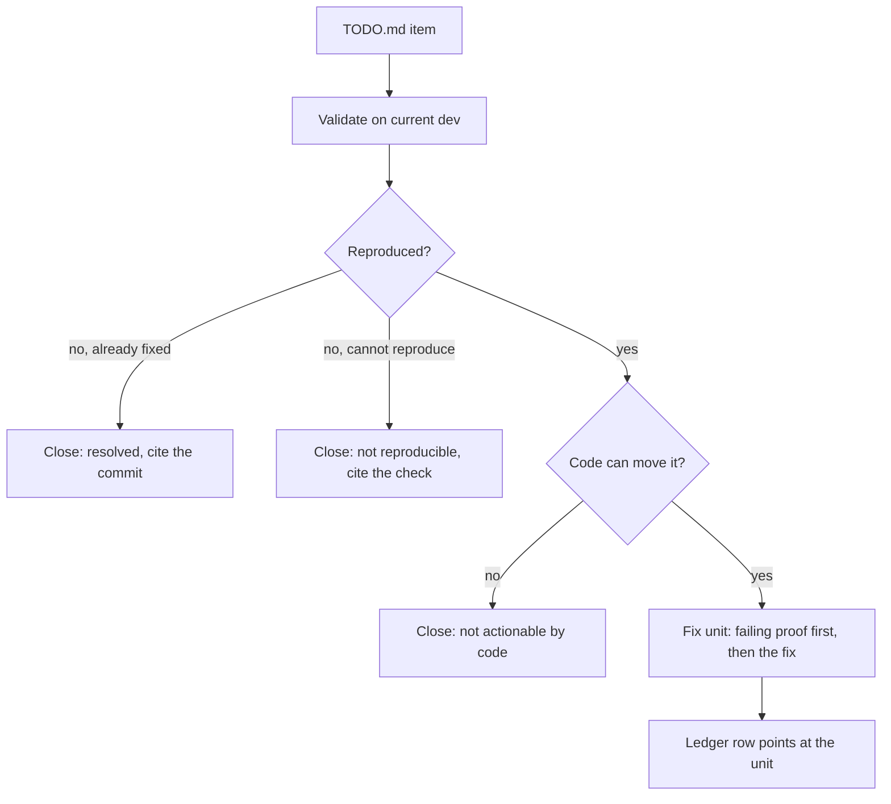
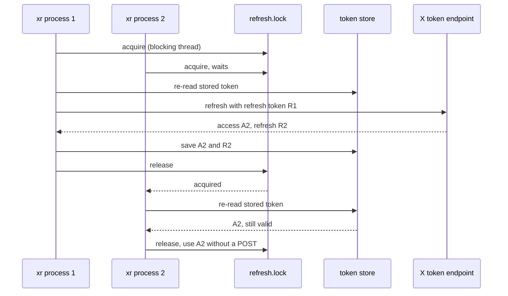
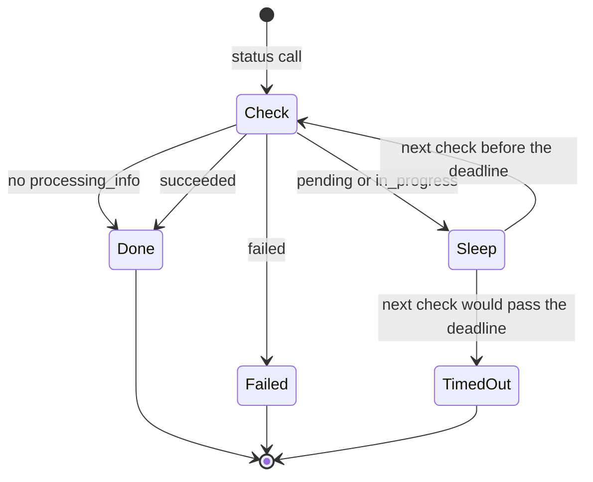
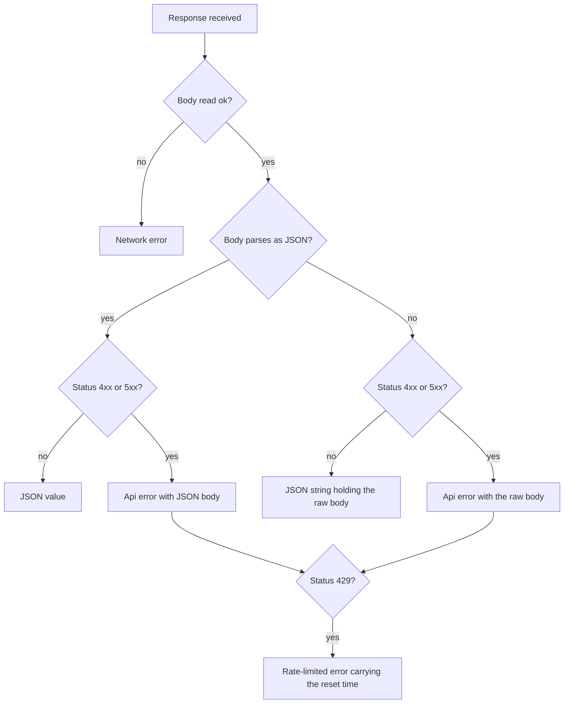
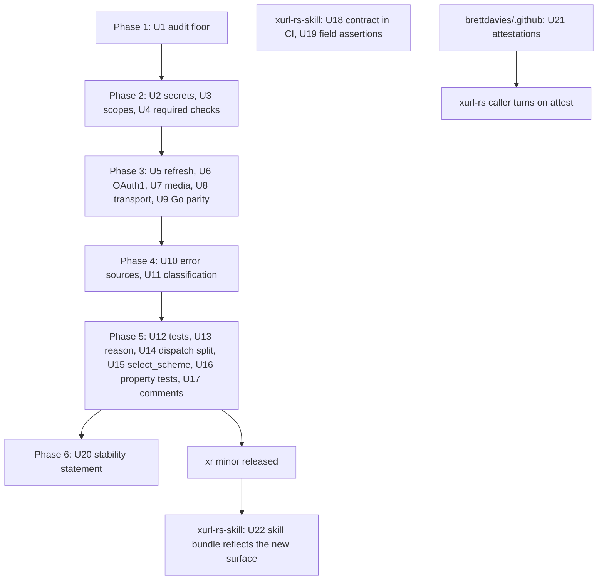

# Public Review Follow-ups - Plan

**Target repos:** brettdavies/xurl-rs (every unprefixed path), brettdavies/xurl-rs-skill (paths prefixed
`xurl-rs-skill:`), and brettdavies/.github (paths prefixed `dot-github:`), which holds the reusable release workflows
every Rust repo calls.

---

## Goal Capsule

- **Objective:** A developer deciding whether to depend on `xr` or `xdk-rs`, re-running the 2026-10-01 public review
  against the repos, finds no defect to cite: every finding is either fixed with a test that proves it or closed with
  the evidence recorded.
- **Means:** validate each item against current `dev`, triage it on that evidence, and fix what triage keeps (KTD1),
  across xurl-rs, xurl-rs-skill, and the shared release workflows.
- **Authority:** Requirements outrank Key Technical Decisions, which outrank unit text. `AGENTS.md` § "Where a change
  goes" decides which crate a change lands in; `RELEASES.md` § Versioning decides each crate's bump.
- **Stop conditions:**
  - Stop and ask before any change that alters the CLI contract outside the planned `xr` minor or the planned `xdk-rs`
    0.2.0.
  - Stop and ask when settling an item would take more than two live X API calls.
  - Stop and ask when an item turns out to need a product decision this plan does not record.
- **Execution profile:** one stacked PR series per repo, cut from `dev`; no subagents or worktrees; long jobs run in the
  background; live X API calls only where a unit names one.
- **Who finishes:** the executing agent opens and verifies every PR. Brett merges every PR, applies the rulesets, and
  cuts the `xr` minor and `xdk-rs` 0.2.0 releases through `RELEASES.md`.

---

## Product Contract

### Summary

Every item in the local TODO.md, which lists the findings of the 2026-10-01 outside-agent review, goes through
validation, triage, and a fix. Twenty-two items are confirmed against current `dev` and get fixed. One, outside
validation of the project, is not actionable by code and is closed with its reason recorded. The fixes ship as an `xr`
minor and an `xdk-rs` 0.2.0, plus changes in xurl-rs-skill's CI and in the shared release workflows.

### Problem Frame

On 2026-10-01, outside agents reviewed the public repos using only public GitHub data and anc.dev. They found that `xr`
failed a MUST in the agent-native standard it advertises, and they reported correctness gaps, library API weaknesses,
thin tests, and trust signals a consumer looks for. To anyone evaluating the project, those read as an unfinished tool.

The findings were recorded as claims, some verified and some not, with line numbers against a `main` commit that has
since moved. Re-checking them against current `dev` changed the picture:

- **Resolved:** the MUST failure is gone, and the audit now scores 98%.
- **Wider than reported:** every credential flag is argv-only, not just `--client-secret`.
- **Worse than reported:** `media status --wait` on an image polls the paid API forever.
- **Confirmed by test vector:** the OAuth1 encoding defect is provable against X's own published signature example.

The work therefore starts from evidence rather than from the review's text.

### Requirements

**Validation and triage**

- R1. Every TODO.md item carries a triage outcome (fix, close as resolved or not reproducible, or not actionable by
  code) backed by evidence against current `dev`, recorded in the triage ledger.
- R2. Every fixed item ships with a test or CI gate that fails against the code before its fix.

**Agent-native contract**

- R3. The agent-native audit's score floor in CI equals the score `dev` achieves, and every remaining non-passing row is
  fixed or recorded with its reason.
- R4. Every credential `xr` accepts can be supplied without appearing in the process's argv, from a file or stdin, while
  the existing flags keep working.
- R5. The agent-native audit and an MSRV check are required status checks on `dev` and `main`.

**Correctness**

- R6. Two `xr` processes that refresh the same OAuth2 login at once spend its refresh token once, and the second uses
  the token the first saved.
- R7. OAuth1 requests sign their parameters with RFC 5849 encoding, so a query or body value containing a space, `+`,
  `~`, or `*` verifies at X.
- R8. Waiting on media processing always ends: a status with no processing information counts as finished, and an
  overall deadline bounds the wait.
- R9. The Go differential suite runs in CI against a pinned Go `xurl`, and fails there when that binary is missing
  instead of passing silently.
- R10. A user can sign in with a narrower OAuth2 scope set, and the default stays the full set.
- R11. The transport never reports a failure as success: a body that fails to read is an error, a non-JSON success body
  reaches the caller intact, a non-JSON error body reaches the error message, and a rate-limited error says when to
  retry.

**Library API (`xdk-rs`)**

- R12. Every `xdk::Error` that wraps a lower-level failure exposes it through `std::error::Error::source`.
- R13. A malformed URL classifies as `InvalidUrl`, not as a network error.
- R14. YAML failures in the token store classify as token-store errors, not JSON errors.

**Test depth and code shape**

- R15. Every agentic test proves the behavior its name claims, not only that clap parsed a flag.
- R16. The error envelope's `reason` is a typed closed set, and its JSON output does not change.
- R17. `run_subcommand` and `select_scheme` are split so neither needs a size lint allow, with behavior unchanged.
- R18. Property tests cover the OAuth1 signature base string, envelope serialization, and the token store's round trip.
- R19. No code comment cites a non-public plan, todo, or plan unit.

**Skill harness (xurl-rs-skill)**

- R20. CI runs `tests/contract.sh` against a pinned `xr` release.
- R21. The contract harness asserts on parsed JSON fields, not on substrings of pretty-printed output.

**Release trust**

- R22. The READMEs state what is stable in the CLI and in the library, and how breaking changes reach a release.
- R23. Release archives carry build-provenance attestations and an SBOM, produced by the shared release workflows.

### Key Decisions

- **Every item goes through validation and triage, and everything triage keeps is fixed in this plan.**
  (session-settled: user-directed, chosen over excluding the non-code signals and deferring release provenance to a
  fleet plan: the request is to validate, triage, and fix all items deemed needing attention.) Governs R1, R22, R23.
- **An item needs work only once reproduced against current `dev`.** (session-settled: user-approved, chosen over
  accepting a reviewer's report at face value: unverified claims had already drifted from the code.) Governs R1, R2.
- **Where a fix would change what existing users or embedders get, today's behavior stays the default.**
  (session-settled: user-approved, chosen over narrowing defaults directly: existing scripts and sign-ins keep working.)
  Governs R4, R10, R11.
- **The library breaks ship together as one `xdk-rs` 0.2.0.** (session-settled: user-approved, chosen over one break per
  change: embedders absorb a single migration.) Governs R12, R13, R14.
- **The Go suite is enforced in CI against a pinned Go `xurl`.** (session-settled: user-approved, chosen over marking it
  ignored with a manual recipe: parity becomes a checked claim.) Governs R9.
- **Fixes land where the code lives.** (session-settled: user-approved, chosen over keeping all work in xurl-rs: the
  harness lives in xurl-rs-skill and provenance belongs in the shared workflows.) Governs R20, R21, R23.

### Scope Boundaries

- **Not actionable by code:** stars, outside reviews, third-party issues, and download counts. The item is closed in the
  triage ledger with that reason.
- **Considered and not built:**
  - A fuzzing harness. Property tests reach the same parsers without a nightly toolchain. A crash found in the field
    would change the call.
  - Automatic retry on rate limits by default. It stays opt-in under the Key Decisions above.
  - A hidden-input interactive prompt for secrets. File and stdin input covers agents and humans alike. Demand from
    interactive users would change the call.
  - Reading two secrets from stdin in one invocation. Stdin carries one value; a second secret takes a file.

#### Deferred to Follow-Up Work

- Cutting the `xr` minor and `xdk-rs` 0.2.0 releases, which follow `RELEASES.md` once these PRs merge.
- Turning on attestations in each other Rust repo's release caller (bird, agentnative-cli), one input per repo once U21
  lands.

### Open Questions

- **Major-version cadence (non-blocking).** The review counted three `xr` majors between 2026-06-05 and 2026-09-18. U20
  documents the existing versioning policy. Committing to a cadence, such as batching breaking changes into at most one
  major per quarter, is a product decision for Brett. U20 adds the line once it is decided.

---

## Planning Contract

### Triage Ledger

Evidence was gathered against `dev` at `71b2eb5` on 2026-10-05. Each fix unit re-checks its item on current `dev` before
changing code (KTD1).

| Item                                          | Evidence on `dev`                                                                                                                                                                                                 | Outcome                        | Reqs    | Unit    |
| --------------------------------------------- | ----------------------------------------------------------------------------------------------------------------------------------------------------------------------------------------------------------------- | ------------------------------ | ------- | ------- |
| T1 `p2-must-json-errors` MUST exempted        | Exemption removed by #270; CI audit scores 98% with no MUST failure; `ANC_SCORE_FLOOR` still 94; the released 4.2.1 shows `warn` on `p2-must-output-flag`, `p6-may-standard-names`, `p6-should-consistent-naming` | Fix (floor and remaining rows) | R3      | U1      |
| T2 Flag-only client secret                    | `--client-secret`, `--consumer-secret`, `--access-token`, `--token-secret`, `--bearer-token` are argv-only in `crates/xurl-cli/src/cli/mod.rs`                                                                    | Fix (wider than reported)      | R4      | U2      |
| T3 Cross-process refresh race                 | `refresh_oauth2_token` in `crates/xdk/src/auth/oauth2.rs` reads the in-memory token, POSTs the refresh unlocked, and locks only to save                                                                           | Fix                            | R6      | U5      |
| T4 OAuth1 encoding not RFC 5849               | `encode` in `crates/xdk/src/auth/oauth1.rs` uses `form_urlencoded`; X's published example encodes a space as `%2520` where `xr` produces `%252B`                                                                  | Fix                            | R7, R18 | U6      |
| T5 Media poll has no deadline                 | `wait_for_media_processing` in `crates/xdk/src/api/media.rs` loops with no cap, and an empty state polls every second forever                                                                                     | Fix (worse than reported)      | R8      | U7      |
| T6 Go suite passes silently                   | `crates/xurl-cli/tests/conformance_runner.rs` returns early when Go `xurl` is missing; no workflow sets `XURL_ORIGINAL_BIN`; 33 of 36 cases are offline                                                           | Fix                            | R9      | U9      |
| T7 Every sign-in requests 24 scopes           | `get_oauth2_scopes` requests 24, including `dm.write` and `users.email`; no scope flag                                                                                                                            | Fix                            | R10     | U3      |
| T8 Transport swallows errors, no 429 handling | `crates/xdk/src/api/request/transport.rs` maps a failed body read to empty and non-JSON bodies to `{}`; 429 classifies as `rate-limited` but the envelope carries no retry time                                   | Fix                            | R11     | U8      |
| T9 Agent-native audit not required            | Absent from `.github/rulesets/protect-dev.json` and `protect-main.json`                                                                                                                                           | Fix                            | R5      | U4      |
| T10 Errors drop their cause chain             | Every `xdk::Error` variant wraps a `String`; no `#[source]` in `crates/xdk/src/error.rs`                                                                                                                          | Fix (breaking)                 | R12     | U10     |
| T11 Malformed URL exits as network error      | `impl From<url::ParseError>` maps to `Error::Http`; inside `xr`, a malformed raw-mode URL with a valid scheme fails in the HTTP client and OAuth1 signing maps it to `Auth("InvalidURL")`                         | Fix (wider than reported)      | R13     | U11     |
| T12 Agentic tests only prove clap parsing     | `test_timeout_flag_accepted`, `test_no_color_env_respected`, and the quiet-flag tests in `crates/xurl-cli/tests/agentic_tests.rs` only run `--help`                                                               | Fix                            | R15     | U12     |
| T13 YAML errors labelled JSON                 | `save_to_file` in `crates/xdk/src/store/mod.rs` maps `serde_yaml` errors to `Error::Json`                                                                                                                         | Fix                            | R14     | U11     |
| T14 Envelope `reason` is a `String`           | `ErrorBody::reason` in `crates/xurl-cli/src/cli/envelope.rs`                                                                                                                                                      | Fix                            | R16     | U13     |
| T15 `contract.sh` not in CI                   | `xurl-rs-skill:.github/workflows/ci.yml` runs `tests/run.sh` and the core-env guard only                                                                                                                          | Fix                            | R20     | U18     |
| T16 Contract greps pretty JSON                | `check` in `xurl-rs-skill:tests/contract.sh` matches with `grep -qF`                                                                                                                                              | Fix                            | R21     | U19     |
| T17 `run_subcommand` ~670 lines               | 664 lines under `#[allow(clippy::too_many_lines, clippy::too_many_arguments)]`                                                                                                                                    | Fix                            | R17     | U14     |
| T18 `select_scheme` sprawl                    | 147 lines in `crates/xdk/src/api/request/auth_header.rs`, building `AuthMismatch` in several places                                                                                                               | Fix                            | R17     | U15     |
| T19 No property tests, no MSRV job            | No proptest or fuzz dependency; MSRV checked only by `scripts/hooks/pre-push`; the reusable CI has no MSRV job                                                                                                    | Fix                            | R5, R18 | U4, U16 |
| T20 Comments cite non-public plans            | Test comments cite "the U9 plan", "the library-CLI-entrypoint plan", and "plan U8 deferred"                                                                                                                       | Fix                            | R19     | U17     |
| T21 No outside validation                     | Stars, reviews, and downloads are signals no change in these repos moves                                                                                                                                          | Not actionable by code         | R1      | none    |
| T22 Major-version churn                       | Tags `v2.0.0` (2026-06-05), `v3.0.0` (2026-09-02), `v4.0.0` (2026-09-18)                                                                                                                                          | Fix (documentation)            | R22     | U20     |
| T23 No release provenance                     | No attestation, SBOM, or signing in `dot-github:.github/workflows/rust-release.yml`                                                                                                                               | Fix                            | R23     | U21     |

### Key Technical Decisions

- KTD1. **Each fix unit starts from a failing proof on current `dev`.** The ledger's evidence is a snapshot; a unit
  first writes the test or gate that fails on `dev`, then fixes. When `dev` already passes, the unit records the item as
  resolved and stops. This makes R2 the unit's first commit rather than an afterthought.
- KTD2. **Secrets come from `--<flag>-file PATH`, where `PATH` of `-` reads stdin.** Each secret flag in R4 gains a file
  twin, mutually exclusive with the plain flag, and a second `-` in one invocation is a usage error. The twin follows
  the existing `--auth-url -` precedent in the OAuth2 headless flow, keeps the value out of argv and shell history, and
  lets an agent pipe it. Identifiers (`--client-id`, `--consumer-key`) are not secrets and gain no twin.
- KTD3. **A dedicated refresh lock serializes refreshers across processes.** The refresh path takes an OS lock on a
  second sidecar, `<store>.refresh.lock`, acquired on a blocking thread and held across the token POST. Under it, the
  path re-reads the stored token from disk, returns it when another process already refreshed it, and otherwise
  refreshes and saves. The store's existing sidecar lock tracks reentrancy per thread, so holding it across an `.await`
  that can move tasks between threads would corrupt its bookkeeping. An optimistic alternative, retrying after
  `invalid_grant` by re-reading the store, still leaves a window and needs a sleep, so it was rejected. Reversing the
  choice touches one function, so no bake-off was warranted.
- KTD4. **OAuth1 signing uses an RFC 3986 unreserved-set encoder.** The signature base string and the `Authorization`
  header parameters use an encoder that leaves only `A-Z a-z 0-9 - . _ ~` bare and emits uppercase `%XX`. X's published
  signature example is the acceptance vector. The change diverges from Go `xurl`, which shares the `url.QueryEscape`
  behavior, so `KNOWN_DIFFERENCES.md` records it.
- KTD5. **Media waiting gets a library deadline and a CLI flag.** A status with no `processing_info` counts as finished,
  and the wait ends with a distinct error once a deadline passes. The deadline is a library parameter defaulting to 60
  seconds, which caps a stuck job at about 60 paid status calls and returns inside a default agent tool-call budget. The
  CLI exposes it through one `--wait[=<SECS>]` flag on `media upload` and `media status`: bare `--wait` or `--wait=true`
  waits up to the default, `--wait=N` up to N seconds, `--wait=0` or `--wait=false` not at all. Upload waits by default;
  status does not. The timeout becomes the new `reason` `processing-timeout` in the closed set, an additive change. Its
  envelope carries `media_id` and a `resume-wait` `next_step` whose `command` resumes the wait on that id with twice the
  expired deadline.
- KTD6. **The transport keeps every byte it received.** A failed body read becomes a network error. A non-JSON success
  body reaches the caller as a JSON string, which raw mode prints as text and a typed call fails to deserialize. A
  non-JSON error body becomes the `Api` error's body. A rate-limited error carries the reset time from that 429
  response's own `x-rate-limit-reset` header, never the window the client remembers from other calls, and the envelope
  carries it as two top-level keys, `retry_after_secs` (delay-seconds, the primary value, as HTTP's `Retry-After` and
  the IETF RateLimit draft use) and `retry_at` (RFC 3339 UTC, for an agent that schedules rather than sleeps), with
  `next_step {action: "wait-and-retry", docs}` naming the instruction and X's rate-limit page. With no parseable reset
  header, the envelope carries neither key and no `next_step`, and the retry flag does not retry. Opt-in retry is the
  global `--wait-on-rate-limit` (env `XURL_WAIT_ON_RATE_LIMIT`), which waits until the reset and retries once when the
  wait fits `--rate-limit-max-wait <SECS>` (env `XURL_RATE_LIMIT_MAX_WAIT`, default 60 s, inside a default agent
  tool-call budget). The three request paths in `transport.rs` share one header assembler.
- KTD7. **Scopes come from `--scopes` on `xr auth oauth2`.** The flag takes a comma-separated subset of the known set
  and rejects unknown names by listing the valid ones. `offline.access` is always added, because a login without a
  refresh token expires within hours. The library takes the scope set as an input to building the authorize URL, with
  the full set as its default.
- KTD8. **Error causes ride on new fields, not new variants.** Each variant that wraps a lower-level failure gains a
  boxed `source` field marked `#[source]`. `Display`, `kind()`, `exit_code()`, and `next_action()` stay identical, so
  the CLI's output does not move. The variant shapes change, which is the 0.2.0 break, and a before/after snippet goes
  in the `## Changelog (xdk-rs)` block of the PR body.
- KTD9. **The `reason` closed set becomes an enum in the CLI crate.** A `Reason` enum with kebab-case serialization
  replaces the `String`. The library's `kind()` strings map into it in one exhaustive function. Unchanged golden
  fixtures and committed schemas prove the wire did not move. The CLI crate's library target is not a published API, so
  no semver gate applies.
- KTD10. **`run_subcommand` splits by command group.** The groups follow `AGENTS.md` § Command grammar: each
  subcommand-family noun (`auth`, `media`, `usage`, `broadcasts`, `skill`, `schema`, `completions`) gets its own
  dispatch function in a sibling module, the top-level core-domain verbs group by the resource they act on (posts,
  engagement, the social graph, reads, DMs), and the remaining tooling commands (`validate`, `examples`, `version`)
  share one. `family_help.rs` declares only two families, `broadcasts moderators` and `media subtitles`, so it cannot
  drive a split of the forty-odd commands the function dispatches. The lint allows come off, and the golden and dry-run
  fixtures are the behavior proof. No fixture is re-blessed.
- KTD11. **The Go parity job installs Go `xurl` at a pinned commit.** An inline job in `ci.yml` runs `go install` for a
  SHA-pinned `xdevplatform/xurl` and sets `XURL_ORIGINAL_BIN`. When `XURL_ORIGINAL_BIN` is set and names no executable,
  the runner fails instead of skipping; unset, it skips as it does today. `CI=true` cannot be the trigger: the shared
  reusable workflow's test job runs the same test target with a plain `cargo test`, and GitHub sets `CI=true` there with
  no Go binary. The three live-API cases stay skipped, so the job spends nothing.
- KTD12. **The MSRV check is an inline CI job.** It reads `rust-version` from the workspace `Cargo.toml` and runs `cargo
  check --workspace --all-features` on that toolchain. It mirrors the pre-push step, and both rulesets require it.
- KTD13. **Property tests use `proptest` as a dev-dependency of both crates.** The envelope lives in the CLI crate and
  the signer and store in the library, so each crate's tests need it. `cargo deny` already allows its MIT/Apache-2.0
  licenses. Cases stay bounded so the default suite's runtime barely moves.
- KTD14. **Attestations are opt-in in the shared release workflow.** `dot-github:.github/workflows/rust-release.yml`
  gains an `attest` input, default `false`. When it is on, the workflow attests every archive and `sha256sum.txt` with
  SHA-pinned `actions/attest-build-provenance`, generates a CycloneDX SBOM, and attests it with `actions/attest-sbom`. A
  caller that turns it on grants `id-token: write` and `attestations: write`. A default-on input would fail every caller
  that lacks those permissions, so the default stays off. The xurl-rs caller turns it on in this plan.
- KTD15. **Each repo's work ships as one stacked PR series.** The xurl-rs stack runs in phase order (High-Level
  Technical Design). It lands with one atomic `gh stack merge` so restacks do not re-run CI quadratically. xurl-rs-skill
  and brettdavies/.github each get their own short series.
- KTD16. **Every surface this plan adds reaches the skill bundle after the `xr` release ships.** Agents learn `xr` from
  xurl-rs-skill, so the new credential-file flags, `--scopes`, `--wait[=<SECS>]`, `--wait-on-rate-limit`,
  `--rate-limit-max-wait`, the `processing-timeout` `reason`, the `retry_after_secs` and `retry_at` keys, and the
  `wait-and-retry` action are documented there (U22). The skill PR lands after the `xr` minor publishes, because a skill
  that names a flag the installed `xr` lacks sends an agent's first command to failure, as
  `docs/solutions/architecture-patterns/prose-reference-is-a-release-dependency.md` records.

### System-Wide Impact

- **Agents reading the envelope** gain the `processing-timeout` `reason` with its `media_id` key and `resume-wait`
  action (U7) and the `retry_after_secs` and `retry_at` keys with the `wait-and-retry` action (U8). Both are additive;
  the documented contract already tells consumers to treat an unknown `reason` as their default branch.
- **Scripts reading raw-mode output** see a non-JSON success body as text where `dev` printed `{}` (U8), and a malformed
  URL exit as `invalid-url` where `dev` reported a network or auth error (U11). Both are returns to the documented
  contract, filed under Fixed.
- **Embedders of `xdk-rs`** absorb the variant-shape changes (U10, U11) and the new media-wait and scope parameters (U3,
  U7) in one 0.2.0.
- **The token store's directory** gains a `<store>.refresh.lock` sidecar beside the existing `<store>.lock` (U5).
- **Every xurl-rs PR** waits on three more required checks: the audit, MSRV, and Go parity (U4, U9).
- **Other Rust repos** calling the shared release workflow see no change until they turn on `attest` (U21).
- **Agents using the skill bundle** see the new surface only after U22, which follows the `xr` release.

### Risks & Dependencies

- **A required check that never reports blocks every merge.** U4 confirms the audit, MSRV, and parity jobs report on
  every PR, including docs-only ones, before Brett applies the rulesets.
- **The refresh lock is as strong as the filesystem's locking.** On an NFS or SMB mount that ignores `flock`, two hosts
  can still race, the same limit `crates/xdk/src/store/atomic.rs` documents for store writes. Cross-host locking is
  considered and not built: one user's store on a network mount is rare, and a report of the race there would change the
  call.
- **The Go `xurl` pin depends on Go's module proxy.** If the pinned commit stops resolving, the parity job fails visibly
  rather than passing, which is the outcome R9 wants.
- **Attestation needs caller permissions.** The `attest` input stays off by default (KTD14), so a caller without
  `id-token: write` and `attestations: write` keeps working.
- **The OAuth1 fix rests on X's published vector.** One live call in U6 confirms X accepts the corrected signature; if
  it does not, U6 stops and reports before merging.
- **Live API spend is one call.** No other unit touches the live API; the mock serves every other scenario.

### High-Level Technical Design

Each item moves through the same three steps; the ledger above records where each one landed.



The refresh path under KTD3 serializes two processes holding the same expired login:



Media waiting under KTD5 always reaches a terminal state:



The transport under KTD6 classifies every response without discarding bytes:



The xurl-rs stack lands in phases; xurl-rs-skill and the shared workflows run in parallel with it:



---

## Implementation Units

| U-ID | Title                                          | Key files                                                                          | Depends on                       |
| ---- | ---------------------------------------------- | ---------------------------------------------------------------------------------- | -------------------------------- |
| U1   | Audit floor and remaining rows                 | `.github/workflows/ci.yml`                                                         | none                             |
| U2   | Credentials from a file or stdin               | `crates/xurl-cli/src/cli/mod.rs`, `crates/xurl-cli/src/cli/commands/auth/`         | U1                               |
| U3   | Narrower OAuth2 scopes on request              | `crates/xdk/src/auth/oauth2.rs`, `crates/xurl-cli/src/cli/commands/auth/signin.rs` | U1                               |
| U4   | Agent-native audit and MSRV as required checks | `.github/workflows/ci.yml`, `.github/rulesets/`                                    | U1                               |
| U5   | One refresh across processes                   | `crates/xdk/src/auth/oauth2.rs`, `crates/xdk/src/store/lock.rs`                    | U4                               |
| U6   | RFC 5849 OAuth1 encoding                       | `crates/xdk/src/auth/oauth1.rs`, `KNOWN_DIFFERENCES.md`                            | U4                               |
| U7   | Bounded media wait                             | `crates/xdk/src/api/media.rs`, `crates/xurl-cli/src/cli/mod.rs`                    | U4                               |
| U8   | Transport keeps failures and retry timing      | `crates/xdk/src/api/request/transport.rs`, `crates/xurl-cli/src/cli/output/`       | U4                               |
| U9   | Go parity suite in CI                          | `crates/xurl-cli/tests/conformance_runner.rs`, `.github/workflows/ci.yml`          | U4                               |
| U10  | Error sources                                  | `crates/xdk/src/error.rs`                                                          | U8                               |
| U11  | URL and YAML classification                    | `crates/xdk/src/error.rs`, `crates/xdk/src/store/mod.rs`                           | U10                              |
| U12  | Agentic tests prove behavior                   | `crates/xurl-cli/tests/agentic_tests.rs`                                           | U11                              |
| U13  | Typed `reason`                                 | `crates/xurl-cli/src/cli/envelope.rs`                                              | U7, U8                           |
| U14  | Dispatch split by family                       | `crates/xurl-cli/src/cli/commands/mod.rs`                                          | U13                              |
| U15  | One `AuthMismatch` builder                     | `crates/xdk/src/api/request/auth_header.rs`                                        | U11                              |
| U16  | Property tests                                 | `crates/xdk/tests/property_tests.rs`                                               | U6, U13                          |
| U17  | Comments cite only public sources              | `crates/`, `scripts/`                                                              | U14                              |
| U18  | Contract harness in CI                         | `xurl-rs-skill:.github/workflows/ci.yml`                                           | none                             |
| U19  | Contract assertions read fields                | `xurl-rs-skill:tests/contract.sh`                                                  | U18                              |
| U20  | Stability statement                            | `README.md`, `crates/xurl-cli/README.md`, `crates/xdk/README.md`                   | U11                              |
| U21  | Release provenance and SBOM                    | `dot-github:.github/workflows/rust-release.yml`, `.github/workflows/release.yml`   | none                             |
| U22  | Skill bundle reflects the new surface          | `xurl-rs-skill:references/agent-flags.md`, `xurl-rs-skill:templates/`              | U2, U3, U7, U8, the `xr` release |

### U1. Audit floor and remaining rows

**Goal:** CI's agent-native score floor matches what `dev` achieves, and every non-passing audit row is fixed or
recorded.

**Requirements:** R1, R3

**Dependencies:** none

**Files:**

- Modify: `.github/workflows/ci.yml` (`ANC_SCORE_FLOOR`)
- Modify: whichever CLI source a fixable row points at, found from the audit's JSON
- Test: `crates/xurl-cli/tests/agentic_tests.rs` for any row fixed in code

**Approach:**

1. Run `anc audit --command target/release/xr --output json` on a `dev` release build and list each row that is not
   `pass`.
2. Fix rows whose cause is in `xr`, such as a naming inconsistency or an `--output` gap.
3. Record the reason for each row that stays `warn` or `skip`, in the CI comment block above the floor.
4. Raise `ANC_SCORE_FLOOR` to the resulting score.

**Patterns to follow:** the existing audit job and its comment block in `.github/workflows/ci.yml`.

**Test scenarios:**

- A row fixed in code: an agentic test drives the behavior the audit checks and asserts the passing shape.
- CI on the branch reports a score at or above the new floor with no MUST failure.

**Verification:** the audit job passes at the raised floor, and every non-passing row has a fix or a recorded reason.

### U2. Credentials from a file or stdin

**Goal:** Every secret `xr` accepts can be passed without appearing in argv.

**Requirements:** R4 (KTD2)

**Dependencies:** U1

**Files:**

- Modify: `crates/xurl-cli/src/cli/mod.rs` (the `auth apps add`, `auth apps update`, `auth oauth1`, and `auth app`
  arguments)
- Modify: `crates/xurl-cli/src/cli/commands/auth/apps.rs`, `crates/xurl-cli/src/cli/commands/auth/signin.rs`
- Modify: `crates/xurl-cli/src/cli/hints.rs` (the `register-app` `next_step` template)
- Modify: `crates/xurl-cli/tests/golden/` help fixtures for the changed commands, and the fixtures that pin the
  `register-app` template
- Modify: `crates/xurl-cli/README.md` (the quick start and the auth examples)
- Modify: `crates/xurl-cli/src/cli/commands/examples.rs` (the auth examples at lines 33 and 161) and its golden fixture,
  re-blessed as a named content move
- Test: `crates/xurl-cli/tests/cli_tests.rs`, `crates/xurl-cli/tests/store_tests.rs`

**Approach:**

1. Add `--client-secret-file`, `--consumer-secret-file`, `--access-token-file`, `--token-secret-file`, and
   `--bearer-token-file`, each conflicting with its plain twin.
2. Resolve each into the same value the handlers already consume, so storage code does not change.
3. Read `-` from stdin, and reject a second `-` in one invocation with a usage error that names both flags. When the
   path is `-` and stdin is a terminal, exit `invalid-args` at once, naming the flag and the fix: pipe the secret in or
   pass a file path.
4. Lead each command's `after_help` with the vault pipe, for example `op read op://<vault>/<item>/client_secret | xr
   auth apps add my-app --client-id <id> --client-secret-file -`, and lead the `crates/xurl-cli/README.md` quick start
   with the same command.
5. Regenerate the completions.
6. Change the `register-app` `next_step` template in `crates/xurl-cli/src/cli/hints.rs` to `<secret-command> | xr auth
   apps add <name> --client-id <client-id> --client-secret-file -`, re-bless the fixtures that pin it, and update the
   envelope example in `crates/xurl-cli/README.md`.
7. Change the auth examples in `crates/xurl-cli/src/cli/commands/examples.rs` to the vault pipe and `--<secret>-file -`
   forms, and re-bless the `xr examples` golden fixture.

**Execution note:** start with a failing test that stores a secret through the file form.

**Patterns to follow:** the `--auth-url -` stdin read in `crates/xurl-cli/src/cli/commands/auth/signin.rs`.

**Test scenarios:**

- `auth apps add --client-secret-file <tmpfile>` stores the file's contents, trimmed of one trailing line ending (`\n`
  or `\r\n`, since a Windows editor writes the latter), and the secret appears nowhere in argv.
- `auth apps add --client-secret-file -` with the secret piped on stdin stores it.
- `auth oauth1 --consumer-secret-file - --token-secret-file -` exits with the usage `reason` and names both flags.
- Passing both `--client-secret` and `--client-secret-file` exits with the usage `reason`.
- `auth apps add --client-secret-file -` with stdin attached to a terminal exits `invalid-args` without reading, naming
  the flag and telling the caller to pipe the secret or pass a path.
- A missing file exits with the I/O `reason` and names the path.
- The plain `--client-secret` flag keeps working unchanged.

**Verification:** each secret flag has a file twin, the help fixtures show the file form first, and anc's
secret-handling check passes.

### U3. Narrower OAuth2 scopes on request

**Goal:** A user can sign in with only the scopes a task needs.

**Requirements:** R10 (KTD7)

**Dependencies:** U1

**Files:**

- Modify: `crates/xdk/src/auth/oauth2.rs` (the scope set as an input to the authorize URL)
- Modify: `crates/xurl-cli/src/cli/mod.rs`, `crates/xurl-cli/src/cli/commands/auth/signin.rs`
- Test: `crates/xdk/tests/auth_tests.rs`, `crates/xurl-cli/tests/oauth2_flow_tests.rs`

**Approach:**

1. Make the library's authorize-URL builder take a scope set, defaulting to the full list `get_oauth2_scopes` returns.
2. Add `--scopes` to `xr auth oauth2` and its headless steps, so step 1 and step 2 agree.
3. Always include `offline.access`.
4. Reject unknown scope names before any network call, listing the valid set.

**Patterns to follow:** the existing headless two-step state in `crates/xdk/src/auth/pending.rs`, which must carry the
chosen scopes from step 1 to step 2.

**Test scenarios:**

- `--scopes tweet.read,users.read` builds an authorize URL whose `scope` is exactly those plus `offline.access`.
- No `--scopes` builds the URL with all 24 scopes, matching today's URL.
- `--scopes tweet.reed` exits with the validation `reason` and lists the valid scope names.
- The headless flow's step 2 reuses the step-1 scope set from the pending state.

**Verification:** the default authorize URL is unchanged, and a narrowed sign-in requests only the named scopes plus
`offline.access`.

### U4. Agent-native audit and MSRV as required checks

**Goal:** Neither the audit nor the MSRV can go red without blocking a merge.

**Requirements:** R5 (KTD12)

**Dependencies:** U1

**Files:**

- Modify: `.github/workflows/ci.yml` (a new MSRV job)
- Modify: `.github/rulesets/protect-dev.json`, `.github/rulesets/protect-main.json`
- Modify: `RELEASES.md` § Branch protection (the required-check list)

**Approach:**

1. Add the MSRV job.
2. Confirm the audit job reports on every PR, so a required check can never wait on a skipped job.
3. Add both check contexts to both rulesets.
4. After merge, Brett applies the rulesets with the `gh api` commands in `RELEASES.md` § Branch protection.

**Patterns to follow:** the inline `Features (native-tls only)` job and its required-check entry.

**Test expectation:** none -- CI configuration. The proof is the two checks reporting on this unit's own PR and
appearing in the applied rulesets.

**Verification:** both checks run on the PR, and both appear in `gh api repos/brettdavies/xurl-rs/rulesets/<id>` after
Brett applies the rulesets.

### U5. One refresh across processes

**Goal:** Concurrent `xr` processes spend a refresh token once.

**Requirements:** R6 (KTD3)

**Dependencies:** U4

**Files:**

- Modify: `crates/xdk/src/auth/oauth2.rs` (`refresh_oauth2_token`)
- Modify: `crates/xdk/src/store/lock.rs` (a refresh-lock helper beside the store lock)
- Test: `crates/xdk/tests/auth_tests.rs`

**Approach:**

1. Acquire the refresh sidecar lock on a blocking thread and hold the returned file handle across the POST.
2. Under the lock, reload the stored login from disk. Return it when it is no longer expired.
3. Otherwise refresh and save through the existing save path, which takes the store lock on its own.
4. Release on drop, including on every error path.

**Execution note:** write the two-handle test first. It must fail on `dev` by showing two refresh POSTs.

**Patterns to follow:** `StoreLock` in `crates/xdk/src/store/lock.rs` for the sidecar naming and the Windows lock
semantics; the wiremock token endpoint in `crates/xdk/tests/async_context_tests.rs`, which already counts refresh POSTs.
The `testing` mock serves no token endpoint.

**Test scenarios:**

- Two `Auth` values on one store path refresh the same expired login concurrently against a mock token endpoint: the
  endpoint sees one refresh, and both callers return the same new access token.
- The refresh lock is held while the token POST is in flight, observed by a second acquire that does not complete until
  the first releases.
- A refresh POST that fails releases the lock, and the next caller can refresh.
- A login that is not expired returns at once without touching the refresh lock.

**Verification:** the concurrent test passes and fails with the lock removed, and the existing auth suite passes.

### U6. RFC 5849 OAuth1 encoding

**Goal:** OAuth1 requests with a space, `+`, `~`, or `*` in a parameter verify at X.

**Requirements:** R7 (KTD4)

**Dependencies:** U4

**Files:**

- Modify: `crates/xdk/src/auth/oauth1.rs` (`encode`)
- Modify: `KNOWN_DIFFERENCES.md`
- Test: `crates/xdk/tests/oauth1_tests.rs`

**Approach:**

1. Replace the `form_urlencoded` encoder with the unreserved-set encoder, for the base string, the signing key, and the
   header parameters.
2. Keep `encode` public: the CLI and tests call it.
3. Record the divergence from Go `xurl` in `KNOWN_DIFFERENCES.md`.
4. Spend one live call to confirm: an OAuth1 `xr search` whose query contains a space returns 200.

**Execution note:** start from X's published example as a failing test. On `dev` it produces a different signature.

**Patterns to follow:** `build_oauth1_header_with_nonce_ts`, which already takes a fixed nonce and timestamp for
deterministic tests.

**Test scenarios:**

- X's "Creating a signature" example, copied from
  <https://docs.x.com/resources/fundamentals/authentication/oauth-1-0a/creating-a-signature>: its method, URL,
  parameters, consumer secret, token secret, nonce, and timestamp produce the page's published `oauth_signature`.
- The same example's parameter string encodes the `status` value with `%2520` for spaces and `%252B` for the literal
  `+`.
- `encode("~")` returns `~`, `encode("*")` returns `%2A`, and `encode(" ")` returns `%20`.
- A request URL with no query and no extra parameters signs exactly as it does today.

**Verification:** the published-example test passes, and the one live OAuth1 search with a space returns 200.

### U7. Bounded media wait

**Goal:** Waiting on media processing always ends.

**Requirements:** R8 (KTD5)

**Dependencies:** U4

**Files:**

- Modify: `crates/xdk/src/api/media.rs` (`wait_for_media_processing` and its two public callers)
- Modify: `crates/xdk/src/error.rs` (the timeout classification)
- Modify: `crates/xurl-cli/src/cli/mod.rs` (`--wait[=<SECS>]` on `media upload` and `media status`)
- Modify: `crates/xurl-cli/src/cli/envelope.rs`, `schema/output.schema.json` (the `processing-timeout` `reason` and the
  `media_id` key)
- Modify: `crates/xdk/src/error.rs` (`NextAction::ResumeWait`), `crates/xurl-cli/src/cli/hints.rs` (the `resume-wait`
  `next_step`), `AGENTS.md` (the action list agents branch on)
- Test: `crates/xdk/tests/media_upload_tests.rs`, `crates/xurl-cli/tests/media_upload_tests.rs`

**Approach:**

1. Return the current status at once when `processing_info` is absent.
2. Track elapsed time against the deadline before each sleep, and stop with the timeout error once the next check would
   pass it. The default is 60 s for the library parameter and bare `--wait`. The deadline's doc comment says X sets no
   processing cap and keeps a media id valid for 24 hours, so `xr media status <id> --wait=<secs>` resumes a longer job.
3. Add the `processing-timeout` `reason`, exiting 1 (`EXIT_GENERAL_ERROR`) as `api-error` does (`network-error` exits
   5), and regenerate the schemas and completions. Correct the `EXIT_NETWORK_ERROR` doc comment
   (`crates/xdk/src/error.rs:576-578`), which says a transport failure exits 1 while `exit_code()` maps `Error::Http`
   and `Error::Io` to 5.
4. Put `media_id` on the `processing-timeout` envelope, and give it `next_step {action: "resume-wait", command: "xr
   media status <media_id> --wait=<twice the expired deadline>"}`, adding `NextAction::ResumeWait` to xdk-rs's
   non-exhaustive `NextAction` and the action to the list in `AGENTS.md`.
5. Replace `media upload`'s `--wait` switch, and give `media status`, one `--wait[=<SECS|true|false>]` flag shaped like
   `-v, --verbose[=<VERBOSE>]`: bare or `true` waits up to the default, `N` up to N seconds, `0` or `false` not at all,
   so Go `xurl`'s `--wait=false` keeps working. List the value forms in each help page, change the example that shows
   `--wait false` to `--wait=false`, and make `--wait 60` with a space exit `invalid-args` pointing at `--wait=60`.

**Execution note:** start with a failing test that a status without `processing_info` returns instead of polling.

**Patterns to follow:** the wiremock media stubs in `crates/xdk/tests/media_upload_tests.rs`.

**Test scenarios:**

- `media status --wait` on media whose status carries no `processing_info` returns after one status call.
- A mock that reports `in_progress` with `check_after_secs: 1` and `--wait=2` ends with the `processing-timeout`
  `reason` after at most three status calls; the envelope carries the `media_id` and a `resume-wait` `next_step` whose
  `command` is `xr media status <that id> --wait=4`.
- A `succeeded` status ends the wait successfully, as today.
- `media upload <file> --wait=false` and `--wait=0` each return after FINALIZE without a status call.
- `xr media status <id> --wait 60` with a space exits `invalid-args`, and its message points at `--wait=60`.
- `xr media status <id> --wait` waits up to the default, and `--wait=true` does the same.
- A `failed` status still ends with the existing processing-failed error, distinct from the timeout.

**Verification:** no wait path can loop without bound, and the timeout reports a `reason` distinct from processing
failure.

### U8. Transport keeps failures and retry timing

**Goal:** No transport failure reads as success, and a rate-limited caller knows when to retry.

**Requirements:** R11 (KTD6)

**Dependencies:** U4

**Files:**

- Modify: `crates/xdk/src/api/request/transport.rs`
- Modify: `crates/xdk/src/error.rs` (the reset time on the rate-limited error)
- Modify: `crates/xurl-cli/tests/golden/` help fixtures, which every global flag reaches (68 of 121 carry the global
  `--timeout` today)
- Modify: `crates/xurl-cli/src/cli/output/` and `crates/xurl-cli/src/cli/envelope.rs` (the `retry_after_secs` and
  `retry_at` keys, and `--wait-on-rate-limit` with `--rate-limit-max-wait`)
- Modify: `crates/xdk/src/error.rs` (`NextAction::WaitAndRetry`), `crates/xurl-cli/src/cli/hints.rs` (the
  `wait-and-retry` `next_step`), `AGENTS.md` (the action and the two keys it pairs with)
- Modify: `crates/xurl-cli/tests/golden/reason-rate-limited.golden`, when its stub carries a reset header
- Test: `crates/xdk/tests/api_tests.rs`, `crates/xurl-cli/tests/cli_tests.rs`

**Approach:**

1. Map a failed body read to a network error.
2. Return a non-JSON success body as a JSON string, and carry a non-JSON error body into the `Api` error.
3. Read that 429 response's own `x-rate-limit-reset` onto the rate-limited error, not `Client::last_rate_limit`, and put
   `retry_after_secs` and `retry_at` (RFC 3339 UTC, from the header's epoch) on the envelope, with `next_step {action:
   "wait-and-retry", docs}` from the library's existing `RATE_LIMIT_DOCS`, and the human message stating both times. Add
   `NextAction::WaitAndRetry` to xdk-rs's non-exhaustive `NextAction` and the action to `AGENTS.md`. With no parseable
   header, omit both keys and the `next_step`, and do not retry.
4. Add the global `--wait-on-rate-limit` and `--rate-limit-max-wait <SECS>`, each with its `XURL_` env var; the ceiling
   defaults to 60 s. Re-bless the help fixtures they reach.
5. Fold the three request paths' header assembly into one helper.
6. Regenerate the output schema.

**Execution note:** start with failing wiremock tests for the swallowed cases, stubbed inside the test files below.

**Patterns to follow:** `RateLimit::from_headers` in `crates/xdk/src/api/request/mod.rs` for parsing one response's
headers; the closed-set rules in `AGENTS.md` § Output formats.

**Test scenarios:**

- A mock returning 200 with `text/plain` body `ok` gives raw mode output `ok`, where `dev` prints `{}`.
- A mock returning 500 with an HTML body gives an `Api` error whose message contains that body.
- A mock returning 429 with `x-rate-limit-reset` 30 seconds ahead gives the `rate-limited` envelope with
  `retry_after_secs` near 30, `retry_at` equal to the header's epoch in RFC 3339 UTC, and `next_step.action`
  `wait-and-retry` carrying the rate-limit docs URL.
- With `--wait-on-rate-limit` and a reset 1 second ahead, the CLI retries once and succeeds against a mock that answers
  200 on the second call.
- With `--wait-on-rate-limit` and a reset beyond `--rate-limit-max-wait`, the CLI fails at once with the `rate-limited`
  envelope.
- A 429 with no `x-rate-limit-reset`, after an earlier response that carried one, gives the `rate-limited` envelope
  without `retry_after_secs`, `retry_at` or a `next_step`, and with `--wait-on-rate-limit` the CLI fails at once without
  a second request.
- The default, without the flag, never retries.

**Verification:** each swallowed case now surfaces, the envelope addition shows in the regenerated schema, and existing
envelope keys are unchanged.

### U9. Go parity suite in CI

**Goal:** Go-parity claims are checked on every PR.

**Requirements:** R9 (KTD11)

**Dependencies:** U4

**Files:**

- Modify: `crates/xurl-cli/tests/conformance_runner.rs` (fail when `XURL_ORIGINAL_BIN` names a missing binary)
- Modify: `.github/workflows/ci.yml` (the parity job)
- Modify: `.github/rulesets/protect-dev.json`, `.github/rulesets/protect-main.json`

**Approach:**

1. Install Go `xurl` at a pinned SHA in the new job and point `XURL_ORIGINAL_BIN` at it.
2. When `XURL_ORIGINAL_BIN` is set and names no executable, make the runner fail, naming the variable and the path.
   Leave the unset case skipping, because the reusable workflow's test job runs this target with `CI=true` and no Go
   binary (KTD11).
3. Read the runner's path from `XURL_ORIGINAL_BIN` alone, dropping the hard-coded Homebrew path.
4. Add the job to the rulesets alongside U4's checks.

**Patterns to follow:** SHA-pinned installs elsewhere in `.github/workflows/ci.yml`.

**Test scenarios:**

- The parity job runs all offline cases against the pinned Go `xurl` and passes on the branch.
- With `XURL_ORIGINAL_BIN` pointing at a missing path, the runner fails with a message naming the variable and the path.
- With `XURL_ORIGINAL_BIN` unset, the runner skips with its existing message, which keeps the reusable workflow's test
  job green.

**Verification:** the parity job reports on the PR, and a deliberately broken parity case turns it red.

### U10. Error sources

**Goal:** Embedders can walk an `xdk::Error` to its underlying cause.

**Requirements:** R12 (KTD8)

**Dependencies:** U8

**Files:**

- Modify: `crates/xdk/src/error.rs`
- Modify: every `crates/xdk/src/` construction site of the changed variants
- Modify: `crates/xurl-cli/src/cli/output/`, wherever the CLI matches on the changed variants
- Test: `crates/xdk/tests/error_tests.rs`

**Approach:**

1. Give `Http`, `Io`, `Json`, `Auth`, and `TokenStore` a boxed optional source alongside the message.
2. Set the source wherever a lower-level error is converted, including the `From` impls.
3. Keep `Display`, `kind()`, `exit_code()`, `next_action()`, and `docs_url()` identical.
4. Put the before/after snippet in the PR's `## Changelog (xdk-rs)` block.

**Patterns to follow:** the boxed `AuthMethodMismatch` payload, which keeps `Error` small.

**Test scenarios:**

- An I/O failure converted into `xdk::Error` returns the original `std::io::Error` from `source()`, and it downcasts to
  `std::io::ErrorKind::NotFound`.
- A `reqwest` failure converted into `Error::Http` exposes the `reqwest::Error` through `source()`.
- `Display` output for each changed variant matches its `dev` output.
- `kind()` and `exit_code()` for each variant are unchanged.

**Verification:** the public-API gate reports the variant changes as breaking, the release type is 0.2.0, and CLI golden
fixtures do not move.

### U11. URL and YAML classification

**Goal:** A bad URL and a broken store each report what actually went wrong.

**Requirements:** R13, R14

**Dependencies:** U10

**Files:**

- Modify: `crates/xdk/src/api/request/url.rs` (full parse of a raw-mode URL before the request)
- Modify: `crates/xdk/src/auth/oauth1.rs` (its two URL parse errors)
- Modify: `crates/xdk/src/error.rs` (`impl From<url::ParseError>`)
- Modify: `crates/xdk/src/store/mod.rs`, `crates/xdk/src/store/migration.rs` (the `serde_yaml` mappings)
- Test: `crates/xdk/tests/error_tests.rs`, `crates/xurl-cli/tests/cli_tests.rs`, `crates/xurl-cli/tests/store_tests.rs`

**Approach:**

1. Parse a raw-mode URL fully where its scheme is already validated, so a malformed URL stops as `InvalidUrl` before any
   request is built.
2. Map the OAuth1 signer's URL parse errors to `InvalidUrl`, not `Auth`.
3. Map `url::ParseError` to `InvalidUrl` in the `From` impl, carrying the source per KTD8.
4. Map `serde_yaml` failures to `TokenStore`.
5. Note the exit-code change for a bad URL in the `## Changelog (xurl-rs)` block under Fixed. A return to the documented
   contract is a patch-level change per `RELEASES.md` § Versioning.

**Execution note:** first record what `dev` reports for each malformed-URL case, since the observed `reason` differs by
path.

**Test scenarios:**

- `xr 'http://[bad'` exits with the `invalid-url` `reason` and its exit code, and no request reaches the mock.
- The same URL with `--auth oauth1` exits with `invalid-url`, not `auth-required`.
- A `url::ParseError` converted into `xdk::Error` is `InvalidUrl`, and its `source()` is the `url::ParseError`.
- A store whose YAML cannot serialize reports the `token-store` `reason`.

**Verification:** every malformed-URL path in the library and the CLI reports `invalid-url`, both classifications hold
in tests, and the envelope matches the schema.

### U12. Agentic tests prove behavior

**Goal:** Every agentic test checks the behavior its name claims.

**Requirements:** R15

**Dependencies:** U11

**Files:**

- Modify: `crates/xurl-cli/tests/agentic_tests.rs`

**Approach:**

1. Classify each test that only runs `--help`. Keep tests that genuinely assert help content. Replace the others with a
   behavior assertion, or delete them where another test already proves the behavior.
2. Prove `--timeout` against a wiremock stub whose response delay is longer than the timeout.

**Test scenarios:**

- `--timeout 1` against a mock that delays 3 seconds exits with the `network-error` `reason` in under 3 seconds.
- `-q` suppresses the informational stderr line a command otherwise prints.
- `NO_COLOR=1` with a command that colors output prints no escape sequences. Where
  `test_no_color_env_overrides_color_always` already proves this, the help-only test is removed.

**Verification:** no test in the file runs `--help` unless it asserts help content.

### U13. Typed `reason`

**Goal:** The closed set of `reason` values is enforced by the type system.

**Requirements:** R16 (KTD9)

**Dependencies:** U7, U8

**Files:**

- Modify: `crates/xurl-cli/src/cli/envelope.rs`, `crates/xurl-cli/src/cli/output/mod.rs`
- Test: `crates/xurl-cli/tests/schema_tests.rs`, `crates/xurl-cli/tests/golden_tests.rs`

**Approach:**

1. Add the `Reason` enum, covering every value in the documented set plus the additions from U7 and U8.
2. Map the library's `kind()` strings into it in one exhaustive function.
3. Keep the JSON schema identical: the field keeps a string schema (`#[schemars(with = "String")]`) and its doc comment,
   because a closed `enum` in the schema would make an older schema reject a `reason` a newer release adds.

**Test scenarios:**

- Every `reason` value listed on `ErrorBody` round-trips through the enum with its kebab-case spelling.
- Golden fixtures and committed schemas are unchanged without re-blessing.
- A library `kind()` value with no mapping fails a test that iterates every `Error` kind.

**Verification:** `schema_tests` and `golden_tests` pass with no fixture change.

### U14. Dispatch split by family

**Goal:** Command dispatch reads per command group, with no size lint allow.

**Requirements:** R17 (KTD10)

**Dependencies:** U13

**Files:**

- Modify: `crates/xurl-cli/src/cli/commands/mod.rs`
- Create: per-group dispatch modules beside it, one per group KTD10 names
- Test: the existing golden and dry-run suites

**Approach:**

1. Move each group's arms into its own function and module.
2. Pass shared context as one struct where it shortens the group signatures. `run_subcommand` takes seven parameters and
   clippy's `too_many_arguments` fires above seven, so that allow comes off with or without the struct.
3. Take the lint allows off.

**Test expectation:** behavior-preserving refactor. The proof is the existing golden, dry-run, and CLI suites passing
unchanged, with no fixture re-blessed.

**Verification:** clippy passes with the allows removed; `cargo clippy -p xurl-rs --all-targets -- -W
clippy::too_many_lines` names no dispatch function, where on `dev` it names `run_subcommand` (the failing-first proof);
and no golden fixture moves. The size lint is off in this workspace, so removing its allow proves nothing about size on
its own.

### U15. One `AuthMismatch` builder

**Goal:** `select_scheme` constructs a mismatch in one place.

**Requirements:** R17

**Dependencies:** U11

**Files:**

- Modify: `crates/xdk/src/api/request/auth_header.rs`
- Test: `crates/xdk/tests/auth_tests.rs`

**Approach:**

1. Extract the mismatch construction into one helper that every rejection path calls.
2. Split the remaining selection steps until `cargo clippy -p xdk-rs --all-targets -- -W clippy::too_many_lines` no
   longer names `select_scheme`. It carries no allow today only because the lint is off; at 147 lines it is past the
   lint's 100-line threshold.

**Test expectation:** behavior-preserving refactor. The existing `auth-method-mismatch` tests, with all three mismatch
shapes, are the proof.

**Verification:** each of the three mismatch shapes produces the same envelope as on `dev`, and the `too_many_lines`
check in step 2 passes where it fails on `dev`.

### U16. Property tests

**Goal:** The parsers and serializers reviewers named hold for generated inputs.

**Requirements:** R18 (KTD13)

**Dependencies:** U6, U13

**Files:**

- Modify: `crates/xdk/Cargo.toml`, `crates/xurl-cli/Cargo.toml` (`proptest` dev-dependency)
- Modify: `crates/xdk/src/auth/oauth1.rs` (the base-string property, in its test module, because the base string is
  built inside the private `generate_signature`)
- Create: `crates/xdk/tests/property_tests.rs` (the encoder and store properties)
- Create: `crates/xurl-cli/tests/envelope_property_tests.rs`

**Test scenarios:**

- For any parameter map of printable strings, the OAuth1 base string decodes back to the same pairs.
- For any parameter map, the encoder leaves exactly the RFC 3986 unreserved characters bare.
- For any generated `ErrorBody`, serializing then deserializing returns an equal value. The existing drift guard in
  `crates/xurl-cli/tests/schema_tests.rs` already ties the committed schema to the type, so the property needs no JSON
  Schema validator dependency.
- For any generated set of apps and tokens, saving to a temp store path and loading returns equal data.

**Verification:** the property suites pass within the default test run, and `cargo deny check` passes with the new
dependency.

### U17. Comments cite only public sources

**Goal:** No comment points a reader at something they cannot open.

**Requirements:** R19

**Dependencies:** U14

**Files:**

- Modify: comments the scan finds under `crates/` and `scripts/`, starting with `crates/xurl-cli/tests/cli_tests.rs` and
  `crates/xurl-cli/tests/output_writer_tests.rs`
- Create: `crates/xurl-cli/tests/comment_citation_guard.rs`, following `crates/xdk/tests/path_literal_guard.rs`

**Approach:** run the `/code-comments` scan over the tree. Rewrite each comment that cites a plan, todo, or unit ID to
state the reason directly, or remove it when it only restates the code. Then add the guard: it scans comments under
`crates/` and `scripts/` for a plan unit ID, a plan cited by name, or `TODO.md`, and it fails on `dev`'s citations
before the rewrite.

**Test expectation:** the guard, which fails on `dev` and passes after the rewrite (KTD1, R2).

**Verification:** the scan reports no citation of non-public material, and the guard passes.

### U18. Contract harness in CI

**Goal:** The skill's contract checks run on every xurl-rs-skill PR.

**Requirements:** R20

**Dependencies:** none

**Files:**

- Modify: `xurl-rs-skill:.github/workflows/ci.yml`
- Modify: `xurl-rs-skill:tests/fetch-xr.sh`, if the pinned release needs checksum verification
- Modify: `xurl-rs-skill:.github/rulesets/`, if present, to require the job

**Approach:**

1. Add a job that fetches the pinned `xr` release with `tests/fetch-xr.sh` and runs `tests/contract.sh` against the
   bundled `tests/stub-api.py`.
2. Make the job required.

**Test expectation:** none -- CI configuration. The proof is the job running all contract checks green on its own PR,
and turning red when a check is broken on purpose.

**Verification:** the job reports on the PR with the full check count.

### U19. Contract assertions read fields

**Goal:** Contract checks fail on wrong data, not on formatting.

**Requirements:** R21

**Dependencies:** U18

**Files:**

- Modify: `xurl-rs-skill:tests/contract.sh`

**Approach:** give `check` a JSON mode that takes a jaq path and an expected value. Convert each assertion over JSON
output to it, and keep substring checks only for text output.

**Test scenarios:**

- A check on `.reason` passes when the value matches, whatever the key order or indentation.
- The same check fails when the value differs but the old substring would still have matched elsewhere in the output.
- Text-output checks behave as before.

**Verification:** every check over JSON output reads a field, and the suite passes in U18's job.

### U20. Stability statement

**Goal:** A consumer can see what is stable and how breaks arrive before depending on either crate.

**Requirements:** R22

**Dependencies:** U11

**Files:**

- Modify: `README.md`, `crates/xurl-cli/README.md`, `crates/xdk/README.md`
- Test: a README test beside `crates/xdk/tests/readme_landing_tests.rs`

**Approach:**

1. Add a short Stability section to each README.
2. Name what is contract in each crate, per `RELEASES.md` § Versioning.
3. State how breaks are batched and announced, with migration snippets.
4. Add the cadence line once the Open Question is answered.

**Test expectation:** a README test asserting each of the three READMEs carries the Stability section. It fails on `dev`
(KTD1, R2), and `crates/xdk/tests/readme_landing_tests.rs` keeps passing.

**Verification:** each README carries the section, and the statements match `RELEASES.md` § Versioning.

### U21. Release provenance and SBOM

**Goal:** A user can verify where an `xr` release archive came from.

**Requirements:** R23 (KTD14)

**Dependencies:** none

**Files:**

- Modify: `dot-github:.github/workflows/rust-release.yml`
- Modify: `.github/workflows/release.yml` (turn on `attest` and grant its permissions)
- Modify: `RELEASES-POSTFLIGHT.md` (a verification item)
- Modify: `crates/xurl-cli/README.md` (the install section's verification command)

**Approach:**

1. Add the `attest` input and the attestation and SBOM steps to the reusable workflow, with SHA-pinned actions.
2. Turn it on in xurl-rs's caller.
3. Add a postflight item that runs `gh attestation verify <archive> --repo brettdavies/xurl-rs --signer-workflow
   brettdavies/.github/.github/workflows/rust-release.yml` on one archive of a release. The reusable workflow is the
   signer, so `--repo` alone fails.
4. Put the same command in the install section of `crates/xurl-cli/README.md`, so a user who downloads an archive can
   check it.

**Patterns to follow:** existing optional inputs in the reusable, such as `linux_musl_required`, for the input shape.

**Test expectation:** none -- release workflow configuration. Neither `release.yml` nor the reusable has a dispatch
trigger or a dry-run mode, so `actionlint` is the pre-merge gate, and the proof is `gh attestation verify` on the next
real release's archive, which fails on every release before it.

**Verification:** a caller without the input behaves as today, and xurl-rs's next release archive verifies with the step
3 command, `--signer-workflow` included.

### U22. Skill bundle reflects the new surface

**Goal:** An agent following the skill bundle uses the new flags and handles the `processing-timeout` `reason`, the
`retry_after_secs` and `retry_at` keys, and the `wait-and-retry` action.

**Requirements:** R4, R8, R10, R11 (KTD16)

**Dependencies:** U2, U3, U7, U8, and the published `xr` minor that carries them

**Files:**

- Modify: `xurl-rs-skill:references/agent-flags.md`, `xurl-rs-skill:SKILL.md`
- Modify: `xurl-rs-skill:templates/oauth2-setup.md`, `xurl-rs-skill:templates/media-upload.md`
- Modify: `xurl-rs-skill:evals/eval-04-rate-limited-recovery.md`
- Test: `xurl-rs-skill:tests/contract.sh`

**Approach:**

1. Lead every credential example with the vault pipe (`op read op://<vault>/<item>/<field> | xr … --<secret>-file -`),
   starting with step 1 of `templates/oauth2-setup.md`. Replace the "`--wait` takes no value" row in
   `templates/media-upload.md` with the `--wait[=<SECS>]` forms, and `--wait=false` for upload-then-poll.
2. Document `--scopes`, `--wait[=<SECS>]`, `--wait-on-rate-limit`, and `--rate-limit-max-wait` where their commands
   appear.
3. Teach the rate-limited recovery eval to branch on the `wait-and-retry` action and read `retry_after_secs` (or
   `retry_at` when it schedules) instead of guessing a wait.
4. Add contract checks against the released `xr` for each new flag, the `processing-timeout` `reason`, and its
   `resume-wait` `next_step`.
5. Pin the harness's `xr` to that release.

**Test scenarios:**

- A contract check passes a secret through `--client-secret-file -` and asserts it was stored.
- A contract check reads `retry_after_secs`, `retry_at` and the `wait-and-retry` action from a stubbed 429 response.
- A contract check sees the `processing-timeout` `reason` from a stubbed media status that never finishes, and runs the
  `resume-wait` command it carries.

**Verification:** the skill bundle names every flag U2, U3, U7, and U8 add, and its contract job passes against the
released `xr`.

---

## Verification Contract

| Gate               | Command or check                                                                         | Applies to                   |
| ------------------ | ---------------------------------------------------------------------------------------- | ---------------------------- |
| Format             | `cargo fmt --check`                                                                      | every xurl-rs unit           |
| Lint               | `cargo clippy --workspace --all-targets -- -D warnings`                                  | every xurl-rs unit           |
| Tests              | `cargo test --workspace`                                                                 | every xurl-rs unit           |
| Local CI mirror    | `scripts/hooks/pre-push`                                                                 | every xurl-rs PR before push |
| Public API gate    | `scripts/release/preflight.sh api-contract` (`cargo semver-checks` on `xdk-rs`)          | U3, U5, U7, U8, U10, U11     |
| Schemas            | `scripts/generate-response-schemas.sh`, then `crates/xurl-cli/tests/schema_tests.rs`     | U7, U8, U11, U13             |
| Completions        | `scripts/generate-completions.sh`; CI's freshness gate                                   | U2, U3, U7, U8               |
| Golden fixtures    | `crates/xurl-cli/tests/golden_tests.rs`, re-blessed only where a unit says content moved | U2, U3, U7, U8               |
| Agent-native audit | CI audit job at the raised floor                                                         | every xurl-rs PR after U1    |
| Supply chain       | `cargo deny check`                                                                       | U16                          |
| Skill harness      | `bash tests/run.sh` and `bash tests/contract.sh`                                         | U18, U19                     |
| Shared workflows   | `actionlint`                                                                             | U21                          |
| Live API           | at most one OAuth1 search, in U6                                                         | U6                           |

---

## Definition of Done

- Every ledger row has an outcome, and every Fix row's unit is merged, with its failing-first proof in the PR's commit
  history.
- The `xr` changes are additive, or patch-level returns to the documented contract, so the next `xr` release is a minor.
- The `xdk-rs` changes accumulate for one 0.2.0, with a before/after snippet in each breaking PR's `## Changelog
  (xdk-rs)` block.
- No fixture moved unless its unit says the content moved.
- No abandoned-attempt code, debug output, or stray files remain in any diff.
- The local TODO.md marks each item with its outcome and points here; the file stays uncommitted.
- Brett has applied the updated rulesets, and `gh api` shows the audit, MSRV, and parity checks required on `dev` and
  `main`.
- After Brett publishes the `xr` minor, U22's xurl-rs-skill PR pins that release and its contract job passes, and U21's
  `gh attestation verify --signer-workflow brettdavies/.github/.github/workflows/rust-release.yml` passes on one of that
  release's archives.

---

## Eng Review

Target: `docs/plans/2026-10-05-2243-fix-public-review-follow-ups-plan.md` (this file, at `681e23d`), `/plan-eng-review`
on 2026-10-05.

### Scope record

feature answers: none proposed; structure: A (D1, Original arrangement); accepted scope: U1 through U22 as written at
`681e23d`; pending remedies: R1 and every later finding until answered.

### Factual corrections

- U14 step 2: `run_subcommand` takes seven parameters (`crates/xurl-cli/src/cli/commands/mod.rs:367-375`) and clippy's
  `too_many_arguments` fires above seven, so the context struct is optional rather than what removes that allow.
- U13 step 3: the `reason` field keeps `#[schemars(with = "String")]`, because `schema/output.schema.json` describes it
  today as a documented `"type": "string"` and an enum would close a set the contract says a newer release extends.

### Decision ledger

#### R1: how the attestation check names the signer

Finding: C1, P2, confidence 9/10, U21 Approach step 3 and Verification, Definition of Done last bullet, reviewer
plan-eng-review (Claude).

Plan baseline: original proposal. U21's postflight item and the Definition of Done run `gh attestation verify` on one
archive with no signer flag.

Runtime evidence: U21 signs inside `brettdavies/.github`'s reusable `rust-release.yml`, which xurl-rs's
`.github/workflows/release.yml:19` calls. The gh manual states that an attestation generated by a reusable workflow
needs `--signer-workflow` or `--signer-repo`; `--repo` alone checks the signer against the caller repository and fails
(<https://cli.github.com/manual/gh_attestation_verify>). Not probed live: no attested release exists yet.

Comparison grid:

| Choice                                                                 | Current                        | A                                                                          | B                                   | C                |
| ---------------------------------------------------------------------- | ------------------------------ | -------------------------------------------------------------------------- | ----------------------------------- | ---------------- |
| R1 signer flag in U21's postflight item, U21 Verification, and the DoD | none                           | `--signer-workflow brettdavies/.github/.github/workflows/rust-release.yml` | `--signer-repo brettdavies/.github` | none (unchanged) |
| Structure (D1)                                                         | Original arrangement, approved | unchanged                                                                  | unchanged                           | unchanged        |
| Other findings                                                         | pending                        | pending                                                                    | pending                             | pending          |

Question D2:

```text
D2 — How should the attestation check name the signer?
Project/branch/task: xurl-rs dev, eng review of the public review follow-ups plan.
ELI10: U21 makes the shared release workflow sign each archive, and the plan checks the result with `gh attestation verify`. The signing happens inside brettdavies/.github's reusable workflow, and GitHub's CLI rejects that check unless it is told which workflow signed; `--repo brettdavies/xurl-rs` alone fails. As written, the postflight item and the Definition of Done would fail on a correctly attested release.
Stakes if we pick wrong: the first attested release reads as broken at postflight, and anyone copying the command cannot verify an archive.
Recommendation: A because it pins the exact signing workflow, the stricter form GitHub's docs recommend.
Note: options differ in kind, not coverage — no completeness score.
Pros / cons:
A) Pin the workflow (recommended)
  ✅ Fails if anything but the shared release workflow signed the archive, the strict form GitHub recommends
  ✅ One command checks every archive and the SBOM attestation the same reusable workflow produces
  ❌ Renaming or moving rust-release.yml breaks the check until the command is updated (human ~5 min / CC ~1 min)
B) Pin the repo
  ✅ Survives a rename of the reusable workflow file inside brettdavies/.github
  ✅ Still rejects an attestation signed from any repository other than brettdavies/.github
  ❌ Accepts an attestation from any workflow in brettdavies/.github, a weaker check than pinning the file
C) Keep as written
  ✅ No change to U21 or the Definition of Done, and the command stays the shortest form
  ✅ Leaves the flag choice to whoever runs the first attested release
  ❌ Fails on every release signed through the reusable workflow, so postflight goes red on a good release
Net: a strict pin that needs an update on a rename, against a looser pin, against a check that cannot pass.
```

Header: D2 attest verify

Options:

```text
A) Pin the workflow (recommended)
U21's postflight item, U21 Verification, and the DoD run `gh attestation verify <archive> --repo brettdavies/xurl-rs --signer-workflow brettdavies/.github/.github/workflows/rust-release.yml`.
B) Pin the repo
The same three places run `gh attestation verify <archive> --repo brettdavies/xurl-rs --signer-repo brettdavies/.github`.
C) Keep as written
No change: `gh attestation verify` with no signer flag in all three places.
```

```text
State: approved
Actual answer: A) Pin the workflow (recommended), D2 answer in this review
Accepted scope: U21's postflight item (Approach step 3), U21 Verification, and the Definition of Done run `gh attestation verify <archive> --repo brettdavies/xurl-rs --signer-workflow brettdavies/.github/.github/workflows/rust-release.yml`.
History: none
```

#### R2: the exit code the media-wait timeout returns

Finding: A1, P2, confidence 8/10, U7 Approach step 3 ("Add the timeout `reason` and its exit code") and KTD5, reviewer
plan-eng-review (Claude).

Plan baseline: original proposal. U7 adds a new `reason` and "its exit code" without naming the code.

Runtime evidence: the exit-code set is `crates/xdk/src/error.rs:542-580`: 0 success, 1 general, 2 usage and auth
mismatch, 3 rate-limited, 4 not-found, 5 `network-error` and `io` (`Self::Http(_) | Self::Io(_) => EXIT_NETWORK_ERROR`
at line 464, asserted by `crates/xurl-cli/tests/wiring_tests.rs:662`), 77 auth-required. An unclassified API status
(`api-error`) exits 1, with `reason` carrying the precise kind.

Comparison grid:

| Choice                          | Current     | A                                                        | B                                                                                           | C                               |
| ------------------------------- | ----------- | -------------------------------------------------------- | ------------------------------------------------------------------------------------------- | ------------------------------- |
| R2 media-wait timeout exit code | unspecified | 1 (`EXIT_GENERAL_ERROR`); `reason` carries the precision | a new dedicated code, `EXIT_PROCESSING_TIMEOUT = 6`, added to the closed set and documented | unspecified (implementer picks) |
| R1 signer flag                  | approved, A | unchanged                                                | unchanged                                                                                   | unchanged                       |
| Other findings                  | pending     | pending                                                  | pending                                                                                     | pending                         |

Question D3:

```text
D3 — Which exit code does the media-wait timeout return?
Project/branch/task: xurl-rs dev, eng review of the public review follow-ups plan.
ELI10: U7 makes `media status --wait` and `media upload` give up after a deadline instead of polling the paid API forever, with a new `reason` in the error envelope. It also says the timeout gets "its exit code" but never says which. Agents and scripts branch on exit codes, so whatever number lands becomes part of the contract the moment it ships.
Stakes if we pick wrong: a script that treats exit 1 as fatal, or switches on known codes, misreads a timeout that only needed a longer wait.
Recommendation: A because the codes are coarse classes and `reason` already carries the precise kind, as network-error and api-error do today.
Note: options differ in kind, not coverage — no completeness score.
Pros / cons:
A) Exit 1, reason carries it (recommended)
  ✅ No new number in the closed set, so embedders matching on `exit_code()` see nothing new
  ✅ Matches how network-error and api-error already exit 1 with the precise kind in `reason`
  ❌ A script reading only the exit code cannot tell a timeout from other general failures
B) New dedicated code 6
  ✅ A shell script can branch on `$? -eq 6` and retry with a longer `--wait-timeout` without parsing JSON
  ✅ The new constant documents the timeout as its own class beside rate-limited and not-found
  ❌ Grows the closed exit-code set, a contract addition every consumer's switch must learn (human ~30 min / CC ~5 min)
C) Leave it to the implementer
  ✅ No plan change now; the choice moves to U7's PR, where the reviewer sees the code
  ✅ Keeps this review from fixing a number before the reason name exists
  ❌ A contract value gets chosen without a recorded decision, the gap this finding names
Net: keeping the exit-code set small against letting shell scripts branch on the timeout without JSON.
```

Header: D3 timeout exit

Options:

```text
A) Exit 1, reason carries it (recommended)
U7's timeout exits 1 (`EXIT_GENERAL_ERROR`); its new `reason` is the precise signal. U7 Approach step 3 names the code.
B) New dedicated code 6
U7 adds `EXIT_PROCESSING_TIMEOUT = 6` to the closed set in `crates/xdk/src/error.rs`, documents it with the other codes, and the timeout exits 6.
C) Leave it to the implementer
No plan change: U7 keeps "its exit code" unspecified.
```

```text
State: approved
Actual answer: A) Exit 1, reason carries it (recommended), D3 answer in this review
Accepted scope: U7's timeout exits 1 (`EXIT_GENERAL_ERROR`) and its new `reason` is the precise signal; U7 Approach step 3 names the code as `api-error`'s class and corrects the stale `EXIT_NETWORK_ERROR` doc comment.
History: the runtime evidence and D3's option A first said `network-error` exits 1, taken from the `EXIT_NETWORK_ERROR` doc comment (`error.rs:576-578`), which contradicts the code; `network-error` exits 5. Reopened as D11 in the developer-experience review with the facts corrected; D11 answer A kept exit 1 and added the doc-comment fix.
```

#### R3: where the rate-limited reset comes from, and a 429 without one

Finding: A2, P2, confidence 8/10, KTD6 ("A rate-limited error carries the reset time from the `x-rate-limit-reset`
header") and U8 Patterns to follow (`Client::last_rate_limit`), reviewer plan-eng-review (Claude).

Plan baseline: original proposal. The reset rides on the rate-limited error; the case of a 429 with no reset header is
not stated, and U8 points at the client's remembered window as the pattern. Reading the 429's own headers is common work
under the approved R11 ("a rate-limited error says when to retry"), so every option below carries it.

Runtime evidence: `RateLimit::from_headers` (`crates/xdk/src/api/request/mod.rs:195-209`) returns `None` when a response
carries no rate-limit header, and `record_rate_limit` (`:335-343`) then keeps the last window it saw, which may belong
to another endpoint. Whether X ever sends a 429 without `x-rate-limit-reset` is unverified.

Comparison grid:

| Choice                      | Current                                              | A                                                           | B                                                                                                      | C                                                       |
| --------------------------- | ---------------------------------------------------- | ----------------------------------------------------------- | ------------------------------------------------------------------------------------------------------ | ------------------------------------------------------- |
| R3 reset source             | unspecified; pattern names `Client::last_rate_limit` | that 429 response's own headers (common work under R11)     | that 429 response's own headers (common work under R11)                                                | that 429 response's own headers (common work under R11) |
| R3 429 with no reset header | unspecified                                          | envelope omits the retry key; the retry flag does not retry | envelope omits the retry key; the retry flag waits a fixed 60 s, within its ceiling, then retries once | unspecified                                             |
| R1, R2                      | approved                                             | unchanged                                                   | unchanged                                                                                              | unchanged                                               |
| Other findings              | pending                                              | pending                                                     | pending                                                                                                | pending                                                 |

Question D4:

```text
D4 — What does a 429 with no reset header do?
Project/branch/task: xurl-rs dev, eng review of the public review follow-ups plan.
ELI10: U8 puts "when to retry" on the rate-limited error and adds an opt-in flag that waits until that time and retries once. R11 already requires that time to come from the 429 being retried, not from the window the client remembers from other endpoints, so every option reads the response's own `x-rate-limit-reset`. What the plan never says is what happens when that header is missing.
Stakes if we pick wrong: the retry flag spends a paid call after a guessed wait on a 429 that waiting will not clear, or fails where a short wait would have worked.
Recommendation: A because it never guesses: the key and the retry appear only when this 429 said when to come back.
Completeness: A=9/10, B=8/10, C=5/10
Pros / cons:
A) No header, no retry (recommended)
  ✅ The retry time and the retry come only from the response being retried, never from another endpoint's window
  ✅ No extra paid call when X gives no reset, which is often a cap that waiting will not clear
  ❌ A caller who passed the retry flag sees an immediate failure on a header-less 429 (human ~1 h / CC ~10 min)
B) Fixed 60 s fallback
  ✅ The retry flag still does something on a header-less 429, inside its ceiling
  ✅ Uses the response's own headers when present, the same as A
  ❌ Spends a paid call after a guessed wait that may be far too short for a usage cap
C) Leave it unstated
  ✅ Only the reset source changes; U8's implementer settles the rest with the code in front of them
  ✅ The reset still comes from the 429's own headers, so no stale window drives the retry
  ❌ A header-less 429 under the retry flag does whatever the implementer guesses, possibly a paid retry on no basis
Net: never guessing a retry time against keeping the flag useful when X omits the header.
```

Header: D4 no reset header

Options:

```text
A) No header, no retry (recommended)
The reset comes from that 429 response's own headers, never `Client::last_rate_limit`. With no parseable `x-rate-limit-reset`, the envelope omits the retry key and the retry flag fails at once with `rate-limited`. U8 adds a test for that case.
B) Fixed 60 s fallback
The reset comes from that 429 response's own headers. With none, the envelope omits the retry key and the retry flag waits 60 s, within its ceiling, then retries once. U8 adds a test for that case.
C) Leave it unstated
The reset comes from that 429 response's own headers (common work under R11). The header-less case stays unstated.
```

```text
State: approved
Actual answer: A) No header, no retry (recommended), D4 answer in this review
Accepted scope: KTD6 and U8 step 3 read the reset from that 429 response's own headers, never `Client::last_rate_limit`; with no parseable `x-rate-limit-reset` the envelope omits the retry key and the retry flag fails at once with `rate-limited`; U8's pattern points at `RateLimit::from_headers`; U8 adds a test for the header-less 429 after a response that carried one.
History: none
```

#### R4: where the new test responses live

Finding: T1, P2, confidence 9/10, U8 Files ("Modify: `crates/xdk/src/testing/mod.rs` (a 429 route and a non-JSON
route)"), U7 Patterns to follow ("the mock media routes in `crates/xdk/src/testing/mod.rs`"), U12 Files (the same file,
"if a delayed route is needed for `--timeout`"), reviewer plan-eng-review (Claude).

Plan baseline: original proposal. The 429, non-JSON, never-finishing media, and delayed responses are added to the
public `testing` mock.

Runtime evidence: the test files these units name already serve responses with wiremock (`crates/xdk/tests/api_tests.rs`
22 uses, `crates/xurl-cli/tests/cli_tests.rs` 12, both `media_upload_tests.rs` files 2 each) and none uses the `testing`
mock. A test that does must be declared with `required-features = ["testing"]` (`crates/xdk/Cargo.toml:99-101`, as
`mock_endpoint_coverage` is), or `cargo test --workspace` fails to compile it. Prior learning applied:
xurl-mockx-covers-22-of-38-endpoints-and-has-no-test-users (10/10, 2026-09-17). The `testing` mock is published API for
embedders behind its feature.

Comparison grid:

| Choice                                   | Current                                                     | A                                                                    | B                                                                                              |
| ---------------------------------------- | ----------------------------------------------------------- | -------------------------------------------------------------------- | ---------------------------------------------------------------------------------------------- |
| R4 home of U7/U8/U12 test-only responses | the public `testing` mock (`crates/xdk/src/testing/mod.rs`) | wiremock stubs inside each named test file                           | the `testing` mock, with each consuming test target declared `required-features = ["testing"]` |
| U8 Files entry for `testing/mod.rs`      | present                                                     | removed                                                              | kept                                                                                           |
| U7 pattern                               | the `testing` mock's media routes                           | the wiremock media stubs in `crates/xdk/tests/media_upload_tests.rs` | the `testing` mock's media routes                                                              |
| U12 conditional `testing/mod.rs` entry   | present                                                     | removed                                                              | kept                                                                                           |
| R1, R2, R3                               | approved                                                    | unchanged                                                            | unchanged                                                                                      |
| Other findings                           | pending                                                     | pending                                                              | pending                                                                                        |

Question D5:

```text
D5 — Where do the new test responses live?
Project/branch/task: xurl-rs dev, eng review of the public review follow-ups plan.
ELI10: U7, U8 and U12 need fake servers that answer with a 429, a plain-text body, a media job that never finishes, and a slow reply. The plan adds those to the public `testing` mock that embedders use, but every test file the plan names already builds its fake server with wiremock, and none uses that mock. Using the mock from those files also needs a feature gate on each test target, or the default test run fails to compile.
Stakes if we pick wrong: the published mock grows routes that exist only for xr's tests, or the default test run breaks on a missing feature gate.
Recommendation: A because it follows the pattern all of those files already use and leaves the published mock untouched.
Note: options differ in kind, not coverage — no completeness score.
Pros / cons:
A) Wiremock in each test (recommended)
  ✅ Matches the 17 test files that already stub responses with wiremock, so no new gate or setup
  ✅ The published `testing` mock stays a stand-in for X's real endpoints, with no test-only routes
  ❌ Each test file builds its own stub, so a 429 shape appears in more than one place
B) Extend the testing mock
  ✅ One definition of each fake response, reusable by embedders who want to test their own 429 handling
  ✅ Exercises the published mock, so its routes stay honest
  ❌ Every consuming test target needs `required-features = ["testing"]`, and the published mock carries xr-only routes (human ~2 h / CC ~15 min)
Net: following the existing test pattern against one shared, published definition of each fake response.
```

Header: D5 test mocks

Options:

```text
A) Wiremock in each test (recommended)
U7, U8 and U12 build their 429, non-JSON, unfinished-media and delayed responses as wiremock stubs inside the test files they already name. U8 drops `crates/xdk/src/testing/mod.rs` from its Files, U7's pattern points at the wiremock media stubs in `crates/xdk/tests/media_upload_tests.rs`, and U12 drops its conditional `testing/mod.rs` entry.
B) Extend the testing mock
U7, U8 and U12 add their responses to `crates/xdk/src/testing/mod.rs`, and every test target that uses them is declared with `required-features = ["testing"]` in its crate's Cargo.toml.
```

```text
State: approved
Actual answer: A) Wiremock in each test (recommended), D5 answer in this review
Accepted scope: U7, U8 and U12 build their 429, non-JSON, unfinished-media and delayed responses as wiremock stubs inside the test files they already name; U8 drops `crates/xdk/src/testing/mod.rs` from its Files and its execution note names wiremock; U7's pattern points at the wiremock media stubs in `crates/xdk/tests/media_upload_tests.rs`; U12 drops its conditional `testing/mod.rs` entry and proves `--timeout` against a delayed wiremock stub.
History: none
```

#### R5: the default media-wait deadline

Finding: P1, P2, confidence 7/10, KTD5 ("The deadline is a library parameter with a default"), reviewer plan-eng-review
(Claude); raised as an FYI in this plan's document review.

Plan baseline: original proposal. U7 adds a deadline with an unstated default, used by the library and by
`--wait-timeout`.

Runtime evidence: `wait_for_media_processing` (`crates/xdk/src/api/media.rs:261-304`) sleeps
`check_after_secs.unwrap_or(1).max(1)` between status calls, so a stuck job spends up to one paid call per second. X
documents no processing cap and its sample loop polls until a terminal state
(<https://docs.x.com/x-api/media/quickstart/media-upload-chunked>); video runs up to 125 minutes and 16 GB for Premium
accounts (<https://docs.x.com/x-api/media/introduction>); a media id stays usable for 24 hours (`expires_after_secs:
86400`), so `xr media status <id> --wait` can resume after a timeout without a re-upload.

Comparison grid:

| Choice                                                  | Current         | A                                                                                                                       | B         | C                    |
| ------------------------------------------------------- | --------------- | ----------------------------------------------------------------------------------------------------------------------- | --------- | -------------------- |
| R5 default deadline (library and `--wait-timeout`)      | unstated        | 300 s                                                                                                                   | 1800 s    | unstated             |
| Doc comment on the deadline                             | none            | X sets no processing cap; the media id stays valid 24 h, so `xr media status <id> --wait --wait-timeout <secs>` resumes | same as A | none                 |
| Worst-case status calls on a stuck job at the 1 s floor | unbounded today | 300                                                                                                                     | 1800      | implementer's choice |
| R1-R4                                                   | approved        | unchanged                                                                                                               | unchanged | unchanged            |
| Other findings                                          | pending         | pending                                                                                                                 | pending   | pending              |

Question D6:

```text
D6 — What is the default media-wait deadline?
Project/branch/task: xurl-rs dev, eng review of the public review follow-ups plan.
ELI10: U7 ends the endless media poll with a deadline, but never says how long the default is. Every status check is a paid call, at most one a second, so the default caps what a stuck job can spend. X sets no processing limit and accepts videos up to two hours for Premium accounts, so a long video could still be processing when a short default fires; the upload is not lost, though, since the media id stays valid for a day and `xr media status <id> --wait` picks the wait back up.
Stakes if we pick wrong: a long default lets a stuck job spend up to 1,800 paid calls, and a short one makes a huge video's first wait time out and need a second command.
Recommendation: A because it caps a stuck job at about 300 calls, and the rare long video resumes with one command instead of a re-upload.
Note: options differ in kind, not coverage — no completeness score.
Pros / cons:
A) 5-minute default (recommended)
  ✅ A stuck job spends at most about 300 paid status calls before the CLI stops and says so
  ✅ A long video that outlasts it resumes with `xr media status <id> --wait --wait-timeout <secs>`, no re-upload
  ❌ The largest Premium videos may time out on the first wait and need that second command (human ~15 min / CC ~3 min)
B) 30-minute default
  ✅ Nearly every upload X accepts finishes inside the first wait, with no second command
  ✅ Same doc comment and resume path as A for the rare job that outlasts it
  ❌ A stuck job can spend up to about 1,800 paid status calls before the deadline ends it
C) Leave it unstated
  ✅ No plan change; U7's implementer picks the value with the code in front of them
  ✅ Keeps this review from fixing a number X's docs give no basis for
  ❌ The spend cap on a stuck job, the problem T5 exists to fix, gets set without a recorded decision
Net: a tight spend cap with an occasional resume command against fewer resumes and a looser cap.
```

Header: D6 wait default

Options:

```text
A) 5-minute default (recommended)
KTD5 and U7 set the default deadline to 300 s for the library parameter and `--wait-timeout`. Its doc comment says X sets no processing cap and keeps a media id valid for 24 hours, so `xr media status <id> --wait --wait-timeout <secs>` resumes a longer job.
B) 30-minute default
KTD5 and U7 set the default deadline to 1800 s for the library parameter and `--wait-timeout`, with the same doc comment as A.
C) Leave it unstated
No change: KTD5 keeps "a library parameter with a default" without a value.
```

```text
State: approved
Actual answer: A) 5-minute default (recommended), D6 answer in this review
Accepted scope: KTD5 and U7 step 2 set the default deadline to 300 s for the library parameter and `--wait-timeout`; the deadline's doc comment says X sets no processing cap and keeps a media id valid for 24 hours, so `xr media status <id> --wait --wait-timeout <secs>` resumes a longer job.
History: Brett set the default to 60 s during the developer-experience review, after learning that Go `xurl` waits with no deadline and that 300 s came from this review's own recommendation (a community five-minute guideline and the spend cap), not from any convention; 60 s returns inside a default agent tool-call budget and matches the 60 s `--rate-limit-max-wait` default (D10), and the `resume-wait` command covers longer jobs. History: D14 in the developer-experience review folded `--wait-timeout` into one `--wait[=<SECS>]` flag; the default applies to bare `--wait`, and the resume command is `xr media status <id> --wait=<secs>`.
```

Approval readiness: PASS. Structure D1 answer A; R1 (D2 answer A), R2 (D3 answer A), R3 (D4 answer A), R4 (D5 answer A),
R5 (D6 answer A). The two factual corrections change no behavior and need no answer.

### Findings by section

Scope Challenge: scope accepted as-is. C1 (signer flag) resolved as R1.

Architecture:

- `[P2] (confidence: 8/10)` U7 Approach step 3 — the media-wait timeout's exit code was unnamed. Accepted, D3 A: exit 1.
- `[P2] (confidence: 8/10)` KTD6 and U8 — the 429 reset source and the header-less 429 were unstated, and U8 pointed at
  the client's remembered window. Accepted, D4 A.

Code quality: no main-report findings. Two factual corrections recorded above; two items in the appendix.

Tests:

- `[P2] (confidence: 9/10)` U7, U8, U12 — test-only responses aimed at the published `testing` mock. Accepted, D5 A:
  wiremock stubs in the named test files.

Performance:

- `[P2] (confidence: 7/10)` KTD5 — the default deadline was unstated, and it caps paid calls on a stuck job. Accepted,
  D6 A: 300 s, then set to 60 s in the developer-experience review.

Coverage of the planned code paths (every path has a planned test; none runs yet):

```text
CODE PATHS                                              USER FLOWS
[+] U2 secret twins (cli/mod.rs, auth/apps.rs)          [+] Store a secret without argv
  ├── [PLANNED ★★★] file, stdin, both-flags, missing      ├── [PLANNED ★★★] file and `-` stored (cli_tests)
  ├── [PLANNED ★★ ] trailing \n and \r\n trimmed          └── [PLANNED ★★ ] second `-` -> invalid-args
  └── [PLANNED ★★ ] plain flag unchanged
[+] U3 --scopes (oauth2.rs, pending.rs)                 [+] Narrow sign-in
  ├── [PLANNED ★★★] subset + offline.access, unknown     └── [PLANNED ★★ ] headless step 2 reuses scopes
  └── [PLANNED ★★ ] default URL unchanged
[+] U5 refresh lock (oauth2.rs, store/lock.rs)          [+] Two xr processes refresh at once
  ├── [PLANNED ★★★] one POST, both get new token          └── [PLANNED ★★★] wiremock counts token POSTs
  ├── [PLANNED ★★ ] lock held across POST
  ├── [PLANNED ★★ ] failed POST releases
  └── [PLANNED ★★ ] unexpired login skips the lock
[+] U6 RFC 3986 encoder (oauth1.rs)
  ├── [PLANNED ★★★] X published vector
  ├── [PLANNED ★★ ] ~ * space unit cases
  └── [PLANNED ★★★] property: base string round trip (U16)
[+] U7 bounded wait (media.rs)                          [+] media status --wait
  ├── [PLANNED ★★ ] no processing_info -> one call        ├── [PLANNED ★★★] timeout -> reason, exit 1
  ├── [PLANNED ★★★] in_progress past deadline              └── [PLANNED ★★ ] failed stays processing-failed
  └── [PLANNED ★★ ] succeeded unchanged
[+] U8 transport (transport.rs, envelope)               [+] Raw mode and 429 handling
  ├── [PLANNED ★★ ] non-JSON 200 -> text                   ├── [PLANNED ★★★] retry key near reset
  ├── [PLANNED ★★ ] HTML 500 body in message               ├── [PLANNED ★★★] retry once inside ceiling
  ├── [PLANNED ★★ ] failed body read -> network error      ├── [PLANNED ★★ ] reset past ceiling fails at once
  └── [PLANNED ★★★] header-less 429: no key, no retry      └── [PLANNED ★★ ] default never retries
[+] U9 parity runner                                    [+] U10/U11 errors
  ├── [PLANNED ★★ ] set + missing binary fails             ├── [PLANNED ★★★] source() chains, Display unchanged
  └── [PLANNED ★★ ] unset skips                            └── [PLANNED ★★★] invalid-url on raw and OAuth1 paths
[+] U13/U14/U15 refactors: existing golden, dry-run, schema and mismatch suites, plus `-W clippy::too_many_lines`
[+] U17/U20 guards: comment-citation guard and README Stability test, each failing on dev first

COVERAGE: every planned path has a planned test  |  QUALITY: no ★ smoke-only entries  |  GAPS: 0
```

Test Plan artifact: `~/.gstack/projects/brettdavies-xurl-rs/brett-dev-eng-review-test-plan-20261005-233916.md`.

### NOT in scope

- Cross-host refresh locking on a network mount: the Risks entry records it as considered and not built.
- Turning on attestations in bird and agentnative-cli: Deferred to Follow-Up Work, one input per repo after U21.
- A user-facing attestation verification line in the READMEs: R23 asks for attestations on release archives, not
  documentation; left to the developer-experience review that follows this one.
- A shared sidecar-open helper for U5 and `StoreLock`: below the shared-code bar (appendix).

### What already exists

- `StoreLock` (`crates/xdk/src/store/lock.rs`) shows the sidecar naming and the `0o600` open U5's refresh lock copies;
  its per-thread reentrancy is why U5 needs a separate lock.
- `RateLimit::from_headers` (`crates/xdk/src/api/request/mod.rs:195`) already parses one response's rate-limit headers
  into optional fields, which U8 reuses for the 429 (D4).
- Wiremock stubs serve every test file U7, U8 and U12 name (D5).
- The `--auth-url -` stdin read in `crates/xurl-cli/src/cli/commands/auth/signin.rs` is U2's precedent.
- `crates/xdk/tests/path_literal_guard.rs`, `readme_landing_tests.rs`, and the schema drift guard in
  `crates/xurl-cli/tests/schema_tests.rs` are the patterns U17, U20 and U16 follow.
- `commands/auth/`, `media.rs`, `schema.rs`, `skill.rs`, `validate.rs`, `examples.rs` exist; D1 kept U14's new sibling
  dispatch modules beside them.

### Diagrams

The plan's five mermaid diagrams cover triage, the refresh sequence, the media-wait states, the transport
classification, and the stack phases. The 429 path after D4:

```text
429 received
  ├── own x-rate-limit-reset parses? ── no ──> rate-limited envelope, no retry key, no retry
  └── yes ──> envelope carries seconds-until-reset
                ├── retry flag off ─────────────────────> fail with rate-limited
                ├── reset beyond ceiling ───────────────> fail with rate-limited
                └── reset within ceiling ──> wait, retry once ──> success, or the second response as-is
```

### Failure modes

| New path        | Realistic failure                      | Test or handling                                            | User sees                                 |
| --------------- | -------------------------------------- | ----------------------------------------------------------- | ----------------------------------------- |
| U2 secret file  | file missing or unreadable             | `io` reason naming the path (test)                          | clear error                               |
| U3 scopes       | typo in a scope name                   | rejected before any network call, valid names listed (test) | clear error                               |
| U5 refresh lock | store on a mount that ignores `flock`  | documented limit (Risks)                                    | rare double refresh, then `invalid_grant` |
| U6 encoder      | X rejects the corrected signature      | one live call before merge (Risks)                          | caught before release                     |
| U7 wait         | job stuck in progress                  | 60 s deadline, timeout `reason`, exit 1 (test)              | clear error with a resume path            |
| U8 transport    | 429 with no reset header               | no key, no retry (test, D4)                                 | clear `rate-limited` error                |
| U9 parity       | Go module proxy cannot resolve the pin | job fails red (Risks)                                       | visible CI failure                        |
| U21 attest      | verify run without the signer flag     | the documented command carries it (D2)                      | verification passes                       |

Critical gaps: 0.

### Worktree parallelization strategy

Sequential implementation, no parallelization opportunity: the standing rule for this repo runs every unit inline in one
stacked series with no worktrees. The phase order in High-Level Technical Design is the execution order; xurl-rs-skill
(U18, U19) and brettdavies/.github (U21) are separate repos and can run between xurl-rs phases.

### Implementation Tasks

Synthesized from this review's findings. Each task derives from a specific finding above. Run with Claude Code or Codex;
checkbox as you ship.

- [ ] **T1 (P2, human: ~10 min / CC: ~2 min)** — U21 — run verification with `--signer-workflow`
  - Surfaced by: Scope Challenge — C1, R1 (D2)
  - Files: `RELEASES-POSTFLIGHT.md`, `dot-github:.github/workflows/rust-release.yml`
  - Verify: `gh attestation verify <archive> --repo brettdavies/xurl-rs --signer-workflow
    brettdavies/.github/.github/workflows/rust-release.yml` exits 0 on the first attested release
- [ ] **T2 (P2, human: ~20 min / CC: ~3 min)** — U7 — exit 1 on the media-wait timeout
  - Surfaced by: Architecture — A1, R2 (D3)
  - Files: `crates/xdk/src/error.rs`, `crates/xdk/src/api/media.rs`
  - Verify: the U7 timeout test asserts the new `reason` and exit 1
- [ ] **T3 (P2, human: ~1 h / CC: ~10 min)** — U8 — read the reset from the 429 itself; no header, no retry
  - Surfaced by: Architecture — A2, R3 (D4)
  - Files: `crates/xdk/src/api/request/transport.rs`, `crates/xdk/src/error.rs`, `crates/xurl-cli/src/cli/output/`
  - Verify: the header-less 429 test passes after a response that carried a reset
- [ ] **T4 (P2, human: ~30 min / CC: ~5 min)** — U7, U8, U12 — stub responses with wiremock in the test files
  - Surfaced by: Tests — T1, R4 (D5)
  - Files: `crates/xdk/tests/api_tests.rs`, `crates/xdk/tests/media_upload_tests.rs`,
    `crates/xurl-cli/tests/cli_tests.rs`, `crates/xurl-cli/tests/agentic_tests.rs`
  - Verify: `cargo test --workspace` compiles and passes with no `testing` feature
- [ ] **T5 (P2, human: ~15 min / CC: ~3 min)** — U7 — default the deadline to 60 s with the resume doc comment
  - Surfaced by: Performance — P1, R5 (D6)
  - Files: `crates/xdk/src/api/media.rs`, `crates/xurl-cli/src/cli/mod.rs`
  - Verify: `xr media status --help` shows the 60 s default; the doc comment names the resume command

### Unresolved decisions

None.

### Completion summary

- Step 0: Scope Challenge — scope accepted as-is
- Architecture Review: 2 issues found
- Code Quality Review: 0 issues found
- Test Review: diagram produced, 1 gap identified
- Performance Review: 1 issue found
- NOT in scope: written
- What already exists: written
- TODOS.md updates: 0 items proposed to user
- Failure modes: 0 critical gaps flagged
- Unresolved decisions: 0 in this review
- Outside voice: codex, disabled (`codex_reviews` disabled in gstack config)
- Parallelization: 0 lanes, 0 parallel / all sequential
- Lake Score: 1/1 = answers picking a 10/10 option / answers scored for Completeness

### Suppressed findings

- (confidence: 6/10) U5 — a shared sidecar-open helper for `StoreLock` and the refresh lock would save about ten lines;
  below the shared-code bar, since the refresh lock file holds nothing.
- (confidence: 6/10) U2 — an empty secret file stores an empty secret on `auth apps add`, the same as `--client-secret
  ""` today; `update_app` keeps the stored secret on an empty value (`crates/xdk/src/store/mod.rs:322`), so nothing is
  overwritten.

## Developer experience

`/plan-devex-review` on 2026-10-05, after the engineering review. Primary surface: the `xr` CLI (D1); the `xdk-rs`
library and the xurl-rs-skill bundle are secondary.

### Persona

```text
TARGET DEVELOPER PERSONA
========================
Who:       An AI agent (Claude Code, Codex) running xr with no TTY, often through xurl-rs-skill.
Context:   Registers an app, signs in once with a human's consent, then reads, posts and uploads for a task.
Tolerance: Zero interactive prompts; a hang costs its whole tool-call budget; a guess costs paid calls.
Expects:   JSON envelopes it can branch on (reason, exit_code, next_step), secrets kept off argv, copyable examples.
```

### Developer perspective

"I load xurl-rs-skill and register the app. `templates/oauth2-setup.md:41` tells me to write `--client-secret "$(op read
op://...)"`, so my transcript stays clean, but the secret still sits in xr's argv where any process listing shows it;
`xr auth apps add --help` offers no file or stdin form. I run `xr auth oauth2 --no-browser` and the URL asks for 24
scopes, DM write and email included, though my task only reads posts. Calls come back as JSON envelopes I can branch on,
which is good. Then a search returns `{"status":"error","reason":"rate-limited","exit_code":3}` with no retry time, so I
either guess a sleep or spend more calls on `xr usage`. Later `xr media upload --wait` on a video stalls; the command
never returns, my tool call hangs until my own timeout, and every poll was a paid call. The plan fixes all four, but I
only learn the new flags once the skill PR lands after the release."

Observed: the released 4.2.1 help, the skill template line, the eval-04 envelope, the 24 scopes. Predicted: the hang's
effect on an agent's own tool timeout. Confirmed as accurate (D3).

### Benchmark and target

Clock: from `xr` installed, the skill loaded, and credentials in a secret store, to the first authenticated JSON read
with no secret in argv.

| Tool                            | Start to result                          | Time and evidence                                                           | DX choice                                                                     | Source                                                     |
| ------------------------------- | ---------------------------------------- | --------------------------------------------------------------------------- | ----------------------------------------------------------------------------- | ---------------------------------------------------------- |
| `xr` 4.2.1, app-only bearer     | env var to `xr search ... --output json` | under 1 min, estimated; one command                                         | `XURL_BEARER_TOKEN` env, never argv                                           | README                                                     |
| `xr` 4.2.1, OAuth2 user context | vault to `xr whoami`                     | 3-5 min, estimated; two commands, one human browser consent, one paste-back | secret through argv or `CLIENT_SECRET` env                                    | `xr auth apps add --help`; `templates/oauth2-setup.md:41`  |
| `xr` after this plan            | same                                     | same time; secret through `--client-secret-file -`                          | stdin and file twins, `--scopes`                                              | U2, U3                                                     |
| Go `xurl`                       | same                                     | reported as similar                                                         | argv `--client-secret`, or `CLIENT_ID`/`CLIENT_SECRET` env saved on first use | <https://github.com/xdevplatform/xurl/blob/main/README.md> |
| `gh`                            | token to authenticated call              | seconds with `GH_TOKEN`, reported                                           | `--with-token` reads stdin only; env for headless                             | <https://cli.github.com/manual/gh_auth_login>              |

The OAuth2 rows include a human consent step `gh`'s token path skips, so the times do not compare like for like. Target:
Champion, under 2 minutes (D4). The bearer path meets it today; the OAuth2 path is bounded by X's one-time human browser
consent, which this plan cannot remove.

### Magical moment

The first command an agent runs registers the app with the secret piped from the vault: `op read
op://<vault>/<item>/client_secret | xr auth apps add my-app --client-id <id> --client-secret-file -`. The secret never
touches argv or the transcript, and the next read works. D5 makes that pipe the first example in U2's `after_help`, the
CLI README quick start, and U22's `templates/oauth2-setup.md`.

### Journey map

| Stage       | Agent does                                           | Friction found                                                                                                                                      | Resolution                                                                                                                |
| ----------- | ---------------------------------------------------- | --------------------------------------------------------------------------------------------------------------------------------------------------- | ------------------------------------------------------------------------------------------------------------------------- |
| Discover    | Reads the README and loads xurl-rs-skill             | none admitted; U20 adds the stability statement                                                                                                     | ok                                                                                                                        |
| Install     | `brew install xurl-rs`, `xr skill install`           | U21's attestation check named only in a postflight item                                                                                             | routine: U21 puts the command in the CLI README's install section                                                         |
| Hello world | Registers the app, signs in, runs `xr whoami`        | `register-app` `next_step` template puts the secret in argv; `-` on a terminal hangs and echoes                                                     | D7: template uses the vault pipe; D8: refuse `-` on a terminal                                                            |
| Real usage  | Reads, posts, uploads; meets a 429                   | the retry flag, its ceiling, the retry key and the timeout reason were unnamed; the ceiling had no default                                          | D9: names; D10: 60 s ceiling default; D16, D17: `wait-and-retry` with `retry_after_secs` and `retry_at`                   |
| Debug       | Branches on `reason` and `next_step`                 | the timeout's exit-code rationale was false; the timeout envelope gave an upload's agent no media id or resume step; upload could not skip its wait | D11: exit 1, facts fixed; D12: `media_id` and a `resume-wait` command; D13, D14: one `--wait[=<SECS>]` flag; default 60 s |
| Upgrade     | Moves to the `xr` minor; embedders to `xdk-rs` 0.2.0 | none admitted: each break carries a before/after snippet (KTD8)                                                                                     | ok                                                                                                                        |

### First-time agent report

```text
FIRST-TIME DEVELOPER REPORT
============================
Persona: an agent driving xr headless, after this plan ships
Attempting: register, sign in, read, upload

T+0:00  `xr --output json auth status` shows no apps; the envelope's register-app template reads
        `<secret-command> | xr auth apps add <name> --client-id <client-id> --client-secret-file -` (D7).
T+0:15  Pipes the secret from the vault into that command; nothing lands in argv (U2, D5).
T+0:30  `xr auth oauth2 --no-browser --step 1 --scopes tweet.read,users.read --output json` prints the URL (U3);
        a human approves once in a browser, outside the agent's clock.
T+1:30  Step 2 reads the redirect URL from stdin; `xr whoami --output json` succeeds. Under the 2-minute target (D4)
        for the agent's own steps.
T+2:00  A search returns 429 with `retry_after_secs: 640`, `retry_at` and a `wait-and-retry` next_step
        (D16, D17); 640 s is past the 60 s ceiling (D10), so the agent schedules the retry at `retry_at`
        instead of blocking.
T+3:00  `xr media upload clip.mp4 --output json` hits the 60 s default; the envelope carries `media_id` and a
        `resume-wait` command `xr media status <id> --wait=120` (D12, D14); the agent runs it and the job finishes.
```

No step in this report hit an unplanned dead end. The open risk is the one this plan cannot remove: the human browser
consent in the OAuth2 path.

### DX decisions

Each row is one question asked in this review, with the actual answer and the plan text it changed.

| ID  | Question                                                                  | Answer                                                                                    | Plan change                                                       |
| --- | ------------------------------------------------------------------------- | ----------------------------------------------------------------------------------------- | ----------------------------------------------------------------- |
| D1  | Product type                                                              | CLI tool first, library second                                                            | none                                                              |
| D2  | Persona                                                                   | an agent driving `xr` headless                                                            | Persona card                                                      |
| D3  | Developer perspective accurate?                                           | yes                                                                                       | Developer perspective                                             |
| D4  | Time-to-first-success target                                              | Champion, under 2 minutes                                                                 | Benchmark and target                                              |
| D5  | Magical moment vehicle                                                    | vault pipe first in help, README and skill                                                | U2 step 4, U2 Files, U22 step 1                                   |
| D6  | Review mode                                                               | DX POLISH                                                                                 | none                                                              |
| D7  | `register-app` template                                                   | vault pipe                                                                                | U2 step 6, U2 Files                                               |
| D8  | `-` on a terminal                                                         | refuse with `invalid-args`                                                                | U2 step 3, U2 test scenario                                       |
| D9  | Names                                                                     | `--wait-on-rate-limit`, `--rate-limit-max-wait`, `retry_after_secs`, `processing-timeout` | KTD5, KTD6, KTD16, U7, U8, U22                                    |
| D10 | Retry ceiling default                                                     | 60 s                                                                                      | KTD6, U8 step 4                                                   |
| D11 | Timeout exit code, reopened from the eng review's D3 with corrected facts | exit 1; fix the stale doc comment                                                         | U7 step 3, R2 record                                              |
| D12 | Timeout `next_step`                                                       | `media_id` plus a runnable `resume-wait` command                                          | KTD5, U7 step 4, U7 test, U22                                     |
| D13 | Skipping upload's wait                                                    | `--wait=false`, Go parity                                                                 | folded into D14                                                   |
| D14 | Wait flag shape                                                           | one `--wait[=<SECS>]` flag; default wait 60 s                                             | KTD5, KTD16, U7 Files, U7 steps 2 and 5, U7 tests, U22, R5 record |
| D15 | `xr examples` gallery                                                     | vault pipe                                                                                | U2 step 7, U2 Files                                               |
| D16 | `next_step` for `rate-limited`                                            | build it now, with the backoff time instead of a command                                  | U8                                                                |
| D17 | Rate-limited shape                                                        | top-level `retry_after_secs` and `retry_at`; `next_step {action: "wait-and-retry", docs}` | KTD6, KTD16, U8, U22, System-Wide Impact                          |

The default wait was first proposed at 300 s in the engineering review (R5), set to 50 s, then corrected to 60 s; Go
`xurl` waits with no deadline, so no external convention set the value.

### DX scorecard

```text
+====================================================================+
|              DX PLAN REVIEW: SCORECARD                              |
+====================================================================+
| Dimension            | Before | After | Evidence                    |
|----------------------|--------|-------|-----------------------------|
| Getting Started      | 5/10   | 8/10  | D5, D7, D8                  |
| API/CLI/SDK          | 5/10   | 8/10  | D9, D10, D13, D14           |
| Error Messages       | 6/10   | 9/10  | D11, D12, D16, D17          |
| Documentation        | 5/10   | 8/10  | D5, D15, U21 README         |
| Upgrade Path         | 6/10   | 7/10  | KTD8 snippets               |
| Dev Environment      | 7/10   | 8/10  | D8, D9 env vars, CRLF       |
| Community            | 6/10   | 7/10  | U18, U19, U20               |
| DX Measurement       | 3/10   | 4/10  | /devex-review boomerang     |
+--------------------------------------------------------------------+
| TTHW                 | bearer < 1 min; OAuth2 3-5 min, consent-bound |
| Target               | Champion, < 2 min for the agent's own steps   |
| Magical moment       | designed: vault pipe at registration          |
| Product type         | CLI tool (xdk-rs library second)              |
| Mode                 | DX POLISH                                     |
| Overall DX           | 5/10 -> 7/10                                  |
+====================================================================+
| Zero friction        | covered (bearer); OAuth2 bounded by consent   |
| Learn by doing       | covered: one golden path in every surface     |
| Fight uncertainty    | covered: every new error names its next step  |
| Opinionated + escape | covered: 60 s defaults, flags and env override|
| Code in context      | covered: real vault pipe, not a placeholder   |
| Magical moments      | covered: registration with no argv secret     |
+====================================================================+
```

Below 6: DX Measurement. Nothing in the plan times the Champion clock; the measure is a `/devex-review` run on the
released `xr` against this target.

### DX implementation checklist

```text
[ ] The agent's own steps from install to `xr whoami` take under 2 minutes (bearer path today; OAuth2 after consent)
[ ] Every secret example in help, README, `xr examples`, the skill and the register-app template is the vault pipe
[ ] `--<secret>-file -` on a terminal exits invalid-args naming the fix
[ ] The new flags and keys use the D9 names, each global flag with its XURL_ env var
[ ] processing-timeout exits 1 with media_id and a runnable resume-wait command
[ ] rate-limited carries retry_after_secs, retry_at and a wait-and-retry next_step when X sends a reset
[ ] `--wait[=<SECS>]` accepts bare, true, false, 0 and N, and `--wait 60` points at `--wait=60`
[ ] The CLI README shows the attestation check with --signer-workflow
```

### NOT in scope

- A `next_step` command that re-runs the caller's own invocation: rejected in D16 for the backoff time, because rebuilding
  argv is fragile with quoting and piped stdin.
- Listing valid `--scopes` names in help: a rejected name already lists them before any network call.
- Removing the human browser consent from OAuth2 sign-in: X requires it; it bounds the Champion target for that path.
- Instrumenting the getting-started clock: the boomerang is a `/devex-review` run after the release, not telemetry.

### What already exists

- The envelope's fact-versus-instruction split (top-level `endpoint`, `app`, `available_in_app`; `next_step` with an
  action) is the pattern D17 follows.
- `NextStep::sign_in` in `crates/xurl-cli/src/cli/hints.rs` is the runnable-command pattern D12's `resume-wait` copies.
- `-v, --verbose[=<VERBOSE>]` is the optional-value flag shape D14 reuses.
- `RATE_LIMIT_DOCS` and `Error::docs_url()` (`crates/xdk/src/error.rs:40`) already supply the `wait-and-retry` docs URL.
- `RateLimit::from_headers` already parses one response's reset epoch, the source of both D17 keys.

### DX implementation tasks

- [ ] **T1 (P2, human: ~1 h / CC: ~10 min)** — U2 — make the vault pipe the golden path
  - Surfaced by: Step 0D and Pass 4 — D5, D7, D15
  - Files: `crates/xurl-cli/src/cli/mod.rs`, `crates/xurl-cli/src/cli/hints.rs`,
    `crates/xurl-cli/src/cli/commands/examples.rs`, `crates/xurl-cli/README.md`
  - Verify: help, `xr examples` and the register-app golden fixtures show `--client-secret-file -`
- [ ] **T2 (P2, human: ~30 min / CC: ~5 min)** — U2 — refuse `-` on a terminal
  - Surfaced by: Step 0F Hello World — D8
  - Files: `crates/xurl-cli/src/cli/commands/auth/`
  - Verify: the terminal test exits invalid-args without reading
- [ ] **T3 (P2, human: ~2 h / CC: ~20 min)** — U7 — one `--wait[=<SECS>]` flag, 60 s default, resume-wait next step
  - Surfaced by: Step 0F Debug and 0G — D11, D12, D13, D14
  - Files: `crates/xdk/src/api/media.rs`, `crates/xdk/src/error.rs`, `crates/xurl-cli/src/cli/mod.rs`,
    `crates/xurl-cli/src/cli/hints.rs`, `AGENTS.md`
  - Verify: the U7 test scenarios, including `--wait=0`, `--wait 60`, and the resume-wait command
- [ ] **T4 (P2, human: ~2 h / CC: ~20 min)** — U8 — wait-and-retry with retry_after_secs and retry_at
  - Surfaced by: Step 0F Real Usage and Pass 3 — D9, D10, D16, D17
  - Files: `crates/xdk/src/api/request/transport.rs`, `crates/xdk/src/error.rs`, `crates/xurl-cli/src/cli/hints.rs`,
    `crates/xurl-cli/src/cli/output/`, `AGENTS.md`
  - Verify: the U8 429 scenarios with and without a reset header
- [ ] **T5 (P3, human: ~10 min / CC: ~2 min)** — U21 — attestation check in the CLI README
  - Surfaced by: Step 0F Install (routine)
  - Files: `crates/xurl-cli/README.md`
  - Verify: the README's command matches U21's postflight item

## GSTACK REVIEW REPORT

| Review         | Trigger                                               | Why                             | Runs | Status      | Findings                                                                                                 |
| -------------- | ----------------------------------------------------- | ------------------------------- | ---- | ----------- | -------------------------------------------------------------------------------------------------------- |
| CEO Review     | `/plan-ceo-review`                                    | Scope & strategy                | 0    | —           | —                                                                                                        |
| Outside Review | codex via `/plan-eng-review` and `/plan-devex-review` | Independent 2nd opinion         | 14   | disabled    | none (codex_reviews disabled)                                                                            |
| Eng Review     | `/plan-eng-review`                                    | Architecture & tests (required) | 10   | ISSUES OPEN | 4 issues, 0 critical gaps (all resolved into the plan, D2-D6)                                            |
| Design Review  | `/plan-design-review`                                 | UI/UX gaps                      | 0    | —           | —                                                                                                        |
| DX Review      | `/plan-devex-review`                                  | Developer experience gaps       | 5    | ISSUES OPEN | score: 5/10 → 7/10, TTHW: OAuth2 3-5 min (bearer < 1 min) → Champion < 2 min; 17 decisions, all answered |

- **OUTSIDE COVERAGE:** codex, plan-review phase, disabled by `codex_reviews` for both reviews; no outside findings.
- **VERDICT:** no review CLEAR for this plan; ENG and DX ISSUES OPEN with every decision answered and folded in; eng
  review required (the second pass is next).

NO UNRESOLVED DECISIONS
